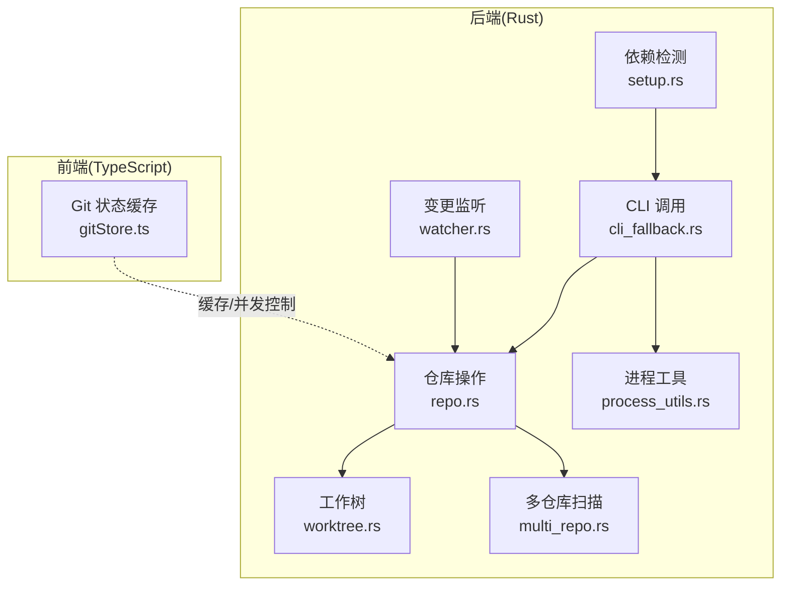
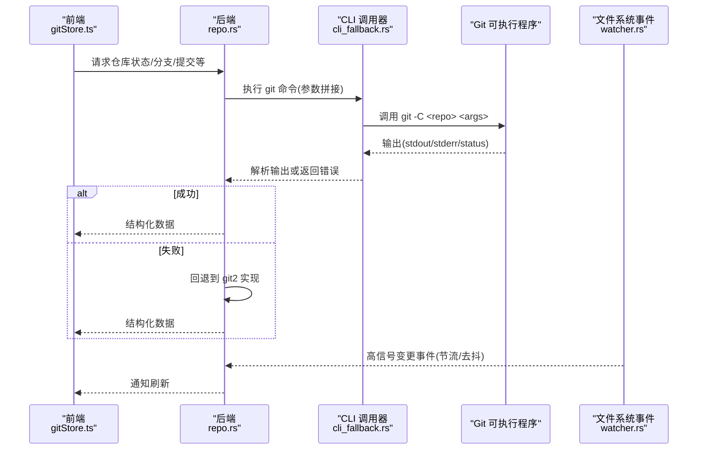
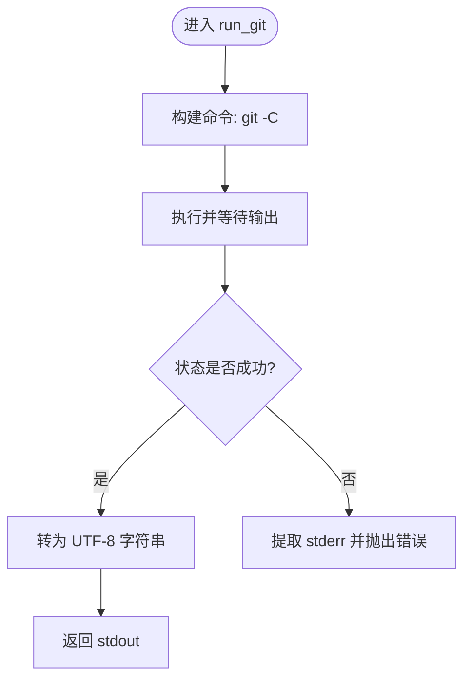
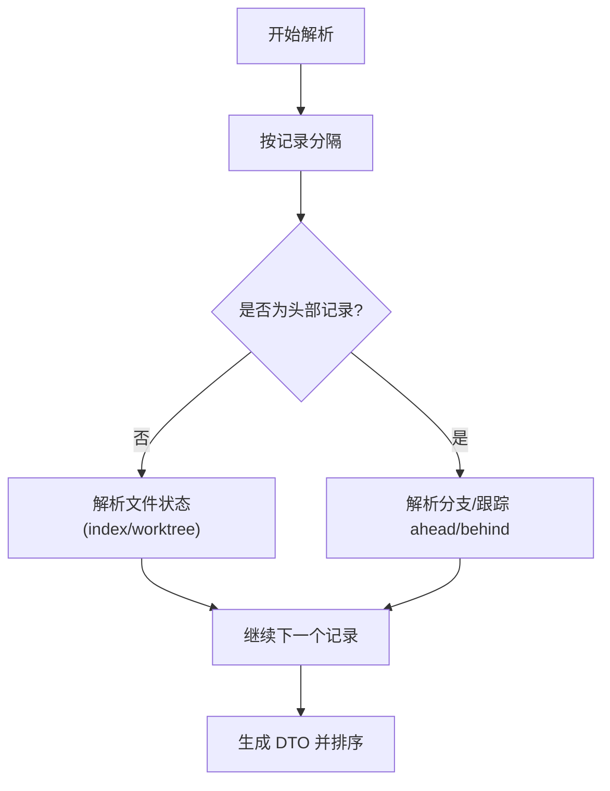
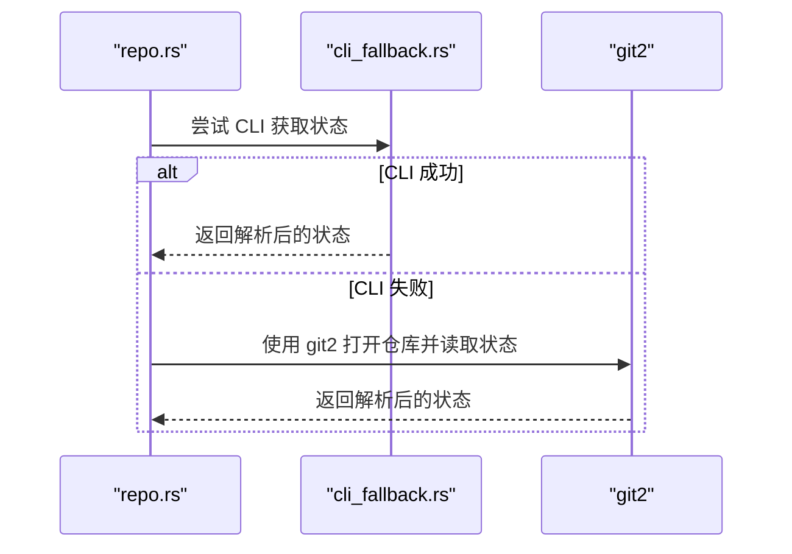
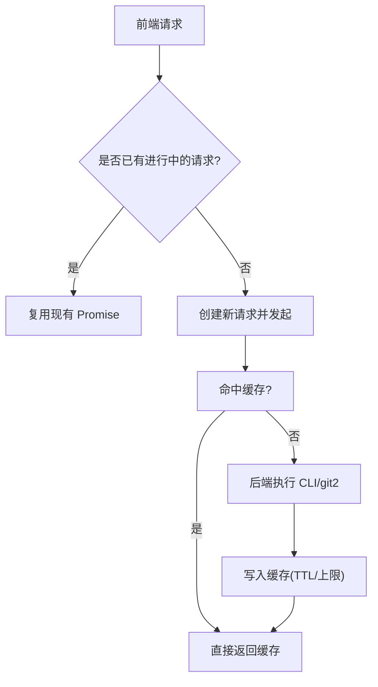
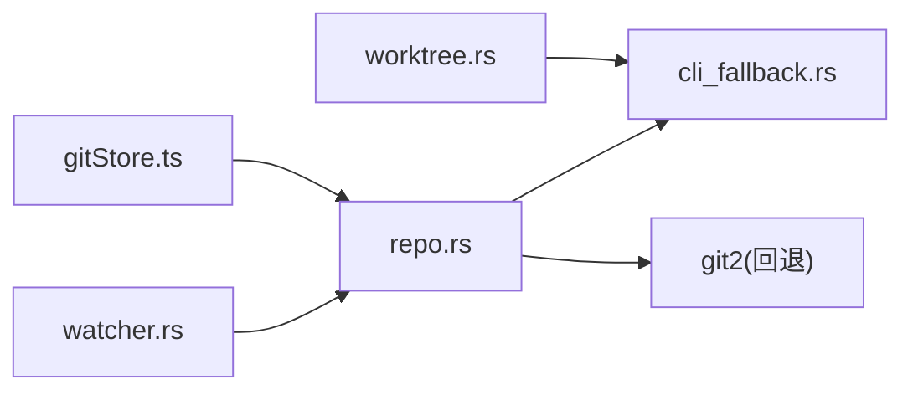

# CLI 集成

<cite>
**本文引用的文件**
- [cli_fallback.rs](file://src-tauri/src/git/cli_fallback.rs)
- [repo.rs](file://src-tauri/src/git/repo.rs)
- [process_utils.rs](file://src-tauri/src/process_utils.rs)
- [watcher.rs](file://src-tauri/src/git/watcher.rs)
- [worktree.rs](file://src-tauri/src/git/worktree.rs)
- [multi_repo.rs](file://src-tauri/src/git/multi_repo.rs)
- [setup.rs](file://src-tauri/src/commands/setup.rs)
- [gitStore.ts](file://src/stores/gitStore.ts)
- [gitStore.test.ts](file://src/stores/gitStore.test.ts)
</cite>

## 目录
1. [简介](#简介)
2. [项目结构](#项目结构)
3. [核心组件](#核心组件)
4. [架构总览](#架构总览)
5. [详细组件分析](#详细组件分析)
6. [依赖关系分析](#依赖关系分析)
7. [性能考量](#性能考量)
8. [故障排查指南](#故障排查指南)
9. [结论](#结论)
10. [附录](#附录)

## 简介
本文件系统化阐述 Panes 中 Git CLI 集成的设计与实现，覆盖命令行工具调用机制、参数传递与结果解析、CLI 降级策略、错误处理与超时管理、命令缓存与并发控制、资源限制、工具兼容性与版本检测、配置管理，以及与原生 Git 库（git2）的对比优势与适用场景。

## 项目结构
围绕 Git 的 CLI 集成主要分布在以下模块：
- 后端 Rust 模块
  - git 子模块：包含 CLI 调用、状态解析、工作树、仓库扫描、文件树缓存、变更监听等
  - process_utils：跨平台进程创建与窗口隐藏配置
  - commands/setup：依赖检测与版本查询
- 前端 TypeScript 存储层
  - gitStore：状态与差异缓存、并发去重、刷新节流

图表来源
- [cli_fallback.rs:1-29](file://src-tauri/src/git/cli_fallback.rs#L1-L29)
- [repo.rs:1-200](file://src-tauri/src/git/repo.rs#L1-L200)
- [worktree.rs:1-144](file://src-tauri/src/git/worktree.rs#L1-L144)
- [multi_repo.rs:1-236](file://src-tauri/src/git/multi_repo.rs#L1-L236)
- [watcher.rs:1-200](file://src-tauri/src/git/watcher.rs#L1-L200)
- [process_utils.rs:1-24](file://src-tauri/src/process_utils.rs#L1-L24)
- [setup.rs:115-145](file://src-tauri/src/commands/setup.rs#L115-L145)
- [gitStore.ts:1-200](file://src/stores/gitStore.ts#L1-L200)

章节来源
- [cli_fallback.rs:1-29](file://src-tauri/src/git/cli_fallback.rs#L1-L29)
- [repo.rs:1-200](file://src-tauri/src/git/repo.rs#L1-L200)
- [process_utils.rs:1-24](file://src-tauri/src/process_utils.rs#L1-L24)
- [watcher.rs:1-200](file://src-tauri/src/git/watcher.rs#L1-L200)
- [worktree.rs:1-144](file://src-tauri/src/git/worktree.rs#L1-L144)
- [multi_repo.rs:1-236](file://src-tauri/src/git/multi_repo.rs#L1-L236)
- [setup.rs:115-145](file://src-tauri/src/commands/setup.rs#L115-L145)
- [gitStore.ts:1-200](file://src/stores/gitStore.ts#L1-L200)

## 核心组件
- CLI 调用器：封装标准进程调用，统一设置运行环境与平台特性（如 Windows 隐藏窗口）
- 仓库操作：通过 CLI 读取状态、分支、提交、暂存等，并在失败时回退到 git2
- 工作树管理：基于 CLI 的工作树增删查
- 多仓库扫描：递归扫描工作区内的 Git 仓库
- 变更监听：基于文件系统事件与轮询的混合策略，过滤高信号变更
- 进程工具：跨平台进程配置
- 依赖检测：检测 Git 等外部工具是否存在及版本
- 前端缓存：按仓库维度的状态与差异缓存，带容量与字节上限、TTL 与并发去重

章节来源
- [cli_fallback.rs:1-29](file://src-tauri/src/git/cli_fallback.rs#L1-L29)
- [repo.rs:129-184](file://src-tauri/src/git/repo.rs#L129-L184)
- [worktree.rs:1-144](file://src-tauri/src/git/worktree.rs#L1-L144)
- [multi_repo.rs:1-236](file://src-tauri/src/git/multi_repo.rs#L1-L236)
- [watcher.rs:1-200](file://src-tauri/src/git/watcher.rs#L1-L200)
- [process_utils.rs:1-24](file://src-tauri/src/process_utils.rs#L1-L24)
- [setup.rs:115-145](file://src-tauri/src/commands/setup.rs#L115-L145)
- [gitStore.ts:1-200](file://src/stores/gitStore.ts#L1-L200)

## 架构总览
下图展示从前端到后端的调用链路、降级策略与缓存协同：

图表来源
- [repo.rs:129-184](file://src-tauri/src/git/repo.rs#L129-L184)
- [cli_fallback.rs:7-28](file://src-tauri/src/git/cli_fallback.rs#L7-L28)
- [watcher.rs:24-100](file://src-tauri/src/git/watcher.rs#L24-L100)
- [gitStore.ts:1-200](file://src/stores/gitStore.ts#L1-L200)

## 详细组件分析

### CLI 调用器与参数传递
- 统一入口：以仓库路径为当前目录，拼接子命令与参数，捕获 stdout/stderr/status
- 平台适配：Windows 下隐藏控制台窗口；非 Windows 平台保持默认
- 错误包装：失败时将 stderr 作为错误上下文抛出，便于上层定位

图表来源
- [cli_fallback.rs:7-28](file://src-tauri/src/git/cli_fallback.rs#L7-L28)
- [process_utils.rs:5-23](file://src-tauri/src/process_utils.rs#L5-L23)

章节来源
- [cli_fallback.rs:1-29](file://src-tauri/src/git/cli_fallback.rs#L1-L29)
- [process_utils.rs:1-24](file://src-tauri/src/process_utils.rs#L1-L24)

### 结果解析与数据模型
- 状态解析：使用 porcelain v1 输出，以空字符分隔记录，解析分支、ahead/behind 与文件状态
- 分支列表：通过 for-each-ref 与自定义格式解析，支持本地/远程分支与上游跟踪信息
- 提交日志：通过 pretty format 与分隔符解析，限制页大小与跳过/计数参数
- 工作树：通过 porcelain 列表解析，识别主工作树、锁定、可修剪等属性

图表来源
- [repo.rs:152-184](file://src-tauri/src/git/repo.rs#L152-L184)
- [repo.rs:519-624](file://src-tauri/src/git/repo.rs#L519-L624)
- [repo.rs:683-765](file://src-tauri/src/git/repo.rs#L683-L765)
- [worktree.rs:48-113](file://src-tauri/src/git/worktree.rs#L48-L113)

章节来源
- [repo.rs:152-184](file://src-tauri/src/git/repo.rs#L152-L184)
- [repo.rs:519-624](file://src-tauri/src/git/repo.rs#L519-L624)
- [repo.rs:683-765](file://src-tauri/src/git/repo.rs#L683-L765)
- [worktree.rs:48-113](file://src-tauri/src/git/worktree.rs#L48-L113)

### CLI 降级策略与错误处理
- 降级路径：优先使用 CLI；若失败则回退到 git2（例如状态读取）
- 错误语义：区分“无上游”“分离头”等特定错误，给出用户可理解的提示
- 版本检测：通过命令行输出解析版本字符串，用于依赖检测与兼容性判断

图表来源
- [repo.rs:129-134](file://src-tauri/src/git/repo.rs#L129-L134)
- [cli_fallback.rs:7-28](file://src-tauri/src/git/cli_fallback.rs#L7-L28)

章节来源
- [repo.rs:129-134](file://src-tauri/src/git/repo.rs#L129-L134)
- [setup.rs:115-145](file://src-tauri/src/commands/setup.rs#L115-L145)

### 超时管理与并发控制
- 前端并发控制：同一仓库的请求去重，避免重复拉取；不同操作并发进行但共享加载态
- 前端缓存：按仓库维度维护状态与差异缓存，带 TTL、条目数与字节上限，逐出最旧项
- 后端并发：未见显式后端并发池；通过前端去重与缓存降低后端压力

图表来源
- [gitStore.ts:96-98](file://src/stores/gitStore.ts#L96-L98)
- [gitStore.ts:139-181](file://src/stores/gitStore.ts#L139-L181)
- [gitStore.test.ts:138-156](file://src/stores/gitStore.test.ts#L138-L156)

章节来源
- [gitStore.ts:1-200](file://src/stores/gitStore.ts#L1-L200)
- [gitStore.test.ts:138-156](file://src/stores/gitStore.test.ts#L138-L156)

### 命令缓存与资源限制
- 前端缓存策略
  - 状态缓存：最大条目数、最大字节数、TTL
  - 差异缓存：最大条目数、最大字节数、TTL
  - 逐出策略：按更新时间淘汰最旧项
- 资源限制
  - 文件树扫描：超时、页大小限制、排除目录集合
  - 分支/提交列表：页大小上限

章节来源
- [gitStore.ts:15-25](file://src/stores/gitStore.ts#L15-L25)
- [gitStore.ts:139-181](file://src/stores/gitStore.ts#L139-L181)
- [repo.rs:22-51](file://src-tauri/src/git/repo.rs#L22-L51)

### 工具兼容性、版本检测与配置管理
- 兼容性与版本检测：通过 resolve_executable 与 shell 探测，执行 --version 获取版本字符串
- 配置管理：Windows 隐藏控制台窗口；其他平台保持默认；工作树/多仓库扫描不依赖额外配置
- 依赖检测：对 git、node 等工具进行存在性与版本检查

章节来源
- [setup.rs:115-145](file://src-tauri/src/commands/setup.rs#L115-L145)
- [process_utils.rs:1-24](file://src-tauri/src/process_utils.rs#L1-L24)
- [multi_repo.rs:1-236](file://src-tauri/src/git/multi_repo.rs#L1-L236)

### 与原生 Git 库的对比优势与使用场景
- 优势
  - 一致性：与终端行为一致，便于调试与复现
  - 功能覆盖：通过 porcelain 输出简化解析；支持复杂格式与多字段解析
  - 降级稳健：CLI 失败时自动回退到 git2，保证可用性
- 使用场景
  - 需要与用户 shell 环境一致的行为时（PATH、别名、钩子）
  - 对 porcelain 输出有强依赖的解析逻辑
  - 需要快速迭代与最小改动的场景

章节来源
- [repo.rs:129-134](file://src-tauri/src/git/repo.rs#L129-L134)
- [repo.rs:136-150](file://src-tauri/src/git/repo.rs#L136-L150)

## 依赖关系分析
- 组件耦合
  - repo.rs 依赖 cli_fallback.rs 进行命令执行，同时在失败时依赖 git2
  - worktree.rs 与 repo.rs 通过 CLI 协同工作
  - watcher.rs 与 repo.rs 通过回调联动，减少不必要的后端调用
- 外部依赖
  - Git 可执行程序
  - notify 与 PollWatcher（文件系统事件与轮询）
  - git2（回退实现）

图表来源
- [repo.rs:1-200](file://src-tauri/src/git/repo.rs#L1-L200)
- [cli_fallback.rs:1-29](file://src-tauri/src/git/cli_fallback.rs#L1-L29)
- [worktree.rs:1-144](file://src-tauri/src/git/worktree.rs#L1-L144)
- [watcher.rs:1-200](file://src-tauri/src/git/watcher.rs#L1-L200)
- [gitStore.ts:1-200](file://src/stores/gitStore.ts#L1-L200)

章节来源
- [repo.rs:1-200](file://src-tauri/src/git/repo.rs#L1-L200)
- [cli_fallback.rs:1-29](file://src-tauri/src/git/cli_fallback.rs#L1-L29)
- [worktree.rs:1-144](file://src-tauri/src/git/worktree.rs#L1-L144)
- [watcher.rs:1-200](file://src-tauri/src/git/watcher.rs#L1-L200)
- [gitStore.ts:1-200](file://src/stores/gitStore.ts#L1-L200)

## 性能考量
- 前端缓存
  - TTL 与上限控制内存占用，逐出策略避免无限增长
  - 通过修订号与键空间隔离，避免脏读
- 后端优化
  - porcelain 输出减少解析成本
  - 事件监听仅关注高信号路径，降低无效刷新
- 并发与去重
  - 前端去重避免重复 IO
  - 后端未见显式并发池，建议在需要时引入任务队列或限流

## 故障排查指南
- 常见问题
  - 无上游分支：push/pull 时提示需设置上游或先推送建立追踪
  - 分离头：在分离头状态下无法直接 push，需检出本地分支
  - 权限不足：Windows 控制台窗口被隐藏，可通过 shell 直接运行验证
- 定位方法
  - 查看 CLI 输出与错误上下文
  - 在失败时观察是否触发 git2 回退
  - 检查前端缓存是否命中或过期

章节来源
- [repo.rs:477-517](file://src-tauri/src/git/repo.rs#L477-L517)
- [cli_fallback.rs:22-25](file://src-tauri/src/git/cli_fallback.rs#L22-L25)
- [process_utils.rs:5-23](file://src-tauri/src/process_utils.rs#L5-L23)

## 结论
该 Git CLI 集成以“CLI 优先、git2 回退”的策略，在功能覆盖、行为一致性与稳健性之间取得平衡。配合前端缓存与并发控制，有效降低了 IO 压力并提升了交互体验。对于需要与终端一致性的场景，CLI 路径更具优势；当需要更强的解析灵活性或在受限环境中，git2 回退提供了可靠的兜底方案。

## 附录
- 关键流程图（算法实现）
  - 状态解析流程：见“结果解析与数据模型”
  - 命令执行流程：见“CLI 调用器与参数传递”
  - 缓存与并发流程：见“超时管理与并发控制”