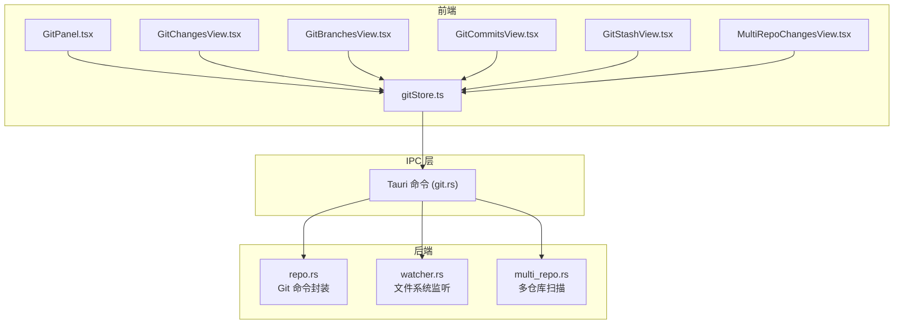
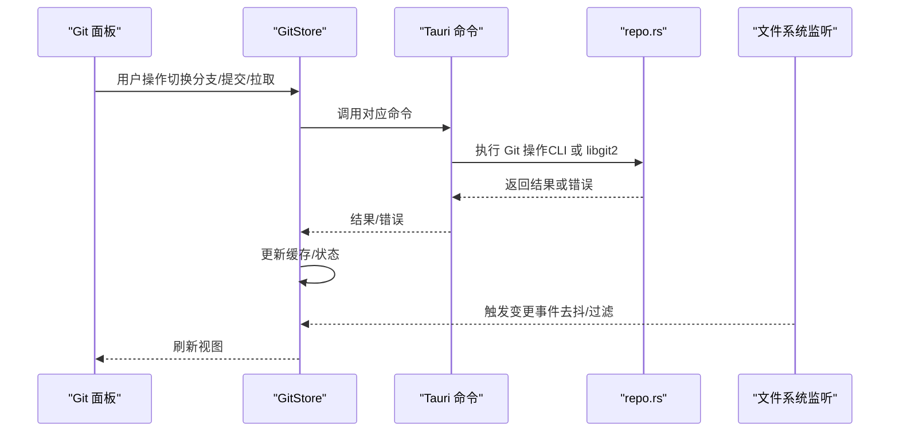
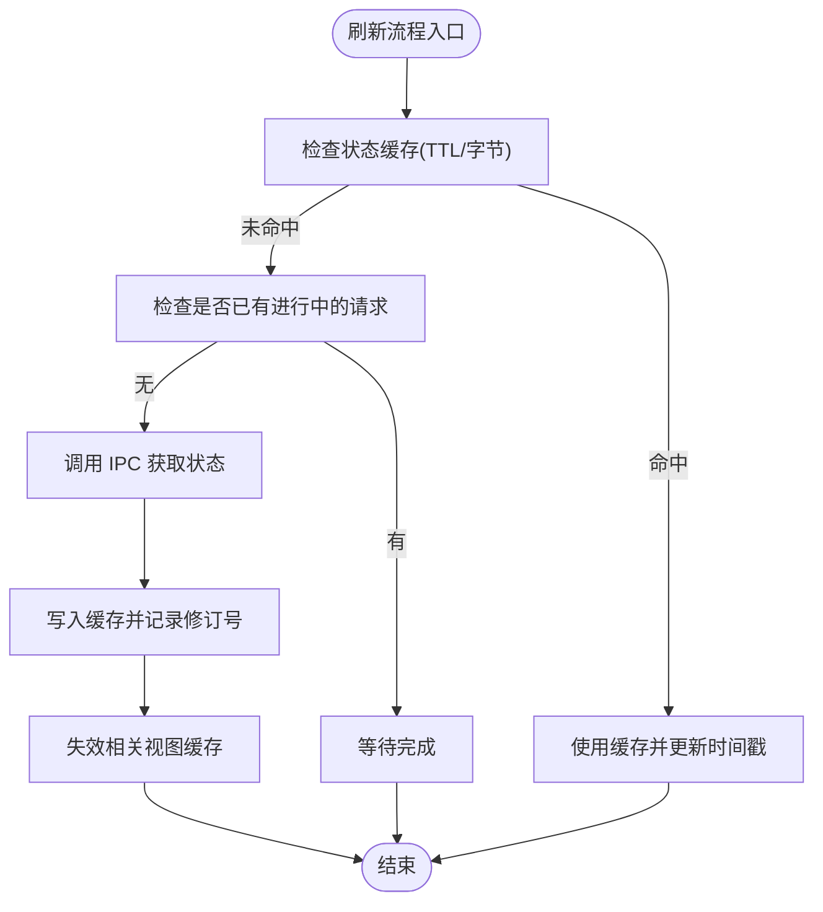
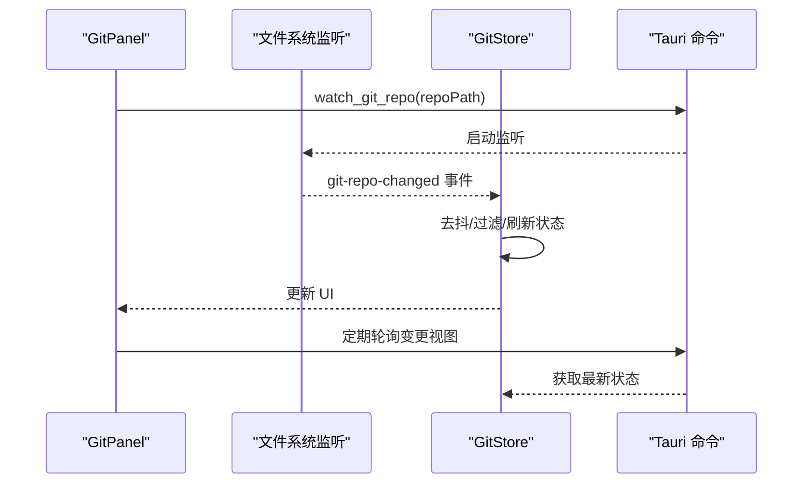
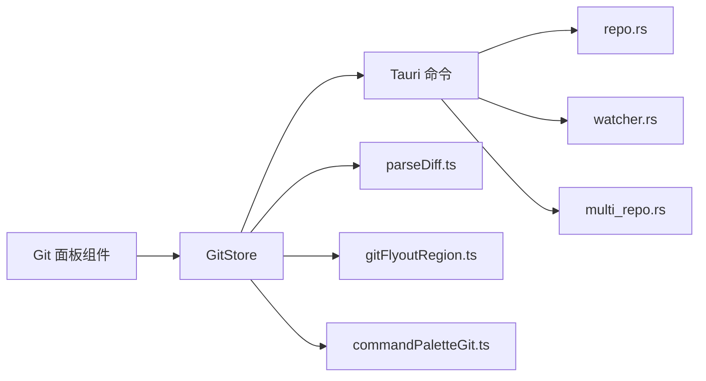

# Git 集成

<cite>
**本文档引用的文件**
- [gitStore.ts](file://src/stores/gitStore.ts)
- [GitPanel.tsx](file://src/components/git/GitPanel.tsx)
- [GitChangesView.tsx](file://src/components/git/GitChangesView.tsx)
- [MultiRepoChangesView.tsx](file://src/components/git/MultiRepoChangesView.tsx)
- [GitBranchesView.tsx](file://src/components/git/GitBranchesView.tsx)
- [GitCommitsView.tsx](file://src/components/git/GitCommitsView.tsx)
- [GitStashView.tsx](file://src/components/git/GitStashView.tsx)
- [commandPaletteGit.ts](file://src/lib/commandPaletteGit.ts)
- [gitFlyoutRegion.ts](file://src/lib/gitFlyoutRegion.ts)
- [parseDiff.ts](file://src/lib/parseDiff.ts)
- [git.rs](file://src-tauri/src/commands/git.rs)
- [repo.rs](file://src-tauri/src/git/repo.rs)
- [multi_repo.rs](file://src-tauri/src/git/multi_repo.rs)
- [watcher.rs](file://src-tauri/src/git/watcher.rs)
- [mod.rs](file://src-tauri/src/git/mod.rs)
</cite>

## 目录
1. [简介](#简介)
2. [项目结构](#项目结构)
3. [核心组件](#核心组件)
4. [架构总览](#架构总览)
5. [详细组件分析](#详细组件分析)
6. [依赖关系分析](#依赖关系分析)
7. [性能考量](#性能考量)
8. [故障排除指南](#故障排除指南)
9. [结论](#结论)

## 简介
本文件系统性阐述 Panes 的 Git 集成功能，覆盖仓库管理、命令执行、状态跟踪与事件监听机制；详解多仓库支持、分支操作、提交历史、差异查看与合并冲突处理；并给出 CLI 与库混合使用策略、性能优化与错误处理建议，以及与外部 Git 工具的兼容性与版本控制策略。

## 项目结构
前端采用 React + Zustand 状态管理，后端基于 Tauri 使用 Rust 实现 Git 命令封装与文件系统监听。整体分为三层：
- 视图层：Git 面板与各子视图（变更、分支、提交、暂存、工作树）
- 状态层：Zustand Git Store 统一管理仓库状态、缓存与异步操作
- 命令层：Tauri 命令桥接前端与后端，Rust 模块负责 Git 操作与文件监听

图表来源
- [GitPanel.tsx:1-864](file://src/components/git/GitPanel.tsx#L1-L864)
- [gitStore.ts:1-1132](file://src/stores/gitStore.ts#L1-L1132)
- [git.rs:1-559](file://src-tauri/src/commands/git.rs#L1-L559)
- [repo.rs:1-2178](file://src-tauri/src/git/repo.rs#L1-L2178)
- [watcher.rs:1-519](file://src-tauri/src/git/watcher.rs#L1-L519)
- [multi_repo.rs:1-236](file://src-tauri/src/git/multi_repo.rs#L1-L236)

章节来源
- [GitPanel.tsx:1-864](file://src/components/git/GitPanel.tsx#L1-L864)
- [gitStore.ts:1-1132](file://src/stores/gitStore.ts#L1-L1132)
- [git.rs:1-559](file://src-tauri/src/commands/git.rs#L1-L559)

## 核心组件
- GitStore（Zustand）：集中管理仓库状态、缓存、分页加载、视图刷新与远程同步状态；提供统一的 Git 操作入口。
- 各视图组件：变更、分支、提交、暂存、工作树等视图，负责用户交互与数据展示。
- Tauri 命令：将前端请求转发到 Rust 后端，执行 Git 操作并返回结果。
- Rust Git 模块：封装 Git 命令与 libgit2 双通道，实现状态读取、差异生成、分支/提交/暂存操作、工作树管理与文件树缓存。
- 文件系统监听：基于 notify/Polling 的智能监听，仅对高信号 Git 元数据路径进行事件过滤与去抖。

章节来源
- [gitStore.ts:1-1132](file://src/stores/gitStore.ts#L1-L1132)
- [GitPanel.tsx:1-864](file://src/components/git/GitPanel.tsx#L1-L864)
- [git.rs:1-559](file://src-tauri/src/commands/git.rs#L1-L559)
- [repo.rs:1-2178](file://src-tauri/src/git/repo.rs#L1-L2178)
- [watcher.rs:1-519](file://src-tauri/src/git/watcher.rs#L1-L519)

## 架构总览
前端通过 GitStore 调用 IPC 命令，后端在 Rust 中优先使用 Git CLI 解析（高性能），失败时回退至 libgit2；同时维护文件树缓存与 Git 状态缓存，结合文件系统监听与轮询策略，确保 UI 实时更新且性能可控。

图表来源
- [gitStore.ts:1-1132](file://src/stores/gitStore.ts#L1-L1132)
- [git.rs:1-559](file://src-tauri/src/commands/git.rs#L1-L559)
- [repo.rs:1-2178](file://src-tauri/src/git/repo.rs#L1-L2178)
- [watcher.rs:1-519](file://src-tauri/src/git/watcher.rs#L1-L519)

## 详细组件分析

### GitStore：状态管理与缓存
- 缓存策略
  - GitStatus 缓存：按仓库路径缓存状态，带 TTL 与字节上限，避免频繁调用。
  - Diff 缓存：以“仓库路径::是否已暂存::文件路径”为键，同样带 TTL 与字节限制。
  - 去重与淘汰：LRU 式淘汰，优先移除最旧条目。
- 并发与序列化
  - 请求序列号与 in-flight 映射，避免竞态与重复请求。
  - 远程同步动作（fetch/pull/push）期间设置全局状态，防止 UI 冲突。
- 多仓库上下文
  - 支持主仓库与工作树路径切换，自动修正操作目标。
  - 提供“当前仓库激活”的判断逻辑，保证 UI 一致性。
- 分页与搜索
  - 分支/提交列表分页加载，支持搜索与偏移。
- Draft 历史
  - 提交信息与分支名称历史记录，跨会话持久化于本地存储。

图表来源
- [gitStore.ts:1-1132](file://src/stores/gitStore.ts#L1-L1132)

章节来源
- [gitStore.ts:1-1132](file://src/stores/gitStore.ts#L1-L1132)

### GitPanel：面板与事件监听
- 多仓库与工作树
  - 自动激活工作区内的所有仓库；支持主仓库与工作树切换。
  - 在多仓库“变更”视图中，渲染每个仓库的状态并支持批量刷新。
- 文件系统监听与轮询
  - 对仓库 .git 目录建立监听，仅对高信号路径（HEAD、index、refs/*、FETCH_HEAD、packed-refs、stash）发出事件。
  - 变更视图下高频去抖（约 550ms），后台视图低频去抖（约 1100ms）。
  - 工作树变更在变更视图下每 5 秒轮询一次，避免递归监听大型忽略目录。
- 远程同步
  - 支持单仓库与多仓库的 fetch/pull/push，并显示进度与错误。
- 初始化仓库
  - 当工作区根目录非 Git 仓库时，提供初始化提示与一键初始化。

图表来源
- [GitPanel.tsx:1-864](file://src/components/git/GitPanel.tsx#L1-L864)
- [git.rs:330-350](file://src-tauri/src/commands/git.rs#L330-L350)
- [watcher.rs:1-519](file://src-tauri/src/git/watcher.rs#L1-L519)

章节来源
- [GitPanel.tsx:1-864](file://src/components/git/GitPanel.tsx#L1-L864)
- [git.rs:330-350](file://src-tauri/src/commands/git.rs#L330-L350)
- [watcher.rs:1-519](file://src-tauri/src/git/watcher.rs#L1-L519)

### GitChangesView：变更与差异
- 变更树
  - 将工作树与暂存区文件按目录折叠，支持展开/折叠、批量操作（全部暂存/取消暂存/丢弃）。
  - 支持目录级暂存/取消暂存，减少逐文件操作。
- 差异预览
  - 通过缓存的 Diff 预览渲染，支持截断提示与字节数统计。
  - 差异解析由独立模块完成，支持添加/删除/上下文行分类与着色。
- 提交草稿
  - 提交信息草稿与历史记录，支持上下方向键浏览历史。
- 交互
  - 点击文件打开编辑器；右键菜单支持打开/暂存/取消暂存/丢弃。

章节来源
- [GitChangesView.tsx:1-752](file://src/components/git/GitChangesView.tsx#L1-L752)
- [parseDiff.ts:1-175](file://src/lib/parseDiff.ts#L1-L175)

### MultiRepoChangesView：多仓库变更
- 并行状态获取
  - 使用 Promise.allSettled 并发获取多个仓库状态，失败项不阻塞其他仓库。
- 去抖与轮询
  - 单仓库监听与轮询策略一致，避免过度刷新。
- 自动展开脏仓库
  - 首次加载时自动展开存在变更或需要同步的仓库，提升可用性。

章节来源
- [MultiRepoChangesView.tsx:1-1122](file://src/components/git/MultiRepoChangesView.tsx#L1-L1122)

### GitBranchesView：分支管理
- 分支范围与搜索
  - 支持本地/远程分支切换，搜索过滤与分页加载。
- 操作
  - 新建、重命名、删除分支；支持从远程跟踪分支检出。
- 草稿与历史
  - 分支名草稿与历史记录，便于快速输入常用分支名。

章节来源
- [GitBranchesView.tsx:1-635](file://src/components/git/GitBranchesView.tsx#L1-L635)

### GitCommitsView：提交历史
- 分页与筛选
  - 默认加载最近提交，支持按主题/哈希/作者筛选。
- 差异查看
  - 点击提交加载其差异，支持大文件差异的懒加载与空差异提示。

章节来源
- [GitCommitsView.tsx:1-236](file://src/components/git/GitCommitsView.tsx#L1-L236)

### GitStashView：暂存与恢复
- 操作
  - 推送暂存（需工作区有变更）、应用/弹出暂存。
- 过滤
  - 支持按名称/分支提示筛选暂存条目。

章节来源
- [GitStashView.tsx:1-266](file://src/components/git/GitStashView.tsx#L1-L266)

### 命令行与库混合策略
- 前端通过 IPC 调用后端命令，后端统一在 repo.rs 中实现：
  - 优先使用 Git CLI（run_git）解析输出，性能高且兼容性强。
  - 失败时回退至 libgit2（git2）实现，保证在受限环境下的可用性。
- 优点
  - 兼容不同 Git 版本与平台差异。
  - 保持与系统 Git 行为一致，降低学习成本。
- 注意
  - CLI 输出解析需严格处理边界情况（如重命名/复制、二进制文件、冲突状态）。

章节来源
- [repo.rs:1-2178](file://src-tauri/src/git/repo.rs#L1-L2178)
- [git.rs:1-559](file://src-tauri/src/commands/git.rs#L1-L559)

### 多仓库支持与工作树
- 多仓库扫描
  - 递归扫描工作区，检测 .git 目录并识别仓库，默认分支推断。
- 工作树
  - 支持添加/列出/移除工作树，必要时确保 .gitignore 中包含 .panes/。
  - GitPanel 支持在主仓库与工作树之间切换，操作目标自动修正。

章节来源
- [multi_repo.rs:1-236](file://src-tauri/src/git/multi_repo.rs#L1-L236)
- [git.rs:352-444](file://src-tauri/src/commands/git.rs#L352-L444)
- [GitPanel.tsx:1-864](file://src/components/git/GitPanel.tsx#L1-L864)

### 差异解析与冲突处理
- 差异解析
  - 将 Git diff 输出解析为结构化行，区分添加/删除/上下文/块头/元数据。
  - 支持多文件 diff 与文件头过滤，避免重复渲染。
- 冲突状态
  - 状态解析中识别冲突文件（如 U、DD、AU 等），并在 UI 中标记。
  - 比较视图对二进制/冲突文件提供不可编辑提示。

章节来源
- [parseDiff.ts:1-175](file://src/lib/parseDiff.ts#L1-L175)
- [repo.rs:1-2178](file://src-tauri/src/git/repo.rs#L1-L2178)

## 依赖关系分析

图表来源
- [gitStore.ts:1-1132](file://src/stores/gitStore.ts#L1-L1132)
- [git.rs:1-559](file://src-tauri/src/commands/git.rs#L1-L559)
- [repo.rs:1-2178](file://src-tauri/src/git/repo.rs#L1-L2178)
- [watcher.rs:1-519](file://src-tauri/src/git/watcher.rs#L1-L519)
- [multi_repo.rs:1-236](file://src-tauri/src/git/multi_repo.rs#L1-L236)
- [parseDiff.ts:1-175](file://src/lib/parseDiff.ts#L1-L175)
- [gitFlyoutRegion.ts:1-42](file://src/lib/gitFlyoutRegion.ts#L1-L42)
- [commandPaletteGit.ts:1-45](file://src/lib/commandPaletteGit.ts#L1-L45)

章节来源
- [gitStore.ts:1-1132](file://src/stores/gitStore.ts#L1-L1132)
- [git.rs:1-559](file://src-tauri/src/commands/git.rs#L1-L559)

## 性能考量
- 缓存与去抖
  - 状态与差异缓存配合 TTL 与字节上限，避免重复 IO。
  - 文件系统监听事件去抖窗口约 550–1100ms，后台轮询间隔 5–8 秒，平衡实时性与性能。
- 并发与批处理
  - 多仓库并发获取状态，批量文件操作（暂存/取消暂存/丢弃）减少 IPC 次数。
- 解析与渲染
  - 差异解析与虚拟化渲染，避免大文件导致 UI 卡顿。
- 文件树缓存
  - 文件树缓存带 TTL，针对工作区与仓库根路径分别缓存，减少扫描开销。

章节来源
- [gitStore.ts:1-1132](file://src/stores/gitStore.ts#L1-L1132)
- [watcher.rs:1-519](file://src-tauri/src/git/watcher.rs#L1-L519)
- [repo.rs:1-2178](file://src-tauri/src/git/repo.rs#L1-L2178)

## 故障排除指南
- 无法连接/权限问题
  - 检查 Git CLI 是否可执行与 PATH 设置；确认仓库路径权限。
- 监听失败或无响应
  - Linux 下可能触发 inotify 限制，监听器会自动降级为轮询模式；适当增大系统限制或减少监控路径。
- 无上游分支导致拉取/推送失败
  - 拉取：若无上游，先切换到跟踪分支或执行推送以设置上游。
  - 推送：若无上游，自动尝试设置并推送。
- 冲突文件无法编辑
  - 冲突文件与二进制文件在比较视图中不可编辑，需先解决冲突或使用外部工具。
- 多仓库未显示
  - 确认工作区根路径正确，仓库扫描深度与权限设置；首次进入会自动激活所有仓库。

章节来源
- [git.rs:470-559](file://src-tauri/src/commands/git.rs#L470-L559)
- [repo.rs:1-2178](file://src-tauri/src/git/repo.rs#L1-L2178)
- [watcher.rs:1-519](file://src-tauri/src/git/watcher.rs#L1-L519)

## 结论
Panes 的 Git 集成通过“前端状态管理 + IPC 命令 + Rust 后端”的架构实现了高性能、稳定的 Git 操作体验。双通道（CLI 与 libgit2）与智能缓存、监听与轮询策略共同保障了实时性与性能；多仓库与工作树支持满足复杂开发场景需求；完善的错误处理与兼容性设计降低了使用门槛。