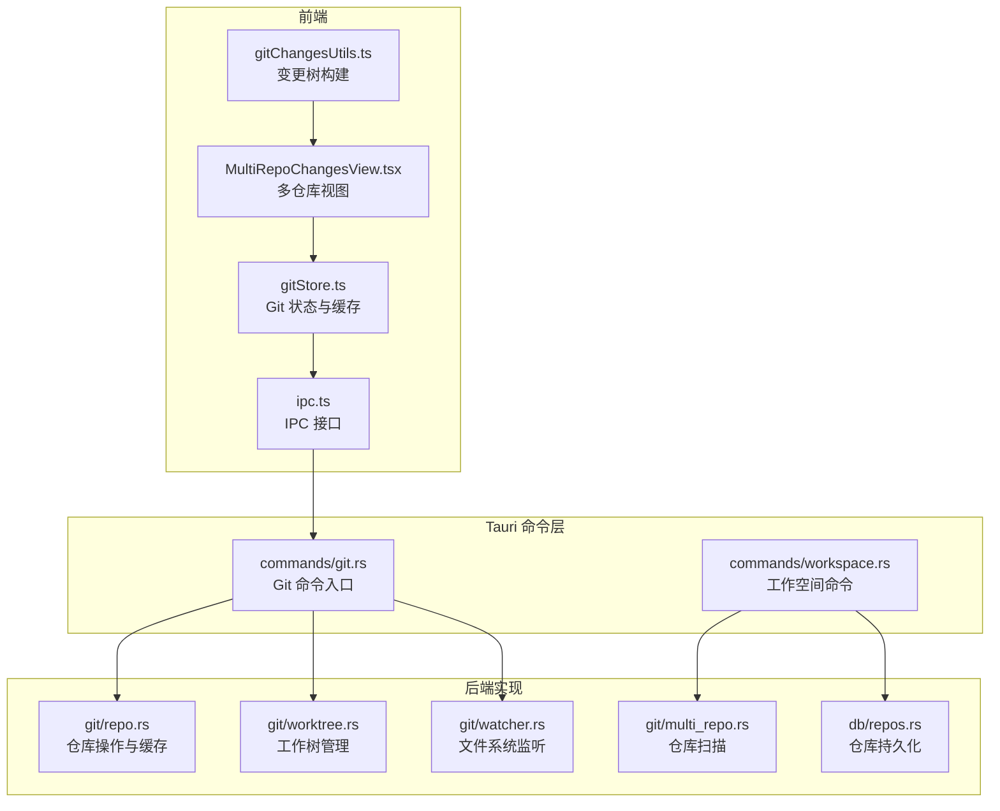
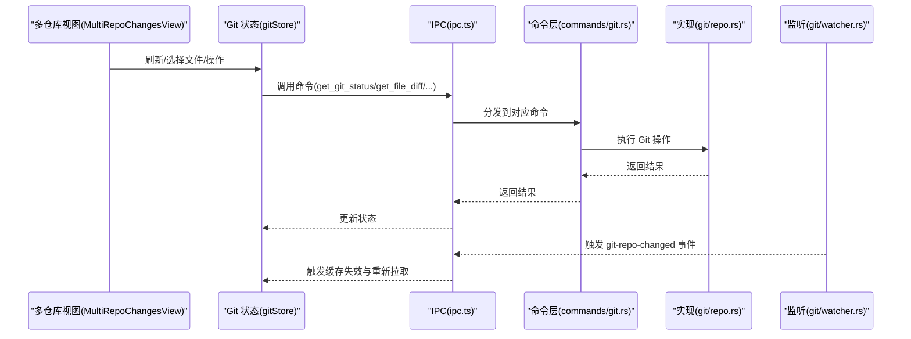
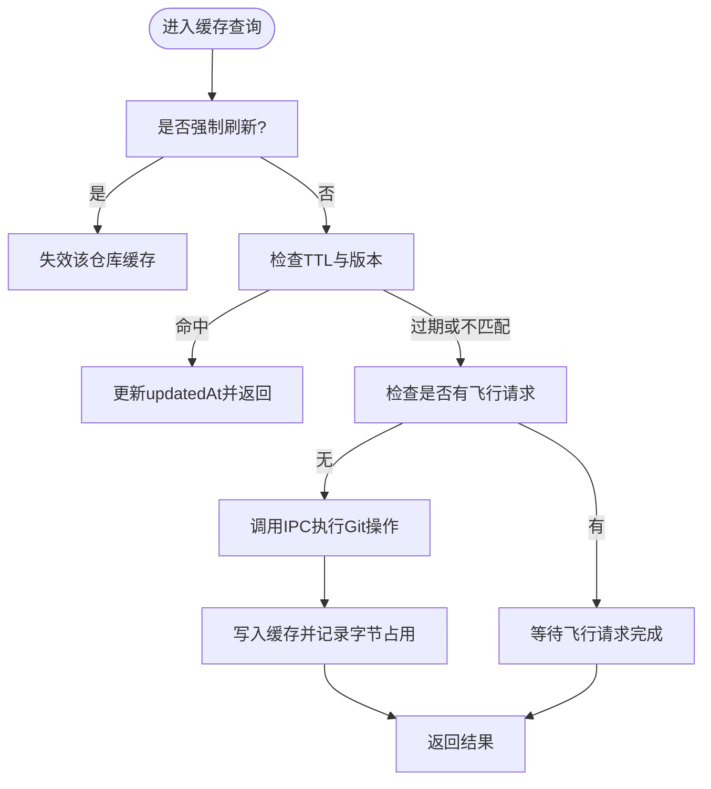
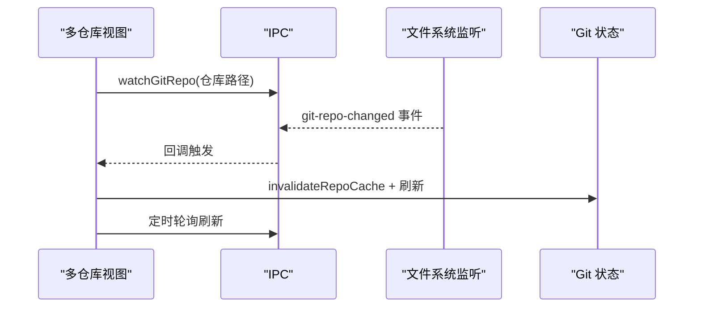
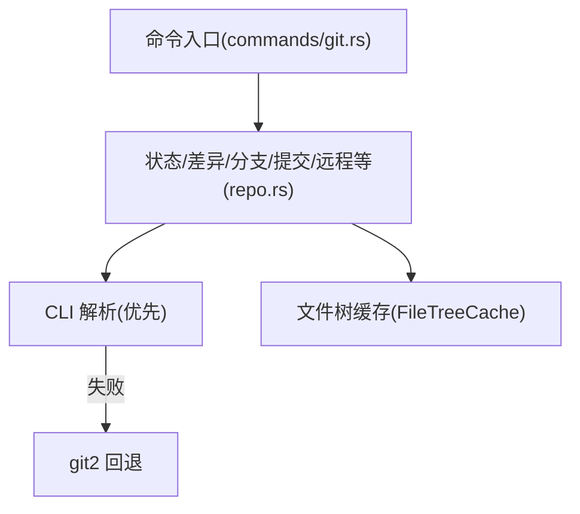
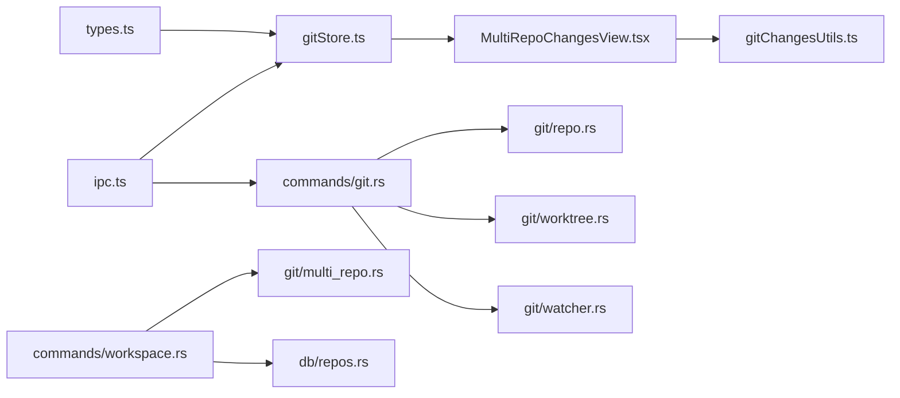
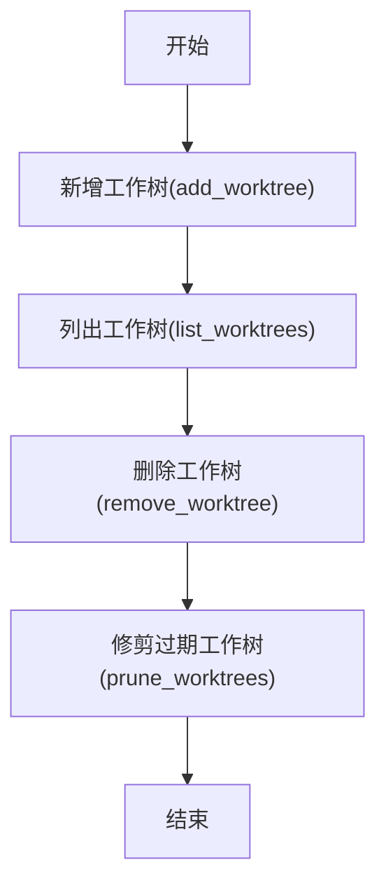

# 仓库管理

<cite>
**本文档引用的文件**
- [gitStore.ts](file://src/stores/gitStore.ts)
- [MultiRepoChangesView.tsx](file://src/components/git/MultiRepoChangesView.tsx)
- [gitChangesUtils.ts](file://src/components/git/gitChangesUtils.ts)
- [git.rs](file://src-tauri/src/commands/git.rs)
- [repo.rs](file://src-tauri/src/git/repo.rs)
- [multi_repo.rs](file://src-tauri/src/git/multi_repo.rs)
- [watcher.rs](file://src-tauri/src/git/watcher.rs)
- [worktree.rs](file://src-tauri/src/git/worktree.rs)
- [types.ts](file://src/types.ts)
- [ipc.ts](file://src/lib/ipc.ts)
- [workspace.rs](file://src-tauri/src/commands/workspace.rs)
- [repos.rs](file://src-tauri/src/db/repos.rs)
</cite>

## 目录
1. [简介](#简介)
2. [项目结构](#项目结构)
3. [核心组件](#核心组件)
4. [架构总览](#架构总览)
5. [详细组件分析](#详细组件分析)
6. [依赖关系分析](#依赖关系分析)
7. [性能考量](#性能考量)
8. [故障排除指南](#故障排除指南)
9. [结论](#结论)
10. [附录](#附录)

## 简介
本文件系统性阐述 Panes 中的 Git 仓库管理能力，覆盖单仓库与多仓库支持、仓库初始化与扫描、克隆流程（通过外部工具）、配置与状态监控、仓库发现机制、路径解析与工作树管理、状态跟踪与变更检测、缓存策略、最佳实践、性能优化与错误处理，以及与工作空间的集成与多仓库协调机制。

## 项目结构
仓库管理相关代码横跨前端 Store、UI 组件、IPC 命令层与 Rust 后端实现，形成“前端状态与交互 → IPC → Tauri 命令 → Git 操作”的分层架构；同时后端包含文件树缓存、工作树管理、仓库扫描与文件系统监听等子模块。

**图表来源**
- [gitStore.ts:1-120](file://src/stores/gitStore.ts#L1-L120)
- [MultiRepoChangesView.tsx:1-120](file://src/components/git/MultiRepoChangesView.tsx#L1-L120)
- [gitChangesUtils.ts:1-60](file://src/components/git/gitChangesUtils.ts#L1-L60)
- [git.rs:1-120](file://src-tauri/src/commands/git.rs#L1-L120)
- [repo.rs:1-120](file://src-tauri/src/git/repo.rs#L1-L120)
- [worktree.rs:1-60](file://src-tauri/src/git/worktree.rs#L1-L60)
- [watcher.rs:1-60](file://src-tauri/src/git/watcher.rs#L1-L60)
- [multi_repo.rs:1-60](file://src-tauri/src/git/multi_repo.rs#L1-L60)
- [workspace.rs:40-66](file://src-tauri/src/commands/workspace.rs#L40-L66)
- [repos.rs:101-123](file://src-tauri/src/db/repos.rs#L101-L123)

**章节来源**
- [gitStore.ts:1-120](file://src/stores/gitStore.ts#L1-L120)
- [git.rs:1-120](file://src-tauri/src/commands/git.rs#L1-L120)

## 核心组件
- 前端 Git 状态与缓存：集中于 gitStore，负责仓库状态缓存、差异缓存、活动视图刷新节流、草稿历史、与 IPC 的交互。
- 多仓库视图：MultiRepoChangesView 负责多仓库聚合展示、轮询与监听触发的状态刷新、目录折叠与批量操作。
- 变更树工具：gitChangesUtils 提供变更文件树构建、目录映射与状态标签转换。
- IPC 层：ipc.ts 定义前端调用的命令接口，统一与后端通信。
- 后端命令：commands/git.rs 将前端请求路由到具体 Git 操作实现。
- 仓库操作：git/repo.rs 实现状态读取、差异预览、分支/提交/stash/远程等操作，并内置文件树缓存。
- 工作树：git/worktree.rs 提供工作树增删查与修剪。
- 文件系统监听：git/watcher.rs 提供高信号事件过滤与去抖动，避免过度刷新。
- 仓库扫描：git/multi_repo.rs 扫描工作空间下的仓库并推断默认分支。
- 工作空间集成：commands/workspace.rs 在打开工作空间时扫描并持久化仓库列表。

**章节来源**
- [gitStore.ts:351-430](file://src/stores/gitStore.ts#L351-L430)
- [MultiRepoChangesView.tsx:56-125](file://src/components/git/MultiRepoChangesView.tsx#L56-L125)
- [gitChangesUtils.ts:32-123](file://src/components/git/gitChangesUtils.ts#L32-L123)
- [ipc.ts:106-126](file://src/lib/ipc.ts#L106-L126)
- [git.rs:15-559](file://src-tauri/src/commands/git.rs#L15-L559)
- [repo.rs:129-134](file://src-tauri/src/git/repo.rs#L129-L134)
- [worktree.rs:9-144](file://src-tauri/src/git/worktree.rs#L9-L144)
- [watcher.rs:24-100](file://src-tauri/src/git/watcher.rs#L24-L100)
- [multi_repo.rs:12-69](file://src-tauri/src/git/multi_repo.rs#L12-L69)
- [workspace.rs:40-66](file://src-tauri/src/commands/workspace.rs#L40-L66)
- [repos.rs:101-123](file://src-tauri/src/db/repos.rs#L101-L123)

## 架构总览
下图展示了从用户操作到 Git 命令执行与状态更新的完整链路，包括缓存与监听机制：

**图表来源**
- [MultiRepoChangesView.tsx:154-231](file://src/components/git/MultiRepoChangesView.tsx#L154-L231)
- [gitStore.ts:522-620](file://src/stores/gitStore.ts#L522-L620)
- [ipc.ts:106-126](file://src/lib/ipc.ts#L106-L126)
- [git.rs:15-121](file://src-tauri/src/commands/git.rs#L15-L121)
- [repo.rs:129-134](file://src-tauri/src/git/repo.rs#L129-L134)
- [watcher.rs:320-361](file://src-tauri/src/git/watcher.rs#L320-L361)

## 详细组件分析

### 组件一：Git 状态与缓存（gitStore）
- 缓存策略
  - 仓库状态缓存：按仓库路径键值缓存，带 TTL 与条目上限，支持字节级大小限制，LRU 驱逐。
  - 差异缓存：以“仓库路径+是否暂存+文件路径”为键，同样带 TTL 与上限。
  - 并发控制：同一仓库的并发请求合并为一次飞行请求，完成后清理。
  - 活动视图刷新节流：对非 Changes 视图设置最小刷新间隔，避免频繁刷新。
- 草稿与历史：本地存储提交信息与分支名历史，支持工作区隔离。
- 仓库修订号：每次缓存失效时递增，确保缓存一致性。
- 与 IPC 的交互：封装所有 Git 操作的调用与错误处理，统一 loading/error 状态。

**图表来源**
- [gitStore.ts:259-300](file://src/stores/gitStore.ts#L259-L300)
- [gitStore.ts:302-349](file://src/stores/gitStore.ts#L302-L349)
- [gitStore.ts:139-181](file://src/stores/gitStore.ts#L139-L181)

**章节来源**
- [gitStore.ts:82-250](file://src/stores/gitStore.ts#L82-L250)
- [gitStore.ts:259-349](file://src/stores/gitStore.ts#L259-L349)
- [gitStore.ts:351-430](file://src/stores/gitStore.ts#L351-L430)

### 组件二：多仓库视图与状态监控（MultiRepoChangesView）
- 多仓库聚合：按仓库名称排序，脏仓库优先展开，支持一键展开/折叠。
- 轮询与监听：结合文件系统监听与定时轮询，对可见仓库进行去抖动刷新。
- 事件驱动：接收 git-repo-changed 事件，延迟触发刷新，避免频繁 IO。
- 批量操作：支持阶段/取消阶段/丢弃全部/按目录批量操作，保持与状态缓存一致。

**图表来源**
- [MultiRepoChangesView.tsx:166-262](file://src/components/git/MultiRepoChangesView.tsx#L166-L262)
- [git.rs:330-350](file://src-tauri/src/commands/git.rs#L330-L350)

**章节来源**
- [MultiRepoChangesView.tsx:56-341](file://src/components/git/MultiRepoChangesView.tsx#L56-L341)
- [git.rs:330-350](file://src-tauri/src/commands/git.rs#L330-L350)

### 组件三：变更树构建与状态标签（gitChangesUtils）
- 目录映射：基于路径分割生成目录到文件的映射，便于目录级批量操作。
- 树形渲染：构建有序的目录与文件行，支持折叠/展开与深度控制。
- 状态标签：将 Git 状态映射为图标与样式类，提升可读性。

**章节来源**
- [gitChangesUtils.ts:32-144](file://src/components/git/gitChangesUtils.ts#L32-L144)

### 组件四：后端命令与仓库操作（commands/git.rs, git/repo.rs）
- 命令入口：将前端请求路由到具体实现，使用线程池执行阻塞操作。
- 仓库操作：
  - 状态：优先使用 CLI 输出解析，失败回退到 git2 库。
  - 差异：支持已暂存与工作树差异预览，限制最大字节数与行数。
  - 分支/提交/stash/远程：提供分页与搜索能力。
  - 初始化：检查是否可初始化，避免在已有仓库内重复初始化。
- 文件树缓存：针对大型仓库的文件树扫描结果进行缓存，带 TTL 与失效策略。

**图表来源**
- [git.rs:15-559](file://src-tauri/src/commands/git.rs#L15-L559)
- [repo.rs:129-134](file://src-tauri/src/git/repo.rs#L129-L134)
- [repo.rs:66-127](file://src-tauri/src/git/repo.rs#L66-L127)

**章节来源**
- [git.rs:15-559](file://src-tauri/src/commands/git.rs#L15-L559)
- [repo.rs:129-134](file://src-tauri/src/git/repo.rs#L129-L134)
- [repo.rs:66-127](file://src-tauri/src/git/repo.rs#L66-L127)

### 组件五：工作树管理（git/worktree.rs）
- 新增工作树：指定基础引用，默认 HEAD，返回新工作树信息。
- 列表/删除/修剪：支持列出、删除（含强制与分支删除）与修剪过期工作树。

**章节来源**
- [worktree.rs:9-144](file://src-tauri/src/git/worktree.rs#L9-L144)

### 组件六：文件系统监听与事件过滤（git/watcher.rs）
- 监听策略：根据 .git 结构解析真实监听路径，支持 linked worktree 与 commondir。
- 事件过滤：仅允许高信号变更（HEAD、index、refs/*、FETCH_HEAD、packed-refs）触发刷新，忽略访问事件与工作树内容变更。
- 去抖动：对同一仓库在短时间内多次事件进行合并，降低刷新频率。

**章节来源**
- [watcher.rs:24-100](file://src-tauri/src/git/watcher.rs#L24-L100)
- [watcher.rs:254-361](file://src-tauri/src/git/watcher.rs#L254-L361)

### 组件七：仓库发现与默认分支推断（git/multi_repo.rs）
- 扫描：广度优先遍历，遇到 .git 目录即视为仓库根，解析默认分支。
- 默认分支：优先 origin/HEAD，其次任意远程 HEAD，再本地 main/master，最后回退到当前分支。

**章节来源**
- [multi_repo.rs:12-69](file://src-tauri/src/git/multi_repo.rs#L12-L69)
- [multi_repo.rs:71-121](file://src-tauri/src/git/multi_repo.rs#L71-L121)

### 组件八：工作空间集成与仓库持久化（commands/workspace.rs, db/repos.rs）
- 打开工作空间：扫描仓库并写入数据库，若未配置仓库选择则默认激活。
- 仓库同步：按扫描结果与现有记录进行对比，维护活跃仓库集合。

**章节来源**
- [workspace.rs:40-66](file://src-tauri/src/commands/workspace.rs#L40-L66)
- [repos.rs:101-123](file://src-tauri/src/db/repos.rs#L101-L123)

## 依赖关系分析
- 前端依赖
  - gitStore 依赖 ipc.ts 与 types.ts 中的 Git 数据模型。
  - MultiRepoChangesView 依赖 gitStore、gitChangesUtils 与 ipc.ts。
- 后端依赖
  - commands/git.rs 依赖 git/repo.rs、git/worktree.rs、git/watcher.rs。
  - commands/workspace.rs 依赖 git/multi_repo.rs 与 db/repos.rs。
- 数据模型
  - types.ts 定义 Repo/GitStatus/GitDiffPreview 等类型，前后端共享。

**图表来源**
- [types.ts:72-80](file://src/types.ts#L72-L80)
- [gitStore.ts:1-14](file://src/stores/gitStore.ts#L1-L14)
- [MultiRepoChangesView.tsx:1-36](file://src/components/git/MultiRepoChangesView.tsx#L1-L36)
- [gitChangesUtils.ts:1-10](file://src/components/git/gitChangesUtils.ts#L1-L10)
- [ipc.ts:106-126](file://src/lib/ipc.ts#L106-L126)
- [git.rs:5-13](file://src-tauri/src/commands/git.rs#L5-L13)
- [repo.rs:13-18](file://src-tauri/src/git/repo.rs#L13-L18)
- [worktree.rs:1-6](file://src-tauri/src/git/worktree.rs#L1-L6)
- [watcher.rs:1-16](file://src-tauri/src/git/watcher.rs#L1-L16)
- [workspace.rs:5-13](file://src-tauri/src/commands/workspace.rs#L5-L13)
- [multi_repo.rs:1-10](file://src-tauri/src/git/multi_repo.rs#L1-L10)
- [repos.rs:84-99](file://src-tauri/src/db/repos.rs#L84-L99)

**章节来源**
- [types.ts:72-80](file://src/types.ts#L72-L80)
- [gitStore.ts:1-14](file://src/stores/gitStore.ts#L1-L14)
- [git.rs:5-13](file://src-tauri/src/commands/git.rs#L5-L13)

## 性能考量
- 缓存与去抖
  - 状态与差异缓存均设置 TTL 与上限，避免内存膨胀；飞行请求合并减少重复 IO。
  - 文件系统监听仅响应高信号事件并进行去抖动，降低刷新频率。
- 扫描与分页
  - 分支/提交/文件树等操作采用分页与大小限制，避免一次性加载过多数据。
- I/O 优化
  - CLI 优先解析，失败回退 git2，兼顾性能与稳定性。
- 事件驱动
  - 使用 git-repo-changed 事件驱动刷新，避免全量轮询。

[本节为通用性能建议，无需特定文件引用]

## 故障排除指南
- 常见错误场景
  - 远程推送/拉取上游缺失：自动识别并提示设置上游或引导推送时设置。
  - 无法初始化仓库：若在已有仓库内部尝试初始化，会返回阻止路径。
  - 监听资源耗尽：Linux 下遇到 inotify 限制自动降级为轮询模式。
- 前端处理
  - gitStore 对每个操作包裹错误捕获与 loading 状态，便于 UI 反馈。
  - 多仓库视图在监听失败时静默忽略，保证其他仓库正常刷新。
- 后端处理
  - 命令层统一将错误转为字符串返回，便于前端展示。

**章节来源**
- [repo.rs:1598-1604](file://src-tauri/src/git/repo.rs#L1598-L1604)
- [repo.rs:1636-1651](file://src-tauri/src/git/repo.rs#L1636-L1651)
- [watcher.rs:231-252](file://src-tauri/src/git/watcher.rs#L231-L252)
- [gitStore.ts:611-620](file://src/stores/gitStore.ts#L611-L620)
- [MultiRepoChangesView.tsx:197-204](file://src/components/git/MultiRepoChangesView.tsx#L197-L204)

## 结论
Panes 的仓库管理以“前端缓存 + 事件驱动 + 后端命令层 + 文件系统监听”为核心，实现了对单仓库与多仓库的高效支持。通过严格的缓存策略、事件过滤与去抖动机制，系统在大型仓库与复杂工作空间中仍能保持良好的响应性与稳定性。配合工作空间扫描与仓库持久化，用户可以无缝地在多个仓库间切换与协作。

## 附录

### 仓库发现与路径解析要点
- 发现：广度优先扫描，遇到 .git 即停止深入，解析默认分支。
- 路径：支持 .git 为文件（linked worktree）与目录两种形式，解析 commondir 以确定真实监听根。
- 工作空间：打开工作空间时扫描并持久化仓库，维护活跃集合。

**章节来源**
- [multi_repo.rs:12-69](file://src-tauri/src/git/multi_repo.rs#L12-L69)
- [watcher.rs:102-175](file://src-tauri/src/git/watcher.rs#L102-L175)
- [workspace.rs:40-66](file://src-tauri/src/commands/workspace.rs#L40-L66)
- [repos.rs:101-123](file://src-tauri/src/db/repos.rs#L101-L123)

### 工作树管理流程

**图表来源**
- [worktree.rs:9-144](file://src-tauri/src/git/worktree.rs#L9-L144)

### 与工作空间的集成
- 打开工作空间时扫描仓库并写入数据库，若未配置仓库选择则默认激活。
- 支持设置工作空间内活跃仓库集合，持久化选择状态。

**章节来源**
- [workspace.rs:40-66](file://src-tauri/src/commands/workspace.rs#L40-L66)
- [repos.rs:101-123](file://src-tauri/src/db/repos.rs#L101-L123)