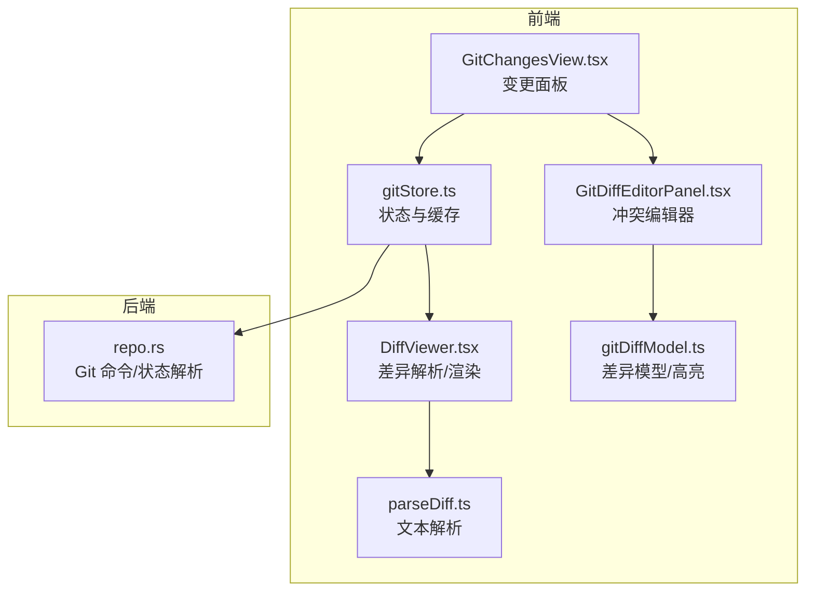
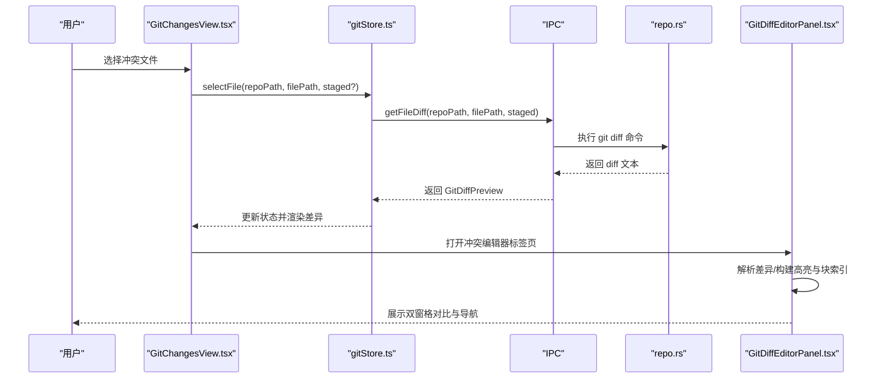
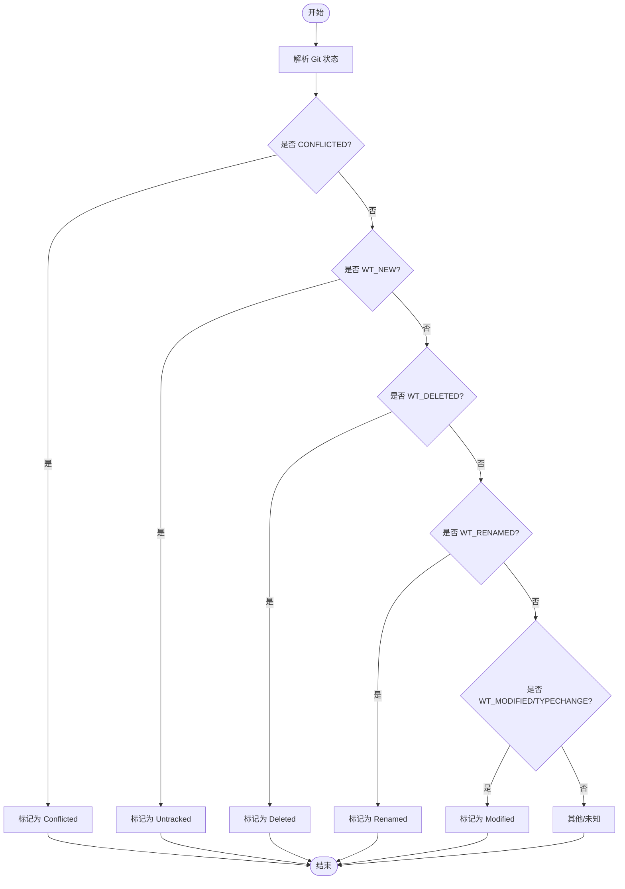
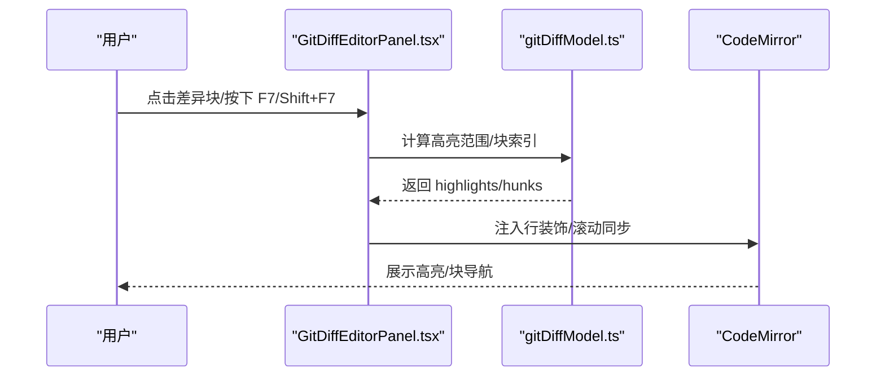
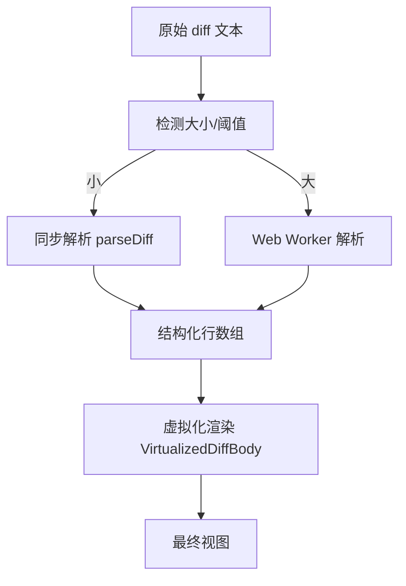
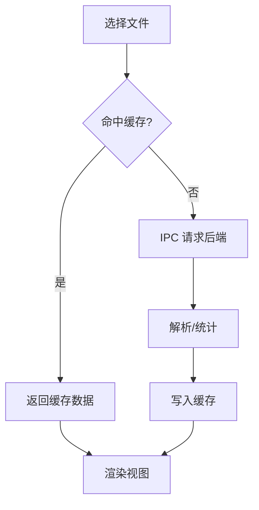
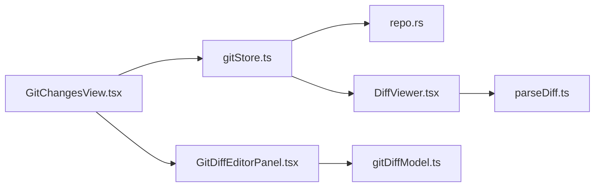

# 冲突解决

<cite>
**本文引用的文件**
- [GitDiffEditorPanel.tsx](file://src/components/editor/GitDiffEditorPanel.tsx)
- [gitDiffModel.ts](file://src/components/editor/gitDiffModel.ts)
- [parseDiff.ts](file://src/lib/parseDiff.ts)
- [DiffViewer.tsx](file://src/components/shared/DiffViewer.tsx)
- [GitChangesView.tsx](file://src/components/git/GitChangesView.tsx)
- [gitStore.ts](file://src/stores/gitStore.ts)
- [repo.rs](file://src-tauri/src/git/repo.rs)
- [GitStashView.tsx](file://src/components/git/GitStashView.tsx)
</cite>

## 目录
1. [简介](#简介)
2. [项目结构](#项目结构)
3. [核心组件](#核心组件)
4. [架构总览](#架构总览)
5. [详细组件分析](#详细组件分析)
6. [依赖关系分析](#依赖关系分析)
7. [性能考量](#性能考量)
8. [故障排查指南](#故障排查指南)
9. [结论](#结论)
10. [附录](#附录)

## 简介
本文件系统化阐述本仓库中 Git 冲突检测、标记与分类、手动解决流程、工具集成与自动化辅助、冲突文件识别、版本比较与选择性合并、最佳实践、回滚与备份策略，以及与编辑器的集成与实时冲突高亮能力。内容基于前端 React/Tauri 实现，覆盖从状态管理到渲染层的完整链路。

## 项目结构
围绕“冲突解决”的关键模块分布如下：
- 前端状态与视图
  - Git 变更面板：展示工作区与暂存区变更，支持打开文件差异视图
  - 差异解析与虚拟化渲染：解析 diff 文本、按需虚拟化显示
  - 冲突差异编辑器：双窗格对比、行高亮与块导航
- 后端（Tauri/Rust）
  - Git 操作与状态解析：执行命令、解析状态、生成变更类型
  - 缓存与 IPC：通过 IPC 将后端结果传递给前端

图表来源
- [gitStore.ts](file://src/stores/gitStore.ts)
- [GitChangesView.tsx](file://src/components/git/GitChangesView.tsx)
- [DiffViewer.tsx](file://src/components/shared/DiffViewer.tsx)
- [parseDiff.ts](file://src/lib/parseDiff.ts)
- [GitDiffEditorPanel.tsx](file://src/components/editor/GitDiffEditorPanel.tsx)
- [gitDiffModel.ts](file://src/components/editor/gitDiffModel.ts)
- [repo.rs](file://src-tauri/src/git/repo.rs)

章节来源
- [gitStore.ts](file://src/stores/gitStore.ts)
- [GitChangesView.tsx](file://src/components/git/GitChangesView.tsx)
- [DiffViewer.tsx](file://src/components/shared/DiffViewer.tsx)
- [parseDiff.ts](file://src/lib/parseDiff.ts)
- [GitDiffEditorPanel.tsx](file://src/components/editor/GitDiffEditorPanel.tsx)
- [gitDiffModel.ts](file://src/components/editor/gitDiffModel.ts)
- [repo.rs](file://src-tauri/src/git/repo.rs)

## 核心组件
- 冲突检测与分类
  - 基于 Git 状态位判断变更类型，冲突被归类为“conflicted”
  - 在“changes”与“staged”两个来源下分别映射为冲突类型
- 冲突差异编辑器
  - 双窗格对比：左侧为基准（base），右侧为修改（modified）
  - 行级高亮：新增/删除行范围高亮；当前块（hunk）激活高亮
  - 键盘导航：F7/F Shift+F7 导航下一个/上一个差异块
  - 只读控制：冲突文件在特定状态下禁用右侧编辑
- 差异解析与渲染
  - 文本解析：将 diff 输出拆分为元信息、块头、增删行等结构化行
  - 虚拟化渲染：大文件使用虚拟滚动提升性能
  - 工作线程：超阈值时在 Web Worker 中解析，避免阻塞主线程
- 状态与缓存
  - Git 状态与差异缓存：带 TTL 与字节上限的内存缓存
  - 失效与刷新：仓库变更或强制刷新触发重新拉取
- 回滚与备份
  - Stash：保存当前未提交工作，便于安全尝试解决冲突
  - 软重置：撤销最后一次提交，配合回退

章节来源
- [repo.rs](file://src-tauri/src/git/repo.rs)
- [GitDiffEditorPanel.tsx](file://src/components/editor/GitDiffEditorPanel.tsx)
- [gitDiffModel.ts](file://src/components/editor/gitDiffModel.ts)
- [parseDiff.ts](file://src/lib/parseDiff.ts)
- [DiffViewer.tsx](file://src/components/shared/DiffViewer.tsx)
- [gitStore.ts](file://src/stores/gitStore.ts)
- [GitStashView.tsx](file://src/components/git/GitStashView.tsx)

## 架构总览
以下序列图展示从用户选择冲突文件到打开冲突编辑器的端到端流程：

图表来源
- [GitChangesView.tsx](file://src/components/git/GitChangesView.tsx)
- [gitStore.ts](file://src/stores/gitStore.ts)
- [repo.rs](file://src-tauri/src/git/repo.rs)
- [GitDiffEditorPanel.tsx](file://src/components/editor/GitDiffEditorPanel.tsx)

## 详细组件分析

### 组件一：冲突检测与分类
- 关键点
  - 使用 Git 状态位区分冲突、新增、修改、删除、重命名等
  - 针对“changes”和“staged”两种来源分别映射，确保 UI 正确标注
  - 冲突文件在编辑器中以只读或提示形式呈现，避免误改
- 数据流
  - 后端解析状态 → 前端状态管理 → 视图渲染 → 用户交互

图表来源
- [repo.rs](file://src-tauri/src/git/repo.rs)

章节来源
- [repo.rs](file://src-tauri/src/git/repo.rs)

### 组件二：冲突差异编辑器（双窗格对比）
- 功能要点
  - 左右两窗格：base（基准）与 modified（修改）
  - 行级高亮：新增/删除行范围高亮；当前块激活高亮
  - 块导航：上下一个差异块，自动定位并聚焦
  - 键盘快捷键：F7 下一块，Shift+F7 上一块
  - 只读控制：冲突文件在特定情况下禁用右侧编辑
- 渲染与交互
  - 使用 CodeMirror 扩展注入行装饰样式
  - 同步滚动：左右窗格滚动联动
  - 自动居中：跳转到某块时居中显示对应行

图表来源
- [GitDiffEditorPanel.tsx](file://src/components/editor/GitDiffEditorPanel.tsx)
- [gitDiffModel.ts](file://src/components/editor/gitDiffModel.ts)

章节来源
- [GitDiffEditorPanel.tsx](file://src/components/editor/GitDiffEditorPanel.tsx)
- [gitDiffModel.ts](file://src/components/editor/gitDiffModel.ts)

### 组件三：差异解析与渲染（含虚拟化与工作线程）
- 文本解析
  - 将 diff 文本拆分为文件头、元信息、块头、增删行等
  - 提取文件名、统计增删行数
- 渲染优化
  - 超阈值字符时启用 Web Worker 异步解析
  - 虚拟化渲染：仅渲染可视区域，极大提升大文件体验
- 与编辑器联动
  - 冲突编辑器直接消费解析后的结构化行，构建高亮与块索引

图表来源
- [parseDiff.ts](file://src/lib/parseDiff.ts)
- [DiffViewer.tsx](file://src/components/shared/DiffViewer.tsx)

章节来源
- [parseDiff.ts](file://src/lib/parseDiff.ts)
- [DiffViewer.tsx](file://src/components/shared/DiffViewer.tsx)

### 组件四：状态管理与缓存（GitStore）
- 缓存策略
  - Git 状态与差异缓存：带 TTL 与条目/字节上限
  - 失效规则：仓库路径变更、强制刷新、活跃视图最小刷新间隔
- IPC 与错误处理
  - 通过 IPC 调用后端命令，捕获错误并反馈 UI
  - 加载态聚合：避免并发操作导致 UI 抖动
- 文件选择与差异预览
  - 选中文件后拉取对应 diff，并根据 staged 状态切换来源

图表来源
- [gitStore.ts](file://src/stores/gitStore.ts)

章节来源
- [gitStore.ts](file://src/stores/gitStore.ts)

### 组件五：回滚与备份（Stash 与软重置）
- Stash
  - 保存当前未提交工作，便于安全尝试解决冲突
  - 支持推送、应用、弹出等操作
- 软重置
  - 撤销最后一次提交，配合回退策略使用
- 与冲突解决的关系
  - 解决前先 stash，失败可随时恢复现场
  - 成功后清理 stash 并提交

章节来源
- [GitStashView.tsx](file://src/components/git/GitStashView.tsx)
- [repo.rs](file://src-tauri/src/git/repo.rs)

## 依赖关系分析
- 前端依赖
  - GitChangesView 依赖 gitStore 获取状态与差异
  - DiffViewer 依赖 parseDiff 进行解析
  - GitDiffEditorPanel 依赖 gitDiffModel 生成高亮与块索引
- 后端依赖
  - repo.rs 通过 Git CLI 执行命令并解析输出
- IPC 与缓存
  - gitStore 通过 IPC 与后端通信，统一缓存与失效策略

图表来源
- [GitChangesView.tsx](file://src/components/git/GitChangesView.tsx)
- [gitStore.ts](file://src/stores/gitStore.ts)
- [repo.rs](file://src-tauri/src/git/repo.rs)
- [DiffViewer.tsx](file://src/components/shared/DiffViewer.tsx)
- [parseDiff.ts](file://src/lib/parseDiff.ts)
- [GitDiffEditorPanel.tsx](file://src/components/editor/GitDiffEditorPanel.tsx)
- [gitDiffModel.ts](file://src/components/editor/gitDiffModel.ts)

章节来源
- [GitChangesView.tsx](file://src/components/git/GitChangesView.tsx)
- [gitStore.ts](file://src/stores/gitStore.ts)
- [repo.rs](file://src-tauri/src/git/repo.rs)
- [DiffViewer.tsx](file://src/components/shared/DiffViewer.tsx)
- [parseDiff.ts](file://src/lib/parseDiff.ts)
- [GitDiffEditorPanel.tsx](file://src/components/editor/GitDiffEditorPanel.tsx)
- [gitDiffModel.ts](file://src/components/editor/gitDiffModel.ts)

## 性能考量
- 差异解析
  - 小文件：同步解析，低延迟
  - 大文件：Web Worker 异步解析，避免阻塞 UI
- 渲染优化
  - 虚拟化：仅渲染可见区域，降低 DOM 数量
  - 滚动同步：使用 requestAnimationFrame 控制同步频率
- 缓存策略
  - TTL 与容量限制：防止缓存膨胀
  - 失效粒度：仓库路径、视图类型、请求序号协同控制

## 故障排查指南
- 冲突文件无法编辑
  - 检查文件状态是否为冲突且 modified 侧不可编辑
  - 确认是否处于“deleted”状态，编辑器会显示只读覆盖层
- 差异不显示或空白
  - 检查是否为二进制文件（编辑器会提示不可用）
  - 查看缓存是否过期，尝试强制刷新
- 导航无效
  - 确认存在多个差异块，否则导航按钮会禁用
  - 检查键盘快捷键是否被其他输入法占用
- 回滚/恢复
  - 使用 stash 保存现场，失败可随时恢复
  - 成功后清理 stash 或进行软重置

章节来源
- [GitDiffEditorPanel.tsx](file://src/components/editor/GitDiffEditorPanel.tsx)
- [gitStore.ts](file://src/stores/gitStore.ts)
- [GitStashView.tsx](file://src/components/git/GitStashView.tsx)

## 结论
本实现以“状态驱动 + 差异可视化 + 缓存优化”为核心，提供了从冲突检测、标记分类到双窗格对比与导航的完整闭环。通过 IPC 与 Rust 后端协作，结合前端缓存与虚拟化渲染，兼顾了准确性与性能。建议在团队内推广“先 stash 再解决”的流程，配合块级导航与只读保护，显著降低冲突解决风险。

## 附录
- 最佳实践
  - 发生冲突时优先 stash 当前工作，再逐个文件解决
  - 使用冲突编辑器的块导航快速定位问题区域
  - 对大文件采用虚拟化渲染，避免卡顿
- 回滚与备份
  - 使用 stash 保存现场，失败可随时恢复
  - 成功后清理 stash 并提交；必要时使用软重置回退
- 版本比较与选择性合并
  - 利用 base 与 modified 的双窗格对比，逐块审阅差异
  - 对于复杂冲突，可分块选择保留哪一侧的变更