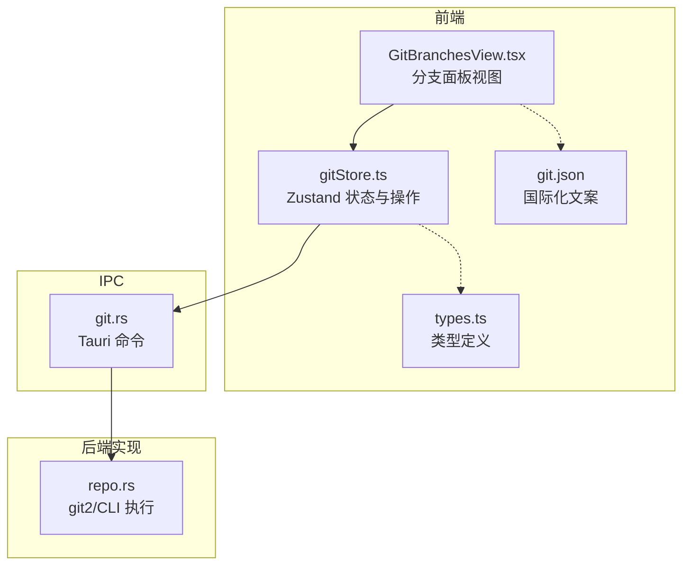
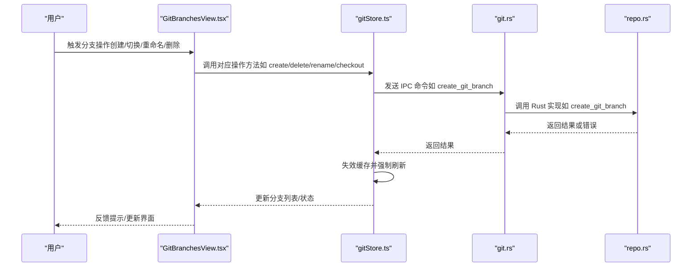
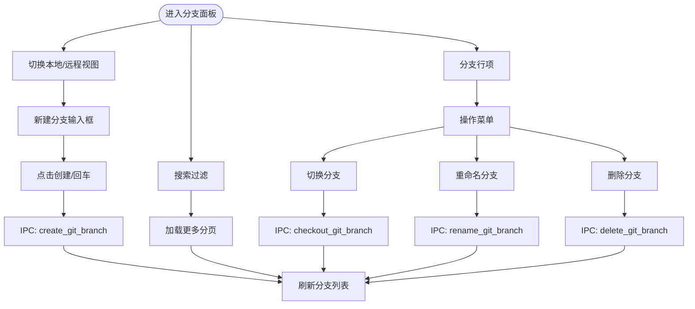
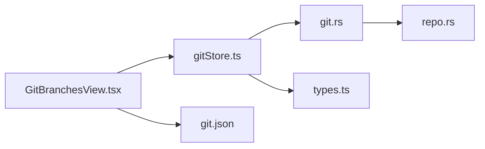

# 分支操作

<cite>
**本文档引用的文件**
- [GitBranchesView.tsx](file://src/components/git/GitBranchesView.tsx)
- [gitStore.ts](file://src/stores/gitStore.ts)
- [types.ts](file://src/types.ts)
- [git.rs](file://src-tauri/src/commands/git.rs)
- [repo.rs](file://src-tauri/src/git/repo.rs)
- [git.json](file://src/i18n/resources/zh-CN/git.json)
</cite>

## 目录
1. [简介](#简介)
2. [项目结构](#项目结构)
3. [核心组件](#核心组件)
4. [架构总览](#架构总览)
5. [详细组件分析](#详细组件分析)
6. [依赖分析](#依赖分析)
7. [性能考虑](#性能考虑)
8. [故障排除指南](#故障排除指南)
9. [结论](#结论)
10. [附录](#附录)

## 简介
本文件系统性阐述 Panes 应用中的 Git 分支操作功能，覆盖分支创建、切换、删除与重命名的前端交互与后端实现；解释本地与远程分支管理、跟踪关系建立与同步策略；涵盖分支比较、合并请求与快进合并的处理路径；提供分支工作流指导、冲突预防与最佳实践，并说明分支可视化界面与用户交互模式。

## 项目结构
围绕分支操作的关键模块分布如下：
- 前端视图层：Git 分支面板组件负责渲染与交互
- 前端状态层：Zustand 状态存储封装分支列表、搜索、分页与操作
- IPC 层：前端通过 IPC 调用后端命令
- 后端命令层：Tauri 命令桥接至 Rust 实现
- Rust 实现层：使用 git2 或 git CLI 执行具体 Git 操作

图表来源
- [GitBranchesView.tsx:29-635](file://src/components/git/GitBranchesView.tsx#L29-L635)
- [gitStore.ts:476-1132](file://src/stores/gitStore.ts#L476-L1132)
- [git.rs:137-213](file://src-tauri/src/commands/git.rs#L137-L213)
- [repo.rs:519-681](file://src-tauri/src/git/repo.rs#L519-L681)
- [types.ts:767-786](file://src/types.ts#L767-L786)
- [git.json:44-73](file://src/i18n/resources/zh-CN/git.json#L44-L73)

章节来源
- [GitBranchesView.tsx:29-635](file://src/components/git/GitBranchesView.tsx#L29-L635)
- [gitStore.ts:476-1132](file://src/stores/gitStore.ts#L476-L1132)
- [git.rs:137-213](file://src-tauri/src/commands/git.rs#L137-L213)
- [repo.rs:519-681](file://src-tauri/src/git/repo.rs#L519-L681)
- [types.ts:767-786](file://src/types.ts#L767-L786)
- [git.json:44-73](file://src/i18n/resources/zh-CN/git.json#L44-L73)

## 核心组件
- 分支面板视图：提供分支列表、搜索、切换、创建、重命名、删除等交互入口
- 状态存储：封装分支分页、搜索、加载更多、Draft 历史、错误与加载态
- IPC 命令：暴露分支相关命令给前端调用
- Rust 实现：执行具体分支操作（创建、切换、重命名、删除、列出）

章节来源
- [GitBranchesView.tsx:29-635](file://src/components/git/GitBranchesView.tsx#L29-L635)
- [gitStore.ts:397-868](file://src/stores/gitStore.ts#L397-L868)
- [git.rs:137-213](file://src-tauri/src/commands/git.rs#L137-L213)
- [repo.rs:519-681](file://src-tauri/src/git/repo.rs#L519-L681)

## 架构总览
前端通过 Zustand 状态管理分支数据与操作，调用 IPC 命令，后端命令再委托 Rust 实现执行 Git 操作。操作完成后触发缓存失效与刷新，确保 UI 与 Git 状态一致。

图表来源
- [GitBranchesView.tsx:189-264](file://src/components/git/GitBranchesView.tsx#L189-L264)
- [gitStore.ts:622-654](file://src/stores/gitStore.ts#L622-L654)
- [git.rs:173-213](file://src-tauri/src/commands/git.rs#L173-L213)
- [repo.rs:655-681](file://src-tauri/src/git/repo.rs#L655-L681)

## 详细组件分析

### 分支面板视图（GitBranchesView）
- 功能要点
  - 切换本地/远程分支视图
  - 新建分支输入与草稿历史支持
  - 搜索过滤与分页加载
  - 行级操作菜单（切换、重命名、删除）
  - 加载态与错误反馈
- 关键交互
  - 切换分支：onCheckout → checkoutBranch → IPC checkout_git_branch
  - 创建分支：onCreateBranch → createBranch → IPC create_git_branch
  - 重命名分支：onRenameBranch → renameBranch → IPC rename_git_branch
  - 删除分支：onDeleteBranch → deleteBranch → IPC delete_git_branch
- 显示信息
  - 当前分支高亮
  - 远程上游与 ahead/behind 同步状态
  - 最近提交时间

图表来源
- [GitBranchesView.tsx:353-635](file://src/components/git/GitBranchesView.tsx#L353-L635)
- [gitStore.ts:397-868](file://src/stores/gitStore.ts#L397-L868)
- [git.rs:158-213](file://src-tauri/src/commands/git.rs#L158-L213)
- [repo.rs:626-681](file://src-tauri/src/git/repo.rs#L626-L681)

章节来源
- [GitBranchesView.tsx:29-635](file://src/components/git/GitBranchesView.tsx#L29-L635)
- [gitStore.ts:397-868](file://src/stores/gitStore.ts#L397-L868)
- [git.rs:158-213](file://src-tauri/src/commands/git.rs#L158-L213)
- [repo.rs:626-681](file://src-tauri/src/git/repo.rs#L626-L681)

### 状态存储（gitStore）
- 分支分页与搜索
  - loadBranches/loadMoreBranches/setBranchSearch
  - 分页大小与总数控制
- 操作封装
  - runRepoMutationWithRefresh：统一包装分支变更操作，负责错误处理、缓存失效与强制刷新
  - checkoutBranch/createBranch/renameBranch/deleteBranch
- Draft 历史
  - 分支名草稿与历史记录持久化到本地存储
- 错误与加载
  - 统一 loading/error 状态，避免并发操作冲突

章节来源
- [gitStore.ts:795-868](file://src/stores/gitStore.ts#L795-L868)
- [gitStore.ts:622-654](file://src/stores/gitStore.ts#L622-L654)
- [gitStore.ts:1097-1129](file://src/stores/gitStore.ts#L1097-L1129)

### IPC 命令（git.rs）
- 暴露分支相关命令
  - list_git_branches、checkout_git_branch、create_git_branch、rename_git_branch、delete_git_branch
- 参数与返回
  - 使用枚举/字符串描述分支范围与来源
  - 返回 DTO 结构体，便于前端序列化

章节来源
- [git.rs:137-213](file://src-tauri/src/commands/git.rs#L137-L213)

### Rust 实现（repo.rs）
- 分支列表
  - list_git_branches：按本地/远程范围列出，支持搜索与分页
- 分支操作
  - checkout_git_branch：支持本地与远程跟踪切换
  - create_git_branch：支持从指定引用创建
  - rename_git_branch / delete_git_branch：重命名与删除（含强制删除）
- 同步与错误处理
  - push_repo/pull_repo/fetch_repo：封装推送/拉取/抓取逻辑
  - 对“无上游”等场景进行友好提示

章节来源
- [repo.rs:519-681](file://src-tauri/src/git/repo.rs#L519-L681)
- [repo.rs:472-517](file://src-tauri/src/git/repo.rs#L472-L517)

### 类型定义（types.ts）
- GitBranch/GitBranchPage：分支实体与分页模型
- GitBranchScope：本地/远程分支作用域

章节来源
- [types.ts:767-786](file://src/types.ts#L767-L786)

### 国际化（git.json）
- 分支面板文案：新建、搜索、切换、重命名、删除、提示等
- 用于本地化分支面板的用户提示与按钮文本

章节来源
- [git.json:44-73](file://src/i18n/resources/zh-CN/git.json#L44-L73)

## 依赖分析
- 前端依赖
  - GitBranchesView 依赖 gitStore 提供的操作与状态
  - gitStore 依赖 IPC 命令与本地草稿存储
- 后端依赖
  - git.rs 作为命令桥，调用 repo.rs
  - repo.rs 使用 git2 与 git CLI 两种方式执行命令，提升兼容性

图表来源
- [GitBranchesView.tsx:29-635](file://src/components/git/GitBranchesView.tsx#L29-L635)
- [gitStore.ts:476-1132](file://src/stores/gitStore.ts#L476-L1132)
- [git.rs:137-213](file://src-tauri/src/commands/git.rs#L137-L213)
- [repo.rs:519-681](file://src-tauri/src/git/repo.rs#L519-L681)
- [types.ts:767-786](file://src/types.ts#L767-L786)
- [git.json:44-73](file://src/i18n/resources/zh-CN/git.json#L44-L73)

## 性能考虑
- 分页与缓存
  - 分支列表分页加载，避免一次性传输大量数据
  - 状态与差异缓存限制与字节上限，减少重复计算
- 并发控制
  - runRepoMutationWithRefresh 统一并发与错误处理
- 渲染优化
  - 搜索防抖、菜单定位与虚拟滚动（如存在）降低渲染压力

章节来源
- [gitStore.ts:15-24](file://src/stores/gitStore.ts#L15-L24)
- [gitStore.ts:252-257](file://src/stores/gitStore.ts#L252-L257)
- [gitStore.ts:622-654](file://src/stores/gitStore.ts#L622-L654)

## 故障排除指南
- 切换分支失败
  - 检查 isRemote 标志是否正确传递
  - 若为远程分支，先尝试跟踪创建，再切换本地
- 创建分支失败
  - 确认分支名合法性与引用参数
- 删除分支失败
  - 若分支未合并，需强制删除标志
- 推送/拉取/抓取失败
  - 无上游时，推送会自动设置上游；拉取需要上游配置
- 错误提示
  - 前端统一捕获错误并展示，必要时引导用户检查远程配置

章节来源
- [GitBranchesView.tsx:189-264](file://src/components/git/GitBranchesView.tsx#L189-L264)
- [gitStore.ts:622-654](file://src/stores/gitStore.ts#L622-L654)
- [repo.rs:472-517](file://src-tauri/src/git/repo.rs#L472-L517)

## 结论
该分支操作体系从前端交互到后端实现形成清晰链路：视图层负责用户体验，状态层统一操作与缓存，IPC 命令桥接 Rust 实现，最终通过 git2/CLI 完成 Git 操作。系统提供了完善的分支生命周期管理、远程同步与错误处理能力，适合在复杂多分支场景下稳定运行。

## 附录

### 分支比较与合并请求
- 分支比较
  - 通过文件对比接口获取不同来源（已暂存/工作区）的差异内容
- 合并与快进
  - 拉取采用“仅快进”策略，避免非线性历史
  - 推送若无上游则自动设置并推送

章节来源
- [git.rs:39-52](file://src-tauri/src/commands/git.rs#L39-L52)
- [repo.rs:477-489](file://src-tauri/src/git/repo.rs#L477-L489)
- [repo.rs:491-517](file://src-tauri/src/git/repo.rs#L491-L517)

### 分支工作流指导与最佳实践
- 工作流建议
  - 在特性分支完成开发后，先本地合并测试，再推送并发起合并请求
  - 使用“仅快进”策略保持线性历史
- 冲突预防
  - 定期拉取上游变更，减少远落后于上游导致的冲突
  - 小步提交、明确提交信息，便于回溯与合并

章节来源
- [repo.rs:477-489](file://src-tauri/src/git/repo.rs#L477-L489)