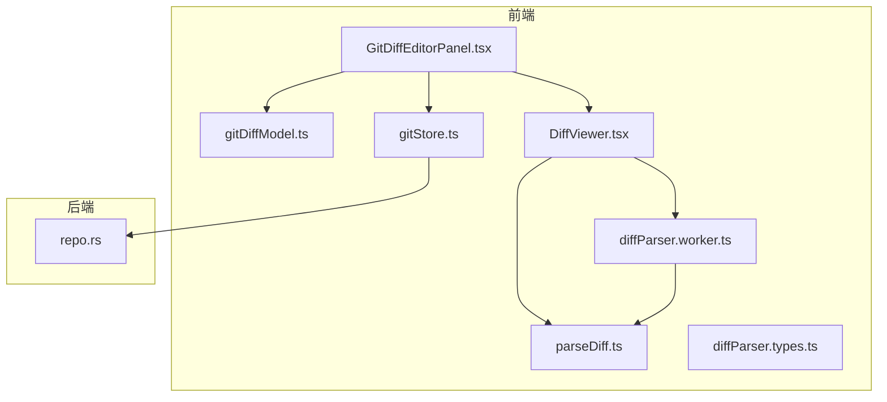
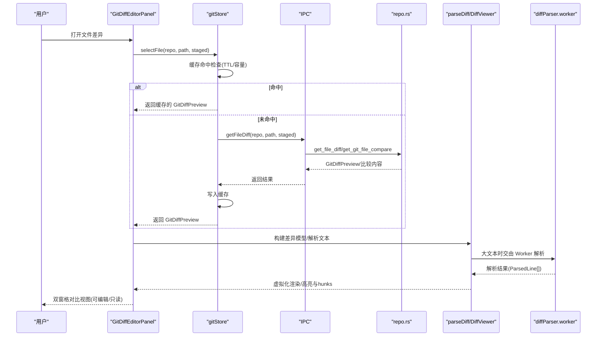
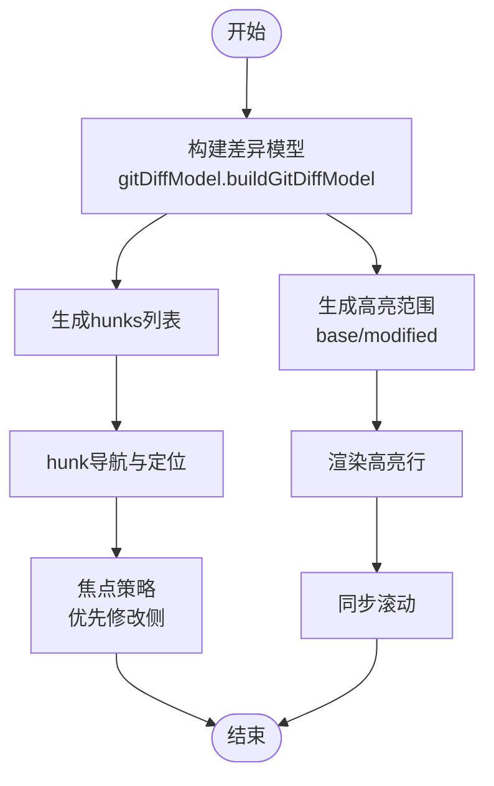
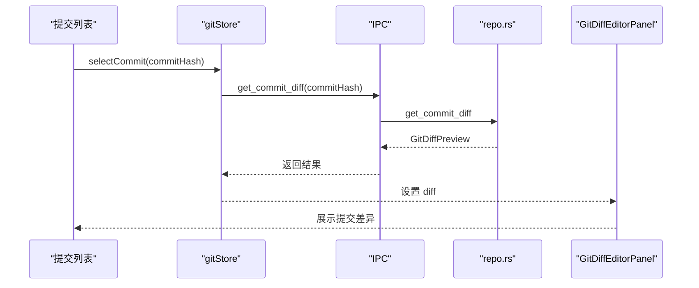
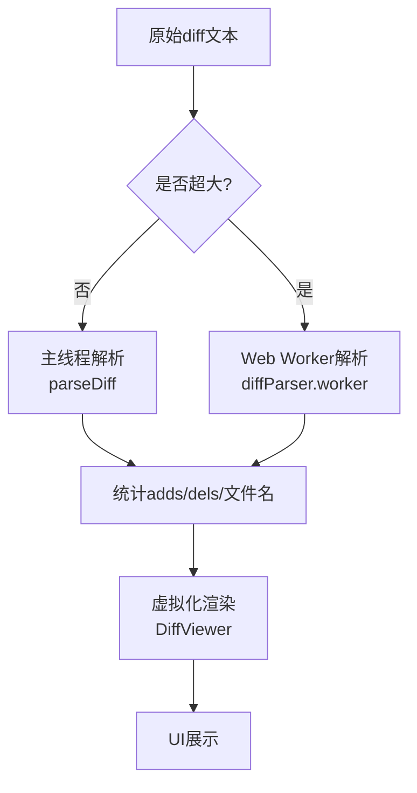
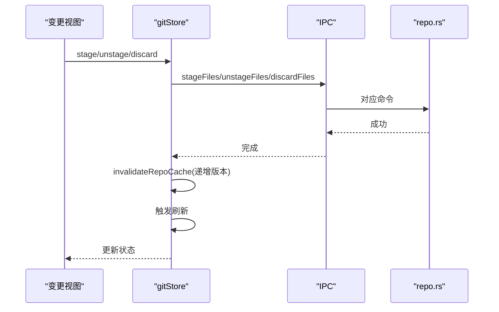
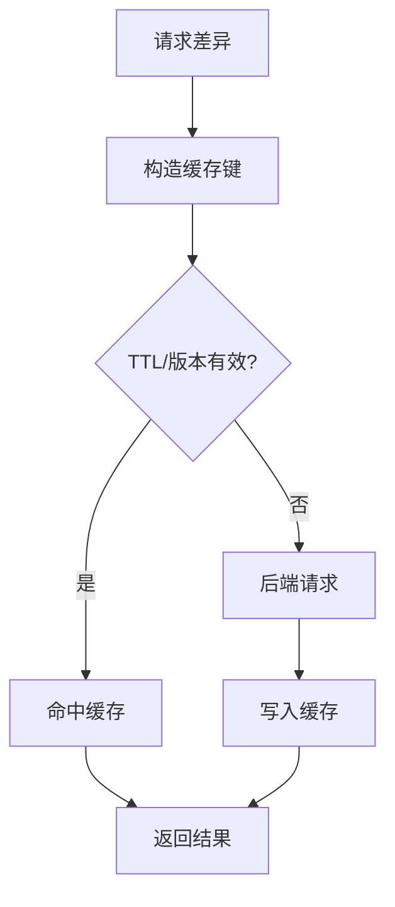
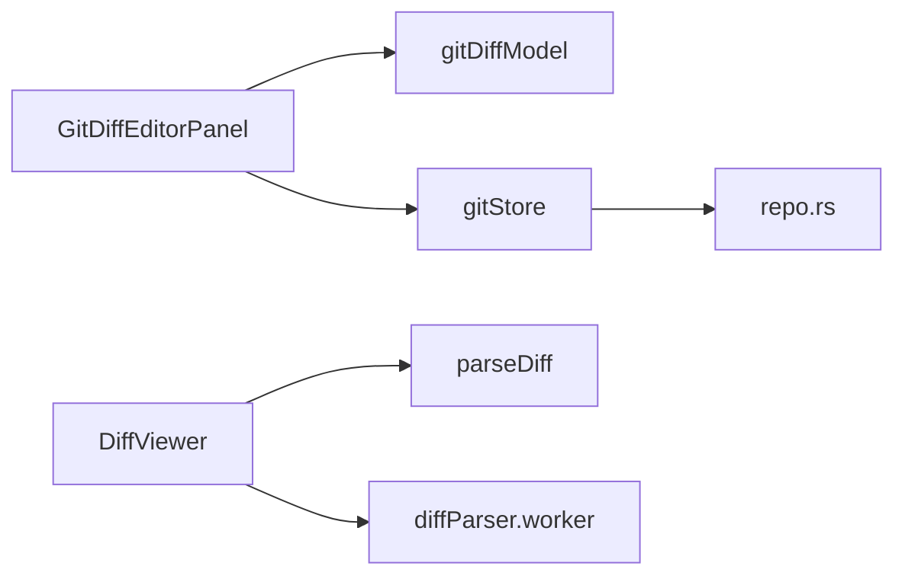

# 差异查看

<cite>
**本文引用的文件**
- [GitDiffEditorPanel.tsx](file://src/components/editor/GitDiffEditorPanel.tsx)
- [gitDiffModel.ts](file://src/components/editor/gitDiffModel.ts)
- [parseDiff.ts](file://src/lib/parseDiff.ts)
- [DiffViewer.tsx](file://src/components/shared/DiffViewer.tsx)
- [diffParser.worker.ts](file://src/workers/diffParser.worker.ts)
- [diffParser.types.ts](file://src/workers/diffParser.types.ts)
- [gitStore.ts](file://src/stores/gitStore.ts)
- [repo.rs](file://src-tauri/src/git/repo.rs)
- [GitDiffEditorPanel.test.ts](file://src/components/editor/GitDiffEditorPanel.test.ts)
</cite>

## 目录
1. [简介](#简介)
2. [项目结构](#项目结构)
3. [核心组件](#核心组件)
4. [架构总览](#架构总览)
5. [详细组件分析](#详细组件分析)
6. [依赖关系分析](#依赖关系分析)
7. [性能考量](#性能考量)
8. [故障排查指南](#故障排查指南)
9. [结论](#结论)
10. [附录](#附录)

## 简介
本文件系统性阐述本仓库中的 Git 差异查看能力，覆盖文件级与提交级差异的计算与展示，包含文本差异与二进制文件处理、大文件解析优化、差异可视化与行号标注、hunks 导航、差异选择与暂存/撤销流程、差异缓存与实时更新策略，以及可扩展的差异格式与导出能力。目标是帮助开发者与使用者全面理解差异功能的设计与实现，并为后续扩展提供清晰的参考。

## 项目结构
差异功能由前端 React 组件与状态管理、解析器与工作线程、以及后端 Rust 命令三部分协作完成：
- 前端编辑器面板：基于 CodeMirror 的双窗格对比视图，支持行高亮、hunks 导航与键盘快捷键。
- 解析与虚拟化：将 Git diff 文本解析为结构化行，按需在主线程或 Web Worker 中执行，并对长 diff 进行虚拟化渲染。
- 状态与缓存：Zustand 状态存储负责差异数据、缓存与刷新策略，避免频繁 IO。
- 后端命令：通过 IPC 获取文件差异与工作树内容，识别二进制与冲突文件，决定是否允许可编辑对比。

**图表来源**
- [GitDiffEditorPanel.tsx:125-526](file://src/components/editor/GitDiffEditorPanel.tsx#L125-L526)
- [gitDiffModel.ts:134-199](file://src/components/editor/gitDiffModel.ts#L134-L199)
- [parseDiff.ts:72-146](file://src/lib/parseDiff.ts#L72-L146)
- [DiffViewer.tsx:161-234](file://src/components/shared/DiffViewer.tsx#L161-L234)
- [diffParser.worker.ts:13-37](file://src/workers/diffParser.worker.ts#L13-L37)
- [diffParser.types.ts:3-14](file://src/workers/diffParser.types.ts#L3-L14)
- [gitStore.ts:302-349](file://src/stores/gitStore.ts#L302-L349)
- [repo.rs:333-400](file://src-tauri/src/git/repo.rs#L333-L400)

**章节来源**
- [GitDiffEditorPanel.tsx:125-526](file://src/components/editor/GitDiffEditorPanel.tsx#L125-L526)
- [gitDiffModel.ts:134-199](file://src/components/editor/gitDiffModel.ts#L134-L199)
- [parseDiff.ts:72-146](file://src/lib/parseDiff.ts#L72-L146)
- [DiffViewer.tsx:161-234](file://src/components/shared/DiffViewer.tsx#L161-L234)
- [diffParser.worker.ts:13-37](file://src/workers/diffParser.worker.ts#L13-L37)
- [diffParser.types.ts:3-14](file://src/workers/diffParser.types.ts#L3-L14)
- [gitStore.ts:302-349](file://src/stores/gitStore.ts#L302-L349)
- [repo.rs:333-400](file://src-tauri/src/git/repo.rs#L333-L400)

## 核心组件
- 差异编辑器面板（双窗格对比）
  - 构建差异高亮与 hunks，提供上下文导航与键盘快捷键。
  - 支持同步滚动与聚焦策略，确保用户在修改侧保持可编辑焦点。
- 差异模型（文本差异）
  - 基于行级 diff 算法生成高亮范围与 hunks，支持“新增/删除/修改”三类。
- 文本解析器与虚拟化渲染
  - 将 Git diff 文本解析为结构化行，按需使用 Web Worker 与虚拟化技术提升长 diff 渲染性能。
- 缓存与刷新策略
  - 针对状态与差异结果设置 TTL 与容量限制，避免重复 IO；对活动视图进行最小刷新间隔控制。
- 后端差异提供
  - 通过 IPC 获取文件差异与工作树内容，识别二进制与冲突文件，决定是否允许可编辑对比。

**章节来源**
- [GitDiffEditorPanel.tsx:196-396](file://src/components/editor/GitDiffEditorPanel.tsx#L196-L396)
- [gitDiffModel.ts:134-199](file://src/components/editor/gitDiffModel.ts#L134-L199)
- [parseDiff.ts:72-146](file://src/lib/parseDiff.ts#L72-L146)
- [DiffViewer.tsx:161-234](file://src/components/shared/DiffViewer.tsx#L161-L234)
- [gitStore.ts:17-25](file://src/stores/gitStore.ts#L17-L25)
- [repo.rs:333-400](file://src-tauri/src/git/repo.rs#L333-L400)

## 架构总览
下图展示了从用户选择文件到差异显示与交互的完整链路，包括缓存命中、解析与渲染、以及二进制/冲突文件的处理路径。

**图表来源**
- [gitStore.ts:302-349](file://src/stores/gitStore.ts#L302-L349)
- [repo.rs:333-400](file://src-tauri/src/git/repo.rs#L333-L400)
- [parseDiff.ts:72-146](file://src/lib/parseDiff.ts#L72-L146)
- [DiffViewer.tsx:161-234](file://src/components/shared/DiffViewer.tsx#L161-L234)
- [diffParser.worker.ts:13-37](file://src/workers/diffParser.worker.ts#L13-L37)
- [GitDiffEditorPanel.tsx:196-396](file://src/components/editor/GitDiffEditorPanel.tsx#L196-L396)

## 详细组件分析

### 文件级差异计算与可视化
- 文本差异模型
  - 使用行级 diff 算法，将差异划分为“新增/删除/上下文”片段，合并相邻片段形成 hunks。
  - 输出两套高亮范围（基侧与修改侧）与 hunks 列表，用于 UI 高亮与导航锚点。
- 可视化与交互
  - 双窗格对比：左侧为基侧内容，右侧为修改侧内容；支持只读与可编辑切换。
  - 行高亮：根据高亮范围为行添加 CSS 类，区分新增/删除。
  - Hunk 导航：支持上一个/下一个 hunk 的键盘快捷键与按钮导航；自动定位到对应行并聚焦。
  - 同步滚动：左右窗格滚动联动，避免断层阅读体验。
- 二进制与冲突处理
  - 若检测到二进制或冲突文件，则禁用可编辑对比，提示不可用原因。

**图表来源**
- [gitDiffModel.ts:134-199](file://src/components/editor/gitDiffModel.ts#L134-L199)
- [GitDiffEditorPanel.tsx:196-396](file://src/components/editor/GitDiffEditorPanel.tsx#L196-L396)

**章节来源**
- [gitDiffModel.ts:134-199](file://src/components/editor/gitDiffModel.ts#L134-L199)
- [GitDiffEditorPanel.tsx:196-396](file://src/components/editor/GitDiffEditorPanel.tsx#L196-L396)
- [GitDiffEditorPanel.test.ts:9-180](file://src/components/editor/GitDiffEditorPanel.test.ts#L9-L180)

### 提交级差异与提交树集成
- 提交级差异
  - 后端提供提交树 diff 接口，返回标准化的 diff 预览，前端以相同方式解析与展示。
- 提交树视图
  - 在提交列表中选择某次提交后，加载其 diff 并进入差异面板，支持与文件级差异一致的导航与高亮。

**图表来源**
- [gitStore.ts:415-416](file://src/stores/gitStore.ts#L415-L416)
- [repo.rs:828-835](file://src-tauri/src/git/repo.rs#L828-L835)
- [GitDiffEditorPanel.tsx:196-396](file://src/components/editor/GitDiffEditorPanel.tsx#L196-L396)

**章节来源**
- [gitStore.ts:415-416](file://src/stores/gitStore.ts#L415-L416)
- [repo.rs:828-835](file://src-tauri/src/git/repo.rs#L828-L835)

### 文本差异解析与大文件优化
- 文本解析
  - 将原始 diff 文本拆分为元信息、hunk 标签与行级增删改/上下文行，输出结构化 ParsedLine 列表。
  - 支持提取文件名、统计新增/删除行数等。
- 大文件优化
  - 主线程阈值：当文本长度低于阈值时直接解析；超过阈值则交由 Web Worker 异步解析。
  - Worker 生命周期：空闲定时回收，避免长期占用资源。
  - 虚拟化渲染：对长 diff 采用虚拟化窗口，仅渲染可见区域，显著降低 DOM 与重排压力。
- 自定义格式与导出
  - 解析结果包含原始 diff 的统计信息，可用于二次格式化或导出为其他格式（如 HTML/Markdown）。

**图表来源**
- [parseDiff.ts:72-146](file://src/lib/parseDiff.ts#L72-L146)
- [DiffViewer.tsx:161-234](file://src/components/shared/DiffViewer.tsx#L161-L234)
- [diffParser.worker.ts:13-37](file://src/workers/diffParser.worker.ts#L13-L37)
- [diffParser.types.ts:3-14](file://src/workers/diffParser.types.ts#L3-L14)

**章节来源**
- [parseDiff.ts:72-146](file://src/lib/parseDiff.ts#L72-L146)
- [DiffViewer.tsx:161-234](file://src/components/shared/DiffViewer.tsx#L161-L234)
- [diffParser.worker.ts:13-37](file://src/workers/diffParser.worker.ts#L13-L37)
- [diffParser.types.ts:3-14](file://src/workers/diffParser.types.ts#L3-L14)

### 差异选择、暂存与撤销
- 差异选择
  - 用户在变更视图中选择文件后，前端调用状态存储的 selectFile 方法，触发缓存命中或后端请求。
- 暂存与撤销
  - 暂存：调用后端 add 命令，随后使仓库版本递增并失效相关缓存，触发刷新。
  - 撤销：调用后端丢弃命令，同样触发缓存失效与刷新。
- 实时更新策略
  - 仓库版本号随每次变更递增，缓存命中时会校验版本一致性，确保 UI 与底层状态一致。

**图表来源**
- [gitStore.ts:753-773](file://src/stores/gitStore.ts#L753-L773)
- [repo.rs:402-412](file://src-tauri/src/git/repo.rs#L402-L412)

**章节来源**
- [gitStore.ts:753-773](file://src/stores/gitStore.ts#L753-L773)
- [repo.rs:402-412](file://src-tauri/src/git/repo.rs#L402-L412)

### 差异缓存机制与实时更新
- 缓存键与粒度
  - 差异缓存键包含仓库路径、是否已暂存、文件路径，确保不同上下文下的差异化缓存。
- TTL 与容量控制
  - 差异缓存与状态缓存均设置 TTL 与最大条目数与字节上限，定期淘汰最旧项。
- 版本一致性
  - 仓库版本号随变更递增，缓存命中时校验版本，避免脏读。
- 活动视图刷新节流
  - 对非“变更”视图设置最小刷新间隔，减少频繁刷新带来的抖动与性能损耗。

**图表来源**
- [gitStore.ts:207-257](file://src/stores/gitStore.ts#L207-L257)
- [gitStore.ts:302-349](file://src/stores/gitStore.ts#L302-L349)

**章节来源**
- [gitStore.ts:17-25](file://src/stores/gitStore.ts#L17-L25)
- [gitStore.ts:207-257](file://src/stores/gitStore.ts#L207-L257)
- [gitStore.ts:302-349](file://src/stores/gitStore.ts#L302-L349)

## 依赖关系分析
- 组件耦合
  - GitDiffEditorPanel 依赖 gitDiffModel 与状态存储；DiffViewer 独立负责解析与渲染；gitStore 统一调度 IPC 与缓存。
- 外部依赖
  - diff 库用于行级差异计算；Web Worker 用于大文本解析；后端 Rust 提供 Git 命令执行与内容读取。
- 循环依赖
  - 无循环依赖：解析器与面板解耦，状态存储作为单向依赖。

**图表来源**
- [GitDiffEditorPanel.tsx:125-526](file://src/components/editor/GitDiffEditorPanel.tsx#L125-L526)
- [gitDiffModel.ts:134-199](file://src/components/editor/gitDiffModel.ts#L134-L199)
- [DiffViewer.tsx:161-234](file://src/components/shared/DiffViewer.tsx#L161-L234)
- [diffParser.worker.ts:13-37](file://src/workers/diffParser.worker.ts#L13-L37)
- [gitStore.ts:302-349](file://src/stores/gitStore.ts#L302-L349)
- [repo.rs:333-400](file://src-tauri/src/git/repo.rs#L333-L400)

**章节来源**
- [GitDiffEditorPanel.tsx:125-526](file://src/components/editor/GitDiffEditorPanel.tsx#L125-L526)
- [gitDiffModel.ts:134-199](file://src/components/editor/gitDiffModel.ts#L134-L199)
- [DiffViewer.tsx:161-234](file://src/components/shared/DiffViewer.tsx#L161-L234)
- [diffParser.worker.ts:13-37](file://src/workers/diffParser.worker.ts#L13-L37)
- [gitStore.ts:302-349](file://src/stores/gitStore.ts#L302-L349)
- [repo.rs:333-400](file://src-tauri/src/git/repo.rs#L333-L400)

## 性能考量
- 解析阶段
  - 小文本直接解析，大文本交由 Worker；失败回退到主线程，保证可用性。
- 渲染阶段
  - 虚拟化仅渲染可见区域，结合固定行高与预计算偏移，降低滚动卡顿。
- 缓存阶段
  - TTL 与容量双重限制，避免内存膨胀；版本校验防止陈旧数据污染。
- 刷新阶段
  - 活动视图最小刷新间隔，减少频繁 IO；变更视图强制刷新以保证一致性。

[本节为通用性能建议，不直接分析具体文件]

## 故障排查指南
- 二进制文件不可编辑
  - 现象：打开二进制文件时显示不可编辑。
  - 原因：后端检测到任一侧为二进制内容，禁用可编辑对比。
  - 处理：使用外部工具查看二进制差异，或转换为文本格式。
- 冲突文件不可编辑
  - 现象：冲突文件显示不可编辑。
  - 原因：冲突状态下禁用可编辑对比。
  - 处理：先解决冲突再查看差异。
- 长 diff 卡顿
  - 现象：长 diff 页面滚动卡顿。
  - 原因：未启用虚拟化或 Worker 未就绪。
  - 处理：确认文本长度超过阈值且 Worker 正常运行；等待解析完成。
- 刷新不生效
  - 现象：修改后差异未更新。
  - 原因：缓存命中或版本未递增。
  - 处理：强制刷新；检查仓库版本是否递增；确认后端命令执行成功。

**章节来源**
- [repo.rs:373-399](file://src-tauri/src/git/repo.rs#L373-L399)
- [DiffViewer.tsx:161-234](file://src/components/shared/DiffViewer.tsx#L161-L234)
- [gitStore.ts:232-257](file://src/stores/gitStore.ts#L232-L257)

## 结论
本差异查看系统通过“模型-解析-渲染-缓存-后端命令”的分层设计，在保证交互流畅的同时兼顾了大文件与复杂场景的稳定性。文件级与提交级差异共享同一套解析与展示逻辑，配合完善的缓存与刷新策略，能够高效响应用户操作。未来可在以下方向扩展：支持更多差异格式导出、增强二进制文件的可视化方案、以及更细粒度的增量解析与渲染优化。

## 附录
- 关键接口与职责
  - gitDiffModel：文本差异建模与 hunk 归并。
  - parseDiff/DiffViewer：diff 文本解析与虚拟化渲染。
  - gitStore：差异缓存、刷新与 IPC 调度。
  - repo.rs：Git 命令执行与内容读取，含二进制/冲突检测。
  - GitDiffEditorPanel：双窗格对比与交互。

[本节为概览性总结，不直接分析具体文件]