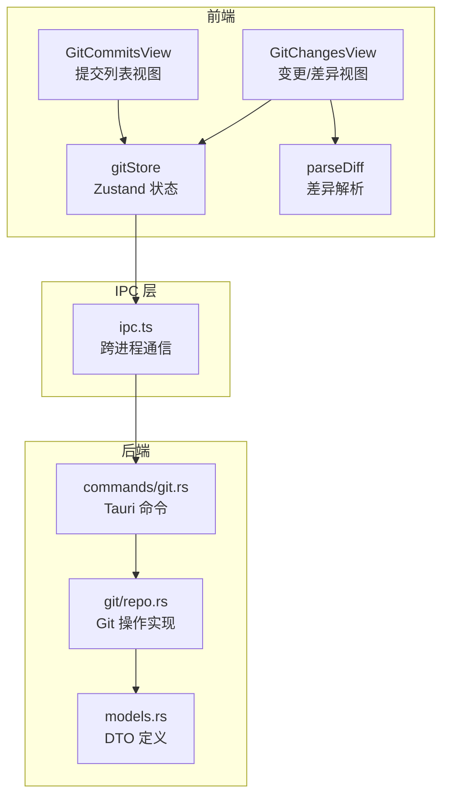
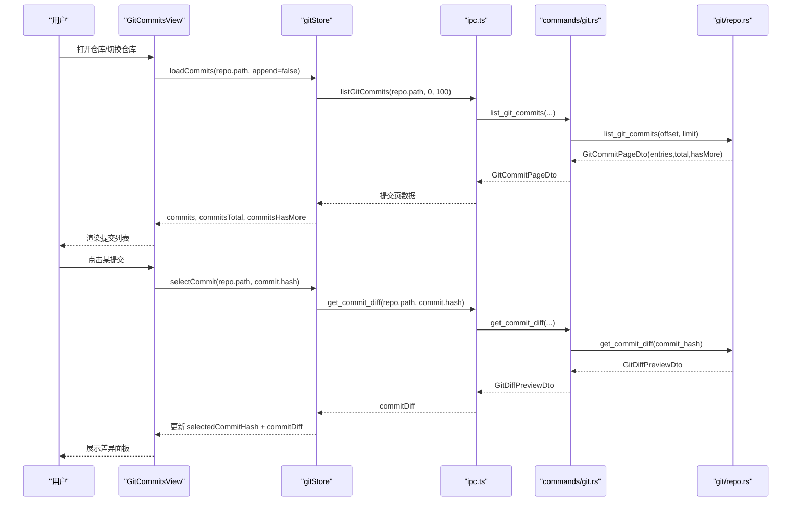
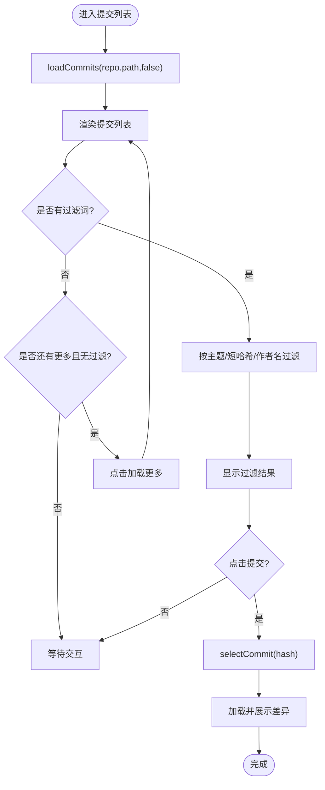
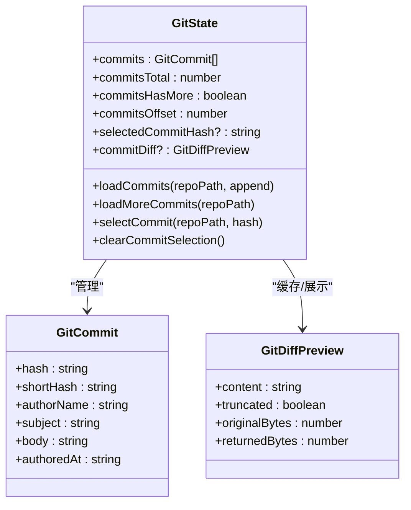
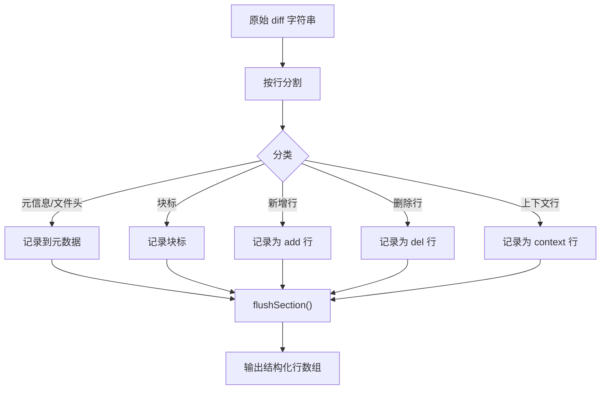
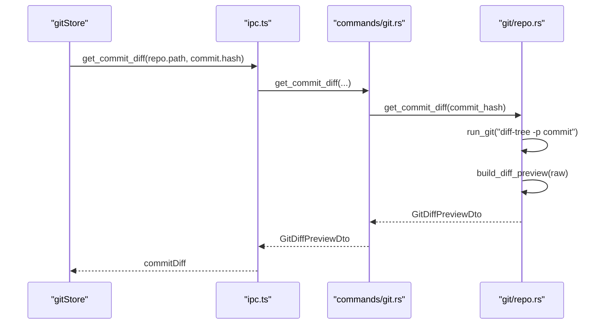
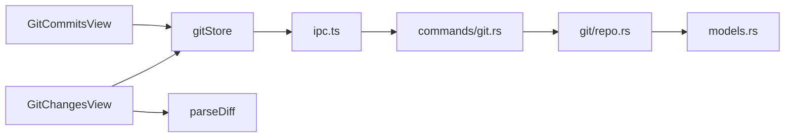

# 提交历史

<cite>
**本文档引用的文件**
- [GitCommitsView.tsx](file://src/components/git/GitCommitsView.tsx)
- [gitStore.ts](file://src/stores/gitStore.ts)
- [parseDiff.ts](file://src/lib/parseDiff.ts)
- [GitChangesView.tsx](file://src/components/git/GitChangesView.tsx)
- [types.ts](file://src/types.ts)
- [git.rs](file://src-tauri/src/commands/git.rs)
- [repo.rs](file://src-tauri/src/git/repo.rs)
- [models.rs](file://src-tauri/src/models.rs)
- [git.json](file://src/i18n/resources/zh-CN/git.json)
</cite>

## 目录
1. [简介](#简介)
2. [项目结构](#项目结构)
3. [核心组件](#核心组件)
4. [架构总览](#架构总览)
5. [详细组件分析](#详细组件分析)
6. [依赖关系分析](#依赖关系分析)
7. [性能考量](#性能考量)
8. [故障排查指南](#故障排查指南)
9. [结论](#结论)

## 简介
本文件系统性阐述 Git 提交历史功能的设计与实现，覆盖以下方面：
- 提交信息提取、格式化与显示机制
- 列表视图与搜索过滤
- 提交差异展示与文件级历史追踪
- 导航与交互流程
- 性能优化策略与大数据集处理方案

## 项目结构
提交历史功能由前端组件、全局状态管理、国际化资源以及后端命令与模型构成，形成“UI 组件 → 全局状态 → IPC → 后端命令 → Git CLI”的完整链路。

图表来源
- [GitCommitsView.tsx:13-235](file://src/components/git/GitCommitsView.tsx#L13-L235)
- [GitChangesView.tsx:104-751](file://src/components/git/GitChangesView.tsx#L104-L751)
- [gitStore.ts:1-1132](file://src/stores/gitStore.ts#L1-L1132)
- [parseDiff.ts:1-175](file://src/lib/parseDiff.ts#L1-L175)
- [git.rs:1-559](file://src-tauri/src/commands/git.rs#L1-L559)
- [repo.rs:690-935](file://src-tauri/src/git/repo.rs#L690-L935)
- [models.rs:700-899](file://src-tauri/src/models.rs#L700-L899)

章节来源
- [GitCommitsView.tsx:13-235](file://src/components/git/GitCommitsView.tsx#L13-L235)
- [gitStore.ts:1-1132](file://src/stores/gitStore.ts#L1-L1132)
- [git.rs:216-230](file://src-tauri/src/commands/git.rs#L216-L230)
- [repo.rs:690-765](file://src-tauri/src/git/repo.rs#L690-L765)
- [models.rs:766-786](file://src-tauri/src/models.rs#L766-L786)

## 核心组件
- 提交列表视图组件：负责渲染提交列表、搜索过滤、分页加载与差异面板联动。
- 全局状态管理：统一管理仓库状态、提交数据、选择态与缓存。
- 差异解析工具：将原始 diff 文本解析为结构化行，支持虚拟化渲染。
- 后端命令与模型：提供列出提交、获取提交差异等命令，并定义前后端数据结构。

章节来源
- [GitCommitsView.tsx:13-235](file://src/components/git/GitCommitsView.tsx#L13-L235)
- [gitStore.ts:351-474](file://src/stores/gitStore.ts#L351-L474)
- [parseDiff.ts:72-146](file://src/lib/parseDiff.ts#L72-L146)
- [git.rs:216-292](file://src-tauri/src/commands/git.rs#L216-L292)
- [models.rs:766-786](file://src-tauri/src/models.rs#L766-L786)

## 架构总览
提交历史功能采用“前端组件 + 状态管理 + IPC + 后端命令 + Git CLI”的分层设计，确保交互流畅与性能可控。

图表来源
- [GitCommitsView.tsx:30-38](file://src/components/git/GitCommitsView.tsx#L30-L38)
- [gitStore.ts:404-416](file://src/stores/gitStore.ts#L404-L416)
- [git.rs:216-292](file://src-tauri/src/commands/git.rs#L216-L292)
- [repo.rs:828-835](file://src-tauri/src/git/repo.rs#L828-L835)

## 详细组件分析

### 提交列表视图组件（GitCommitsView）
- 职责
  - 初始化加载指定仓库的提交列表
  - 支持按主题、短哈希、作者名进行实时搜索过滤
  - 分页加载更多提交（在无过滤条件下）
  - 点击提交触发差异加载与展示
- 关键行为
  - 首次挂载时调用 loadCommits 并清空选择
  - 过滤逻辑对 subject/shortHash/authorName 进行不区分大小写匹配
  - 通过 selectCommit 触发差异加载；若无差异则提示“此提交无更改”
  - 加载更多按钮仅在无过滤条件下显示
- 国际化
  - 使用 git.json 中的提交面板文案，如标题、计数、占位符、空状态提示等

图表来源
- [GitCommitsView.tsx:30-58](file://src/components/git/GitCommitsView.tsx#L30-L58)

章节来源
- [GitCommitsView.tsx:13-235](file://src/components/git/GitCommitsView.tsx#L13-L235)
- [git.json:74-86](file://src/i18n/resources/zh-CN/git.json#L74-L86)

### 全局状态管理（gitStore）
- 职责
  - 维护提交列表、总数、偏移、是否还有更多等状态
  - 提供加载/追加加载提交的方法
  - 提供选择提交与清空选择的方法
  - 实现差异缓存与状态缓存，避免重复请求与抖动
- 缓存策略
  - 提交页缓存：基于仓库路径与版本号，限制条目数量与字节总量
  - 差异缓存：基于仓库路径、文件路径与是否暂存，带 TTL 与容量淘汰
  - 主动刷新控制：限制活跃视图最小刷新间隔
- 数据结构
  - GitCommit/GitCommitPage：提交实体与分页结构
  - GitDiffPreview：差异内容与截断统计

图表来源
- [gitStore.ts:351-474](file://src/stores/gitStore.ts#L351-L474)
- [types.ts:788-804](file://src/types.ts#L788-L804)
- [models.rs:766-786](file://src-tauri/src/models.rs#L766-L786)

章节来源
- [gitStore.ts:15-25](file://src/stores/gitStore.ts#L15-L25)
- [gitStore.ts:351-474](file://src/stores/gitStore.ts#L351-L474)
- [types.ts:788-804](file://src/types.ts#L788-L804)
- [models.rs:766-786](file://src-tauri/src/models.rs#L766-L786)

### 差异解析与展示（parseDiff 与 DiffPanel）
- 差异解析
  - 将原始 diff 文本拆分为若干段落，识别元信息、文件头、块标与增删改行
  - 输出结构化行数组，便于后续虚拟化渲染与样式映射
- 差异展示
  - DiffPanel 根据 GitDiffPreview 内容进行解析与渲染
  - 若内容被截断，显示原始/返回字节数提示
  - 解析前显示“解析中”提示，解析后根据有无内容显示空状态

图表来源
- [parseDiff.ts:72-146](file://src/lib/parseDiff.ts#L72-L146)

章节来源
- [parseDiff.ts:1-175](file://src/lib/parseDiff.ts#L1-L175)
- [GitChangesView.tsx:49-102](file://src/components/git/GitChangesView.tsx#L49-L102)

### 后端命令与 Git 实现
- 列出提交
  - 前端调用 listGitCommits，后端使用 git log 以自定义格式输出，再解析为 GitCommitPageDto
- 获取提交差异
  - 前端调用 get_commit_diff，后端使用 git diff-tree -p 生成原始 diff，构建 GitDiffPreviewDto
- 差异预览截断
  - 后端对大 diff 进行行数与字节上限截断，保留可见变更行，保证界面响应性

图表来源
- [git.rs:282-292](file://src-tauri/src/commands/git.rs#L282-L292)
- [repo.rs:828-901](file://src-tauri/src/git/repo.rs#L828-L901)

章节来源
- [git.rs:216-292](file://src-tauri/src/commands/git.rs#L216-L292)
- [repo.rs:690-765](file://src-tauri/src/git/repo.rs#L690-L765)
- [repo.rs:828-901](file://src-tauri/src/git/repo.rs#L828-L901)
- [models.rs:766-786](file://src-tauri/src/models.rs#L766-L786)

## 依赖关系分析
- 组件依赖
  - GitCommitsView 依赖 gitStore 的提交状态与方法
  - GitChangesView 依赖 gitStore 的状态与 DiffPanel
  - DiffPanel 依赖 parseDiff 的解析结果
- 状态依赖
  - gitStore 统一维护 commits、commitDiff、selectedCommitHash 等关键状态
  - 缓存键包含仓库路径与“版本号”，用于失效与一致性控制
- 后端依赖
  - commands/git.rs 将前端请求转发至 git/repo.rs
  - repo.rs 使用 Git CLI 与自定义格式解析，构造 DTO 返回

图表来源
- [GitCommitsView.tsx:1-12](file://src/components/git/GitCommitsView.tsx#L1-L12)
- [GitChangesView.tsx:1-30](file://src/components/git/GitChangesView.tsx#L1-L30)
- [gitStore.ts:1-14](file://src/stores/gitStore.ts#L1-L14)
- [git.rs:1-13](file://src-tauri/src/commands/git.rs#L1-L13)
- [repo.rs:1-20](file://src-tauri/src/git/repo.rs#L1-L20)
- [models.rs:1-20](file://src-tauri/src/models.rs#L1-L20)

章节来源
- [gitStore.ts:94-230](file://src/stores/gitStore.ts#L94-L230)
- [git.rs:1-559](file://src-tauri/src/commands/git.rs#L1-L559)
- [repo.rs:690-935](file://src-tauri/src/git/repo.rs#L690-L935)

## 性能考量
- 分页加载
  - 默认每页 100 条提交，避免一次性渲染过多节点
- 缓存与去重
  - 提交页缓存与差异缓存均设置条目数与字节上限，并按 LRU 淘汰
  - 缓存键包含“仓库版本号”，确保仓库变更后自动失效
- 主动刷新节流
  - 活跃视图最小刷新间隔 1.5 秒，减少频繁刷新带来的抖动
- 差异截断
  - 后端对大 diff 进行行数与字节上限截断，防止内存与渲染压力过大
- 虚拟化渲染
  - 差异解析后的结构化行数组配合虚拟化组件，提升长 diff 的滚动性能

章节来源
- [gitStore.ts:15-25](file://src/stores/gitStore.ts#L15-L25)
- [gitStore.ts:139-181](file://src/stores/gitStore.ts#L139-L181)
- [gitStore.ts:232-257](file://src/stores/gitStore.ts#L232-L257)
- [repo.rs:837-901](file://src-tauri/src/git/repo.rs#L837-L901)
- [GitChangesView.tsx:49-102](file://src/components/git/GitChangesView.tsx#L49-L102)

## 故障排查指南
- 无提交数据
  - 检查仓库是否存在提交；确认 loadCommits 是否正确调用
- 差异为空或“无更改”
  - 某些提交可能无文件变更，属正常现象
- 加载更多不可用
  - 当存在过滤词时，加载更多按钮隐藏；清除过滤词后可用
- 刷新与缓存问题
  - 若出现旧数据，尝试调用 invalidateRepoCache 或强制刷新
- 大差异导致卡顿
  - 后端已做截断；若仍卡顿，建议关闭差异面板或减少同时打开的面板数量

章节来源
- [GitCommitsView.tsx:114-125](file://src/components/git/GitCommitsView.tsx#L114-L125)
- [gitStore.ts:716-718](file://src/stores/gitStore.ts#L716-L718)
- [repo.rs:837-901](file://src-tauri/src/git/repo.rs#L837-L901)

## 结论
该提交历史功能通过清晰的分层设计与完善的缓存/截断策略，在保证交互流畅的同时兼顾了大数据集场景下的性能与稳定性。前端提供直观的列表与搜索体验，后端以命令与模型支撑高效的数据流转与格式化，整体架构易于扩展与维护。