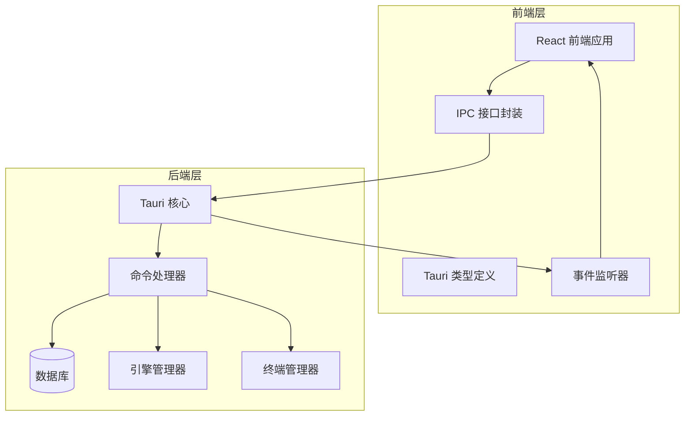
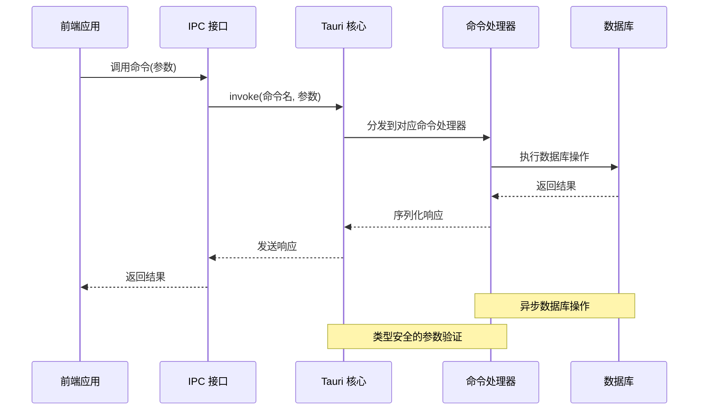
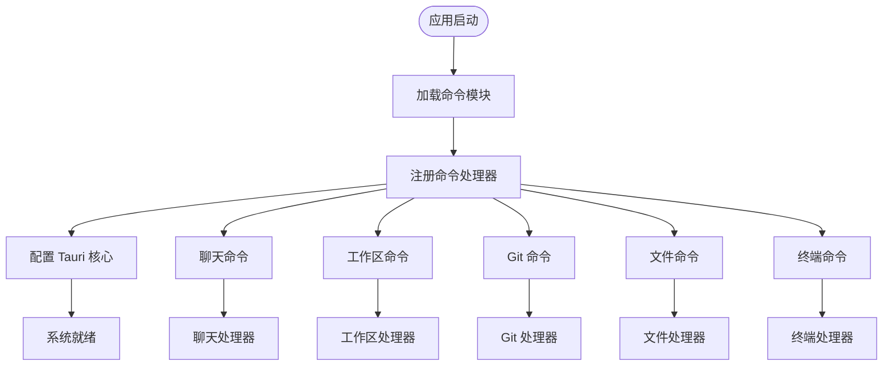
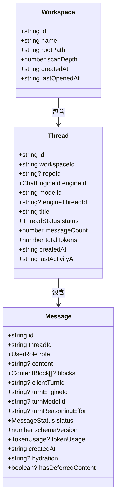
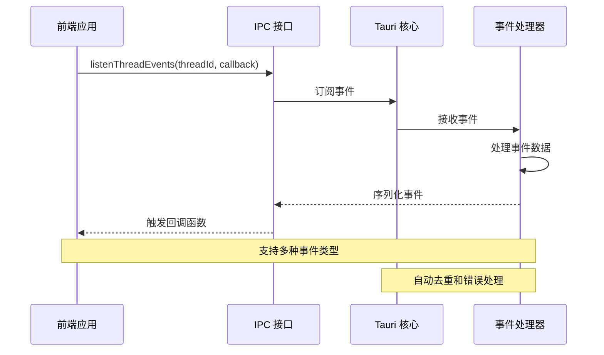
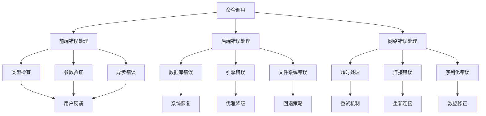
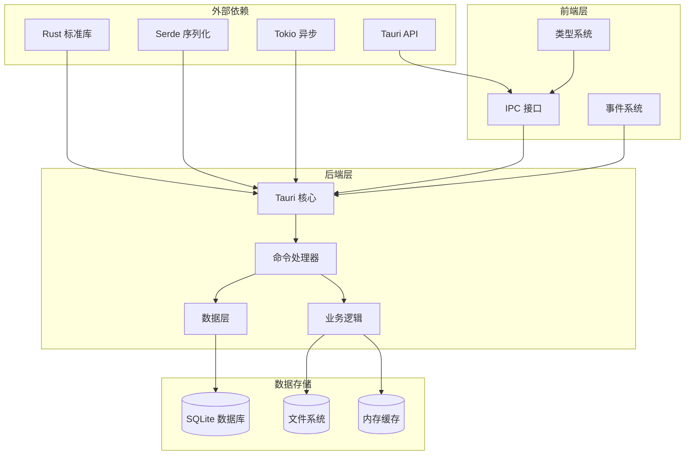
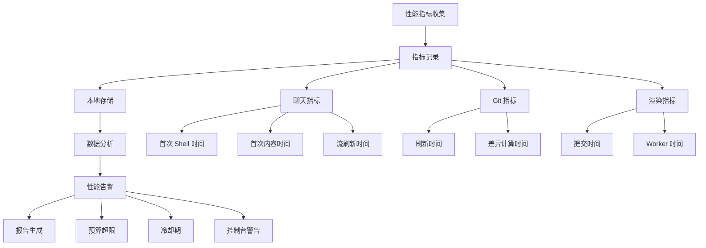

# IPC 通信系统

<cite>
**本文档引用的文件**
- [src/lib/ipc.ts](file://src/lib/ipc.ts)
- [src-tauri/src/main.rs](file://src-tauri/src/main.rs)
- [src-tauri/src/lib.rs](file://src-tauri/src/lib.rs)
- [src-tauri/src/commands/mod.rs](file://src-tauri/src/commands/mod.rs)
- [src-tauri/src/commands/chat.rs](file://src-tauri/src/commands/chat.rs)
- [src-tauri/src/commands/workspace.rs](file://src-tauri/src/commands/workspace.rs)
- [src/types.ts](file://src/types.ts)
- [src/lib/perfTelemetry.ts](file://src/lib/perfTelemetry.ts)
</cite>

## 目录
1. [简介](#简介)
2. [项目结构](#项目结构)
3. [核心组件](#核心组件)
4. [架构概览](#架构概览)
5. [详细组件分析](#详细组件分析)
6. [依赖关系分析](#依赖关系分析)
7. [性能考虑](#性能考虑)
8. [故障排除指南](#故障排除指南)
9. [结论](#结论)

## 简介

Panes IPC 通信系统是连接前端 React 应用与后端 Rust Tauri 应用的核心基础设施。该系统实现了完整的异步通信机制，支持命令调用、事件监听、错误处理和性能监控。

系统采用双向通信模式：前端通过 Tauri 的 invoke API 调用后端命令，后端通过事件系统向前端推送实时更新。所有通信都经过严格的类型安全检查和序列化处理。

## 项目结构

Panes IPC 通信系统主要分布在以下目录中：

**图表来源**
- [src/lib/ipc.ts:1-792](file://src/lib/ipc.ts#L1-L792)
- [src-tauri/src/lib.rs:47-337](file://src-tauri/src/lib.rs#L47-L337)

**章节来源**
- [src/lib/ipc.ts:1-792](file://src/lib/ipc.ts#L1-L792)
- [src-tauri/src/lib.rs:47-337](file://src-tauri/src/lib.rs#L47-L337)

## 核心组件

### 前端 IPC 接口层

前端通过统一的 IPC 接口封装提供类型安全的通信能力：

- **命令调用接口**：使用 `invoke` 函数进行异步命令调用
- **事件监听系统**：通过 `listen` 函数订阅各种事件
- **类型安全保障**：所有接口都带有 TypeScript 类型定义
- **错误处理机制**：自动捕获和处理 IPC 错误

### 后端命令系统

后端通过 Tauri 的命令注册机制提供完整的功能接口：

- **模块化设计**：按功能领域划分命令模块
- **类型安全**：使用 Rust 结构体确保数据完整性
- **异步处理**：支持长时间运行的操作
- **错误传播**：统一的错误处理和传播机制

**章节来源**
- [src/lib/ipc.ts:72-627](file://src/lib/ipc.ts#L72-L627)
- [src-tauri/src/lib.rs:179-320](file://src-tauri/src/lib.rs#L179-L320)

## 架构概览

Panes IPC 通信系统采用分层架构设计，确保了良好的可维护性和扩展性：

**图表来源**
- [src/lib/ipc.ts:72-627](file://src/lib/ipc.ts#L72-L627)
- [src-tauri/src/lib.rs:179-320](file://src-tauri/src/lib.rs#L179-L320)

## 详细组件分析

### 命令注册流程

系统通过集中式的命令注册机制实现模块化管理：

**图表来源**
- [src-tauri/src/lib.rs:179-320](file://src-tauri/src/lib.rs#L179-L320)
- [src-tauri/src/commands/mod.rs:1-12](file://src-tauri/src/commands/mod.rs#L1-L12)

### 数据序列化与类型安全

系统实现了多层次的数据验证和序列化机制：

#### 前端类型定义
前端使用 TypeScript 定义完整的数据结构，确保编译时类型检查：

**图表来源**
- [src/types.ts:3-169](file://src/types.ts#L3-L169)

#### 后端数据验证
后端使用 Rust 结构体和枚举确保数据完整性：

**章节来源**
- [src/types.ts:1-800](file://src/types.ts#L1-L800)
- [src-tauri/src/commands/chat.rs:63-145](file://src-tauri/src/commands/chat.rs#L63-L145)

### 事件监听系统

系统提供了丰富的事件监听机制，支持实时状态更新：

**图表来源**
- [src/lib/ipc.ts:629-791](file://src/lib/ipc.ts#L629-L791)

**章节来源**
- [src/lib/ipc.ts:629-791](file://src/lib/ipc.ts#L629-L791)

### 错误处理策略

系统实现了多层次的错误处理机制：

**图表来源**
- [src/lib/ipc.ts:72-627](file://src/lib/ipc.ts#L72-L627)
- [src-tauri/src/lib.rs:324-336](file://src-tauri/src/lib.rs#L324-L336)

**章节来源**
- [src/lib/ipc.ts:72-627](file://src/lib/ipc.ts#L72-L627)
- [src-tauri/src/lib.rs:324-336](file://src-tauri/src/lib.rs#L324-L336)

## 依赖关系分析

Panes IPC 通信系统的依赖关系体现了清晰的分层架构：

**图表来源**
- [src-tauri/src/lib.rs:1-40](file://src-tauri/src/lib.rs#L1-L40)
- [src/lib/ipc.ts:1-70](file://src/lib/ipc.ts#L1-L70)

**章节来源**
- [src-tauri/src/lib.rs:1-40](file://src-tauri/src/lib.rs#L1-L40)
- [src/lib/ipc.ts:1-70](file://src/lib/ipc.ts#L1-L70)

## 性能考虑

### 性能监控系统

系统内置了完善的性能监控机制：

**图表来源**
- [src/lib/perfTelemetry.ts:1-146](file://src/lib/perfTelemetry.ts#L1-L146)

### 优化策略

系统采用了多种性能优化技术：

- **事件合并**：聊天事件的批量处理减少通信开销
- **延迟加载**：大文件和复杂数据的按需加载
- **缓存机制**：频繁访问数据的本地缓存
- **异步处理**：长时间操作的非阻塞执行
- **资源池**：连接和会话的复用机制

**章节来源**
- [src/lib/perfTelemetry.ts:1-146](file://src/lib/perfTelemetry.ts#L1-L146)
- [src-tauri/src/commands/chat.rs:33-53](file://src-tauri/src/commands/chat.rs#L33-L53)

## 故障排除指南

### 常见问题诊断

#### IPC 连接问题
- **症状**：命令调用无响应或超时
- **排查步骤**：
  1. 检查 Tauri 应用是否正常启动
  2. 验证命令名称是否正确注册
  3. 查看浏览器开发者工具中的网络面板
  4. 检查后端日志输出

#### 类型不匹配错误
- **症状**：编译时或运行时报类型错误
- **排查步骤**：
  1. 对比前后端类型定义
  2. 检查 TypeScript 编译配置
  3. 验证序列化格式一致性
  4. 确认可选字段的处理

#### 事件监听失效
- **症状**：事件无法正常接收
- **排查步骤**：
  1. 确认事件主题名称正确
  2. 检查事件监听器的生命周期
  3. 验证事件数据的序列化
  4. 查看事件订阅状态

### 调试技巧

#### 前端调试
- 使用浏览器开发者工具的网络面板监控 IPC 通信
- 在控制台中直接调用 IPC 方法测试
- 利用 TypeScript 的类型提示进行开发

#### 后端调试
- 启用详细的日志输出
- 使用断点调试命令处理器
- 监控数据库查询性能

**章节来源**
- [src/lib/ipc.ts:72-627](file://src/lib/ipc.ts#L72-L627)
- [src-tauri/src/lib.rs:47-337](file://src-tauri/src/lib.rs#L47-L337)

## 结论

Panes IPC 通信系统通过精心设计的架构实现了高效、可靠的跨进程通信。系统的主要优势包括：

- **类型安全**：前后端完整的类型定义确保数据完整性
- **异步处理**：支持长时间运行的操作而不阻塞 UI
- **事件驱动**：实时状态更新和通知机制
- **性能优化**：多层缓存和优化策略提升用户体验
- **错误处理**：完善的错误捕获和恢复机制

该系统为 Panes 应用提供了坚实的技术基础，支持复杂的聊天、Git、文件管理和终端功能。通过持续的优化和改进，系统能够满足现代桌面应用对性能和可靠性的要求。