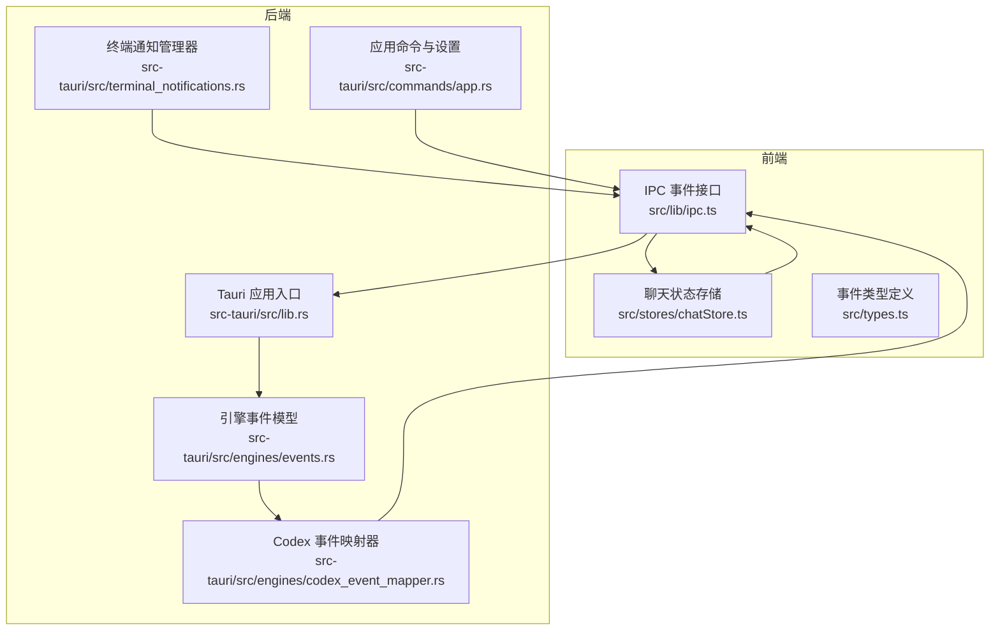
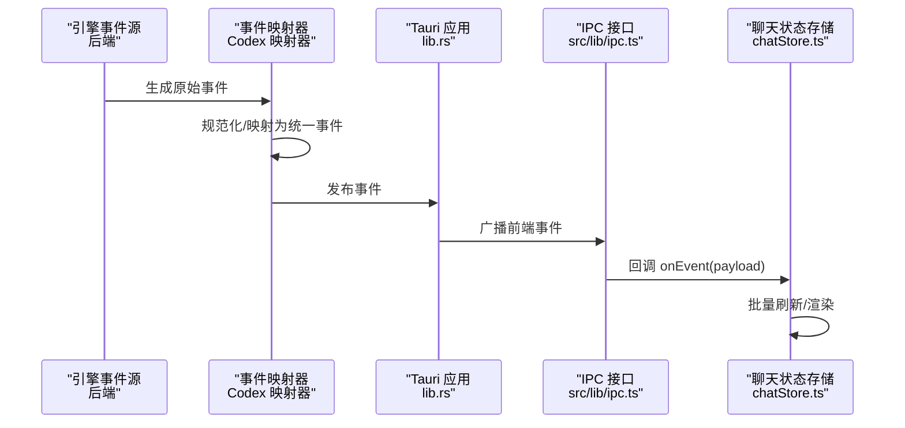
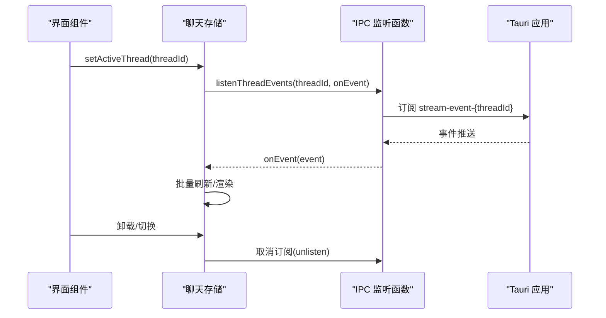
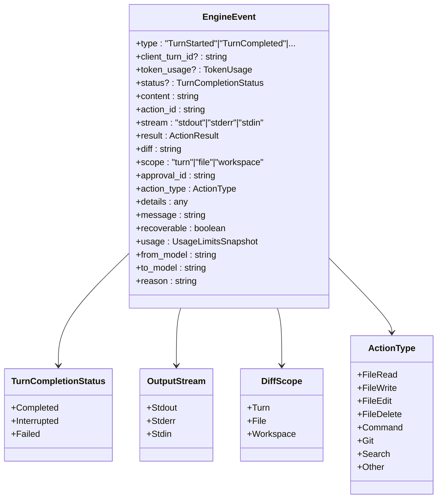
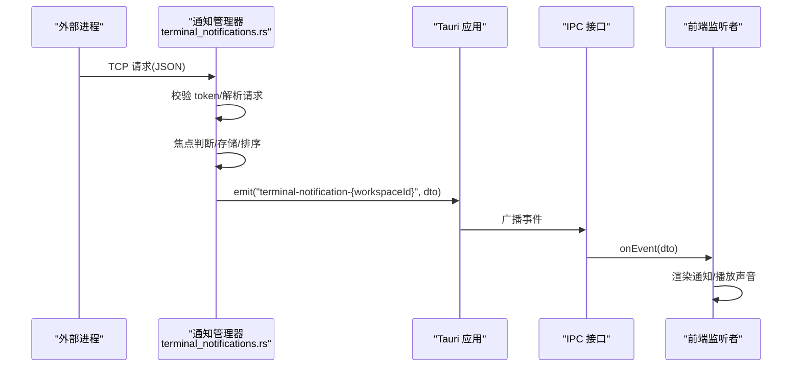
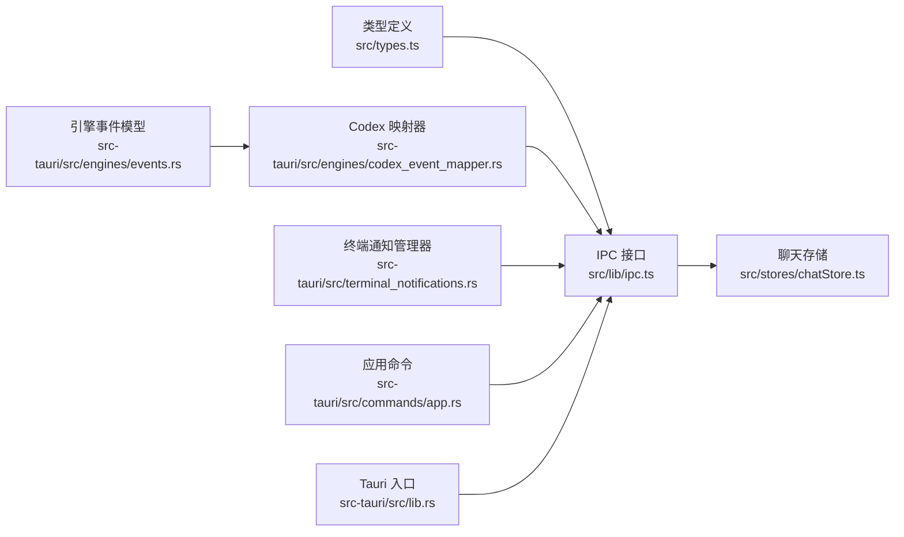

# 事件系统

<cite>
**本文档引用的文件**
- [src/lib/ipc.ts](file://src/lib/ipc.ts)
- [src/types.ts](file://src/types.ts)
- [src/stores/chatStore.ts](file://src/stores/chatStore.ts)
- [src-tauri/src/engines/events.rs](file://src-tauri/src/engines/events.rs)
- [src-tauri/src/engines/codex_event_mapper.rs](file://src-tauri/src/engines/codex_event_mapper.rs)
- [src-tauri/src/terminal_notifications.rs](file://src-tauri/src/terminal_notifications.rs)
- [src-tauri/src/lib.rs](file://src-tauri/src/lib.rs)
- [src-tauri/src/commands/app.rs](file://src-tauri/src/commands/app.rs)
</cite>

## 目录
1. [简介](#简介)
2. [项目结构](#项目结构)
3. [核心组件](#核心组件)
4. [架构总览](#架构总览)
5. [详细组件分析](#详细组件分析)
6. [依赖关系分析](#依赖关系分析)
7. [性能考量](#性能考量)
8. [故障排查指南](#故障排查指南)
9. [结论](#结论)
10. [附录](#附录)

## 简介
本文件系统性梳理 Panes 的事件系统，覆盖前端 IPC 事件监听、后端引擎事件映射与发布、终端通知事件流以及事件命名与传播机制。重点说明以下方面：
- 事件监听机制：前端如何通过 IPC 订阅与取消订阅各类事件
- 事件类型定义：事件数据结构、字段语义与生命周期
- 事件订阅与取消订阅流程：从绑定到解绑的完整链路
- 各类事件类型：线程事件、Git 变更事件、终端事件等的触发条件、数据结构与处理方式
- 命名约定与传播：事件名称规范、作用域与广播策略
- 内存管理与性能：批处理、去抖、队列与资源释放
- 调试与过滤：事件调试方法、过滤技巧与最佳实践

## 项目结构
事件系统横跨前端 TypeScript 与 Rust 后端两大模块：
- 前端负责事件监听、订阅管理、UI 更新与性能优化
- 后端负责事件生成、映射、聚合与跨进程/网络分发

图表来源
- [src/lib/ipc.ts:1-792](file://src/lib/ipc.ts#L1-L792)
- [src/stores/chatStore.ts:1542-1801](file://src/stores/chatStore.ts#L1542-L1801)
- [src-tauri/src/lib.rs:167-196](file://src-tauri/src/lib.rs#L167-L196)
- [src-tauri/src/engines/events.rs:113-262](file://src-tauri/src/engines/events.rs#L113-L262)
- [src-tauri/src/engines/codex_event_mapper.rs:32-245](file://src-tauri/src/engines/codex_event_mapper.rs#L32-L245)
- [src-tauri/src/terminal_notifications.rs:70-555](file://src-tauri/src/terminal_notifications.rs#L70-L555)
- [src-tauri/src/commands/app.rs:199-235](file://src-tauri/src/commands/app.rs#L199-L235)

章节来源
- [src/lib/ipc.ts:1-792](file://src/lib/ipc.ts#L1-L792)
- [src/stores/chatStore.ts:1542-1801](file://src/stores/chatStore.ts#L1542-L1801)
- [src-tauri/src/lib.rs:167-196](file://src-tauri/src/lib.rs#L167-L196)

## 核心组件
- 事件监听与订阅
  - 前端通过 IPC 提供统一的事件监听函数，如监听线程事件、Git 变更、菜单动作、终端输出/退出/前台变更、安装进度等
  - 每个监听函数返回一个取消函数，用于在组件卸载或切换时主动解除订阅
- 事件类型定义
  - 统一的事件类型集合，包含线程流式事件、终端事件、安装进度事件等
  - 类型定义确保前后端契约一致，便于 IDE 提示与编译期校验
- 引擎事件模型与映射
  - 后端定义标准化的引擎事件模型，涵盖对话轮次、文本增量、思考增量、动作执行、差异更新、审批请求、错误与用量限制等
  - Codex 事件映射器将外部通知转换为统一的引擎事件，保证上层消费的一致性
- 终端通知事件
  - 终端通知管理器负责接收外部通知、进行焦点判断、桌面通知展示与事件广播
  - 支持 TCP 入口、环境变量注入与 CLI 子命令集成

章节来源
- [src/lib/ipc.ts:629-742](file://src/lib/ipc.ts#L629-L742)
- [src/types.ts:1119-1253](file://src/types.ts#L1119-L1253)
- [src-tauri/src/engines/events.rs:113-262](file://src-tauri/src/engines/events.rs#L113-L262)
- [src-tauri/src/engines/codex_event_mapper.rs:32-245](file://src-tauri/src/engines/codex_event_mapper.rs#L32-L245)
- [src-tauri/src/terminal_notifications.rs:70-555](file://src-tauri/src/terminal_notifications.rs#L70-L555)

## 架构总览
事件从后端产生，经由 Tauri 发布到前端，前端按需订阅并批量渲染。

图表来源
- [src-tauri/src/engines/codex_event_mapper.rs:32-245](file://src-tauri/src/engines/codex_event_mapper.rs#L32-L245)
- [src-tauri/src/lib.rs:167-196](file://src-tauri/src/lib.rs#L167-L196)
- [src/lib/ipc.ts:629-634](file://src/lib/ipc.ts#L629-L634)
- [src/stores/chatStore.ts:1742-1779](file://src/stores/chatStore.ts#L1742-L1779)

## 详细组件分析

### 事件监听与订阅机制
- 前端监听函数
  - 线程事件：按 threadId 命名空间监听流式事件
  - Git 变更：全局监听仓库变更事件
  - 菜单动作：全局监听菜单事件
  - 终端事件：按 workspaceId 命名空间监听输出、退出、前台变更、通知等
  - 安装进度：全局监听安装进度事件
- 取消订阅
  - 每个监听函数返回取消函数；组件卸载或切换时调用该函数解除订阅
  - 聊天存储中实现了“后台监听”机制：当用户切换线程但原线程仍在流式时，保留轻量监听以保持状态正确

图表来源
- [src/lib/ipc.ts:629-634](file://src/lib/ipc.ts#L629-L634)
- [src/stores/chatStore.ts:1542-1801](file://src/stores/chatStore.ts#L1542-L1801)

章节来源
- [src/lib/ipc.ts:629-742](file://src/lib/ipc.ts#L629-L742)
- [src/stores/chatStore.ts:1542-1801](file://src/stores/chatStore.ts#L1542-L1801)

### 事件类型定义与数据结构
- 线程流式事件（StreamEvent）
  - 包含 TurnStarted/TurnCompleted、TextDelta/ThinkingDelta、Action*、DiffUpdated、Approval*、Error、UsageLimitsUpdated、ModelRerouted、Notice 等
  - 字段语义明确，支持增量渲染与状态同步
- 终端事件
  - 输出就绪、会话退出、前台进程变更、通知与清理事件等
- 安装进度事件
  - 依赖安装过程中的进度与日志行
- 菜单动作事件
  - 菜单项点击产生的字符串标识

章节来源
- [src/types.ts:1119-1253](file://src/types.ts#L1119-L1253)
- [src/types.ts:906-950](file://src/types.ts#L906-L950)
- [src/types.ts:1090-1095](file://src/types.ts#L1090-L1095)
- [src-tauri/src/lib.rs:167-178](file://src-tauri/src/lib.rs#L167-L178)

### 线程事件（引擎事件）
- 事件模型
  - 定义了统一的引擎事件枚举，涵盖对话轮次、文本/思考增量、动作执行、差异更新、审批请求、错误、用量限制与模型重路由等
- Codex 映射
  - 将外部通知（如 turnstarted、turncompleted、item* 等）映射为统一事件，处理令牌用量、上下文限制、实时转写、工具调用等复杂场景
- 前端消费
  - 聊天存储对事件进行批处理、速率统计与批量刷新，保证 UI 流畅

图表来源
- [src-tauri/src/engines/events.rs:113-262](file://src-tauri/src/engines/events.rs#L113-L262)

章节来源
- [src-tauri/src/engines/events.rs:113-262](file://src-tauri/src/engines/events.rs#L113-L262)
- [src-tauri/src/engines/codex_event_mapper.rs:32-245](file://src-tauri/src/engines/codex_event_mapper.rs#L32-L245)
- [src/stores/chatStore.ts:1651-1779](file://src/stores/chatStore.ts#L1651-L1779)

### Git 变更事件
- 触发条件
  - Git 仓库状态变化（分支、文件状态、提交等）
- 数据结构
  - GitRepoChangedEvent：包含 repoPath
- 前端处理
  - 监听 git-repo-changed 事件，触发相应 UI 刷新或缓存更新

章节来源
- [src/lib/ipc.ts:640-644](file://src/lib/ipc.ts#L640-L644)
- [src/types.ts:724-765](file://src/types.ts#L724-L765)

### 终端事件
- 触发条件
  - 终端会话输出、退出、前台进程变更、通知发布/清理
- 数据结构
  - TerminalOutputReadyEvent、TerminalExitEvent、TerminalForegroundChangedEvent、TerminalNotification、TerminalNotificationClearedEvent
- 前端处理
  - 按 workspaceId 订阅对应事件，驱动终端面板与通知显示

章节来源
- [src/lib/ipc.ts:688-742](file://src/lib/ipc.ts#L688-L742)
- [src/types.ts:906-950](file://src/types.ts#L906-L950)

### 终端通知事件（TCP 入口）
- 触发条件
  - 外部进程通过 TCP 将通知发送至本地入站端口，携带 token 校验与目标会话信息
- 数据结构
  - NotificationIngressRequest/Response、TerminalNotificationDto、TerminalNotificationSessionEnv
- 处理流程
  - 校验 token → 过滤焦点会话 → 存储并排序 → 发布事件 → 展示桌面通知

图表来源
- [src-tauri/src/terminal_notifications.rs:219-555](file://src-tauri/src/terminal_notifications.rs#L219-L555)
- [src/lib/ipc.ts:724-742](file://src/lib/ipc.ts#L724-L742)

章节来源
- [src-tauri/src/terminal_notifications.rs:70-555](file://src-tauri/src/terminal_notifications.rs#L70-L555)
- [src/lib/ipc.ts:724-742](file://src/lib/ipc.ts#L724-L742)

### 菜单动作事件
- 触发条件
  - 用户点击菜单项，Tauri 将事件转发给前端
- 数据结构
  - 字符串类型的菜单 ID
- 前端处理
  - 监听 "menu-action"，根据 ID 分派行为

章节来源
- [src-tauri/src/lib.rs:167-178](file://src-tauri/src/lib.rs#L167-L178)
- [src/lib/ipc.ts:682-686](file://src/lib/ipc.ts#L682-L686)

### 安装进度事件
- 触发条件
  - 系统安装依赖或更新过程中产生进度
- 数据结构
  - InstallProgressEvent：包含依赖名、日志行、流类型与完成标志
- 前端处理
  - 监听 "setup-install-progress"，更新安装面板

章节来源
- [src/lib/ipc.ts:698-702](file://src/lib/ipc.ts#L698-L702)
- [src/types.ts:1090-1095](file://src/types.ts#L1090-L1095)

### 引擎运行时更新事件
- 触发条件
  - 引擎运行时配置或协议诊断发生变化
- 数据结构
  - EngineRuntimeUpdatedEvent：包含引擎 ID、协议诊断与提示消息
- 前端处理
  - 监听 "engine-runtime-updated"，更新运行时状态

章节来源
- [src/lib/ipc.ts:673-680](file://src/lib/ipc.ts#L673-L680)
- [src/types.ts:700-704](file://src/types.ts#L700-L704)

## 依赖关系分析
- 前端依赖
  - IPC 接口提供统一事件订阅能力
  - 类型定义确保事件契约一致性
  - 状态存储负责事件批处理与 UI 刷新
- 后端依赖
  - 引擎事件模型与映射器保证事件标准化
  - 终端通知管理器负责跨进程/网络事件分发
  - 应用命令控制通知开关与设置

图表来源
- [src/types.ts:1119-1253](file://src/types.ts#L1119-L1253)
- [src/lib/ipc.ts:629-742](file://src/lib/ipc.ts#L629-L742)
- [src/stores/chatStore.ts:1542-1801](file://src/stores/chatStore.ts#L1542-L1801)
- [src-tauri/src/engines/events.rs:113-262](file://src-tauri/src/engines/events.rs#L113-L262)
- [src-tauri/src/engines/codex_event_mapper.rs:32-245](file://src-tauri/src/engines/codex_event_mapper.rs#L32-L245)
- [src-tauri/src/terminal_notifications.rs:70-555](file://src-tauri/src/terminal_notifications.rs#L70-L555)
- [src-tauri/src/commands/app.rs:199-235](file://src-tauri/src/commands/app.rs#L199-L235)
- [src-tauri/src/lib.rs:167-196](file://src-tauri/src/lib.rs#L167-L196)

章节来源
- [src/lib/ipc.ts:629-742](file://src/lib/ipc.ts#L629-L742)
- [src-tauri/src/engines/codex_event_mapper.rs:32-245](file://src-tauri/src/engines/codex_event_mapper.rs#L32-L245)
- [src-tauri/src/terminal_notifications.rs:70-555](file://src-tauri/src/terminal_notifications.rs#L70-L555)
- [src-tauri/src/commands/app.rs:199-235](file://src-tauri/src/commands/app.rs#L199-L235)

## 性能考量
- 批处理与节流
  - 聊天存储对事件进行队列化与定时刷新，避免频繁渲染
  - 速率统计窗口每秒计算事件吞吐，便于性能监控
- 内存管理
  - 取消订阅时清理计时器与队列，防止内存泄漏
  - 后台监听仅在必要时保留，降低资源占用
- 事件裁剪
  - 对长输出进行截断与尾部保留，减少传输与渲染开销
- 焦点感知
  - 终端通知管理器基于焦点状态决定是否展示桌面通知，避免干扰

章节来源
- [src/stores/chatStore.ts:1651-1779](file://src/stores/chatStore.ts#L1651-L1779)
- [src-tauri/src/engines/events.rs:7-62](file://src-tauri/src/engines/events.rs#L7-L62)
- [src-tauri/src/terminal_notifications.rs:450-500](file://src-tauri/src/terminal_notifications.rs#L450-L500)

## 故障排查指南
- 无法收到线程事件
  - 检查是否正确订阅 stream-event-{threadId}
  - 确认组件卸载前已调用取消函数
  - 关注后台监听逻辑，确保切换线程时未被提前清理
- 事件丢失或延迟
  - 查看批处理阈值与刷新定时器设置
  - 检查事件速率统计，定位高负载时段
- 终端通知不显示
  - 校验通知开关与焦点状态
  - 检查 TCP 入口 token 与目标会话参数
  - 确认桌面通知权限与系统设置
- 设置与开关
  - 通过应用命令启用/禁用聊天与终端通知
  - 检查通知音效与集成状态

章节来源
- [src/lib/ipc.ts:629-634](file://src/lib/ipc.ts#L629-L634)
- [src/stores/chatStore.ts:1542-1801](file://src/stores/chatStore.ts#L1542-L1801)
- [src-tauri/src/terminal_notifications.rs:450-500](file://src-tauri/src/terminal_notifications.rs#L450-L500)
- [src-tauri/src/commands/app.rs:199-235](file://src-tauri/src/commands/app.rs#L199-L235)

## 结论
Panes 的事件系统通过前后端协作实现了高内聚、低耦合的事件流：后端统一事件模型与映射，前端按需订阅与批处理渲染。命名规范清晰、传播路径明确，并辅以性能优化与内存管理策略。结合调试与过滤技巧，可有效提升开发体验与系统稳定性。

## 附录
- 事件命名约定
  - 线程事件：stream-event-{threadId}
  - Git 变更：git-repo-changed
  - 菜单动作：menu-action
  - 终端事件：terminal-output-{workspaceId}、terminal-exit-{workspaceId}、terminal-fg-changed-{workspaceId}、terminal-notification-{workspaceId}、terminal-notification-cleared-{workspaceId}
  - 安装进度：setup-install-progress
  - 引擎运行时更新：engine-runtime-updated
- 事件传播机制
  - 后端通过 Tauri 发布事件，前端 IPC 监听回调，状态存储批量刷新
- 最佳实践
  - 始终在组件卸载时调用取消函数
  - 使用批处理与节流，避免高频事件导致 UI 卡顿
  - 在焦点会话上谨慎展示通知，减少干扰
  - 对长输出进行裁剪，控制事件体积