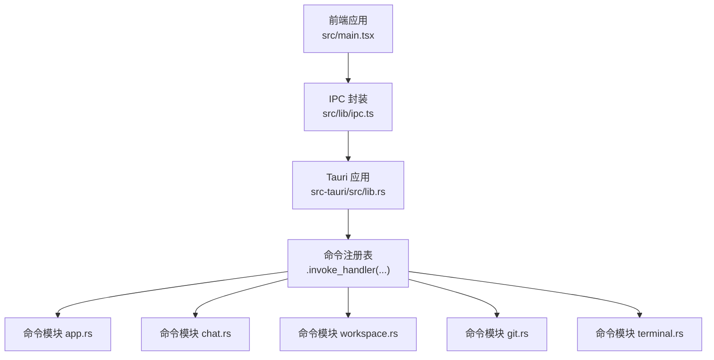
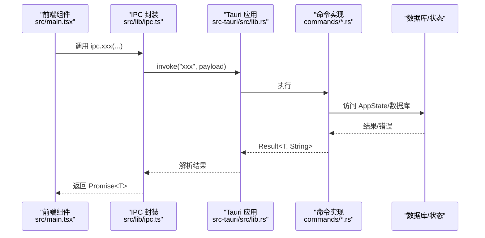
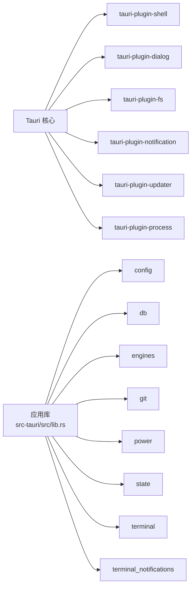

# 命令系统

<cite>
**本文引用的文件**
- [src-tauri/src/main.rs](file://src-tauri/src/main.rs)
- [src-tauri/src/lib.rs](file://src-tauri/src/lib.rs)
- [src-tauri/src/commands/mod.rs](file://src-tauri/src/commands/mod.rs)
- [src-tauri/src/commands/app.rs](file://src-tauri/src/commands/app.rs)
- [src-tauri/src/commands/chat.rs](file://src-tauri/src/commands/chat.rs)
- [src-tauri/src/commands/workspace.rs](file://src-tauri/src/commands/workspace.rs)
- [src-tauri/src/commands/git.rs](file://src-tauri/src/commands/git.rs)
- [src-tauri/src/commands/terminal.rs](file://src-tauri/src/commands/terminal.rs)
- [src/lib/ipc.ts](file://src/lib/ipc.ts)
- [src/types.ts](file://src/types.ts)
- [src-tauri/Cargo.toml](file://src-tauri/Cargo.toml)
- [src/main.tsx](file://src/main.tsx)
</cite>

## 目录
1. [简介](#简介)
2. [项目结构](#项目结构)
3. [核心组件](#核心组件)
4. [架构总览](#架构总览)
5. [详细组件分析](#详细组件分析)
6. [依赖关系分析](#依赖关系分析)
7. [性能考量](#性能考量)
8. [故障排查指南](#故障排查指南)
9. [结论](#结论)
10. [附录](#附录)

## 简介
本文件系统性梳理 Panes 的命令系统，围绕 Tauri 命令注册机制、前端 invoke 调用方式、参数与返回值处理、类型安全、异步执行与错误传播进行深入解析，并按功能域对命令进行分类（工作空间、聊天、Git、终端等），给出参数校验规则、返回值标准化建议、性能优化策略、调试与监控方法。

## 项目结构
命令系统由“前端 IPC 封装层”和“后端 Tauri 命令层”构成：
- 前端通过统一的 IPC 模块封装所有 invoke 调用，提供强类型签名与事件监听。
- 后端在 Tauri Builder 中集中注册命令，使用 #[tauri::command] 标注，支持异步执行与数据库/状态访问。

图表来源
- [src/lib/ipc.ts:1-792](file://src/lib/ipc.ts#L1-L792)
- [src-tauri/src/lib.rs:179-321](file://src-tauri/src/lib.rs#L179-L321)

章节来源
- [src/lib/ipc.ts:1-792](file://src/lib/ipc.ts#L1-L792)
- [src-tauri/src/lib.rs:179-321](file://src-tauri/src/lib.rs#L179-L321)

## 核心组件
- 前端 IPC 封装：提供所有命令的类型化调用函数与事件监听器，统一参数序列化与返回值解构。
- 后端命令注册：在 Tauri Builder.setup 中集中注册，覆盖应用、聊天、工作空间、Git、终端等子域。
- 命令模块：按功能域划分，每个模块导出若干 #[tauri::command] 函数，负责业务逻辑与数据持久化。
- 类型系统：前端 types.ts 定义了命令涉及的数据模型与枚举，确保前后端一致。

章节来源
- [src/lib/ipc.ts:1-792](file://src/lib/ipc.ts#L1-L792)
- [src-tauri/src/commands/mod.rs:1-12](file://src-tauri/src/commands/mod.rs#L1-L12)
- [src/types.ts:1-200](file://src/types.ts#L1-L200)

## 架构总览
Tauri 命令从前端发起，经由 IPC 层映射到后端命令，命令内部可访问 AppState、数据库与外部工具，最终通过事件或返回值反馈给前端。

图表来源
- [src/lib/ipc.ts:72-627](file://src/lib/ipc.ts#L72-L627)
- [src-tauri/src/lib.rs:179-321](file://src-tauri/src/lib.rs#L179-L321)

## 详细组件分析

### 命令注册与生命周期
- 入口与运行：main.rs 调用 run() 初始化应用与插件，随后在 lib.rs 中构建 Tauri 应用并在 setup 阶段注册命令。
- 注册范围：.invoke_handler(...) 列表包含 app、power、chat、workspace、git、files、engines、threads、terminal、setup、harness 等模块下的全部命令。
- 生命周期事件：应用退出时释放终端与保持唤醒资源。

章节来源
- [src-tauri/src/main.rs:1-14](file://src-tauri/src/main.rs#L1-L14)
- [src-tauri/src/lib.rs:47-337](file://src-tauri/src/lib.rs#L47-L337)

### 前端 invoke 调用与事件监听
- 统一入口：ipc.ts 提供大量 typed invoke 方法，如 ipc.sendMessage、ipc.openWorkspace、ipc.listThreads 等。
- 参数与默认值：多数方法对可选参数提供 null/undefined 映射，确保后端接收稳定格式。
- 事件订阅：提供 listenThreadEvents、listenGitRepoChanged、listenEngineRuntimeUpdated 等监听器，用于订阅后端事件。

章节来源
- [src/lib/ipc.ts:72-792](file://src/lib/ipc.ts#L72-L792)

### 命令分类与职责边界
- 应用与系统：本地化设置、通知配置、加速渲染开关、保持唤醒管理等。
- 工作空间：打开/归档/删除工作空间、仓库信任级别、启动预设序列化/反序列化等。
- 聊天与线程：消息发送、线程创建/归档/恢复、引擎配置、审批与流式事件等。
- Git：状态查询、差异预览、分支/提交/stash/远程操作、工作树管理等。
- 文件系统：目录/文件列举、读写、重命名、删除、定位等。
- 终端：会话创建/写入/调整大小/关闭、输出恢复、通知集成等。
- 引擎与安装：引擎列表/健康检查、预热、技能/应用清单、依赖检查与安装等。

章节来源
- [src-tauri/src/lib.rs:179-321](file://src-tauri/src/lib.rs#L179-L321)
- [src-tauri/src/commands/mod.rs:1-12](file://src-tauri/src/commands/mod.rs#L1-L12)

### 类型安全与参数校验
- 前端类型：types.ts 定义 Workspace、Thread、TrustLevel、TerminalNotificationSettings 等核心类型，确保 invoke 调用时的参数正确性。
- 后端约束：命令内部对输入进行显式校验（如终端命令对 cwd 进行路径合法性检查），必要时返回错误字符串。
- 返回值：命令返回 Result<T, String>，前端 Promise<T> 成功态解析为具体类型，失败态抛出错误。

章节来源
- [src/types.ts:1-200](file://src/types.ts#L1-L200)
- [src-tauri/src/commands/terminal.rs:25-72](file://src-tauri/src/commands/terminal.rs#L25-L72)

### 异步执行与错误传播
- 异步模型：命令普遍使用 async fn，内部通过 tokio::task::spawn_blocking 或直接异步调用，避免阻塞 UI。
- 错误传播：命令返回的 String 错误会被 Tauri 传递到前端，前端通过 Promise.catch 捕获并处理。
- 事件驱动：部分长流程通过 emit 事件向前端推送增量状态（如 thread-updated、engine-runtime-updated）。

章节来源
- [src-tauri/src/lib.rs:348-509](file://src-tauri/src/lib.rs#L348-L509)
- [src-tauri/src/commands/chat.rs:1-200](file://src-tauri/src/commands/chat.rs#L1-L200)

### 命令接口设计原则
- 单一职责：每个命令聚焦一个原子操作，避免“大杂烩”式接口。
- 可组合性：通过 workspace/threads/git 等上下文参数，允许上层编排多个命令。
- 可观测性：长耗时命令提供事件流或窗口化结果，便于前端展示进度与预览。
- 幂等与一致性：对数据库更新采用事务或幂等写入，必要时提供恢复/回滚能力。

章节来源
- [src-tauri/src/commands/workspace.rs:33-66](file://src-tauri/src/commands/workspace.rs#L33-L66)
- [src-tauri/src/commands/chat.rs:1-200](file://src-tauri/src/commands/chat.rs#L1-L200)

### 参数验证规则
- 必填字段：如 threadId、repoPath、sessionId 等必须存在且非空。
- 范围与格式：列如 scanDepth、rows/cols、reasoningEffort、trustLevel 等需满足预定义范围或枚举。
- 路径安全：终端命令对 cwd 进行规范化与根目录限制，防止越权访问。
- 可选参数：统一转换为 null/undefined，后端按 Option 处理。

章节来源
- [src-tauri/src/commands/workspace.rs:19-21](file://src-tauri/src/commands/workspace.rs#L19-L21)
- [src-tauri/src/commands/terminal.rs:64-72](file://src-tauri/src/commands/terminal.rs#L64-L72)
- [src/lib/ipc.ts:103-107](file://src/lib/ipc.ts#L103-L107)

### 返回值标准化
- 成功：返回具体 DTO 或空值，前端按类型解析。
- 失败：返回字符串错误，前端统一捕获并提示用户或记录日志。
- 事件补充：对于流式/异步任务，通过事件通道补充中间状态。

章节来源
- [src-tauri/src/commands/app.rs:128-154](file://src-tauri/src/commands/app.rs#L128-L154)
- [src-tauri/src/lib.rs:348-509](file://src-tauri/src/lib.rs#L348-L509)

### 性能优化策略
- I/O 分离：数据库与文件系统操作通过 spawn_blocking 或异步 IO，避免阻塞主线程。
- 事件合并：聊天流事件与数据库落盘采用定时批量 flush，降低写放大。
- 输出节流：终端输出与通知采用队列与背压策略，避免 UI 卡顿。
- 缓存与复用：文件树缓存、引擎运行时桥接广播等减少重复计算。

章节来源
- [src-tauri/src/commands/chat.rs:33-42](file://src-tauri/src/commands/chat.rs#L33-L42)
- [src-tauri/src/lib.rs:348-509](file://src-tauri/src/lib.rs#L348-L509)

### 调试技巧、日志与监控
- 日志：后端使用 env_logger 初始化，常见 warn/info/error 日志贯穿启动、事件桥接与错误路径。
- 前端日志：main.tsx 在开发/测试环境下优雅降级，避免 invoke 桥未就绪导致异常。
- 监控：前端 perfTelemetry 提供性能指标采样与预算告警，辅助定位瓶颈。
- 事件调试：通过 listenXxx 监听器观察后端事件流，确认命令执行链路。

章节来源
- [src-tauri/src/lib.rs:48-48](file://src-tauri/src/lib.rs#L48-L48)
- [src/main.tsx:11-29](file://src/main.tsx#L11-L29)
- [src/lib/perfTelemetry.ts:55-87](file://src/lib/perfTelemetry.ts#L55-L87)

## 依赖关系分析
命令系统依赖于 Tauri 插件生态与内部模块：
- 插件：shell、dialog、fs、notification、updater、process。
- 内部模块：config、db、engines、git、power、state、terminal、terminal_notifications。
- Cargo 特性：自定义协议、非原生 harnesses 等特性影响构建与运行。

图表来源
- [src-tauri/src/lib.rs:96-103](file://src-tauri/src/lib.rs#L96-L103)
- [src-tauri/Cargo.toml:19-25](file://src-tauri/Cargo.toml#L19-L25)

章节来源
- [src-tauri/Cargo.toml:1-67](file://src-tauri/Cargo.toml#L1-L67)

## 性能考量
- I/O 与 CPU 密集型任务分离：通过 spawn_blocking 与异步运行时隔离，避免阻塞。
- 数据库访问：统一 run_db 包装，减少锁竞争与错误传播成本。
- 事件与流：聊天与终端采用事件/流式输出，结合定时刷新策略平衡实时性与性能。
- 资源回收：应用退出时主动释放终端与保持唤醒资源，避免泄漏。

章节来源
- [src-tauri/src/lib.rs:855-864](file://src-tauri/src/lib.rs#L855-L864)
- [src-tauri/src/lib.rs:324-336](file://src-tauri/src/lib.rs#L324-L336)

## 故障排查指南
- 前端无响应：检查 main.tsx 的 invoke 桥初始化是否成功，确认 IPC 方法签名与参数类型。
- 命令报错：查看后端日志（warn/info/error），定位 spawn_blocking 或数据库事务中的异常。
- 事件不达：确认事件名称与监听器是否匹配，例如 "thread-updated"、"engine-runtime-updated"。
- 终端问题：核对 cwd 规范化与权限，检查会话创建/关闭流程与通知清理逻辑。
- Git 操作失败：检查 repoPath 是否有效，分支/远程/工作树参数是否符合预期。

章节来源
- [src/main.tsx:11-29](file://src/main.tsx#L11-L29)
- [src-tauri/src/lib.rs:348-509](file://src-tauri/src/lib.rs#L348-L509)
- [src-tauri/src/commands/terminal.rs:25-72](file://src-tauri/src/commands/terminal.rs#L25-L72)

## 结论
Panes 的命令系统以 Tauri 为核心，通过前端 IPC 封装与后端命令模块形成清晰的分层：前端负责交互与事件订阅，后端负责业务与系统调用。系统遵循类型安全、异步执行与事件驱动的设计原则，配合完善的日志与监控，能够支撑复杂的工作空间、聊天、Git 与终端场景。建议在新增命令时严格遵循现有模式，确保一致性与可维护性。

## 附录

### 命令分类速览（按模块）
- 应用与系统：本地化、通知、加速渲染、保持唤醒
- 工作空间：打开/列表/归档/删除、仓库信任/激活、启动预设
- 聊天与线程：发送消息、线程 CRUD、引擎配置、审批与流事件
- Git：状态/差异/比较、分支/提交/stash/远程/工作树
- 文件系统：目录/文件操作、重命名/删除、定位
- 终端：会话生命周期、写入/调整大小、输出恢复与通知
- 引擎与安装：引擎健康/预热、技能/应用清单、依赖检查与安装

章节来源
- [src-tauri/src/lib.rs:179-321](file://src-tauri/src/lib.rs#L179-L321)
- [src-tauri/src/commands/mod.rs:1-12](file://src-tauri/src/commands/mod.rs#L1-L12)