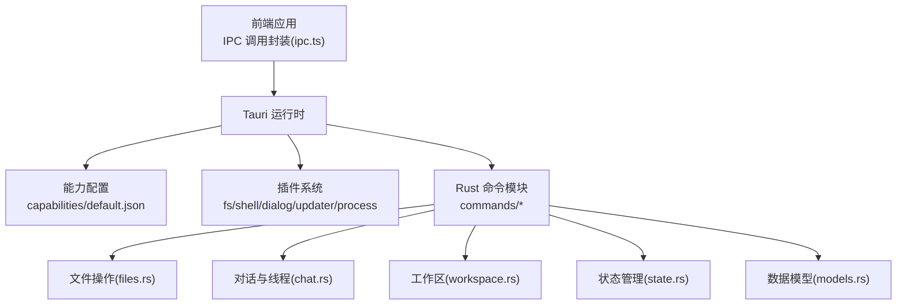
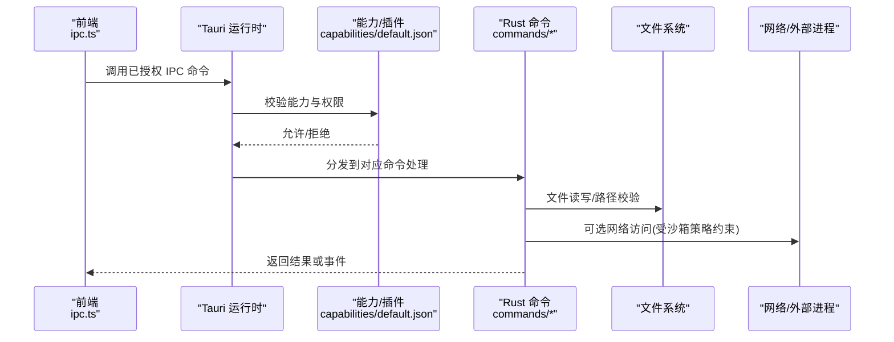
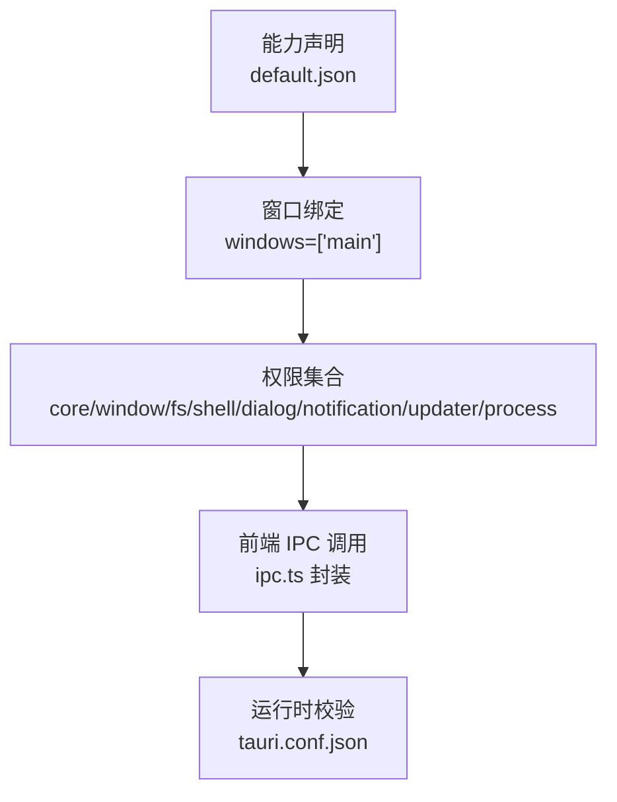
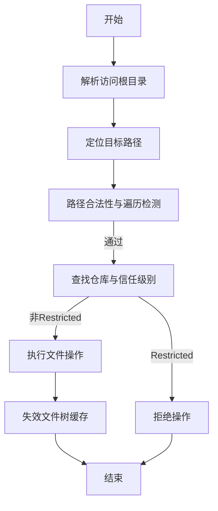
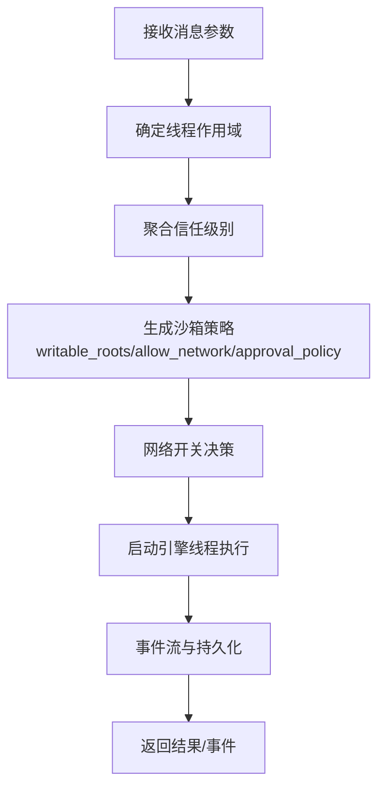
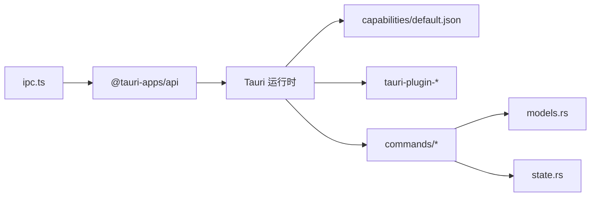

# 安全机制

<cite>
**本文引用的文件**
- [tauri.conf.json](file://src-tauri/tauri.conf.json)
- [default.json](file://src-tauri/capabilities/default.json)
- [ipc.ts](file://src/lib/ipc.ts)
- [main.rs](file://src-tauri/src/main.rs)
- [Cargo.toml](file://src-tauri/Cargo.toml)
- [files.rs](file://src-tauri/src/commands/files.rs)
- [chat.rs](file://src-tauri/src/commands/chat.rs)
- [workspace.rs](file://src-tauri/src/commands/workspace.rs)
- [state.rs](file://src-tauri/src/state.rs)
- [models.rs](file://src-tauri/src/models.rs)
</cite>

## 目录
1. [简介](#简介)
2. [项目结构](#项目结构)
3. [核心组件](#核心组件)
4. [架构总览](#架构总览)
5. [详细组件分析](#详细组件分析)
6. [依赖关系分析](#依赖关系分析)
7. [性能考量](#性能考量)
8. [故障排查指南](#故障排查指南)
9. [结论](#结论)
10. [附录](#附录)

## 简介
本文件系统性梳理 Panes 的 IPC 安全机制与 Tauri 能力体系，重点覆盖权限控制系统、能力配置、安全边界与访问控制策略。内容涵盖：
- Tauri 能力系统与窗口权限
- 文件系统访问限制与路径遍历防护
- 线程执行策略（沙箱模式、审批策略、网络开关）
- 安全配置最佳实践、权限最小化原则、安全审计与漏洞防护
- 安全配置指南、风险评估方法与安全监控策略

## 项目结构
Panes 基于 Tauri v2 构建，前端通过 @tauri-apps/api 与后端 Rust 命令进行 IPC 通信；后端通过“能力”（capability）与插件授权前端调用受限功能。

图表来源
- [ipc.ts](file://src/lib/ipc.ts)
- [tauri.conf.json](file://src-tauri/tauri.conf.json)
- [default.json](file://src-tauri/capabilities/default.json)
- [files.rs](file://src-tauri/src/commands/files.rs)
- [chat.rs](file://src-tauri/src/commands/chat.rs)
- [workspace.rs](file://src-tauri/src/commands/workspace.rs)
- [state.rs](file://src-tauri/src/state.rs)
- [models.rs](file://src-tauri/src/models.rs)

章节来源
- [tauri.conf.json:1-58](file://src-tauri/tauri.conf.json#L1-L58)
- [default.json:1-23](file://src-tauri/capabilities/default.json#L1-L23)
- [ipc.ts:1-792](file://src/lib/ipc.ts#L1-L792)

## 核心组件
- 能力与插件授权：通过 capabilities/default.json 声明窗口、权限与插件能力，前端仅能调用被显式授权的 IPC 命令。
- IPC 调用封装：src/lib/ipc.ts 统一封装 invoke 与事件监听，前端通过该层与后端交互。
- 后端命令模块：commands/* 提供具体业务能力，如文件读写、对话执行、工作区管理等。
- 沙箱与审批策略：chat.rs 中根据线程信任级别、引擎类型与用户配置生成沙箱策略，控制网络访问、可写根目录与审批策略。
- 路径与访问控制：files.rs 对文件操作进行信任级别检查、路径规范化与遍历检测，防止越权访问。

章节来源
- [default.json:6-21](file://src-tauri/capabilities/default.json#L6-L21)
- [ipc.ts:72-627](file://src/lib/ipc.ts#L72-L627)
- [chat.rs:383-762](file://src-tauri/src/commands/chat.rs#L383-L762)
- [files.rs:67-107](file://src-tauri/src/commands/files.rs#L67-L107)

## 架构总览
下图展示 IPC 流程与安全边界：

图表来源
- [ipc.ts:72-627](file://src/lib/ipc.ts#L72-L627)
- [default.json:6-21](file://src-tauri/capabilities/default.json#L6-L21)
- [files.rs:67-107](file://src-tauri/src/commands/files.rs#L67-L107)
- [chat.rs:622-663](file://src-tauri/src/commands/chat.rs#L622-L663)

## 详细组件分析

### 能力系统与窗口权限
- 能力标识与描述：default.json 定义能力 identifier 与 description，并绑定到窗口名称列表。
- 权限清单：包含窗口控制、shell 打开、对话框、文件读取文本、通知、更新器、进程重启等权限项。
- 插件依赖：Cargo.toml 显式启用 tauri-plugin-*，确保运行时具备相应能力。

图表来源
- [default.json:1-23](file://src-tauri/capabilities/default.json#L1-L23)
- [tauri.conf.json:47-56](file://src-tauri/tauri.conf.json#L47-L56)
- [Cargo.toml:19-25](file://src-tauri/Cargo.toml#L19-L25)

章节来源
- [default.json:1-23](file://src-tauri/capabilities/default.json#L1-L23)
- [tauri.conf.json:47-56](file://src-tauri/tauri.conf.json#L47-L56)
- [Cargo.toml:19-25](file://src-tauri/Cargo.toml#L19-L25)

### 文件系统访问控制
- 信任级别检查：写入、创建、重命名、删除等操作在 files.rs 中对目标仓库的 trust_level 进行检查，Restricted 仓库默认禁止修改。
- 路径规范化与遍历防护：resolve_target_path_for_repo_lookup 对输入路径进行规范化、符号链接与 canonical 化校验，确保不越出访问根目录。
- 缓存失效：文件变更后使文件树缓存失效，保证 UI 与后端状态一致。

图表来源
- [files.rs:67-107](file://src-tauri/src/commands/files.rs#L67-L107)
- [files.rs:482-530](file://src-tauri/src/commands/files.rs#L482-L530)

章节来源
- [files.rs:67-107](file://src-tauri/src/commands/files.rs#L67-L107)
- [files.rs:482-530](file://src-tauri/src/commands/files.rs#L482-L530)

### 对话与线程执行策略（沙箱、审批、网络）
- 沙箱模式与可写根目录：根据线程作用域（仓库/工作区）与信任级别计算 writable_roots；支持 workspace-write 等模式。
- 网络访问控制：当为 Codex 且使用外部沙箱时，禁用本地沙箱覆盖；否则由信任级别与用户配置决定 allow_network。
- 审批策略：依据引擎与信任级别选择默认审批策略；Codex 支持权限配置文件(permission_profile)与审批审查者。
- 并发与取消：TurnManager 防止同一线程并发执行，支持取消与完成清理。

图表来源
- [chat.rs:521-533](file://src-tauri/src/commands/chat.rs#L521-L533)
- [chat.rs:622-663](file://src-tauri/src/commands/chat.rs#L622-L663)
- [state.rs:26-55](file://src-tauri/src/state.rs#L26-L55)

章节来源
- [chat.rs:521-533](file://src-tauri/src/commands/chat.rs#L521-L533)
- [chat.rs:622-663](file://src-tauri/src/commands/chat.rs#L622-L663)
- [state.rs:26-55](file://src-tauri/src/state.rs#L26-L55)

### 数据模型与信任级别
- TrustLevelDto：trusted/standard/restricted 三种信任级别，用于影响文件操作与执行策略。
- ThreadStatusDto：线程状态机，支持 streaming/awaiting_approval/error/completed 等状态。
- 引擎能力与模型：EngineCapabilitiesDto 与 EngineModelDto 描述引擎能力、附件模态与推理努力选项。

章节来源
- [models.rs:33-57](file://src-tauri/src/models.rs#L33-L57)
- [models.rs:121-151](file://src-tauri/src/models.rs#L121-L151)
- [models.rs:256-265](file://src-tauri/src/models.rs#L256-L265)

## 依赖关系分析
- 前端依赖：@tauri-apps/api 提供 invoke/listen；ipc.ts 封装所有 IPC 接口。
- 后端依赖：tauri 与各插件（fs/shell/dialog/notification/updater/process），以及业务模块（commands/*）。
- 能力与插件：能力文件 default.json 与 Cargo.toml 中的插件启用共同决定前端可用能力。

图表来源
- [ipc.ts:1-7](file://src/lib/ipc.ts#L1-L7)
- [Cargo.toml:19-25](file://src-tauri/Cargo.toml#L19-L25)
- [default.json:1-23](file://src-tauri/capabilities/default.json#L1-L23)

章节来源
- [ipc.ts:1-7](file://src/lib/ipc.ts#L1-L7)
- [Cargo.toml:19-25](file://src-tauri/Cargo.toml#L19-L25)
- [default.json:1-23](file://src-tauri/capabilities/default.json#L1-L23)

## 性能考量
- 异步与任务池：命令处理广泛使用 tokio::task::spawn_blocking 与异步通道，避免阻塞 UI 线程。
- 缓存与增量更新：文件树缓存与数据库批量刷新策略减少重复 IO 与渲染压力。
- 事件合并与节流：聊天事件流存在合并与节流阈值，降低前端渲染与网络传输负担。

章节来源
- [chat.rs:34-41](file://src-tauri/src/commands/chat.rs#L34-L41)
- [workspace.rs:330-343](file://src-tauri/src/commands/workspace.rs#L330-L343)

## 故障排查指南
- IPC 调用失败
  - 检查能力是否已授权：确认 capabilities/default.json 中包含所需权限。
  - 检查插件启用：确认 Cargo.toml 中对应插件已启用。
  - 检查命令签名与参数：核对 ipc.ts 中 invoke 参数与后端命令定义。
- 文件操作异常
  - 确认目标路径未越权：检查 resolve_target_path_for_repo_lookup 的路径校验逻辑。
  - 确认仓库信任级别：Restricted 仓库禁止直接编辑。
- 线程执行问题
  - 查看 TurnManager 是否已注册：避免并发执行。
  - 检查沙箱策略与网络开关：确认 allow_network 与 writable_roots 设置。
  - 审批策略与权限配置：核对 approval_policy 与 permission_profile。

章节来源
- [default.json:6-21](file://src-tauri/capabilities/default.json#L6-L21)
- [Cargo.toml:19-25](file://src-tauri/Cargo.toml#L19-L25)
- [files.rs:67-107](file://src-tauri/src/commands/files.rs#L67-L107)
- [state.rs:32-54](file://src-tauri/src/state.rs#L32-L54)
- [chat.rs:622-663](file://src-tauri/src/commands/chat.rs#L622-L663)

## 结论
Panes 的安全机制以“能力+插件+命令”的分层授权为核心，结合信任级别、沙箱策略与审批流程，形成从 IPC 边界到文件系统与网络访问的多维安全控制。通过路径规范化与遍历检测、并发控制与事件流优化，既保障了安全性，也兼顾了性能与用户体验。建议持续遵循权限最小化原则，定期审计能力清单与执行策略，并建立完善的安全监控与应急响应机制。

## 附录

### 安全配置最佳实践
- 权限最小化：仅授予完成任务所需的最小权限集合，避免授予全局读写或高危能力。
- 能力与插件分离：明确区分能力（前端可调用范围）与插件（运行时能力），按需启用。
- 信任级别治理：对不同来源仓库设置不同信任级别，限制 Restricted 仓库的写操作。
- 沙箱与网络：默认关闭网络访问，仅在必要场景开启；严格限定 writable_roots。
- 审批策略：为高风险动作启用审批策略，必要时引入外部审查者。

### 风险评估方法
- 能力清单审计：逐项核对 capabilities/default.json，识别潜在高危权限。
- 命令调用链追踪：基于 ipc.ts 与命令模块，绘制前端调用到后端处理的完整链路。
- 访问控制矩阵：以仓库/工作区为维度，评估 trust_level、writable_roots、allow_network 的组合风险。
- 第三方集成评估：对 updater、shell/open、网络请求等进行独立风险评估。

### 安全监控策略
- 日志与告警：记录 IPC 调用、文件操作、网络访问与线程执行的关键事件。
- 定期扫描：对能力清单与执行策略进行周期性扫描与回归测试。
- 审计报告：生成权限使用与执行策略的审计报告，识别异常与越权行为。