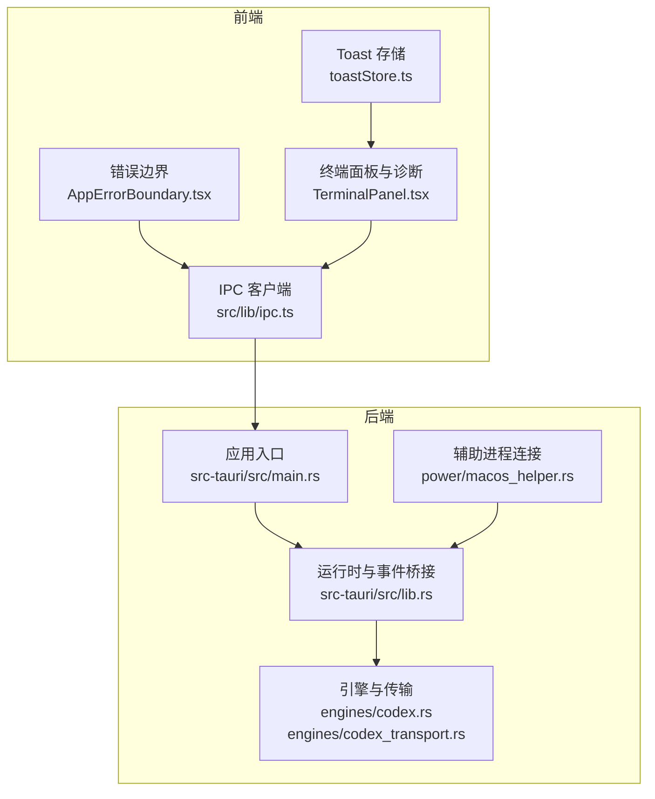
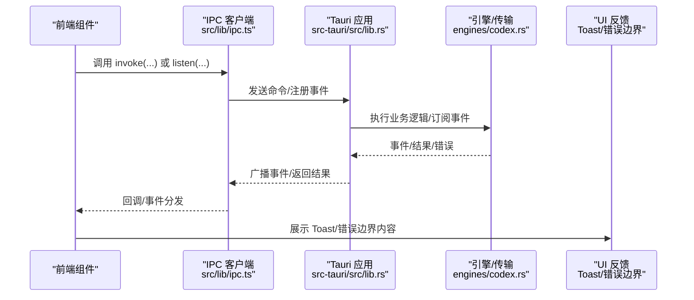
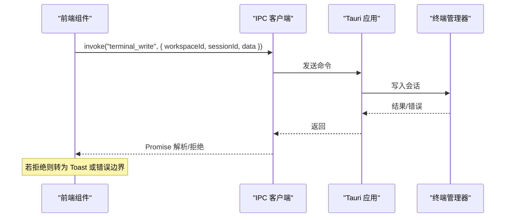
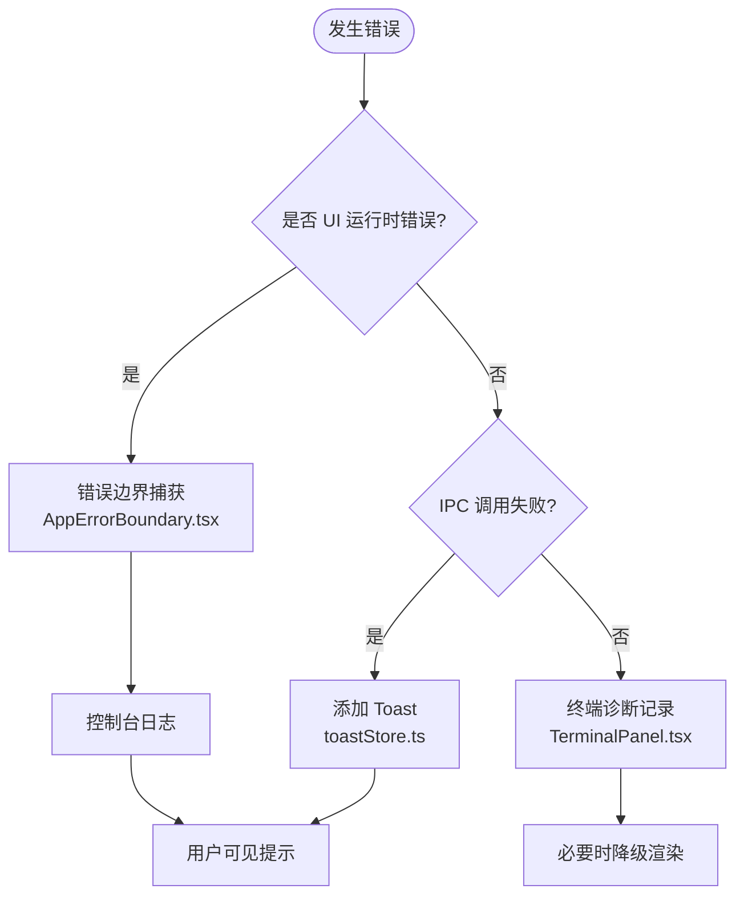
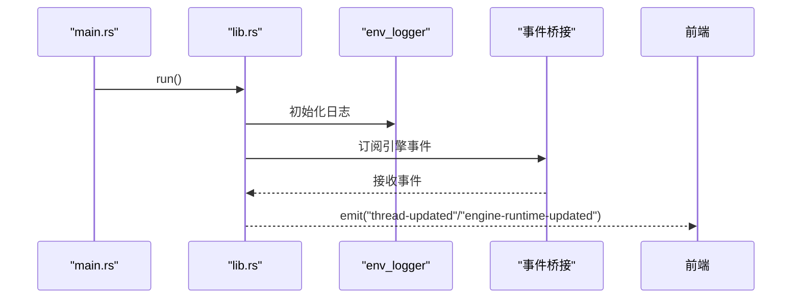
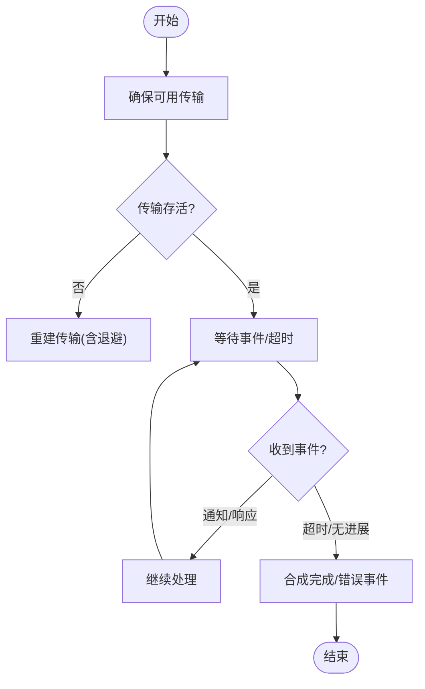
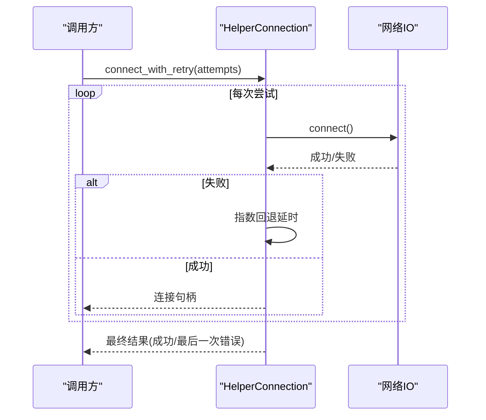
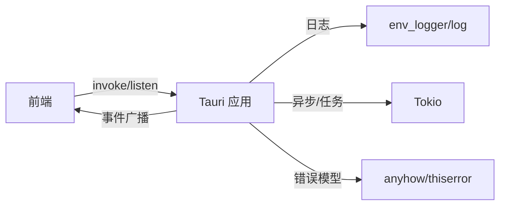

# 错误处理

<cite>
**本文引用的文件**
- [src/lib/ipc.ts](file://src/lib/ipc.ts)
- [src/components/shared/AppErrorBoundary.tsx](file://src/components/shared/AppErrorBoundary.tsx)
- [src/components/terminal/TerminalPanel.tsx](file://src/components/terminal/TerminalPanel.tsx)
- [src/stores/toastStore.ts](file://src/stores/toastStore.ts)
- [src-tauri/src/main.rs](file://src-tauri/src/main.rs)
- [src-tauri/src/lib.rs](file://src-tauri/src/lib.rs)
- [src-tauri/src/engines/codex.rs](file://src-tauri/src/engines/codex.rs)
- [src-tauri/src/engines/codex_transport.rs](file://src-tauri/src/engines/codex_transport.rs)
- [src-tauri/src/power/macos_helper.rs](file://src-tauri/src/power/macos_helper.rs)
- [src-tauri/Cargo.toml](file://src-tauri/Cargo.toml)
</cite>

## 目录
1. [简介](#简介)
2. [项目结构](#项目结构)
3. [核心组件](#核心组件)
4. [架构总览](#架构总览)
5. [详细组件分析](#详细组件分析)
6. [依赖关系分析](#依赖关系分析)
7. [性能考量](#性能考量)
8. [故障排除指南](#故障排除指南)
9. [结论](#结论)
10. [附录](#附录)

## 简介
本文件系统性梳理 Panes 的 IPC 错误处理体系，覆盖前端错误边界与用户反馈、后端引擎与进程间通信的异常捕获与恢复、错误日志与诊断、以及重试与降级策略。重点解释错误在前端与后端之间的传播路径、错误类型与分类、格式化与呈现方式，并提供可操作的诊断工具与排障建议。

## 项目结构
围绕 IPC 错误处理的关键位置如下：
- 前端 IPC 调用与事件监听：src/lib/ipc.ts
- 前端错误边界：src/components/shared/AppErrorBoundary.tsx
- 终端渲染与诊断：src/components/terminal/TerminalPanel.tsx
- 用户提示（Toast）：src/stores/toastStore.ts
- 后端应用入口与日志初始化：src-tauri/src/main.rs、src-tauri/src/lib.rs
- 引擎与传输层错误建模与恢复：src-tauri/src/engines/codex.rs、src-tauri/src/engines/codex_transport.rs
- 辅助进程连接与超时重试：src-tauri/src/power/macos_helper.rs
- 日志与依赖：src-tauri/Cargo.toml（env_logger、log）

**图示来源**
- [src/lib/ipc.ts](file://src/lib/ipc.ts)
- [src/components/shared/AppErrorBoundary.tsx](file://src/components/shared/AppErrorBoundary.tsx)
- [src/components/terminal/TerminalPanel.tsx](file://src/components/terminal/TerminalPanel.tsx)
- [src/stores/toastStore.ts](file://src/stores/toastStore.ts)
- [src-tauri/src/main.rs](file://src-tauri/src/main.rs)
- [src-tauri/src/lib.rs](file://src-tauri/src/lib.rs)
- [src-tauri/src/engines/codex.rs](file://src-tauri/src/engines/codex.rs)
- [src-tauri/src/engines/codex_transport.rs](file://src-tauri/src/engines/codex_transport.rs)
- [src-tauri/src/power/macos_helper.rs](file://src-tauri/src/power/macos_helper.rs)

**章节来源**
- [src/lib/ipc.ts](file://src/lib/ipc.ts)
- [src/components/shared/AppErrorBoundary.tsx](file://src/components/shared/AppErrorBoundary.tsx)
- [src/components/terminal/TerminalPanel.tsx](file://src/components/terminal/TerminalPanel.tsx)
- [src/stores/toastStore.ts](file://src/stores/toastStore.ts)
- [src-tauri/src/main.rs](file://src-tauri/src/main.rs)
- [src-tauri/src/lib.rs](file://src-tauri/src/lib.rs)
- [src-tauri/src/engines/codex.rs](file://src-tauri/src/engines/codex.rs)
- [src-tauri/src/engines/codex_transport.rs](file://src-tauri/src/engines/codex_transport.rs)
- [src-tauri/src/power/macos_helper.rs](file://src-tauri/src/power/macos_helper.rs)
- [src-tauri/Cargo.toml](file://src-tauri/Cargo.toml)

## 核心组件
- 前端 IPC 客户端：封装 Tauri invoke 与事件监听，统一错误返回与事件订阅。
- 错误边界：捕获 UI 运行时错误，输出可读信息并保留堆栈以便调试。
- 终端诊断与降级：记录渲染器状态、图像插件初始化与运行时错误、WebGL 上下文丢失等，必要时降级到 Canvas 渲染。
- Toast 提示：集中管理成功/警告/错误/信息类提示，控制时长与上限。
- 后端日志与事件桥：初始化日志、桥接引擎事件到前端，统一错误与告警。
- 引擎与传输：RPC 错误建模、超时与流中断恢复、重连退避与降级。
- 辅助进程：带超时与指数回退的连接重试，避免阻塞启动。

**章节来源**
- [src/lib/ipc.ts](file://src/lib/ipc.ts)
- [src/components/shared/AppErrorBoundary.tsx](file://src/components/shared/AppErrorBoundary.tsx)
- [src/components/terminal/TerminalPanel.tsx](file://src/components/terminal/TerminalPanel.tsx)
- [src/stores/toastStore.ts](file://src/stores/toastStore.ts)
- [src-tauri/src/lib.rs](file://src-tauri/src/lib.rs)
- [src-tauri/src/engines/codex.rs](file://src-tauri/src/engines/codex.rs)
- [src-tauri/src/engines/codex_transport.rs](file://src-tauri/src/engines/codex_transport.rs)
- [src-tauri/src/power/macos_helper.rs](file://src-tauri/src/power/macos_helper.rs)

## 架构总览
从前端调用到后端命令执行，再到引擎事件与前端 UI 反馈的完整链路如下：

**图示来源**
- [src/lib/ipc.ts](file://src/lib/ipc.ts)
- [src-tauri/src/lib.rs](file://src-tauri/src/lib.rs)
- [src-tauri/src/engines/codex.rs](file://src-tauri/src/engines/codex.rs)
- [src/stores/toastStore.ts](file://src/stores/toastStore.ts)
- [src/components/shared/AppErrorBoundary.tsx](file://src/components/shared/AppErrorBoundary.tsx)

## 详细组件分析

### 前端 IPC 错误传播与事件监听
- 统一通过 invoke 调用后端命令，返回值为 Promise；调用侧需在 .catch 中处理错误。
- 事件监听通过 listen 注册，回调中直接消费数据；若需要错误传播，应在回调内进行错误处理或转换为 Toast。
- 写入新会话命令采用“等待输出就绪 + 超时兜底”的策略，避免立即写入导致失败。

**图示来源**
- [src/lib/ipc.ts](file://src/lib/ipc.ts)

**章节来源**
- [src/lib/ipc.ts](file://src/lib/ipc.ts)

### 前端错误边界与用户反馈
- 错误边界捕获子树错误，记录控制台日志，并以结构化方式展示错误信息（包含堆栈或消息）。
- ToastStore 提供统一的提示存储与派发，支持不同级别与默认时长，限制最大数量，自动清理过期项。
- 终端面板对渲染器错误进行分类记录（如图像插件初始化/运行时错误、WebGL 上下文丢失），并触发降级策略。

**图示来源**
- [src/components/shared/AppErrorBoundary.tsx](file://src/components/shared/AppErrorBoundary.tsx)
- [src/stores/toastStore.ts](file://src/stores/toastStore.ts)
- [src/components/terminal/TerminalPanel.tsx](file://src/components/terminal/TerminalPanel.tsx)

**章节来源**
- [src/components/shared/AppErrorBoundary.tsx](file://src/components/shared/AppErrorBoundary.tsx)
- [src/stores/toastStore.ts](file://src/stores/toastStore.ts)
- [src/components/terminal/TerminalPanel.tsx](file://src/components/terminal/TerminalPanel.tsx)

### 后端日志初始化与事件桥接
- 应用入口在启动时初始化日志（env_logger），确保后续 log::debug/warn/info 能被输出。
- 运行时桥接将引擎事件（如线程更新、协议诊断）广播到前端，便于 UI 实时感知。

**图示来源**
- [src-tauri/src/main.rs](file://src-tauri/src/main.rs)
- [src-tauri/src/lib.rs](file://src-tauri/src/lib.rs)

**章节来源**
- [src-tauri/src/main.rs](file://src-tauri/src/main.rs)
- [src-tauri/src/lib.rs](file://src-tauri/src/lib.rs)

### 引擎与传输层错误建模与恢复
- RPC 错误类型与显示：定义可打印的 RPC 错误，用于日志与 UI 显示。
- 传输层错误负载：对大字段进行裁剪，避免日志膨胀；解析失败时构造安全载荷。
- 传输监控：检测 EOF/读取错误等传输事件，及时退出监控循环并尝试恢复。
- 超时与恢复：对速率限制查询、会话请求等设置超时；在无进展时合成完成事件并发出错误事件。
- 重连与退避：确保可用传输，若不存活则重建；在失败时记录并允许使用旧诊断。

**图示来源**
- [src-tauri/src/engines/codex.rs](file://src-tauri/src/engines/codex.rs)
- [src-tauri/src/engines/codex_transport.rs](file://src-tauri/src/engines/codex_transport.rs)

**章节来源**
- [src-tauri/src/engines/codex.rs](file://src-tauri/src/engines/codex.rs)
- [src-tauri/src/engines/codex_transport.rs](file://src-tauri/src/engines/codex_transport.rs)

### 辅助进程连接与超时重试
- 对外提供连接函数，内部使用超时包装；若超时则返回“超时”错误。
- 提供带次数限制的重试函数，采用指数回退延迟（500ms → 1s → 2s）以缓解瞬时失败。

**图示来源**
- [src-tauri/src/power/macos_helper.rs](file://src-tauri/src/power/macos_helper.rs)

**章节来源**
- [src-tauri/src/power/macos_helper.rs](file://src-tauri/src/power/macos_helper.rs)

## 依赖关系分析
- 日志：env_logger 与 log 提供统一日志入口，贯穿前后端。
- 错误模型：anyhow 与 thiserror 用于错误携带上下文与可组合错误类型。
- 异步：Tokio 提供任务调度、超时与广播通道，支撑引擎与事件桥接。
- IPC：@tauri-apps/api 提供 invoke 与 listen，作为前端与后端交互的桥梁。

**图示来源**
- [src-tauri/Cargo.toml](file://src-tauri/Cargo.toml)
- [src/lib/ipc.ts](file://src/lib/ipc.ts)
- [src-tauri/src/lib.rs](file://src-tauri/src/lib.rs)

**章节来源**
- [src-tauri/Cargo.toml](file://src-tauri/Cargo.toml)
- [src-tauri/src/lib.rs](file://src-tauri/src/lib.rs)

## 性能考量
- 终端渲染降级：当 WebGL 初始化失败或上下文丢失时，自动切换到 Canvas，保证可用性但可能降低性能；应结合用户偏好与设备能力动态调整。
- 传输重建退避：指数回退减少对远端服务的压力，同时提升成功率；可根据实际网络状况调整基线与上限。
- 事件桥接与广播：广播通道可能产生丢帧（lagged），需在桥接层记录并跳过滞后事件，避免阻塞主循环。
- IPC 调用超时：对关键命令设置合理超时，避免 UI 阻塞；对非关键命令采用后台刷新策略。

[本节为通用指导，无需特定文件引用]

## 故障排除指南
- UI 崩溃与白屏
  - 使用错误边界捕获并记录堆栈；检查控制台输出定位根因。
  - 若为渲染器错误，查看终端面板诊断日志，确认是否已触发降级。
- IPC 调用失败
  - 在调用处添加 .catch 并转为 Toast；核对命令名与参数类型。
  - 对新建会话写入失败，确认“输出就绪”事件是否到达，否则走超时兜底路径。
- 引擎/传输异常
  - 查看日志中“transport/eof/readerror”等事件，确认传输是否存活。
  - 若出现速率限制或超时，关注桥接层是否合成完成事件并发出错误。
- 辅助进程连接失败
  - 观察超时与回退日志；检查目标进程可用性与权限。
- 诊断与调试技巧
  - 启用终端调试开关，观察渲染器诊断与错误计数。
  - 使用日志过滤（env_logger）聚焦相关模块（如 “[terminal]”、“codex”）。
  - 在开发模式下，利用 Tauri 开发窗口的终端输出快速定位问题。

**章节来源**
- [src/components/shared/AppErrorBoundary.tsx](file://src/components/shared/AppErrorBoundary.tsx)
- [src/components/terminal/TerminalPanel.tsx](file://src/components/terminal/TerminalPanel.tsx)
- [src/lib/ipc.ts](file://src/lib/ipc.ts)
- [src-tauri/src/engines/codex.rs](file://src-tauri/src/engines/codex.rs)
- [src-tauri/src/power/macos_helper.rs](file://src-tauri/src/power/macos_helper.rs)

## 结论
Panes 的 IPC 错误处理体系通过“前端错误边界 + 统一 IPC 客户端 + 后端日志与事件桥 + 引擎传输层恢复 + 辅助进程重试”形成闭环：既能在前端快速暴露问题并引导用户，也能在后端稳定恢复与降级，保障核心功能可用。建议在新增 IPC 路径时遵循现有模式，统一错误格式与日志标签，持续完善诊断与降级策略。

[本节为总结，无需特定文件引用]

## 附录
- 错误类型与分类（基于代码可见行为）
  - UI 运行时错误：由错误边界捕获，用于保护应用不崩溃。
  - IPC 调用错误：invoke 返回 Promise 拒绝，需在调用侧处理。
  - 传输层错误：EOF/读取错误等，触发传输失效与重建。
  - 超时与无进展：速率限制/会话请求超时，合成完成事件并发出错误。
  - 渲染器错误：图像插件初始化/运行时错误、WebGL 上下文丢失，触发降级。
- 用户反馈规范
  - 成功/信息：短时长，适合轻量提示。
  - 警告/错误：较长时长，确保用户注意到。
  - Toast 数量上限：避免刷屏，超出时移除最早一条。

[本节为概念性汇总，无需特定文件引用]