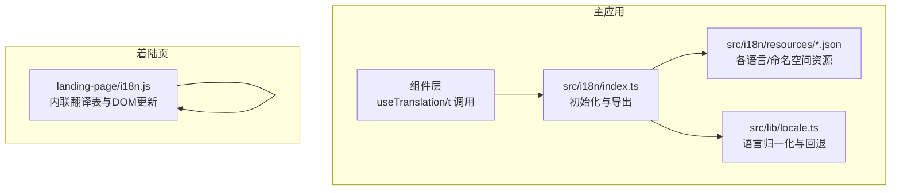
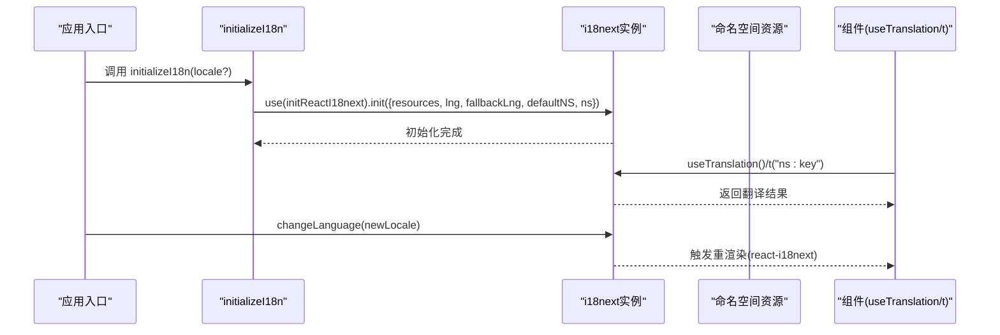
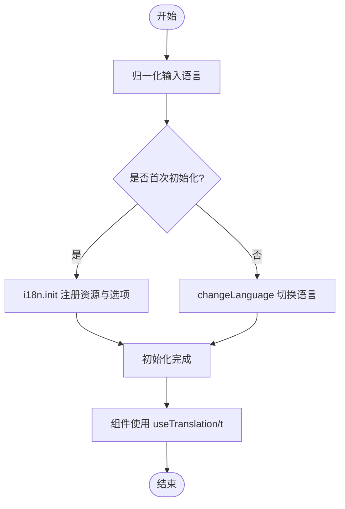
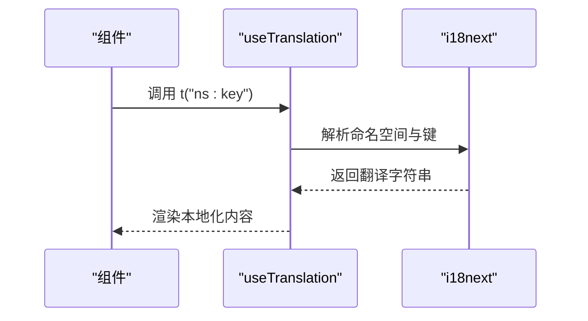
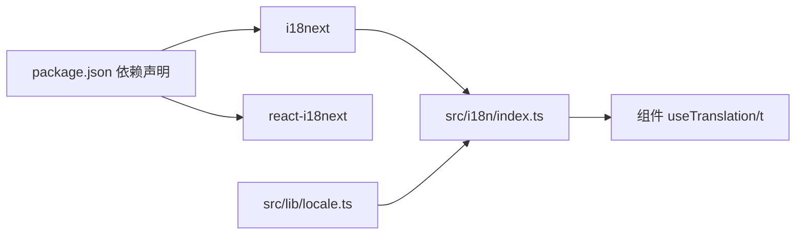

# 国际化支持

<cite>
**本文引用的文件**
- [src/i18n/index.ts](file://src/i18n/index.ts)
- [src/i18n/resources.test.ts](file://src/i18n/resources.test.ts)
- [src/lib/locale.ts](file://src/lib/locale.ts)
- [src/i18n/resources/en/common.json](file://src/i18n/resources/en/common.json)
- [src/i18n/resources/zh-CN/common.json](file://src/i18n/resources/zh-CN/common.json)
- [landing-page/i18n.js](file://landing-page/i18n.js)
- [src/App.tsx](file://src/App.tsx)
- [src/components/chat/ChatPanel.tsx](file://src/components/chat/ChatPanel.tsx)
- [src/components/shared/CommandPalette.tsx](file://src/components/shared/CommandPalette.tsx)
- [package.json](file://package.json)
</cite>

## 目录
1. [简介](#简介)
2. [项目结构](#项目结构)
3. [核心组件](#核心组件)
4. [架构总览](#架构总览)
5. [详细组件分析](#详细组件分析)
6. [依赖分析](#依赖分析)
7. [性能考量](#性能考量)
8. [故障排查指南](#故障排查指南)
9. [结论](#结论)
10. [附录](#附录)

## 简介
本文件系统性阐述 Panes 的国际化（i18n）支持，覆盖多语言配置架构、翻译资源管理与本地化流程；详解 i18next 与 react-i18next 的集成方式、命名空间（namespace）结构、键值对组织与初始化流程；提供翻译工作流、质量保证测试方法、多语言调试技巧；并给出新增语言支持指南、翻译最佳实践与一致性维护策略，以及文本提取、翻译记忆与自动化工具集成建议。

## 项目结构
Panes 的国际化由两部分组成：
- 主应用国际化：基于 i18next 与 react-i18next，在 src/i18n 下集中管理资源与初始化逻辑，并通过 hooks 在组件中消费。
- 着陆页国际化：独立的 landing-page/i18n.js 提供静态页面的语言切换能力，采用内联翻译表与 DOM 更新函数实现。

图表来源
- [src/i18n/index.ts:1-86](file://src/i18n/index.ts#L1-L86)
- [src/lib/locale.ts:1-55](file://src/lib/locale.ts#L1-L55)
- [landing-page/i18n.js:1-515](file://landing-page/i18n.js#L1-L515)

章节来源
- [src/i18n/index.ts:1-86](file://src/i18n/index.ts#L1-L86)
- [src/lib/locale.ts:1-55](file://src/lib/locale.ts#L1-L55)
- [landing-page/i18n.js:1-515](file://landing-page/i18n.js#L1-L515)

## 核心组件
- 初始化与导出
  - 使用 i18next 与 initReactI18next 完成初始化，注册命名空间与资源，设置默认语言与回退语言。
  - 导出 initializeI18n 用于在应用启动时调用；导出 t 函数以支持直接键名翻译。
- 语言归一化
  - 支持 en、pt-BR、zh-CN；对输入进行大小写、下划线替换等处理，确保匹配。
  - 提供浏览器语言回退与显示名称解析。
- 资源组织
  - 每个语言目录包含多个命名空间 JSON 文件（如 common、app、chat、workspace、setup、git、native），便于模块化与按需维护。
- 组件消费
  - 大量组件通过 useTranslation 或直接调用 t 实现本地化文案渲染。
- 测试保障
  - 对比不同语言的键集合，确保键一致性；验证特定键的存在性，避免运行期缺失。

章节来源
- [src/i18n/index.ts:58-86](file://src/i18n/index.ts#L58-L86)
- [src/lib/locale.ts:1-55](file://src/lib/locale.ts#L1-L55)
- [src/i18n/resources.test.ts:51-106](file://src/i18n/resources.test.ts#L51-L106)
- [src/i18n/resources/en/common.json:1-29](file://src/i18n/resources/en/common.json#L1-L29)
- [src/i18n/resources/zh-CN/common.json:1-29](file://src/i18n/resources/zh-CN/common.json#L1-L29)

## 架构总览
主应用国际化采用“集中式资源 + 动态初始化”的模式：
- 初始化阶段：读取所有命名空间资源，设置默认命名空间与回退语言，启用 react-i18next。
- 运行阶段：组件通过 useTranslation 获取翻译函数；也可通过 t 直接传入键名或带命名空间的键名。
- 语言切换：通过 initializeI18n 切换语言，内部复用 i18n.changeLanguage。

图表来源
- [src/i18n/index.ts:58-86](file://src/i18n/index.ts#L58-L86)
- [src/components/chat/ChatPanel.tsx:46](file://src/components/chat/ChatPanel.tsx#L46)
- [src/App.tsx:113-116](file://src/App.tsx#L113-L116)

## 详细组件分析

### 初始化与命名空间
- 命名空间与资源
  - 默认命名空间为 common；显式命名空间列表包含 common、app、chat、workspace、setup、git、native。
  - 资源以语言为根目录，每个语言下包含上述命名空间的 JSON 文件。
- 初始化流程
  - 首次初始化时执行 i18n.init；后续仅调用 changeLanguage，避免重复初始化。
  - 归一化输入语言，确保兼容多种输入形式（如 zh_CN、zh-Hans、pt 等）。
- 键值组织
  - 采用层级键路径（如 common.actions.allow），便于分组与查找。
  - 通过测试对比不同语言的键集合，确保一致性。

图表来源
- [src/i18n/index.ts:58-86](file://src/i18n/index.ts#L58-L86)
- [src/lib/locale.ts:5-31](file://src/lib/locale.ts#L5-L31)

章节来源
- [src/i18n/index.ts:26-54](file://src/i18n/index.ts#L26-L54)
- [src/i18n/index.ts:58-86](file://src/i18n/index.ts#L58-L86)
- [src/lib/locale.ts:1-35](file://src/lib/locale.ts#L1-L35)

### 组件中的使用模式
- hooks 使用
  - 大多数组件通过 useTranslation 获取翻译函数，再以 ns:key 或直接键名渲染文案。
- 直接键名
  - 当默认命名空间为 common 时，可直接传入键名；否则需显式指定命名空间。
- 示例路径
  - 在 App.tsx 中使用 t 渲染通知文案。
  - 在 ChatPanel.tsx 与 CommandPalette.tsx 中使用 useTranslation 进行本地化渲染。

图表来源
- [src/components/chat/ChatPanel.tsx:46](file://src/components/chat/ChatPanel.tsx#L46)
- [src/components/shared/CommandPalette.tsx:3-4](file://src/components/shared/CommandPalette.tsx#L3-L4)
- [src/App.tsx:113-116](file://src/App.tsx#L113-L116)

章节来源
- [src/App.tsx:113-116](file://src/App.tsx#L113-L116)
- [src/components/chat/ChatPanel.tsx:46](file://src/components/chat/ChatPanel.tsx#L46)
- [src/components/shared/CommandPalette.tsx:3-4](file://src/components/shared/CommandPalette.tsx#L3-L4)

### 资源与测试
- 资源结构
  - 每个语言目录包含多个命名空间 JSON 文件，键值为字符串或模板占位符。
- 质量保证测试
  - 对比不同语言的键集合，确保键一致性。
  - 验证关键键的存在性，避免运行期缺失导致的 UI 异常。

章节来源
- [src/i18n/resources.test.ts:51-106](file://src/i18n/resources.test.ts#L51-L106)
- [src/i18n/resources/en/common.json:1-29](file://src/i18n/resources/en/common.json#L1-L29)
- [src/i18n/resources/zh-CN/common.json:1-29](file://src/i18n/resources/zh-CN/common.json#L1-L29)

### 着陆页国际化
- 独立实现
  - landing-page/i18n.js 内置翻译表与 DOM 更新函数，支持 en 与 pt-BR。
  - 通过 URL 参数、localStorage 与浏览器语言检测确定初始语言。
  - 提供切换器与淡入效果，提升用户体验。
- 与主应用的关系
  - 着陆页为独立静态页面，不依赖主应用的 i18n 初始化流程。

章节来源
- [landing-page/i18n.js:1-515](file://landing-page/i18n.js#L1-L515)

## 依赖分析
- 外部库
  - i18next 与 react-i18next：核心国际化框架与 React 绑定。
  - 应用通过 package.json 声明依赖版本。
- 内部耦合
  - 组件通过 useTranslation 或 t 间接依赖 i18next 实例。
  - 语言归一化逻辑被初始化流程与 UI 层共同使用。

图表来源
- [package.json:60-66](file://package.json#L60-L66)
- [src/i18n/index.ts:1-3](file://src/i18n/index.ts#L1-L3)
- [src/lib/locale.ts:1-3](file://src/lib/locale.ts#L1-L3)

章节来源
- [package.json:60-66](file://package.json#L60-L66)
- [src/i18n/index.ts:1-3](file://src/i18n/index.ts#L1-L3)
- [src/lib/locale.ts:1-3](file://src/lib/locale.ts#L1-L3)

## 性能考量
- 资源加载
  - 当前实现为打包时静态引入各语言资源，初始化时一次性注入，减少运行时网络请求开销。
- 命名空间选择
  - 显式注册命名空间列表，避免不必要的命名空间解析。
- 重渲染控制
  - react-i18next 会根据命名空间与键变化触发局部重渲染，建议在高频组件中合理拆分命名空间与键路径，降低重绘范围。
- 语言切换
  - changeLanguage 为同步操作，但会触发订阅组件的重渲染；建议在语言切换后进行必要的节流或去抖。

## 故障排查指南
- 常见问题
  - 键不存在：测试用例会对比键集合，若新增键未同步到其他语言，测试会失败。请检查对应命名空间 JSON。
  - 命名空间未注册：若使用了未在 ns 列表中注册的命名空间，翻译可能为空。请在初始化时补充命名空间。
  - 语言不生效：确认输入语言已被 normalizeAppLocale 正确归一化；检查 getBrowserLocaleFallback 的回退逻辑。
- 调试技巧
  - 在组件中打印当前语言与命名空间，确认解析结果。
  - 使用浏览器开发者工具查看 react-i18next 的订阅与重渲染情况。
  - 对于着陆页，可通过 URL 参数 lang=xx 指定语言快速验证。

章节来源
- [src/i18n/resources.test.ts:51-106](file://src/i18n/resources.test.ts#L51-L106)
- [src/lib/locale.ts:37-42](file://src/lib/locale.ts#L37-L42)

## 结论
Panes 的国际化体系以 i18next 为核心，结合 react-i18next 提供了清晰的命名空间结构与一致的键值组织。通过语言归一化与测试保障，确保多语言环境下的一致性与稳定性。着陆页采用独立实现，满足静态页面的语言切换需求。整体方案简洁可靠，易于扩展与维护。

## 附录

### 新增语言支持指南
- 步骤
  - 在 src/i18n/resources 下新增语言目录（如 fr-FR），并复制现有命名空间 JSON 文件作为起点。
  - 在 src/i18n/index.ts 的 resources 中添加该语言的命名空间映射。
  - 在 src/lib/locale.ts 的 SUPPORTED_APP_LOCALES 与 normalizeAppLocale 中加入新语言的识别规则。
  - 运行测试，确保键集合与关键键存在性通过。
- 注意事项
  - 保持键名与层级结构与现有语言一致。
  - 如需在着陆页也支持新语言，需在 landing-page/i18n.js 中添加翻译表与切换逻辑。

章节来源
- [src/i18n/index.ts:26-54](file://src/i18n/index.ts#L26-L54)
- [src/lib/locale.ts:1-31](file://src/lib/locale.ts#L1-L31)
- [src/i18n/resources.test.ts:51-106](file://src/i18n/resources.test.ts#L51-L106)

### 翻译最佳实践
- 键设计
  - 使用语义化命名，避免过深嵌套；优先使用 common 作为默认命名空间。
  - 对需要复用的通用文案放入 common，功能域文案放入对应命名空间。
- 模板与变量
  - 使用 i18next 的插值语法传递变量，避免硬编码拼接。
- 一致性维护
  - 通过测试强制键集合对齐；定期扫描新增键并补齐到其他语言。
- 可访问性
  - 为交互元素提供 aria-label 文案，确保屏幕阅读器可用。

### 自动化与工具集成
- 文本提取
  - 基于 AST 扫描组件中的 t 与 useTranslation 调用，生成待翻译键清单。
- 翻译记忆
  - 将历史翻译存入缓存，新键出现时自动提示相似键与上下文。
- CI 集成
  - 在 CI 中运行资源测试，阻断键不一致的合并请求。
- 着陆页
  - 保持 landing-page/i18n.js 的翻译表与主应用命名空间一致，避免文案漂移。