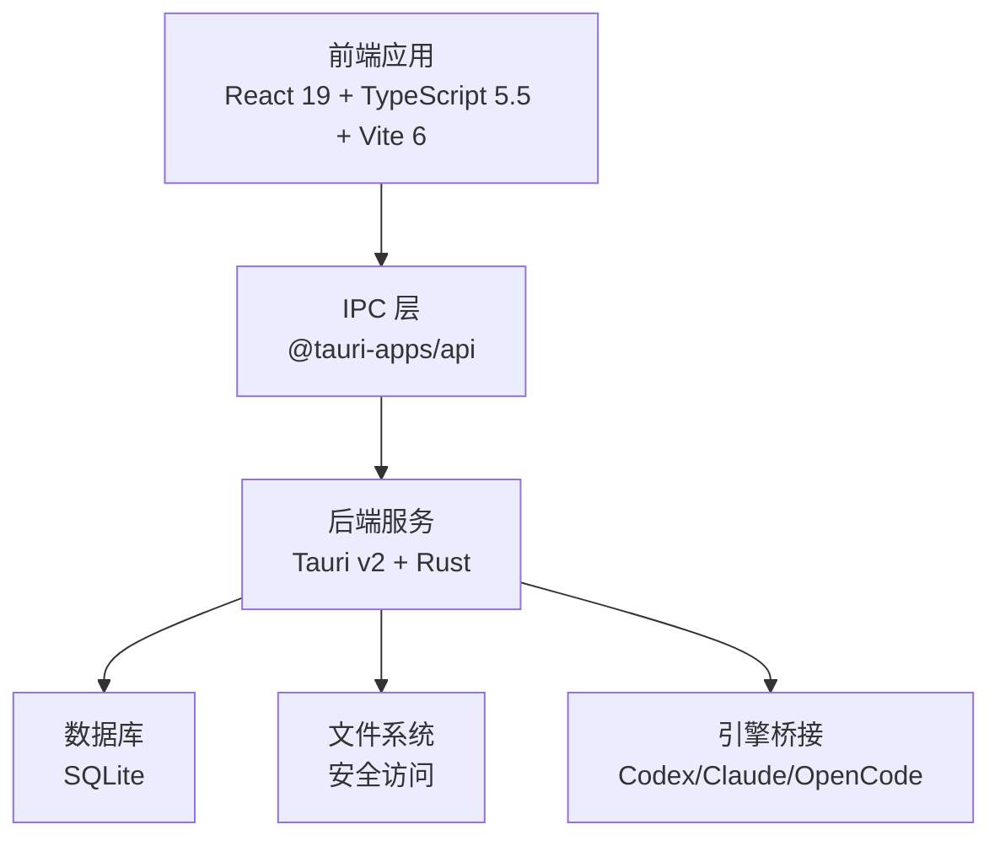
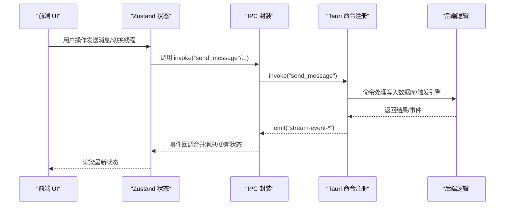
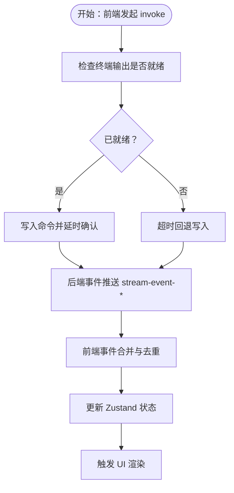
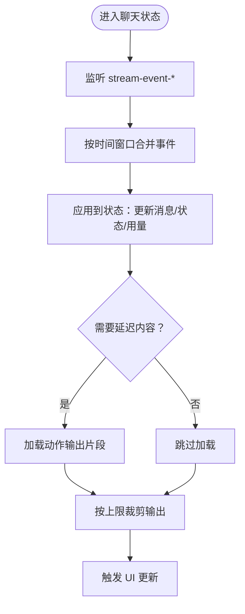
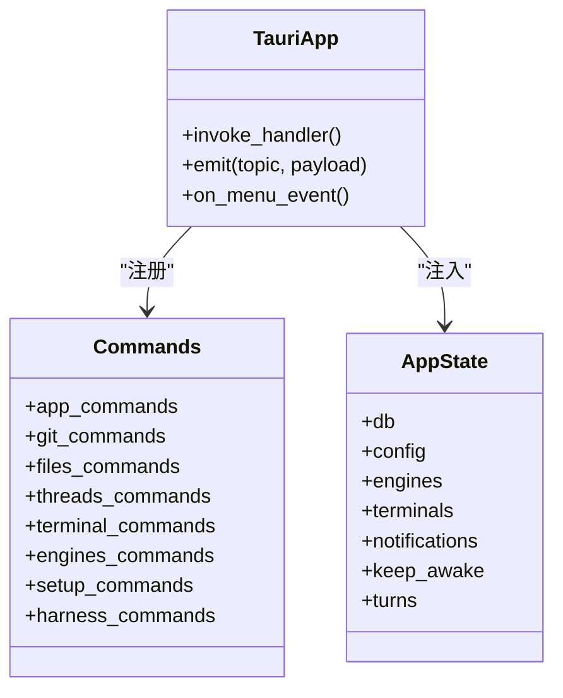
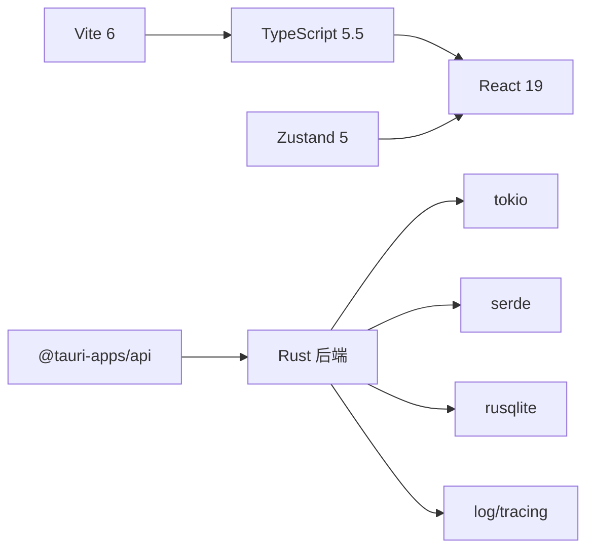

# 代码规范

<cite>
**本文引用的文件**
- [package.json](file://package.json)
- [tsconfig.json](file://tsconfig.json)
- [vite.config.ts](file://vite.config.ts)
- [src/main.tsx](file://src/main.tsx)
- [src/lib/ipc.ts](file://src/lib/ipc.ts)
- [src/stores/chatStore.ts](file://src/stores/chatStore.ts)
- [src/types.ts](file://src/types.ts)
- [src/components/shared/AppErrorBoundary.tsx](file://src/components/shared/AppErrorBoundary.tsx)
- [src-tauri/src/main.rs](file://src-tauri/src/main.rs)
- [src-tauri/src/lib.rs](file://src-tauri/src/lib.rs)
- [Cargo.toml](file://Cargo.toml)
- [README.md](file://README.md)
- [CONTRIBUTING.md](file://CONTRIBUTING.md)
</cite>

## 目录
1. [简介](#简介)
2. [项目结构](#项目结构)
3. [核心组件](#核心组件)
4. [架构总览](#架构总览)
5. [详细组件分析](#详细组件分析)
6. [依赖关系分析](#依赖关系分析)
7. [性能考量](#性能考量)
8. [故障排查指南](#故障排查指南)
9. [结论](#结论)
10. [附录](#附录)

## 简介
本文件为 Panes 的代码规范与最佳实践指南，覆盖前端 TypeScript/React 与后端 Rust/Tauri 的编码风格、命名约定、文件组织、组件设计模式、状态管理、IPC 通信、代码格式化与静态分析、代码审查与分支策略等。目标是统一团队开发体验，提升可维护性与稳定性。

## 项目结构
- 前端位于 src 目录，采用 React 19 + TypeScript 5.5 + Vite 6 架构，使用 Zustand 进行状态管理，通过 @tauri-apps/api 与原生层交互。
- 后端位于 src-tauri，基于 Tauri v2，Rust 语言实现命令注册、事件分发与系统能力封装。
- 根目录提供脚本与构建配置，涵盖类型检查、测试、打包与发布流程。

图表来源
- [src/main.tsx:1-32](file://src/main.tsx#L1-L32)
- [src/lib/ipc.ts:1-792](file://src/lib/ipc.ts#L1-L792)
- [src-tauri/src/main.rs:1-14](file://src-tauri/src/main.rs#L1-L14)
- [src-tauri/src/lib.rs:1-991](file://src-tauri/src/lib.rs#L1-L991)

章节来源
- [README.md:236-256](file://README.md#L236-L256)
- [package.json:1-89](file://package.json#L1-L89)
- [tsconfig.json:1-19](file://tsconfig.json#L1-L19)
- [vite.config.ts:1-24](file://vite.config.ts#L1-L24)

## 核心组件
- 类型系统：集中于 src/types.ts，定义工作区、线程、消息、Git、终端通知、引擎能力等核心数据模型，确保前后端契约一致。
- IPC 封装：src/lib/ipc.ts 提供 invoke 调用与事件监听抽象，统一前端对后端命令的调用与事件订阅。
- 状态管理：src/stores/chatStore.ts 使用 Zustand 管理聊天线程状态、流式事件合并、消息窗口加载与权限审批处理。
- 错误边界：src/components/shared/AppErrorBoundary.tsx 捕获前端运行时错误，保障应用稳定性。
- 后端入口：src-tauri/src/main.rs 初始化 CLI 子命令与主程序；src-tauri/src/lib.rs 注册命令、事件与菜单，构建 Tauri 应用。

章节来源
- [src/types.ts:1-800](file://src/types.ts#L1-L800)
- [src/lib/ipc.ts:1-792](file://src/lib/ipc.ts#L1-L792)
- [src/stores/chatStore.ts:1-800](file://src/stores/chatStore.ts#L1-L800)
- [src/components/shared/AppErrorBoundary.tsx:1-51](file://src/components/shared/AppErrorBoundary.tsx#L1-L51)
- [src-tauri/src/main.rs:1-14](file://src-tauri/src/main.rs#L1-L14)
- [src-tauri/src/lib.rs:1-991](file://src-tauri/src/lib.rs#L1-L991)

## 架构总览
前端通过 @tauri-apps/api 的 invoke 与 listen 与后端建立 IPC 通道；后端在 Tauri Builder 中注册命令处理器，并通过事件广播向前端推送线程更新、运行时诊断、终端输出等。

图表来源
- [src/lib/ipc.ts:357-376](file://src/lib/ipc.ts#L357-L376)
- [src/stores/chatStore.ts:38-59](file://src/stores/chatStore.ts#L38-L59)
- [src-tauri/src/lib.rs:181-322](file://src-tauri/src/lib.rs#L181-L322)

章节来源
- [src/lib/ipc.ts:72-627](file://src/lib/ipc.ts#L72-L627)
- [src/stores/chatStore.ts:118-155](file://src/stores/chatStore.ts#L118-L155)
- [src-tauri/src/lib.rs:340-511](file://src-tauri/src/lib.rs#L340-L511)

## 详细组件分析

### 组件 A：IPC 与事件系统
- 设计要点
  - 统一的 invoke 包装函数，按功能域拆分（应用、工作区、聊天、Git、文件、终端、引擎、设置等）。
  - 事件监听器 listen* 以命名空间区分（如 stream-event-、thread-updated、engine-runtime-updated），避免冲突。
  - 对终端会话写入进行“输出就绪”等待与超时回退，保证命令写入时机正确。
- 数据流
  - 前端调用 invoke 发起请求，后端命令处理完成后返回结果或通过 emit 推送事件。
  - 流式事件在前端进行批量合并与去重，降低渲染压力。
- 错误处理
  - invoke 调用失败时保持前端可控，避免阻断用户操作。
  - 事件监听器返回 UnlistenFn，便于组件卸载时清理。

图表来源
- [src/lib/ipc.ts:749-791](file://src/lib/ipc.ts#L749-L791)
- [src/lib/ipc.ts:629-634](file://src/lib/ipc.ts#L629-L634)
- [src/stores/chatStore.ts:231-291](file://src/stores/chatStore.ts#L231-L291)

章节来源
- [src/lib/ipc.ts:72-792](file://src/lib/ipc.ts#L72-L792)

### 组件 B：聊天状态管理（Zustand）
- 设计要点
  - ChatState 定义线程激活、消息窗口、加载状态、流式状态与错误处理。
  - 事件批处理：STREAM_EVENT_BATCH_WINDOW_MS 控制事件合并窗口，减少频繁重渲染。
  - 审批决策解析：根据响应结构推导最终决策类型，兼容多种审批协议。
  - 动作输出节流：限制最大块数与字符数，必要时截断，避免内存膨胀。
- 复杂度与性能
  - 事件合并算法时间复杂度近似 O(n)，其中 n 为事件数量；通过阈值控制避免过长队列。
  - 消息窗口懒加载与分页游标，支持长对话的低开销浏览。

图表来源
- [src/stores/chatStore.ts:64-100](file://src/stores/chatStore.ts#L64-L100)
- [src/stores/chatStore.ts:231-291](file://src/stores/chatStore.ts#L231-L291)
- [src/stores/chatStore.ts:406-457](file://src/stores/chatStore.ts#L406-L457)

章节来源
- [src/stores/chatStore.ts:24-62](file://src/stores/chatStore.ts#L24-L62)
- [src/stores/chatStore.ts:118-155](file://src/stores/chatStore.ts#L118-L155)

### 组件 C：错误边界与用户体验
- 设计要点
  - AppErrorBoundary 捕获子树错误并在开发环境下打印堆栈，生产环境展示友好提示。
  - 结合 i18n 文案，确保多语言一致性。
- 最佳实践
  - 在根组件外层包裹错误边界，避免全局崩溃。
  - 对关键路径（网络请求、文件读写）增加降级与重试策略。

章节来源
- [src/components/shared/AppErrorBoundary.tsx:1-51](file://src/components/shared/AppErrorBoundary.tsx#L1-L51)
- [src/main.tsx:11-29](file://src/main.tsx#L11-L29)

### 组件 D：后端命令注册与事件分发
- 设计要点
  - Tauri Builder 中集中注册所有命令，按模块划分（app/git/files/threads/terminal/setup 等）。
  - 通过 emit 向前端推送线程更新、运行时诊断、菜单事件等。
  - 引擎桥接（Codex）异步事件转换为前端可消费的标准化事件。
- 可扩展性
  - 新增命令遵循现有命名与参数结构，保持前后端契约稳定。

图表来源
- [src-tauri/src/lib.rs:181-322](file://src-tauri/src/lib.rs#L181-L322)
- [src-tauri/src/lib.rs:85-96](file://src-tauri/src/lib.rs#L85-L96)

章节来源
- [src-tauri/src/lib.rs:98-322](file://src-tauri/src/lib.rs#L98-L322)
- [src-tauri/src/main.rs:1-14](file://src-tauri/src/main.rs#L1-L14)

## 依赖关系分析
- 前端依赖
  - React 19、TypeScript 5.5、Vite 6、Tailwind CSS 4、Zustand 5、@tauri-apps/* 插件生态。
  - 严格类型检查与无 emit 编译，配合 Vitest 单元测试。
- 后端依赖
  - Rust 工作区包含 src-tauri 与 vendor/claude-code-rust，统一版本与特性开关。
  - 关键库：tokio、serde、rusqlite、reqwest、log/tracing 等。

图表来源
- [package.json:27-86](file://package.json#L27-L86)
- [Cargo.toml:8-24](file://Cargo.toml#L8-L24)

章节来源
- [package.json:1-89](file://package.json#L1-L89)
- [Cargo.toml:1-24](file://Cargo.toml#L1-L24)

## 性能考量
- 前端
  - 事件批处理与去重：减少不必要的渲染与状态更新。
  - 懒加载与分页：长列表与消息窗口按需加载，降低内存占用。
  - 终端输出节流：限制动作输出块数与字符数，避免 UI 卡顿。
- 后端
  - 广播事件滞后处理：记录跳过的事件数量，避免事件风暴。
  - 数据库事务：审批解析与线程状态更新在单事务中完成，保证一致性。

章节来源
- [src/stores/chatStore.ts:64-100](file://src/stores/chatStore.ts#L64-L100)
- [src/stores/chatStore.ts:406-457](file://src/stores/chatStore.ts#L406-L457)
- [src-tauri/src/lib.rs:355-358](file://src-tauri/src/lib.rs#L355-L358)

## 故障排查指南
- 开发启动
  - 前端：pnpm dev 或 pnpm tauri:dev；若 IPC 不可用，前端会回退到本地语言初始化。
  - 后端：cargo check/cfg 与 rustfmt 校验。
- 常见问题
  - 终端命令未执行：检查 writeCommandToNewSession 的输出就绪等待与超时逻辑。
  - 线程状态不同步：确认 stream-event-* 是否正确合并，以及后端 emit 是否触发。
  - 审批未生效：核对审批响应解析与数据库事务提交。
- 日志与诊断
  - 后端使用 tracing/log 输出运行时诊断；前端错误边界捕获并打印堆栈。

章节来源
- [src/main.tsx:11-29](file://src/main.tsx#L11-L29)
- [src/lib/ipc.ts:749-791](file://src/lib/ipc.ts#L749-L791)
- [src-tauri/src/lib.rs:355-358](file://src-tauri/src/lib.rs#L355-L358)
- [CONTRIBUTING.md:30-41](file://CONTRIBUTING.md#L30-L41)

## 结论
本规范以类型安全、事件驱动与状态管理为核心，结合严格的前后端契约与统一的 IPC 通道，确保 Panes 在多引擎、多面板场景下的稳定性与可扩展性。建议在新增功能时优先复用现有模式，避免引入额外耦合。

## 附录

### TypeScript/React 编码规范
- 类型系统
  - 所有公共接口与事件负载均在 src/types.ts 中定义，前后端共享。
  - 使用联合类型与字面量类型约束枚举值，避免魔法字符串。
- 组件设计
  - 函数式组件优先，配合 Hooks 管理局部状态；复杂状态迁移至 Zustand。
  - 事件合并与节流策略在状态层实现，避免在渲染层重复计算。
- IPC 调用
  - invoke 包装函数按功能域拆分，参数与返回值显式声明。
  - 事件监听器统一命名空间，返回 UnlistenFn 以便清理。
- 错误处理
  - invoke 失败时提供默认值或降级路径；错误边界捕获并上报。

章节来源
- [src/types.ts:1-800](file://src/types.ts#L1-L800)
- [src/lib/ipc.ts:72-627](file://src/lib/ipc.ts#L72-L627)
- [src/stores/chatStore.ts:118-155](file://src/stores/chatStore.ts#L118-L155)
- [src/components/shared/AppErrorBoundary.tsx:1-51](file://src/components/shared/AppErrorBoundary.tsx#L1-L51)

### Rust/Tauri 编码标准
- 命名与模块
  - 命令注册集中在 lib.rs 的 generate_handler 列表，按领域模块划分。
  - 事件主题命名统一，如 thread-updated、engine-runtime-updated。
- 事件与状态
  - 引擎桥接事件转换为前端可消费的 DTO，避免跨语言类型差异。
  - 事务内完成审批解析与线程状态更新，保证一致性。
- 平台适配
  - 条件编译与平台特定逻辑（如 Linux AppImage 集成）清晰分离。

章节来源
- [src-tauri/src/lib.rs:181-322](file://src-tauri/src/lib.rs#L181-L322)
- [src-tauri/src/lib.rs:340-511](file://src-tauri/src/lib.rs#L340-L511)
- [src-tauri/src/main.rs:1-14](file://src-tauri/src/main.rs#L1-L14)

### 文件组织结构
- src/components：按功能域拆分（chat/editor/git/layout/onboarding/shared/sidebar/terminal/workspace）。
- src/lib：通用工具与 IPC 封装。
- src/stores：状态管理（chatStore、threadStore 等）。
- src-tauri/src/commands：后端命令实现。
- src-tauri/src/db：数据库操作与迁移。
- src-tauri/src/engines：引擎桥接与事件映射。

章节来源
- [README.md:236-256](file://README.md#L236-L256)

### 状态管理规范
- 使用 Zustand 管理聊天线程与全局 UI 状态，避免过度嵌套与深层订阅。
- 事件驱动的状态更新：先合并事件，再应用到状态，最后触发渲染。
- 审批与动作输出的延迟加载与截断策略，防止内存与渲染压力。

章节来源
- [src/stores/chatStore.ts:24-62](file://src/stores/chatStore.ts#L24-L62)
- [src/stores/chatStore.ts:406-457](file://src/stores/chatStore.ts#L406-L457)

### IPC 通信约定
- 命名规范
  - invoke 命令：动词短语，如 send_message、list_threads、terminal_write。
  - 事件主题：前缀 + 具体对象，如 stream-event-<threadId>、thread-updated。
- 参数与返回
  - 所有参数与返回值在 src/types.ts 中声明，确保前后端一致。
  - 可选参数使用 null 显式传递，避免歧义。
- 事件合并
  - 前端对连续事件进行合并（文本增量、进度更新、用量更新），减少渲染次数。

章节来源
- [src/lib/ipc.ts:72-627](file://src/lib/ipc.ts#L72-L627)
- [src/stores/chatStore.ts:231-291](file://src/stores/chatStore.ts#L231-L291)

### 代码格式化与静态分析
- 前端
  - TypeScript 严格模式与 noEmit 编译，配合 Vitest 测试。
  - Vite 开发服务器与 HMR 配置，最小化构建产物。
- 后端
  - cargo fmt -- --check 与 cargo check 校验。
  - tracing/log 记录运行时诊断，便于定位问题。

章节来源
- [tsconfig.json:1-19](file://tsconfig.json#L1-L19)
- [vite.config.ts:1-24](file://vite.config.ts#L1-L24)
- [CONTRIBUTING.md:30-41](file://CONTRIBUTING.md#L30-L41)

### 代码审查与分支策略
- 分支与 PR
  - 从个人 fork 创建分支，针对 master 提交 PR。
  - 每个 PR 聚焦单一问题，避免大而杂的变更。
- 行为准则
  - 更新文档与 i18n 资源，保持一致性。
  - 遵循现有 IPC/store 模式，避免引入新范式。
- 审查关注点
  - UI 变更需附截图；新增字符串需同步更新多语言资源。
  - 避免绕过现有共享基础设施。

章节来源
- [CONTRIBUTING.md:42-77](file://CONTRIBUTING.md#L42-L77)