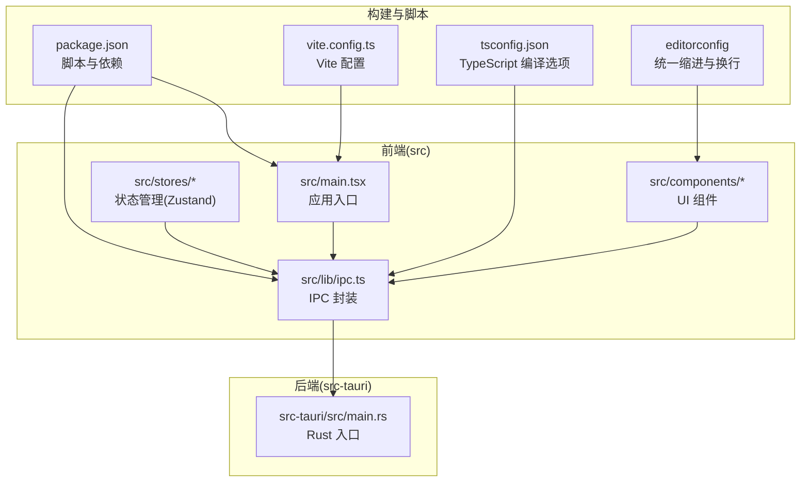
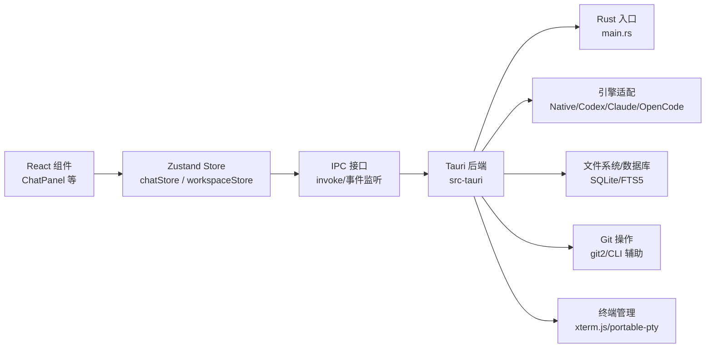
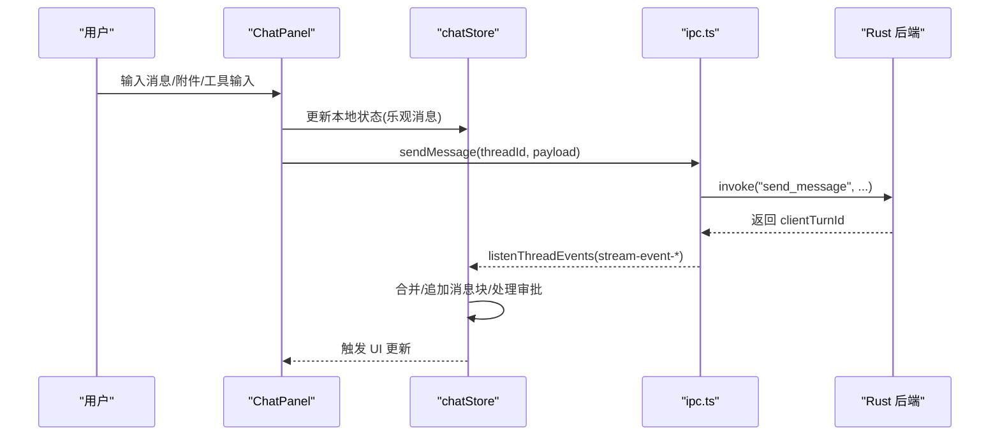
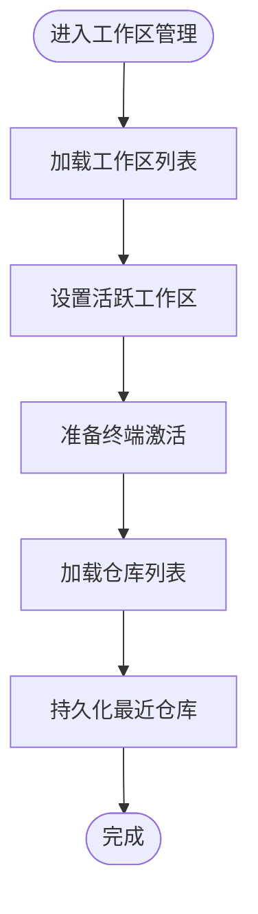
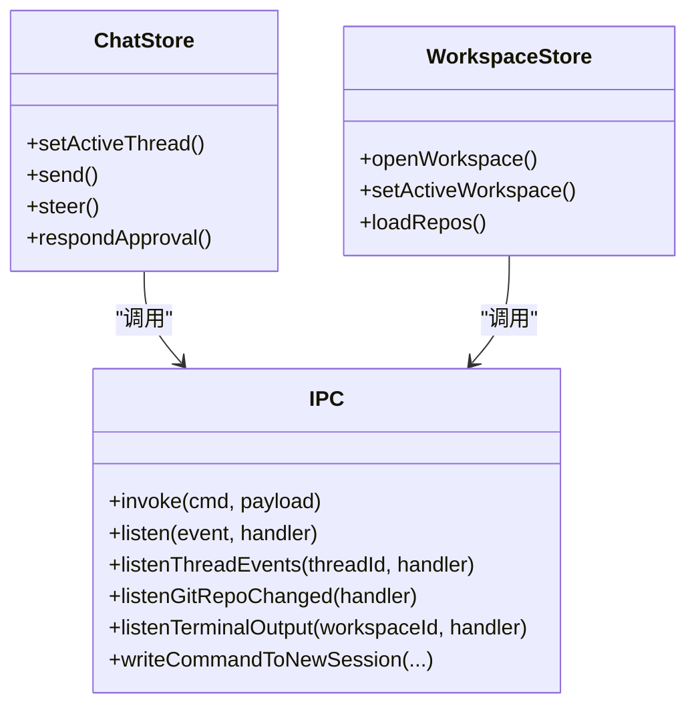
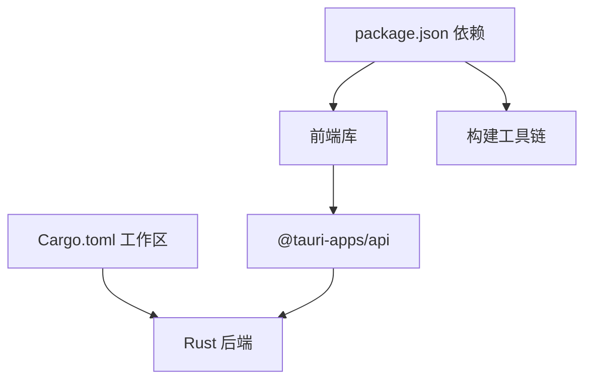

# 开发指南

<cite>
**本文引用的文件**
- [README.md](file://README.md)
- [CONTRIBUTING.md](file://CONTRIBUTING.md)
- [package.json](file://package.json)
- [Cargo.toml](file://Cargo.toml)
- [vite.config.ts](file://vite.config.ts)
- [tsconfig.json](file://tsconfig.json)
- [.editorconfig](file://.editorconfig)
- [src/main.tsx](file://src/main.tsx)
- [src/lib/ipc.ts](file://src/lib/ipc.ts)
- [src/stores/chatStore.ts](file://src/stores/chatStore.ts)
- [src/stores/workspaceStore.ts](file://src/stores/workspaceStore.ts)
- [src/components/chat/ChatPanel.tsx](file://src/components/chat/ChatPanel.tsx)
- [src-tauri/src/main.rs](file://src-tauri/src/main.rs)
</cite>

## 目录
1. [简介](#简介)
2. [项目结构](#项目结构)
3. [核心组件](#核心组件)
4. [架构总览](#架构总览)
5. [详细组件分析](#详细组件分析)
6. [依赖关系分析](#依赖关系分析)
7. [性能考量](#性能考量)
8. [故障排查指南](#故障排查指南)
9. [结论](#结论)
10. [附录](#附录)

## 简介
本指南面向 Panes 的贡献者与维护者，系统阐述开发规范、环境搭建、调试技巧、测试策略、项目结构、编码与提交规范、审查流程、开发工具与 IDE 配置、性能分析方法、新功能开发流程、API 设计原则、架构决策记录、测试策略与覆盖率要求、持续集成配置，以及常见问题的解决方案与最佳实践。

## 项目结构
Panes 是一个基于 React + Zustand 前端与 Tauri 后端的本地优先桌面应用，前端通过 IPC 调用后端能力，实现聊天、Git、终端、编辑器等多模块协作。仓库采用多包/多成员组织方式，根目录为 Rust 工作区，子目录 src-tauri 为 Tauri 后端，src 为前端源码。

**图表来源**
- [src/main.tsx:1-32](file://src/main.tsx#L1-L32)
- [src/lib/ipc.ts:1-792](file://src/lib/ipc.ts#L1-L792)
- [src-tauri/src/main.rs:1-14](file://src-tauri/src/main.rs#L1-L14)
- [package.json:1-89](file://package.json#L1-L89)
- [vite.config.ts:1-24](file://vite.config.ts#L1-L24)
- [tsconfig.json:1-19](file://tsconfig.json#L1-L19)
- [.editorconfig:1-16](file://.editorconfig#L1-L16)

**章节来源**
- [README.md:180-266](file://README.md#L180-L266)
- [package.json:1-89](file://package.json#L1-L89)
- [Cargo.toml:1-24](file://Cargo.toml#L1-L24)
- [vite.config.ts:1-24](file://vite.config.ts#L1-L24)
- [tsconfig.json:1-19](file://tsconfig.json#L1-L19)
- [.editorconfig:1-16](file://.editorconfig#L1-L16)

## 核心组件
- 应用入口与国际化初始化：在前端入口中加载浏览器语言，尝试从后端获取应用语言，随后初始化 i18n 并渲染根组件。
- IPC 层：封装所有与后端交互的 invoke 与事件监听，统一类型定义，便于前端各模块调用。
- 状态管理：使用 Zustand 构建轻量级状态容器，如聊天状态、工作区状态、线程状态等，避免全局共享导致的复杂耦合。
- 组件层：按功能域拆分（chat、editor、git、layout、shared、sidebar、terminal、workspace），职责清晰，便于测试与演进。

**章节来源**
- [src/main.tsx:11-32](file://src/main.tsx#L11-L32)
- [src/lib/ipc.ts:72-627](file://src/lib/ipc.ts#L72-L627)
- [src/stores/chatStore.ts:1-120](file://src/stores/chatStore.ts#L1-L120)
- [src/stores/workspaceStore.ts:1-60](file://src/stores/workspaceStore.ts#L1-L60)

## 架构总览
前端以 React + Zustand 运行于 Tauri 容器内，后端由 Rust 提供持久化、引擎编排、Git 操作、终端管理与文件系统安全访问。IPC 作为前后端通信桥梁，承载消息、事件与命令调用。

**图表来源**
- [src/components/chat/ChatPanel.tsx:1-120](file://src/components/chat/ChatPanel.tsx#L1-L120)
- [src/lib/ipc.ts:72-627](file://src/lib/ipc.ts#L72-L627)
- [src-tauri/src/main.rs:1-14](file://src-tauri/src/main.rs#L1-L14)

## 详细组件分析

### 组件 A：聊天面板与状态流
- 职责：负责用户输入、附件处理、模型选择、权限与审批流程、计划模式、消息虚拟化与性能度量。
- 关键点：
  - 使用虚拟化阈值与估算高度控制消息列表渲染性能。
  - 通过 IPC 订阅线程事件，动态更新消息与状态。
  - 支持多种引擎的附件扩展名过滤与提示。
  - 对 Claude/Opencode 的工具输入审批进行解析与响应。
  - 性能指标埋点：首次 Shell 渲染、首条内容、首条文本延迟。

**图表来源**
- [src/components/chat/ChatPanel.tsx:1-200](file://src/components/chat/ChatPanel.tsx#L1-L200)
- [src/stores/chatStore.ts:35-120](file://src/stores/chatStore.ts#L35-L120)
- [src/lib/ipc.ts:357-420](file://src/lib/ipc.ts#L357-L420)

**章节来源**
- [src/components/chat/ChatPanel.tsx:1-800](file://src/components/chat/ChatPanel.tsx#L1-L800)
- [src/stores/chatStore.ts:1-800](file://src/stores/chatStore.ts#L1-L800)
- [src/lib/ipc.ts:357-420](file://src/lib/ipc.ts#L357-L420)

### 组件 B：工作区与仓库状态
- 职责：管理多个工作区与仓库，维护活跃工作区与仓库，持久化最近仓库选择，批量设置信任级别与 Git 活跃状态。
- 关键点：
  - 打开/归档/恢复工作区时同步准备终端会话与 Git 草稿。
  - 读写本地存储以恢复上次活跃工作区与仓库。
  - 批量操作仓库信任级别，减少多次 IPC 调用。

**图表来源**
- [src/stores/workspaceStore.ts:134-200](file://src/stores/workspaceStore.ts#L134-L200)

**章节来源**
- [src/stores/workspaceStore.ts:1-429](file://src/stores/workspaceStore.ts#L1-L429)

### 组件 C：IPC 与事件监听
- 职责：集中封装 invoke 调用与事件监听，提供统一的类型安全接口；暴露线程事件、Git 变更、终端输出、安装进度等订阅。
- 关键点：
  - 严格区分请求参数与返回类型，避免运行期错误。
  - 事件命名空间隔离，按 threadId/workspaceId 命名通道，避免冲突。
  - 提供便捷函数如 writeCommandToNewSession，自动等待 shell 就绪再写入。

**图表来源**
- [src/lib/ipc.ts:72-792](file://src/lib/ipc.ts#L72-L792)
- [src/stores/chatStore.ts:35-120](file://src/stores/chatStore.ts#L35-L120)
- [src/stores/workspaceStore.ts:134-200](file://src/stores/workspaceStore.ts#L134-L200)

**章节来源**
- [src/lib/ipc.ts:72-792](file://src/lib/ipc.ts#L72-L792)

## 依赖关系分析
- 前端依赖：React、Zustand、@tauri-apps/* 插件、xterm.js、CodeMirror、TailwindCSS 等。
- 后端依赖：Tokio、Serde、Reqwest、SQLite、git2、portable-pty 等。
- 构建与脚本：Vite、TypeScript、React 插件、Vitest、release-it 等。
- 工作区：Cargo 工作区包含 src-tauri 与 vendor/claude-code-rust。

**图表来源**
- [package.json:27-86](file://package.json#L27-L86)
- [Cargo.toml:1-24](file://Cargo.toml#L1-L24)

**章节来源**
- [package.json:1-89](file://package.json#L1-L89)
- [Cargo.toml:1-24](file://Cargo.toml#L1-L24)

## 性能考量
- 前端性能
  - 虚拟化：消息列表超过阈值启用虚拟化，降低 DOM 数量。
  - 事件批处理：流式事件合并同类项，减少重渲染。
  - 首帧与首字节延迟埋点：记录 chat.turn.first_shell.ms、chat.turn.first_content.ms、chat.turn.first_text.ms，用于性能评估。
  - 终端加速渲染开关：可按需开启硬件加速。
- 后端性能
  - 引擎预热：对引擎传输进行节流预热，避免频繁握手。
  - 文件树扫描：缓存与截断扫描，支持大型仓库。
  - 数据库：SQLite + FTS5，全文检索与审计日志友好。

**章节来源**
- [src/components/chat/ChatPanel.tsx:119-123](file://src/components/chat/ChatPanel.tsx#L119-L123)
- [src/stores/chatStore.ts:65-120](file://src/stores/chatStore.ts#L65-L120)
- [src/lib/ipc.ts:83-98](file://src/lib/ipc.ts#L83-L98)

## 故障排查指南
- 开发启动失败
  - 确认 Node.js 与 pnpm 版本满足前置条件。
  - 使用 tauri:dev 启动，若失败检查 Tauri 主机前置与平台依赖。
- IPC 调用异常
  - 检查命令名称与参数类型是否匹配后端定义。
  - 在前端捕获异常并记录错误信息，必要时降级到本地状态。
- 终端无输出或卡顿
  - 切换加速渲染开关，确认 xterm.js 插件版本兼容。
  - 使用终端诊断接口获取渲染状态。
- Git 功能不可用
  - 确认系统已安装 Git，或在无 Git 环境下仍可启动但部分功能受限。
- 国际化文案缺失
  - 新增文案需在多语言资源中同步更新并通过 i18n 资源测试。

**章节来源**
- [README.md:139-199](file://README.md#L139-L199)
- [src/lib/ipc.ts:616-621](file://src/lib/ipc.ts#L616-L621)

## 结论
本指南提供了从环境搭建到日常开发、测试与维护的完整路径。建议在新功能开发前先阅读相关组件与状态流，遵循 IPC 与状态管理约定，确保 i18n 与测试覆盖，并通过 CI 前置检查与审查流程保障质量。

## 附录

### 开发环境设置
- 前端
  - Node.js 20+、pnpm 9+、TypeScript 5.5、Vite 6、React 19、TailwindCSS 4。
  - 启动：pnpm tauri:dev 或 pnpm dev。
- 后端
  - Rust stable、Tauri v2 主机前置。
  - 启动：在 src-tauri 目录执行 cargo 命令或通过前端脚本触发。
- 生成物清理
  - pnpm prune:artifacts 与 pnpm prune:artifacts:stale 可清理本地生成产物。

**章节来源**
- [README.md:139-199](file://README.md#L139-L199)
- [CONTRIBUTING.md:13-40](file://CONTRIBUTING.md#L13-L40)

### 调试技巧
- 前端
  - 使用 React DevTools、Zustand Devtools（可选）定位状态变更。
  - 在 ChatPanel 中利用虚拟化与高度回调定位长列表性能瓶颈。
- 后端
  - 通过 tracing/tracing-subscriber 输出日志，结合 env-filter 控制级别。
  - 使用终端诊断接口与事件监听快速定位会话与通知问题。

**章节来源**
- [src/components/chat/ChatPanel.tsx:226-251](file://src/components/chat/ChatPanel.tsx#L226-L251)
- [src/lib/ipc.ts:673-742](file://src/lib/ipc.ts#L673-L742)

### 测试策略与覆盖率
- 单元测试：Vitest 覆盖核心逻辑与工具函数。
- 端到端：通过脚本与示例数据验证 IPC 与状态流。
- 资源一致性：i18n 资源测试确保多语言文案一致。
- 建议：为每个新增功能模块配套单元测试与边界用例，逐步提升覆盖率。

**章节来源**
- [package.json:17-19](file://package.json#L17-L19)
- [README.md:227-235](file://README.md#L227-L235)

### 提交规范与审查流程
- 提交流程：从个人分支发起 PR 至 master，保持变更聚焦。
- 文档与文案：行为变更需同步更新文档；新增/修改用户可见文案需更新多语言资源并通过测试。
- 审查要点：明确问题与修复方案、截图/录屏、权衡与后续、已运行的本地检查、跳过的验证需显式标注。
- 合并策略：维护者最终审查，遵循分支保护与对话解决规则。

**章节来源**
- [CONTRIBUTING.md:42-77](file://CONTRIBUTING.md#L42-L77)

### API 设计原则
- 类型安全：IPC 参数与返回值均应有明确类型定义，避免运行期错误。
- 命名规范：命令与事件采用语义化命名，按领域划分命名空间。
- 解耦与复用：优先复用现有 IPC/store 模式，避免引入新的专用通道。
- 兼容性：保留历史路径，优先采用活跃运行路径。

**章节来源**
- [src/lib/ipc.ts:72-627](file://src/lib/ipc.ts#L72-L627)
- [CONTRIBUTING.md:47-49](file://CONTRIBUTING.md#L47-L49)

### 架构决策记录（ADR）
- 技术栈：React + Zustand + Tauri，兼顾跨平台与本地能力。
- IPC 设计：统一 invoke 与事件监听，按领域命名通道，避免全局共享。
- 状态管理：Zustand 轻量易用，适合前端状态与后端桥接。
- 国际化：i18next + react-i18next，文案即功能的一部分。
- 终端与编辑器：xterm.js + CodeMirror，满足开发者高频场景。

**章节来源**
- [README.md:236-256](file://README.md#L236-L256)
- [src/lib/ipc.ts:673-742](file://src/lib/ipc.ts#L673-L742)

### 持续集成与发布
- 本地检查：typecheck、test、build、cargo fmt/check/clippy。
- 发布：release-it 配合脚本，结合 should-release 检查决定是否发版。
- 自动化：GitHub Actions 工作流（见 .github/workflows）可按需扩展。

**章节来源**
- [CONTRIBUTING.md:30-40](file://CONTRIBUTING.md#L30-L40)
- [package.json:24-26](file://package.json#L24-L26)