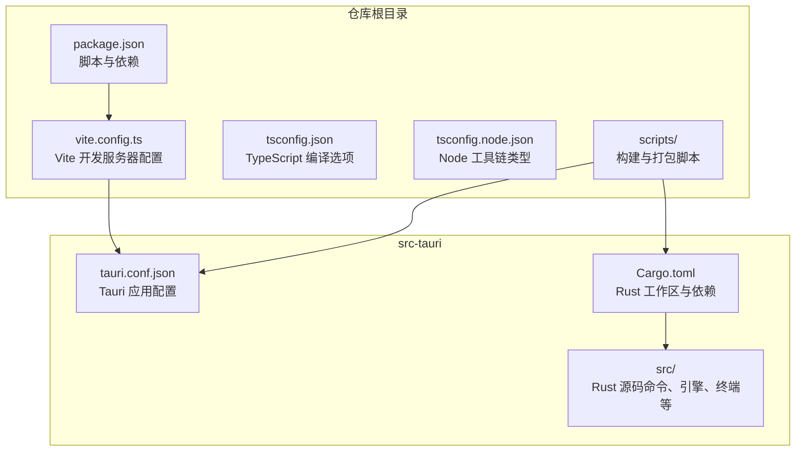
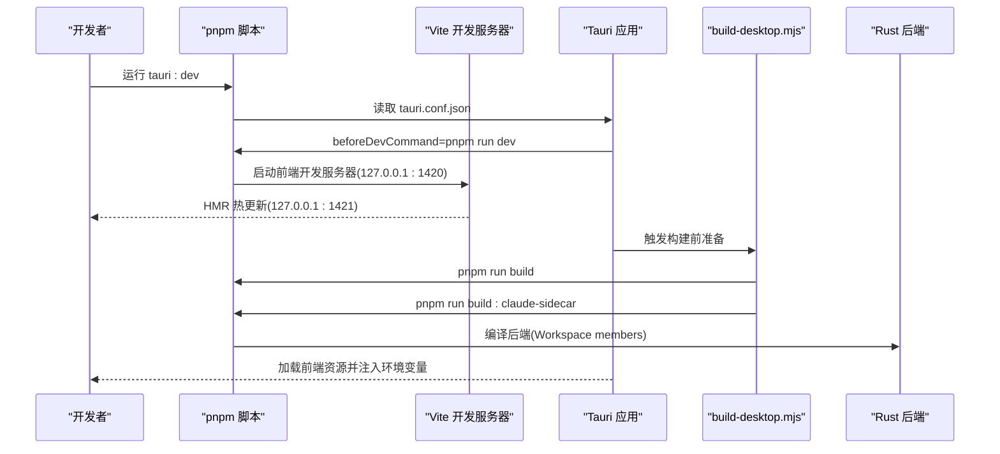
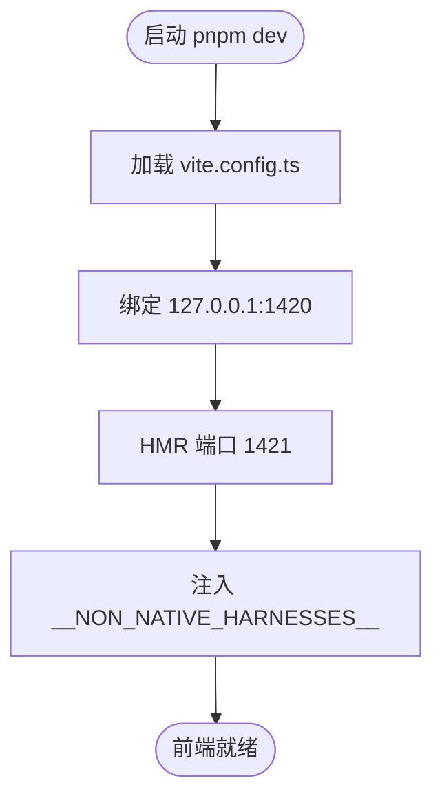
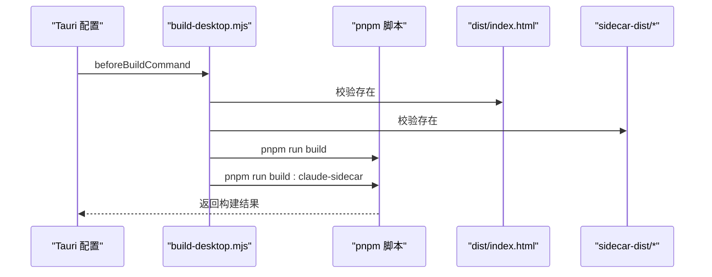
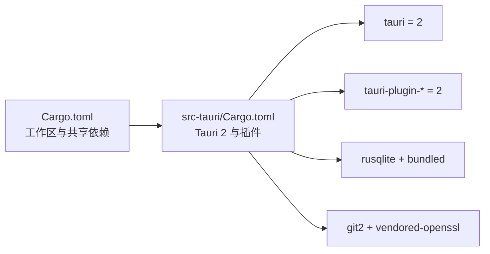
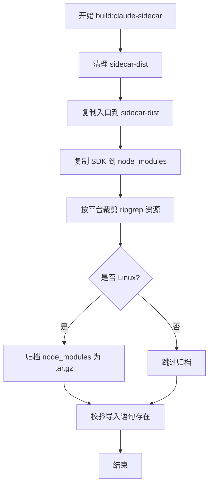
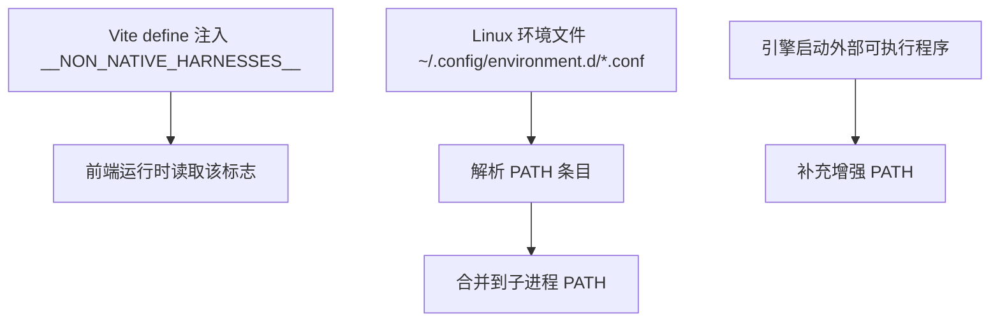
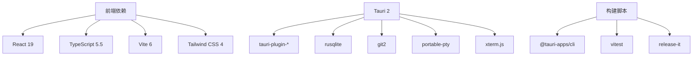

# 开发环境设置

<cite>
**本文引用的文件**
- [package.json](file://package.json)
- [Cargo.toml](file://Cargo.toml)
- [src-tauri/Cargo.toml](file://src-tauri/Cargo.toml)
- [vite.config.ts](file://vite.config.ts)
- [src-tauri/tauri.conf.json](file://src-tauri/tauri.conf.json)
- [CONTRIBUTING.md](file://CONTRIBUTING.md)
- [README.md](file://README.md)
- [scripts/build-desktop.mjs](file://scripts/build-desktop.mjs)
- [scripts/build-claude-sidecar.mjs](file://scripts/build-claude-sidecar.mjs)
- [src/lib/setupGuidance.ts](file://src/lib/setupGuidance.ts)
- [src-tauri/src/runtime_env.rs](file://src-tauri/src/runtime_env.rs)
- [tsconfig.json](file://tsconfig.json)
- [tsconfig.node.json](file://tsconfig.node.json)
</cite>

## 目录
1. [简介](#简介)
2. [项目结构](#项目结构)
3. [核心组件](#核心组件)
4. [架构总览](#架构总览)
5. [详细组件分析](#详细组件分析)
6. [依赖关系分析](#依赖关系分析)
7. [性能考虑](#性能考虑)
8. [故障排除指南](#故障排除指南)
9. [结论](#结论)
10. [附录](#附录)

## 简介
本文件面向首次参与 Panes 开发的工程师，提供从零到可运行的完整开发环境设置指南。内容覆盖前置条件（Rust stable、Node.js 20+、pnpm 9+、Tauri v2 主机依赖）、安装步骤、环境变量与 PATH 配置、IDE 推荐与调试配置、开发服务器启动流程，以及常见问题排查与解决方案。

## 项目结构
Panes 是一个基于 Tauri v2 的桌面应用，前端使用 React 19 + TypeScript + Vite 6，后端使用 Rust（Tauri 2 + Tokio）。项目采用多包工作区组织，根目录包含前端与脚本，src-tauri 子目录为 Tauri 后端工程，scripts 提供构建与打包辅助脚本。

图表来源
- [package.json:1-89](file://package.json#L1-L89)
- [vite.config.ts:1-24](file://vite.config.ts#L1-L24)
- [src-tauri/tauri.conf.json:1-58](file://src-tauri/tauri.conf.json#L1-L58)
- [Cargo.toml:1-24](file://Cargo.toml#L1-L24)
- [src-tauri/Cargo.toml:1-67](file://src-tauri/Cargo.toml#L1-L67)

章节来源
- [README.md:139-147](file://README.md#L139-L147)
- [package.json:6-26](file://package.json#L6-L26)
- [vite.config.ts:4-23](file://vite.config.ts#L4-L23)
- [src-tauri/tauri.conf.json:6-11](file://src-tauri/tauri.conf.json#L6-L11)
- [Cargo.toml:1-6](file://Cargo.toml#L1-L6)
- [src-tauri/Cargo.toml:15-49](file://src-tauri/Cargo.toml#L15-L49)

## 核心组件
- 前端开发服务器：Vite 在本地 127.0.0.1:1420 提供热更新服务，HMR 使用 1421 端口。
- Tauri 应用配置：devUrl 指向前端开发服务器；beforeDevCommand 调用 pnpm dev；构建前执行 scripts/build-desktop.mjs。
- Rust 工作区：根 Cargo.toml 定义工作区成员与共享依赖；src-tauri/Cargo.toml 引入 Tauri 2 及插件依赖。
- 构建脚本：build-desktop.mjs 负责在构建前确保 dist 与 sidecar-dist 存在，并调用 pnpm run build 与 build:claude-sidecar。
- 环境变量：Vite 通过 define 注入 __NON_NATIVE_HARNESSES__；Tauri 通过环境变量控制 Claude SDK 平台目标与裁剪 ripgrep 资源。

章节来源
- [vite.config.ts:14-21](file://vite.config.ts#L14-L21)
- [src-tauri/tauri.conf.json:6-11](file://src-tauri/tauri.conf.json#L6-L11)
- [package.json:6-26](file://package.json#L6-L26)
- [scripts/build-desktop.mjs:19-71](file://scripts/build-desktop.mjs#L19-L71)
- [src-tauri/Cargo.toml:15-26](file://src-tauri/Cargo.toml#L15-L26)
- [Cargo.toml:8-24](file://Cargo.toml#L8-L24)

## 架构总览
下图展示从开发者发起 tauri:dev 到应用启动的关键流程，涵盖前端开发服务器、Tauri 配置、构建脚本与 Rust 后端的关系。

图表来源
- [package.json:21](file://package.json#L21)
- [src-tauri/tauri.conf.json:7-10](file://src-tauri/tauri.conf.json#L7-L10)
- [vite.config.ts:14-21](file://vite.config.ts#L14-L21)
- [scripts/build-desktop.mjs:69-71](file://scripts/build-desktop.mjs#L69-L71)
- [Cargo.toml:2-5](file://Cargo.toml#L2-L5)

## 详细组件分析

### 前端开发服务器与 HMR
- 开发服务器绑定地址与端口，严格端口模式，避免端口冲突。
- HMR 独立端口，便于网络抓包或外部工具接入。
- Vite 插件与 define 注入全局常量，用于切换非原生引擎路径。

图表来源
- [vite.config.ts:4-23](file://vite.config.ts#L4-L23)

章节来源
- [vite.config.ts:4-23](file://vite.config.ts#L4-L23)

### Tauri 开发配置与构建流程
- devUrl 指向前端开发服务器，beforeDevCommand 自动启动 pnpm dev。
- beforeBuildCommand 调用 scripts/build-desktop.mjs，确保 dist 与 sidecar-dist 存在。
- 构建脚本会调用 pnpm run build 与 pnpm run build:claude-sidecar，分别完成前端产物与 Claude 侧车打包。

图表来源
- [src-tauri/tauri.conf.json:7-10](file://src-tauri/tauri.conf.json#L7-L10)
- [scripts/build-desktop.mjs:22-32](file://scripts/build-desktop.mjs#L22-L32)
- [scripts/build-desktop.mjs:69-71](file://scripts/build-desktop.mjs#L69-L71)

章节来源
- [src-tauri/tauri.conf.json:6-11](file://src-tauri/tauri.conf.json#L6-L11)
- [scripts/build-desktop.mjs:19-71](file://scripts/build-desktop.mjs#L19-L71)

### Rust 工作区与 Tauri 2 依赖
- 根工作区定义共享依赖（Tokio、Serde、Reqwest 等），src-tauri 成员负责 Tauri 2 与各插件依赖。
- 后端特性包含 custom-protocol，默认启用；平台特定依赖（如 macOS 的 core-foundation）按需引入。

图表来源
- [Cargo.toml:8-24](file://Cargo.toml#L8-L24)
- [src-tauri/Cargo.toml:15-54](file://src-tauri/Cargo.toml#L15-L54)

章节来源
- [Cargo.toml:1-6](file://Cargo.toml#L1-L6)
- [src-tauri/Cargo.toml:15-67](file://src-tauri/Cargo.toml#L15-L67)

### Claude 侧车构建与平台裁剪
- 构建脚本复制入口文件至 sidecar-dist，并复制 @anthropic-ai/claude-agent-sdk 包到 node_modules。
- 根据 PANES_CLAUDE_SDK_PLATFORM/ARCH 裁剪 ripgrep vendor 资源，Linux 下归档 node_modules 以减小体积。
- 最终校验侧车文件包含预期的 SDK 导入语句。

图表来源
- [scripts/build-claude-sidecar.mjs:119-141](file://scripts/build-claude-sidecar.mjs#L119-L141)

章节来源
- [scripts/build-claude-sidecar.mjs:32-100](file://scripts/build-claude-sidecar.mjs#L32-L100)
- [scripts/build-claude-sidecar.mjs:102-134](file://scripts/build-claude-sidecar.mjs#L102-L134)

### 环境变量与 PATH 配置
- Vite 通过 define 注入 __NON_NATIVE_HARNESSES__，受 VITE_NON_NATIVE_HARNESSES 控制。
- Rust 后端在 Linux 上从 ~/.config/environment.d/*.conf 读取 PATH 条目，支持 $HOME 展开与忽略变量引用，保证子进程 PATH 一致。
- 多个引擎在启动外部可执行程序时会合并增强后的 PATH，确保系统工具可用。

图表来源
- [vite.config.ts:6-10](file://vite.config.ts#L6-L10)
- [src-tauri/src/runtime_env.rs:916-932](file://src-tauri/src/runtime_env.rs#L916-L932)
- [src-tauri/src/runtime_env.rs:934-940](file://src-tauri/src/runtime_env.rs#L934-L940)
- [src-tauri/src/runtime_env.rs:1461-1464](file://src-tauri/src/runtime_env.rs#L1461-L1464)

章节来源
- [vite.config.ts:6-10](file://vite.config.ts#L6-L10)
- [src-tauri/src/runtime_env.rs:916-932](file://src-tauri/src/runtime_env.rs#L916-L932)
- [src-tauri/src/runtime_env.rs:934-940](file://src-tauri/src/runtime_env.rs#L934-L940)
- [src-tauri/src/runtime_env.rs:1461-1464](file://src-tauri/src/runtime_env.rs#L1461-L1464)

### IDE 配置与调试建议
- VS Code 扩展推荐
  - ESLint、Prettier、TypeScript TSServer、Tailwind CSS IntelliSense
  - Rust Analyzer、Taplo（TOML）、Tauri（可选）
- 调试配置
  - 前端：在浏览器中打开 127.0.0.1:1420，利用 HMR 实时调试
  - 后端：使用 VS Code Rust 扩展附加到 Tauri 进程，或在终端运行 cargo 命令进行调试
  - 调试参数：可在 Tauri 配置中添加日志级别与追踪输出，便于定位问题

章节来源
- [README.md:180-207](file://README.md#L180-L207)
- [src-tauri/tauri.conf.json:28-31](file://src-tauri/tauri.conf.json#L28-L31)

## 依赖关系分析
- 前端依赖：React 19、TypeScript 5.5、Vite 6、Tailwind CSS 4、Zustand 5 等
- Tauri 插件：shell、dialog、fs、notification、updater 等
- 数据与工具：SQLite、git2、portable-pty、xterm.js、CodeMirror 6、diff2html、highlight.js
- 构建与脚本：@tauri-apps/cli、esbuild、release-it、vitest

图表来源
- [package.json:27-86](file://package.json#L27-L86)
- [src-tauri/Cargo.toml:19-26](file://src-tauri/Cargo.toml#L19-L26)
- [src-tauri/Cargo.toml:40-54](file://src-tauri/Cargo.toml#L40-L54)

章节来源
- [package.json:27-86](file://package.json#L27-L86)
- [src-tauri/Cargo.toml:19-26](file://src-tauri/Cargo.toml#L19-L26)
- [src-tauri/Cargo.toml:40-54](file://src-tauri/Cargo.toml#L40-L54)

## 性能考虑
- 开发阶段禁用生产级压缩，提升编译与热更速度
- Rust 开发配置保留调试符号等级，便于断点与日志分析
- 前端类型检查与测试作为开发流程的一部分，尽早发现类型与逻辑问题
- Linux 平台裁剪 Claude SDK 的 ripgrep 资源，减少 sidecar 体积与启动时间

章节来源
- [vite.config.ts:11-13](file://vite.config.ts#L11-L13)
- [src-tauri/Cargo.toml:64-67](file://src-tauri/Cargo.toml#L64-L67)
- [scripts/build-claude-sidecar.mjs:80-100](file://scripts/build-claude-sidecar.mjs#L80-L100)

## 故障排除指南
- 端口占用
  - 症状：Vite/HMR 端口被占用导致无法启动
  - 解决：修改 vite.config.ts 中的 server.host/port 或关闭占用进程
- 构建前资产缺失
  - 症状：build-desktop.mjs 报错提示 dist 或 sidecar-dist 缺失
  - 解决：先执行 pnpm run build 生成 dist，再执行 pnpm run build:claude-sidecar 生成 sidecar-dist
- PATH 未包含系统工具
  - 症状：引擎启动外部可执行程序失败（如 codex、git）
  - 解决：在 Linux 系统中于 ~/.config/environment.d/*.conf 写入 PATH 条目；或在启动前将所需路径加入 PATH
- Windows 平台兼容性
  - 症状：Windows 下 pnpm 通过 .cmd shim 启动失败
  - 解决：脚本已自动使用 shell 启动，确保 pnpm.cmd 可用；若仍失败，尝试在 PowerShell 中以管理员权限运行
- 类型与测试检查
  - 症状：typecheck/test 失败
  - 解决：先修复类型错误，再运行测试；必要时清理缓存后重试

章节来源
- [vite.config.ts:14-21](file://vite.config.ts#L14-L21)
- [scripts/build-desktop.mjs:22-32](file://scripts/build-desktop.mjs#L22-L32)
- [src-tauri/src/runtime_env.rs:916-932](file://src-tauri/src/runtime_env.rs#L916-L932)
- [README.md:180-207](file://README.md#L180-L207)

## 结论
按照本文档的前置条件与步骤，结合 IDE 推荐与调试配置，您可以在本地快速搭建可工作的 Panes 开发环境。遇到问题时，优先检查端口占用、构建前资产、PATH 配置与平台差异，配合类型检查与测试流程，可高效定位并解决问题。

## 附录

### 前置条件清单
- Rust 工具链：stable
- Node.js：20+
- 包管理器：pnpm 9+
- Tauri v2 主机依赖：参考官方文档
- 可选：codex CLI（如需本地体验 Codex 引擎）

章节来源
- [CONTRIBUTING.md:15-22](file://CONTRIBUTING.md#L15-L22)
- [README.md:78-87](file://README.md#L78-L87)

### 安装与启动步骤
- 克隆仓库并安装依赖
- 启动开发服务器：pnpm tauri:dev
- 前端独立开发：pnpm dev
- 生产构建：pnpm tauri:build

章节来源
- [README.md:139-147](file://README.md#L139-L147)
- [CONTRIBUTING.md:23-28](file://CONTRIBUTING.md#L23-L28)

### 环境变量与 PATH 设置要点
- VITE_NON_NATIVE_HARNESSES：控制是否启用非原生引擎路径
- Linux 环境文件：~/.config/environment.d/*.conf 支持 PATH 条目与 $HOME 展开
- 子进程 PATH：后端在启动外部程序时会合并增强后的 PATH

章节来源
- [vite.config.ts:6-10](file://vite.config.ts#L6-L10)
- [src-tauri/src/runtime_env.rs:916-932](file://src-tauri/src/runtime_env.rs#L916-L932)
- [src-tauri/src/runtime_env.rs:934-940](file://src-tauri/src/runtime_env.rs#L934-L940)