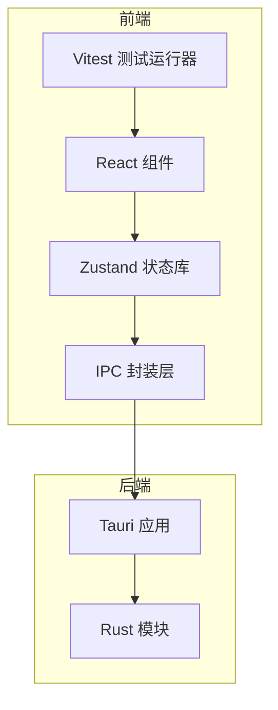
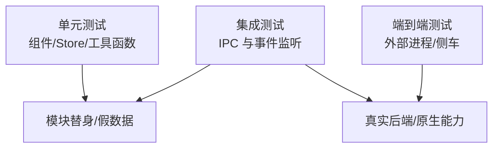
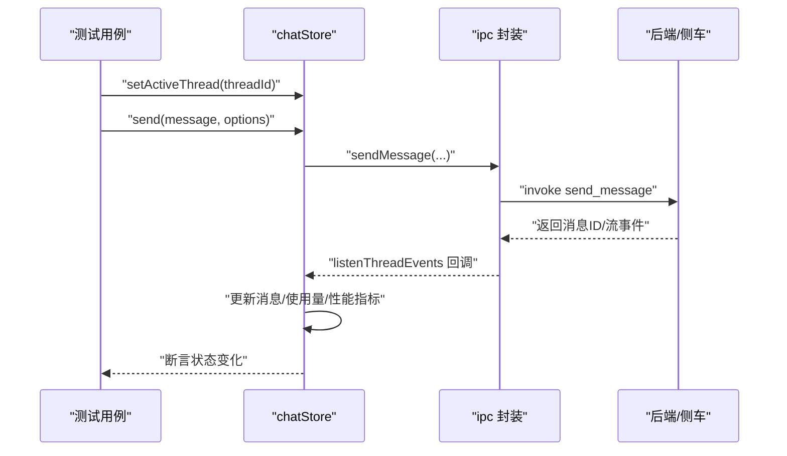
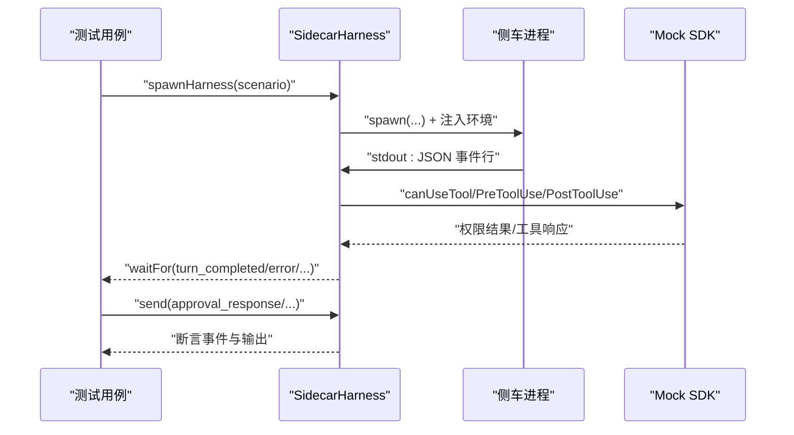
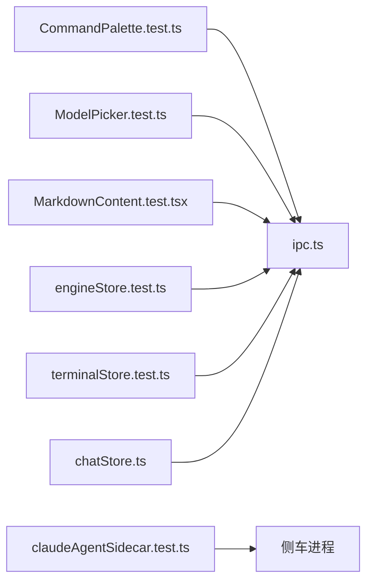

# 测试策略

<cite>
**本文引用的文件**
- [package.json](file://package.json)
- [vite.config.ts](file://vite.config.ts)
- [Cargo.toml](file://Cargo.toml)
- [src/lib/ipc.ts](file://src/lib/ipc.ts)
- [src/stores/chatStore.ts](file://src/stores/chatStore.ts)
- [src/stores/threadStore.ts](file://src/stores/threadStore.ts)
- [src/stores/engineStore.test.ts](file://src/stores/engineStore.test.ts)
- [src/stores/terminalStore.test.ts](file://src/stores/terminalStore.test.ts)
- [src/components/shared/CommandPalette.test.ts](file://src/components/shared/CommandPalette.test.ts)
- [src/components/chat/ModelPicker.test.ts](file://src/components/chat/ModelPicker.test.ts)
- [src/lib/commandPalette.test.ts](file://src/lib/commandPalette.test.ts)
- [tests/MarkdownContent.test.tsx](file://tests/MarkdownContent.test.tsx)
- [tests/claudeAgentSidecar.test.ts](file://tests/claudeAgentSidecar.test.ts)
- [tests/fixtures/claude-agent-sdk-mock.mjs](file://tests/fixtures/claude-agent-sdk-mock.mjs)
- [tests/markdownParserCore.test.ts](file://tests/markdownParserCore.test.ts)
- [tests/homebrewCask.test.ts](file://tests/homebrewCask.test.ts)
- [tests/updateManifest.test.ts](file://tests/updateManifest.test.ts)
</cite>

## 目录
1. [引言](#引言)
2. [项目结构](#项目结构)
3. [核心组件](#核心组件)
4. [架构总览](#架构总览)
5. [详细组件分析](#详细组件分析)
6. [依赖关系分析](#依赖关系分析)
7. [性能考量](#性能考量)
8. [故障排查指南](#故障排查指南)
9. [结论](#结论)
10. [附录](#附录)

## 引言
本文件系统化梳理 Panes 的测试策略与实践，覆盖单元测试、集成测试与端到端测试的组织方式与实施要点；明确测试框架配置、测试用例编写规范与测试数据管理；涵盖前端组件测试、状态管理测试、IPC 通信测试以及后端 Rust 测试；给出测试覆盖率目标、持续集成中的测试执行建议与性能测试策略，并提供调试技巧与常见问题解决方案。

## 项目结构
- 前端使用 Vite + React + Vitest，测试脚本通过 npm 脚本统一入口执行。
- 后端 Rust 使用 Cargo 工作区组织，包含主应用与若干子模块。
- IPC 层封装在前端，提供对 Tauri 原生能力的调用与事件监听。
- 状态管理采用 Zustand，大量测试围绕 Store 行为进行断言。
- 集成测试与端到端测试通过独立测试文件与外部进程（如侧车服务）协作完成。

图表来源
- [package.json:18](file://package.json#L18)
- [vite.config.ts:1-24](file://vite.config.ts#L1-L24)
- [src/lib/ipc.ts:1-792](file://src/lib/ipc.ts#L1-L792)

章节来源
- [package.json:18](file://package.json#L18)
- [vite.config.ts:1-24](file://vite.config.ts#L1-L24)

## 核心组件
- 测试框架与脚本
  - 使用 Vitest 运行前端测试，命令为“test”。
  - 前端构建与开发服务器配置位于 vite.config.ts。
- 状态管理与 Store 测试
  - chatStore：负责聊天消息流式渲染、权限审批、动作输出等。
  - threadStore：负责线程生命周期与模型推理参数本地应用。
  - engineStore：负责引擎列表与健康检查。
  - terminalStore：负责终端分组编号分配。
- 组件测试
  - 命令面板、模型选择器、Markdown 渲染等组件功能测试。
- IPC 与事件监听
  - 统一封装 invoke 与 listen，便于测试时进行模块替身与事件模拟。
- 集成与端到端测试
  - 通过独立测试文件启动外部进程（如 Claude Agent 侧车），并与之交互验证权限策略、工具输出、错误处理等。

章节来源
- [src/stores/chatStore.ts:1-200](file://src/stores/chatStore.ts#L1-L200)
- [src/stores/threadStore.ts:1-200](file://src/stores/threadStore.ts#L1-L200)
- [src/stores/engineStore.test.ts:1-126](file://src/stores/engineStore.test.ts#L1-L126)
- [src/stores/terminalStore.test.ts:1-66](file://src/stores/terminalStore.test.ts#L1-L66)
- [src/lib/ipc.ts:1-792](file://src/lib/ipc.ts#L1-L792)

## 架构总览
下图展示测试体系中各层次的交互关系：单元测试针对组件与 Store；集成测试通过 IPC 与后端交互；端到端测试通过外部进程模拟真实场景。

图表来源
- [src/lib/ipc.ts:1-792](file://src/lib/ipc.ts#L1-L792)
- [tests/claudeAgentSidecar.test.ts:1-800](file://tests/claudeAgentSidecar.test.ts#L1-L800)

## 详细组件分析

### 单元测试：组件与工具函数
- 命令面板行为验证：通过模块替身模拟 UI、工作区、线程、文件、Harness 等 Store，断言命令触发后的状态变更与视图切换。
- 模型选择器逻辑：对 OpenCode 提供商解析、分组、过滤与元数据芯片生成进行断言。
- Markdown 渲染：验证高亮、链接、自动链接、本地文件引用、图片安全、XSS 清理与安全标签保留等。
- 命令面板输入辅助：断言前缀循环、搜索模式、作用域切换与输入规范化。

章节来源
- [src/components/shared/CommandPalette.test.ts:1-144](file://src/components/shared/CommandPalette.test.ts#L1-L144)
- [src/components/chat/ModelPicker.test.ts:1-121](file://src/components/chat/ModelPicker.test.ts#L1-L121)
- [tests/MarkdownContent.test.tsx:1-54](file://tests/MarkdownContent.test.tsx#L1-L54)
- [src/lib/commandPalette.test.ts:1-49](file://src/lib/commandPalette.test.ts#L1-L49)

### 单元测试：状态管理（Zustand）
- 引擎 Store：加载引擎列表、按需加载健康状态、错误重试与运行时更新生效。
- 终端 Store：根据现有终端组名称推导下一个可用编号，支持空序列、缺号填充与混合类型分组。

章节来源
- [src/stores/engineStore.test.ts:1-126](file://src/stores/engineStore.test.ts#L1-L126)
- [src/stores/terminalStore.test.ts:1-66](file://src/stores/terminalStore.test.ts#L1-L66)

### 集成测试：IPC 与事件监听
- 场景要点
  - 使用 vitest.hoisted 替身替换 IPC 模块，模拟 invoke 与事件监听返回值。
  - 在 beforeEach 中清理状态与替身，确保测试隔离。
  - 对流式事件（TurnStarted、TextDelta、UsageLimitsUpdated 等）进行时间推进与断言。
- 典型流程
  - 设置活动线程 -> 发送消息 -> 触发流事件 -> 断言消息块、通知块、使用量限制与性能指标。
- 关键接口
  - sendMessage、listenThreadEvents、respondApproval、getActionOutput、syncThreadFromEngine 等。

图表来源
- [src/stores/chatStore.ts:1-200](file://src/stores/chatStore.ts#L1-L200)
- [src/lib/ipc.ts:1-792](file://src/lib/ipc.ts#L1-L792)

章节来源
- [src/stores/chatStore.ts:1-200](file://src/stores/chatStore.ts#L1-L200)
- [src/lib/ipc.ts:1-792](file://src/lib/ipc.ts#L1-L792)

### 端到端测试：Claude Agent 侧车
- 测试目标
  - 权限策略：只读模式拒绝写入、工作区写入仅允许受批准根路径、默认权限模式、危险沙箱模式拒绝。
  - 事件与错误：认证失败、状态通知、速率限制、令牌用量、工具输出分块与去重。
  - 审批与会话：accept_for_session 更新权限、AskUserQuestion 通过 updatedInput 返回答案。
- 实现方式
  - 通过 Node 子进程启动侧车脚本，注入环境变量控制模拟场景。
  - 使用 readline 接收 JSON 行事件，基于等待器与超时机制驱动断言。
  - 使用 mock SDK 模拟工具调用与权限判定。

图表来源
- [tests/claudeAgentSidecar.test.ts:1-800](file://tests/claudeAgentSidecar.test.ts#L1-L800)
- [tests/fixtures/claude-agent-sdk-mock.mjs:1-107](file://tests/fixtures/claude-agent-sdk-mock.mjs#L1-L107)

章节来源
- [tests/claudeAgentSidecar.test.ts:1-800](file://tests/claudeAgentSidecar.test.ts#L1-L800)
- [tests/fixtures/claude-agent-sdk-mock.mjs:1-107](file://tests/fixtures/claude-agent-sdk-mock.mjs#L1-L107)

### 后端 Rust 测试（工作区）
- Cargo.toml 定义工作区成员，包含 src-tauri 与 vendor 子模块。
- 建议
  - 在各自 crate 内部编写单元测试与集成测试，遵循 Rust 测试约定。
  - 对跨语言交互（IPC）编写端到端测试或集成测试，复用前端测试策略。

章节来源
- [Cargo.toml:1-24](file://Cargo.toml#L1-L24)

## 依赖关系分析
- 测试耦合度
  - 组件与工具函数测试低耦合，主要依赖替身与纯函数。
  - Store 测试依赖 IPC 替身，避免真实后端调用。
  - 集成与端到端测试依赖真实后端或外部进程，耦合度较高但覆盖更广。
- 外部依赖
  - Tauri 插件与原生能力通过 IPC 封装暴露给前端测试。
  - Node 子进程用于启动侧车，形成跨语言测试链路。

图表来源
- [src/components/shared/CommandPalette.test.ts:1-144](file://src/components/shared/CommandPalette.test.ts#L1-L144)
- [src/components/chat/ModelPicker.test.ts:1-121](file://src/components/chat/ModelPicker.test.ts#L1-L121)
- [tests/MarkdownContent.test.tsx:1-54](file://tests/MarkdownContent.test.tsx#L1-L54)
- [src/stores/engineStore.test.ts:1-126](file://src/stores/engineStore.test.ts#L1-L126)
- [src/stores/terminalStore.test.ts:1-66](file://src/stores/terminalStore.test.ts#L1-L66)
- [src/stores/chatStore.ts:1-200](file://src/stores/chatStore.ts#L1-L200)
- [tests/claudeAgentSidecar.test.ts:1-800](file://tests/claudeAgentSidecar.test.ts#L1-L800)

## 性能考量
- 性能指标记录
  - chatStore 在首次 Shell、内容与文本到达时记录性能指标，测试中可断言指标键名与上下文标签。
- 时间推进
  - 使用 fake timers 推进事件队列与批处理窗口，确保批量事件合并与延迟刷新逻辑被覆盖。
- 建议
  - 对关键路径（消息发送、工具输出、权限审批）增加性能回归测试，监控首包延迟与事件吞吐。
  - 在 CI 中引入性能基线与阈值告警。

章节来源
- [src/stores/chatStore.ts:157-198](file://src/stores/chatStore.ts#L157-L198)

## 故障排查指南
- 常见问题
  - 事件未到达：确认 listenThreadEvents 是否正确绑定与解绑；检查客户端 TurnId 匹配。
  - 权限策略不生效：核对 sandboxMode、writableRoots 与 approvalPolicy 参数；检查侧车模拟场景。
  - 工具输出截断：确认 ACTION_OUTPUT_MAX_CHARS 与分块上限，验证分块拼接与去重逻辑。
- 调试技巧
  - 使用 vitest 的 --reporter=verbose 输出详细日志。
  - 在集成测试中打印事件队列与等待器超时信息，定位阻塞点。
  - 对 IPC 替身添加调用计数与参数断言，快速定位调用缺失或参数异常。

章节来源
- [tests/claudeAgentSidecar.test.ts:172-183](file://tests/claudeAgentSidecar.test.ts#L172-L183)

## 结论
本测试策略以 Vitest 为核心，结合模块替身、事件模拟与外部进程，实现了从前端组件到状态管理、IPC 通信与后端 Rust 的全栈测试覆盖。通过清晰的组织结构与严格的断言设计，保障了核心业务逻辑的稳定性与可维护性。建议在 CI 中强制执行单元与集成测试，并逐步引入覆盖率门槛与性能回归测试，持续提升质量与交付效率。

## 附录

### 测试框架配置与执行
- 执行命令
  - 前端测试：npm run test
  - 前端开发/预览：npm run dev / preview
  - 后端测试：在对应 crate 下使用 cargo test
- 开发服务器与端口
  - Vite 服务器地址与 HMR 端口在 vite.config.ts 中定义，便于本地联调。

章节来源
- [package.json:18](file://package.json#L18)
- [vite.config.ts:14-21](file://vite.config.ts#L14-L21)

### 测试用例编写规范
- 命名与结构
  - describe + it 组织测试套件；每个用例聚焦单一行为。
  - 使用 beforeEach 清理替身与状态，确保测试隔离。
- 模块替身
  - 使用 vitest.hoisted 创建替身，集中于文件顶部；对 IPC 与全局依赖进行精确模拟。
- 断言策略
  - 对状态变更、事件顺序、性能指标与错误路径进行全面断言。
  - 对异步流程使用 fake timers 推进，覆盖边界条件。

### 测试数据管理
- 前端
  - 使用测试夹具（fixtures）与构造函数生成最小可验证数据集。
- 后端
  - 在 Rust 测试中使用临时数据库或内存态，保证可重复性与隔离性。

### 覆盖率与持续集成
- 覆盖率要求（建议）
  - 关键路径（chatStore、engineStore、IPC 事件处理）覆盖率不低于 80%。
  - 组件与工具函数不低于 90%。
- CI 执行
  - 前端测试在 PR 与主干分支均执行；后端测试在 Rust 变更时触发。
  - 端到端测试在具备侧车环境的专用作业中运行。

### 性能测试策略
- 基准与回归
  - 记录首包延迟、事件批处理窗口与工具输出分块耗时。
  - 在 CI 中对比历史基线，设置阈值告警。
- 负载与压力
  - 模拟高并发消息与长输出场景，验证内存与事件队列稳定性。