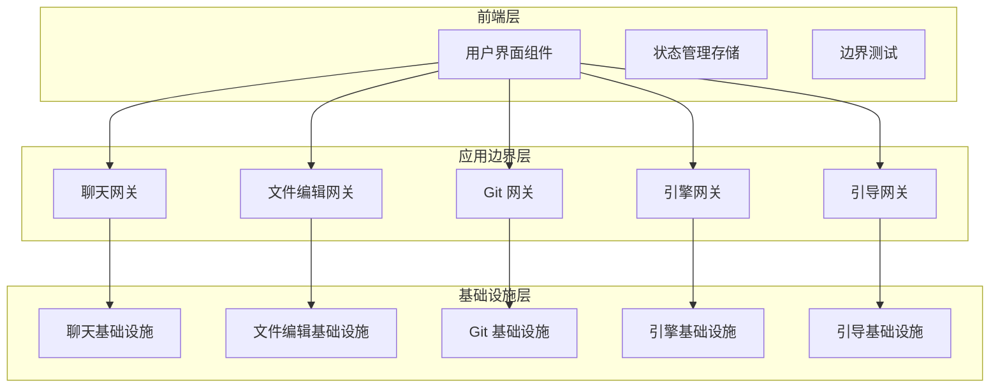
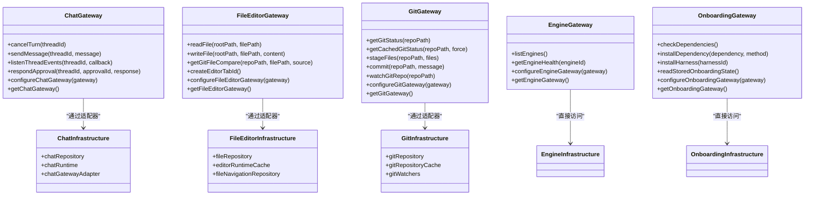
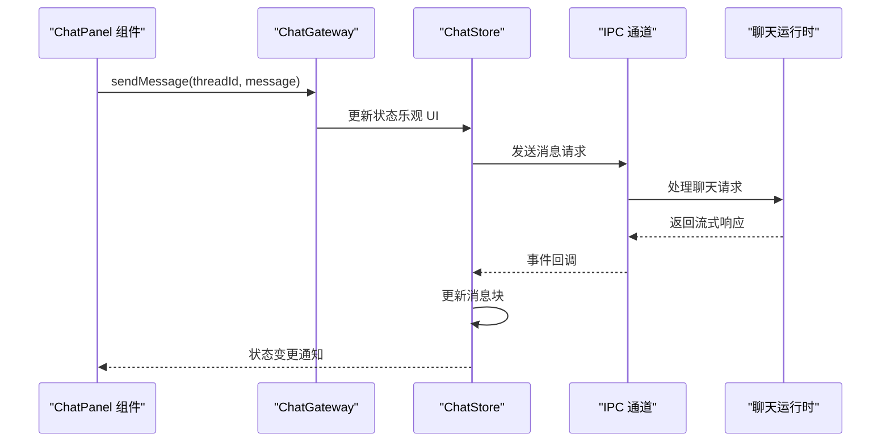
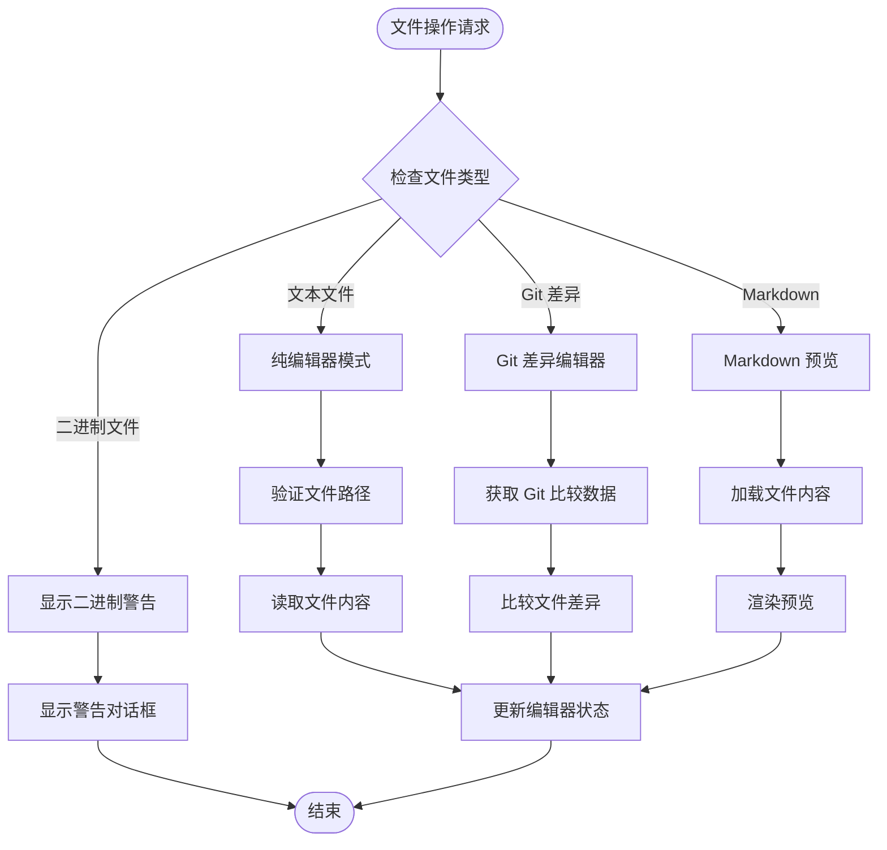
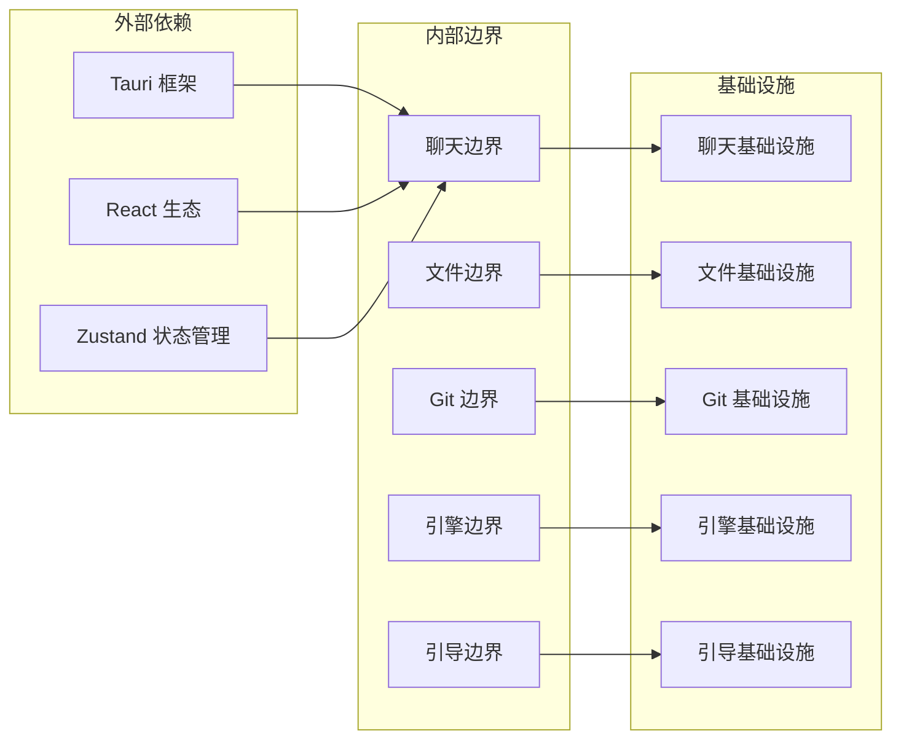
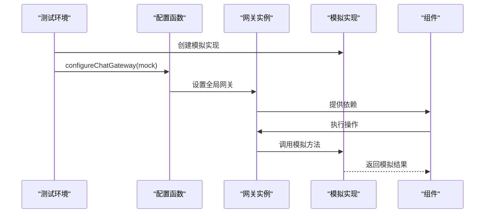

# 上下文边界测试

<cite>
**本文档引用的文件**
- [README.md](file://README.md)
- [appCompositionBoundaries.test.ts](file://src/appCompositionBoundaries.test.ts)
- [chatPanelPresentationBoundaries.test.ts](file://src/components/chat/chatPanelPresentationBoundaries.test.ts)
- [fileEditorPresentationBoundaries.test.ts](file://src/components/editor/fileEditorPresentationBoundaries.test.ts)
- [gitPresentationBoundaries.test.ts](file://src/components/git/gitPresentationBoundaries.test.ts)
- [onboardingPresentationBoundaries.test.ts](file://src/components/onboarding/onboardingPresentationBoundaries.test.ts)
- [workspaceSettingsPresentationBoundaries.test.ts](file://src/components/workspace/workspaceSettingsPresentationBoundaries.test.ts)
- [chatStore.test.ts](file://src/stores/chatStore.test.ts)
- [fileStore.test.ts](file://src/stores/fileStore.test.ts)
- [chatGateway.ts](file://src/contexts/chat/application/chatGateway.ts)
- [fileEditorGateway.ts](file://src/contexts/file-editor/application/fileEditorGateway.ts)
- [gitGateway.ts](file://src/contexts/git/application/gitGateway.ts)
- [onboardingGateway.ts](file://src/contexts/onboarding/application/onboardingGateway.ts)
- [engineGateway.ts](file://src/contexts/engines/application/engineGateway.ts)
</cite>

## 目录
1. [简介](#简介)
2. [项目结构](#项目结构)
3. [核心组件](#核心组件)
4. [架构概览](#架构概览)
5. [详细组件分析](#详细组件分析)
6. [依赖关系分析](#依赖关系分析)
7. [性能考虑](#性能考虑)
8. [故障排除指南](#故障排除指南)
9. [结论](#结论)

## 简介

本文档深入分析了 Panes 代码库中的"上下文边界测试"机制。Panes 是一个本地优先的 AI 辅助编码驾驶舱，通过严格的上下文边界测试确保应用程序的模块化架构和清晰的职责分离。

这些测试机制通过强制执行应用程序边界，防止组件直接访问底层基础设施实现，从而维护了系统的可维护性和可测试性。测试覆盖了聊天、文件编辑、Git 操作、引导流程和工作空间设置等多个核心功能领域。

## 项目结构

Panes 采用分层架构设计，每个功能域都有明确的上下文边界：

**图表来源**
- [chatGateway.ts:75-173](file://src/contexts/chat/application/chatGateway.ts#L75-L173)
- [fileEditorGateway.ts:9-58](file://src/contexts/file-editor/application/fileEditorGateway.ts#L9-L58)
- [gitGateway.ts:21-99](file://src/contexts/git/application/gitGateway.ts#L21-L99)

**章节来源**
- [README.md:242-262](file://README.md#L242-L262)

## 核心组件

### 应用程序边界测试框架

Panes 实现了多层次的边界测试机制，确保组件只能通过定义良好的接口与系统交互：

#### 组合边界测试
应用组合边界测试验证应用程序如何组装和配置其依赖项，确保正确的服务提供者被使用。

#### 表现边界测试
表现边界测试强制组件遵循特定的交互模式，防止直接访问底层实现细节。

#### 状态边界测试
状态边界测试验证状态管理的正确使用，确保状态更新通过适当的边界进行。

**章节来源**
- [appCompositionBoundaries.test.ts:1-12](file://src/appCompositionBoundaries.test.ts#L1-L12)

## 架构概览

Panes 的架构基于清晰的上下文边界，每个功能域都有独立的应用程序边界：

**图表来源**
- [chatGateway.ts:75-173](file://src/contexts/chat/application/chatGateway.ts#L75-L173)
- [fileEditorGateway.ts:9-58](file://src/contexts/file-editor/application/fileEditorGateway.ts#L9-L58)
- [gitGateway.ts:21-99](file://src/contexts/git/application/gitGateway.ts#L21-L99)
- [onboardingGateway.ts:21-44](file://src/contexts/onboarding/application/onboardingGateway.ts#L21-L44)

## 详细组件分析

### 聊天上下文边界测试

聊天系统的边界测试确保 UI 组件只能通过聊天网关与后端通信，而不是直接调用基础设施类。

#### 测试策略
- 验证组件不直接导入基础设施路径
- 确保不直接订阅窗口事件
- 防止直接导入 Tauri 对话框 API

**图表来源**
- [chatPanelPresentationBoundaries.test.ts:6-16](file://src/components/chat/chatPanelPresentationBoundaries.test.ts#L6-L16)
- [chatStore.test.ts:40-176](file://src/stores/chatStore.test.ts#L40-L176)

**章节来源**
- [chatPanelPresentationBoundaries.test.ts:1-24](file://src/components/chat/chatPanelPresentationBoundaries.test.ts#L1-L24)
- [chatStore.test.ts:1-800](file://src/stores/chatStore.test.ts#L1-L800)

### 文件编辑上下文边界测试

文件编辑系统的边界测试确保文件操作通过专门的网关进行，维护了文件系统访问的一致性。

#### 关键测试点
- 文件编辑组件不直接导入基础设施
- 支持多种渲染模式（纯编辑器、Git 差异编辑器、Markdown 预览）
- 正确处理二进制文件和大文件

**图表来源**
- [fileEditorPresentationBoundaries.test.ts:11-18](file://src/components/editor/fileEditorPresentationBoundaries.test.ts#L11-L18)
- [fileStore.test.ts:112-499](file://src/stores/fileStore.test.ts#L112-L499)

**章节来源**
- [fileEditorPresentationBoundaries.test.ts:1-19](file://src/components/editor/fileEditorPresentationBoundaries.test.ts#L1-L19)
- [fileStore.test.ts:1-499](file://src/stores/fileStore.test.ts#L1-L499)

### Git 上下文边界测试

Git 功能的边界测试确保所有 Git 操作都通过统一的网关接口进行，提供了缓存和错误处理的一致性。

#### Git 操作边界
- 缓存状态查询以提高性能
- 统一的错误处理和重试机制
- 支持多种 Git 操作（分支、提交、远程操作等）

**章节来源**
- [gitPresentationBoundaries.test.ts:1-18](file://src/components/git/gitPresentationBoundaries.test.ts#L1-L18)
- [gitGateway.ts:21-99](file://src/contexts/git/application/gitGateway.ts#L21-L99)

### 引导流程上下文边界测试

引导流程的边界测试确保新用户设置过程通过专门的网关进行，维护了安装和配置的一致性。

#### 引导流程特性
- 依赖项检测和安装
- 装置（Harness）安装和管理
- 用户偏好设置存储

**章节来源**
- [onboardingPresentationBoundaries.test.ts:1-43](file://src/components/onboarding/onboardingPresentationBoundaries.test.ts#L1-L43)
- [onboardingGateway.ts:21-44](file://src/contexts/onboarding/application/onboardingGateway.ts#L21-L44)

### 工作空间设置上下文边界测试

工作空间设置的边界测试确保设置操作通过专门的应用程序边界进行，维护了配置管理的一致性。

**章节来源**
- [workspaceSettingsPresentationBoundaries.test.ts:1-18](file://src/components/workspace/workspaceSettingsPresentationBoundaries.test.ts#L1-L18)

## 依赖关系分析

Panes 的依赖关系通过严格的边界测试得到保证：

**图表来源**
- [README.md:248-262](file://README.md#L248-L262)

### 依赖注入和配置

应用程序通过配置函数建立依赖关系，确保测试期间可以轻松替换实现：

**图表来源**
- [chatGateway.ts:163-172](file://src/contexts/chat/application/chatGateway.ts#L163-L172)

**章节来源**
- [chatGateway.ts:1-173](file://src/contexts/chat/application/chatGateway.ts#L1-L173)
- [fileEditorGateway.ts:1-58](file://src/contexts/file-editor/application/fileEditorGateway.ts#L1-L58)
- [gitGateway.ts:1-99](file://src/contexts/git/application/gitGateway.ts#L1-L99)

## 性能考虑

上下文边界测试对性能的影响主要体现在以下几个方面：

### 缓存策略
- Git 状态缓存减少重复查询
- 文件内容缓存避免重复读取
- 渲染状态缓存优化 UI 更新

### 异步处理
- 流式事件处理避免阻塞主线程
- 乐观 UI 更新提升用户体验
- 后台任务调度优化资源使用

### 内存管理
- 及时清理未使用的缓存
- 合理的生命周期管理
- 避免内存泄漏的边界检查

## 故障排除指南

### 常见边界违规问题

#### 违规导入检测
当组件直接导入基础设施路径时，边界测试会失败：
- 错误：`import { chatRepository } from "contexts/chat/infrastructure"`
- 正确：通过 `chatGateway` 访问

#### 解决方案
1. 检查组件导入路径是否在边界测试中被允许
2. 确保使用相应的网关接口
3. 验证网关配置是否正确

**章节来源**
- [chatPanelPresentationBoundaries.test.ts:6-16](file://src/components/chat/chatPanelPresentationBoundaries.test.ts#L6-L16)
- [fileEditorPresentationBoundaries.test.ts:12-16](file://src/components/editor/fileEditorPresentationBoundaries.test.ts#L12-L16)

### 测试调试技巧

#### 单元测试隔离
- 使用模拟对象隔离外部依赖
- 验证边界调用的正确性
- 检查状态变更的预期行为

#### 集成测试验证
- 端到端验证边界交互
- 检查错误处理路径
- 验证性能指标

## 结论

Panes 的上下文边界测试机制是其架构设计的核心组成部分，通过强制执行严格的边界规则，确保了系统的模块化、可维护性和可测试性。这些测试不仅防止了架构违规，还为开发者提供了清晰的指导原则，帮助他们理解如何正确地扩展和修改系统。

边界测试的成功实施体现了现代软件工程的最佳实践，包括：
- 明确的职责分离
- 清晰的接口定义
- 可测试的架构设计
- 可维护的代码组织

这种设计使得 Panes 能够在保持复杂性可控的同时，继续扩展新的功能和改进现有功能。