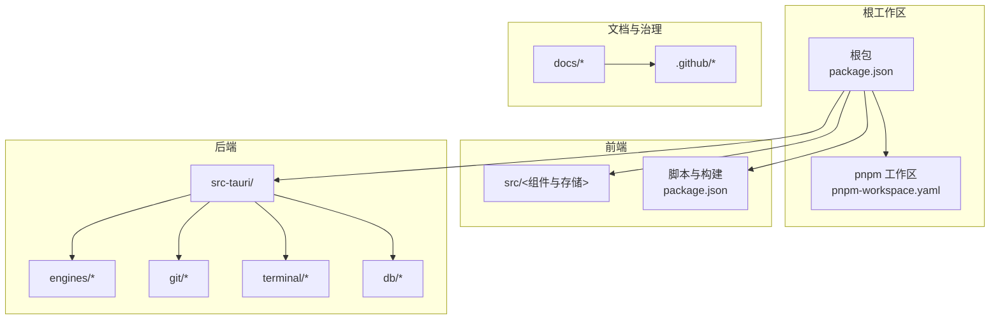
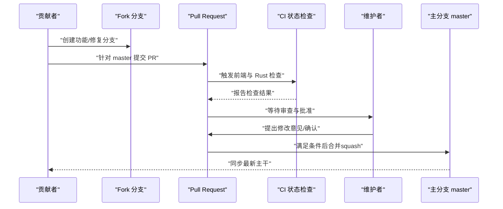
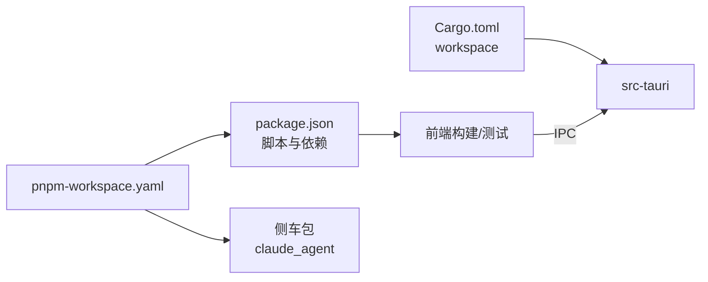

# 贡献流程

<cite>
**本文引用的文件**
- [CONTRIBUTING.md](file://CONTRIBUTING.md)
- [.github/PULL_REQUEST_TEMPLATE.md](file://.github/PULL_REQUEST_TEMPLATE.md)
- [README.md](file://README.md)
- [package.json](file://package.json)
- [Cargo.toml](file://Cargo.toml)
- [docs/github-repo-settings.md](file://docs/github-repo-settings.md)
- [docs/integration/plan.md](file://docs/integration/plan.md)
- [LICENSE](file://LICENSE)
- [pnpm-workspace.yaml](file://pnpm-workspace.yaml)
- [vendor/claude-code-rust/docker-compose.yml](file://vendor/claude-code-rust/docker-compose.yml)
</cite>

## 目录
1. [简介](#简介)
2. [项目结构](#项目结构)
3. [核心组件](#核心组件)
4. [架构总览](#架构总览)
5. [详细组件分析](#详细组件分析)
6. [依赖关系分析](#依赖关系分析)
7. [性能考虑](#性能考虑)
8. [故障排除指南](#故障排除指南)
9. [结论](#结论)
10. [附录](#附录)

## 简介
本文件系统性阐述 Panes 的贡献流程，覆盖从 Issue 提交到 Pull Request 合并的完整工作流；明确大型功能、UX 变更与架构重构的前置讨论要求；解释分支策略、PR 创建规范、代码审查流程与合并政策；提供贡献者协议、许可证信息与社区行为准则；并说明贡献统计、维护者角色与项目治理结构。

## 项目结构
Panes 是一个基于 Tauri v2 + React + TypeScript 的本地优先型桌面应用，采用前后端分离与多包工作区组织：
- 前端：React + Zustand + Vite，位于根目录 src/ 与 package.json 脚本驱动开发与构建
- 后端：Rust（src-tauri/），包含引擎、Git、终端、数据库等模块
- 工作区：pnpm workspace 管理根包与侧车包（claude_agent）
- 文档与治理：docs/ 下包含仓库设置与集成计划；.github/ 包含 PR 模板与工作流（目录）

图表来源
- [pnpm-workspace.yaml:1-4](file://pnpm-workspace.yaml#L1-L4)
- [package.json:1-89](file://package.json#L1-L89)
- [Cargo.toml:1-24](file://Cargo.toml#L1-L24)

章节来源
- [README.md:180-266](file://README.md#L180-L266)
- [pnpm-workspace.yaml:1-4](file://pnpm-workspace.yaml#L1-L4)
- [package.json:1-89](file://package.json#L1-L89)
- [Cargo.toml:1-24](file://Cargo.toml#L1-L24)

## 核心组件
- 贡献规则与流程：CONTRIBUTING.md 规定了前置讨论、PR 规范、审查与合并政策
- PR 模板：.github/PULL_REQUEST_TEMPLATE.md 强制填写验证清单、UI 影响与本地检查记录
- 仓库治理：docs/github-repo-settings.md 定义分支保护、CI 状态检查、CODEOWNERS 与合并策略
- 开发与构建：README.md 与 package.json 提供安装、开发、测试与构建命令
- 许可证：LICENSE 采用 MIT，贡献即默认同意该许可

章节来源
- [CONTRIBUTING.md:42-77](file://CONTRIBUTING.md#L42-L77)
- [.github/PULL_REQUEST_TEMPLATE.md:1-31](file://.github/PULL_REQUEST_TEMPLATE.md#L1-L31)
- [docs/github-repo-settings.md:1-96](file://docs/github-repo-settings.md#L1-L96)
- [README.md:139-207](file://README.md#L139-L207)
- [LICENSE:1-22](file://LICENSE#L1-L22)

## 架构总览
下图展示贡献流程的关键参与者与交互路径：贡献者在 Fork 上创建分支，提交 PR 至主分支；CI 运行前端与 Rust 检查；维护者进行最终审查与合并。

图表来源
- [docs/github-repo-settings.md:33-68](file://docs/github-repo-settings.md#L33-L68)
- [CONTRIBUTING.md:59-65](file://CONTRIBUTING.md#L59-L65)
- [README.md:180-207](file://README.md#L180-L207)

## 详细组件分析

### 前置讨论与范围约束
- 大型功能、广泛 UX 变更与架构重构需先开 Issue 讨论，避免直接提交 PR
- 小型修复、文档更新与聚焦改进可直接提交 PR
- PR 必须聚焦单一问题，避免“大杂烩”导致审查困难

章节来源
- [CONTRIBUTING.md:7-12](file://CONTRIBUTING.md#L7-L12)

### 分支策略与 PR 规范
- 从 Fork 的特性分支提交 PR 至 master
- PR 描述需清晰说明问题与修复方案，UI 变更附截图或录屏
- 明确列出本地运行的检查项；跳过检查需显式标注
- 若涉及用户可见文案，需同步更新多语言资源

章节来源
- [CONTRIBUTING.md:42-58](file://CONTRIBUTING.md#L42-L58)
- [.github/PULL_REQUEST_TEMPLATE.md:1-31](file://.github/PULL_REQUEST_TEMPLATE.md#L1-L31)

### 代码审查与合并政策
- 最终审查权归维护者，外部审批仅作参考
- 通过 CI 前置检查、解决评论后方可合并
- 推荐使用 squash 合并以保持历史整洁
- CODEOWNERS 将仓库级审查路由至维护者

章节来源
- [CONTRIBUTING.md:59-65](file://CONTRIBUTING.md#L59-L65)
- [docs/github-repo-settings.md:52-68](file://docs/github-repo-settings.md#L52-L68)

### 开发环境与本地验证
- 前端：安装依赖后运行开发服务器与测试、类型检查、构建
- 后端：Rust 工作区在 src-tauri/，使用 cargo fmt/cargo check/cargo clippy
- 集成脚本：通过 pnpm 脚本统一执行 lint、test、build、tauri:* 等任务

章节来源
- [README.md:139-207](file://README.md#L139-L207)
- [package.json:6-26](file://package.json#L6-L26)
- [Cargo.toml:1-24](file://Cargo.toml#L1-L24)

### 贡献者协议与许可证
- 贡献即表示同意按 MIT 许可证发布
- LICENSE 文件明确了版权与使用条款

章节来源
- [CONTRIBUTING.md:74-77](file://CONTRIBUTING.md#L74-L77)
- [LICENSE:1-22](file://LICENSE#L1-L22)

### 社区行为准则
- 本仓库未单独提供行为准则文件；遵循开源通用实践与 GitHub 社区指导原则
- 审查过程强调尊重、清晰沟通与建设性反馈

（本节为概念性说明，无需文件引用）

### 贡献统计与维护者角色
- 贡献统计可通过 GitHub 提交历史与 PR 合并记录查看
- 维护者拥有最终审查与合并权限，负责治理与质量把关

（本节为概念性说明，无需文件引用）

### 项目治理结构
- 仓库治理要点：公开仓库接受外部 PR，但合并控制在维护者；通过分支保护、状态检查与 CODEOWNERS 确保质量
- 建议维护者例行流程：审阅描述与验证清单、确认 CI 通过、审查 UI 截图与 i18n 覆盖、解决评论后 squash 合并

章节来源
- [docs/github-repo-settings.md:1-96](file://docs/github-repo-settings.md#L1-L96)

### 大型功能与架构变更的前置讨论
- 对于大型功能、UX 变更与架构重构，应先开 Issue 讨论目标、影响面与实施方案
- 参考集成计划文档中的阶段性目标与风险评估，有助于形成共识与降低返工

章节来源
- [CONTRIBUTING.md:9-11](file://CONTRIBUTING.md#L9-L11)
- [docs/integration/plan.md:1-425](file://docs/integration/plan.md#L1-L425)

### i18n 与多语言文案更新
- 用户可见文案变更需同步更新多语言资源
- Panes 使用 i18next，前端与后端分别维护各自翻译体系

章节来源
- [CONTRIBUTING.md:47](file://CONTRIBUTING.md#L47)
- [README.md:227-235](file://README.md#L227-L235)

### 侧车与第三方集成
- 项目包含 Claude Agent 侧车与独立的 claude-code-rust 库，可作为集成参考
- 通过 docker-compose 可快速启动与验证 CLI 能力

章节来源
- [vendor/claude-code-rust/docker-compose.yml:1-68](file://vendor/claude-code-rust/docker-compose.yml#L1-L68)
- [docs/integration/plan.md:89-169](file://docs/integration/plan.md#L89-L169)

## 依赖关系分析
- 工作区与包管理：pnpm workspace 管理根包与侧车包；package.json 定义脚本与依赖
- Rust 工作区：Cargo.toml 定义 workspace 与共享依赖，src-tauri 为成员
- 前后端协作：前端通过 Tauri API 与后端通信，后端通过 IPC/FFI 调用侧车与原生能力

图表来源
- [pnpm-workspace.yaml:1-4](file://pnpm-workspace.yaml#L1-L4)
- [package.json:1-89](file://package.json#L1-L89)
- [Cargo.toml:1-24](file://Cargo.toml#L1-L24)

章节来源
- [pnpm-workspace.yaml:1-4](file://pnpm-workspace.yaml#L1-L4)
- [package.json:1-89](file://package.json#L1-L89)
- [Cargo.toml:1-24](file://Cargo.toml#L1-L24)

## 性能考虑
- 保持 PR 聚焦，减少审查与回归成本
- 在 PR 描述中明确性能影响与验证方法
- 使用本地检查（类型检查、测试、构建）减少 CI 周期

（本节为一般性建议，无需文件引用）

## 故障排除指南
- PR 被阻塞：检查 PR 模板是否填写完整、本地检查是否全部通过、UI 变更是否附截图、文案是否更新多语言资源
- CI 失败：根据前端与 Rust 检查结果逐项修复；必要时在 PR 中说明跳过的检查与原因
- 合并被拒：关注维护者的审查意见，补充说明或修改后再提交

章节来源
- [.github/PULL_REQUEST_TEMPLATE.md:1-31](file://.github/PULL_REQUEST_TEMPLATE.md#L1-L31)
- [CONTRIBUTING.md:66-73](file://CONTRIBUTING.md#L66-L73)
- [docs/github-repo-settings.md:47-51](file://docs/github-repo-settings.md#L47-L51)

## 结论
Panes 的贡献流程以“先讨论、再实现、受控审查、维护者最终决策”为核心，辅以严格的 PR 规范与 CI 保障。通过清晰的分支策略、明确的审查与合并政策以及完善的许可证与治理文档，项目在开放协作的同时确保质量与一致性。

## 附录
- 快速参考
  - 开发与构建：参见 README 的 Development 与 Architecture 小节
  - 仓库治理：参见 docs/github-repo-settings.md
  - 贡献规则：参见 CONTRIBUTING.md
  - PR 模板：参见 .github/PULL_REQUEST_TEMPLATE.md
  - 许可证：参见 LICENSE

章节来源
- [README.md:180-266](file://README.md#L180-L266)
- [docs/github-repo-settings.md:1-96](file://docs/github-repo-settings.md#L1-L96)
- [CONTRIBUTING.md:1-77](file://CONTRIBUTING.md#L1-L77)
- [.github/PULL_REQUEST_TEMPLATE.md:1-31](file://.github/PULL_REQUEST_TEMPLATE.md#L1-L31)
- [LICENSE:1-22](file://LICENSE#L1-L22)