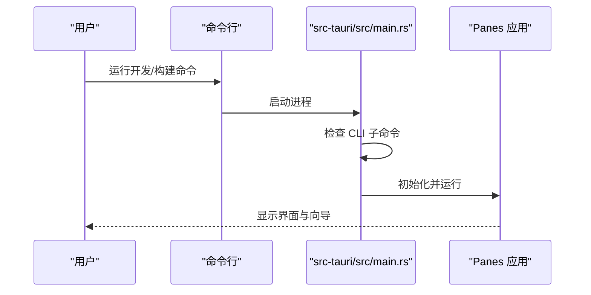
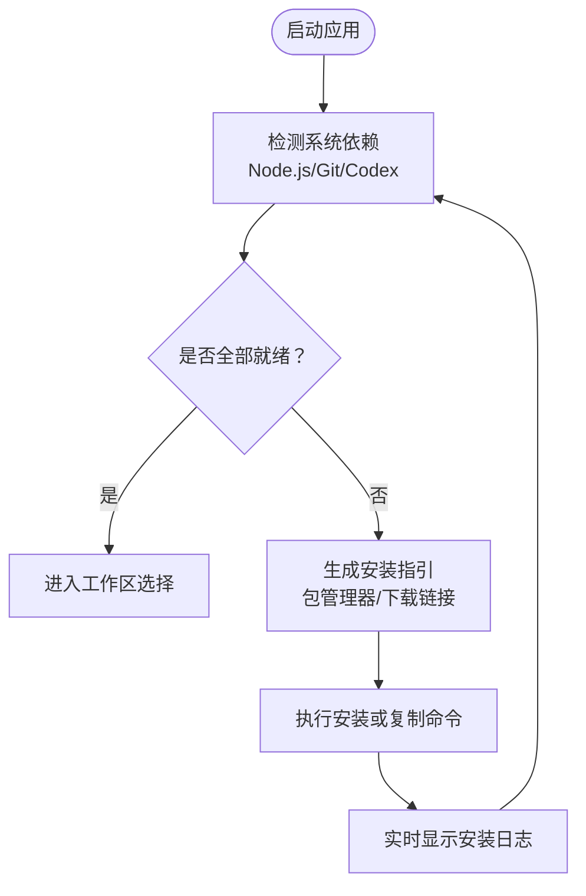
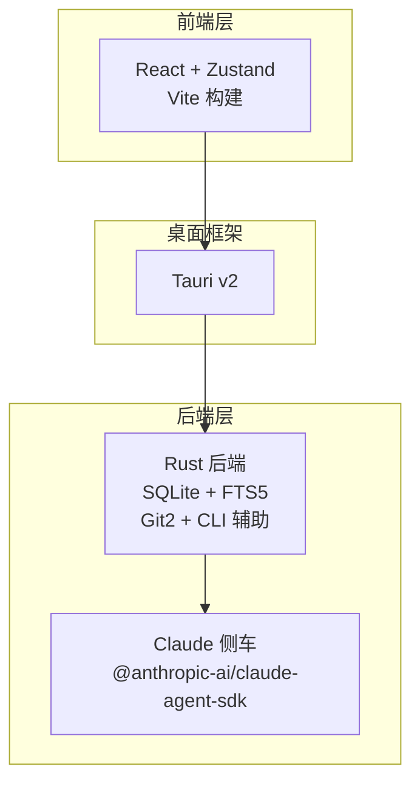
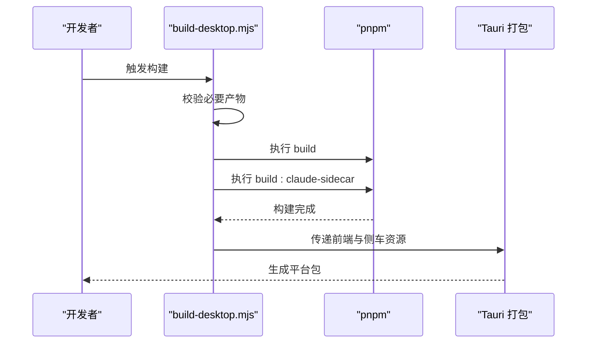
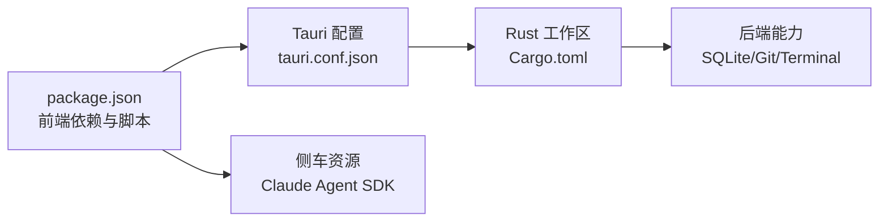

# 快速开始

<cite>
**本文引用的文件**
- [README.md](file://README.md)
- [package.json](file://package.json)
- [Cargo.toml](file://Cargo.toml)
- [src-tauri/tauri.conf.json](file://src-tauri/tauri.conf.json)
- [src-tauri/src/main.rs](file://src-tauri/src/main.rs)
- [scripts/build-desktop.mjs](file://scripts/build-desktop.mjs)
- [scripts/build-claude-sidecar.mjs](file://scripts/build-claude-sidecar.mjs)
- [scripts/generate-homebrew-cask.mjs](file://scripts/generate-homebrew-cask.mjs)
- [docs/homebrew-distribution.md](file://docs/homebrew-distribution.md)
- [src/lib/setupGuidance.ts](file://src/lib/setupGuidance.ts)
- [src/components/onboarding/OnboardingWizard.tsx](file://src/components/onboarding/OnboardingWizard.tsx)
- [src/lib/dependencies.ts](file://src/lib/dependencies.ts)
- [src/types.ts](file://src/types.ts)
</cite>

## 目录
1. [简介](#简介)
2. [系统要求](#系统要求)
3. [安装与运行](#安装与运行)
4. [首次运行与基础使用](#首次运行与基础使用)
5. [架构概览](#架构概览)
6. [详细组件解析](#详细组件解析)
7. [依赖关系分析](#依赖关系分析)
8. [性能与资源建议](#性能与资源建议)
9. [故障排除](#故障排除)
10. [结语](#结语)

## 简介
Panes 是一款本地优先的桌面应用，围绕外部编码代理、Git、终端工作流与轻量文件编辑进行整合，为开发者提供一处集中聊天、审阅差异、批准操作、管理多仓库与保留审计轨迹的能力。它采用 React + Zustand 前端与 Tauri v2 框架，后端由 Rust 提供持久化、引擎编排、Git 操作、终端管理与安全文件访问。

## 系统要求
- Rust 工具链：稳定版
- Node.js：20+
- pnpm：9+
- Codex CLI：用于 Codex 聊天引擎；可通过应用内设置向导安装
- 平台前置条件：遵循 Tauri v2 官方文档中的各平台前置要求

章节来源
- [README.md:78-86](file://README.md#L78-L86)
- [README.md:88-110](file://README.md#L88-L110)
- [README.md:112-137](file://README.md#L112-L137)
- [README.md:139-146](file://README.md#L139-L146)

## 安装与运行

### macOS（推荐：Homebrew）
- 使用 Homebrew 一键安装预构建版本，适用于 Apple Silicon 与 Intel 双架构通用包
- 若遇到 Gatekeeper 阻挡，可按说明对 DMG 或已安装的应用执行去隔离属性，或通过 Finder 下载后打开

章节来源
- [README.md:88-110](file://README.md#L88-L110)

### Windows
- 从 GitHub Releases 下载最新安装器并运行
- 应用内更新由 Tauri Updater 处理

章节来源
- [README.md:112-116](file://README.md#L112-L116)

### Linux
- 支持直接下载 .AppImage 或 .deb 包
- AppImage：赋予可执行权限后直接运行
- Debian 系：使用 sudo apt 安装 .deb 包

章节来源
- [README.md:118-137](file://README.md#L118-L137)

### 从源码安装与运行
- 克隆仓库后，使用 pnpm 安装依赖并启动开发模式
- 构建原生应用包时，会先构建前端与侧车资源，再交由 Tauri 打包

章节来源
- [README.md:139-146](file://README.md#L139-L146)
- [scripts/build-desktop.mjs:63-71](file://scripts/build-desktop.mjs#L63-L71)
- [package.json:21-22](file://package.json#L21-L22)

## 首次运行与基础使用

### 启动流程
- 开发模式：在仓库根目录执行前端开发服务器与 Tauri 开发命令
- 运行入口：Rust 主程序负责处理 CLI 子命令与启动应用主循环

图表来源
- [src-tauri/src/main.rs:1-14](file://src-tauri/src/main.rs#L1-L14)
- [package.json:21-22](file://package.json#L21-L22)

章节来源
- [src-tauri/src/main.rs:1-14](file://src-tauri/src/main.rs#L1-L14)
- [package.json:21-22](file://package.json#L21-L22)

### 设置向导与依赖检测
- 首次启动会进入“入门向导”，自动检测 Node.js、Git、Codex 等依赖
- 根据平台与包管理器偏好，提供安装建议与一键复制命令
- 支持自动安装与手动安装两种路径，并实时展示安装日志

图表来源
- [src/components/onboarding/OnboardingWizard.tsx:1-800](file://src/components/onboarding/OnboardingWizard.tsx#L1-L800)
- [src/lib/setupGuidance.ts:1-128](file://src/lib/setupGuidance.ts#L1-L128)
- [src/lib/dependencies.ts:1-32](file://src/lib/dependencies.ts#L1-L32)

章节来源
- [src/components/onboarding/OnboardingWizard.tsx:1-800](file://src/components/onboarding/OnboardingWizard.tsx#L1-L800)
- [src/lib/setupGuidance.ts:1-128](file://src/lib/setupGuidance.ts#L1-L128)
- [src/lib/dependencies.ts:1-32](file://src/lib/dependencies.ts#L1-L32)

### 工作区与视图
- 支持打开现有工作区或新建工作区
- 默认视图可配置为聊天、分屏、终端或编辑器
- 终端支持分组、拆分、拖拽调整大小与广播模式

章节来源
- [src/types.ts:86-144](file://src/types.ts#L86-L144)

## 架构概览

图表来源
- [README.md:236-256](file://README.md#L236-L256)
- [src-tauri/tauri.conf.json:1-58](file://src-tauri/tauri.conf.json#L1-L58)
- [Cargo.toml:1-24](file://Cargo.toml#L1-L24)

章节来源
- [README.md:236-256](file://README.md#L236-L256)
- [src-tauri/tauri.conf.json:1-58](file://src-tauri/tauri.conf.json#L1-L58)
- [Cargo.toml:1-24](file://Cargo.toml#L1-L24)

## 详细组件解析

### 构建与打包流程
- 前置构建：确保 dist 产物与侧车资源存在
- 构建顺序：先构建前端，再打包 Claude 侧车
- 打包目标：根据平台输出 DMG、deb、AppImage、NSIS 安装器

图表来源
- [scripts/build-desktop.mjs:1-71](file://scripts/build-desktop.mjs#L1-L71)
- [scripts/build-claude-sidecar.mjs:1-141](file://scripts/build-claude-sidecar.mjs#L1-L141)
- [src-tauri/tauri.conf.json:6-11](file://src-tauri/tauri.conf.json#L6-L11)

章节来源
- [scripts/build-desktop.mjs:1-71](file://scripts/build-desktop.mjs#L1-L71)
- [scripts/build-claude-sidecar.mjs:1-141](file://scripts/build-claude-sidecar.mjs#L1-L141)
- [src-tauri/tauri.conf.json:6-11](file://src-tauri/tauri.conf.json#L6-L11)

### Homebrew 分发与发布
- 通过独立 tap 仓库发布 cask
- 发布流程：CI 在主仓库打标签后，检出到 tap 仓库并生成 cask 文件

章节来源
- [docs/homebrew-distribution.md:1-29](file://docs/homebrew-distribution.md#L1-L29)
- [scripts/generate-homebrew-cask.mjs:1-117](file://scripts/generate-homebrew-cask.mjs#L1-L117)

## 依赖关系分析

图表来源
- [package.json:1-89](file://package.json#L1-L89)
- [src-tauri/tauri.conf.json:1-58](file://src-tauri/tauri.conf.json#L1-L58)
- [Cargo.toml:1-24](file://Cargo.toml#L1-L24)

章节来源
- [package.json:1-89](file://package.json#L1-L89)
- [src-tauri/tauri.conf.json:1-58](file://src-tauri/tauri.conf.json#L1-L58)
- [Cargo.toml:1-24](file://Cargo.toml#L1-L24)

## 性能与资源建议
- 建议使用 SSD 存储以提升 Git 与数据库读写性能
- 大型仓库场景下，合理设置扫描深度与启用文件树缓存
- 终端会话较多时，注意内存占用，必要时关闭不活跃会话

## 故障排除

### macOS Gatekeeper 问题
- 若 DMG 或已安装应用被阻止，请使用系统提供的去隔离属性命令后再打开
- 如仍被阻止，可改用 Finder 下载后打开的方式

章节来源
- [README.md:96-108](file://README.md#L96-L108)

### Windows 验证状态与安装器
- 使用官方安装器进行安装，后续更新由应用内更新机制处理
- 若出现验证状态异常，建议重新下载最新安装器并以管理员身份运行

章节来源
- [README.md:112-116](file://README.md#L112-L116)

### 依赖安装失败或冲突
- 向导中若监听安装进度失败，会清理安装状态并提示错误信息
- 同一时间仅允许一次安装任务，避免并发冲突

章节来源
- [src/components/onboarding/OnboardingWizard.tsx:1-800](file://src/components/onboarding/OnboardingWizard.tsx#L1-L800)
- [src/lib/dependencies.ts:1-32](file://src/lib/dependencies.ts#L1-L32)

### 侧车与终端通知
- Claude 与 Codex 通知需在设置中完成一次性安装，以便将通知回传至终端会话
- 仅在由 Panes 启动的终端中生效，依赖会话环境变量

章节来源
- [README.md:148-169](file://README.md#L148-L169)

## 结语
按照上述步骤，您可以在最短时间内完成 Panes 的安装与首次运行。建议在入门向导中完成依赖检测与安装，并根据个人工作流选择合适的默认视图与工作区。如遇问题，可参考故障排除章节或查看应用内的更新与日志目录。