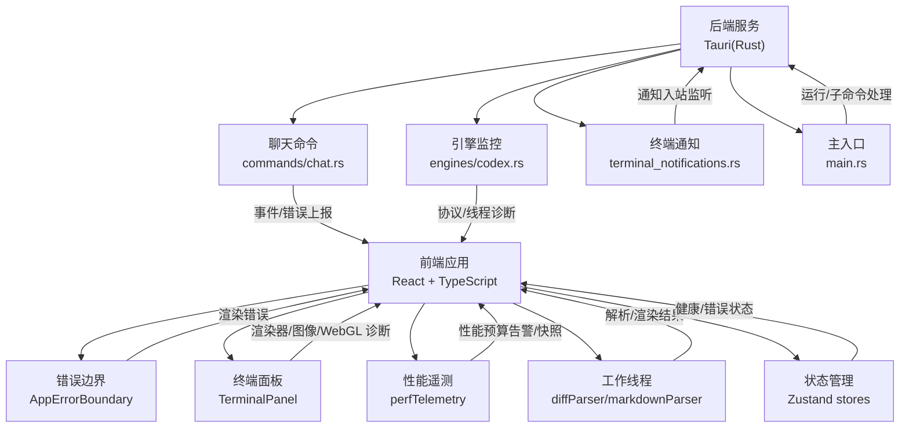
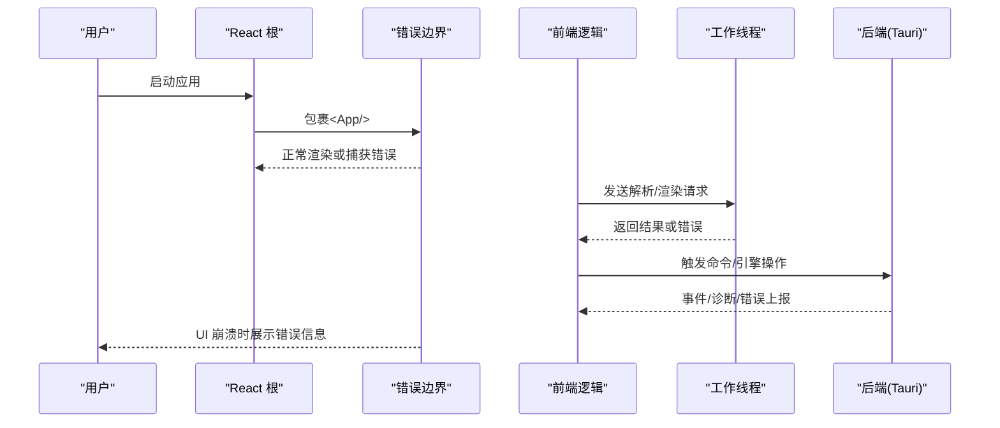
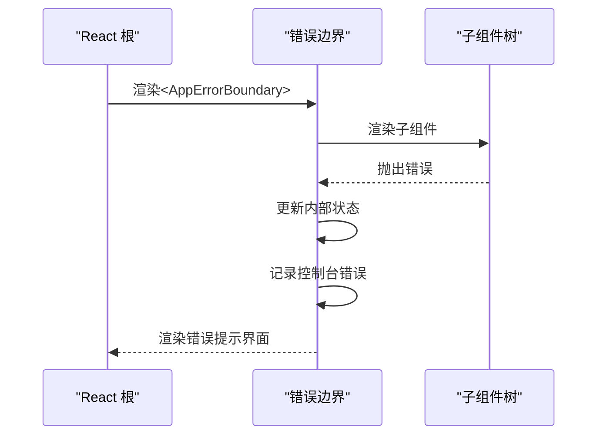
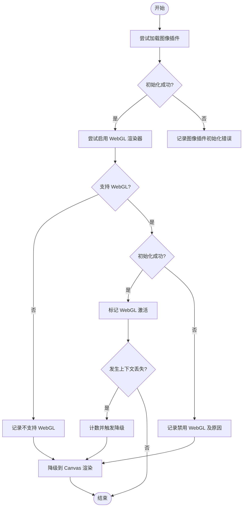
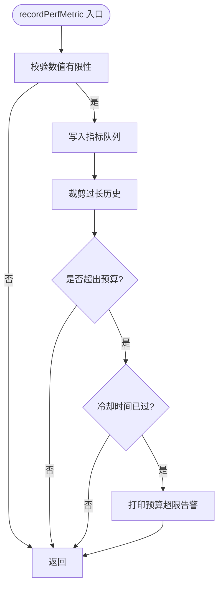
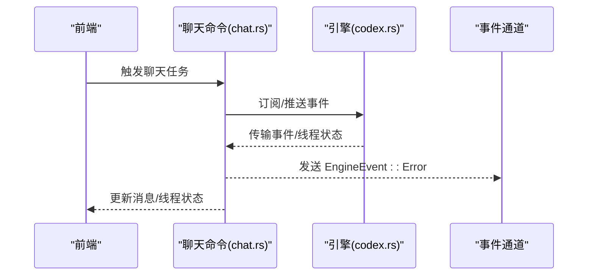
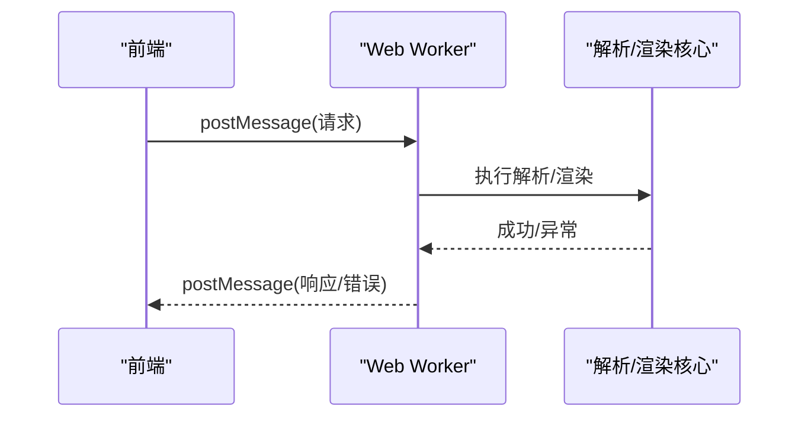
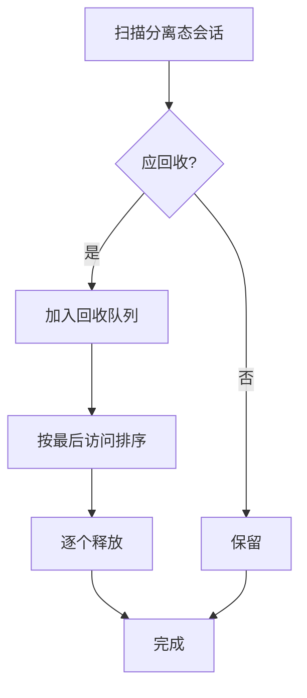
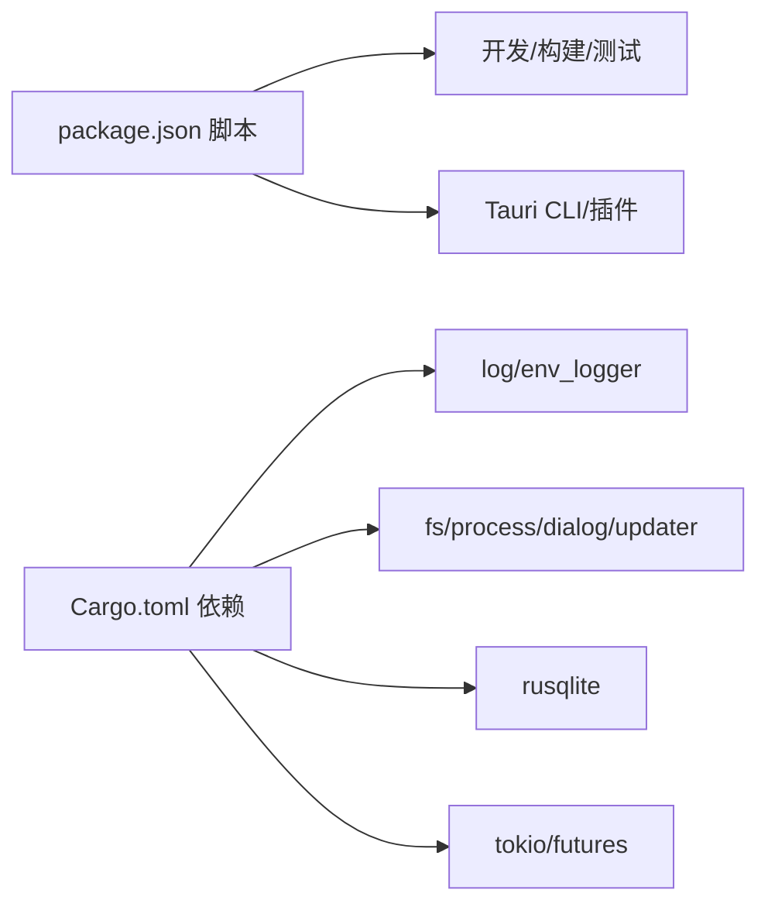

# 崩溃分析

<cite>
**本文引用的文件**
- [AppErrorBoundary.tsx](file://src/components/shared/AppErrorBoundary.tsx)
- [main.tsx](file://src/main.tsx)
- [TerminalPanel.tsx](file://src/components/terminal/TerminalPanel.tsx)
- [perfTelemetry.ts](file://src/lib/perfTelemetry.ts)
- [engineStore.ts](file://src/stores/engineStore.ts)
- [main.rs](file://src-tauri/src/main.rs)
- [Cargo.toml](file://src-tauri/Cargo.toml)
- [chat.rs](file://src-tauri/src/commands/chat.rs)
- [codex.rs](file://src-tauri/src/engines/codex.rs)
- [terminal_notifications.rs](file://src-tauri/src/terminal_notifications.rs)
- [diffParser.worker.ts](file://src/workers/diffParser.worker.ts)
- [markdownParser.worker.ts](file://src/workers/markdownParser.worker.ts)
- [terminalCacheLifecycle.ts](file://src/components/terminal/terminalCacheLifecycle.ts)
- [package.json](file://package.json)
</cite>

## 目录
1. [简介](#简介)
2. [项目结构](#项目结构)
3. [核心组件](#核心组件)
4. [架构总览](#架构总览)
5. [详细组件分析](#详细组件分析)
6. [依赖关系分析](#依赖关系分析)
7. [性能考量](#性能考量)
8. [故障排查指南](#故障排查指南)
9. [结论](#结论)
10. [附录](#附录)

## 简介
本指南聚焦于 Panes 的崩溃分析与调试实践，覆盖前端错误边界捕获、堆栈跟踪与日志提取、后端运行时事件与诊断、常见崩溃成因（内存泄漏、未处理异常、资源竞争）以及崩溃报告生成与提交流程。同时提供开发与生产环境的调试技巧与监控策略，并给出崩溃预防与恢复机制建议。

## 项目结构
Panes 采用前端 React + Tauri 桌面应用架构，前端负责 UI 与交互，Tauri 负责系统集成与原生能力；部分重计算任务通过 Web Worker 执行以避免阻塞主线程；性能指标通过前端遥测模块记录并在全局暴露快照接口。

图表来源
- [main.tsx:11-29](file://src/main.tsx#L11-L29)
- [AppErrorBoundary.tsx:12-50](file://src/components/shared/AppErrorBoundary.tsx#L12-L50)
- [TerminalPanel.tsx:426-449](file://src/components/terminal/TerminalPanel.tsx#L426-L449)
- [perfTelemetry.ts:55-87](file://src/lib/perfTelemetry.ts#L55-L87)
- [diffParser.worker.ts:13-37](file://src/workers/diffParser.worker.ts#L13-L37)
- [markdownParser.worker.ts:9-28](file://src/workers/markdownParser.worker.ts#L9-L28)
- [chat.rs:1974-2012](file://src-tauri/src/commands/chat.rs#L1974-L2012)
- [codex.rs:2410-2434](file://src-tauri/src/engines/codex.rs#L2410-L2434)
- [terminal_notifications.rs:341-360](file://src-tauri/src/terminal_notifications.rs#L341-L360)
- [main.rs:3-13](file://src-tauri/src/main.rs#L3-L13)

章节来源
- [main.tsx:11-29](file://src/main.tsx#L11-L29)
- [package.json:6-26](file://package.json#L6-L26)

## 核心组件
- 错误边界：在根节点包裹错误边界，捕获 UI 运行时错误并输出堆栈或消息，便于开发调试与用户反馈。
- 终端面板诊断：对图像插件初始化、WebGL 渲染器启用失败、上下文丢失等进行诊断与降级处理。
- 性能遥测：记录关键性能指标，超过预算时发出告警，并提供窗口化快照与最近指标查询。
- 后端命令与引擎监控：聊天命令流中对错误进行归类与事件上报；引擎侧对传输事件、线程状态进行诊断。
- 工作线程：差异解析与 Markdown 渲染在独立线程执行，异常被捕获并回传错误信息。
- 终端缓存生命周期：对分离态终端会话进行空闲回收，避免资源长期占用。

章节来源
- [AppErrorBoundary.tsx:12-50](file://src/components/shared/AppErrorBoundary.tsx#L12-L50)
- [TerminalPanel.tsx:451-461](file://src/components/terminal/TerminalPanel.tsx#L451-L461)
- [perfTelemetry.ts:55-87](file://src/lib/perfTelemetry.ts#L55-L87)
- [engineStore.ts:98-111](file://src/stores/engineStore.ts#L98-L111)
- [chat.rs:1974-2012](file://src-tauri/src/commands/chat.rs#L1974-L2012)
- [codex.rs:2410-2434](file://src-tauri/src/engines/codex.rs#L2410-L2434)
- [diffParser.worker.ts:13-37](file://src/workers/diffParser.worker.ts#L13-L37)
- [markdownParser.worker.ts:9-28](file://src/workers/markdownParser.worker.ts#L9-L28)
- [terminalCacheLifecycle.ts:57-73](file://src/components/terminal/terminalCacheLifecycle.ts#L57-L73)

## 架构总览
前端通过错误边界拦截 UI 异常；终端面板对渲染器与图像插件进行诊断与降级；性能遥测模块提供预算告警与快照；后端命令与引擎监控负责运行时事件与诊断；工作线程承担重计算并隔离异常；终端缓存生命周期控制资源回收。

图表来源
- [main.tsx:22-28](file://src/main.tsx#L22-L28)
- [AppErrorBoundary.tsx:18-25](file://src/components/shared/AppErrorBoundary.tsx#L18-L25)
- [diffParser.worker.ts:13-37](file://src/workers/diffParser.worker.ts#L13-L37)
- [markdownParser.worker.ts:9-28](file://src/workers/markdownParser.worker.ts#L9-L28)
- [chat.rs:1974-2012](file://src-tauri/src/commands/chat.rs#L1974-L2012)

## 详细组件分析

### 错误边界与 UI 崩溃捕获
- 错误边界在 getDerivedStateFromError 中接收错误，在 componentDidCatch 中记录到控制台，渲染阶段错误信息以可读形式呈现给用户。
- 前端根节点在严格模式下包裹错误边界，确保顶层 UI 异常被统一捕获。

图表来源
- [main.tsx:22-28](file://src/main.tsx#L22-L28)
- [AppErrorBoundary.tsx:18-25](file://src/components/shared/AppErrorBoundary.tsx#L18-L25)

章节来源
- [main.tsx:22-28](file://src/main.tsx#L22-L28)
- [AppErrorBoundary.tsx:12-50](file://src/components/shared/AppErrorBoundary.tsx#L12-L50)

### 终端面板渲染器与图像插件诊断
- 图像插件初始化失败、WebGL 初始化失败、上下文丢失均被诊断并记录，必要时降级到 Canvas 渲染。
- 提供诊断对象克隆与统计字段，便于问题定位与回溯。

图表来源
- [TerminalPanel.tsx:646-671](file://src/components/terminal/TerminalPanel.tsx#L646-L671)
- [TerminalPanel.tsx:673-720](file://src/components/terminal/TerminalPanel.tsx#L673-L720)

章节来源
- [TerminalPanel.tsx:451-461](file://src/components/terminal/TerminalPanel.tsx#L451-L461)
- [TerminalPanel.tsx:463-484](file://src/components/terminal/TerminalPanel.tsx#L463-L484)
- [TerminalPanel.tsx:646-671](file://src/components/terminal/TerminalPanel.tsx#L646-L671)
- [TerminalPanel.tsx:673-720](file://src/components/terminal/TerminalPanel.tsx#L673-L720)

### 性能遥测与预算告警
- 记录关键性能指标，超过预算时冷却期内抑制重复告警；提供窗口化快照与最近指标查询，便于定位性能瓶颈。

图表来源
- [perfTelemetry.ts:55-87](file://src/lib/perfTelemetry.ts#L55-L87)
- [perfTelemetry.ts:89-122](file://src/lib/perfTelemetry.ts#L89-L122)

章节来源
- [perfTelemetry.ts:1-146](file://src/lib/perfTelemetry.ts#L1-L146)

### 后端命令与引擎监控
- 聊天命令在错误分支中设置消息/线程状态为错误，并通过事件通道发送不可恢复错误；引擎监控对传输事件与线程快照进行更新与诊断。

图表来源
- [chat.rs:1974-2012](file://src-tauri/src/commands/chat.rs#L1974-L2012)
- [codex.rs:2410-2434](file://src-tauri/src/engines/codex.rs#L2410-L2434)

章节来源
- [chat.rs:1974-2012](file://src-tauri/src/commands/chat.rs#L1974-L2012)
- [codex.rs:2410-2434](file://src-tauri/src/engines/codex.rs#L2410-L2434)

### 工作线程与异常隔离
- 差异解析与 Markdown 渲染在独立线程执行，异常被捕获并回传错误字符串，避免主线程崩溃。

图表来源
- [diffParser.worker.ts:13-37](file://src/workers/diffParser.worker.ts#L13-L37)
- [markdownParser.worker.ts:9-28](file://src/workers/markdownParser.worker.ts#L9-L28)

章节来源
- [diffParser.worker.ts:1-40](file://src/workers/diffParser.worker.ts#L1-L40)
- [markdownParser.worker.ts:1-30](file://src/workers/markdownParser.worker.ts#L1-L30)

### 终端缓存生命周期与资源回收
- 对分离态终端会话按空闲阈值进行回收，避免长时间占用资源。

图表来源
- [terminalCacheLifecycle.ts:57-73](file://src/components/terminal/terminalCacheLifecycle.ts#L57-L73)

章节来源
- [terminalCacheLifecycle.ts:50-73](file://src/components/terminal/terminalCacheLifecycle.ts#L50-L73)

## 依赖关系分析
- 前端脚本包含开发、构建、测试与打包等命令，便于本地调试与产物生成。
- 后端 Cargo 配置包含日志、数据库、进程、通知等插件依赖，支撑桌面应用与系统集成。

图表来源
- [package.json:6-26](file://package.json#L6-L26)
- [Cargo.toml:15-67](file://src-tauri/Cargo.toml#L15-L67)

章节来源
- [package.json:6-26](file://package.json#L6-L26)
- [Cargo.toml:1-67](file://src-tauri/Cargo.toml#L1-L67)

## 性能考量
- 使用性能遥测模块记录关键指标并设置预算，结合窗口化快照定位异常区间。
- 终端面板对图像与 WebGL 的诊断与降级策略，减少渲染失败导致的崩溃风险。
- 工作线程隔离重计算，降低主线程阻塞与崩溃概率。
- 终端缓存生命周期控制资源占用，避免内存泄漏与资源竞争。

## 故障排查指南

### 收集与分析崩溃信息
- 前端错误边界：检查控制台输出“UI crash”记录，查看错误堆栈或消息，定位具体组件与调用链。
- 终端面板诊断：关注图像插件初始化、WebGL 启用/禁用、上下文丢失等日志，判断渲染器相关问题。
- 性能遥测：使用全局快照接口获取窗口化指标，识别超预算项与异常峰值。
- 后端命令与引擎：检查事件通道中的错误事件与引擎诊断，确认传输事件与线程状态变化。

章节来源
- [AppErrorBoundary.tsx:22-25](file://src/components/shared/AppErrorBoundary.tsx#L22-L25)
- [TerminalPanel.tsx:426-449](file://src/components/terminal/TerminalPanel.tsx#L426-L449)
- [perfTelemetry.ts:89-122](file://src/lib/perfTelemetry.ts#L89-L122)
- [chat.rs:1974-2012](file://src-tauri/src/commands/chat.rs#L1974-L2012)
- [codex.rs:2410-2434](file://src-tauri/src/engines/codex.rs#L2410-L2434)

### 常见崩溃原因与定位
- 内存泄漏：关注终端缓存生命周期与工作线程回调清理；检查性能遥测中的峰值与持续高值。
- 未处理异常：前端错误边界与工作线程异常捕获；后端命令分支中的错误状态更新。
- 资源竞争：终端渲染器切换与上下文丢失；引擎传输事件与线程状态同步。

章节来源
- [terminalCacheLifecycle.ts:57-73](file://src/components/terminal/terminalCacheLifecycle.ts#L57-L73)
- [diffParser.worker.ts:13-37](file://src/workers/diffParser.worker.ts#L13-L37)
- [markdownParser.worker.ts:9-28](file://src/workers/markdownParser.worker.ts#L9-L28)
- [TerminalPanel.tsx:673-720](file://src/components/terminal/TerminalPanel.tsx#L673-L720)
- [codex.rs:2410-2434](file://src-tauri/src/engines/codex.rs#L2410-L2434)

### 崩溃报告生成与提交
- 开发环境：利用错误边界控制台输出与终端面板诊断日志，复制堆栈与诊断信息。
- 生产环境：结合后端日志与事件通道错误事件，汇总时间线与影响范围。
- 提交要点：版本号、操作系统、复现步骤、错误堆栈、性能快照片段、终端诊断摘要。

章节来源
- [main.rs:7-10](file://src-tauri/src/main.rs#L7-L10)
- [terminal_notifications.rs:341-360](file://src-tauri/src/terminal_notifications.rs#L341-L360)

### 开发环境调试技巧
- 启用严格模式与错误边界，快速暴露 UI 异常。
- 使用性能遥测快照定位异常区间，配合断点与日志逐步缩小范围。
- 在终端面板中开启调试开关，观察渲染器切换与降级路径。

章节来源
- [main.tsx:22-28](file://src/main.tsx#L22-L28)
- [perfTelemetry.ts:89-122](file://src/lib/perfTelemetry.ts#L89-L122)
- [TerminalPanel.tsx:426-449](file://src/components/terminal/TerminalPanel.tsx#L426-L449)

### 生产环境监控策略
- 后端日志：启用 env_logger 并配置级别，关注终端通知入站监听与命令执行错误。
- 事件通道：订阅 EngineEvent::Error，记录不可恢复错误与恢复策略。
- 前端遥测：定期抓取性能快照，建立阈值告警与趋势分析。

章节来源
- [Cargo.toml:45-46](file://src-tauri/Cargo.toml#L45-L46)
- [terminal_notifications.rs:341-360](file://src-tauri/src/terminal_notifications.rs#L341-L360)
- [chat.rs:1974-2012](file://src-tauri/src/commands/chat.rs#L1974-L2012)

### 崩溃预防与恢复机制
- 预防：工作线程隔离、渲染器降级、缓存回收、预算告警。
- 恢复：错误边界兜底、引擎传输事件退出、终端上下文丢失降级、状态机回滚。

章节来源
- [diffParser.worker.ts:13-37](file://src/workers/diffParser.worker.ts#L13-L37)
- [markdownParser.worker.ts:9-28](file://src/workers/markdownParser.worker.ts#L9-L28)
- [TerminalPanel.tsx:722-726](file://src/components/terminal/TerminalPanel.tsx#L722-L726)
- [engineStore.ts:98-111](file://src/stores/engineStore.ts#L98-L111)

## 结论
通过错误边界、终端渲染诊断、性能遥测、后端事件与引擎监控、工作线程隔离以及缓存生命周期管理，Panes 在前端与后端层面形成了较为完善的崩溃防护与可观测体系。建议在开发与生产环境中持续使用上述工具与策略，结合日志与快照进行根因分析，并完善自动化告警与恢复流程。

## 附录
- 关键实现位置参考：
  - 错误边界与根挂载：[main.tsx:22-28](file://src/main.tsx#L22-L28)、[AppErrorBoundary.tsx:12-50](file://src/components/shared/AppErrorBoundary.tsx#L12-L50)
  - 终端诊断与降级：[TerminalPanel.tsx:646-671](file://src/components/terminal/TerminalPanel.tsx#L646-L671)、[TerminalPanel.tsx:673-720](file://src/components/terminal/TerminalPanel.tsx#L673-L720)
  - 性能遥测与快照：[perfTelemetry.ts:55-87](file://src/lib/perfTelemetry.ts#L55-L87)、[perfTelemetry.ts:89-122](file://src/lib/perfTelemetry.ts#L89-L122)
  - 后端命令与引擎：[chat.rs:1974-2012](file://src-tauri/src/commands/chat.rs#L1974-L2012)、[codex.rs:2410-2434](file://src-tauri/src/engines/codex.rs#L2410-L2434)
  - 工作线程异常捕获：[diffParser.worker.ts:13-37](file://src/workers/diffParser.worker.ts#L13-L37)、[markdownParser.worker.ts:9-28](file://src/workers/markdownParser.worker.ts#L9-L28)
  - 缓存回收策略：[terminalCacheLifecycle.ts:57-73](file://src/components/terminal/terminalCacheLifecycle.ts#L57-L73)
  - 后端日志与通知：[Cargo.toml:45-46](file://src-tauri/Cargo.toml#L45-L46)、[terminal_notifications.rs:341-360](file://src-tauri/src/terminal_notifications.rs#L341-L360)
  - 主入口与子命令处理：[main.rs:3-13](file://src-tauri/src/main.rs#L3-L13)