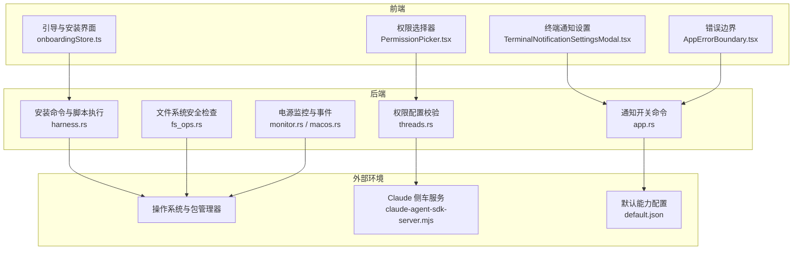

# 常见问题

<cite>
**本文引用的文件**
- [README.md](file://README.md)
- [package.json](file://package.json)
- [Cargo.toml（Rust 后端）](file://src-tauri/Cargo.toml)
- [onboardingStore.ts](file://src/stores/onboardingStore.ts)
- [harness.rs](file://src-tauri/src/commands/harness.rs)
- [setupGuidance.ts](file://src/lib/setupGuidance.ts)
- [AppErrorBoundary.tsx](file://src/components/shared/AppErrorBoundary.tsx)
- [GitPanel.tsx](file://src/components/git/GitPanel.tsx)
- [fs_ops.rs](file://src-tauri/src/fs_ops.rs)
- [threads.rs（权限校验）](file://src-tauri/src/commands/threads.rs)
- [PermissionPicker.tsx](file://src/components/chat/PermissionPicker.tsx)
- [TerminalNotificationSettingsModal.tsx](file://src/components/shared/TerminalNotificationSettingsModal.tsx)
- [terminalNotificationSettingsStore.ts](file://src/stores/terminalNotificationSettingsStore.ts)
- [app.rs（通知设置命令）](file://src-tauri/src/commands/app.rs)
- [monitor.rs（电源监控）](file://src-tauri/src/power/monitor.rs)
- [macos.rs（macOS 电源通知）](file://src-tauri/src/power/macos.rs)
- [claude-agent-sdk-server.mjs（侧车）](file://src-tauri/sidecar/claude-agent-sdk-server.mjs)
- [default.json（能力配置）](file://src-tauri/capabilities/default.json)
</cite>

## 目录
1. [简介](#简介)
2. [项目结构与适用范围](#项目结构与适用范围)
3. [核心组件与常见问题分类](#核心组件与常见问题分类)
4. [架构总览](#架构总览)
5. [详细问题与排障指南](#详细问题与排障指南)
6. [依赖关系分析](#依赖关系分析)
7. [性能与稳定性建议](#性能与稳定性建议)
8. [故障排查清单](#故障排查清单)
9. [结论](#结论)

## 简介
本常见问题解答面向首次安装与日常使用 Panes 的用户，聚焦安装失败、启动异常、功能不可用、跨平台兼容性、权限与网络限制、终端通知联动等高频问题。文档提供症状、可能原因、分步解决步骤，并附带快速诊断清单与自助方案，帮助您尽快恢复正常使用。

## 项目结构与适用范围
- 平台支持：macOS、Linux、Windows；应用通过 Tauri v2 打包，提供原生体验与自动更新。
- 核心运行时要求：Node.js 20+、pnpm 9+、Rust 工具链稳定版；部分平台需满足 Tauri v2 先决条件。
- 安装路径：macOS 主要通过 Homebrew；Windows/Linux 提供安装器或 AppImage/Deb 包；亦可从源码构建。

章节来源
- [README.md: 76-138:76-138](file://README.md#L76-L138)
- [package.json: 1-89:1-89](file://package.json#L1-L89)
- [Cargo.toml（Rust 后端）: 1-67:1-67](file://src-tauri/Cargo.toml#L1-L67)

## 核心组件与常见问题分类
- 安装与引导流程：依赖检测、自动安装、安装进度监听、错误清理。
- 跨平台兼容：macOS 首次启动确认、Linux/Windows 权限与包管理器差异。
- 权限与网络：文件系统访问、网络访问控制、沙箱模式、线程级权限配置。
- 终端通知联动：Codex/Claude 通知桥接、OSC 通知、桌面与终端双重提示。
- Git 功能：仓库初始化、上游分支、远程管理、错误提示与清除。
- 错误边界与日志：前端错误捕获、后端启动日志、会话恢复与告警。

章节来源
- [onboardingStore.ts: 215-283:215-283](file://src/stores/onboardingStore.ts#L215-L283)
- [harness.rs: 396-415:396-415](file://src-tauri/src/commands/harness.rs#L396-L415)
- [setupGuidance.ts: 1-128:1-128](file://src/lib/setupGuidance.ts#L1-L128)
- [GitPanel.tsx: 739-779:739-779](file://src/components/git/GitPanel.tsx#L739-L779)
- [fs_ops.rs: 156-192:156-192](file://src-tauri/src/fs_ops.rs#L156-L192)
- [threads.rs（权限校验）: 2556-2625:2556-2625](file://src-tauri/src/commands/threads.rs#L2556-L2625)
- [PermissionPicker.tsx: 1-177:1-177](file://src/components/chat/PermissionPicker.tsx#L1-L177)
- [TerminalNotificationSettingsModal.tsx: 1-40:1-40](file://src/components/shared/TerminalNotificationSettingsModal.tsx#L1-L40)
- [terminalNotificationSettingsStore.ts: 58-281:58-281](file://src/stores/terminalNotificationSettingsStore.ts#L58-L281)
- [app.rs（通知设置命令）: 230-235:230-235](file://src-tauri/src/commands/app.rs#L230-L235)
- [monitor.rs（电源监控）: 70-142:70-142](file://src-tauri/src/power/monitor.rs#L70-L142)
- [macos.rs（macOS 电源通知）: 409-569:409-569](file://src-tauri/src/power/macos.rs#L409-L569)

## 架构总览
下图展示 Panes 在安装、引导、权限与通知方面的关键交互路径，帮助定位问题来源。

图表来源
- [onboardingStore.ts: 215-283:215-283](file://src/stores/onboardingStore.ts#L215-L283)
- [harness.rs: 396-415:396-415](file://src-tauri/src/commands/harness.rs#L396-L415)
- [fs_ops.rs: 156-192:156-192](file://src-tauri/src/fs_ops.rs#L156-L192)
- [threads.rs（权限校验）: 2556-2625:2556-2625](file://src-tauri/src/commands/threads.rs#L2556-L2625)
- [PermissionPicker.tsx: 1-177:1-177](file://src/components/chat/PermissionPicker.tsx#L1-L177)
- [TerminalNotificationSettingsModal.tsx: 1-40:1-40](file://src/components/shared/TerminalNotificationSettingsModal.tsx#L1-L40)
- [terminalNotificationSettingsStore.ts: 58-281:58-281](file://src/stores/terminalNotificationSettingsStore.ts#L58-L281)
- [app.rs（通知设置命令）: 230-235:230-235](file://src-tauri/src/commands/app.rs#L230-L235)
- [monitor.rs（电源监控）: 70-142:70-142](file://src-tauri/src/power/monitor.rs#L70-L142)
- [macos.rs（macOS 电源通知）: 409-569:409-569](file://src-tauri/src/power/macos.rs#L409-L569)
- [claude-agent-sdk-server.mjs: 676-715:676-715](file://src-tauri/sidecar/claude-agent-sdk-server.mjs#L676-L715)
- [default.json（能力配置）: 1-22:1-22](file://src-tauri/capabilities/default.json#L1-L22)

## 详细问题与排障指南

### 一、安装失败与引导异常
- 症状
  - 安装依赖或安装引导卡住、报错“listen failed”、无法并发二次安装。
  - 安装脚本执行失败但未清理状态。
- 可能原因
  - 前台安装任务占用中，再次触发导致阻塞。
  - 安装进度监听失败或子进程等待失败。
  - 包管理器不可用或网络受限。
- 解决步骤
  - 等待当前安装完成，避免重复触发。
  - 清理安装状态并重试：关闭安装面板，重新打开并重试安装。
  - 检查包管理器可用性（macOS 使用 Homebrew；Linux 优先 apt/dnf/pacman/zyppe/apk；Windows 优先 winget/choco/scoop）。
  - 若使用脚本安装，确认网络可达与 Shell 权限。
- 快速验证
  - 查看安装日志是否持续输出；若无新行，可能是监听异常。
  - 尝试手动执行推荐命令，确认环境变量与 PATH 正确。

章节来源
- [onboardingStore.ts: 215-283:215-283](file://src/stores/onboardingStore.ts#L215-L283)
- [harness.rs: 372-415:372-415](file://src-tauri/src/commands/harness.rs#L372-L415)
- [setupGuidance.ts: 1-128:1-128](file://src/lib/setupGuidance.ts#L1-L128)

### 二、启动异常与首启确认
- 症状
  - macOS 首次启动被 Gatekeeper 阻止；或直接拖拽 DMG 后首次打开被阻止。
- 可能原因
  - 应用未签名/未公证，Gatekeeper 对未签名应用的首次启动有额外拦截。
- 解决步骤
  - 使用 Homebrew 安装以降低拦截概率；如仍被拦截，按提示在 Finder 中打开。
  - 如 DMG 自身被拦截，先移除隔离属性再打开；或改用直接下载 DMG 并在“获取信息”中允许打开。
  - 若已放入“应用程序”，首次启动被拦截，对应用右键“显示简介”并移除隔离属性后再打开。
- 快速验证
  - 重启后再次尝试打开，确认系统策略变化。

章节来源
- [README.md: 96-108:96-108](file://README.md#L96-L108)

### 三、跨平台兼容性问题
- 症状
  - Linux 下 AppImage 无法更新或权限不足；Deb 包安装需要管理员权限。
  - Windows 安装器/更新器工作正常，但某些聊天引擎（Codex/Claude）端到端验证尚未完全覆盖。
- 可能原因
  - 不同发行版的包管理器优先级不同；Windows 平台仅保证安装器、更新器、启动与打包运行时兼容。
- 解决步骤
  - Linux：优先使用官方提供的 AppImage 或 .deb；AppImage 更新直接替换应用包；Deb 安装可能需要 sudo。
  - Windows：使用最新安装器；若聊天功能不稳定，关注后续版本修复。
  - macOS：尽量通过 Homebrew 安装，减少 Gatekeeper 干扰。
- 快速验证
  - 在“设置/更新”中检查更新器状态；查看日志目录确认更新是否成功。

章节来源
- [README.md: 112-138:112-138](file://README.md#L112-L138)

### 四、权限与网络限制（文件系统、网络、沙箱）
- 症状
  - 文件写入被拒绝；网络请求被禁用；路径超出工作区范围被拒绝。
- 可能原因
  - 线程级权限配置为“禁用网络/只读沙箱/受限路径”。
  - 侧车工具调用涉及路径越权或网络访问。
- 解决步骤
  - 在“权限选择器”中调整信任级别、审批策略、沙箱模式与网络访问。
  - 对于受限文件系统，添加具体路径条目或切换为“不受限”（谨慎使用）。
  - 若启用“网络访问禁用”，请在需要时临时开启或在允许的范围内操作。
- 快速验证
  - 切换权限后重试操作；查看工具调用返回的拒绝消息。

章节来源
- [PermissionPicker.tsx: 1-177:1-177](file://src/components/chat/PermissionPicker.tsx#L1-L177)
- [threads.rs（权限校验）: 2556-2625:2556-2625](file://src-tauri/src/commands/threads.rs#L2556-L2625)
- [claude-agent-sdk-server.mjs: 676-715:676-715](file://src-tauri/sidecar/claude-agent-sdk-server.mjs#L676-L715)
- [fs_ops.rs: 156-192:156-192](file://src-tauri/src/fs_ops.rs#L156-L192)

### 五、终端通知联动异常
- 症状
  - Codex/Claude 通知未显示；OSC 通知不生效；桌面与终端通知不一致。
- 可能原因
  - 未完成“代理通知”安装；终端会话环境缺失 PANES_* 环境变量；通知设置未启用。
- 解决步骤
  - 在“设置/代理通知”中安装对应集成命令；安装后仅在由 Panes 启动的终端中生效。
  - 确认桌面通知与终端通知开关均处于启用状态。
  - 若使用 OSC 通知，确保程序发送的是受支持的序列且非进度类消息。
- 快速验证
  - 在终端内触发一次通知，观察桌面与终端是否同时出现；检查设置面板状态。

章节来源
- [README.md: 148-169:148-169](file://README.md#L148-L169)
- [TerminalNotificationSettingsModal.tsx: 1-40:1-40](file://src/components/shared/TerminalNotificationSettingsModal.tsx#L1-L40)
- [terminalNotificationSettingsStore.ts: 58-281:58-281](file://src/stores/terminalNotificationSettingsStore.ts#L58-L281)
- [app.rs（通知设置命令）: 230-235:230-235](file://src-tauri/src/commands/app.rs#L230-L235)

### 六、Git 功能异常
- 症状
  - 初始化仓库时报错“不能在现有仓库内初始化”；远程列表为空；上游分支未配置。
- 可能原因
  - 目标路径已是仓库根或子目录；未配置上游分支；远程仓库不可达。
- 解决步骤
  - 选择一个空目录或顶层仓库进行初始化；或在现有仓库中新建子模块/子树。
  - 配置上游分支或关联远程；确保网络可达。
  - 使用“扫描工作区”刷新状态；必要时手动清除错误提示。
- 快速验证
  - 在终端执行 git 命令验证状态；查看 UI 是否同步。

章节来源
- [GitPanel.tsx: 739-779:739-779](file://src/components/git/GitPanel.tsx#L739-L779)
- [harness.rs: 396-415:396-415](file://src-tauri/src/commands/harness.rs#L396-L415)

### 七、前端崩溃与错误捕获
- 症状
  - 页面白屏或出现错误卡片；控制台打印堆栈信息。
- 可能原因
  - 未捕获异常导致 UI 崩溃；第三方组件或异步任务抛错。
- 解决步骤
  - 复现后刷新页面；记录错误时间点与操作序列。
  - 查看开发终端日志（tauri dev）中的错误堆栈；提交 Issue 时附上日志片段。
- 快速验证
  - 使用错误边界组件查看简化错误信息；确认是否为网络/权限相关。

章节来源
- [AppErrorBoundary.tsx: 1-51:1-51](file://src/components/shared/AppErrorBoundary.tsx#L1-L51)
- [README.md: 170-177:170-177](file://README.md#L170-L177)

### 八、电源与会话行为（macOS/Linux/Windows）
- 症状
  - 笔记本在低电量或切换电源时中断会话；或长时间无操作后被系统休眠影响。
- 可能原因
  - 电源监控配置触发阈值；系统电源管理事件未正确处理。
- 解决步骤
  - 在电源设置中调整“仅交流供电模式”与电量阈值；根据需要延长会话时长。
  - 关注 macOS 电源通知回调与线程清理逻辑，确保会话恢复。
- 快速验证
  - 观察电源事件日志；确认会话结束前是否有“会话到期”事件。

章节来源
- [monitor.rs（电源监控）: 70-142:70-142](file://src-tauri/src/power/monitor.rs#L70-L142)
- [macos.rs（macOS 电源通知）: 409-569:409-569](file://src-tauri/src/power/macos.rs#L409-L569)

## 依赖关系分析
- 前端依赖与运行时
  - Node.js 20+、pnpm 9+、React 19、Zustand、Tauri 插件集合。
- 后端依赖与能力
  - Rust 生态（tokio、rusqlite、git2、notify、portable-pty 等），默认能力包含窗口、对话框、文件读取、通知、更新器、进程重启等。
- 侧车与通知
  - Claude 侧车服务负责工具调用与权限决策；终端通知桥接依赖 PANES_* 环境变量。

章节来源
- [package.json: 27-86:27-86](file://package.json#L27-L86)
- [Cargo.toml（Rust 后端）: 15-55:15-55](file://src-tauri/Cargo.toml#L15-L55)
- [default.json（能力配置）: 6-22:6-22](file://src-tauri/capabilities/default.json#L6-L22)

## 性能与稳定性建议
- 开发与调试
  - 使用 tauri dev 进行热重载调试；利用错误边界与日志定位问题。
- 生产构建
  - 使用 tauri build 生成各平台原生包；关注更新器与自动更新流程。
- 资源清理
  - 定期清理生成物与过期工件，避免磁盘膨胀。

章节来源
- [README.md: 170-208:170-208](file://README.md#L170-L208)

## 故障排查清单
- 安装与引导
  - 是否存在正在运行的安装任务？是否已清理并重试？
  - 包管理器是否可用？是否已手动执行推荐命令？
  - 安装日志是否持续输出？监听是否异常？
- 跨平台与权限
  - macOS 是否已移除隔离属性并允许首次启动？
  - Linux 是否使用 AppImage/Deb 并具备相应权限？
  - Windows 是否使用最新安装器且聊天功能暂未完全验证？
- 权限与网络
  - 权限选择器是否设置为“允许/标准/受信”？
  - 是否启用了“网络访问禁用”或“只读沙箱”？
  - 路径是否在工作区范围内？
- 通知联动
  - 是否已完成“代理通知”安装？是否在由 Panes 启动的终端中？
  - 桌面与终端通知开关是否启用？
- Git
  - 初始化目标是否已有仓库？是否配置了上游分支？
- 前端崩溃
  - 是否出现错误卡片？是否能在刷新后恢复？

章节来源
- [README.md: 96-138:96-138](file://README.md#L96-L138)
- [onboardingStore.ts: 215-283:215-283](file://src/stores/onboardingStore.ts#L215-L283)
- [PermissionPicker.tsx: 1-177:1-177](file://src/components/chat/PermissionPicker.tsx#L1-L177)
- [TerminalNotificationSettingsModal.tsx: 1-40:1-40](file://src/components/shared/TerminalNotificationSettingsModal.tsx#L1-L40)
- [GitPanel.tsx: 739-779:739-779](file://src/components/git/GitPanel.tsx#L739-L779)
- [AppErrorBoundary.tsx: 1-51:1-51](file://src/components/shared/AppErrorBoundary.tsx#L1-L51)

## 结论
通过上述分类与步骤，大多数安装、启动、权限与通知相关问题可在几分钟内定位并解决。建议优先使用官方安装路径与包管理器，合理配置权限与网络策略，并在出现问题时结合日志与错误边界信息进行复现与反馈。