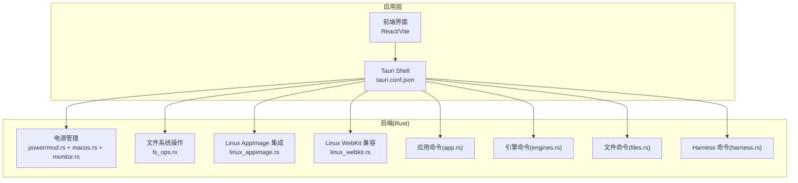
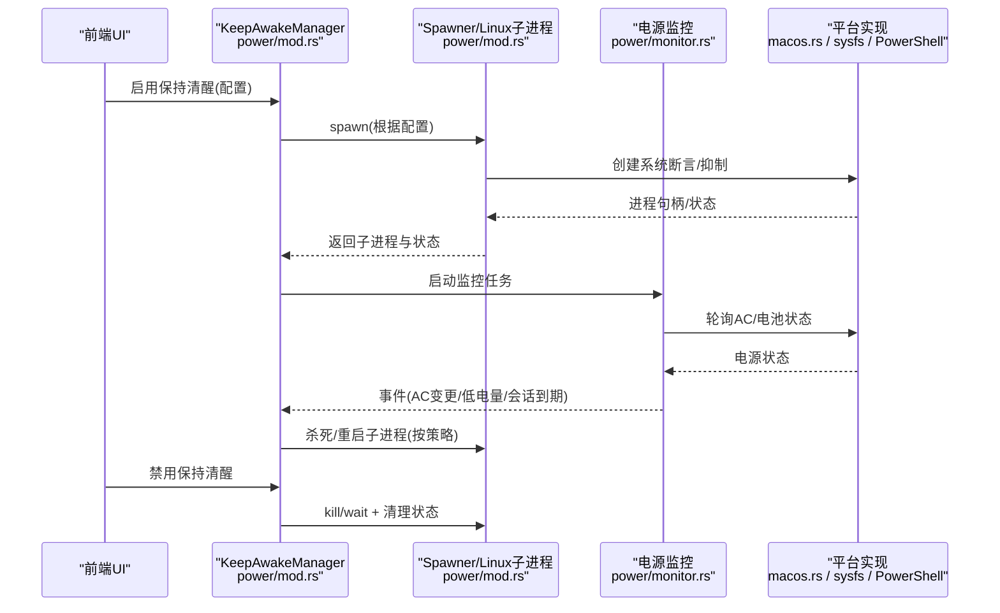
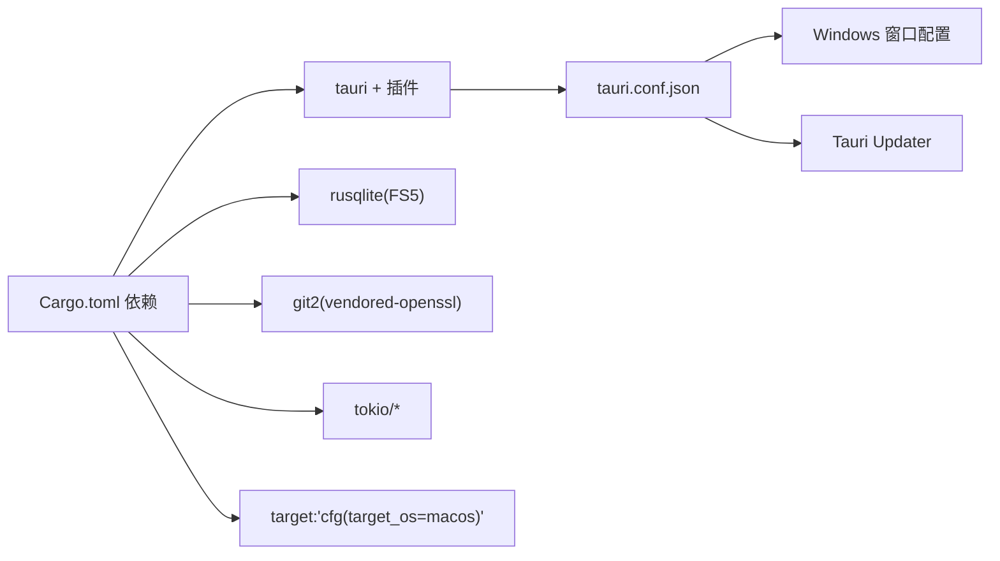

# 平台特定问题

<cite>
**本文档引用的文件**
- [README.md](file://README.md)
- [Cargo.toml](file://src-tauri/Cargo.toml)
- [tauri.conf.json](file://src-tauri/tauri.conf.json)
- [main.rs](file://src-tauri/src/main.rs)
- [mod.rs](file://src-tauri/src/power/mod.rs)
- [macos.rs](file://src-tauri/src/power/macos.rs)
- [monitor.rs](file://src-tauri/src/power/monitor.rs)
- [linux_appimage.rs](file://src-tauri/src/linux_appimage.rs)
- [linux_webkit.rs](file://src-tauri/src/linux_webkit.rs)
- [fs_ops.rs](file://src-tauri/src/fs_ops.rs)
- [app.rs](file://src-tauri/src/commands/app.rs)
- [engines.rs](file://src-tauri/src/commands/engines.rs)
- [files.rs](file://src-tauri/src/commands/files.rs)
- [harness.rs](file://src-tauri/src/commands/harness.rs)
</cite>

## 目录
1. [简介](#简介)
2. [项目结构](#项目结构)
3. [核心组件](#核心组件)
4. [架构总览](#架构总览)
5. [详细组件分析](#详细组件分析)
6. [依赖关系分析](#依赖关系分析)
7. [性能考虑](#性能考虑)
8. [故障排除指南](#故障排除指南)
9. [结论](#结论)

## 简介
本指南聚焦于 Panes 在 Windows、macOS 与 Linux 三大桌面平台上的平台特定问题与解决方案。内容覆盖权限与安全、文件系统访问、窗口管理、电源管理、Linux 发行版兼容性、以及安装与调试注意事项。目标是帮助用户与开发者在不同平台上稳定运行 Panes，并快速定位与解决问题。

## 项目结构
Panes 采用 Tauri v2 框架，前端使用 React/Vite，后端 Rust 提供原生能力（数据库、引擎、Git、终端、电源管理等）。平台差异主要体现在：
- 电源管理：macOS 使用 IOKit，Linux 通过 D-Bus/UPower 或 sysfs，Windows 通过 PowerShell 调用。
- 文件系统：统一的安全路径校验与路径穿越防护。
- Linux 集成：AppImage 桌面条目与图标管理；WebKit 显示兼容性工作流。
- 安装与分发：各平台包管理器或安装器，更新机制由 Tauri Updater 提供。

图示来源
- [tauri.conf.json:1-58](file://src-tauri/tauri.conf.json#L1-L58)
- [mod.rs:1-120](file://src-tauri/src/power/mod.rs#L1-L120)
- [linux_appimage.rs:1-120](file://src-tauri/src/linux_appimage.rs#L1-L120)
- [linux_webkit.rs:1-120](file://src-tauri/src/linux_webkit.rs#L1-L120)
- [fs_ops.rs:1-120](file://src-tauri/src/fs_ops.rs#L1-L120)
- [app.rs:1-120](file://src-tauri/src/commands/app.rs#L1-L120)
- [engines.rs:1-140](file://src-tauri/src/commands/engines.rs#L1-L140)
- [files.rs:300-340](file://src-tauri/src/commands/files.rs#L300-L340)
- [harness.rs:1-120](file://src-tauri/src/commands/harness.rs#L1-L120)

章节来源
- [README.md:236-256](file://README.md#L236-L256)
- [tauri.conf.json:1-58](file://src-tauri/tauri.conf.json#L1-L58)

## 核心组件
- 电源管理（Keep Awake）
  - 统一接口支持系统休眠抑制、显示器休眠抑制、屏保抑制、闭盖睡眠控制（macOS）。
  - Linux 通过 D-Bus 抑制挂起到 display inhibit 子进程；Windows 通过 PowerShell 查询电源状态。
  - 支持会话定时器、AC 仅模式、低电量阈值自动暂停/恢复。
- 文件系统安全
  - 严格的相对路径校验、路径穿越检测、大小限制与二进制检测。
  - 支持创建/删除/重命名/写入等操作，跨平台行为一致。
- Linux 集成
  - AppImage 桌面条目与图标自动安装/清理，避免与系统安装冲突。
  - WebKit 显示兼容性：Wayland/LD_PRELOAD、DMABUF 渲染器禁用、合成模式禁用等。
- 安装与更新
  - macOS：Homebrew Cask 为主，DMG 包含通用二进制。
  - Windows：NSIS 安装器，内置 Tauri Updater。
  - Linux：AppImage 与 .deb，AppImage 自更新替换包，deb 更新需管理员权限。

章节来源
- [mod.rs:1-200](file://src-tauri/src/power/mod.rs#L1-L200)
- [monitor.rs:1-142](file://src-tauri/src/power/monitor.rs#L1-L142)
- [linux_appimage.rs:1-140](file://src-tauri/src/linux_appimage.rs#L1-L140)
- [linux_webkit.rs:1-224](file://src-tauri/src/linux_webkit.rs#L1-L224)
- [fs_ops.rs:1-177](file://src-tauri/src/fs_ops.rs#L1-L177)
- [README.md:88-138](file://README.md#L88-L138)

## 架构总览
下图展示跨平台电源管理的关键流程：启用/禁用、监控事件、平台适配与辅助子进程。

图示来源
- [mod.rs:324-498](file://src-tauri/src/power/mod.rs#L324-L498)
- [monitor.rs:70-142](file://src-tauri/src/power/monitor.rs#L70-L142)
- [macos.rs:202-245](file://src-tauri/src/power/macos.rs#L202-L245)

章节来源
- [mod.rs:199-498](file://src-tauri/src/power/mod.rs#L199-L498)
- [monitor.rs:70-195](file://src-tauri/src/power/monitor.rs#L70-L195)

## 详细组件分析

### Windows 平台问题与解决方案
- 安装与启动
  - 使用 GitHub Releases 下载的安装程序进行安装；首次启动可能需要手动确认以绕过系统保护。
  - 升级通过 Tauri Updater 内置，无需重新下载安装包。
- 权限与安全
  - Panes 不进行签名与公证，因此系统保护仍会生效；建议使用安装器减少 Gatekeeper/SmartScreen 影响。
- 文件系统访问
  - 路径访问遵循统一的安全规则，避免路径穿越；大文件读取有上限。
- 电源管理
  - 通过 PowerShell 查询电源状态与电池百分比；不支持系统断言，使用轻量监控与会话计时。
- 已知限制
  - 文档指出 Codex 与 Claude 的端到端验证尚未完全覆盖，可能出现交互细节不稳定。

章节来源
- [README.md:112-117](file://README.md#L112-L117)
- [monitor.rs:332-379](file://src-tauri/src/power/monitor.rs#L332-L379)
- [files.rs:318-333](file://src-tauri/src/commands/files.rs#L318-L333)

### macOS 平台问题与解决方案
- 安装与启动
  - Homebrew Cask 为主要安装方式；DMG 包为通用二进制，支持 Apple Silicon 与 Intel。
  - 可能出现 Gatekeeper 弹窗，可通过命令行移除隔离属性后打开。
- 权限与安全
  - 使用 IOKit 创建“用户空闲”断言以阻止系统/显示器休眠；支持闭盖睡眠控制（通过内核设置与外设状态判断）。
- 文件系统访问
  - 严格路径校验与路径穿越防护；二进制文件检测避免加载。
- 电源管理
  - 通过 IOKit 断言与通知线程实现；支持 AC 仅模式、低电量阈值、会话定时器。
  - 闭盖睡眠诊断：读取 IORegistry 中的“睡眠禁用”标志与“笔记本盖板状态”，结合内核策略判断是否允许闭盖运行。
- 已知限制
  - 未签名/未公证，仍需用户确认；部分系统策略可能影响首次启动体验。

章节来源
- [README.md:88-108](file://README.md#L88-L108)
- [macos.rs:121-267](file://src-tauri/src/power/macos.rs#L121-L267)
- [macos.rs:404-494](file://src-tauri/src/power/macos.rs#L404-L494)
- [monitor.rs:223-283](file://src-tauri/src/power/monitor.rs#L223-L283)

### Linux 平台问题与解决方案
- 安装与启动
  - 支持 AppImage 与 .deb；AppImage 可直接执行，.deb 需管理员权限安装与更新。
  - AppImage 集成：自动写入桌面条目与图标，避免与系统安装冲突；可识别并清理受管条目。
- 权限与安全
  - 通过 D-Bus 抑制挂起与空闲（display inhibit），必要时以守护进程形式运行。
- 文件系统访问
  - 严格路径校验与路径穿越防护；二进制检测与大小限制。
- 电源管理
  - 通过 sysfs 轮询电源状态；支持 AC 仅模式、低电量阈值、会话定时器。
- Linux 发行版兼容性
  - Wayland 会话：自动检测并应用工作流，必要时通过 LD_PRELOAD 注入系统 libwayland-client，或禁用 DMABUF 渲染器与合成模式。
  - GNOME/COSMIC：针对特定桌面环境的兼容性调整。
- 已知限制
  - 某些发行版缺少系统库或桌面工具时，WebKit 可能出现空白窗口或 EGL 错误；可通过环境变量禁用相关渲染器或合成模式缓解。

章节来源
- [README.md:118-138](file://README.md#L118-L138)
- [linux_appimage.rs:94-139](file://src-tauri/src/linux_appimage.rs#L94-L139)
- [linux_appimage.rs:364-400](file://src-tauri/src/linux_appimage.rs#L364-L400)
- [linux_webkit.rs:54-92](file://src-tauri/src/linux_webkit.rs#L54-L92)
- [linux_webkit.rs:95-224](file://src-tauri/src/linux_webkit.rs#L95-L224)
- [monitor.rs:285-330](file://src-tauri/src/power/monitor.rs#L285-L330)

### 文件系统访问与安全
- 路径校验
  - 仅接受相对路径且包含至少一个普通组件；对目录遍历进行严格检查。
- 大小限制与二进制检测
  - 打开文件最大 10MB；前 8KB 检测 NUL 字节判定二进制。
- 操作类型
  - 列表目录、读取文件、创建/删除/重命名、写入文件；跨平台行为一致。
- 平台差异
  - 删除符号链接时，Windows 与非 Windows 分支分别处理目录/文件链接。

章节来源
- [fs_ops.rs:13-118](file://src-tauri/src/fs_ops.rs#L13-L118)
- [fs_ops.rs:199-228](file://src-tauri/src/fs_ops.rs#L199-L228)

### 窗口管理与显示
- 窗口配置
  - 固定标题栏样式与隐藏标题；最小尺寸与可调整属性；默认窗口尺寸。
- Linux 显示兼容
  - Wayland/LD_PRELOAD、DMABUF 渲染器禁用、合成模式禁用等策略，确保 WebKit 正常显示。

章节来源
- [tauri.conf.json:14-27](file://src-tauri/tauri.conf.json#L14-L27)
- [linux_webkit.rs:226-224](file://src-tauri/src/linux_webkit.rs#L226-L224)

### 安装注意事项与兼容性要求
- macOS
  - Homebrew Cask 为主；DMG 为通用二进制；可能需要手动确认首次启动。
- Windows
  - NSIS 安装器；内置 Tauri Updater；部分功能链路尚未完全验证。
- Linux
  - AppImage 与 .deb；AppImage 自更新；deb 需管理员权限；WebKit 可能需要兼容性调整。

章节来源
- [README.md:88-138](file://README.md#L88-L138)

## 依赖关系分析
- 平台条件编译
  - macOS 特定依赖（如 core-foundation）与实现；Linux 与 Windows 分支在命令与电源监控中体现。
- 插件与功能
  - Tauri 插件：shell、dialog、fs、notification、process、updater。
  - 数据库：SQLite + FTS5；Git：git2 + CLI 辅助。
- 运行时路径
  - macOS/Linux：~/.agent-workspace；Windows：%LOCALAPPDATA%\Panes。

图示来源
- [Cargo.toml:15-55](file://src-tauri/Cargo.toml#L15-L55)
- [tauri.conf.json:1-58](file://src-tauri/tauri.conf.json#L1-L58)

章节来源
- [Cargo.toml:15-55](file://src-tauri/Cargo.toml#L15-L55)
- [tauri.conf.json:1-58](file://src-tauri/tauri.conf.json#L1-L58)

## 性能考虑
- 电源监控轮询间隔为 10 秒，平衡 UI 展示与资源消耗。
- 文件读取带大小限制与二进制检测，避免大文件与二进制文件占用内存。
- Linux WebKit 兼容性调整仅在需要时启用，减少不必要的环境变更。

## 故障排除指南

### 通用排查步骤
- 查看日志
  - 日志目录按平台存储在应用数据目录中，便于定位异常。
- 电源管理
  - 检查启用状态与错误消息；确认 AC 仅模式与低电量阈值是否触发自动暂停/恢复。
- 文件系统
  - 确认路径为相对路径且未越权；注意 10MB 限制与二进制文件处理。

章节来源
- [README.md:216-226](file://README.md#L216-L226)
- [mod.rs:263-322](file://src-tauri/src/power/mod.rs#L263-L322)
- [fs_ops.rs:88-118](file://src-tauri/src/fs_ops.rs#L88-L118)

### Windows
- 启动被阻止
  - 使用安装器减少 SmartScreen/GPO 影响；若仍被阻止，参考 README 的手动解除隔离方法。
- 电源状态不可用
  - 通过 PowerShell 查询失败时，检查脚本执行策略与权限。

章节来源
- [README.md:112-117](file://README.md#L112-L117)
- [monitor.rs:332-379](file://src-tauri/src/power/monitor.rs#L332-L379)

### macOS
- 首次启动弹窗
  - 由于未签名/未公证，系统保护仍会提示；可通过 Finder 或命令行解除隔离后打开。
- 闭盖睡眠无效
  - 检查 IORegistry 中的“睡眠禁用”标志与“笔记本盖板状态”；确认内核策略允许闭盖运行。

章节来源
- [README.md:96-108](file://README.md#L96-L108)
- [macos.rs:180-193](file://src-tauri/src/power/macos.rs#L180-L193)

### Linux
- AppImage 桌面条目冲突
  - 若系统已有安装，受管条目会被清理；保留本地自定义条目不变。
- WebKit 显示异常
  - 在 Wayland 会话中启用 DMABUF 渲染器禁用与合成模式禁用；必要时注入系统 libwayland-client。
- 电源状态不可用
  - 检查 /sys/class/power_supply 是否存在；确认权限与内核模块可用。

章节来源
- [linux_appimage.rs:113-124](file://src-tauri/src/linux_appimage.rs#L113-L124)
- [linux_webkit.rs:95-224](file://src-tauri/src/linux_webkit.rs#L95-L224)
- [monitor.rs:285-330](file://src-tauri/src/power/monitor.rs#L285-L330)

### 平台特定命令与行为
- 应用命令
  - macOS 与非 macOS 分支在部分逻辑上存在差异（例如窗口/通知相关），请按平台查看对应实现。
- 引擎命令
  - Windows 与非 Windows 对某些引擎路径与行为存在分支处理。
- 文件命令
  - macOS/Windows/Linux 分支在文件操作细节上有所区别，注意平台差异。

章节来源
- [app.rs:1-120](file://src-tauri/src/commands/app.rs#L1-L120)
- [engines.rs:1-140](file://src-tauri/src/commands/engines.rs#L1-L140)
- [files.rs:318-333](file://src-tauri/src/commands/files.rs#L318-L333)

## 结论
Panes 在三大平台提供了统一的用户体验，同时针对平台特性进行了细致的适配与优化。通过严格的文件系统安全、跨平台电源管理、Linux 发行版兼容性工作流与清晰的安装指引，用户可在不同环境中稳定使用。遇到问题时，可依据本文档的故障排除步骤与平台特定建议快速定位并解决。