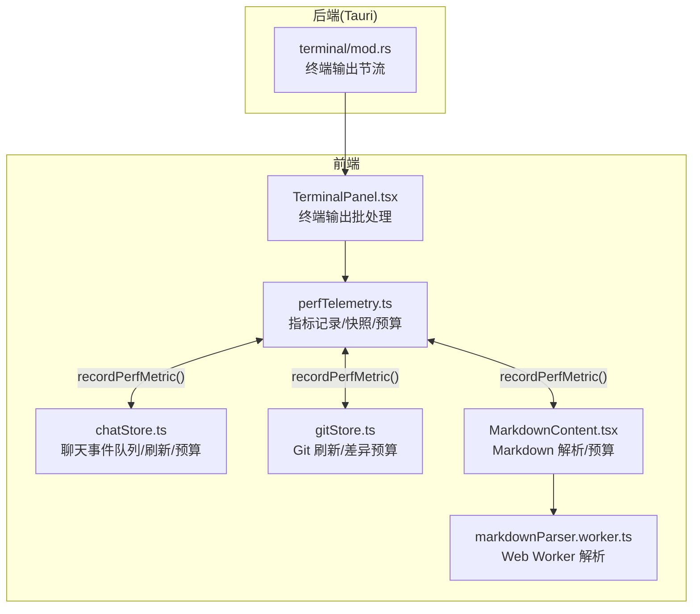
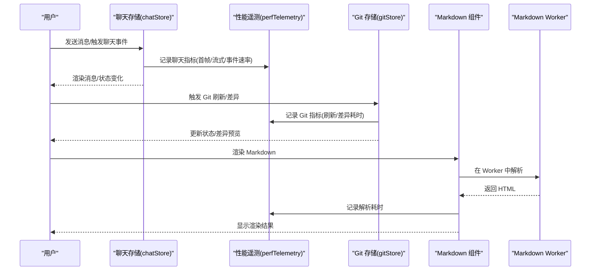
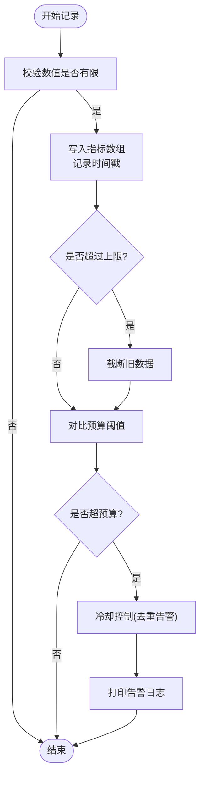
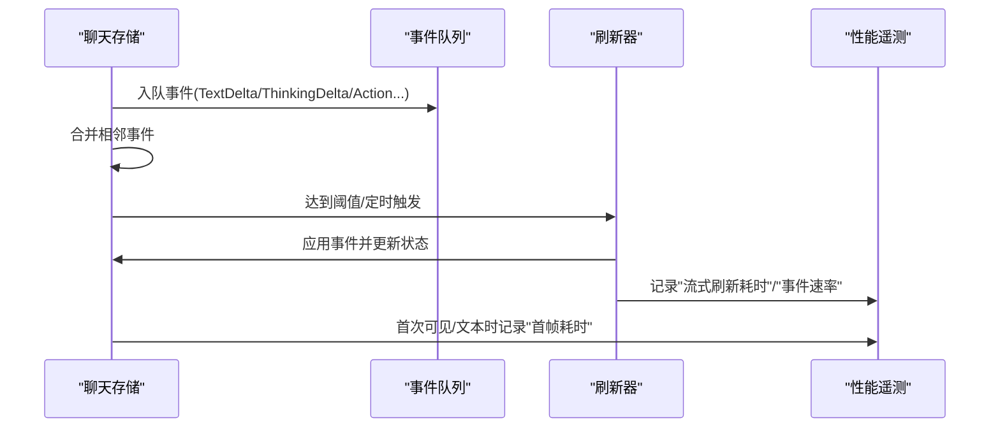
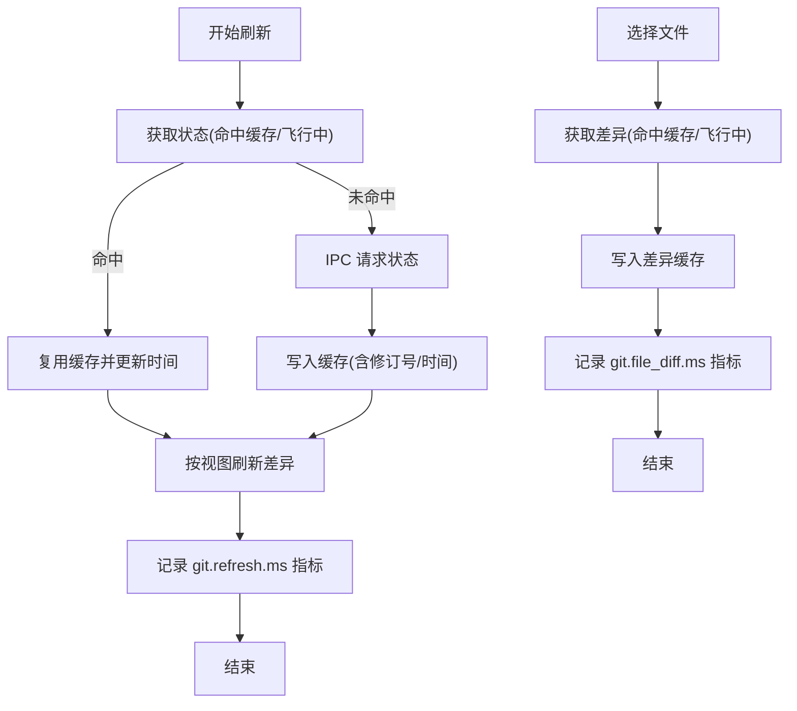
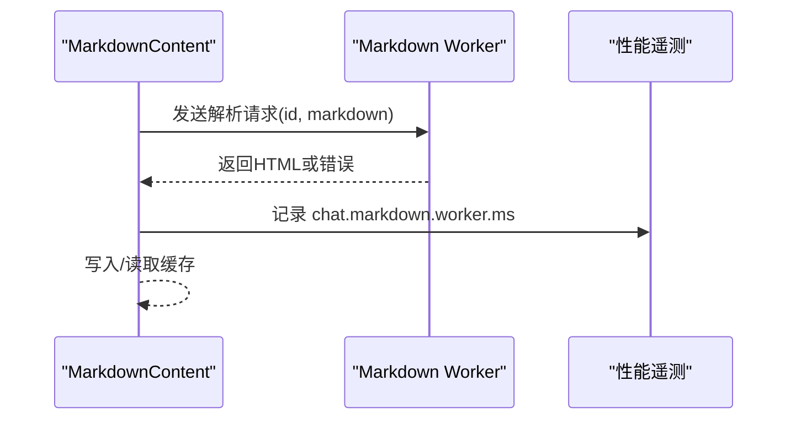
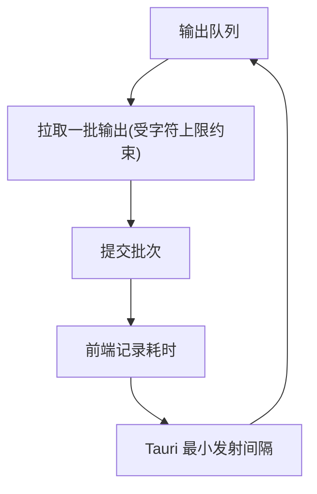
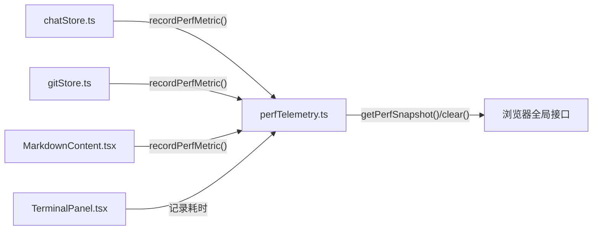

# 性能诊断

<cite>
**本文引用的文件**
- [perfTelemetry.ts](file://src/lib/perfTelemetry.ts)
- [chatStore.ts](file://src/stores/chatStore.ts)
- [gitStore.ts](file://src/stores/gitStore.ts)
- [MarkdownContent.tsx](file://src/components/chat/MarkdownContent.tsx)
- [markdownParser.worker.ts](file://src/workers/markdownParser.worker.ts)
- [markdownParser.types.ts](file://src/workers/markdownParser.types.ts)
- [TerminalPanel.tsx](file://src/components/terminal/TerminalPanel.tsx)
- [mod.rs](file://src-tauri/src/terminal/mod.rs)
</cite>

## 目录
1. [简介](#简介)
2. [项目结构](#项目结构)
3. [核心组件](#核心组件)
4. [架构总览](#架构总览)
5. [详细组件分析](#详细组件分析)
6. [依赖关系分析](#依赖关系分析)
7. [性能考量](#性能考量)
8. [故障排查指南](#故障排查指南)
9. [结论](#结论)
10. [附录](#附录)

## 简介
本指南面向 Panes 的性能诊断与优化，聚焦于内置性能监控体系的使用方法与最佳实践。内容涵盖：
- 性能指标记录：聊天响应时间、渲染延迟、Git 操作耗时等
- 性能预算检查：基于阈值的告警与冷却控制
- 性能快照分析：窗口化统计（均值、P95、最大值）
- 数据采集、存储与清理机制
- 基准测试与持续监控建议

## 项目结构
与性能诊断直接相关的模块分布如下：
- 性能遥测核心：src/lib/perfTelemetry.ts
- 聊天性能埋点：src/stores/chatStore.ts
- Git 性能埋点：src/stores/gitStore.ts
- Markdown 渲染性能：src/components/chat/MarkdownContent.tsx 及其 Web Worker
- 终端输出批处理：src/components/terminal/TerminalPanel.tsx
- Tauri 终端输出节流：src-tauri/src/terminal/mod.rs

图表来源
- [perfTelemetry.ts:1-146](file://src/lib/perfTelemetry.ts#L1-L146)
- [chatStore.ts:1532-1801](file://src/stores/chatStore.ts#L1532-L1801)
- [gitStore.ts:522-742](file://src/stores/gitStore.ts#L522-L742)
- [MarkdownContent.tsx:282-309](file://src/components/chat/MarkdownContent.tsx#L282-L309)
- [markdownParser.worker.ts:1-29](file://src/workers/markdownParser.worker.ts#L1-L29)
- [TerminalPanel.tsx:1384-1440](file://src/components/terminal/TerminalPanel.tsx#L1384-L1440)
- [mod.rs:662-694](file://src-tauri/src/terminal/mod.rs#L662-L694)

章节来源
- [perfTelemetry.ts:1-146](file://src/lib/perfTelemetry.ts#L1-L146)
- [chatStore.ts:1532-1801](file://src/stores/chatStore.ts#L1532-L1801)
- [gitStore.ts:522-742](file://src/stores/gitStore.ts#L522-L742)
- [MarkdownContent.tsx:282-309](file://src/components/chat/MarkdownContent.tsx#L282-L309)
- [markdownParser.worker.ts:1-29](file://src/workers/markdownParser.worker.ts#L1-L29)
- [TerminalPanel.tsx:1384-1440](file://src/components/terminal/TerminalPanel.tsx#L1384-L1440)
- [mod.rs:662-694](file://src-tauri/src/terminal/mod.rs#L662-L694)

## 核心组件
- 性能遥测库：统一记录指标、计算窗口快照、执行预算告警与冷却控制，并暴露浏览器全局接口用于调试。
- 聊天性能埋点：对“首次 Shell 提交”“首次可见内容”“首次文本”“流式刷新耗时”“事件速率”等进行记录。
- Git 性能埋点：对“仓库刷新耗时”“文件差异耗时”进行记录，并配合缓存 TTL 与容量限制。
- Markdown 渲染性能：在 Web Worker 中解析 Markdown 并记录耗时，同时进行缓存与错误处理。
- 终端输出批处理：批量拼接输出，降低主线程压力；Tauri 层设置最小发射间隔以避免过载。

章节来源
- [perfTelemetry.ts:1-146](file://src/lib/perfTelemetry.ts#L1-L146)
- [chatStore.ts:1532-1801](file://src/stores/chatStore.ts#L1532-L1801)
- [gitStore.ts:522-742](file://src/stores/gitStore.ts#L522-L742)
- [MarkdownContent.tsx:282-309](file://src/components/chat/MarkdownContent.tsx#L282-L309)
- [markdownParser.worker.ts:1-29](file://src/workers/markdownParser.worker.ts#L1-L29)
- [TerminalPanel.tsx:1384-1440](file://src/components/terminal/TerminalPanel.tsx#L1384-L1440)
- [mod.rs:662-694](file://src-tauri/src/terminal/mod.rs#L662-L694)

## 架构总览
下图展示从用户交互到性能指标记录的关键路径，以及与预算告警的关系。

图表来源
- [chatStore.ts:1532-1801](file://src/stores/chatStore.ts#L1532-L1801)
- [perfTelemetry.ts:55-87](file://src/lib/perfTelemetry.ts#L55-L87)
- [gitStore.ts:522-742](file://src/stores/gitStore.ts#L522-L742)
- [MarkdownContent.tsx:282-309](file://src/components/chat/MarkdownContent.tsx#L282-L309)
- [markdownParser.worker.ts:1-29](file://src/workers/markdownParser.worker.ts#L1-L29)

## 详细组件分析

### 性能遥测库（perfTelemetry）
- 指标类型：包含聊天与 Git 相关的多类指标名称，支持扩展。
- 记录逻辑：过滤非法值，追加时间戳，超过上限自动截断，触发预算告警（带冷却）。
- 快照统计：按窗口期过滤，分组统计计数、均值、P95、最大值。
- 清理机制：清空内存中的指标与告警时间映射。
- 调试接口：通过全局对象暴露获取快照、清空、查看最近指标的能力。

图表来源
- [perfTelemetry.ts:55-87](file://src/lib/perfTelemetry.ts#L55-L87)
- [perfTelemetry.ts:89-122](file://src/lib/perfTelemetry.ts#L89-L122)
- [perfTelemetry.ts:124-127](file://src/lib/perfTelemetry.ts#L124-L127)
- [perfTelemetry.ts:139-145](file://src/lib/perfTelemetry.ts#L139-L145)

章节来源
- [perfTelemetry.ts:1-146](file://src/lib/perfTelemetry.ts#L1-L146)

### 聊天性能埋点（chatStore）
- 首次指标：在可见内容/文本出现时记录“首次 Shell 提交”“首次可见内容”“首次文本”耗时。
- 流式刷新：批量合并事件，定时或阈值触发刷新，记录“流式刷新耗时”。
- 事件速率：每秒统计事件数量，记录“事件速率”。
- 合并与节流：对连续事件进行合并，减少重复渲染；通过定时器与阈值控制刷新节奏。

图表来源
- [chatStore.ts:1532-1801](file://src/stores/chatStore.ts#L1532-L1801)
- [chatStore.ts:1634-1779](file://src/stores/chatStore.ts#L1634-L1779)
- [chatStore.ts:1722-1725](file://src/stores/chatStore.ts#L1722-L1725)

章节来源
- [chatStore.ts:1532-1801](file://src/stores/chatStore.ts#L1532-L1801)

### Git 性能埋点（gitStore）
- 刷新耗时：记录一次完整刷新的耗时，并附带仓库路径、文件数、是否命中缓存等元信息。
- 差异耗时：记录单文件差异生成耗时，并附带截断标记、字节数等。
- 缓存策略：基于修订号、TTL 与容量限制的 LRU 风格淘汰，避免重复 IO。

图表来源
- [gitStore.ts:522-742](file://src/stores/gitStore.ts#L522-L742)

章节来源
- [gitStore.ts:522-742](file://src/stores/gitStore.ts#L522-L742)

### Markdown 渲染性能（MarkdownContent + Worker）
- 主线程职责：调度 Worker、缓存解析结果、错误处理与终止。
- Worker 职责：执行 Markdown 到 HTML 的转换。
- 指标记录：记录解析耗时，并附带字符数与是否命中缓存。

图表来源
- [MarkdownContent.tsx:282-309](file://src/components/chat/MarkdownContent.tsx#L282-L309)
- [markdownParser.worker.ts:1-29](file://src/workers/markdownParser.worker.ts#L1-L29)
- [markdownParser.types.ts:1-21](file://src/workers/markdownParser.types.ts#L1-L21)

章节来源
- [MarkdownContent.tsx:282-309](file://src/components/chat/MarkdownContent.tsx#L282-L309)
- [markdownParser.worker.ts:1-29](file://src/workers/markdownParser.worker.ts#L1-L29)
- [markdownParser.types.ts:1-21](file://src/workers/markdownParser.types.ts#L1-L21)

### 终端输出批处理与节流（TerminalPanel + Tauri）
- 前端批处理：按字符上限切分输出块，批量提交，降低主线程压力。
- 后端节流：设置最小发射间隔，避免短时间内大量输出导致 UI 卡顿。

图表来源
- [TerminalPanel.tsx:1384-1440](file://src/components/terminal/TerminalPanel.tsx#L1384-L1440)
- [mod.rs:662-694](file://src-tauri/src/terminal/mod.rs#L662-L694)

章节来源
- [TerminalPanel.tsx:1384-1440](file://src/components/terminal/TerminalPanel.tsx#L1384-L1440)
- [mod.rs:662-694](file://src-tauri/src/terminal/mod.rs#L662-L694)

## 依赖关系分析
- 指标来源：聊天、Git、Markdown、终端输出分别在各自模块内调用统一的记录函数。
- 预算与告警：统一由遥测库根据阈值与冷却策略触发。
- 快照聚合：按窗口期聚合统计，便于跨模块横向比较。

图表来源
- [perfTelemetry.ts:55-87](file://src/lib/perfTelemetry.ts#L55-L87)
- [chatStore.ts:1532-1801](file://src/stores/chatStore.ts#L1532-L1801)
- [gitStore.ts:522-742](file://src/stores/gitStore.ts#L522-L742)
- [MarkdownContent.tsx:282-309](file://src/components/chat/MarkdownContent.tsx#L282-L309)
- [TerminalPanel.tsx:1384-1440](file://src/components/terminal/TerminalPanel.tsx#L1384-L1440)
- [perfTelemetry.ts:139-145](file://src/lib/perfTelemetry.ts#L139-L145)

章节来源
- [perfTelemetry.ts:1-146](file://src/lib/perfTelemetry.ts#L1-L146)

## 性能考量
- 指标含义与正常范围
  - chat.turn.first_shell.ms：首次 Shell 提交耗时，预算约 48ms
  - chat.turn.first_content.ms：首次可见内容耗时，预算约 1400ms
  - chat.turn.first_text.ms：首次文本耗时，预算约 1800ms
  - chat.stream.flush.ms：流式刷新耗时，预算约 12ms
  - chat.stream.events_per_sec：事件速率，预算约 450 events/s
  - chat.render.commit.ms：渲染提交耗时（由聊天侧记录）
  - chat.markdown.worker.ms：Markdown 解析耗时，预算约 28ms
  - git.refresh.ms：Git 仓库刷新耗时，预算约 350ms
  - git.file_diff.ms：单文件差异耗时，预算约 250ms
- 数据窗口与统计
  - 默认快照窗口 60 秒，统计计数、均值、P95、最大值
  - 仅统计窗口内的指标，便于定位瞬时峰值与尾部延迟
- 存储与清理
  - 最大保留 4000 条指标，超过则截断旧数据
  - 提供清空接口，便于在长会话中回收内存
- 告警与冷却
  - 超预算触发告警，冷却时间为 8 秒，避免频繁重复告警
- 优化建议
  - 聊天：合并事件、合理设置刷新阈值与窗口；关注事件速率异常
  - Git：利用缓存 TTL 与容量限制，避免频繁刷新；对大仓库启用增量刷新
  - Markdown：复用 Worker 与缓存，避免重复解析；注意错误处理与 Worker 终止
  - 终端：前端批处理与后端最小发射间隔协同，避免 UI 抖动

章节来源
- [perfTelemetry.ts:28-38](file://src/lib/perfTelemetry.ts#L28-L38)
- [perfTelemetry.ts:89-122](file://src/lib/perfTelemetry.ts#L89-L122)
- [perfTelemetry.ts:124-127](file://src/lib/perfTelemetry.ts#L124-L127)
- [chatStore.ts:1634-1779](file://src/stores/chatStore.ts#L1634-L1779)
- [gitStore.ts:522-742](file://src/stores/gitStore.ts#L522-L742)
- [MarkdownContent.tsx:282-309](file://src/components/chat/MarkdownContent.tsx#L282-L309)
- [TerminalPanel.tsx:1384-1440](file://src/components/terminal/TerminalPanel.tsx#L1384-L1440)
- [mod.rs:662-694](file://src-tauri/src/terminal/mod.rs#L662-L694)

## 故障排查指南
- 如何使用内置工具
  - 打开浏览器控制台，访问全局对象以获取快照、清空与最近指标
    - 获取快照：调用 `window.__panesPerf.getSnapshot(windowMs?)`
    - 清空指标：调用 `window.__panesPerf.clear()`
    - 查看最近指标：调用 `window.__panesPerf.recent()`
- 识别性能问题
  - 关注 P95 与最大值：若 P95 明显高于均值，可能存在尾部延迟
  - 结合预算阈值：超预算告警可快速定位异常模块
  - 聚焦窗口期：使用不同窗口期对比，判断是否为瞬时波动
- 根因分析
  - 聊天：高事件速率可能源于高频细粒度事件；刷新耗时高可能与合并策略或渲染复杂度有关
  - Git：刷新耗时高可能与文件数过多、缓存未命中或 IPC 开销有关
  - Markdown：解析耗时高可能与内容过大、未命中缓存或 Worker 异常有关
  - 终端：输出抖动可能与前端批处理阈值或后端最小发射间隔设置不当有关
- 优化建议
  - 调整事件合并阈值与刷新窗口，平衡实时性与性能
  - 优化缓存策略（TTL、容量、淘汰策略）
  - 对长内容采用懒渲染或分页加载
  - 在 Worker 失败时降级回主线程解析，并记录错误
  - 后端最小发射间隔与前端批处理参数协同调整

章节来源
- [perfTelemetry.ts:139-145](file://src/lib/perfTelemetry.ts#L139-L145)
- [chatStore.ts:1634-1779](file://src/stores/chatStore.ts#L1634-L1779)
- [gitStore.ts:522-742](file://src/stores/gitStore.ts#L522-L742)
- [MarkdownContent.tsx:282-309](file://src/components/chat/MarkdownContent.tsx#L282-L309)
- [TerminalPanel.tsx:1384-1440](file://src/components/terminal/TerminalPanel.tsx#L1384-L1440)
- [mod.rs:662-694](file://src-tauri/src/terminal/mod.rs#L662-L694)

## 结论
通过统一的性能遥测库与多模块埋点，Panes 能够系统地观测聊天、Git、渲染与终端等关键路径的性能表现。结合预算阈值、窗口化快照与冷却告警，可以快速定位异常并指导优化。建议在日常开发与回归测试中持续采集与对比快照，形成稳定的性能基线。

## 附录
- 快照字段说明
  - count：窗口期内指标条数
  - avg：平均值
  - p95：第 95 分位
  - max：最大值
- 全局接口
  - `window.__panesPerf.getSnapshot(windowMs?)`：获取指定窗口期快照
  - `window.__panesPerf.clear()`：清空指标
  - `window.__panesPerf.recent()`：返回最近指标列表

章节来源
- [perfTelemetry.ts:89-122](file://src/lib/perfTelemetry.ts#L89-L122)
- [perfTelemetry.ts:139-145](file://src/lib/perfTelemetry.ts#L139-L145)