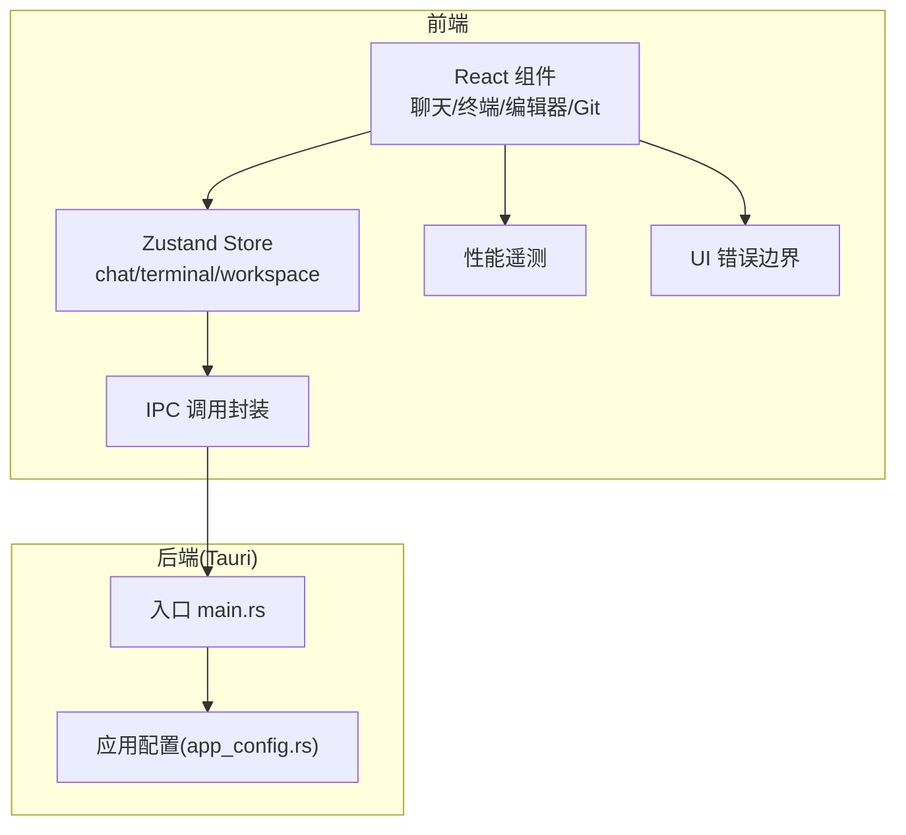
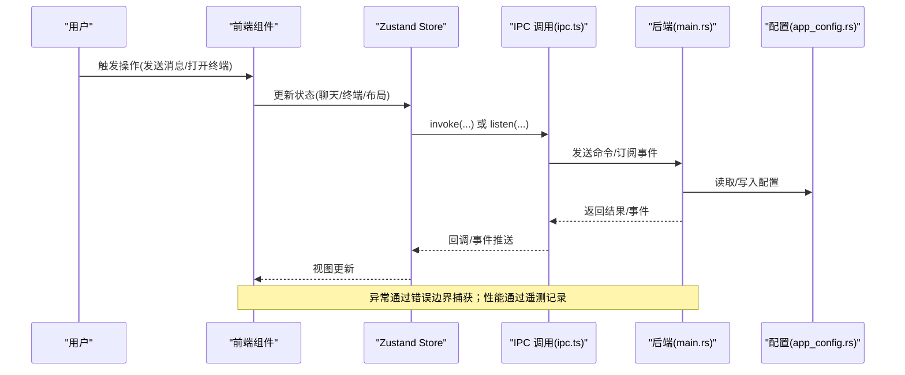
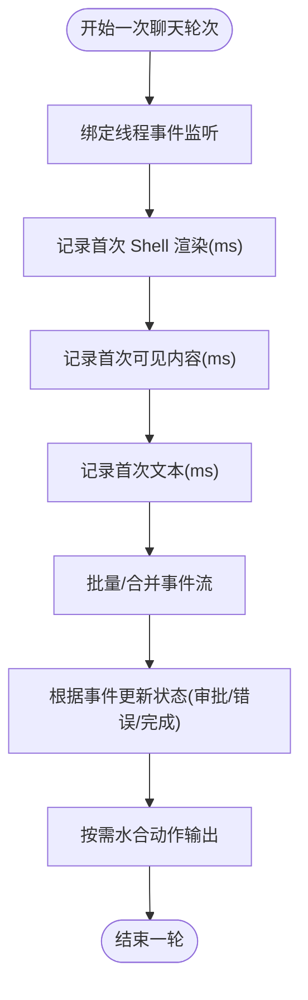
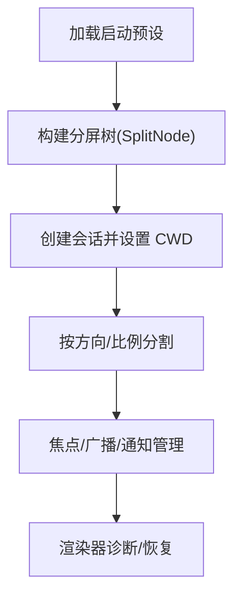
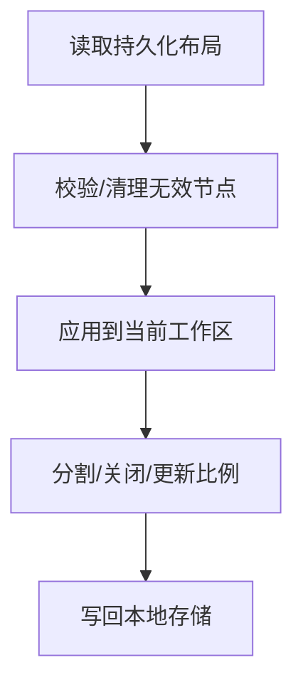
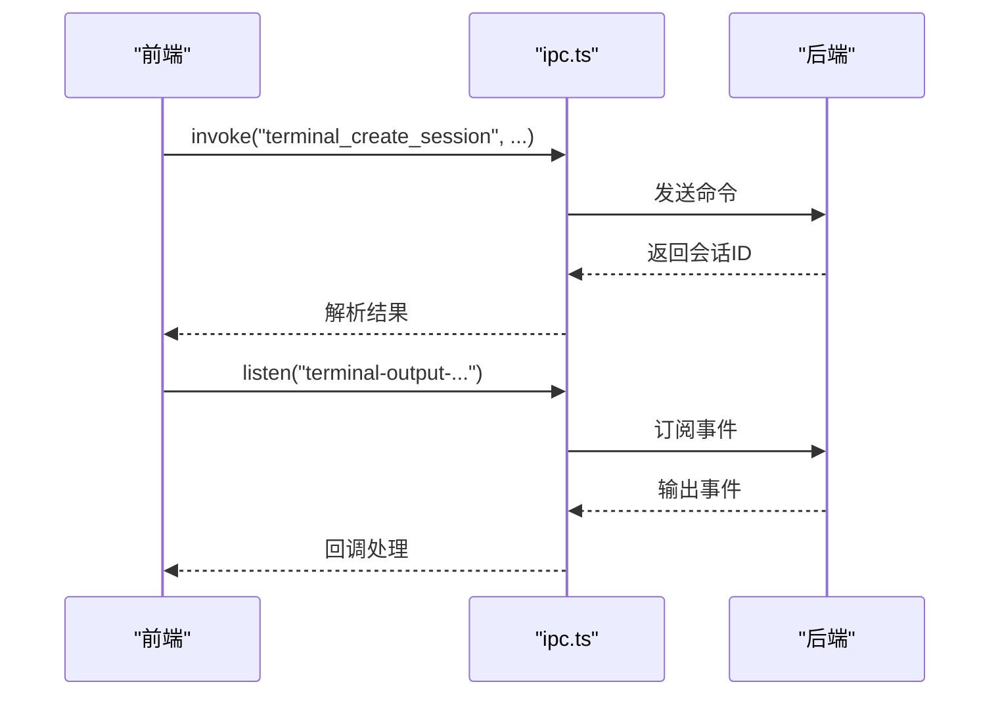
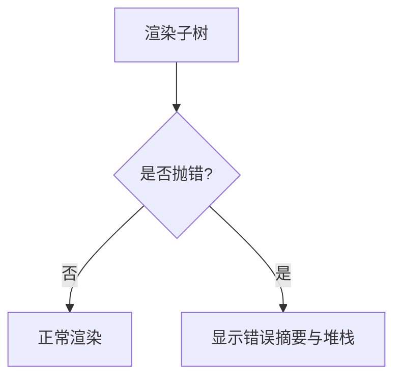
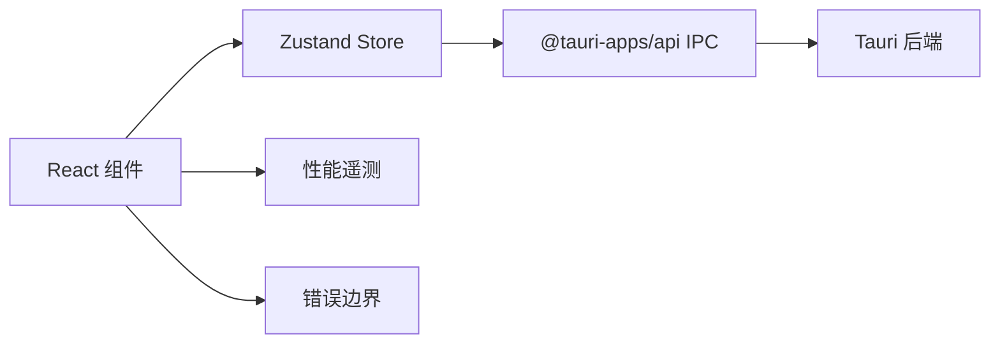

# 故障排除

<cite>
**本文引用的文件**
- [README.md](file://README.md)
- [AppErrorBoundary.tsx](file://src/components/shared/AppErrorBoundary.tsx)
- [perfTelemetry.ts](file://src/lib/perfTelemetry.ts)
- [workspacePaneStore.ts](file://src/stores/workspacePaneStore.ts)
- [chatStore.ts](file://src/stores/chatStore.ts)
- [terminalStore.ts](file://src/stores/terminalStore.ts)
- [ipc.ts](file://src/lib/ipc.ts)
- [main.rs](file://src-tauri/src/main.rs)
- [app_config.rs](file://src-tauri/src/config/app_config.rs)
- [TerminalPanel.tsx](file://src/components/terminal/TerminalPanel.tsx)
- [MarkdownContent.tsx](file://src/components/chat/MarkdownContent.tsx)
</cite>

## 目录
1. [简介](#简介)
2. [项目结构](#项目结构)
3. [核心组件](#核心组件)
4. [架构总览](#架构总览)
5. [详细组件分析](#详细组件分析)
6. [依赖关系分析](#依赖关系分析)
7. [性能注意事项](#性能注意事项)
8. [故障排除指南](#故障排除指南)
9. [结论](#结论)
10. [附录](#附录)

## 简介
本指南面向 Panes 用户与维护者，聚焦“面板（Panes）”在聊天、终端、编辑器与 Git 工作流中的常见问题定位与修复。内容覆盖性能问题诊断、崩溃分析、日志与遥测、系统兼容性差异、调试工具与监控技巧，并提供跨平台（macOS/Linux/Windows）的针对性建议，帮助用户快速自助解决问题。

## 项目结构
Panes 采用前端 React + Zustand + Tauri 的桌面应用架构：前端负责 UI 与交互，后端（Rust）负责引擎编排、持久化、Git 操作、终端管理与文件系统安全访问。关键模块包括：
- 前端状态层：Zustand stores（聊天、终端、工作区布局等）
- 通信层：IPC 封装（invoke/listen）
- 性能遥测：前端性能指标采集与阈值告警
- 错误边界：UI 崩溃兜底展示
- 平台配置：应用配置与调试开关

图表来源
- [main.rs:1-14](file://src-tauri/src/main.rs#L1-L14)
- [app_config.rs:85-127](file://src-tauri/src/config/app_config.rs#L85-L127)
- [ipc.ts:72-627](file://src/lib/ipc.ts#L72-L627)
- [perfTelemetry.ts:1-146](file://src/lib/perfTelemetry.ts#L1-L146)
- [AppErrorBoundary.tsx:1-51](file://src/components/shared/AppErrorBoundary.tsx#L1-L51)

章节来源
- [README.md:236-256](file://README.md#L236-L256)

## 核心组件
- 性能遥测与预算告警：记录关键指标并按预算阈值发出控制台警告，便于定位卡顿与渲染瓶颈。
- 聊天状态与事件流：统一处理流式事件、首次可见内容延迟、文本首帧延迟等关键时延指标。
- 终端状态与分屏树：管理会话、分组、布局树与通知，支持启动预设与工作树。
- 工作区面板布局：多叶面板与分割容器的增删改查、激活与比例调整。
- IPC 通道：前后端通信桥，包含线程事件监听、终端输出/退出/焦点变更等。
- UI 错误边界：捕获前端异常并在页面上呈现可读的错误摘要与堆栈。

章节来源
- [perfTelemetry.ts:1-146](file://src/lib/perfTelemetry.ts#L1-L146)
- [chatStore.ts:1-2183](file://src/stores/chatStore.ts#L1-L2183)
- [terminalStore.ts:1-2049](file://src/stores/terminalStore.ts#L1-L2049)
- [workspacePaneStore.ts:1-693](file://src/stores/workspacePaneStore.ts#L1-L693)
- [ipc.ts:629-792](file://src/lib/ipc.ts#L629-L792)
- [AppErrorBoundary.tsx:1-51](file://src/components/shared/AppErrorBoundary.tsx#L1-L51)

## 架构总览
下图展示了从用户操作到后端执行的关键路径，以及错误与性能观测点：

图表来源
- [ipc.ts:72-627](file://src/lib/ipc.ts#L72-L627)
- [main.rs:1-14](file://src-tauri/src/main.rs#L1-L14)
- [app_config.rs:85-127](file://src-tauri/src/config/app_config.rs#L85-L127)

## 详细组件分析

### 聊天与流式事件处理
- 首帧延迟指标：首次 Shell 渲染、首次可见内容、首次文本输出均被记录，用于评估端到端响应时间。
- 事件合并：对连续的文本/思考/动作输出进行合并，减少重绘压力。
- 背景监听：切换页面时保持流式事件监听，避免丢失数据。
- 审批与错误状态：根据事件类型转换为等待审批、错误或完成状态。

图表来源
- [chatStore.ts:157-229](file://src/stores/chatStore.ts#L157-L229)
- [perfTelemetry.ts:55-87](file://src/lib/perfTelemetry.ts#L55-L87)

章节来源
- [chatStore.ts:1-2183](file://src/stores/chatStore.ts#L1-L2183)
- [perfTelemetry.ts:1-146](file://src/lib/perfTelemetry.ts#L1-L146)

### 终端面板与分屏树
- 分屏树构建：支持 1~3 个会话垂直列，4+ 会话水平分两行，每行再垂直列。
- 会话生命周期：创建、关闭、分屏、比例调整、焦点同步。
- 启动预设：从工作区启动预设序列化/反序列化，支持工作树分支与目录。
- 通知与诊断：按会话聚合通知，支持渲染器诊断与会话恢复。

图表来源
- [terminalStore.ts:41-114](file://src/stores/terminalStore.ts#L41-L114)
- [terminalStore.ts:548-750](file://src/stores/terminalStore.ts#L548-L750)

章节来源
- [terminalStore.ts:1-2049](file://src/stores/terminalStore.ts#L1-L2049)

### 工作区面板布局
- 叶子与分割节点：支持水平/垂直分割、比例调整、空叶子裁剪。
- 表面类型：聊天/终端/编辑器三类表面的增删与激活。
- 持久化：基于本地存储的布局序列化/反序列化与回退策略。

图表来源
- [workspacePaneStore.ts:372-399](file://src/stores/workspacePaneStore.ts#L372-L399)
- [workspacePaneStore.ts:474-483](file://src/stores/workspacePaneStore.ts#L474-L483)

章节来源
- [workspacePaneStore.ts:1-693](file://src/stores/workspacePaneStore.ts#L1-L693)

### IPC 与事件监听
- invoke 调用：封装后端命令（聊天、Git、终端、工作区等），返回 Promise。
- 事件监听：线程更新、终端输出/退出/焦点变化、安装进度等。
- 新建会话写命令：等待终端输出就绪后再写入命令，避免无输出导致的失败。

图表来源
- [ipc.ts:547-574](file://src/lib/ipc.ts#L547-L574)
- [ipc.ts:688-742](file://src/lib/ipc.ts#L688-L742)

章节来源
- [ipc.ts:629-792](file://src/lib/ipc.ts#L629-L792)

### UI 错误边界
- 捕获子树异常，保留堆栈信息，便于用户反馈与自检。
- 在开发模式下同时输出到终端。

图表来源
- [AppErrorBoundary.tsx:12-25](file://src/components/shared/AppErrorBoundary.tsx#L12-L25)

章节来源
- [AppErrorBoundary.tsx:1-51](file://src/components/shared/AppErrorBoundary.tsx#L1-L51)

## 依赖关系分析
- 前端依赖：React、Zustand、@tauri-apps/api、xterm.js、diff2html、highlight.js、micromark 等。
- 后端依赖：Tauri 运行时、SQLite、git2、portable-pty 等。
- 关键耦合点：IPC 是前后端唯一通信通道；性能遥测贯穿 UI 渲染与聊天流式处理；错误边界保障 UI 稳定性。

图表来源
- [ipc.ts:1-3](file://src/lib/ipc.ts#L1-L3)
- [perfTelemetry.ts:1-146](file://src/lib/perfTelemetry.ts#L1-L146)
- [AppErrorBoundary.tsx:1-51](file://src/components/shared/AppErrorBoundary.tsx#L1-L51)

## 性能注意事项
- 指标与预算
  - 聊天轮次首帧：shell 渲染、可见内容、文本首帧
  - 流式刷新与事件速率
  - Markdown 渲染与提交
  - Git 刷新与 diff
- 告警机制：超过预算且冷却时间已过，控制台输出带元信息的警告
- 监控入口：全局窗口对象提供快照、清空、最近记录查询

章节来源
- [perfTelemetry.ts:28-38](file://src/lib/perfTelemetry.ts#L28-L38)
- [perfTelemetry.ts:89-122](file://src/lib/perfTelemetry.ts#L89-L122)
- [perfTelemetry.ts:139-145](file://src/lib/perfTelemetry.ts#L139-L145)

## 故障排除指南

### 一、性能问题诊断
- 症状识别
  - 聊天消息出现明显延迟，首次文本/内容耗时异常
  - Markdown 渲染卡顿或长时间无响应
  - Git 面板刷新缓慢或 diff 计算超时
- 诊断步骤
  1) 打开浏览器开发者工具，查看控制台是否有性能预算告警
  2) 在全局窗口对象中获取最近窗口的性能快照，确认是否存在异常峰值
  3) 对比不同场景下的指标（如大消息 vs 小消息、长列表 vs 短列表）
- 修复建议
  - 减少一次性渲染的大块内容，利用懒加载与分页
  - 降低 Markdown 处理复杂度，必要时启用 Web Worker
  - 优化 Git 扫描深度与缓存策略，避免频繁全量刷新

章节来源
- [perfTelemetry.ts:55-87](file://src/lib/perfTelemetry.ts#L55-L87)
- [perfTelemetry.ts:89-122](file://src/lib/perfTelemetry.ts#L89-L122)
- [MarkdownContent.tsx:96-130](file://src/components/chat/MarkdownContent.tsx#L96-L130)

### 二、崩溃与异常
- 症状识别
  - 页面局部空白或报错弹窗
  - 控制台出现 UI 崩溃日志
- 诊断步骤
  1) 检查错误边界是否捕获到异常并显示堆栈
  2) 开发模式下观察终端输出的错误信息
  3) 复现最小步骤并截图/复制错误摘要
- 修复建议
  - 避免在渲染函数中执行昂贵计算
  - 使用错误边界包裹不稳定子树
  - 提升依赖版本，关注上游库的已知问题

章节来源
- [AppErrorBoundary.tsx:18-25](file://src/components/shared/AppErrorBoundary.tsx#L18-L25)

### 三、聊天功能异常
- 症状识别
  - 发送消息后无响应或长时间无内容
  - 首次可见内容延迟过高
  - 出现审批请求但无法继续
- 诊断步骤
  1) 查看聊天状态机是否停留在“流式中/等待审批/错误”
  2) 检查性能遥测中“首次可见内容/文本”的指标
  3) 确认线程事件监听是否仍在运行（后台切换仍应保持）
- 修复建议
  - 适当降低附件/动作输出大小
  - 检查网络与代理设置
  - 重启相关引擎或清理会话缓存

章节来源
- [chatStore.ts:114-155](file://src/stores/chatStore.ts#L114-L155)
- [chatStore.ts:157-229](file://src/stores/chatStore.ts#L157-L229)

### 四、终端问题
- 症状识别
  - 终端无输出或黑屏
  - 写入命令后无反应
  - 分屏布局错乱或比例异常
  - 通知不显示或重复
- 诊断步骤
  1) 检查终端输出事件监听是否生效
  2) 使用渲染器诊断功能查看 WebGL 支持与上下文丢失情况
  3) 校验会话树与分屏树的叶子/分割节点一致性
  4) 确认通知按会话聚合逻辑与焦点状态
- 修复建议
  1) 禁用/启用加速渲染选项，切换硬件加速
  2) 重建会话并重新设置 CWD
  3) 清理无效叶子，重置分割比例
  4) 检查工作树配置与分支前缀

章节来源
- [TerminalPanel.tsx:447-492](file://src/components/terminal/TerminalPanel.tsx#L447-L492)
- [terminalStore.ts:41-114](file://src/stores/terminalStore.ts#L41-L114)
- [ipc.ts:744-791](file://src/lib/ipc.ts#L744-L791)

### 五、工作区布局问题
- 症状识别
  - 面板无法关闭/分割
  - 激活表面后标签丢失
  - 比例调整无效或越界
- 诊断步骤
  1) 检查本地存储中的布局序列化是否有效
  2) 校验叶子节点的表面对应与活动标签
  3) 确认分割比例的边界处理
- 修复建议
  1) 清除本地存储中的布局键，回退默认布局
  2) 重新激活目标表面，确保同一类型仅保留一个标签
  3) 使用默认比例或手动修正至合法范围

章节来源
- [workspacePaneStore.ts:372-399](file://src/stores/workspacePaneStore.ts#L372-L399)
- [workspacePaneStore.ts:305-310](file://src/stores/workspacePaneStore.ts#L305-L310)

### 六、日志与遥测
- 日志位置
  - macOS/Linux: ~/.agent-workspace/logs
  - Windows: %LOCALAPPDATA%\Panes\logs
- 遥测入口
  - 全局窗口对象提供快照、清空、最近记录查询
- 使用建议
  - 在复现问题时开启/关闭加速渲染对比
  - 收集一次完整会话的性能快照，定位异常窗口

章节来源
- [README.md:216-226](file://README.md#L216-L226)
- [perfTelemetry.ts:139-145](file://src/lib/perfTelemetry.ts#L139-L145)

### 七、系统兼容性问题
- macOS
  - 应用未签名/公证，首次启动可能需要手动确认
  - 通知声音与电源设置存在平台差异
- Windows
  - 安装器/更新器/运行时兼容性已验证，但部分引擎（Codex/Claude）在聊天流程中可能存在边缘问题
- Linux
  - AppImage 与 DEB 包均可使用，更新方式略有差异

章节来源
- [README.md:88-138](file://README.md#L88-L138)
- [app_config.rs:85-127](file://src-tauri/src/config/app_config.rs#L85-L127)

### 八、调试工具与监控技巧
- 前端
  - 使用性能面板检查主线程占用与渲染耗时
  - 在全局窗口对象中导出最近性能记录，辅助分析
- 后端
  - 通过 IPC 检查依赖与运行时健康状况
  - 查看配置项（如调试开关、通知声音）是否符合预期

章节来源
- [perfTelemetry.ts:139-145](file://src/lib/perfTelemetry.ts#L139-L145)
- [ipc.ts:616-621](file://src/lib/ipc.ts#L616-L621)
- [app_config.rs:85-127](file://src-tauri/src/config/app_config.rs#L85-L127)

### 九、常见错误代码与症状对照
- 聊天轮次首帧超时
  - 症状：消息发送后长时间无内容
  - 可能原因：网络波动、引擎预热不足、渲染阻塞
- 终端无输出
  - 症状：命令执行后无回显
  - 可能原因：Shell 未就绪、事件未到达、加速渲染异常
- Git 面板卡顿
  - 症状：刷新缓慢、diff 计算耗时
  - 可能原因：仓库过大、扫描深度过高、缓存未命中

章节来源
- [perfTelemetry.ts:28-38](file://src/lib/perfTelemetry.ts#L28-L38)
- [TerminalPanel.tsx:447-492](file://src/components/terminal/TerminalPanel.tsx#L447-L492)
- [chatStore.ts:157-229](file://src/stores/chatStore.ts#L157-L229)

## 结论
通过结合前端性能遥测、错误边界、IPC 事件与后端配置，Panes 提供了较为完善的自诊断能力。建议用户在遇到问题时先收集性能快照与错误摘要，再按模块逐一排查，优先尝试回退默认配置与布局，最后再考虑升级依赖或调整系统环境。

## 附录
- 快速检查清单
  - 是否开启加速渲染？尝试切换后再测试
  - 本地存储布局是否损坏？清除对应键后重试
  - 终端输出事件是否持续触发？
  - 性能快照中是否存在异常峰值？