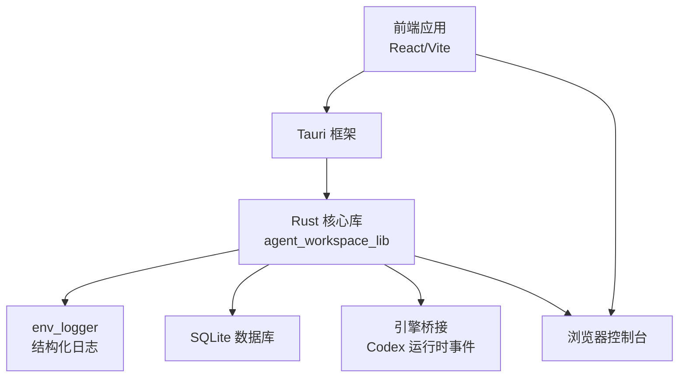
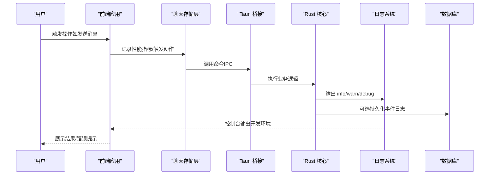
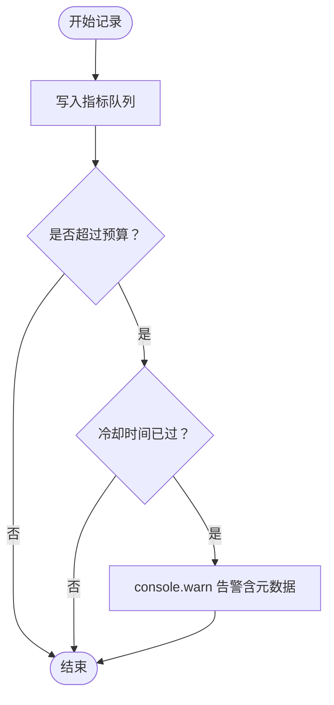
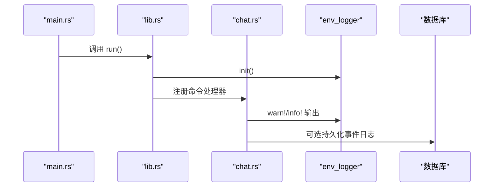
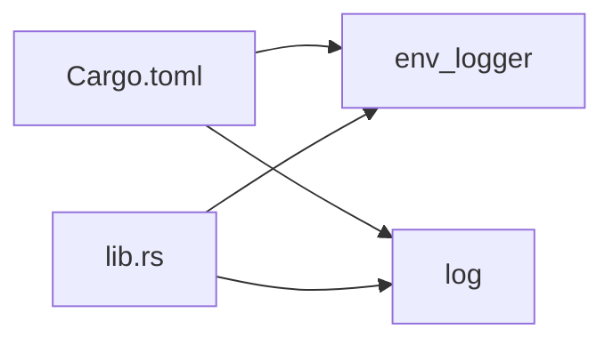

# 日志分析

<cite>
**本文引用的文件**
- [src/lib/perfTelemetry.ts](file://src/lib/perfTelemetry.ts)
- [src-tauri/src/lib.rs](file://src-tauri/src/lib.rs)
- [src-tauri/src/main.rs](file://src-tauri/src/main.rs)
- [src-tauri/Cargo.toml](file://src-tauri/Cargo.toml)
- [src-tauri/tauri.conf.json](file://src-tauri/tauri.conf.json)
- [src/components/shared/AppErrorBoundary.tsx](file://src/components/shared/AppErrorBoundary.tsx)
- [src/stores/chatStore.ts](file://src/stores/chatStore.ts)
- [src-tauri/src/commands/chat.rs](file://src-tauri/src/commands/chat.rs)
- [src/components/chat/CodexRuntimePicker.tsx](file://src/components/chat/CodexRuntimePicker.tsx)
- [src-tauri/src/engines/codex_event_mapper.rs](file://src-tauri/src/engines/codex_event_mapper.rs)
</cite>

## 目录
1. [简介](#简介)
2. [项目结构](#项目结构)
3. [核心组件](#核心组件)
4. [架构总览](#架构总览)
5. [详细组件分析](#详细组件分析)
6. [依赖关系分析](#依赖关系分析)
7. [性能与日志特性](#性能与日志特性)
8. [故障排查指南](#故障排查指南)
9. [结论](#结论)
10. [附录](#附录)

## 简介
本指南面向 Panes 的使用者与维护者，系统性讲解如何启用、查看与分析应用日志，覆盖前端控制台日志、后端 Rust 日志以及性能日志。文档同时解释日志级别（调试、信息、警告、错误）的含义与用途，并提供日志过滤、搜索与导出方法；最后给出关键事件解读、常见模式识别与自动化处理建议。

## 项目结构
Panes 采用前端（React/Vite）与后端（Tauri/Rust）分离架构。日志能力主要分布在：
- 前端：控制台输出、错误边界捕获、性能指标记录
- 后端：基于 env_logger 的结构化日志、数据库与引擎事件持久化
- 配置：Tauri 应用配置、Rust 依赖与构建配置

图表来源
- [src-tauri/src/lib.rs:48-51](file://src-tauri/src/lib.rs#L48-L51)
- [src-tauri/src/main.rs:1-14](file://src-tauri/src/main.rs#L1-L14)
- [src-tauri/Cargo.toml:15-46](file://src-tauri/Cargo.toml#L15-L46)

章节来源
- [src-tauri/src/lib.rs:48-51](file://src-tauri/src/lib.rs#L48-L51)
- [src-tauri/src/main.rs:1-14](file://src-tauri/src/main.rs#L1-L14)
- [src-tauri/Cargo.toml:15-46](file://src-tauri/Cargo.toml#L15-L46)
- [src-tauri/tauri.conf.json:1-58](file://src-tauri/tauri.conf.json#L1-L58)

## 核心组件
- 前端性能日志与指标
  - 性能指标记录器：记录聊天、渲染、Git 等关键路径耗时，超预算自动告警
  - 控制台输出：用于开发调试与问题定位
  - 错误边界：捕获前端运行时异常并输出到控制台
- 后端 Rust 日志
  - 初始化 env_logger，统一输出格式
  - 多处使用 log::warn!/log::info! 记录运行状态与错误
  - 可选持久化引擎事件日志至数据库
- 引擎诊断与可视化
  - 运行时诊断展示组件，呈现最近事件摘要
  - 事件映射器对复杂事件进行人类可读的汇总

章节来源
- [src/lib/perfTelemetry.ts:1-146](file://src/lib/perfTelemetry.ts#L1-L146)
- [src/components/shared/AppErrorBoundary.tsx:1-50](file://src/components/shared/AppErrorBoundary.tsx#L1-L50)
- [src-tauri/src/lib.rs:48-51](file://src-tauri/src/lib.rs#L48-L51)
- [src-tauri/src/commands/chat.rs:2769-2777](file://src-tauri/src/commands/chat.rs#L2769-L2777)
- [src/components/chat/CodexRuntimePicker.tsx:598-793](file://src/components/chat/CodexRuntimePicker.tsx#L598-L793)
- [src-tauri/src/engines/codex_event_mapper.rs:1155-1192](file://src-tauri/src/engines/codex_event_mapper.rs#L1155-L1192)

## 架构总览
下图展示了从前端到后端的日志通路与关键落点：

图表来源
- [src/stores/chatStore.ts:173-173](file://src/stores/chatStore.ts#L173-L173)
- [src-tauri/src/lib.rs:326-339](file://src-tauri/src/lib.rs#L326-L339)
- [src-tauri/src/commands/chat.rs:2769-2777](file://src-tauri/src/commands/chat.rs#L2769-L2777)

## 详细组件分析

### 前端性能日志与指标
- 指标类型与预算
  - 包含聊天首帧、流式刷新、渲染提交、Markdown Worker、Git 刷新/差异等
  - 每项指标有默认预算阈值，超过阈值会以 console.warn 输出并带元数据
- 快照与清理
  - 支持按时间窗口聚合统计（均值、P95、最大值、数量）
  - 提供全局清理接口，避免内存膨胀
- 开发期辅助
  - 在浏览器开发者工具中可直接访问全局对象获取快照或最近指标

图表来源
- [src/lib/perfTelemetry.ts:55-87](file://src/lib/perfTelemetry.ts#L55-L87)
- [src/lib/perfTelemetry.ts:89-122](file://src/lib/perfTelemetry.ts#L89-L122)

章节来源
- [src/lib/perfTelemetry.ts:1-146](file://src/lib/perfTelemetry.ts#L1-L146)

### 前端错误边界与控制台
- 错误边界
  - 捕获子树异常并在控制台输出“UI crash”日志，便于快速定位
- 控制台输出
  - 多处使用 console.warn 记录交互失败与回退行为，帮助理解降级路径

章节来源
- [src/components/shared/AppErrorBoundary.tsx:1-50](file://src/components/shared/AppErrorBoundary.tsx#L1-L50)
- [src/lib/windowActions.ts:65-77](file://src/lib/windowActions.ts#L65-L77)
- [src/lib/windowDrag.ts:12-12](file://src/lib/windowDrag.ts#L12-L12)

### 后端 Rust 日志初始化与使用
- 初始化
  - 应用启动时初始化 env_logger，确保日志可见
- 使用场景
  - 启动恢复、通知与平台集成、引擎桥接、关闭流程等关键节点输出 info/warn
  - 命令实现中广泛使用 warn/info 记录失败与状态变更
- 引擎事件持久化
  - 可选将引擎事件转为 JSON 并追加到数据库，便于后续审计与分析

图表来源
- [src-tauri/src/main.rs:1-14](file://src-tauri/src/main.rs#L1-L14)
- [src-tauri/src/lib.rs:48-51](file://src-tauri/src/lib.rs#L48-L51)
- [src-tauri/src/commands/chat.rs:2769-2777](file://src-tauri/src/commands/chat.rs#L2769-L2777)

章节来源
- [src-tauri/src/main.rs:1-14](file://src-tauri/src/main.rs#L1-L14)
- [src-tauri/src/lib.rs:48-51](file://src-tauri/src/lib.rs#L48-L51)
- [src-tauri/src/commands/chat.rs:504-504](file://src-tauri/src/commands/chat.rs#L504-L504)

### 引擎诊断与事件映射
- 诊断展示
  - 运行时诊断组件展示最近线程实时事件、Windows 权限扫描警告等
- 事件映射
  - 将复杂事件结构映射为人类可读文本，便于快速理解

章节来源
- [src/components/chat/CodexRuntimePicker.tsx:598-793](file://src/components/chat/CodexRuntimePicker.tsx#L598-L793)
- [src-tauri/src/engines/codex_event_mapper.rs:1155-1192](file://src-tauri/src/engines/codex_event_mapper.rs#L1155-L1192)

## 依赖关系分析
- Rust 日志栈
  - 依赖 env_logger 与 log 宏，通过 Cargo.toml 指定版本
- Tauri 配置
  - tauri.conf.json 中未设置 CSP，不影响日志输出；但需关注安全策略与资源目录

图表来源
- [src-tauri/Cargo.toml:45-46](file://src-tauri/Cargo.toml#L45-L46)
- [src-tauri/src/lib.rs:48-51](file://src-tauri/src/lib.rs#L48-L51)

章节来源
- [src-tauri/Cargo.toml:15-46](file://src-tauri/Cargo.toml#L15-L46)
- [src-tauri/tauri.conf.json:28-31](file://src-tauri/tauri.conf.json#L28-L31)

## 性能与日志特性
- 日志级别与用途
  - debug：开发期细粒度追踪（Rust 中部分 debug 输出）
  - info：正常运行状态与恢复信息（如启动恢复、平台集成状态）
  - warn：非致命问题、失败与降级路径（如窗口操作失败、通知启动失败）
  - error：未在代码中直接使用，但可通过 env_logger 输出
- 性能预算与告警
  - 超预算自动 console.warn，包含指标名、实际值与预算，便于快速定位瓶颈
  - 支持按时间窗口聚合快照，便于趋势分析

章节来源
- [src/lib/perfTelemetry.ts:28-38](file://src/lib/perfTelemetry.ts#L28-L38)
- [src/lib/perfTelemetry.ts:83-86](file://src/lib/perfTelemetry.ts#L83-L86)
- [src-tauri/src/lib.rs:57-66](file://src-tauri/src/lib.rs#L57-L66)

## 故障排查指南
- 如何启用与查看日志
  - 前端控制台：打开浏览器开发者工具，在 Console 中查看输出
  - 后端日志：在终端运行应用时，Rust 日志会直接打印；生产打包后可通过系统日志查看
  - 性能日志：在浏览器控制台访问全局对象，调用快照接口获取近期指标
- 常见日志模式与解读
  - “failed to ...”：表示某操作失败，通常伴随 warn；结合上下文命令与时间点定位
  - “runtime recovery applied”：启动恢复生效，可能影响消息状态
  - “codex runtime bridge lagged and skipped N events”：事件积压，可能影响实时性
  - “UI crash”：前端异常被捕获，检查堆栈与最近操作
- 日志过滤、搜索与导出
  - 浏览器控制台：支持按级别过滤与关键字搜索
  - Rust 日志：通过环境变量配置日志级别（例如 RUST_LOG=info/warn），结合日志重定向导出
  - 性能快照：通过全局接口导出近期指标，再上传或分享
- 自动化日志处理建议
  - 使用日志收集器（如 systemd/journald 或第三方工具）采集 Rust 日志
  - 对性能指标进行周期性聚合与告警（如 P95 超过阈值）
  - 将引擎事件持久化开启用于审计与回放

章节来源
- [src-tauri/src/lib.rs:57-66](file://src-tauri/src/lib.rs#L57-L66)
- [src-tauri/src/lib.rs:355-357](file://src-tauri/src/lib.rs#L355-L357)
- [src/components/shared/AppErrorBoundary.tsx:22-25](file://src/components/shared/AppErrorBoundary.tsx#L22-L25)
- [src/lib/perfTelemetry.ts:139-145](file://src/lib/perfTelemetry.ts#L139-L145)

## 结论
Panes 的日志体系由前端性能指标、错误边界与后端结构化日志构成，配合引擎事件持久化与诊断展示，能够有效支撑日常运维与问题定位。建议在开发与测试阶段充分利用控制台与性能快照，在生产环境中通过环境变量与日志收集器稳定输出并归档。

## 附录
- 关键日志事件速查
  - 启动恢复：info
  - 平台集成状态：info/warn
  - 引擎桥接事件积压：warn
  - 前端 UI 异常：UI crash
  - 命令执行失败：warn
- 建议的自动化方案
  - Rust 日志：RUST_LOG=warn+panes=info，重定向到文件或 syslog
  - 性能指标：定时抓取快照并上报监控系统
  - 引擎事件：开启持久化后定期备份数据库