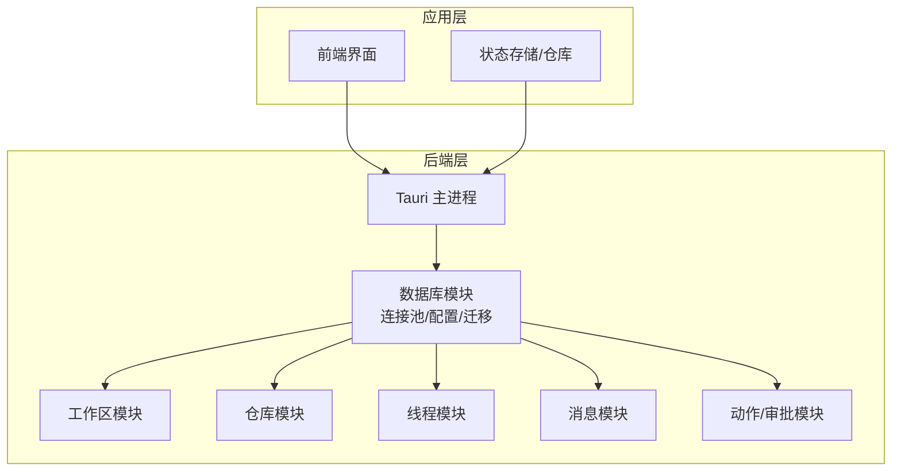
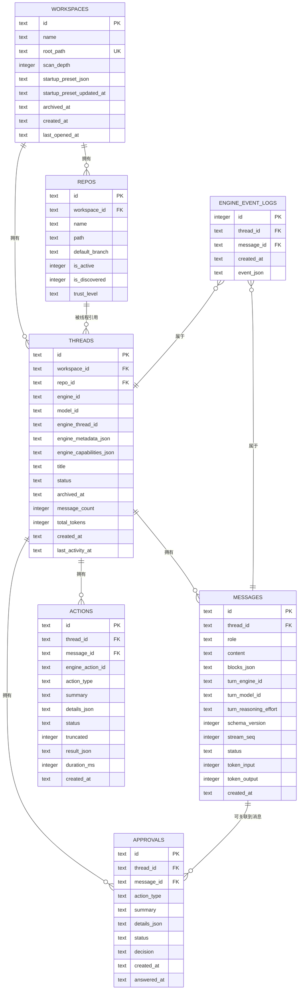
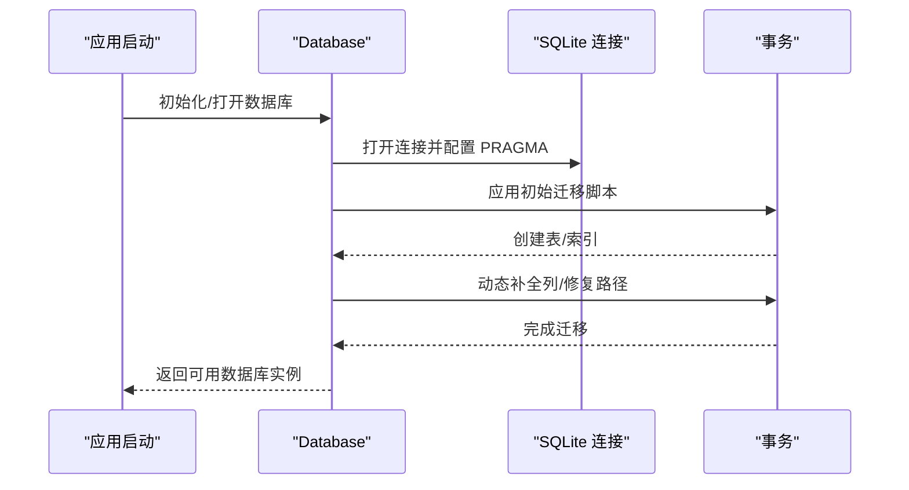
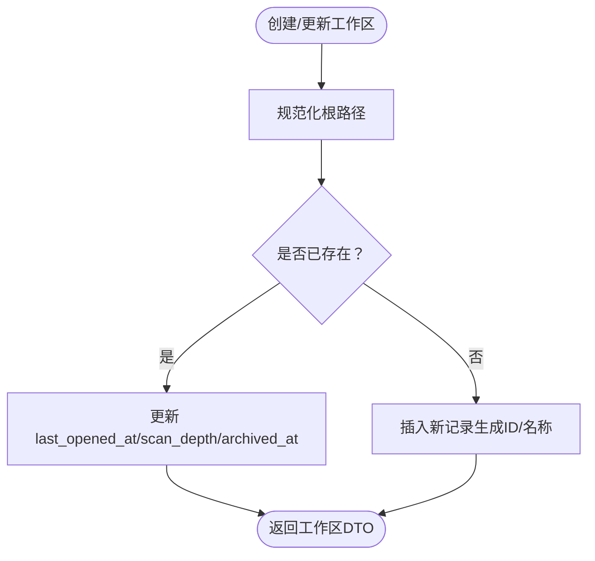
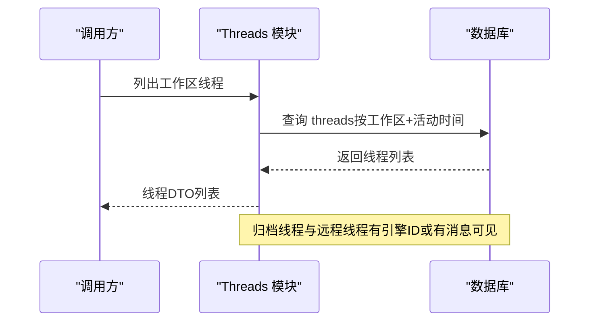
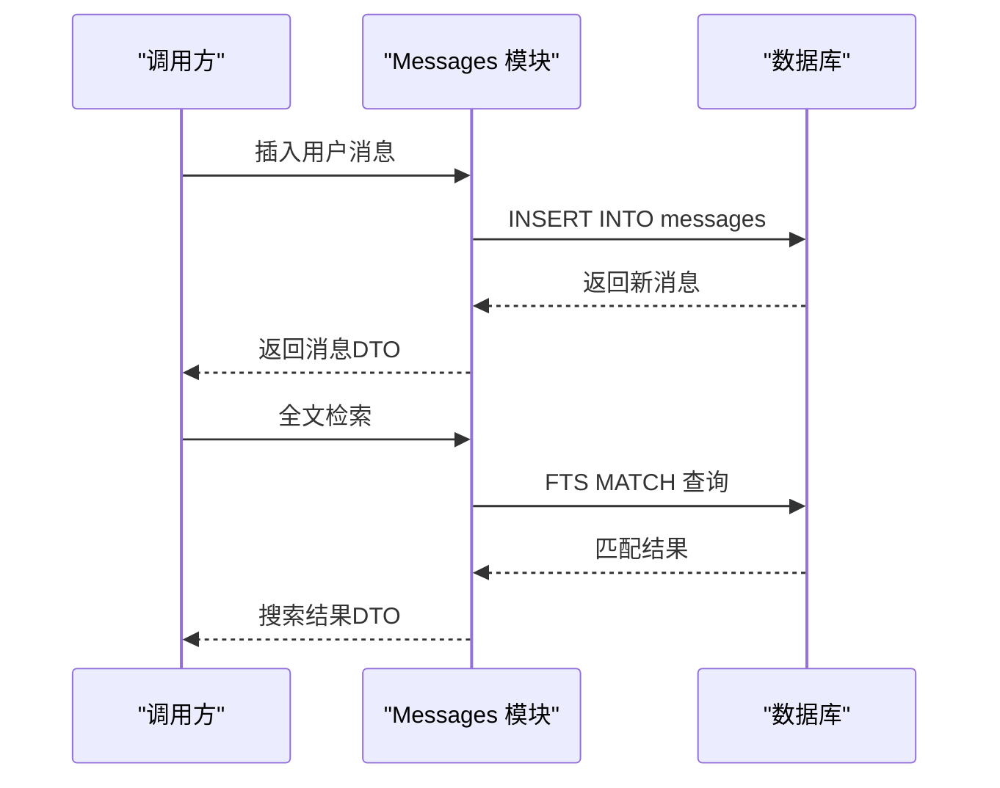
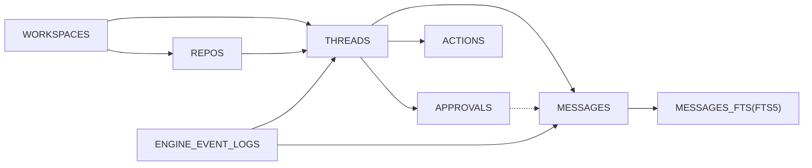

# 数据库设计

<cite>
**本文档引用的文件**
- [src-tauri/src/db/mod.rs](file://src-tauri/src/db/mod.rs)
- [src-tauri/src/db/migrations/001_initial.sql](file://src-tauri/src/db/migrations/001_initial.sql)
- [src-tauri/src/db/workspaces.rs](file://src-tauri/src/db/workspaces.rs)
- [src-tauri/src/db/repos.rs](file://src-tauri/src/db/repos.rs)
- [src-tauri/src/db/threads.rs](file://src-tauri/src/db/threads.rs)
- [src-tauri/src/db/messages.rs](file://src-tauri/src/db/messages.rs)
- [src-tauri/src/db/actions.rs](file://src-tauri/src/db/actions.rs)
- [src-tauri/src/models.rs](file://src-tauri/src/models.rs)
</cite>

## 目录
1. [简介](#简介)
2. [项目结构](#项目结构)
3. [核心组件](#核心组件)
4. [架构总览](#架构总览)
5. [详细组件分析](#详细组件分析)
6. [依赖关系分析](#依赖关系分析)
7. [性能考量](#性能考量)
8. [故障排查指南](#故障排查指南)
9. [结论](#结论)
10. [附录](#附录)

## 简介
本文件系统化阐述 Panes 的数据库设计与实现，涵盖 SQLite 集成、数据模型、迁移策略、查询优化、全文搜索（FTS5）、数据生命周期与安全等主题。重点围绕核心实体：Workspace、Thread、Message、Repo（仓库）、Approval/Action（审批与动作）、以及引擎事件日志，给出表结构、索引策略、约束条件、数据访问模式与缓存策略，并提供架构图与流程图帮助理解。

## 项目结构
数据库层采用 Rust + rusqlite + FTS5 的组合，通过迁移脚本初始化表结构与索引；业务逻辑封装在独立模块中，分别对应工作区、仓库、线程、消息、动作与审批等子域。

图表来源
- [src-tauri/src/db/mod.rs:74-135](file://src-tauri/src/db/mod.rs#L74-L135)
- [src-tauri/src/db/workspaces.rs:15-58](file://src-tauri/src/db/workspaces.rs#L15-L58)
- [src-tauri/src/db/repos.rs:12-79](file://src-tauri/src/db/repos.rs#L12-L79)
- [src-tauri/src/db/threads.rs:15-33](file://src-tauri/src/db/threads.rs#L15-L33)
- [src-tauri/src/db/messages.rs:30-50](file://src-tauri/src/db/messages.rs#L30-L50)
- [src-tauri/src/db/actions.rs:9-37](file://src-tauri/src/db/actions.rs#L9-L37)

章节来源
- [src-tauri/src/db/mod.rs:74-135](file://src-tauri/src/db/mod.rs#L74-L135)
- [src-tauri/src/db/migrations/001_initial.sql:1-132](file://src-tauri/src/db/migrations/001_initial.sql#L1-L132)

## 核心组件
- 数据库实例与连接池：负责打开数据库、配置 PRAGMA、维护空闲连接池、执行迁移。
- 迁移管理：初始迁移脚本创建核心表与索引，运行时动态补全列以兼容旧版本。
- 实体模块：按领域划分，提供 CRUD 与领域特定操作（如线程归档、消息窗口分页、全文检索）。
- 模型映射：统一的 DTO 结构用于序列化/反序列化，确保前后端一致的数据契约。

章节来源
- [src-tauri/src/db/mod.rs:23-135](file://src-tauri/src/db/mod.rs#L23-L135)
- [src-tauri/src/db/migrations/001_initial.sql:1-132](file://src-tauri/src/db/migrations/001_initial.sql#L1-L132)
- [src-tauri/src/models.rs:4-168](file://src-tauri/src/models.rs#L4-L168)

## 架构总览
下图展示数据库层与各业务模块的关系，以及核心表之间的外键约束与典型查询路径。

图表来源
- [src-tauri/src/db/migrations/001_initial.sql:1-132](file://src-tauri/src/db/migrations/001_initial.sql#L1-L132)

## 详细组件分析

### 数据库初始化与连接池
- 初始化：迁移目录中的初始脚本一次性创建所有表与索引；随后执行运行时列补全与路径修复事务。
- 连接配置：启用外键、WAL、同步级别、内存临时存储、超时控制。
- 连接池：最大空闲连接数限制，连接复用减少开销。

图表来源
- [src-tauri/src/db/mod.rs:74-135](file://src-tauri/src/db/mod.rs#L74-L135)
- [src-tauri/src/db/migrations/001_initial.sql:1-132](file://src-tauri/src/db/migrations/001_initial.sql#L1-L132)

章节来源
- [src-tauri/src/db/mod.rs:23-135](file://src-tauri/src/db/mod.rs#L23-L135)

### 工作区（Workspace）
- 责任：创建/更新工作区、列出工作区、归档/恢复、默认工作区选择、启动预设持久化。
- 关键点：根路径规范化与兼容 Windows 前缀；扫描深度默认值；最近打开时间自动更新；归档时间字段支持软删除语义。
- 查询优化：按最近打开时间倒序；归档过滤；唯一约束保证根路径唯一。

图表来源
- [src-tauri/src/db/workspaces.rs:15-58](file://src-tauri/src/db/workspaces.rs#L15-L58)

章节来源
- [src-tauri/src/db/workspaces.rs:15-96](file://src-tauri/src/db/workspaces.rs#L15-L96)

### 仓库（Repo）
- 责任：按工作区 Upsert 仓库、发现/隐藏仓库、设置信任等级、查找最深匹配仓库。
- 关键点：路径规范化与历史前缀兼容；is_discovered 字段用于“发现”状态；信任等级枚举映射。
- 查询优化：按工作区过滤；按名称排序；包含 is_discovered 条件；深度匹配优先。

章节来源
- [src-tauri/src/db/repos.rs:12-99](file://src-tauri/src/db/repos.rs#L12-L99)
- [src-tauri/src/db/repos.rs:220-274](file://src-tauri/src/db/repos.rs#L220-L274)

### 线程（Thread）
- 责任：创建线程、查询线程、列表（含归档）、状态更新、标题更新、附件元数据更新、统计重算、运行时恢复。
- 关键点：引擎线程 ID 可为空（远程线程）；未归档且满足条件才显示；消息计数与令牌总量统计；运行时恢复将流式助手消息标记为中断并推导线程状态。
- 查询优化：多维索引覆盖活动时间、状态、工作区；避免无谓扫描。

图表来源
- [src-tauri/src/db/threads.rs:68-95](file://src-tauri/src/db/threads.rs#L68-L95)

章节来源
- [src-tauri/src/db/threads.rs:15-95](file://src-tauri/src/db/threads.rs#L15-L95)
- [src-tauri/src/db/threads.rs:314-413](file://src-tauri/src/db/threads.rs#L314-L413)

### 消息（Message）
- 责任：插入用户/助手消息、占位符、完成、更新块、窗口分页、导入/克隆/回滚、全文检索、动作输出提取。
- 关键点：助手消息支持流式状态与块结构；令牌用量统计；消息窗口使用复合游标避免重复；全文检索基于 FTS5。
- 查询优化：按线程+时间排序；按线程+状态+时间倒序；FTS5 触发器自动维护；窗口分页使用 rowid 辅助排序。

图表来源
- [src-tauri/src/db/messages.rs:30-50](file://src-tauri/src/db/messages.rs#L30-L50)
- [src-tauri/src/db/messages.rs:637-682](file://src-tauri/src/db/messages.rs#L637-L682)
- [src-tauri/src/db/migrations/001_initial.sql:108-131](file://src-tauri/src/db/migrations/001_initial.sql#L108-L131)

章节来源
- [src-tauri/src/db/messages.rs:30-194](file://src-tauri/src/db/messages.rs#L30-L194)
- [src-tauri/src/db/messages.rs:397-476](file://src-tauri/src/db/messages.rs#L397-L476)
- [src-tauri/src/db/messages.rs:637-794](file://src-tauri/src/db/messages.rs#L637-L794)

### 动作与审批（Action/Approval）
- 责任：记录动作开始/完成、插入审批、回答审批、附加引擎事件日志。
- 关键点：动作与审批均与线程/消息关联；动作包含截断标记；审批状态机（pending/answered）与决策记录。

章节来源
- [src-tauri/src/db/actions.rs:9-98](file://src-tauri/src/db/actions.rs#L9-L98)

### 数据模型（DTO）
- 统一的领域对象映射，便于跨模块传递与序列化；包含线程状态、消息状态、信任等级等枚举类型。

章节来源
- [src-tauri/src/models.rs:4-168](file://src-tauri/src/models.rs#L4-L168)

## 依赖关系分析
- 外键约束：REPOS.Workspace_id → WORKSPACES.id（级联删除）；THREADS.Workspace_id → WORKSPACES.id（级联删除）；THREADS.Repo_id → REPOS.id（SET NULL）；MESSAGES.Thread_id → THREADS.id（级联删除）；APPROVALS/ENGINE_EVENT_LOGS 与 THREADS/MESSAGES 引用。
- 索引策略：针对高频查询建立复合索引，如 threads 的工作区+活动时间、threads 的工作区+状态+活动时间；messages 的线程+时间、线程+状态+时间；approvals 的线程+时间、消息+状态+时间。
- FTS5：虚拟表 messages_fts 自动维护，触发器在插入/删除/更新时同步 searchable_text。

图表来源
- [src-tauri/src/db/migrations/001_initial.sql:1-132](file://src-tauri/src/db/migrations/001_initial.sql#L1-L132)

章节来源
- [src-tauri/src/db/migrations/001_initial.sql:96-131](file://src-tauri/src/db/migrations/001_initial.sql#L96-L131)

## 性能考量
- 连接与事务
  - 使用连接池降低连接开销；WAL 模式提升并发读写能力；适度的同步级别平衡可靠性与性能。
  - 大批量操作（如导入/克隆）使用事务包裹，减少日志与锁竞争。
- 查询优化
  - 复合索引覆盖常见过滤与排序字段；窗口分页使用 rowid 辅助排序避免排序成本。
  - FTS5 提供高效全文检索，配合触发器自动维护。
- 缓存策略
  - 内存临时存储（PRAGMA temp_store MEMORY）减少磁盘临时文件；连接池复用连接。
- IO 与锁
  - busy_timeout 防止短时锁等待失败；合理拆分大事务，避免长时间持锁。

章节来源
- [src-tauri/src/db/mod.rs:137-149](file://src-tauri/src/db/mod.rs#L137-L149)
- [src-tauri/src/db/messages.rs:397-476](file://src-tauri/src/db/messages.rs#L397-L476)

## 故障排查指南
- 迁移失败
  - 检查迁移脚本是否成功执行；确认运行时列补全与路径修复事务是否提交。
- 锁与超时
  - 若出现 busy/locked，检查是否存在长事务或未提交的事务；适当增加 busy_timeout 或缩短事务范围。
- 全文检索异常
  - 确认 FTS5 表已创建且触发器正常；重建虚拟表或重新填充内容。
- 数据一致性
  - 外键约束导致删除失败时，先清理子表数据或使用级联删除策略。

章节来源
- [src-tauri/src/db/mod.rs:122-134](file://src-tauri/src/db/mod.rs#L122-L134)
- [src-tauri/src/db/migrations/001_initial.sql:108-131](file://src-tauri/src/db/migrations/001_initial.sql#L108-L131)

## 结论
该数据库设计以 SQLite 为核心，结合 rusqlite 与 FTS5，围绕 Workspace/Thread/Message/Repo/Approval/ACTION 的实体关系构建了清晰的数据模型与索引策略。通过连接池、WAL、PRAGMA 配置与事务化迁移，兼顾性能与可靠性。全文检索与运行时恢复机制进一步增强了用户体验。建议持续关注查询计划与索引命中情况，定期评估迁移策略与数据归档方案。

## 附录

### 数据模型与字段定义（摘要）
- 工作区（WORKSPACES）
  - id（主键）、name、root_path（唯一）、scan_depth、startup_preset_json、startup_preset_updated_at、archived_at、created_at、last_opened_at
- 仓库（REPOS）
  - id（主键）、workspace_id（外键，级联删除）、name、path、default_branch、is_active、is_discovered、trust_level、UNIQUE(workspace_id, path)
- 线程（THREADS）
  - id（主键）、workspace_id（外键，级联删除）、repo_id（外键，SET NULL）、engine_id、model_id、engine_thread_id、engine_metadata_json、engine_capabilities_json、title、status、archived_at、message_count、total_tokens、created_at、last_activity_at
- 消息（MESSAGES）
  - id（主键）、thread_id（外键，级联删除）、role、content、blocks_json、turn_engine_id、turn_model_id、turn_reasoning_effort、schema_version、stream_seq、status、token_input、token_output、created_at
- 审批（APPROVALS）
  - id（主键）、thread_id（外键，级联删除）、message_id（外键，SET NULL）、action_type、summary、details_json、status、decision、created_at、answered_at
- 动作（ACTIONS）
  - id（主键）、thread_id（外键，级联删除）、message_id（外键，SET NULL）、engine_action_id、action_type、summary、details_json、status、truncated、result_json、duration_ms、created_at
- 引擎事件日志（ENGINE_EVENT_LOGS）
  - id（自增主键）、thread_id（外键，级联删除）、message_id（外键，SET NULL）、created_at、event_json

章节来源
- [src-tauri/src/db/migrations/001_initial.sql:1-132](file://src-tauri/src/db/migrations/001_initial.sql#L1-L132)

### 索引策略（摘要）
- REPOS：idx_repos_workspace（workspace_id）
- THREADS：idx_threads_workspace（workspace_id）、idx_threads_repo（repo_id）、idx_threads_activity（workspace_id, last_activity_at DESC）、idx_threads_workspace_status_activity（workspace_id, status, last_activity_at DESC）
- MESSAGES：idx_messages_thread（thread_id, created_at ASC）、idx_messages_thread_status_created（thread_id, status, created_at DESC）
- APPROVALS：idx_approvals_thread（thread_id, created_at ASC）、idx_approvals_message_status（message_id, status, created_at ASC）

章节来源
- [src-tauri/src/db/migrations/001_initial.sql:96-106](file://src-tauri/src/db/migrations/001_initial.sql#L96-L106)

### 全文搜索（FTS5）集成
- 虚拟表：messages_fts（content=messages, content_rowid=rowid），包含 thread_id（非索引）、role（非索引）、searchable_text（索引）。
- 触发器：插入/删除/更新时自动维护 searchable_text。
- 查询：MATCH 语法，按 rank 排序，限制返回条目数量。

章节来源
- [src-tauri/src/db/migrations/001_initial.sql:108-131](file://src-tauri/src/db/migrations/001_initial.sql#L108-L131)
- [src-tauri/src/db/messages.rs:637-682](file://src-tauri/src/db/messages.rs#L637-L682)

### 数据生命周期与备份恢复
- 生命周期
  - 工作区：归档字段支持软删除；默认工作区自动选择与校验。
  - 线程：归档/恢复；远程线程（仅引擎ID）与本地线程（有消息）均可显示。
  - 消息：窗口分页、导入/克隆/回滚；令牌用量统计与消息计数。
- 备份与恢复
  - 建议在应用关闭时复制数据库文件进行备份；恢复时替换目标文件并重启应用。
  - 版本兼容：迁移脚本与运行时列补全保障旧版本字段演进。

章节来源
- [src-tauri/src/db/workspaces.rs:218-255](file://src-tauri/src/db/workspaces.rs#L218-L255)
- [src-tauri/src/db/threads.rs:170-207](file://src-tauri/src/db/threads.rs#L170-L207)
- [src-tauri/src/db/messages.rs:79-194](file://src-tauri/src/db/messages.rs#L79-L194)
- [src-tauri/src/db/mod.rs:122-134](file://src-tauri/src/db/mod.rs#L122-L134)

### 安全与合规
- 路径规范化与兼容：Windows 前缀兼容、大小写不敏感比较、路径去重合并。
- 信任等级：仓库信任等级枚举与排序，影响合并策略与显示优先级。
- 审批与动作：审批状态机与决策记录，确保可审计性。

章节来源
- [src-tauri/src/db/mod.rs:253-262](file://src-tauri/src/db/mod.rs#L253-L262)
- [src-tauri/src/db/repos.rs:667-683](file://src-tauri/src/db/repos.rs#L667-L683)
- [src-tauri/src/db/actions.rs:88-98](file://src-tauri/src/db/actions.rs#L88-L98)