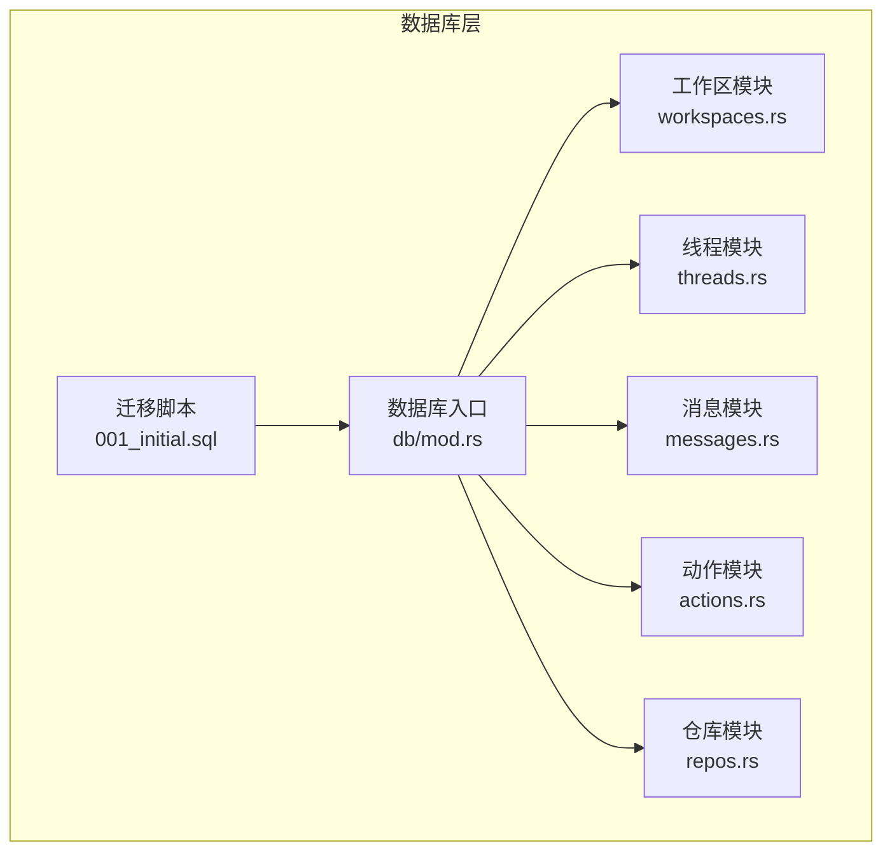
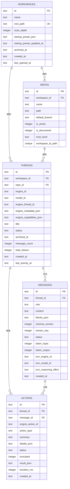

# 数据模型

<cite>
**本文引用的文件**
- [001_initial.sql](file://src-tauri/src/db/migrations/001_initial.sql)
- [models.rs](file://src-tauri/src/models.rs)
- [mod.rs](file://src-tauri/src/db/mod.rs)
- [workspaces.rs](file://src-tauri/src/db/workspaces.rs)
- [threads.rs](file://src-tauri/src/db/threads.rs)
- [messages.rs](file://src-tauri/src/db/messages.rs)
- [actions.rs](file://src-tauri/src/db/actions.rs)
- [repos.rs](file://src-tauri/src/db/repos.rs)
</cite>

## 目录
1. [简介](#简介)
2. [项目结构](#项目结构)
3. [核心组件](#核心组件)
4. [架构总览](#架构总览)
5. [详细组件分析](#详细组件分析)
6. [依赖分析](#依赖分析)
7. [性能考虑](#性能考虑)
8. [故障排查指南](#故障排查指南)
9. [结论](#结论)

## 简介
本文件系统性梳理 Panes 的数据模型与实现，聚焦核心实体：工作区（Workspace）、仓库（Repo）、线程（Thread）、消息（Message）、动作（Action）。内容涵盖：
- 实体设计原则与业务语义
- 表结构、字段、约束与索引策略
- 外键关系、级联行为与引用完整性
- 时间戳使用、归档机制与软删除
- 搜索与全文检索、审计列演进
- 性能优化与查询模式

## 项目结构
数据库层采用 SQLite + rusqlite，通过迁移脚本初始化表结构，并在运行时动态补齐新增列。各实体对应独立模块，统一由数据库入口管理连接池与迁移。

图示来源
- [001_initial.sql:1-132](file://src-tauri/src/db/migrations/001_initial.sql#L1-L132)
- [mod.rs:122-134](file://src-tauri/src/db/mod.rs#L122-L134)

章节来源
- [mod.rs:122-134](file://src-tauri/src/db/mod.rs#L122-L134)
- [001_initial.sql:1-132](file://src-tauri/src/db/migrations/001_initial.sql#L1-L132)

## 核心组件
- 工作区（Workspace）
  - 主键：id（文本）
  - 关键字段：name、root_path（唯一）、scan_depth、startup_preset_json、startup_preset_updated_at、archived_at、created_at、last_opened_at
  - 约束：root_path 唯一；默认扫描深度、时间戳默认值
  - 软删除：通过 archived_at 字段标记归档
- 仓库（Repo）
  - 主键：id（文本）
  - 外键：workspace_id → workspaces(id)，级联删除
  - 关键字段：name、path（与 workspace_id 组合唯一）、default_branch、is_active、is_discovered、trust_level
  - 约束：默认分支、信任级别、发现状态
- 线程（Thread）
  - 主键：id（文本）
  - 外键：workspace_id → workspaces(id)，级联删除；repo_id → repos(id)，删除置空
  - 关键字段：engine_id、model_id、engine_thread_id、engine_metadata_json、engine_capabilities_json、title、status、archived_at、message_count、total_tokens、created_at、last_activity_at
  - 约束：状态枚举、计数器、时间戳
- 消息（Message）
  - 主键：id（文本）
  - 外键：thread_id → threads(id)，级联删除
  - 关键字段：role、content、blocks_json、schema_version、stream_seq、status、token_input、token_output、turn_engine_id、turn_model_id、turn_reasoning_effort、created_at
  - 约束：流式序列、令牌统计、转换单元
- 动作（Action）
  - 主键：id（文本）
  - 外键：thread_id → threads(id)，级联删除；message_id → messages(id)，删除置空
  - 关键字段：engine_action_id、action_type、summary、details_json、status、truncated、result_json、duration_ms、created_at
  - 约束：执行状态、截断标记、结果持久化

章节来源
- [001_initial.sql:1-132](file://src-tauri/src/db/migrations/001_initial.sql#L1-L132)

## 架构总览
实体关系与外键约束如下：

图示来源
- [001_initial.sql:13-73](file://src-tauri/src/db/migrations/001_initial.sql#L13-L73)

章节来源
- [001_initial.sql:13-73](file://src-tauri/src/db/migrations/001_initial.sql#L13-L73)

## 详细组件分析

### 工作区（Workspace）
- 设计要点
  - 根路径唯一，避免重复工作区
  - 支持启动预设 JSON 与更新时间，便于恢复与迁移
  - 归档字段用于软删除
- 关键 SQL
  - 创建表、默认值、时间戳、唯一约束
  - 查询列表、归档/恢复、删除
- 时间戳与归档
  - created_at、last_opened_at 默认当前时间
  - archived_at 为空表示未归档
- 软删除
  - 删除前先归档，再清理相关仓库与线程（由外键级联）

章节来源
- [001_initial.sql:1-11](file://src-tauri/src/db/migrations/001_initial.sql#L1-L11)
- [workspaces.rs:15-58](file://src-tauri/src/db/workspaces.rs#L15-L58)
- [workspaces.rs:202-255](file://src-tauri/src/db/workspaces.rs#L202-L255)

### 仓库（Repo）
- 设计要点
  - 与工作区组合唯一，避免同路径重复
  - is_discovered 控制可见性，支持重发现
  - trust_level 提供安全等级
- 关键 SQL
  - upsert、按工作区列出、重发现策略
  - 设置活跃仓库集合、按路径查找最深匹配
- 路径修复
  - 合并 Windows 规范化与遗留路径差异，保持引用一致性

章节来源
- [001_initial.sql:13-23](file://src-tauri/src/db/migrations/001_initial.sql#L13-L23)
- [repos.rs:12-79](file://src-tauri/src/db/repos.rs#L12-L79)
- [repos.rs:101-154](file://src-tauri/src/db/repos.rs#L101-L154)
- [repos.rs:220-274](file://src-tauri/src/db/repos.rs#L220-L274)
- [mod.rs:253-330](file://src-tauri/src/db/mod.rs#L253-L330)

### 线程（Thread）
- 设计要点
  - 可选绑定仓库，支持远程引擎线程 ID
  - 计数器与令牌统计自动维护
  - 状态机驱动 UI 与引擎交互
- 关键 SQL
  - 创建、查询、状态更新、标题更新、归档/恢复
  - 引擎元数据 JSON 存储
  - 运行时恢复：根据审批与最后助手消息推导状态
- 业务规则
  - 仅当存在引擎线程 ID 或历史消息时才显示线程
  - 手动标题锁定：受引擎元数据控制

章节来源
- [001_initial.sql:25-41](file://src-tauri/src/db/migrations/001_initial.sql#L25-L41)
- [threads.rs:15-33](file://src-tauri/src/db/threads.rs#L15-L33)
- [threads.rs:68-124](file://src-tauri/src/db/threads.rs#L68-L124)
- [threads.rs:126-207](file://src-tauri/src/db/threads.rs#L126-L207)
- [threads.rs:280-304](file://src-tauri/src/db/threads.rs#L280-L304)
- [threads.rs:314-413](file://src-tauri/src/db/threads.rs#L314-L413)

### 消息（Message）
- 设计要点
  - 流式助手消息以占位符开始，完成后补全
  - blocks_json 结构化块存储，支持动作输出片段
  - 令牌统计与推理努力度可追踪
- 关键 SQL
  - 插入用户消息、插入助手占位、完成助手消息
  - 分页窗口查询、搜索、滚动回滚（丢弃若干轮次）
  - 克隆与导入：事务批量写入
- 搜索
  - FTS5 全文索引，基于消息内容与角色构建
  - rank 排序，限制返回数量

章节来源
- [001_initial.sql:43-58](file://src-tauri/src/db/migrations/001_initial.sql#L43-L58)
- [messages.rs:30-50](file://src-tauri/src/db/messages.rs#L30-L50)
- [messages.rs:52-70](file://src-tauri/src/db/messages.rs#L52-L70)
- [messages.rs:316-358](file://src-tauri/src/db/messages.rs#L316-L358)
- [messages.rs:376-395](file://src-tauri/src/db/messages.rs#L376-L395)
- [messages.rs:397-476](file://src-tauri/src/db/messages.rs#L397-L476)
- [messages.rs:637-682](file://src-tauri/src/db/messages.rs#L637-L682)
- [001_initial.sql:108-131](file://src-tauri/src/db/migrations/001_initial.sql#L108-L131)

### 动作（Action）与审批（Approval）
- 设计要点
  - 动作记录执行生命周期：running → done/error
  - 审批记录执行前置：pending → answered
  - 事件日志用于调试与审计
- 关键 SQL
  - 插入动作、完成动作、插入审批、回答审批
  - 事件日志追加
- 与消息块集成
  - 动作输出片段嵌入消息 blocks_json，支持截断标记

章节来源
- [001_initial.sql:60-86](file://src-tauri/src/db/migrations/001_initial.sql#L60-L86)
- [actions.rs:9-37](file://src-tauri/src/db/actions.rs#L9-L37)
- [actions.rs:39-59](file://src-tauri/src/db/actions.rs#L39-L59)
- [actions.rs:61-86](file://src-tauri/src/db/actions.rs#L61-L86)
- [actions.rs:173-186](file://src-tauri/src/db/actions.rs#L173-L186)

## 依赖分析
- 外键与级联
  - workspaces(id) → repos(workspace_id)：级联删除
  - workspaces(id) → threads(workspace_id)：级联删除
  - repos(id) → threads(repo_id)：删除置空
  - threads(id) → messages(thread_id)：级联删除
  - threads(id) → actions(thread_id)：级联删除
  - messages(id) → actions(message_id)：删除置空
- 索引策略
  - repos：按 workspace_id 查询
  - threads：按 workspace_id、repo_id、活动时间排序复合索引
  - messages：按 thread_id+created_at、status+created_at 排序
  - actions/approvals：按 thread_id+created_at、status+created_at 排序
  - FTS5：messages 内容全文检索
- 连接池与配置
  - SQLite WAL、外键开启、超时设置、连接池复用

图示来源
- [001_initial.sql:96-106](file://src-tauri/src/db/migrations/001_initial.sql#L96-L106)
- [mod.rs:137-149](file://src-tauri/src/db/mod.rs#L137-L149)

章节来源
- [001_initial.sql:96-106](file://src-tauri/src/db/migrations/001_initial.sql#L96-L106)
- [mod.rs:137-149](file://src-tauri/src/db/mod.rs#L137-L149)

## 性能考虑
- 索引
  - threads 活跃度排序与状态过滤索引，提升列表查询效率
  - messages/approvals/action 复合索引，支持分页与状态筛选
- FTS5
  - 全文检索显著降低模糊查询成本
- 连接池
  - 预热连接、WAL 模式、适度同步级别，平衡一致性与吞吐
- 批量操作
  - 导入/克隆消息使用事务，减少磁盘写放大
- 时间戳
  - 使用字符串 ISO8601，配合排序与游标分页，避免复杂时间函数

## 故障排查指南
- 归档与恢复
  - 工作区/线程归档后仍保留引用完整性，可通过恢复接口还原
- 路径修复
  - 合并重复工作区与仓库，重映射引用，确保外键一致
- 运行时恢复
  - 自动将过期流式助手消息标记为中断，依据审批与最后消息推导线程状态
- 列演进
  - 新增列通过迁移补齐，避免破坏现有数据

章节来源
- [mod.rs:151-225](file://src-tauri/src/db/mod.rs#L151-L225)
- [threads.rs:314-367](file://src-tauri/src/db/threads.rs#L314-L367)
- [workspaces.rs:218-255](file://src-tauri/src/db/workspaces.rs#L218-L255)
- [threads.rs:170-207](file://src-tauri/src/db/threads.rs#L170-L207)

## 结论
该数据模型围绕“工作区—仓库—线程—消息—动作”形成清晰的层级关系，通过外键与级联保障引用完整性，结合索引与 FTS5 提升查询性能。归档与软删除策略兼顾数据保留与可用性，路径修复与列演进机制确保长期兼容性与稳定性。