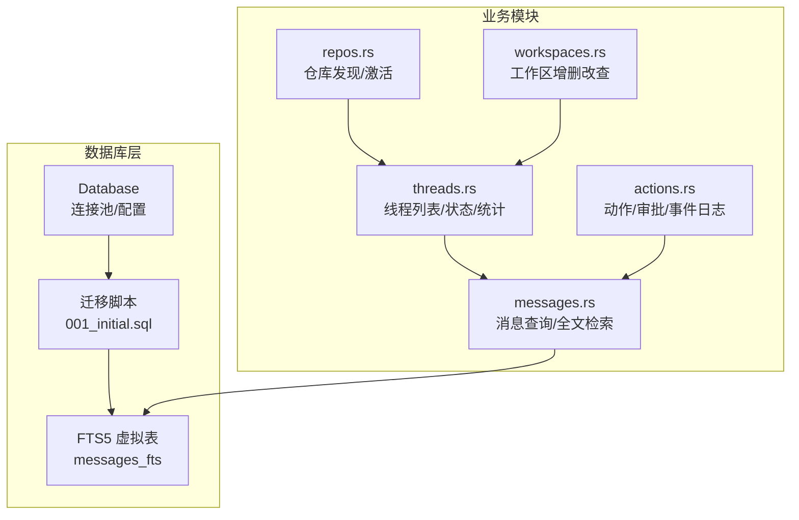
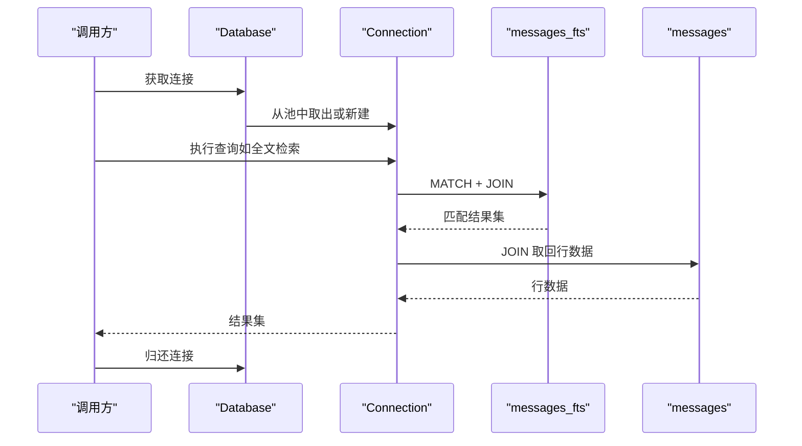
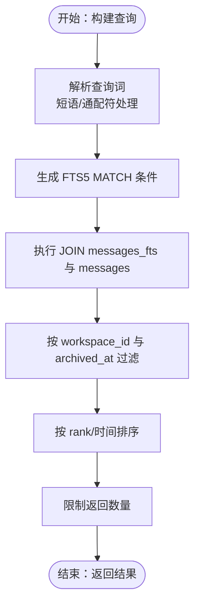
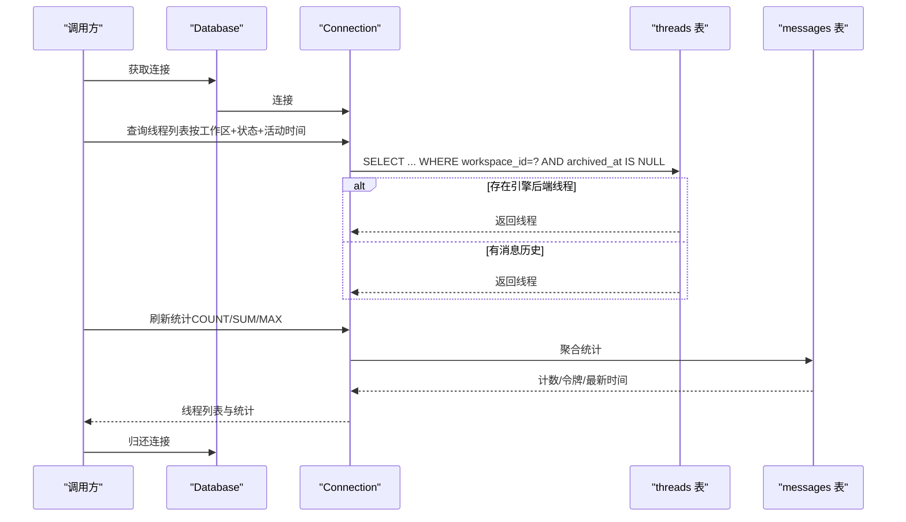
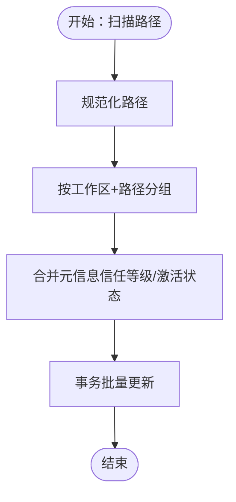
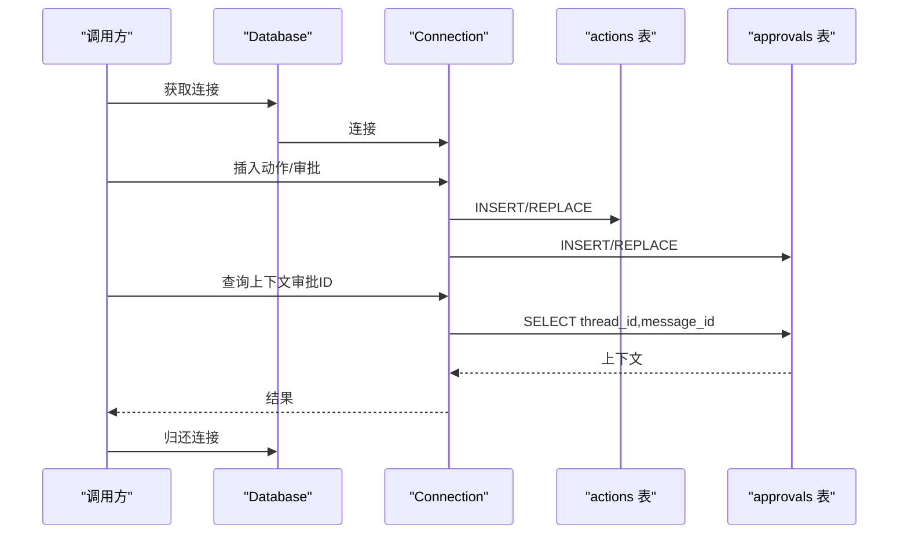
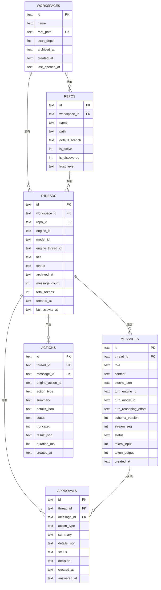

# 查询优化

<cite>
**本文引用的文件**
- [mod.rs](file://src-tauri/src/db/mod.rs)
- [001_initial.sql](file://src-tauri/src/db/migrations/001_initial.sql)
- [messages.rs](file://src-tauri/src/db/messages.rs)
- [threads.rs](file://src-tauri/src/db/threads.rs)
- [repos.rs](file://src-tauri/src/db/repos.rs)
- [workspaces.rs](file://src-tauri/src/db/workspaces.rs)
- [actions.rs](file://src-tauri/src/db/actions.rs)
</cite>

## 目录
1. [简介](#简介)
2. [项目结构](#项目结构)
3. [核心组件](#核心组件)
4. [架构总览](#架构总览)
5. [详细组件分析](#详细组件分析)
6. [依赖关系分析](#依赖关系分析)
7. [性能考量](#性能考量)
8. [故障排查指南](#故障排查指南)
9. [结论](#结论)
10. [附录](#附录)

## 简介
本文件面向 Panes 数据库查询优化，聚焦 SQLite 在本地应用中的查询模式、索引策略与性能优化技术。内容涵盖常见查询场景的优化方法、查询计划分析与执行效率评估；复合索引设计、查询重写与批量操作优化；慢查询识别、性能监控指标与瓶颈分析工具；全文搜索（FTS5）集成、模糊匹配优化与搜索性能调优；以及查询缓存策略、预编译语句使用与连接复用技术。最后提供具体优化案例与最佳实践。

## 项目结构
数据库层采用 Rust + rusqlite + SQLite 实现，核心模块如下：
- 连接池与配置：数据库初始化、连接池管理、WAL/同步/超时等 PRAGMA 配置
- 迁移脚本：定义表结构与索引，含 FTS5 虚拟表及触发器
- 功能模块：消息、线程、仓库、工作区、动作与审批等业务查询封装
- 查询接口：按线程窗口分页、全文检索、统计聚合、批量删除等

图表来源
- [mod.rs:21-149](file://src-tauri/src/db/mod.rs#L21-L149)
- [001_initial.sql:108-132](file://src-tauri/src/db/migrations/001_initial.sql#L108-L132)
- [messages.rs:637-682](file://src-tauri/src/db/messages.rs#L637-L682)
- [threads.rs:68-95](file://src-tauri/src/db/threads.rs#L68-L95)
- [repos.rs:81-99](file://src-tauri/src/db/repos.rs#L81-L99)
- [workspaces.rs:60-77](file://src-tauri/src/db/workspaces.rs#L60-L77)
- [actions.rs:10-98](file://src-tauri/src/db/actions.rs#L10-L98)

章节来源
- [mod.rs:21-149](file://src-tauri/src/db/mod.rs#L21-L149)
- [001_initial.sql:1-132](file://src-tauri/src/db/migrations/001_initial.sql#L1-L132)

## 核心组件
- 连接池与配置
  - 最大空闲连接数常量控制并发连接上限
  - 初始化时启用外键约束、WAL 模式、同步级别、内存临时存储、忙等待超时
  - 提供连接获取与归还机制，避免频繁打开/关闭连接
- 迁移与索引
  - 主键与唯一约束确保数据完整性
  - 多处复合索引覆盖高频查询路径（线程、消息、动作、审批）
  - FTS5 虚拟表自动维护，支持全文检索与前缀匹配
- 查询封装
  - 消息：按时间窗口分页、全文检索、块级数据解析与审批状态回填
  - 线程：按工作区列出、归档过滤、状态推导、计数与令牌统计
  - 仓库：去重合并、发现状态、信任等级、最深包含路径查找
  - 工作区：默认扫描深度、归档与恢复、启动预设 JSON
  - 动作/审批：插入、更新、事件日志追加、上下文查询

章节来源
- [mod.rs:21-149](file://src-tauri/src/db/mod.rs#L21-L149)
- [001_initial.sql:1-132](file://src-tauri/src/db/migrations/001_initial.sql#L1-L132)
- [messages.rs:376-476](file://src-tauri/src/db/messages.rs#L376-L476)
- [threads.rs:68-95](file://src-tauri/src/db/threads.rs#L68-L95)
- [repos.rs:12-79](file://src-tauri/src/db/repos.rs#L12-L79)
- [workspaces.rs:15-58](file://src-tauri/src/db/workspaces.rs#L15-L58)
- [actions.rs:9-98](file://src-tauri/src/db/actions.rs#L9-L98)

## 架构总览
下图展示数据库层与各业务模块之间的交互关系，以及 FTS5 在全文检索中的位置。

图表来源
- [mod.rs:98-121](file://src-tauri/src/db/mod.rs#L98-L121)
- [messages.rs:637-682](file://src-tauri/src/db/messages.rs#L637-L682)
- [001_initial.sql:108-132](file://src-tauri/src/db/migrations/001_initial.sql#L108-L132)

## 详细组件分析

### 组件一：消息查询与全文检索（FTS5）
- 查询模式
  - 窗口分页：基于 created_at 与 rowid 的降序排序，支持游标翻页
  - 全文检索：FTS5 虚拟表自动维护，支持短语、通配符与大小写不敏感匹配
  - 审批状态回填：从 approvals 表加载已回答的审批并注入到消息块中
- 性能要点
  - 使用 FTS5 虚拟表与触发器，避免手动同步
  - 查询中通过 workspace_id 与 archived_at 过滤，减少扫描范围
  - 游标使用 created_at/rowid/id 三元条件，保证稳定排序与去重
- 优化建议
  - 对 content 建立 FTS5 列表，提升检索性能
  - 合理限制返回条数（当前固定上限），避免一次性返回过多结果
  - 对高并发场景，结合连接池与预编译语句

图表来源
- [messages.rs:637-682](file://src-tauri/src/db/messages.rs#L637-L682)
- [messages.rs:684-711](file://src-tauri/src/db/messages.rs#L684-L711)
- [messages.rs:713-794](file://src-tauri/src/db/messages.rs#L713-L794)
- [001_initial.sql:108-132](file://src-tauri/src/db/migrations/001_initial.sql#L108-L132)

章节来源
- [messages.rs:376-476](file://src-tauri/src/db/messages.rs#L376-L476)
- [messages.rs:637-682](file://src-tauri/src/db/messages.rs#L637-L682)
- [messages.rs:796-837](file://src-tauri/src/db/messages.rs#L796-L837)
- [messages.rs:1025-1093](file://src-tauri/src/db/messages.rs#L1025-L1093)
- [001_initial.sql:108-132](file://src-tauri/src/db/migrations/001_initial.sql#L108-L132)

### 组件二：线程列表与状态统计
- 查询模式
  - 按工作区列出活跃线程，排除仅存在引擎后端线程而无消息的历史
  - 支持归档线程列表，按归档时间倒序
  - 统计消息计数与令牌总量，定期刷新
- 性能要点
  - 复合索引覆盖 workspace_id、status、last_activity_at，加速筛选与排序
  - 使用 EXISTS 子查询避免全表扫描
- 优化建议
  - 将统计字段持久化，减少每次聚合计算
  - 对长列表场景，采用分页游标与延迟加载

图表来源
- [threads.rs:68-95](file://src-tauri/src/db/threads.rs#L68-L95)
- [threads.rs:97-124](file://src-tauri/src/db/threads.rs#L97-L124)
- [threads.rs:252-278](file://src-tauri/src/db/threads.rs#L252-L278)
- [001_initial.sql:96-106](file://src-tauri/src/db/migrations/001.sql#L96-L106)

章节来源
- [threads.rs:68-95](file://src-tauri/src/db/threads.rs#L68-L95)
- [threads.rs:97-124](file://src-tauri/src/db/threads.rs#L97-L124)
- [threads.rs:252-278](file://src-tauri/src/db/threads.rs#L252-L278)
- [001_initial.sql:96-106](file://src-tauri/src/db/migrations/001_initial.sql#L96-L106)

### 组件三：仓库发现与信任等级
- 查询模式
  - 去重合并：同一工作区内路径规范化后合并重复仓库
  - 发现状态：根据扫描结果重置 is_discovered 标记
  - 信任等级：按等级优先级选择最优值
- 性能要点
  - 使用事务包裹批量更新，减少锁竞争
  - 规范化路径后进行比较，降低字符串处理开销
- 优化建议
  - 对大规模仓库集合，分批处理并使用占位符 IN 子句
  - 对信任等级比较引入映射表，避免运行时判断

图表来源
- [repos.rs:101-154](file://src-tauri/src/db/repos.rs#L101-L154)
- [repos.rs:156-186](file://src-tauri/src/db/repos.rs#L156-L186)
- [repos.rs:220-274](file://src-tauri/src/db/repos.rs#L220-L274)

章节来源
- [repos.rs:12-79](file://src-tauri/src/db/repos.rs#L12-L79)
- [repos.rs:101-154](file://src-tauri/src/db/repos.rs#L101-L154)
- [repos.rs:220-274](file://src-tauri/src/db/repos.rs#L220-L274)

### 组件四：动作与审批查询
- 查询模式
  - 插入动作/审批，支持替换与答案记录
  - 事件日志追加，便于调试与审计
  - 上下文查询：根据审批 ID 获取 thread_id/message_id
- 性能要点
  - 使用预编译语句与参数绑定，避免 SQL 注入与重复解析
  - 审批状态回填时按 message_id 分组批量查询
- 优化建议
  - 对高频查询建立复合索引（thread_id/status/created_at）
  - 对审批详情 JSON 字段，必要时拆分为结构化列以支持更高效查询

图表来源
- [actions.rs:9-98](file://src-tauri/src/db/actions.rs#L9-L98)
- [actions.rs:113-171](file://src-tauri/src/db/actions.rs#L113-L171)

章节来源
- [actions.rs:9-98](file://src-tauri/src/db/actions.rs#L9-L98)
- [actions.rs:113-171](file://src-tauri/src/db/actions.rs#L113-L171)

## 依赖关系分析
- 外键关系
  - repos.workspace_id 引用 workspaces.id（级联删除）
  - threads.workspace_id 引用 workspaces.id（级联删除）
  - threads.repo_id 引用 repos.id（SET NULL）
  - messages.thread_id 引用 threads.id（级联删除）
  - actions/thread_id/message_id 引用 threads/messages（级联删除/SET NULL）
  - approvals/thread_id/message_id 引用 threads/messages（级联删除/SET NULL）
- 索引覆盖
  - threads：workspace_id、repo_id、last_activity_at、status
  - messages：thread_id+created_at、thread_id+status+created_at
  - actions/approvals：thread_id+created_at、message_id+status+created_at
- FTS5
  - messages_fts 与 messages 关联，自动维护

图表来源
- [001_initial.sql:1-94](file://src-tauri/src/db/migrations/001_initial.sql#L1-L94)

章节来源
- [001_initial.sql:1-94](file://src-tauri/src/db/migrations/001_initial.sql#L1-L94)

## 性能考量
- 连接与事务
  - 使用连接池减少连接开销；WAL 模式提升并发读写能力
  - 批量操作（如克隆/导入/删除）使用事务包裹，降低锁持有时间
- 索引策略
  - 复合索引覆盖高频过滤与排序字段，避免全表扫描
  - FTS5 适合全文检索与前缀匹配，但需注意写入触发器带来的额外成本
- 查询重写
  - 使用 EXISTS 替代 JOIN 减少中间结果集
  - 使用 LIMIT 控制返回规模，配合游标实现分页
- 缓存与预编译
  - 对热点查询使用预编译语句与参数绑定
  - 对静态或低频变更的数据可考虑应用层缓存（谨慎使用）

## 故障排查指南
- 慢查询识别
  - 使用 EXPLAIN QUERY PLAN 分析执行计划，确认是否命中索引
  - 关注全表扫描、临时表与排序操作
- 监控指标
  - 查询耗时分布、连接池利用率、事务提交次数
  - FTS5 写入触发器导致的延迟
- 常见问题
  - 外键约束失败：检查引用完整性与删除顺序
  - FTS5 不一致：重建虚拟表或执行 optimize
  - 并发写入阻塞：调整 busy_timeout 或减少长事务

章节来源
- [mod.rs:137-149](file://src-tauri/src/db/mod.rs#L137-L149)
- [001_initial.sql:108-132](file://src-tauri/src/db/migrations/001_initial.sql#L108-L132)

## 结论
通过对 Panes 数据库层的深入分析，可以总结出以下关键优化方向：
- 建立完善的复合索引体系，覆盖高频过滤与排序字段
- 充分利用 FTS5 进行全文检索与模糊匹配，同时关注写入触发器成本
- 使用连接池、事务与预编译语句提升吞吐与稳定性
- 对长列表与高并发场景采用分页游标与延迟加载策略
- 持续监控查询计划与执行指标，及时发现并修复瓶颈

## 附录
- 优化案例
  - 线程列表：通过复合索引与 EXISTS 子查询显著降低查询时间
  - 消息窗口：使用 created_at/rowid/id 三元游标，避免跳页丢失
  - 仓库去重：事务内批量更新，减少重复扫描
- 最佳实践
  - 优先使用复合索引；对多条件查询设计覆盖索引
  - 对全文检索使用 FTS5，并保持触发器同步
  - 批量操作统一纳入事务，合理设置 busy_timeout
  - 对 JSON 字段的结构化查询，考虑拆分到结构化列