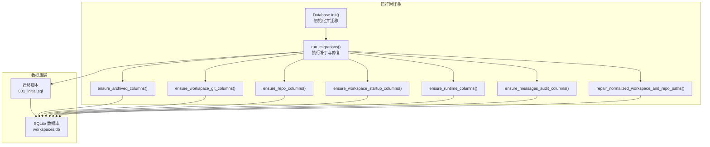
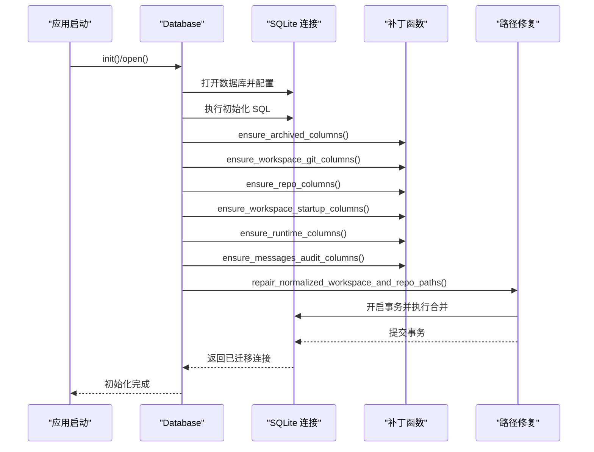
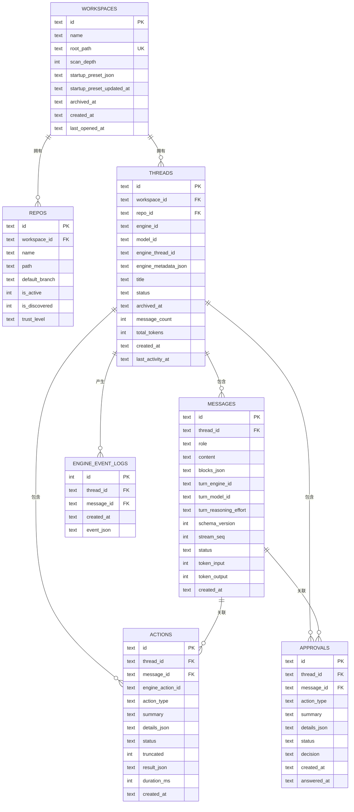
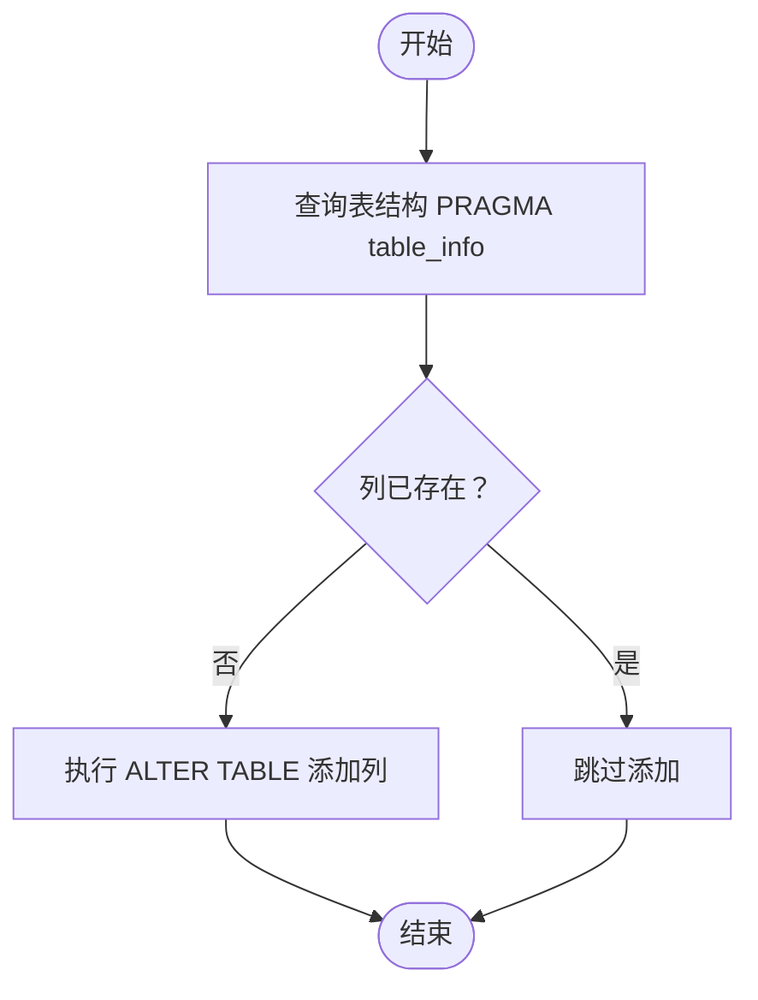
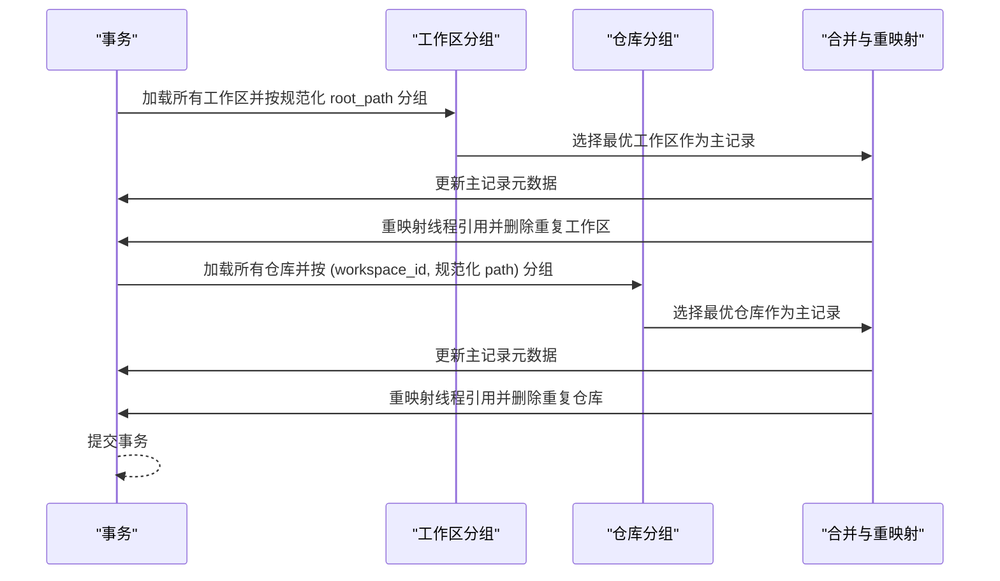
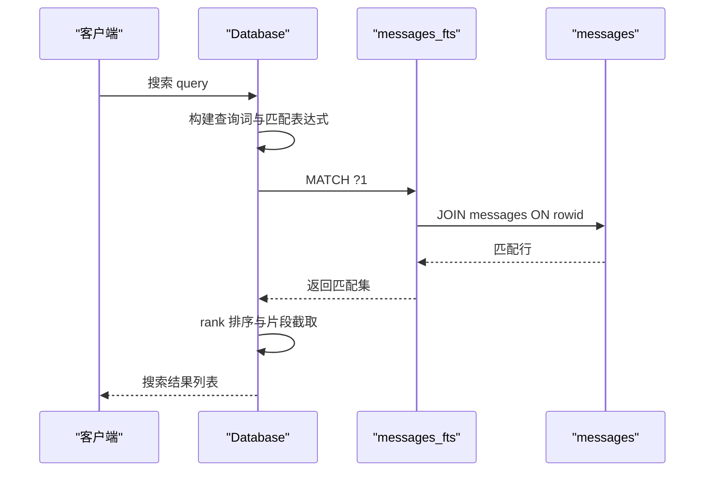
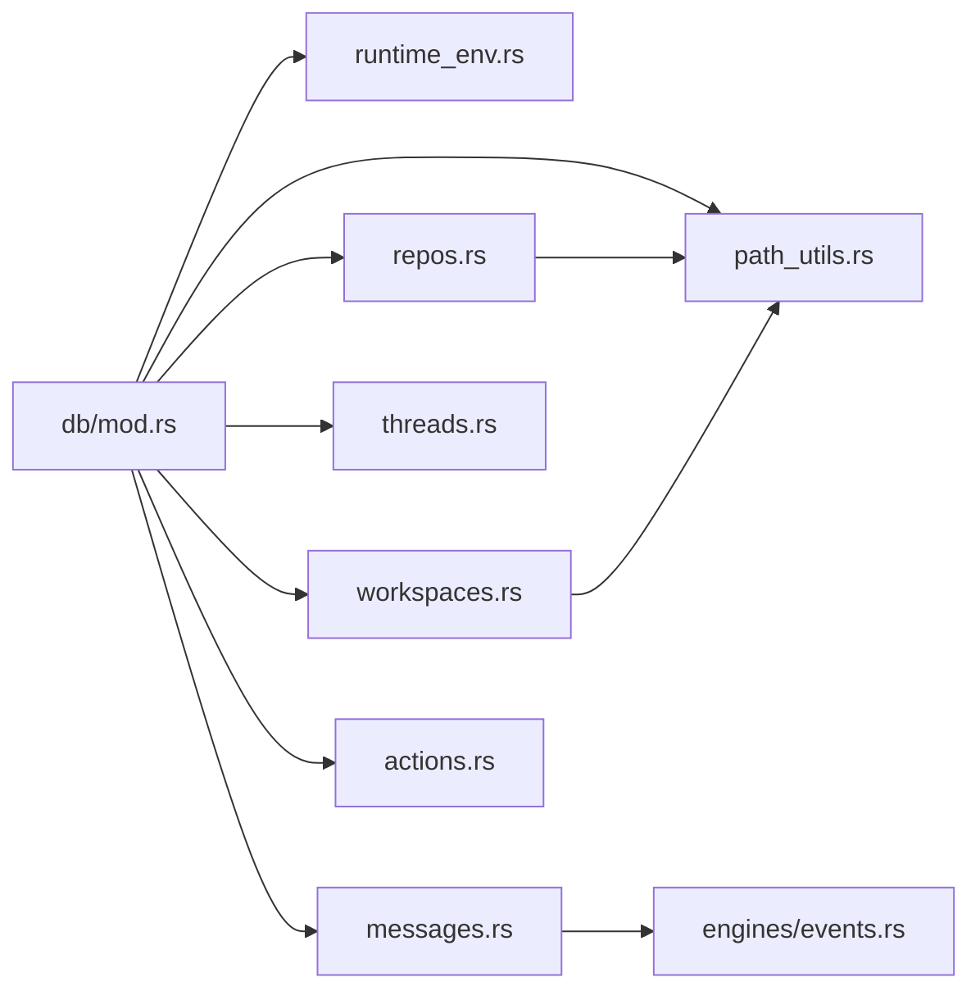

# 迁移系统

<cite>
**本文档引用的文件**
- [001_initial.sql](file://src-tauri/src/db/migrations/001_initial.sql)
- [mod.rs](file://src-tauri/src/db/mod.rs)
- [actions.rs](file://src-tauri/src/db/actions.rs)
- [messages.rs](file://src-tauri/src/db/messages.rs)
- [repos.rs](file://src-tauri/src/db/repos.rs)
- [threads.rs](file://src-tauri/src/db/threads.rs)
- [workspaces.rs](file://src-tauri/src/db/workspaces.rs)
- [models.rs](file://src-tauri/src/models.rs)
- [path_utils.rs](file://src-tauri/src/path_utils.rs)
- [runtime_env.rs](file://src-tauri/src/runtime_env.rs)
- [events.rs](file://src-tauri/src/engines/events.rs)
</cite>

## 目录
1. [简介](#简介)
2. [项目结构](#项目结构)
3. [核心组件](#核心组件)
4. [架构总览](#架构总览)
5. [详细组件分析](#详细组件分析)
6. [依赖关系分析](#依赖关系分析)
7. [性能考虑](#性能考虑)
8. [故障排除指南](#故障排除指南)
9. [结论](#结论)
10. [附录](#附录)

## 简介
本文件系统化梳理 Panes 数据库迁移系统的整体设计与实现，重点覆盖以下方面：
- 迁移文件的组织结构与版本管理策略
- 初始迁移脚本的表结构定义与索引设计
- 动态列添加机制（ensure_column 函数）与向后兼容性保障
- 架构演进策略与数据修复逻辑（路径规范化、重复数据合并）
- 迁移执行流程、错误处理与回滚策略
- 搜索与审计字段的演进与 FTS 集成
- 测试方法、版本升级指南与故障排除步骤

## 项目结构
数据库迁移系统位于 Tauri 后端模块中，采用“初始化迁移 + 运行时补丁”的双层策略：
- 初始化迁移：通过 SQL 文件一次性创建核心表与索引，并建立全文检索支持
- 运行时补丁：在应用启动时对现有数据库进行列级补丁与数据修复，确保跨版本兼容

**图表来源**
- [mod.rs:75-135](file://src-tauri/src/db/mod.rs#L75-L135)
- [001_initial.sql:1-132](file://src-tauri/src/db/migrations/001_initial.sql#L1-L132)

**章节来源**
- [mod.rs:75-135](file://src-tauri/src/db/mod.rs#L75-L135)
- [001_initial.sql:1-132](file://src-tauri/src/db/migrations/001_initial.sql#L1-L132)

## 核心组件
- Database 结构体：负责数据库初始化、连接池管理、迁移执行与连接配置
- 迁移执行器：按顺序应用初始化 SQL 并执行一系列 ensure_* 补丁函数
- 路径修复器：合并重复工作区与仓库记录，统一路径表示
- 补丁函数：动态检测并添加缺失列，确保历史版本数据兼容新功能

关键职责与行为：
- 初始化：迁移应用、启用外键与 WAL、设置同步级别与忙等待超时
- 补丁：逐表检查列存在性，按需添加；对消息表补充审计字段
- 修复：事务内合并重复路径，重映射引用，更新元数据

**章节来源**
- [mod.rs:23-149](file://src-tauri/src/db/mod.rs#L23-L149)
- [mod.rs:122-134](file://src-tauri/src/db/mod.rs#L122-L134)
- [mod.rs:1011-1046](file://src-tauri/src/db/mod.rs#L1011-L1046)

## 架构总览
迁移系统遵循“先结构、后数据”的演进原则：
- 结构层：通过 SQL 定义表、索引与 FTS 触发器
- 数据层：通过 ensure_* 与 repair_* 保证历史数据与新增字段的兼容
- 连接层：连接池复用、WAL 提升并发读写性能

**图表来源**
- [mod.rs:75-135](file://src-tauri/src/db/mod.rs#L75-L135)
- [mod.rs:253-262](file://src-tauri/src/db/mod.rs#L253-L262)

**章节来源**
- [mod.rs:75-135](file://src-tauri/src/db/mod.rs#L75-L135)

## 详细组件分析

### 初始化迁移脚本（001_initial.sql）
- 表结构
  - workspaces：工作区根路径唯一约束、归档时间、启动预设等
  - repos：仓库与工作区关联、发现标记、信任等级
  - threads：线程与仓库关联、引擎元数据、状态与计数
  - messages：消息内容、块数据、流式序列号、令牌用量、审计字段
  - actions：动作生命周期与结果
  - approvals：审批请求与决策
  - engine_event_logs：事件日志
- 索引
  - 多个复合索引优化查询：按工作区、状态、活动时间排序
  - 消息表按时间与状态的高效检索
- 全文检索（FTS）
  - 基于 FTS5 的虚拟表 messages_fts
  - 自动触发器同步插入/删除/更新，支持按内容搜索

**图表来源**
- [001_initial.sql:1-132](file://src-tauri/src/db/migrations/001_initial.sql#L1-L132)

**章节来源**
- [001_initial.sql:1-132](file://src-tauri/src/db/migrations/001_initial.sql#L1-L132)

### 动态列添加机制（ensure_column 函数）
- 设计目标：在不中断服务的前提下，为现有表安全地添加新列
- 实现方式：通过 PRAGMA 查询表结构，判断列是否存在，不存在则执行 ALTER TABLE
- 应用范围：工作区归档时间、仓库发现标记、工作区启动预设、运行时审计字段等

**图表来源**
- [mod.rs:1011-1046](file://src-tauri/src/db/mod.rs#L1011-L1046)

**章节来源**
- [mod.rs:1011-1046](file://src-tauri/src/db/mod.rs#L1011-L1046)

### 路径规范化修复与重复数据合并
- 背景：Windows 路径存在 verbatim 前缀差异导致同一路径被识别为不同条目
- 策略：在事务内按规范化后的路径分组，选择“最优”记录作为主记录，重映射引用并删除重复项
- 合并规则：
  - 工作区：保留最近打开、扫描深度取最大、启动预设取最新、归档状态取“未归档”
  - 仓库：活跃与发现状态取“更积极”的值，信任等级按“restricted > standard > trusted”取优

**图表来源**
- [mod.rs:253-262](file://src-tauri/src/db/mod.rs#L253-L262)
- [mod.rs:264-330](file://src-tauri/src/db/mod.rs#L264-L330)

**章节来源**
- [mod.rs:253-330](file://src-tauri/src/db/mod.rs#L253-L330)

### 消息审计字段演进与 FTS 集成
- 新增字段：turn_engine_id、turn_model_id、turn_reasoning_effort、stream_seq
- FTS 支持：messages_fts 虚拟表自动同步消息内容，支持全文检索
- 搜索流程：构建查询词、转义与通配符处理、基于 rank 排序返回结果片段

**图表来源**
- [messages.rs:637-682](file://src-tauri/src/db/messages.rs#L637-L682)
- [001_initial.sql:108-131](file://src-tauri/src/db/migrations/001_initial.sql#L108-L131)

**章节来源**
- [messages.rs:637-682](file://src-tauri/src/db/messages.rs#L637-L682)
- [001_initial.sql:108-131](file://src-tauri/src/db/migrations/001_initial.sql#L108-L131)

### 线程运行时恢复与状态推断
- 目标：在应用重启或异常退出后，恢复线程状态与消息状态
- 方法：清理遗留流式状态、根据审批与最后消息状态推断线程状态
- 输出：统计标记的消息数量与状态更新次数

**章节来源**
- [threads.rs:314-367](file://src-tauri/src/db/threads.rs#L314-L367)

### 数据访问与业务封装
- 工作区：UPSERT、列表、归档/恢复、默认工作区选择
- 仓库：UPSER、发现状态管理、信任等级、最深匹配查找
- 线程：创建、列表、状态更新、计数器更新、运行时快照
- 消息：插入、克隆、导入、回滚、块更新、搜索、窗口翻页
- 动作/审批：插入、完成、回答、事件日志

**章节来源**
- [workspaces.rs:15-344](file://src-tauri/src/db/workspaces.rs#L15-L344)
- [repos.rs:12-313](file://src-tauri/src/db/repos.rs#L12-L313)
- [threads.rs:15-367](file://src-tauri/src/db/threads.rs#L15-L367)
- [messages.rs:30-194](file://src-tauri/src/db/messages.rs#L30-L194)
- [actions.rs:10-186](file://src-tauri/src/db/actions.rs#L10-L186)

## 依赖关系分析
- 运行时环境与路径工具
  - runtime_env 提供应用数据目录与旧版迁移
  - path_utils 提供 Windows 路径规范化与 verbatim 前缀处理
- 引擎事件与消息块
  - engines/events 定义事件类型与输出截断策略，影响消息块结构与存储

**图表来源**
- [mod.rs:13-19](file://src-tauri/src/db/mod.rs#L13-L19)
- [runtime_env.rs:62-69](file://src-tauri/src/runtime_env.rs#L62-L69)
- [path_utils.rs:11-19](file://src-tauri/src/path_utils.rs#L11-L19)

**章节来源**
- [mod.rs:13-19](file://src-tauri/src/db/mod.rs#L13-L19)
- [runtime_env.rs:62-69](file://src-tauri/src/runtime_env.rs#L62-L69)
- [path_utils.rs:11-19](file://src-tauri/src/path_utils.rs#L11-L19)

## 性能考虑
- 连接配置
  - 外键约束开启、WAL 日志模式、NORMAL 同步级别、内存临时存储、5 秒忙等待超时
- 索引策略
  - 针对线程活动时间、状态与消息时间/状态建立复合索引，提升查询效率
- FTS 与分页
  - 使用 FTS5 与 rank 排序，结合窗口游标分页避免大偏移
- 连接池
  - 最大空闲连接数限制，减少资源占用与上下文切换

**章节来源**
- [mod.rs:137-149](file://src-tauri/src/db/mod.rs#L137-L149)
- [001_initial.sql:96-106](file://src-tauri/src/db/migrations/001_initial.sql#L96-L106)
- [messages.rs:397-476](file://src-tauri/src/db/messages.rs#L397-L476)

## 故障排除指南
- 迁移失败
  - 检查初始化 SQL 是否成功执行
  - 确认 ensure_* 函数是否抛出列添加异常
  - 查看 repair_* 事务提交前的错误日志
- 路径问题
  - 确保 path_utils 的规范化与 verbatim 前缀处理正确
  - 在 Windows 环境下验证 legacy 与标准路径映射
- 数据不一致
  - 通过 threads::reconcile_runtime_state 恢复线程状态
  - 使用 messages::drop_last_turns 回滚用户可见的对话回合
- 权限与锁
  - 若出现锁等待，检查 busy_timeout 设置与 WAL 模式
  - 确认外键约束未破坏引用完整性

**章节来源**
- [mod.rs:122-134](file://src-tauri/src/db/mod.rs#L122-L134)
- [threads.rs:314-367](file://src-tauri/src/db/threads.rs#L314-L367)
- [messages.rs:196-270](file://src-tauri/src/db/messages.rs#L196-L270)

## 结论
Panes 的数据库迁移系统以“结构先行、数据渐进”的策略实现了稳定的版本演进与向后兼容：
- 初始化 SQL 明确表结构与索引，FTS 提升搜索体验
- ensure_* 与 repair_* 保障历史数据平滑过渡
- 连接池与 WAL 配置兼顾性能与可靠性
- 通过完善的测试覆盖路径修复与数据一致性场景

## 附录

### 版本升级指南
- 新增表/列
  - 在 SQL 中声明并在 ensure_* 中补充检测逻辑
  - 在测试中模拟历史数据，验证补丁执行
- 字段演进
  - 优先使用可选字段与默认值，避免强制迁移
  - 对消息审计字段（如 turn_*）采用增量补丁
- 发布前检查
  - 运行单元测试，覆盖路径修复与重复合并
  - 在本地数据库上手动验证 WAL、索引与 FTS 行为

**章节来源**
- [mod.rs:1011-1046](file://src-tauri/src/db/mod.rs#L1011-L1046)
- [mod.rs:700-1009](file://src-tauri/src/db/mod.rs#L700-L1009)

### 迁移测试方法
- 单元测试要点
  - 路径修复：构造重复路径与不同信任等级，验证合并与重映射
  - 补丁执行：在空数据库与已有数据上分别验证 ensure_* 的幂等性
  - 搜索与分页：构造大量消息，验证 FTS 与窗口游标
- 场景覆盖
  - Windows 路径变体（verbatim 与非 verbatim）
  - 归档与未归档工作区混合
  - 多仓库同路径但不同工作区的冲突

**章节来源**
- [mod.rs:700-1009](file://src-tauri/src/db/mod.rs#L700-L1009)
- [messages.rs:637-682](file://src-tauri/src/db/messages.rs#L637-L682)