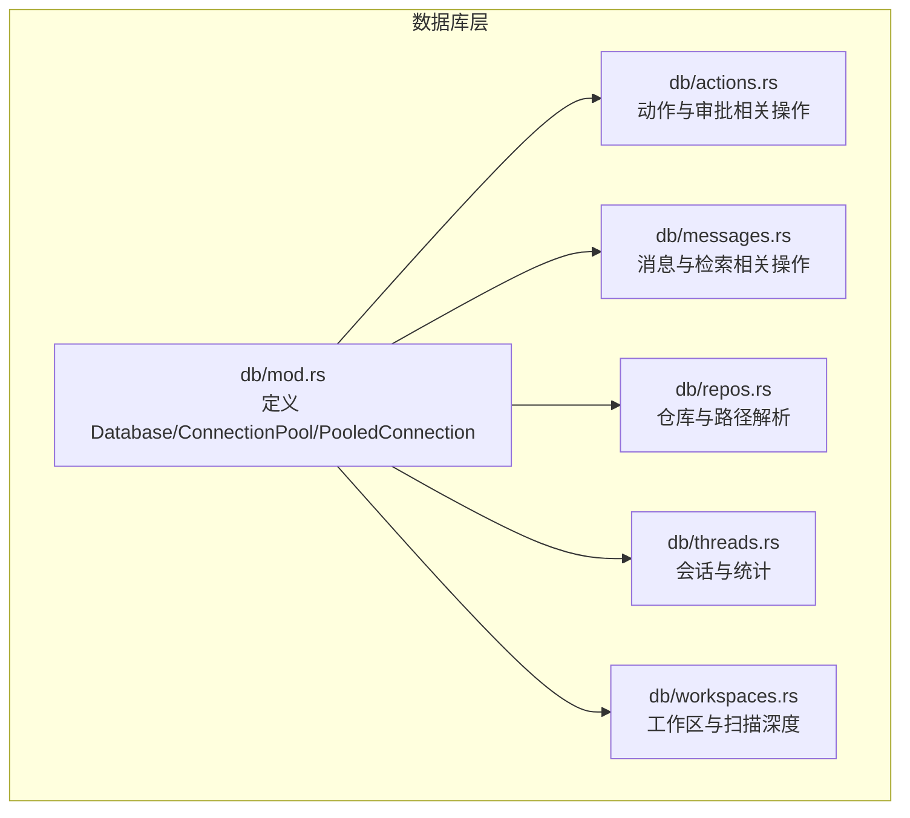
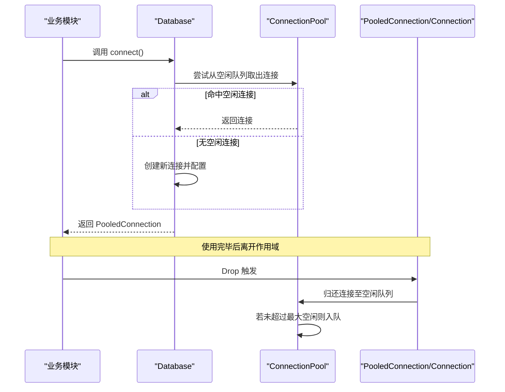
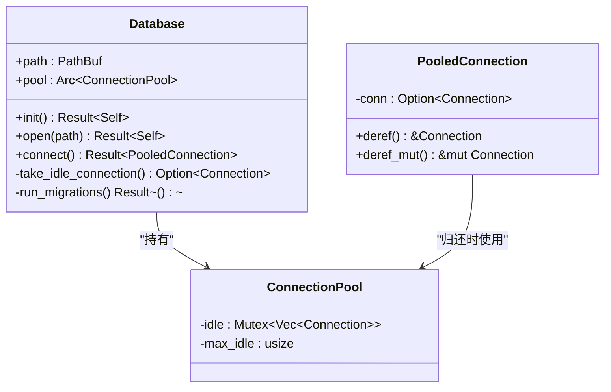
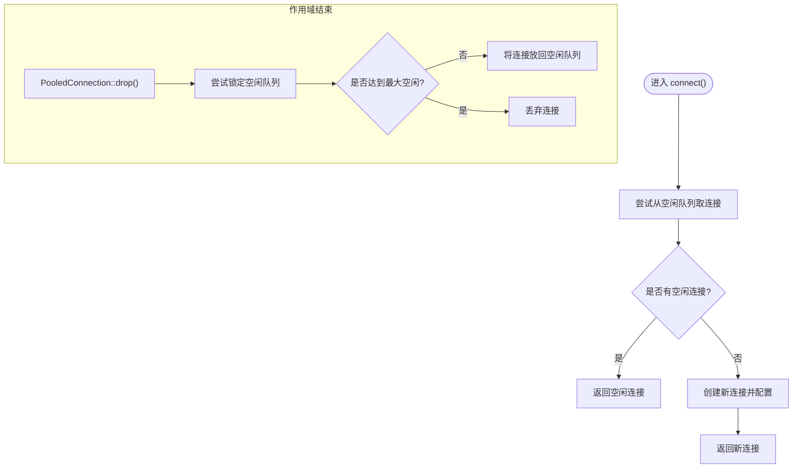
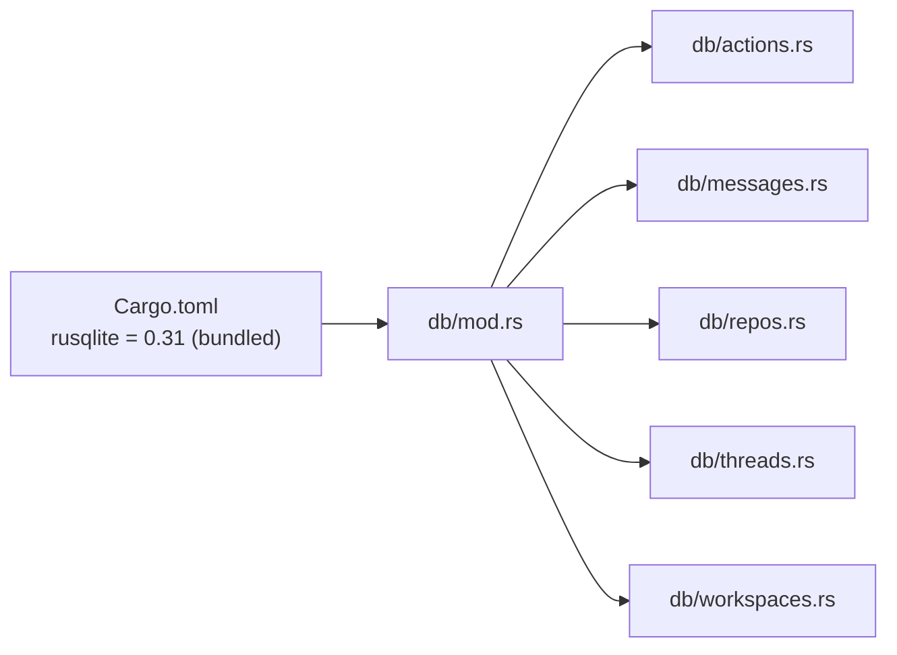

# 连接池管理

<cite>
**本文引用的文件**
- [src-tauri/src/db/mod.rs](file://src-tauri/src/db/mod.rs)
- [src-tauri/src/db/actions.rs](file://src-tauri/src/db/actions.rs)
- [src-tauri/src/db/messages.rs](file://src-tauri/src/db/messages.rs)
- [src-tauri/src/db/repos.rs](file://src-tauri/src/db/repos.rs)
- [src-tauri/src/db/threads.rs](file://src-tauri/src/db/threads.rs)
- [src-tauri/src/db/workspaces.rs](file://src-tauri/src/db/workspaces.rs)
- [src-tauri/Cargo.toml](file://src-tauri/Cargo.toml)
</cite>

## 目录
1. [简介](#简介)
2. [项目结构](#项目结构)
3. [核心组件](#核心组件)
4. [架构总览](#架构总览)
5. [详细组件分析](#详细组件分析)
6. [依赖关系分析](#依赖关系分析)
7. [性能考量](#性能考量)
8. [故障排查指南](#故障排查指南)
9. [结论](#结论)
10. [附录](#附录)

## 简介
本文件针对 Panes 中基于 SQLite 的连接池管理进行系统化技术文档编写，覆盖设计原理、性能优化策略、资源管理机制与线程安全保障。重点内容包括：
- 连接池配置参数（最大空闲连接数、忙等待超时）
- 连接生命周期管理、获取与释放流程
- 空闲连接回收策略与连接泄漏防护
- 监控指标、性能调优建议与故障诊断方法
- WAL 模式配置、同步级别设置与内存存储优化
- 并发访问控制、死锁预防与异常处理机制

## 项目结构
Panes 的数据库层位于 Tauri 后端模块中，采用按功能域划分的模块组织方式：db 根模块负责连接池与通用配置；各业务模块（如 actions、messages、repos、threads、workspaces）通过统一的 Database 抽象获取连接并执行操作。

图表来源
- [src-tauri/src/db/mod.rs:21-149](file://src-tauri/src/db/mod.rs#L21-L149)
- [src-tauri/src/db/actions.rs:1-187](file://src-tauri/src/db/actions.rs#L1-L187)
- [src-tauri/src/db/messages.rs:1-200](file://src-tauri/src/db/messages.rs#L1-L200)
- [src-tauri/src/db/repos.rs:320-340](file://src-tauri/src/db/repos.rs#L320-L340)
- [src-tauri/src/db/threads.rs:450-461](file://src-tauri/src/db/threads.rs#L450-L461)
- [src-tauri/src/db/workspaces.rs:429-440](file://src-tauri/src/db/workspaces.rs#L429-L440)

章节来源
- [src-tauri/src/db/mod.rs:1-149](file://src-tauri/src/db/mod.rs#L1-L149)
- [src-tauri/Cargo.toml:40-40](file://src-tauri/Cargo.toml#L40-L40)

## 核心组件
- Database：封装数据库路径与连接池，提供 connect 获取连接的能力，并在初始化时运行迁移。
- ConnectionPool：持有空闲连接队列与最大空闲数量限制，使用互斥锁保护空闲队列。
- PooledConnection：对底层 rusqlite Connection 的轻量包装，实现 Deref/DerefMut，并在 Drop 时将连接归还到池中。
- 配置函数 configure_connection：启用外键约束、WAL 模式、同步级别、临时表内存存储，并设置忙等待超时。

章节来源
- [src-tauri/src/db/mod.rs:21-149](file://src-tauri/src/db/mod.rs#L21-L149)

## 架构总览
下图展示了连接池在系统中的位置以及典型调用链路：业务模块通过 Database::connect 获取 PooledConnection，在作用域结束时自动归还连接，从而实现“借用-归还”的生命周期管理。

图表来源
- [src-tauri/src/db/mod.rs:97-120](file://src-tauri/src/db/mod.rs#L97-L120)
- [src-tauri/src/db/mod.rs:56-72](file://src-tauri/src/db/mod.rs#L56-L72)

## 详细组件分析

### 连接池数据结构与生命周期
- 数据结构
  - ConnectionPool：包含空闲连接向量与最大空闲数，使用 Mutex 保护。
  - PooledConnection：持有 Option<Connection>，实现 Deref/DerefMut，Drop 时将连接放回池中。
- 生命周期
  - 获取：优先从空闲队列弹出，否则新建连接并应用配置。
  - 归还：Drop 时尝试加锁并将连接压回空闲队列，若已满则丢弃该连接。
  - 初始化：Database::open 在创建池实例时设置最大空闲数常量。

图表来源
- [src-tauri/src/db/mod.rs:21-149](file://src-tauri/src/db/mod.rs#L21-L149)

章节来源
- [src-tauri/src/db/mod.rs:21-149](file://src-tauri/src/db/mod.rs#L21-L149)

### 连接获取与释放流程
- 获取流程
  - Database::connect 先尝试从池中取空闲连接；若无空闲则创建新连接并调用 configure_connection 应用 PRAGMA 设置与超时。
- 释放流程
  - PooledConnection 实现 Drop，在离开作用域时将连接归还给池；若空闲队列长度小于 max_idle 则入队，否则丢弃该连接以避免无限增长。

图表来源
- [src-tauri/src/db/mod.rs:97-120](file://src-tauri/src/db/mod.rs#L97-L120)
- [src-tauri/src/db/mod.rs:56-72](file://src-tauri/src/db/mod.rs#L56-L72)

章节来源
- [src-tauri/src/db/mod.rs:97-120](file://src-tauri/src/db/mod.rs#L97-L120)
- [src-tauri/src/db/mod.rs:56-72](file://src-tauri/src/db/mod.rs#L56-L72)

### 空闲连接回收策略
- 回收条件：当 PooledConnection 归还时，若空闲队列长度已达 max_idle，则丢弃该连接，防止池无限增长。
- 优点：避免内存占用持续上升；缺点：可能增加后续获取连接时的新建成本。
- 可选优化：可引入 LRU 或 TTL 机制进一步精细化回收策略（当前实现为简单计数阈值）。

章节来源
- [src-tauri/src/db/mod.rs:68-71](file://src-tauri/src/db/mod.rs#L68-L71)

### 连接泄漏防护
- 自动归还：PooledConnection 作为 RAII 对象，确保在作用域结束时自动归还连接。
- 异常安全：即使发生错误或提前返回，只要持有者被销毁，连接仍会被归还。
- 建议：避免将底层 Connection 从 PooledConnection 中剥离，保持所有权在池内管理。

章节来源
- [src-tauri/src/db/mod.rs:34-72](file://src-tauri/src/db/mod.rs#L34-L72)

### 线程安全保证
- 空闲队列使用 Mutex 保护，避免多线程同时修改导致的竞争条件。
- 锁粒度：仅在取/还连接时加锁，其余时间不阻塞，降低锁竞争。
- 死锁预防：当前实现为单向队列操作，无循环依赖，风险较低；建议避免在持有锁期间执行耗时或可能再次加锁的操作。

章节来源
- [src-tauri/src/db/mod.rs:29-32](file://src-tauri/src/db/mod.rs#L29-L32)
- [src-tauri/src/db/mod.rs:63-66](file://src-tauri/src/db/mod.rs#L63-L66)

### 配置参数与 SQLite 优化
- 最大空闲连接数：由常量 SQLITE_POOL_MAX_IDLE 定义，默认值为 8。
- 忙等待超时：通过 busy_timeout 设置为 5 秒，避免因锁冲突直接失败。
- WAL 模式：启用 WAL 提升并发读写性能。
- 同步级别：设置为 NORMAL，平衡一致性与性能。
- 临时表内存存储：将临时表置于内存，减少磁盘 IO。

章节来源
- [src-tauri/src/db/mod.rs:21-21](file://src-tauri/src/db/mod.rs#L21-L21)
- [src-tauri/src/db/mod.rs:137-149](file://src-tauri/src/db/mod.rs#L137-L149)

### 并发访问控制与死锁预防
- 并发模型：多线程可同时从池中获取连接；每个连接内部由 SQLite 管理其事务与锁。
- 死锁预防：避免在持有连接或锁期间发起新的数据库操作；尽量缩短事务范围；使用只读事务时避免写操作。
- 建议：对于长事务或批量写入，考虑拆分为多个短事务以降低锁持有时间。

章节来源
- [src-tauri/src/db/mod.rs:137-149](file://src-tauri/src/db/mod.rs#L137-L149)

### 异常处理机制
- 连接打开失败：connect 返回错误，上层可重试或降级处理。
- 配置失败：configure_connection 对 PRAGMA 设置失败时立即返回错误，阻止启动。
- 查询/更新失败：业务函数捕获并上下文化错误，便于定位问题。

章节来源
- [src-tauri/src/db/mod.rs:98-112](file://src-tauri/src/db/mod.rs#L98-L112)
- [src-tauri/src/db/mod.rs:137-149](file://src-tauri/src/db/mod.rs#L137-L149)
- [src-tauri/src/db/actions.rs:19-37](file://src-tauri/src/db/actions.rs#L19-L37)

### 使用示例与最佳实践
- 动作与审批：insert_action_started/update_action_completed 等均通过 db.connect 获取连接，确保操作原子性。
- 消息与检索：messages 模块大量使用连接执行插入、删除、查询与事务，体现池化连接在高频读写场景下的稳定性。
- 事务边界：在批量导入或克隆时显式开启事务，减少提交次数，提升吞吐。

章节来源
- [src-tauri/src/db/actions.rs:19-59](file://src-tauri/src/db/actions.rs#L19-L59)
- [src-tauri/src/db/messages.rs:73-131](file://src-tauri/src/db/messages.rs#L73-L131)
- [src-tauri/src/db/messages.rs:138-194](file://src-tauri/src/db/messages.rs#L138-L194)

## 依赖关系分析
- 外部依赖：rusqlite 0.31，启用 bundled 特性以简化分发。
- 内部依赖：各业务模块依赖 db 根模块提供的 Database 与连接池抽象，形成清晰的分层。

图表来源
- [src-tauri/Cargo.toml:40-40](file://src-tauri/Cargo.toml#L40-L40)
- [src-tauri/src/db/mod.rs:1-20](file://src-tauri/src/db/mod.rs#L1-L20)

章节来源
- [src-tauri/Cargo.toml:40-40](file://src-tauri/Cargo.toml#L40-L40)
- [src-tauri/src/db/mod.rs:1-20](file://src-tauri/src/db/mod.rs#L1-L20)

## 性能考量
- 连接复用：通过池化显著降低连接建立与配置开销。
- WAL 与同步级别：WAL 提升并发读写，NORMAL 同步级别在可靠性与性能间取得平衡。
- 临时表内存存储：减少磁盘 IO，适合中间结果集较大的场景。
- 忙等待超时：避免因锁冲突导致的瞬时失败，提高整体可用性。
- 建议调优方向：
  - 根据并发峰值调整 SQLITE_POOL_MAX_IDLE，观察空闲队列命中率与连接新建频率。
  - 对于高写入场景，评估将同步级别提升至 EXTRA 或 FULL，并结合批量提交策略。
  - 长事务与大批量写入应拆分，避免长时间持锁。

章节来源
- [src-tauri/src/db/mod.rs:137-149](file://src-tauri/src/db/mod.rs#L137-L149)

## 故障排查指南
- 连接无法获取
  - 检查池是否已达到最大空闲上限且无空闲连接。
  - 查看 busy_timeout 是否过短导致频繁超时。
- 连接泄漏
  - 确认所有数据库操作均通过 db.connect 获取的 PooledConnection 执行，避免绕过池。
- 性能退化
  - 关注 WAL 文件大小与检查点频率；必要时定期执行 VACUUM 或 WAL checkpoint。
  - 分析慢查询与长事务，优化索引与 SQL 结构。
- 配置生效验证
  - 通过 PRAGMA 查询确认 foreign_keys、journal_mode、synchronous、temp_store 已正确设置。

章节来源
- [src-tauri/src/db/mod.rs:137-149](file://src-tauri/src/db/mod.rs#L137-L149)

## 结论
Panes 的 SQLite 连接池采用简洁高效的实现：以常量控制最大空闲数、以 Mutex 保护空闲队列、以 RAII 确保连接自动归还。配合 WAL、同步级别与内存临时表等优化，满足桌面应用的并发读写需求。建议在生产环境中根据实际并发与负载动态调整池大小与同步策略，并持续监控连接命中率与慢查询情况。

## 附录
- 相关实现文件路径
  - [连接池与配置:21-149](file://src-tauri/src/db/mod.rs#L21-L149)
  - [动作与审批使用示例:19-59](file://src-tauri/src/db/actions.rs#L19-L59)
  - [消息与事务使用示例:73-194](file://src-tauri/src/db/messages.rs#L73-L194)
  - [仓库与工作区使用示例:328-428](file://src-tauri/src/db/repos.rs#L328-L428)
  - [会话与统计使用示例:450-551](file://src-tauri/src/db/threads.rs#L450-L551)
  - [外部依赖声明:40-40](file://src-tauri/Cargo.toml#L40-L40)