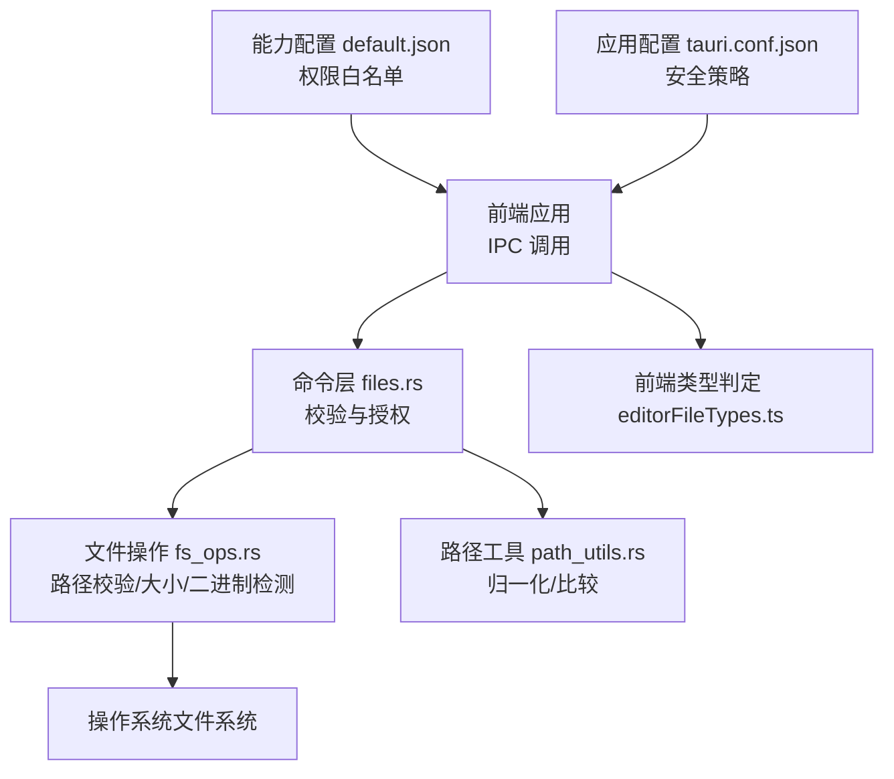
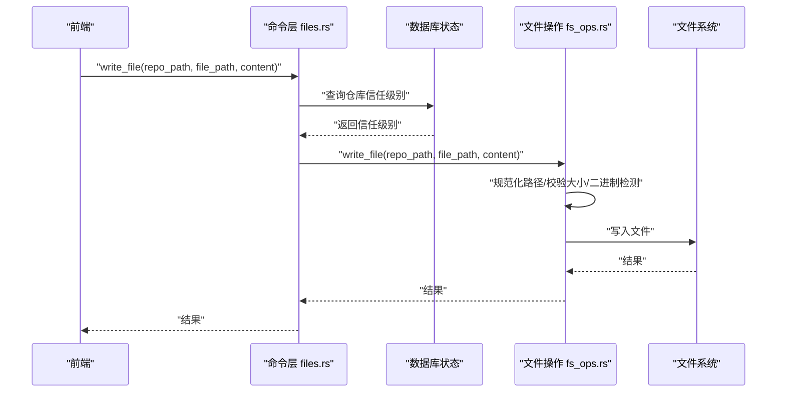
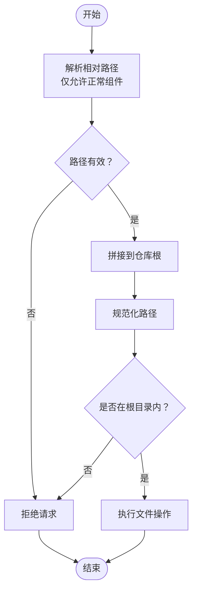
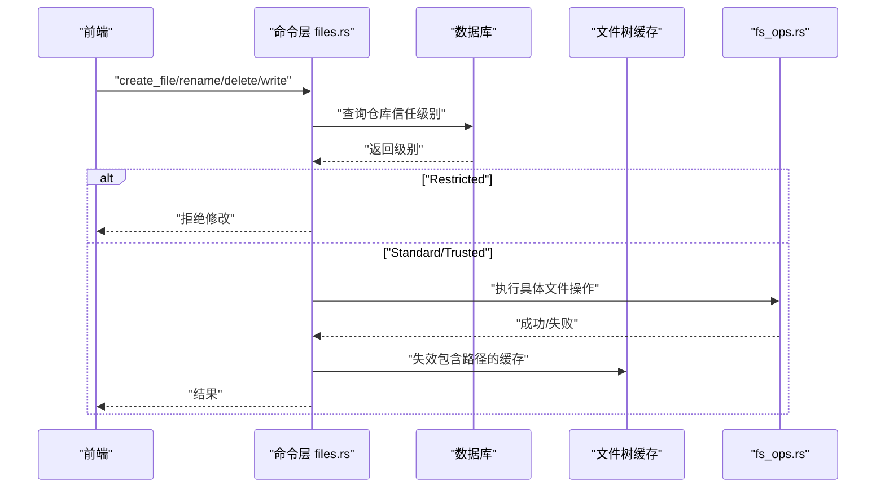
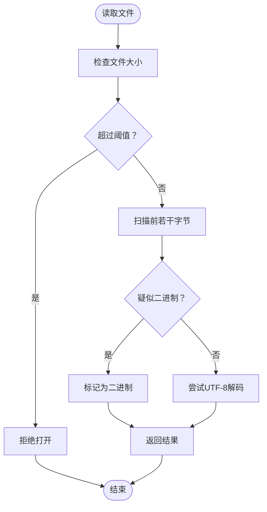
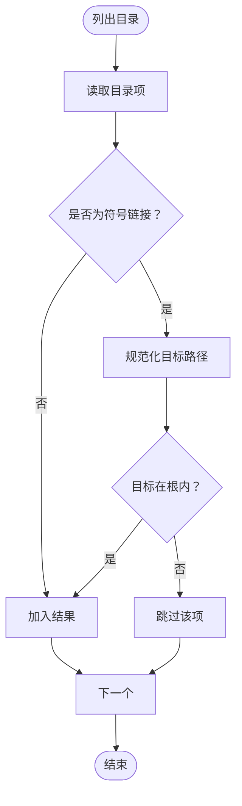
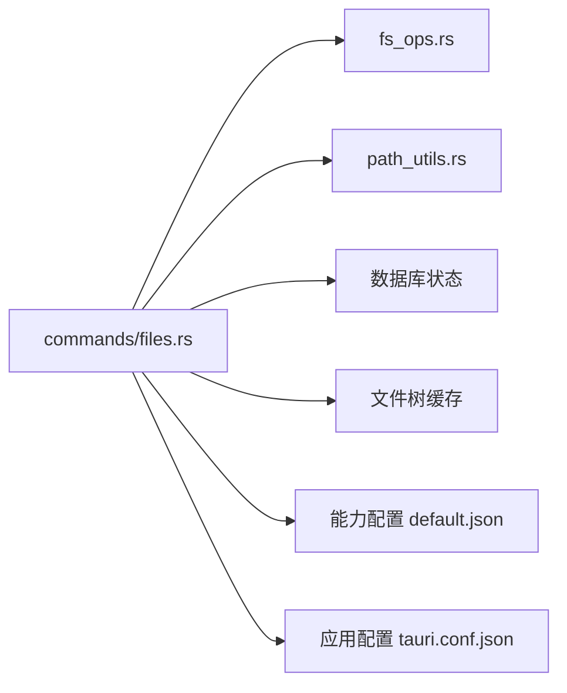

# 安全控制

<cite>
**本文引用的文件**
- [fs_ops.rs](file://src-tauri/src/fs_ops.rs)
- [path_utils.rs](file://src-tauri/src/path_utils.rs)
- [files.rs](file://src-tauri/src/commands/files.rs)
- [default.json](file://src-tauri/capabilities/default.json)
- [tauri.conf.json](file://src-tauri/tauri.conf.json)
- [editorFileTypes.ts](file://src/lib/editorFileTypes.ts)
</cite>

## 目录
1. [简介](#简介)
2. [项目结构](#项目结构)
3. [核心组件](#核心组件)
4. [架构总览](#架构总览)
5. [详细组件分析](#详细组件分析)
6. [依赖关系分析](#依赖关系分析)
7. [性能考量](#性能考量)
8. [故障排查指南](#故障排查指南)
9. [结论](#结论)
10. [附录](#附录)

## 简介
本文件系统安全控制文档聚焦于路径遍历攻击防护、权限验证与访问控制、文件操作白名单、大小限制与类型检查、符号链接安全处理、临时文件管理与恶意路径检测，以及跨平台安全模型差异与合规性建议。通过对 Rust 后端文件操作模块、路径工具、Tauri 能力配置与前端类型判定等代码的深入分析，给出可落地的安全实践与审计方法。

## 项目结构
后端采用 Tauri + Rust 架构，文件操作集中在 src-tauri 子树中；前端通过 IPC 调用后端命令，实现文件浏览、读写、重命名、删除等能力。安全控制的关键点分布在以下模块：
- 文件操作与路径校验：src-tauri/src/fs_ops.rs
- 路径归一化与比较：src-tauri/src/path_utils.rs
- 前端调用入口（命令）：src-tauri/src/commands/files.rs
- 能力与权限声明：src-tauri/capabilities/default.json
- 应用配置与安全策略：src-tauri/tauri.conf.json
- 前端类型判定（辅助安全）：src/lib/editorFileTypes.ts

图表来源
- [files.rs:1-280](file://src-tauri/src/commands/files.rs#L1-L280)
- [fs_ops.rs:1-441](file://src-tauri/src/fs_ops.rs#L1-L441)
- [path_utils.rs:1-143](file://src-tauri/src/path_utils.rs#L1-L143)
- [default.json:1-23](file://src-tauri/capabilities/default.json#L1-L23)
- [tauri.conf.json:1-58](file://src-tauri/tauri.conf.json#L1-L58)
- [editorFileTypes.ts:1-7](file://src/lib/editorFileTypes.ts#L1-L7)

章节来源
- [files.rs:1-280](file://src-tauri/src/commands/files.rs#L1-L280)
- [fs_ops.rs:1-441](file://src-tauri/src/fs_ops.rs#L1-L441)
- [path_utils.rs:1-143](file://src-tauri/src/path_utils.rs#L1-L143)
- [default.json:1-23](file://src-tauri/capabilities/default.json#L1-L23)
- [tauri.conf.json:1-58](file://src-tauri/tauri.conf.json#L1-L58)
- [editorFileTypes.ts:1-7](file://src/lib/editorFileTypes.ts#L1-L7)

## 核心组件
- 路径遍历防护
  - 使用规范化路径与前缀约束，确保所有目标路径位于仓库根内，拒绝越权访问。
  - 对相对路径进行严格解析，仅允许“正常组件”，拒绝包含父目录跳转的路径。
- 权限与信任级别
  - 写入、创建、删除、重命名等操作在命令层根据仓库信任级别进行前置拦截，Restricted 仓库禁止直接修改。
- 文件大小与类型
  - 读取文件存在最大尺寸限制；对二进制内容进行快速扫描以避免在编辑器中打开二进制文件。
- 符号链接处理
  - 列表目录时跳过指向仓库外的符号链接；删除/重命名时区分符号链接与其目标，按条目本身处理。
- 跨平台差异
  - Windows 上对符号链接删除行为有专门分支；路径归一化与大小写敏感性在不同平台上差异化处理。
- 前端类型辅助
  - 前端对特定扩展名（如 Markdown）进行预判，减少不必要加载与渲染风险。

章节来源
- [fs_ops.rs:10-118](file://src-tauri/src/fs_ops.rs#L10-L118)
- [fs_ops.rs:120-298](file://src-tauri/src/fs_ops.rs#L120-L298)
- [fs_ops.rs:299-441](file://src-tauri/src/fs_ops.rs#L299-L441)
- [files.rs:66-177](file://src-tauri/src/commands/files.rs#L66-L177)
- [path_utils.rs:17-85](file://src-tauri/src/path_utils.rs#L17-L85)
- [editorFileTypes.ts:1-7](file://src/lib/editorFileTypes.ts#L1-L7)

## 架构总览
下图展示从前端到后端命令、再到文件系统操作的完整链路，以及关键安全检查点：

图表来源
- [files.rs:66-107](file://src-tauri/src/commands/files.rs#L66-L107)
- [fs_ops.rs:269-298](file://src-tauri/src/fs_ops.rs#L269-L298)

章节来源
- [files.rs:66-107](file://src-tauri/src/commands/files.rs#L66-L107)
- [fs_ops.rs:269-298](file://src-tauri/src/fs_ops.rs#L269-L298)

## 详细组件分析

### 路径遍历防护与白名单
- 相对路径白名单
  - 仅接受“正常组件”的路径片段，拒绝包含父目录跳转或空组件的路径，防止 ../、..\\ 等越权访问。
- 绝对路径与规范化
  - 所有目标路径均进行规范化，并与仓库根进行前缀匹配，确保最终绝对路径仍在根目录之内。
- 目录与文件操作
  - 创建/删除/重命名/写入等操作均在进入文件系统前完成路径合法性校验，避免提前触达文件系统造成破坏。

图表来源
- [fs_ops.rs:13-24](file://src-tauri/src/fs_ops.rs#L13-L24)
- [fs_ops.rs:26-86](file://src-tauri/src/fs_ops.rs#L26-L86)
- [fs_ops.rs:120-177](file://src-tauri/src/fs_ops.rs#L120-L177)
- [fs_ops.rs:269-298](file://src-tauri/src/fs_ops.rs#L269-L298)

章节来源
- [fs_ops.rs:13-24](file://src-tauri/src/fs_ops.rs#L13-L24)
- [fs_ops.rs:26-86](file://src-tauri/src/fs_ops.rs#L26-L86)
- [fs_ops.rs:120-177](file://src-tauri/src/fs_ops.rs#L120-L177)
- [fs_ops.rs:269-298](file://src-tauri/src/fs_ops.rs#L269-L298)

### 权限验证与信任级别
- 命令层拦截
  - 在写入、创建、删除、重命名等用户直接发起的操作中，先查询仓库信任级别，Restricted 仓库直接拒绝。
- 缓存失效
  - 成功操作后使包含该路径的文件树缓存失效，保证 UI 与后端状态一致。

图表来源
- [files.rs:66-177](file://src-tauri/src/commands/files.rs#L66-L177)

章节来源
- [files.rs:66-177](file://src-tauri/src/commands/files.rs#L66-L177)

### 文件大小限制与类型检查
- 大小限制
  - 读取文件时设置最大尺寸阈值，超过阈值的文件不允许在编辑器中打开。
- 类型检查
  - 读取时对文件内容进行快速扫描，若发现二进制特征则标记为二进制，避免在文本编辑器中打开二进制文件导致异常。
- 前端类型辅助
  - 前端对特定扩展名（如 Markdown）进行预判，减少不必要的加载与渲染风险。

图表来源
- [fs_ops.rs:88-118](file://src-tauri/src/fs_ops.rs#L88-L118)
- [editorFileTypes.ts:1-7](file://src/lib/editorFileTypes.ts#L1-L7)

章节来源
- [fs_ops.rs:88-118](file://src-tauri/src/fs_ops.rs#L88-L118)
- [editorFileTypes.ts:1-7](file://src/lib/editorFileTypes.ts#L1-L7)

### 符号链接安全处理
- 列表目录时
  - 若遇到符号链接，尝试规范化其目标；若目标不在仓库根内，则跳过该条目，避免泄露仓库外内容。
- 删除/重命名时
  - 区分符号链接与其目标：删除/重命名作用于符号链接条目本身，而非其指向的目标，避免误删仓库外文件。
- 平台差异
  - Windows 对符号链接删除有专门分支，确保行为符合平台语义。

图表来源
- [fs_ops.rs:56-66](file://src-tauri/src/fs_ops.rs#L56-L66)
- [fs_ops.rs:199-228](file://src-tauri/src/fs_ops.rs#L199-L228)

章节来源
- [fs_ops.rs:56-66](file://src-tauri/src/fs_ops.rs#L56-L66)
- [fs_ops.rs:199-228](file://src-tauri/src/fs_ops.rs#L199-L228)

### 临时文件管理与恶意路径检测
- 临时文件
  - 代码未显式使用系统临时目录；创建新文件时会确保父目录在根内，避免在非预期位置生成文件。
- 恶意路径检测
  - 通过严格的相对路径白名单与规范化路径校验，阻断包含路径遍历、空组件、非法字符等的恶意输入。
  - 前端类型判定可辅助过滤不合适的文件类型，降低误操作风险。

章节来源
- [fs_ops.rs:120-177](file://src-tauri/src/fs_ops.rs#L120-L177)
- [fs_ops.rs:13-24](file://src-tauri/src/fs_ops.rs#L13-L24)
- [editorFileTypes.ts:1-7](file://src/lib/editorFileTypes.ts#L1-L7)

### 跨平台安全模型差异
- Windows
  - 符号链接删除行为与 Unix 不同，代码中针对 Windows 进行了分支处理；路径前缀规范化与大小写敏感性在 Windows 上有特殊处理。
- Unix/Linux
  - 支持符号链接的语义删除与重命名；路径比较大小写敏感性取决于平台与路径形式。
- 路径归一化
  - 提供 Windows 原始路径与 verbatim 前缀的转换与剥离，统一路径表示，减少比较误差。

章节来源
- [fs_ops.rs:203-216](file://src-tauri/src/fs_ops.rs#L203-L216)
- [path_utils.rs:31-70](file://src-tauri/src/path_utils.rs#L31-L70)
- [path_utils.rs:72-85](file://src-tauri/src/path_utils.rs#L72-L85)

## 依赖关系分析
- 命令层依赖数据库状态（信任级别）、文件树缓存与文件操作模块。
- 文件操作模块依赖路径工具与标准库文件系统接口。
- 能力配置与应用配置决定前端可用能力与安全策略。

图表来源
- [files.rs:1-280](file://src-tauri/src/commands/files.rs#L1-L280)
- [fs_ops.rs:1-441](file://src-tauri/src/fs_ops.rs#L1-L441)
- [path_utils.rs:1-143](file://src-tauri/src/path_utils.rs#L1-L143)
- [default.json:1-23](file://src-tauri/capabilities/default.json#L1-L23)
- [tauri.conf.json:1-58](file://src-tauri/tauri.conf.json#L1-L58)

章节来源
- [files.rs:1-280](file://src-tauri/src/commands/files.rs#L1-L280)
- [fs_ops.rs:1-441](file://src-tauri/src/fs_ops.rs#L1-L441)
- [path_utils.rs:1-143](file://src-tauri/src/path_utils.rs#L1-L143)
- [default.json:1-23](file://src-tauri/capabilities/default.json#L1-L23)
- [tauri.conf.json:1-58](file://src-tauri/tauri.conf.json#L1-L58)

## 性能考量
- I/O 阻塞与并发
  - 文件操作通过线程池执行，避免阻塞事件循环；列表目录时对不可读条目进行日志记录并跳过，提升鲁棒性。
- 二进制检测
  - 仅扫描固定大小的头部字节，开销极低，适合高频读取场景。
- 缓存一致性
  - 成功修改后主动失效相关缓存，避免重复读取旧数据带来的额外 I/O。

章节来源
- [files.rs:23-27](file://src-tauri/src/commands/files.rs#L23-L27)
- [files.rs:102-103](file://src-tauri/src/commands/files.rs#L102-L103)
- [fs_ops.rs:42-49](file://src-tauri/src/fs_ops.rs#L42-L49)
- [fs_ops.rs](file://src-tauri/src/fs_ops.rs#L107)

## 故障排查指南
- 路径遍历被拒
  - 检查路径是否包含父目录跳转或空组件；确认仓库根与目标路径的规范化结果。
- 文件过大无法打开
  - 调整文件大小阈值或改用外部工具打开；前端可基于类型判定避免尝试打开不支持的文件。
- 符号链接异常
  - 列表目录时会跳过指向仓库外的符号链接；删除/重命名时应确认作用对象为符号链接条目本身。
- Windows 下符号链接删除失败
  - 确认平台分支逻辑与目标类型（文件/目录），必要时使用系统工具辅助诊断。
- 信任级别导致写入被拒
  - 将仓库信任级别调整为 Standard 或 Trusted 后再执行写入操作。

章节来源
- [fs_ops.rs:38-39](file://src-tauri/src/fs_ops.rs#L38-L39)
- [fs_ops.rs:102-105](file://src-tauri/src/fs_ops.rs#L102-L105)
- [fs_ops.rs:56-66](file://src-tauri/src/fs_ops.rs#L56-L66)
- [fs_ops.rs:203-216](file://src-tauri/src/fs_ops.rs#L203-L216)
- [files.rs:94-99](file://src-tauri/src/commands/files.rs#L94-L99)

## 结论
本项目在文件系统安全方面采取了多层防护：严格的相对路径白名单、规范化路径与根目录前缀校验、信任级别的前置拦截、文件大小与类型检查、符号链接的安全处理，以及跨平台差异化的实现。配合前端类型判定与缓存一致性策略，整体具备良好的安全性与可维护性。建议持续关注能力配置与应用安全策略，定期进行安全审计与回归测试。

## 附录
- 安全配置清单
  - 能力白名单：仅授予必要的文件系统读写权限。
  - 应用安全策略：结合 CSP、权限控制与最小暴露原则。
- 漏洞防护策略
  - 输入校验：始终对路径进行白名单与规范化处理。
  - 最小权限：按仓库信任级别动态放行操作。
  - 二进制保护：对二进制文件进行快速检测与规避。
- 安全审计方法
  - 单元测试覆盖路径遍历、符号链接、大小限制等关键场景。
  - 端到端测试验证跨平台行为一致性。
  - 日志与告警：记录不可读目录项与拒绝操作，便于追踪与审计。