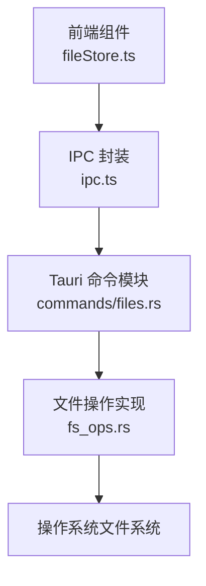
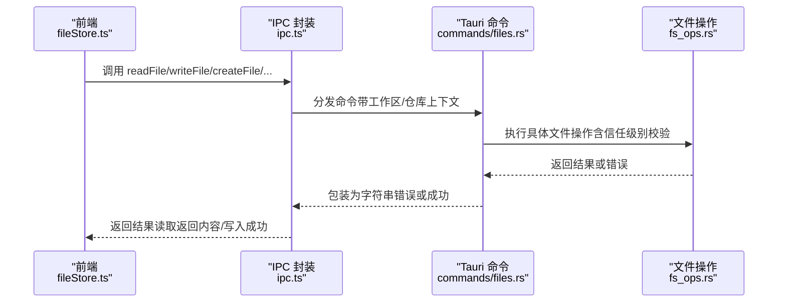
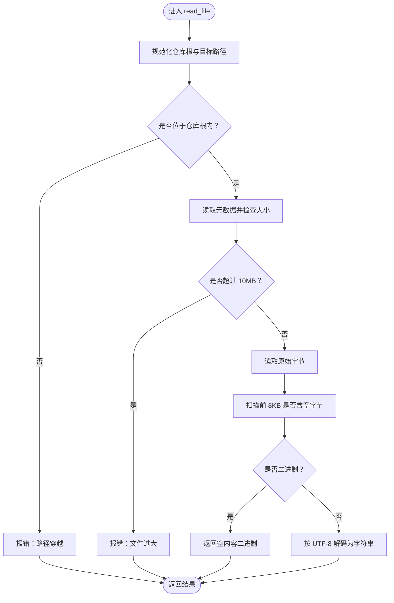
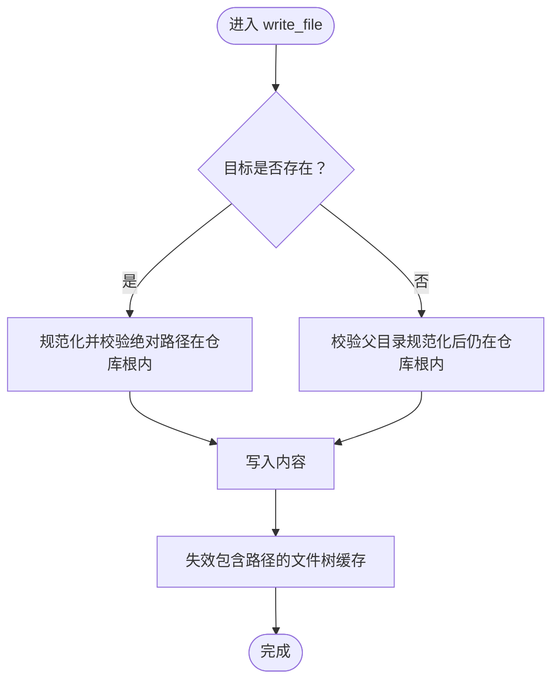
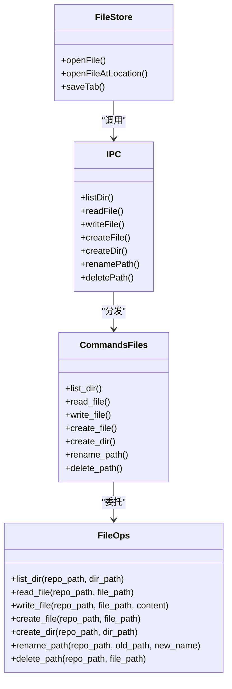
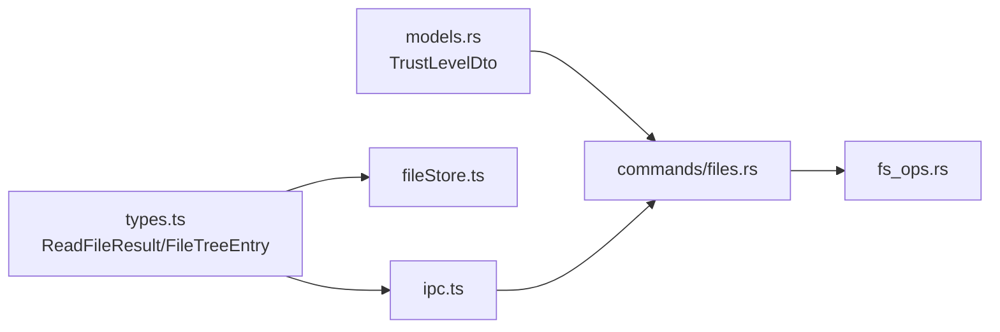

# 文件操作

<cite>
**本文引用的文件**
- [fs_ops.rs](file://src-tauri/src/fs_ops.rs)
- [files.rs](file://src-tauri/src/commands/files.rs)
- [ipc.ts](file://src/lib/ipc.ts)
- [fileStore.ts](file://src/stores/fileStore.ts)
- [models.rs](file://src-tauri/src/models.rs)
- [types.ts](file://src/types.ts)
- [repo.rs](file://src-tauri/src/git/repo.rs)
- [claude_code_native.rs](file://src-tauri/src/engines/claude_code_native.rs)
</cite>

## 目录
1. [简介](#简介)
2. [项目结构](#项目结构)
3. [核心组件](#核心组件)
4. [架构总览](#架构总览)
5. [详细组件分析](#详细组件分析)
6. [依赖关系分析](#依赖关系分析)
7. [性能考量](#性能考量)
8. [故障排查指南](#故障排查指南)
9. [结论](#结论)
10. [附录](#附录)

## 简介
本文件系统化梳理了 Panes 应用中的文件操作能力，覆盖读取、写入、创建、删除、重命名等核心操作，并深入解析以下关键点：
- 文件内容读取限制（10MB）
- 二进制文件检测机制
- UTF-8 编码处理策略
- 错误处理与安全验证（路径规范化、防路径穿越、权限检查）
- 跨平台文件操作差异与兼容性处理
- 最佳实践、性能优化与常见问题解决方案

## 项目结构
文件操作相关代码主要分布在前端 IPC 层、Tauri 命令层与 Rust 后端文件操作模块之间，形成“前端调用 → IPC 封装 → Tauri 命令 → 文件系统操作”的链路。

图示来源
- [fileStore.ts:205-273](file://src/stores/fileStore.ts#L205-L273)
- [ipc.ts:441-512](file://src/lib/ipc.ts#L441-L512)
- [files.rs:18-107](file://src-tauri/src/commands/files.rs#L18-L107)
- [fs_ops.rs:26-298](file://src-tauri/src/fs_ops.rs#L26-L298)

章节来源
- [fileStore.ts:205-273](file://src/stores/fileStore.ts#L205-L273)
- [ipc.ts:441-512](file://src/lib/ipc.ts#L441-L512)
- [files.rs:18-107](file://src-tauri/src/commands/files.rs#L18-L107)
- [fs_ops.rs:26-298](file://src-tauri/src/fs_ops.rs#L26-L298)

## 核心组件
- 前端存储与交互
  - 文件打开/保存流程由文件存储管理，负责调用 IPC 并处理编辑器渲染模式与二进制文件显示策略。
- IPC 封装
  - 统一暴露 list_dir、read_file、write_file、create_file、create_dir、rename_path、delete_path 等方法，供前端使用。
- Tauri 命令
  - 将前端请求路由到对应命令函数，执行信任级别校验与缓存失效等逻辑。
- 文件系统操作
  - 在 Rust 中实现具体文件操作，包含路径规范化、防路径穿越、大小限制、二进制检测与 UTF-8 处理等。

章节来源
- [fileStore.ts:205-273](file://src/stores/fileStore.ts#L205-L273)
- [ipc.ts:441-512](file://src/lib/ipc.ts#L441-L512)
- [files.rs:18-107](file://src-tauri/src/commands/files.rs#L18-L107)
- [fs_ops.rs:26-298](file://src-tauri/src/fs_ops.rs#L26-L298)

## 架构总览
下图展示了从用户在编辑器中打开/保存文件，到后端执行文件操作的完整序列：

图示来源
- [fileStore.ts:205-273](file://src/stores/fileStore.ts#L205-L273)
- [ipc.ts:441-512](file://src/lib/ipc.ts#L441-L512)
- [files.rs:18-107](file://src-tauri/src/commands/files.rs#L18-L107)
- [fs_ops.rs:26-298](file://src-tauri/src/fs_ops.rs#L26-L298)

## 详细组件分析

### 读取文件（read_file）
- 功能要点
  - 路径规范化与防路径穿越：对仓库根与目标路径进行规范化，并确保最终路径位于仓库根内。
  - 大小限制：超过 10MB 的文件拒绝打开（避免编辑器卡顿与内存压力）。
  - 二进制检测：扫描前 8KB 字节，若发现空字节则判定为二进制，不进行 UTF-8 解码。
  - UTF-8 处理：非二进制文件按 UTF-8 解码为字符串返回。
- 性能与体验
  - 对大文件采用“只读”策略，避免阻塞 UI；二进制文件以纯文本展示时为空内容，提示用户改用外部工具查看。
- 错误处理
  - 文件不存在、不可读、超出大小限制、路径穿越等均抛出明确错误。

图示来源
- [fs_ops.rs:88-118](file://src-tauri/src/fs_ops.rs#L88-L118)

章节来源
- [fs_ops.rs:88-118](file://src-tauri/src/fs_ops.rs#L88-L118)
- [fileStore.ts:245-272](file://src/stores/fileStore.ts#L245-L272)

### 写入文件（write_file）
- 安全与权限
  - 若目标已存在，先规范化并校验其绝对路径仍在仓库根内；否则校验父目录规范化后仍处于仓库根内。
  - 防止路径穿越与越权写入。
- 信任级别控制
  - 在命令层根据仓库信任级别（Trusted/Standard/Restricted）决定是否允许写入，Restricted 仓库默认禁止修改。
- 缓存一致性
  - 写入成功后使包含该路径的文件树缓存失效，保证后续列表/搜索结果一致。

图示来源
- [fs_ops.rs:269-298](file://src-tauri/src/fs_ops.rs#L269-L298)
- [files.rs:66-107](file://src-tauri/src/commands/files.rs#L66-L107)

章节来源
- [fs_ops.rs:269-298](file://src-tauri/src/fs_ops.rs#L269-L298)
- [files.rs:66-107](file://src-tauri/src/commands/files.rs#L66-L107)
- [models.rs:33-57](file://src-tauri/src/models.rs#L33-L57)

### 创建文件（create_file）
- 行为
  - 校验相对路径仅包含正常组件（不含父目录跳转），并在必要时递归创建缺失的父级目录。
  - 确保目标文件不存在，防止覆盖已有文件。
- 安全
  - 先验证父目录规范化后仍在仓库根内，再创建文件，避免路径穿越。

章节来源
- [fs_ops.rs:120-154](file://src-tauri/src/fs_ops.rs#L120-L154)

### 创建目录（create_dir）
- 行为
  - 递归查找最深存在的祖先目录，确认其规范化后仍在仓库根内，再创建目标目录。
- 安全
  - 防止通过父目录组件逃逸仓库根。

章节来源
- [fs_ops.rs:156-177](file://src-tauri/src/fs_ops.rs#L156-L177)

### 删除文件/目录（delete_path）
- 行为
  - 支持删除普通文件、目录与符号链接；对符号链接在不同平台采用差异化处理。
- 安全
  - 不允许删除仓库根；对符号链接优先删除链接本身而非目标。

章节来源
- [fs_ops.rs:260-267](file://src-tauri/src/fs_ops.rs#L260-L267)
- [fs_ops.rs:199-228](file://src-tauri/src/fs_ops.rs#L199-L228)

### 重命名（rename_path）
- 行为
  - 校验新名称不含路径组件（仅文件/文件夹名），确保不会引入路径穿越。
  - 允许仅大小写变化的重命名；对符号链接重命名时作用于链接项而非目标。
- 安全
  - 源路径规范化后必须位于仓库根内；目标若已存在需确保其绝对路径与源相同，避免覆盖其他文件。

章节来源
- [fs_ops.rs:239-258](file://src-tauri/src/fs_ops.rs#L239-L258)
- [fs_ops.rs:300-440](file://src-tauri/src/fs_ops.rs#L300-L440)

### 列表目录（list_dir）
- 行为
  - 规范化目标目录，确保位于仓库根内且为目录。
  - 忽略 .git 目录与指向仓库外的符号链接。
  - 排序：目录优先于文件，同组内按路径排序。
- 性能
  - 对不可读目录条目进行日志记录并跳过，避免中断遍历。

章节来源
- [fs_ops.rs:26-86](file://src-tauri/src/fs_ops.rs#L26-L86)

### 跨平台差异与兼容性
- Windows
  - 删除符号链接时区分目录与文件类型，分别调用相应 API。
- Unix（含 macOS/Linux）
  - 统一删除符号链接文件；测试覆盖了符号链接重命名与删除行为。
- 路径规范化
  - 使用标准化的规范化流程，确保在不同平台上行为一致。

章节来源
- [fs_ops.rs:203-217](file://src-tauri/src/fs_ops.rs#L203-L217)
- [fs_ops.rs:307-424](file://src-tauri/src/fs_ops.rs#L307-L424)

### 类关系与职责

图示来源
- [fileStore.ts:205-273](file://src/stores/fileStore.ts#L205-L273)
- [ipc.ts:441-512](file://src/lib/ipc.ts#L441-L512)
- [files.rs:18-248](file://src-tauri/src/commands/files.rs#L18-L248)
- [fs_ops.rs:26-298](file://src-tauri/src/fs_ops.rs#L26-L298)

## 依赖关系分析
- 前端依赖
  - fileStore.ts 依赖 ipc.ts 提供的统一接口，负责打开文件、保存文件、切换渲染模式与处理二进制文件显示。
- IPC 与命令
  - ipc.ts 暴露的方法映射到 commands/files.rs 的命令实现，后者负责信任级别与缓存一致性处理。
- 命令与文件操作
  - commands/files.rs 调用 fs_ops.rs 实现具体文件系统操作，严格遵循路径规范化与安全校验。
- 类型与模型
  - types.ts 定义 ReadFileResult、FileTreeEntry 等类型；models.rs 定义信任级别枚举，用于命令层的访问控制。

图示来源
- [types.ts:837-860](file://src/types.ts#L837-L860)
- [ipc.ts:441-512](file://src/lib/ipc.ts#L441-L512)
- [fileStore.ts:205-273](file://src/stores/fileStore.ts#L205-L273)
- [models.rs:33-57](file://src-tauri/src/models.rs#L33-L57)
- [files.rs:18-107](file://src-tauri/src/commands/files.rs#L18-L107)
- [fs_ops.rs:26-298](file://src-tauri/src/fs_ops.rs#L26-L298)

章节来源
- [types.ts:837-860](file://src/types.ts#L837-L860)
- [models.rs:33-57](file://src-tauri/src/models.rs#L33-L57)
- [ipc.ts:441-512](file://src/lib/ipc.ts#L441-L512)
- [fileStore.ts:205-273](file://src/stores/fileStore.ts#L205-L273)
- [files.rs:18-107](file://src-tauri/src/commands/files.rs#L18-L107)
- [fs_ops.rs:26-298](file://src-tauri/src/fs_ops.rs#L26-L298)

## 性能考量
- 读取限制
  - 10MB 上限避免大文件加载导致 UI 卡顿与内存占用过高。
- 二进制检测
  - 仅扫描前 8KB 判断二进制，兼顾准确性与性能。
- 目录遍历
  - 忽略 .git 与仓库外符号链接，减少无效 IO；对不可读条目进行跳过并记录日志。
- 缓存一致性
  - 写入成功后失效相关路径的文件树缓存，避免后续读取陈旧数据。
- 跨平台差异
  - Windows 与 Unix 对符号链接处理不同，减少不必要的系统调用开销。

章节来源
- [fs_ops.rs:10-11](file://src-tauri/src/fs_ops.rs#L10-L11)
- [fs_ops.rs:52-66](file://src-tauri/src/fs_ops.rs#L52-L66)
- [files.rs:101-106](file://src-tauri/src/commands/files.rs#L101-L106)

## 故障排查指南
- “路径穿越”错误
  - 现象：尝试访问仓库根之外的路径被拒绝。
  - 原因：路径包含父目录组件或规范化后逃逸。
  - 处理：确保传入的相对路径仅包含正常组件，且最终路径位于仓库根内。
- “文件过大”错误
  - 现象：超过 10MB 的文件无法在编辑器中打开。
  - 原因：读取限制。
  - 处理：使用外部工具打开或拆分文件。
- “二进制文件”
  - 现象：编辑器显示空内容或以二进制模式打开。
  - 原因：检测到空字节。
  - 处理：使用支持二进制的编辑器或十六进制查看器。
- “写入受限”
  - 现象：Restricted 仓库无法修改文件。
  - 原因：信任级别限制。
  - 处理：提升信任级别或在受信任仓库中操作。
- “符号链接行为异常”
  - 现象：重命名/删除符号链接未按预期。
  - 原因：平台差异与链接目标判断。
  - 处理：确认链接类型与目标路径，测试覆盖已包含 Unix 行为。

章节来源
- [fs_ops.rs:88-118](file://src-tauri/src/fs_ops.rs#L88-L118)
- [fs_ops.rs:120-154](file://src-tauri/src/fs_ops.rs#L120-L154)
- [fs_ops.rs:156-177](file://src-tauri/src/fs_ops.rs#L156-L177)
- [fs_ops.rs:239-258](file://src-tauri/src/fs_ops.rs#L239-L258)
- [fs_ops.rs:260-267](file://src-tauri/src/fs_ops.rs#L260-L267)
- [fs_ops.rs:307-424](file://src-tauri/src/fs_ops.rs#L307-L424)
- [models.rs:33-57](file://src-tauri/src/models.rs#L33-L57)

## 结论
本文件操作体系通过严格的路径规范化、防路径穿越与大小/二进制检测，在保障安全性的同时兼顾性能与用户体验。命令层的信任级别控制与缓存一致性维护进一步增强了系统的可靠性。建议在实际使用中遵循本文最佳实践，以获得稳定高效的文件操作体验。

## 附录

### 关键配置与常量
- 读取上限：10MB
- 二进制检测扫描长度：8KB
- 信任级别：Trusted / Standard / Restricted

章节来源
- [fs_ops.rs:10-11](file://src-tauri/src/fs_ops.rs#L10-L11)
- [models.rs:33-57](file://src-tauri/src/models.rs#L33-L57)

### 路径规范化与工作区根
- 工作区根路径规范化与相对路径解析在多处使用，确保跨引擎与工作区场景下的路径一致性。
- 示例参考：工作区根规范化、相对路径解析、拥有仓库定位等工具函数。

章节来源
- [claude_code_native.rs:175-206](file://src-tauri/src/engines/claude_code_native.rs#L175-L206)
- [repo.rs:1016-1277](file://src-tauri/src/git/repo.rs#L1016-L1277)