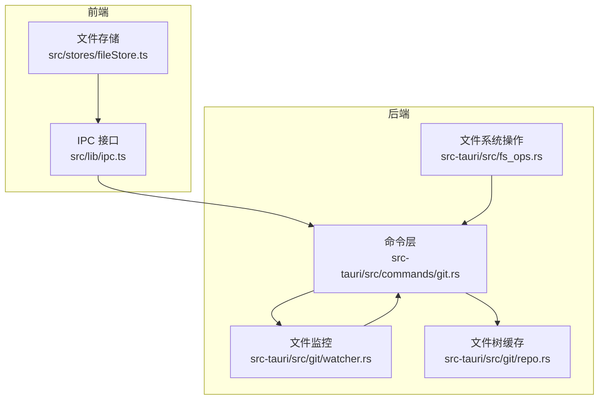
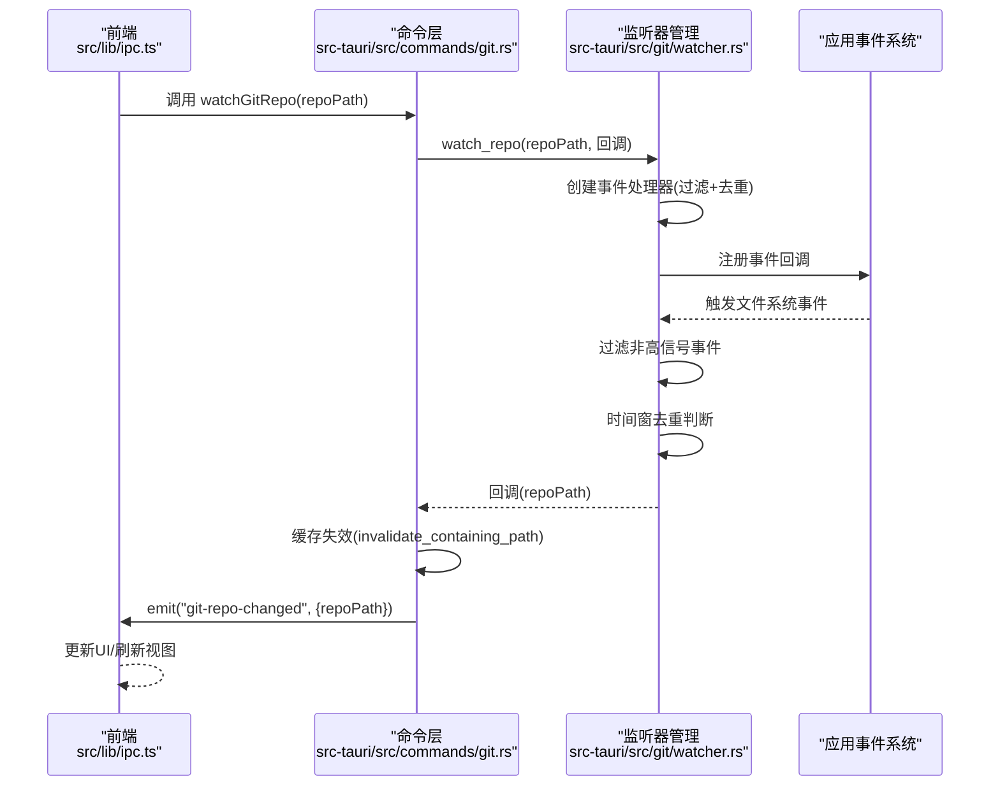
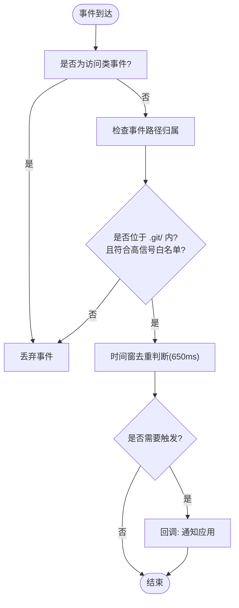
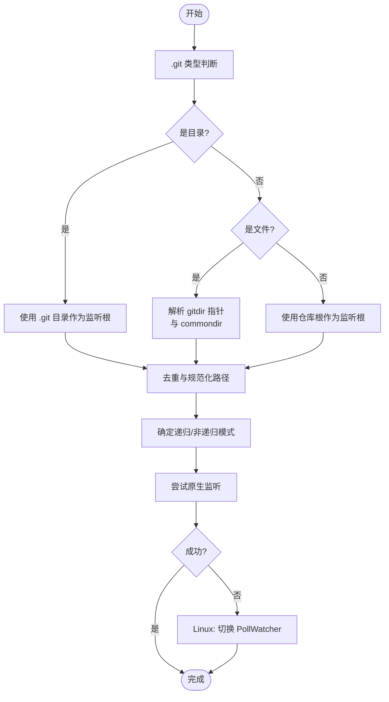
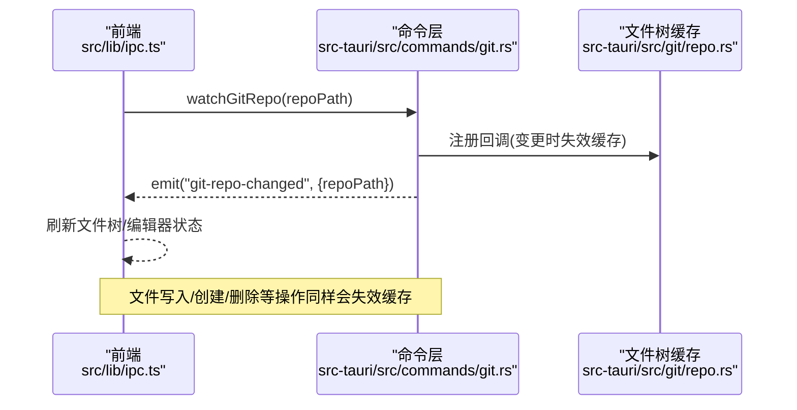
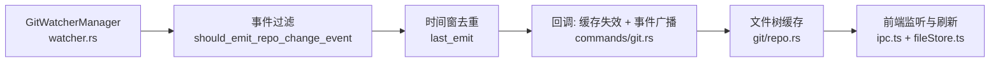

# 文件监控

<cite>
**本文档引用的文件**
- [watcher.rs](file://src-tauri/src/git/watcher.rs)
- [git.rs](file://src-tauri/src/commands/git.rs)
- [files.rs](file://src-tauri/src/commands/files.rs)
- [fs_ops.rs](file://src-tauri/src/fs_ops.rs)
- [ipc.ts](file://src/lib/ipc.ts)
- [fileStore.ts](file://src/stores/fileStore.ts)
- [repo.rs](file://src-tauri/src/git/repo.rs)
</cite>

## 目录
1. [简介](#简介)
2. [项目结构](#项目结构)
3. [核心组件](#核心组件)
4. [架构总览](#架构总览)
5. [详细组件分析](#详细组件分析)
6. [依赖关系分析](#依赖关系分析)
7. [性能考量](#性能考量)
8. [故障排查指南](#故障排查指南)
9. [结论](#结论)
10. [附录](#附录)

## 简介
本文件监控方案围绕 Git 仓库变更事件展开，通过操作系统级文件系统事件监听（基于 notify 库）与降噪策略相结合，实现对仓库元数据变化的高可靠、低噪声的实时感知。监控范围聚焦于 Git 元数据目录（如 .git/HEAD、index、refs/* 等），避免对工作区大文件或忽略目录（如 node_modules）进行递归监听，从而在性能与准确性之间取得平衡。

该方案包含以下关键能力：
- 事件监听与过滤：仅接收与 Git 元数据相关的变更事件，并对访问类事件进行过滤。
- 去重与节流：通过时间窗去重与事件合并，降低重复刷新带来的开销。
- 跨平台兼容：在 Linux 上遇到 inotify 限制时自动回退到轮询模式，确保稳定性。
- 集成与通知：变更发生后触发应用内缓存失效与前端事件广播，驱动 UI 实时更新。
- 大文件与批量变更优化：通过缓存 TTL、分页扫描与阈值控制，避免大文件与大量变更导致的性能问题。

## 项目结构
文件监控相关代码主要分布在 Rust 后端与 TypeScript 前端两部分：
- 后端（Rust）
  - 监听器与事件处理：src-tauri/src/git/watcher.rs
  - 命令接口：src-tauri/src/commands/git.rs
  - 文件系统操作与安全校验：src-tauri/src/fs_ops.rs
  - 文件树缓存与失效：src-tauri/src/git/repo.rs
- 前端（TypeScript）
  - IPC 接口与事件监听：src/lib/ipc.ts
  - 编辑器状态与文件操作：src/stores/fileStore.ts

**图表来源**
- [ipc.ts:513-513](file://src/lib/ipc.ts#L513-L513)
- [git.rs:330-350](file://src-tauri/src/commands/git.rs#L330-L350)
- [watcher.rs:24-55](file://src-tauri/src/git/watcher.rs#L24-L55)
- [fs_ops.rs:120-298](file://src-tauri/src/fs_ops.rs#L120-L298)
- [repo.rs:66-127](file://src-tauri/src/git/repo.rs#L66-L127)

**章节来源**
- [watcher.rs:1-519](file://src-tauri/src/git/watcher.rs#L1-L519)
- [git.rs:330-350](file://src-tauri/src/commands/git.rs#L330-L350)
- [ipc.ts:513-513](file://src/lib/ipc.ts#L513-L513)
- [repo.rs:66-127](file://src-tauri/src/git/repo.rs#L66-L127)

## 核心组件
- GitWatcherManager：负责为指定仓库路径创建并管理监听器，维护每个仓库的最后触发时间戳以实现去重。
- 事件处理器：对接 notify 的事件回调，执行过滤逻辑（仅允许特定 Git 元数据变更）、时间窗去重与最终回调。
- 命令接口 watch_git_repo：对外暴露监听入口，内部构建回调，触发缓存失效与前端事件广播。
- 文件树缓存：按仓库路径缓存文件树结果，支持按路径失效与 TTL 清理，配合监听器实现增量刷新。
- IPC 层：前端通过 ipc.watchGitRepo 发起监听，后端通过 emit 广播 git-repo-changed 事件，前端监听并更新 UI。

**章节来源**
- [watcher.rs:18-55](file://src-tauri/src/git/watcher.rs#L18-L55)
- [watcher.rs:195-229](file://src-tauri/src/git/watcher.rs#L195-L229)
- [git.rs:330-350](file://src-tauri/src/commands/git.rs#L330-L350)
- [repo.rs:66-127](file://src-tauri/src/git/repo.rs#L66-L127)
- [ipc.ts:640-644](file://src/lib/ipc.ts#L640-L644)

## 架构总览
下图展示了从前端发起监听到事件传播与缓存失效的整体流程：

**图表来源**
- [ipc.ts:513-513](file://src/lib/ipc.ts#L513-L513)
- [git.rs:330-350](file://src-tauri/src/commands/git.rs#L330-L350)
- [watcher.rs:24-55](file://src-tauri/src/git/watcher.rs#L24-L55)
- [watcher.rs:195-229](file://src-tauri/src/git/watcher.rs#L195-L229)
- [repo.rs:113-126](file://src-tauri/src/git/repo.rs#L113-L126)

## 详细组件分析

### 组件一：事件过滤与去重策略
- 事件过滤
  - 忽略纯访问类事件（Access），这类事件通常不表示内容变更。
  - 仅允许 .git/ 下的高信号路径（如 HEAD、index、refs/*、FETCH_HEAD、packed-refs 等）进入后续处理。
  - 对外部链接的工作树（linked worktree）与 commondir 场景进行路径解析与白名单匹配。
- 去重与节流
  - 使用 last_emit 映射记录每个仓库上次触发时间。
  - 在固定时间窗（约 650ms）内，相同仓库的多次事件被合并为一次触发，避免抖动。
- 跨平台回退
  - 在 Linux 上遇到 MaxFilesWatch 或 No space left on device 等错误时，自动切换到轮询模式（PollWatcher），提高稳定性。

**图表来源**
- [watcher.rs:320-361](file://src-tauri/src/git/watcher.rs#L320-L361)
- [watcher.rs:212-228](file://src-tauri/src/git/watcher.rs#L212-L228)
- [watcher.rs:231-252](file://src-tauri/src/git/watcher.rs#L231-L252)

**章节来源**
- [watcher.rs:254-361](file://src-tauri/src/git/watcher.rs#L254-L361)
- [watcher.rs:212-228](file://src-tauri/src/git/watcher.rs#L212-L228)
- [watcher.rs:231-252](file://src-tauri/src/git/watcher.rs#L231-L252)

### 组件二：监听器创建与路径解析
- 路径解析
  - 若 .git 是目录：直接监听该目录。
  - 若 .git 是文件（gitdir 指针）：解析指向的实际 .git 目录，并尝试解析 commondir。
  - 去重：对多个可能的监听根路径进行去重，避免重复监听。
- 监听模式
  - 目录使用递归监听；单文件路径（如 .git 指针文件）使用非递归监听。
- 回退策略
  - 当监听初始化失败且满足 Linux 特定错误条件时，改用 PollWatcher，轮询间隔 2 秒。

**图表来源**
- [watcher.rs:102-122](file://src-tauri/src/git/watcher.rs#L102-L122)
- [watcher.rs:139-171](file://src-tauri/src/git/watcher.rs#L139-L171)
- [watcher.rs:177-185](file://src-tauri/src/git/watcher.rs#L177-L185)
- [watcher.rs:187-193](file://src-tauri/src/git/watcher.rs#L187-L193)
- [watcher.rs:74-99](file://src-tauri/src/git/watcher.rs#L74-L99)

**章节来源**
- [watcher.rs:102-193](file://src-tauri/src/git/watcher.rs#L102-L193)
- [watcher.rs:74-99](file://src-tauri/src/git/watcher.rs#L74-L99)

### 组件三：命令接口与前端集成
- 命令 watch_git_repo
  - 构建回调：在收到变更通知后，先使相关缓存失效，再通过 emit 广播 git-repo-changed 事件。
  - 前端监听：ipc.listenGitRepoChanged 订阅事件，触发 UI 刷新。
- 文件写入/创建/删除等操作
  - 所有文件操作均通过命令层执行，操作完成后主动使缓存失效，确保 UI 与缓存一致性。

**图表来源**
- [git.rs:330-350](file://src-tauri/src/commands/git.rs#L330-L350)
- [repo.rs:113-126](file://src-tauri/src/git/repo.rs#L113-L126)
- [ipc.ts:640-644](file://src/lib/ipc.ts#L640-L644)

**章节来源**
- [git.rs:330-350](file://src-tauri/src/commands/git.rs#L330-L350)
- [ipc.ts:640-644](file://src/lib/ipc.ts#L640-L644)
- [repo.rs:113-126](file://src-tauri/src/git/repo.rs#L113-L126)

### 组件四：大文件监控优化与批量变更处理
- 大文件打开限制
  - 后端对打开文件大小设置上限（默认 10MB），超过则拒绝打开，避免大文件拖慢 UI。
- 文件树扫描与缓存
  - 文件树扫描采用分页（默认 2000，最大 5000），并设置最大扫描条目数与超时，防止长时间阻塞。
  - 缓存 TTL 为 30 秒，过期自动清理，避免陈旧数据影响体验。
- 批量变更处理
  - 通过事件去重与缓存失效策略，将多次快速变更合并为一次刷新，减少 UI 重绘次数。

**章节来源**
- [fs_ops.rs:10-118](file://src-tauri/src/fs_ops.rs#L10-L118)
- [repo.rs:22-26](file://src-tauri/src/git/repo.rs#L22-L26)
- [repo.rs:81-106](file://src-tauri/src/git/repo.rs#L81-L106)

### 组件五：跨平台差异与事件可靠性
- Linux
  - 原生监听可能受 inotify 句柄限制（MaxFilesWatch）或磁盘空间不足错误影响，自动回退到 PollWatcher。
- macOS/Windows
  - 默认使用推荐的原生监听器，无需额外回退。
- 事件可靠性
  - 通过白名单过滤与时间窗去重，降低误报与抖动。
  - 缓存失效与前端事件广播确保即使监听器偶发遗漏，也能通过后续操作或轮询得到修复。

**章节来源**
- [watcher.rs:231-252](file://src-tauri/src/git/watcher.rs#L231-L252)

## 依赖关系分析
- 组件耦合
  - GitWatcherManager 与命令层（watch_git_repo）强耦合，后者负责注册回调与事件广播。
  - 事件处理器依赖 should_emit_repo_change_event 与去重逻辑，二者共同决定是否触发回调。
  - 文件树缓存与命令层紧密协作，变更时主动失效，保证 UI 与缓存一致。
- 外部依赖
  - notify 库提供跨平台文件系统事件监听；Linux 下可能触发回退至 PollWatcher。
  - git2 与 CLI 方式用于 Git 状态与比较等场景，与监控解耦但共享缓存与失效策略。

**图表来源**
- [watcher.rs:195-229](file://src-tauri/src/git/watcher.rs#L195-L229)
- [git.rs:336-343](file://src-tauri/src/commands/git.rs#L336-L343)
- [repo.rs:113-126](file://src-tauri/src/git/repo.rs#L113-L126)
- [ipc.ts:640-644](file://src/lib/ipc.ts#L640-L644)
- [fileStore.ts:501-549](file://src/stores/fileStore.ts#L501-L549)

**章节来源**
- [watcher.rs:195-229](file://src-tauri/src/git/watcher.rs#L195-L229)
- [git.rs:336-343](file://src-tauri/src/commands/git.rs#L336-L343)
- [repo.rs:113-126](file://src-tauri/src/git/repo.rs#L113-L126)
- [ipc.ts:640-644](file://src/lib/ipc.ts#L640-L644)
- [fileStore.ts:501-549](file://src/stores/fileStore.ts#L501-L549)

## 性能考量
- 监听范围最小化：仅监听 .git/ 下的高信号路径，避免对 node_modules 等大型目录进行递归监听。
- 去重与节流：650ms 时间窗去重有效抑制高频小变更引发的抖动。
- 缓存策略：文件树缓存 TTL 30 秒，分页扫描与最大条目限制，避免长时间扫描阻塞。
- 大文件保护：打开文件大小上限 10MB，防止大文件拖慢 UI。
- 轮询回退：Linux 下自动切换 PollWatcher，提升稳定性，代价是 CPU 占用增加与延迟上升。

[本节为通用性能讨论，不直接分析具体文件，故无“章节来源”]

## 故障排查指南
- 事件未触发
  - 检查事件是否为访问类事件（会被过滤）。
  - 确认变更路径是否位于 .git/ 白名单内。
  - 查看是否存在短时间内被去重（650ms 内多次触发合并为一次）。
- Linux 监听异常
  - 观察日志中是否出现 MaxFilesWatch 或 No space left on device 错误，确认是否已回退到轮询模式。
- UI 不刷新
  - 确认前端已监听 git-repo-changed 事件。
  - 检查命令层回调是否正确触发缓存失效与事件广播。
- 大文件无法打开
  - 后端会拒绝打开超过 10MB 的文件，需在前端提示用户选择较小文件或使用其他方式查看。

**章节来源**
- [watcher.rs:320-361](file://src-tauri/src/git/watcher.rs#L320-L361)
- [watcher.rs:212-228](file://src-tauri/src/git/watcher.rs#L212-L228)
- [watcher.rs:231-252](file://src-tauri/src/git/watcher.rs#L231-L252)
- [fs_ops.rs:10-118](file://src-tauri/src/fs_ops.rs#L10-L118)
- [ipc.ts:640-644](file://src/lib/ipc.ts#L640-L644)

## 结论
该文件监控方案通过“高信号路径过滤 + 时间窗去重 + 跨平台回退”的组合，在保证事件可靠性的同时显著降低了不必要的刷新成本。结合文件树缓存与前端事件广播，实现了对 Git 仓库变更的高效感知与 UI 实时更新。对于大文件与批量变更，通过阈值与分页策略进一步提升了系统稳定性与用户体验。

[本节为总结性内容，不直接分析具体文件，故无“章节来源”]

## 附录
- 最佳实践
  - 将监听范围限定在 .git/ 高信号路径，避免对大型忽略目录进行递归监听。
  - 对频繁的小变更采用时间窗去重，减少 UI 抖动。
  - 在 Linux 环境下接受轮询回退带来的 CPU 占用增加，换取稳定性。
  - 文件操作后主动使缓存失效，确保 UI 与缓存一致。
- 内存管理
  - 使用 Arc 包装缓存条目，减少复制开销。
  - 定期清理过期缓存（TTL 30 秒），避免内存泄漏。
- 错误恢复
  - 监听初始化失败时自动回退到轮询模式。
  - 事件过滤与去重策略可缓解偶发性漏报或误报。

[本节为通用建议，不直接分析具体文件，故无“章节来源”]