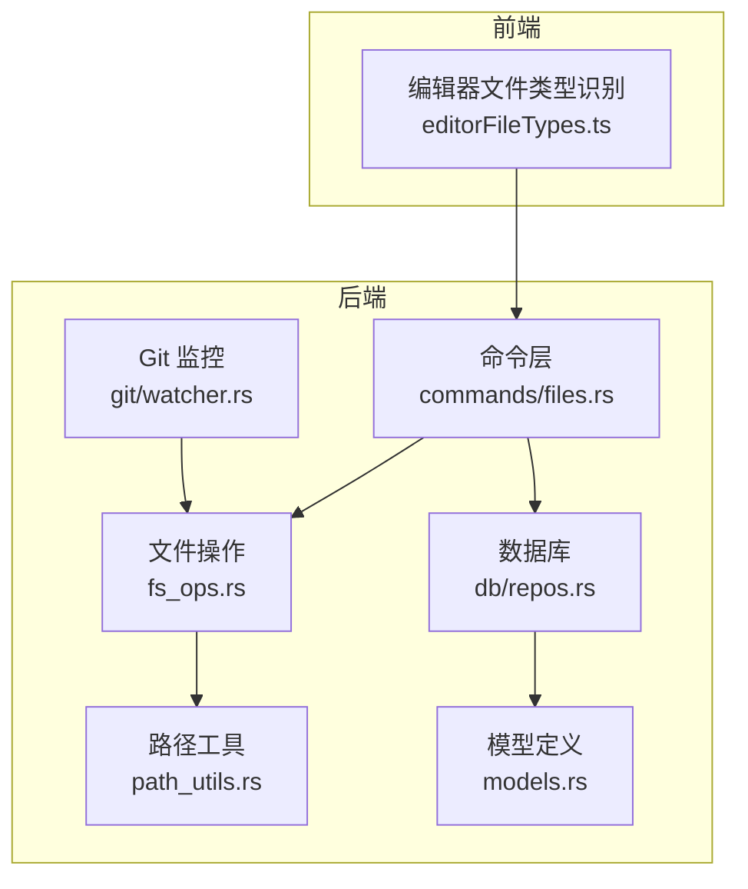
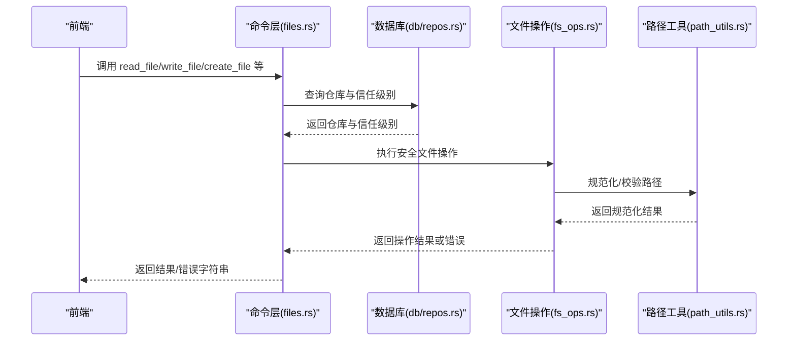
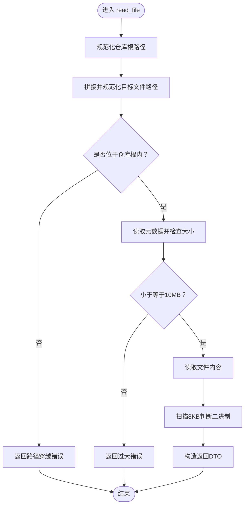
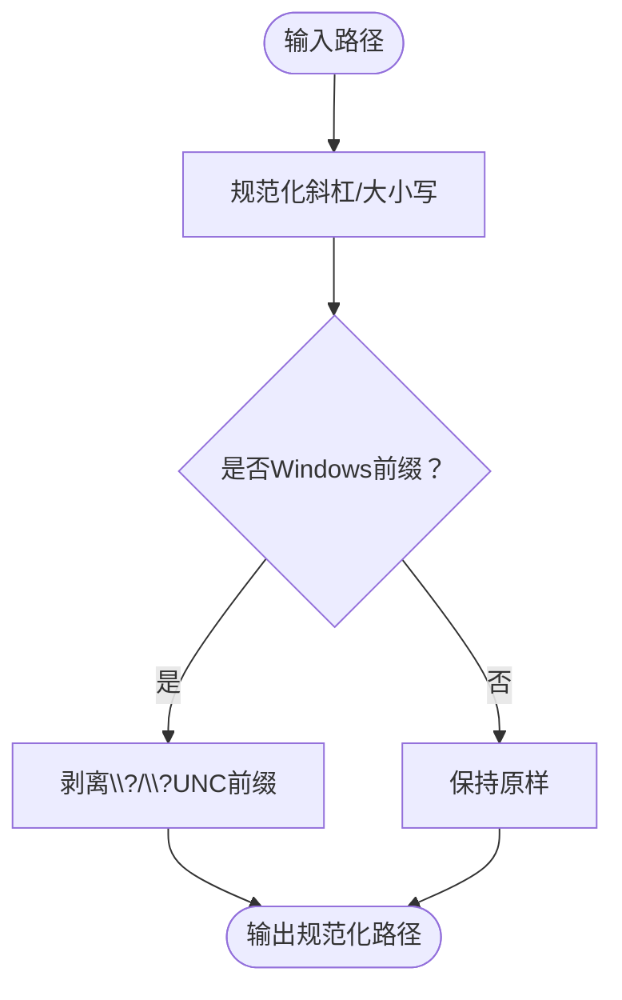
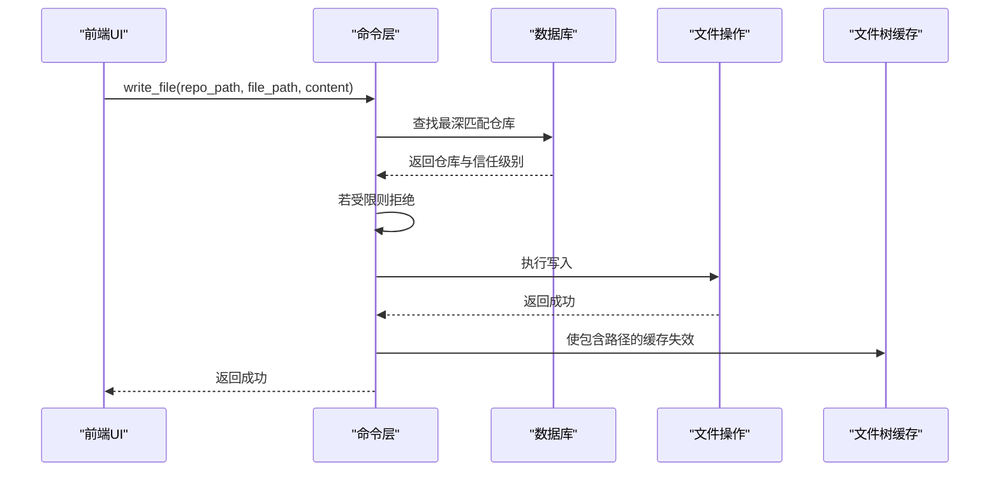
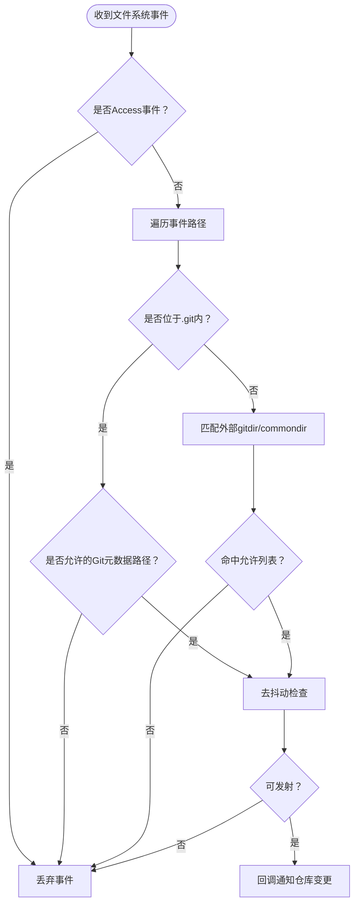
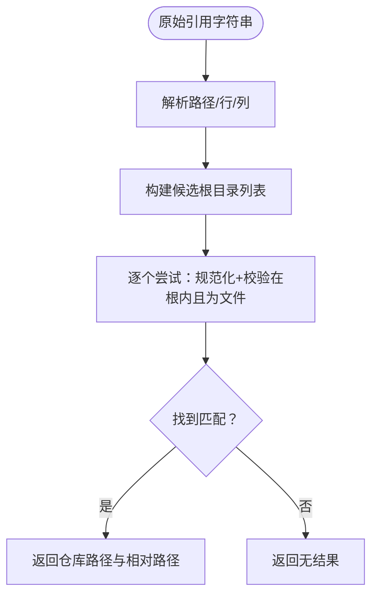
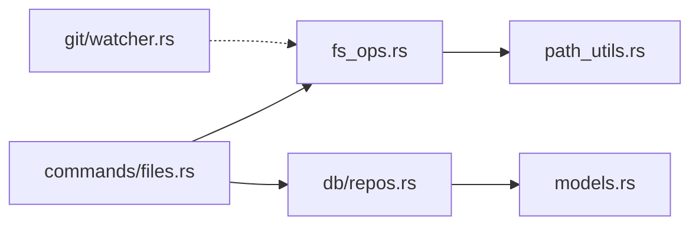

# 文件系统操作

<cite>
**本文档引用的文件**
- [fs_ops.rs](file://src-tauri/src/fs_ops.rs)
- [path_utils.rs](file://src-tauri/src/path_utils.rs)
- [files.rs](file://src-tauri/src/commands/files.rs)
- [watcher.rs](file://src-tauri/src/git/watcher.rs)
- [repos.rs](file://src-tauri/src/db/repos.rs)
- [models.rs](file://src-tauri/src/models.rs)
- [editorFileTypes.ts](file://src/lib/editorFileTypes.ts)
</cite>

## 目录
1. [简介](#简介)
2. [项目结构](#项目结构)
3. [核心组件](#核心组件)
4. [架构总览](#架构总览)
5. [详细组件分析](#详细组件分析)
6. [依赖关系分析](#依赖关系分析)
7. [性能考量](#性能考量)
8. [故障排查指南](#故障排查指南)
9. [结论](#结论)
10. [附录](#附录)

## 简介
本文件系统操作文档聚焦于 Panes 的后端（Rust）与前端（TypeScript）在文件系统层面的安全实现与工程化实践。内容涵盖：
- 安全文件操作：路径校验、防路径穿越、符号链接处理、权限与信任级别控制
- 路径管理策略：规范化、跨平台路径兼容、Windows 前缀处理
- 文件类型识别与编辑器集成：Markdown 预览识别
- 文件读写与目录遍历：大小限制、二进制检测、缓存失效
- 变更检测与监控：Git 变更事件过滤与去抖动
- 大文件优化与内存管理：最大读取尺寸、扫描二进制特征
- 最佳实践、错误处理策略与跨平台兼容性

## 项目结构
围绕文件系统的关键模块分布如下：
- 后端命令层：Tauri 命令封装，负责调用业务逻辑与数据库交互
- 业务逻辑层：文件系统操作、路径工具、Git 监控
- 数据层：仓库与信任级别信息存储
- 前端工具层：编辑器文件类型识别

图表来源
- [files.rs:1-914](file://src-tauri/src/commands/files.rs#L1-L914)
- [fs_ops.rs:1-441](file://src-tauri/src/fs_ops.rs#L1-L441)
- [path_utils.rs:1-143](file://src-tauri/src/path_utils.rs#L1-L143)
- [watcher.rs:1-519](file://src-tauri/src/git/watcher.rs#L1-L519)
- [repos.rs:1-551](file://src-tauri/src/db/repos.rs#L1-L551)
- [models.rs:1-1043](file://src-tauri/src/models.rs#L1-L1043)

章节来源
- [files.rs:1-914](file://src-tauri/src/commands/files.rs#L1-L914)
- [fs_ops.rs:1-441](file://src-tauri/src/fs_ops.rs#L1-L441)
- [path_utils.rs:1-143](file://src-tauri/src/path_utils.rs#L1-L143)
- [watcher.rs:1-519](file://src-tauri/src/git/watcher.rs#L1-L519)
- [repos.rs:1-551](file://src-tauri/src/db/repos.rs#L1-L551)
- [models.rs:1-1043](file://src-tauri/src/models.rs#L1-L1043)

## 核心组件
- 安全文件操作（fs_ops）
  - 列目录、读文件、写文件、创建文件/目录、重命名、删除
  - 路径校验与防路径穿越、符号链接处理、二进制检测、大小限制
- 路径工具（path_utils）
  - 规范化、Windows 前缀处理、路径包含判断
- 命令层（commands/files）
  - Tauri 异步命令封装、信任级别检查、缓存失效、平台打开/定位
- Git 监控（git/watcher）
  - 事件监听、允许列表过滤、去抖动、回退轮询
- 数据库（db/repos）
  - 仓库查询、信任级别判定、路径归一化
- 模型（models）
  - 信任级别枚举、仓库 DTO
- 编辑器文件类型（editorFileTypes）
  - Markdown 预览识别

章节来源
- [fs_ops.rs:1-441](file://src-tauri/src/fs_ops.rs#L1-L441)
- [path_utils.rs:1-143](file://src-tauri/src/path_utils.rs#L1-L143)
- [files.rs:1-914](file://src-tauri/src/commands/files.rs#L1-L914)
- [watcher.rs:1-519](file://src-tauri/src/git/watcher.rs#L1-L519)
- [repos.rs:1-551](file://src-tauri/src/db/repos.rs#L1-L551)
- [models.rs:1-1043](file://src-tauri/src/models.rs#L1-L1043)
- [editorFileTypes.ts:1-7](file://src/lib/editorFileTypes.ts#L1-L7)

## 架构总览
后端通过 Tauri 命令暴露文件系统能力，命令层在执行前进行信任级别检查，并调用业务逻辑层完成具体操作；业务逻辑层严格进行路径校验与安全约束；Git 监控独立运行，仅对高信号变更发出通知。

图表来源
- [files.rs:1-914](file://src-tauri/src/commands/files.rs#L1-L914)
- [fs_ops.rs:1-441](file://src-tauri/src/fs_ops.rs#L1-L441)
- [path_utils.rs:1-143](file://src-tauri/src/path_utils.rs#L1-L143)
- [repos.rs:1-551](file://src-tauri/src/db/repos.rs#L1-L551)

## 详细组件分析

### 安全文件操作（fs_ops）
- 路径校验与防路径穿越
  - 使用组件级校验确保输入路径仅由普通组件构成，拒绝相对段
  - 对目标路径进行规范化与根目录前缀校验，防止逃逸到仓库根之外
- 目录遍历
  - 仅列出仓库内目录项，跳过 .git 目录与越界符号链接
  - 排序：目录优先，再按路径字典序
- 文件读取
  - 限制最大读取大小，避免大文件阻塞
  - 二进制检测：扫描固定长度字节流以判断是否包含空字节
- 文件写入
  - 新建文件时先验证父目录位于仓库根内，必要时递归创建
  - 写入前再次校验路径，确保未越界
- 创建/删除/重命名
  - 创建：不存在即创建父目录，拒绝已存在文件
  - 删除：区分符号链接与真实条目，防止误删真实目标
  - 重命名：仅允许单层文件名替换，拒绝路径穿越

图表来源
- [fs_ops.rs:88-118](file://src-tauri/src/fs_ops.rs#L88-L118)

章节来源
- [fs_ops.rs:13-118](file://src-tauri/src/fs_ops.rs#L13-L118)

### 路径管理与跨平台兼容（path_utils）
- 规范化与比较
  - 统一斜杠分隔，Windows 下小写化，支持 UNC/verbatim 前缀剥离与添加
  - 提供路径包含判断，用于仓库根匹配
- Windows 特性
  - 支持 \\?\ 与 \\?\UNC\ 前缀，剥离后与常规路径等价
  - 在比较中忽略大小写与前缀差异

图表来源
- [path_utils.rs:17-85](file://src-tauri/src/path_utils.rs#L17-L85)

章节来源
- [path_utils.rs:1-143](file://src-tauri/src/path_utils.rs#L1-L143)

### 命令层与信任级别控制（commands/files）
- 命令封装
  - 将同步业务逻辑包装为异步 Tauri 命令，使用线程池执行
- 信任级别检查
  - 在用户发起的编辑器写入/创建/删除/重命名前，查询最深匹配仓库并检查信任级别
  - 受限仓库禁止修改
- 缓存失效
  - 成功操作后使包含该路径的文件树缓存失效，保证 UI 一致性
- 平台打开/定位
  - 根据平台选择 open/explorer/xgd-open/gio 等命令
  - Windows 文件/目录分别采用不同参数

图表来源
- [files.rs:67-107](file://src-tauri/src/commands/files.rs#L67-L107)

章节来源
- [files.rs:1-914](file://src-tauri/src/commands/files.rs#L1-L914)
- [models.rs:33-57](file://src-tauri/src/models.rs#L33-L57)
- [repos.rs:220-274](file://src-tauri/src/db/repos.rs#L220-L274)

### Git 变更监控与事件过滤（git/watcher）
- 监听范围
  - 解析 .git/、gitdir 指针与 commondir，去重后监听
- 允许列表
  - HEAD、index、refs/{heads,remotes,tags,stash}、FETCH_HEAD、packed-refs 等高信号变更才触发
- 去抖动
  - 650ms 内重复事件合并，降低刷新噪声
- 回退策略
  - Linux 下达到 inotify 限制或磁盘空间不足时回退轮询模式

图表来源
- [watcher.rs:195-361](file://src-tauri/src/git/watcher.rs#L195-L361)

章节来源
- [watcher.rs:1-519](file://src-tauri/src/git/watcher.rs#L1-L519)

### 编辑器文件引用解析与符号链接处理
- 引用解析
  - 支持 ./ 前缀去除、行号/列号解析、绝对/相对路径混合
  - 依据工作区根与仓库集合顺序尝试解析，找到首个有效文件即返回
- 符号链接处理
  - 重命名/删除时优先作用于符号链接本身而非其目标
  - 解析目标路径时保留符号链接入口，避免越界

图表来源
- [files.rs:532-572](file://src-tauri/src/commands/files.rs#L532-L572)
- [files.rs:482-530](file://src-tauri/src/commands/files.rs#L482-L530)

章节来源
- [files.rs:532-671](file://src-tauri/src/commands/files.rs#L532-L671)

### 文件类型识别与预览
- Markdown 预览识别
  - 基于扩展名集合判断是否为 Markdown 预览文件

章节来源
- [editorFileTypes.ts:1-7](file://src/lib/editorFileTypes.ts#L1-L7)

## 依赖关系分析
- 命令层依赖业务逻辑层与数据库层，用于安全校验与信任级别决策
- 业务逻辑层依赖路径工具层进行路径规范化与比较
- Git 监控独立运行，不直接依赖命令层，但与业务层共享“允许列表”策略
- 数据层提供信任级别与仓库根路径，支撑命令层的访问控制

图表来源
- [files.rs:1-914](file://src-tauri/src/commands/files.rs#L1-L914)
- [fs_ops.rs:1-441](file://src-tauri/src/fs_ops.rs#L1-L441)
- [path_utils.rs:1-143](file://src-tauri/src/path_utils.rs#L1-L143)
- [watcher.rs:1-519](file://src-tauri/src/git/watcher.rs#L1-L519)
- [repos.rs:1-551](file://src-tauri/src/db/repos.rs#L1-L551)
- [models.rs:1-1043](file://src-tauri/src/models.rs#L1-L1043)

章节来源
- [files.rs:1-914](file://src-tauri/src/commands/files.rs#L1-L914)
- [fs_ops.rs:1-441](file://src-tauri/src/fs_ops.rs#L1-L441)
- [path_utils.rs:1-143](file://src-tauri/src/path_utils.rs#L1-L143)
- [watcher.rs:1-519](file://src-tauri/src/git/watcher.rs#L1-L519)
- [repos.rs:1-551](file://src-tauri/src/db/repos.rs#L1-L551)
- [models.rs:1-1043](file://src-tauri/src/models.rs#L1-L1043)

## 性能考量
- 读取限制
  - 单文件最大 10MB，避免 UI 卡顿与内存压力
- 二进制检测
  - 仅扫描 8KB 判断是否为二进制，兼顾准确性与性能
- 目录遍历
  - 跳过 .git 与越界符号链接，减少 IO 与潜在开销
- 去抖动
  - Git 变更事件 650ms 去抖，降低频繁刷新带来的 UI 与系统负担
- 回退轮询
  - Linux 达到 inotify 限制时回退轮询，避免崩溃与资源耗尽
- 缓存失效
  - 操作成功后按路径失效文件树缓存，避免重复渲染

章节来源
- [fs_ops.rs:10-11](file://src-tauri/src/fs_ops.rs#L10-L11)
- [watcher.rs:42-53](file://src-tauri/src/git/watcher.rs#L42-L53)
- [watcher.rs:231-252](file://src-tauri/src/git/watcher.rs#L231-L252)

## 故障排查指南
- 路径穿越错误
  - 现象：提示路径穿越不允许
  - 排查：确认传入路径经组件校验且最终规范化仍在仓库根内
- 文件过大
  - 现象：提示超过最大打开大小
  - 排查：使用外部编辑器或分块读取
- 权限受限
  - 现象：受限仓库禁止修改
  - 排查：提升信任级别后再操作
- 符号链接行为异常
  - 现象：重命名/删除影响了真实目标
  - 排查：确认操作针对的是符号链接入口而非目标
- Linux 监控无响应
  - 现象：变更不触发
  - 排查：检查 inotify 限制与磁盘空间；确认事件属于允许列表

章节来源
- [fs_ops.rs:38-105](file://src-tauri/src/fs_ops.rs#L38-L105)
- [files.rs:94-100](file://src-tauri/src/commands/files.rs#L94-L100)
- [watcher.rs:231-252](file://src-tauri/src/git/watcher.rs#L231-L252)

## 结论
Panes 的文件系统实现以“安全优先”为核心，通过严格的路径校验、信任级别控制与事件过滤，在多平台上提供了稳定可靠的文件操作体验。配合缓存失效与性能优化策略，既保障了安全性，也兼顾了用户体验与系统资源的合理使用。

## 附录
- 最佳实践
  - 输入路径一律先做组件校验与规范化
  - 写入/创建前先查询仓库与信任级别
  - 大文件与二进制文件谨慎处理，避免阻塞 UI
  - 监控仅关注高信号变更，避免噪声
- 错误处理策略
  - 将底层错误统一转换为字符串返回，便于前端展示
  - 对不可恢复错误记录日志并中断流程
- 跨平台兼容性
  - Windows 前缀剥离与添加，路径大小写与分隔符统一
  - 平台特定命令与参数组合，失败时提供清晰错误信息