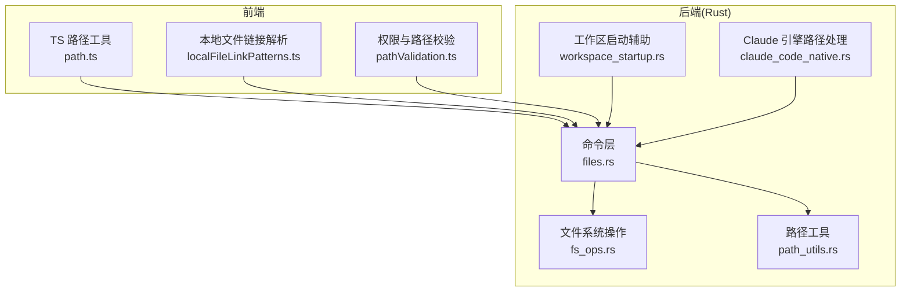
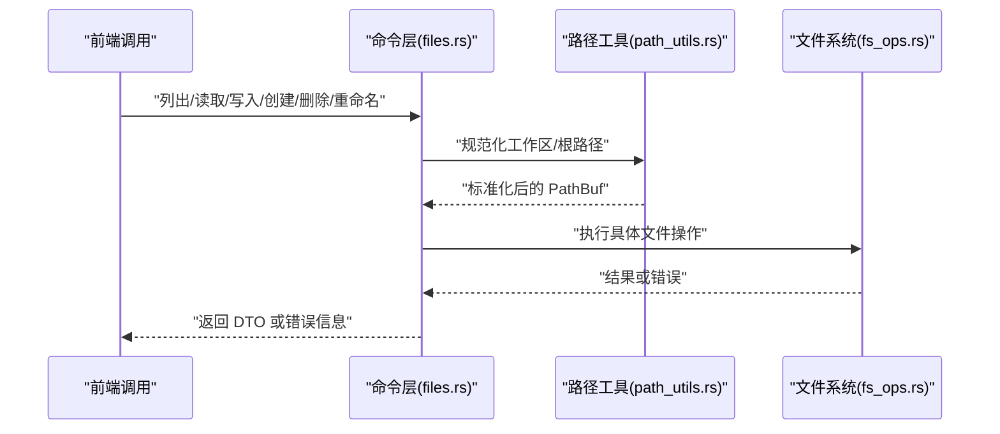
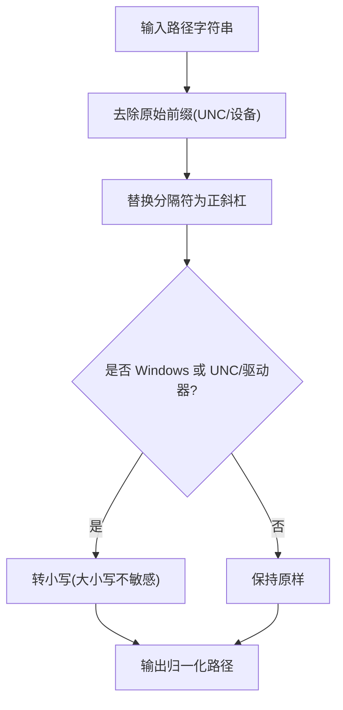
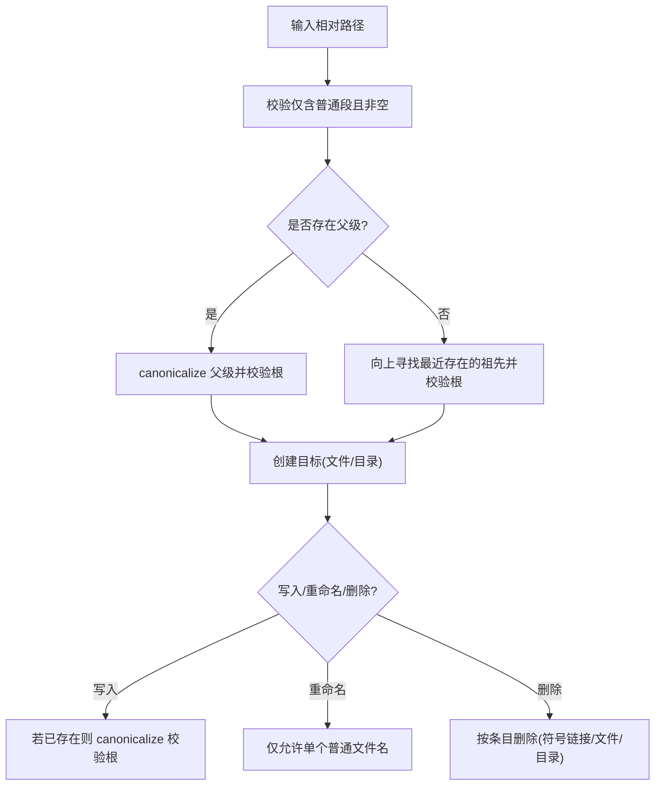
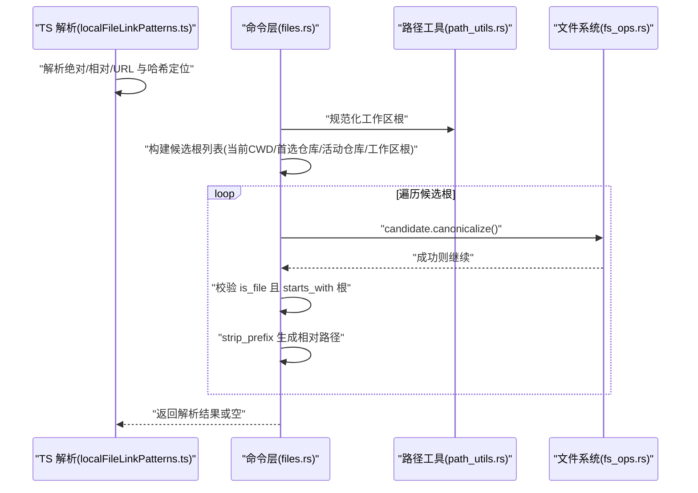
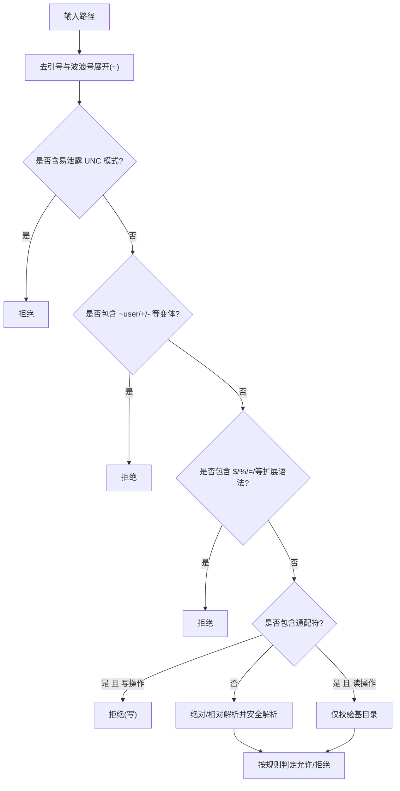
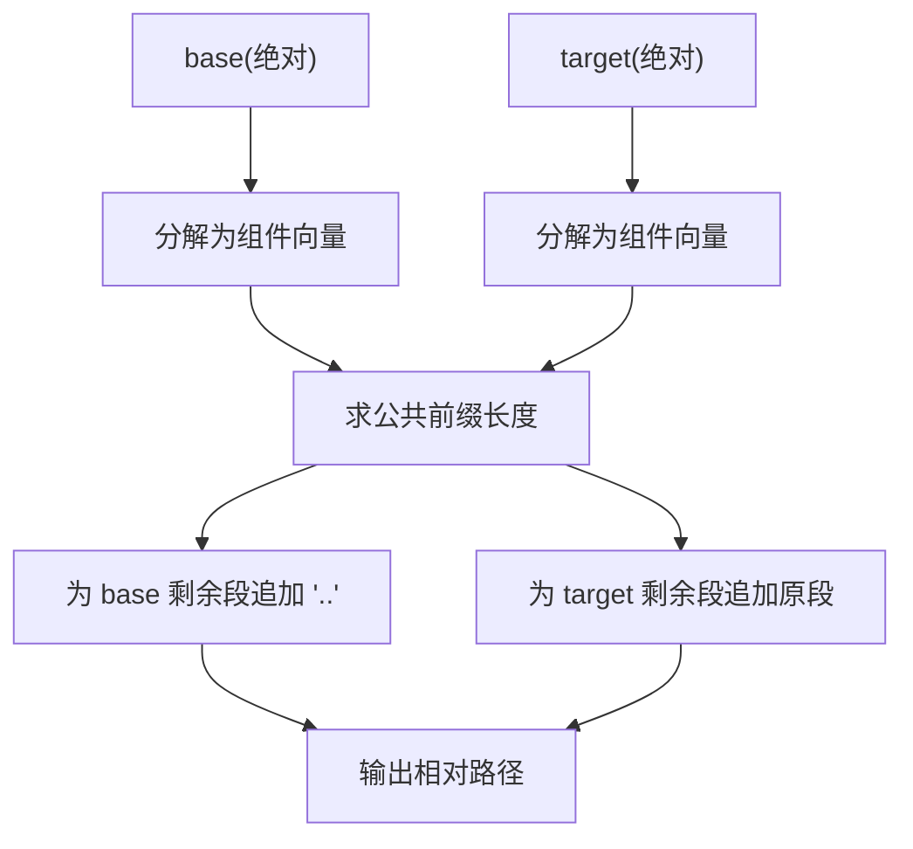
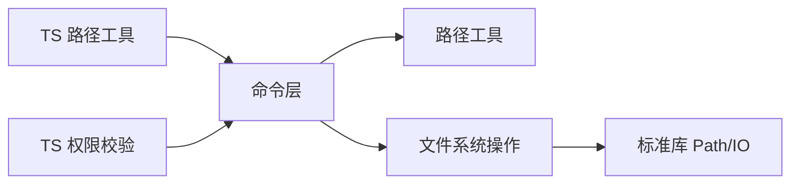

# 路径管理

<cite>
**本文引用的文件**
- [path_utils.rs](file://src-tauri/src/path_utils.rs)
- [fs_ops.rs](file://src-tauri/src/fs_ops.rs)
- [files.rs](file://src-tauri/src/commands/files.rs)
- [workspace_startup.rs](file://src-tauri/src/workspace_startup.rs)
- [claude_code_native.rs](file://src-tauri/src/engines/claude_code_native.rs)
- [path.ts](file://vendor/free-code/src/utils/path.ts)
- [pathValidation.ts](file://vendor/free-code/src/utils/permissions/pathValidation.ts)
- [localFileLinkPatterns.ts](file://src/lib/localFileLinkPatterns.ts)
</cite>

## 目录
1. [简介](#简介)
2. [项目结构](#项目结构)
3. [核心组件](#核心组件)
4. [架构总览](#架构总览)
5. [详细组件分析](#详细组件分析)
6. [依赖关系分析](#依赖关系分析)
7. [性能考量](#性能考量)
8. [故障排查指南](#故障排查指南)
9. [结论](#结论)
10. [附录](#附录)

## 简介
本文件系统化梳理本仓库中的路径管理能力，覆盖路径验证、规范化、安全检查、路径遍历防护、相对/绝对路径处理、跨平台分隔符与符号链接解析、工作目录管理、最佳实践、性能与错误处理策略，以及不同操作系统下的行为差异与兼容方案。

## 项目结构
路径管理涉及前后端协同：
- Rust 后端（Tauri 命令层）：负责文件系统操作、路径校验与安全边界控制
- TypeScript 前端工具：负责本地路径解析、相对化、UNC 安全、配置键规范化等
- 跨平台路径工具：Windows 原始路径前缀处理、比较归一化

图表来源
- [files.rs:1-800](file://src-tauri/src/commands/files.rs#L1-L800)
- [fs_ops.rs:1-441](file://src-tauri/src/fs_ops.rs#L1-L441)
- [path_utils.rs:1-143](file://src-tauri/src/path_utils.rs#L1-L143)
- [workspace_startup.rs:611-643](file://src-tauri/src/workspace_startup.rs#L611-L643)
- [claude_code_native.rs:175-207](file://src-tauri/src/engines/claude_code_native.rs#L175-L207)
- [path.ts:1-156](file://vendor/free-code/src/utils/path.ts#L1-L156)
- [pathValidation.ts:1-486](file://vendor/free-code/src/utils/permissions/pathValidation.ts#L1-L486)
- [localFileLinkPatterns.ts:170-296](file://src/lib/localFileLinkPatterns.ts#L170-L296)

章节来源
- [files.rs:1-800](file://src-tauri/src/commands/files.rs#L1-L800)
- [fs_ops.rs:1-441](file://src-tauri/src/fs_ops.rs#L1-L441)
- [path_utils.rs:1-143](file://src-tauri/src/path_utils.rs#L1-L143)
- [workspace_startup.rs:611-643](file://src-tauri/src/workspace_startup.rs#L611-L643)
- [claude_code_native.rs:175-207](file://src-tauri/src/engines/claude_code_native.rs#L175-L207)
- [path.ts:1-156](file://vendor/free-code/src/utils/path.ts#L1-L156)
- [pathValidation.ts:1-486](file://vendor/free-code/src/utils/permissions/pathValidation.ts#L1-L486)
- [localFileLinkPatterns.ts:170-296](file://src/lib/localFileLinkPatterns.ts#L170-L296)

## 核心组件
- 路径规范化与比较（Rust）
  - 归一化 Windows 原始路径前缀、大小写与分隔符，提供路径包含判断
- 文件系统操作与路径遍历防护（Rust）
  - 列表目录、读写删改、重命名、创建目录/文件；严格限制在仓库根内
- 编辑器文件引用解析（Rust + TS）
  - 解析本地绝对/相对路径、URL file://、行号列号定位；TS 层做相对化与 UNC 安全
- 权限与安全校验（TS）
  - UNC 凭证泄露风险、通配符/波浪号扩展、路径遍历模式检测、沙箱写入白名单
- 跨平台路径处理（TS）
  - POSIX 风格 Windows 路径转换、工作目录相对化、UNC 安全、配置键归一化

章节来源
- [path_utils.rs:7-85](file://src-tauri/src/path_utils.rs#L7-L85)
- [fs_ops.rs:13-298](file://src-tauri/src/fs_ops.rs#L13-L298)
- [files.rs:482-572](file://src-tauri/src/commands/files.rs#L482-L572)
- [path.ts:32-155](file://vendor/free-code/src/utils/path.ts#L32-L155)
- [pathValidation.ts:373-485](file://vendor/free-code/src/utils/permissions/pathValidation.ts#L373-L485)
- [localFileLinkPatterns.ts:170-296](file://src/lib/localFileLinkPatterns.ts#L170-L296)

## 架构总览
下图展示从命令入口到文件系统调用的路径处理链路，以及关键的安全检查点。

图表来源
- [files.rs:18-248](file://src-tauri/src/commands/files.rs#L18-L248)
- [path_utils.rs:7-29](file://src-tauri/src/path_utils.rs#L7-L29)
- [fs_ops.rs:26-298](file://src-tauri/src/fs_ops.rs#L26-L298)

## 详细组件分析

### 组件A：路径规范化与比较（Windows 原始路径、大小写与分隔符）
- 功能要点
  - 去除 Windows 原始路径前缀（UNC 与设备路径），统一为可读形式
  - 在 Windows 或 UNC/驱动器路径场景下进行大小写不敏感比较
  - 将反斜杠统一为正斜杠，便于跨平台比较与 JSON 键使用
- 关键实现
  - 去前缀与添加前缀的互操作
  - 比较前归一化大小写与分隔符
- 兼容性
  - 非 Windows 平台保持原样；UNC 与驱动器路径在 Windows 下大小写不敏感

图表来源
- [path_utils.rs:11-85](file://src-tauri/src/path_utils.rs#L11-L85)

章节来源
- [path_utils.rs:7-85](file://src-tauri/src/path_utils.rs#L7-L85)

### 组件B：文件系统操作与路径遍历防护
- 功能要点
  - 列出目录：仅允许在仓库根内展开，跳过 .git，过滤外部符号链接
  - 读取文件：限制在仓库根内，二进制检测，大小限制
  - 创建/删除/重命名/写入：对父级祖先进行严格校验，拒绝“..”逃逸
  - 重命名：仅允许纯文件名，拒绝路径片段
- 关键实现
  - 使用 Path::components 过滤非法段
  - canonicalize 后 starts_with 校验
  - 对符号链接区分处理（删除/重命名时按条目而非目标）

图表来源
- [fs_ops.rs:13-298](file://src-tauri/src/fs_ops.rs#L13-L298)

章节来源
- [fs_ops.rs:26-298](file://src-tauri/src/fs_ops.rs#L26-L298)

### 组件C：编辑器文件引用解析与工作目录相对化
- 功能要点
  - 解析本地绝对/相对路径、file:// URL、行号列号后缀
  - TS 层将绝对路径相对化（当相对路径不会以“..”开头时）
  - Rust 命令层根据工作区与仓库根顺序尝试解析候选路径
- 关键实现
  - TS：stripLocationSuffix、basename、hasDirectorySegment、isLikelyFileName
  - Rust：ordered_editor_reference_roots、canonicalize 校验、strip_prefix 生成相对路径

图表来源
- [localFileLinkPatterns.ts:170-296](file://src/lib/localFileLinkPatterns.ts#L170-L296)
- [files.rs:532-572](file://src-tauri/src/commands/files.rs#L532-L572)
- [path_utils.rs:7-29](file://src-tauri/src/path_utils.rs#L7-L29)

章节来源
- [localFileLinkPatterns.ts:170-296](file://src/lib/localFileLinkPatterns.ts#L170-L296)
- [files.rs:532-572](file://src-tauri/src/commands/files.rs#L532-L572)
- [path_utils.rs:7-29](file://src-tauri/src/path_utils.rs#L7-L29)

### 组件D：权限与安全校验（UNC、通配符、波浪号扩展、沙箱写入白名单）
- 功能要点
  - 拒绝易导致凭证泄露的 UNC 模式
  - 拒绝波浪号扩展变体（如 ~user、~+、~-）与环境变量/命令替换语法
  - 读操作允许通配符，写操作禁止；通配符仅校验基目录
  - 沙箱启用时，允许写入白名单内的路径（解析符号链接后对称比较）
- 关键实现
  - containsPathTraversal 检测“..”
  - validatePath/validateGlobPattern 分支处理
  - isPathInSandboxWriteAllowlist 解析并缓存沙箱路径

图表来源
- [pathValidation.ts:373-485](file://vendor/free-code/src/utils/permissions/pathValidation.ts#L373-L485)

章节来源
- [pathValidation.ts:1-486](file://vendor/free-code/src/utils/permissions/pathValidation.ts#L1-L486)

### 组件E：跨平台路径分隔符与符号链接解析
- 功能要点
  - TS 层将 POSIX 风格路径（如 /c/...）转换为 Windows 路径
  - 统一使用 normalize 规范化，随后将反斜杠替换为正斜杠用于配置键
  - 忽略 UNC 路径 stat 以避免 NTLM 凭证泄露
  - Rust 层对符号链接：删除/重命名按条目处理，读取/写入按目标处理
- 关键实现
  - TS：expandPath、getDirectoryForPath、containsPathTraversal、normalizePathForConfigKey
  - Rust：fs_ops 中对符号链接的特殊分支

章节来源
- [path.ts:32-155](file://vendor/free-code/src/utils/path.ts#L32-L155)
- [fs_ops.rs:56-66](file://src-tauri/src/fs_ops.rs#L56-L66)

### 组件F：工作目录管理与相对路径计算
- 功能要点
  - 计算两个绝对路径的相对路径，自动处理“..”上溯
  - 检测路径中是否包含父目录组件
- 关键实现
  - 使用 Path::components 分解路径段，求公共前缀，拼接相对路径

图表来源
- [workspace_startup.rs:611-643](file://src-tauri/src/workspace_startup.rs#L611-L643)

章节来源
- [workspace_startup.rs:611-643](file://src-tauri/src/workspace_startup.rs#L611-L643)

### 组件G：Claude 引擎工作目录与路径规范化
- 功能要点
  - 若请求路径为绝对路径则直接使用；否则以工作目录规范化后再 canonicalize
  - 若目标不存在，先 canonicalize 父目录再拼接文件名，避免“不存在即逃逸”
  - 最终校验 starts_with 工作目录根，防止逃逸
- 关键实现
  - 请求路径合法性与 canonicalize 流程

章节来源
- [claude_code_native.rs:175-207](file://src-tauri/src/engines/claude_code_native.rs#L175-L207)

## 依赖关系分析
- 命令层依赖路径工具与文件系统操作
- 文件系统操作依赖标准库 Path API 与 canonicalize
- TS 层提供前置校验与相对化，降低后端负担
- 权限模块贯穿路径输入的早期拦截

图表来源
- [files.rs:1-800](file://src-tauri/src/commands/files.rs#L1-L800)
- [fs_ops.rs:1-441](file://src-tauri/src/fs_ops.rs#L1-L441)
- [path_utils.rs:1-143](file://src-tauri/src/path_utils.rs#L1-L143)
- [path.ts:1-156](file://vendor/free-code/src/utils/path.ts#L1-L156)
- [pathValidation.ts:1-486](file://vendor/free-code/src/utils/permissions/pathValidation.ts#L1-L486)

章节来源
- [files.rs:1-800](file://src-tauri/src/commands/files.rs#L1-L800)
- [fs_ops.rs:1-441](file://src-tauri/src/fs_ops.rs#L1-L441)
- [path_utils.rs:1-143](file://src-tauri/src/path_utils.rs#L1-L143)
- [path.ts:1-156](file://vendor/free-code/src/utils/path.ts#L1-L156)
- [pathValidation.ts:1-486](file://vendor/free-code/src/utils/permissions/pathValidation.ts#L1-L486)

## 性能考量
- 路径规范化与 canonicalize 成本较高，建议：
  - 仅在必要时进行 canonicalize（如写入/重命名/删除前）
  - 对频繁调用的路径（如编辑器引用解析）缓存规范化结果
  - 优先使用“存在即校验”的策略，避免对不存在路径进行昂贵的父级回溯
- UNC/POSIX 路径转换与大小写归一化在 TS 层完成，减少后端重复处理
- 读取文件前先做大小写与分隔符归一化，避免重复 IO

## 故障排查指南
- “路径逃逸”类错误
  - 现象：报错提示不允许路径遍历或拒绝访问
  - 排查：确认输入路径不含“..”，确保最终路径 starts_with 根
  - 参考：仓库根校验与 canonicalize 流程
- “符号链接”相关问题
  - 现象：删除/重命名可能影响目标文件
  - 排查：确认是否为符号链接，按条目处理还是按目标处理
  - 参考：fs_ops 中对符号链接的分支逻辑
- “UNC 路径”相关问题
  - 现象：无法 stat 或打开 UNC 路径
  - 排查：TS 层已跳过 UNC stat；确认路径格式与权限
  - 参考：TS 的 getDirectoryForPath 与 containsPathTraversal
- “Windows 原始路径前缀”
  - 现象：路径显示异常或比较失败
  - 排查：使用 path_utils 的归一化函数
  - 参考：strip/add 原始前缀逻辑

章节来源
- [fs_ops.rs:56-66](file://src-tauri/src/fs_ops.rs#L56-L66)
- [path.ts:109-125](file://vendor/free-code/src/utils/path.ts#L109-L125)
- [path_utils.rs:31-70](file://src-tauri/src/path_utils.rs#L31-L70)

## 结论
本项目通过“TS 前置校验 + Rust 后端强约束”的双层路径管理体系，在保证跨平台一致性的同时，有效防范路径遍历、UNC 凭证泄露、通配符滥用等安全风险。建议在实际使用中遵循“尽早校验、最小权限、显式规范化”的原则，并结合缓存与延迟 canonicalize 优化性能。

## 附录

### 最佳实践清单
- 输入路径一律先做“去引号/波浪号展开/UNC 检测/通配符基目录校验”
- 仅在写入/重命名/删除前进行 canonicalize，读取/列举尽量避免昂贵 IO
- 使用“存在即校验”策略，优先验证父级祖先，再决定创建
- 绝对路径优先；相对路径仅在明确 cwd 下使用，避免“..”逃逸
- Windows 场景使用 path_utils 归一化，跨平台 JSON 键使用正斜杠
- 符号链接按条目处理，避免误伤真实目标

### 不同操作系统的行为差异与兼容方案
- Windows
  - 原始路径前缀（UNC/设备）需剥离与添加，避免显示与比较异常
  - POSIX 风格路径（/c/...）转换为 Windows 路径
  - UNC 路径不进行 stat，避免凭据泄露
- Unix-like
  - 符号链接删除/重命名按条目处理，stat 按目标处理
  - 大小写敏感，路径比较严格
- 跨平台
  - 统一分隔符与大小写策略，避免“/”与“\”混用引发问题
  - 配置键使用正斜杠，确保序列化一致