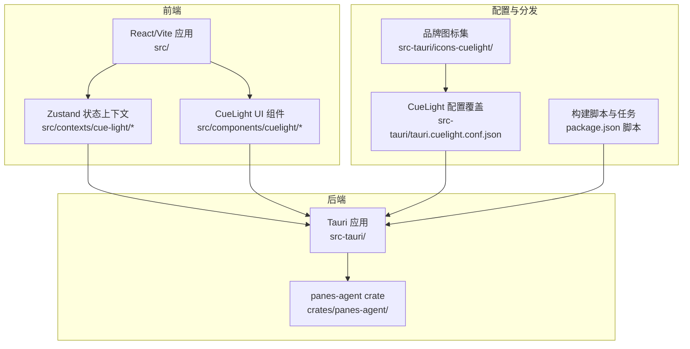
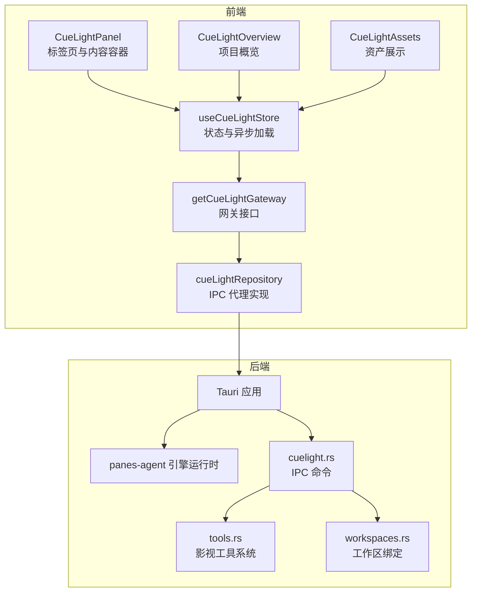
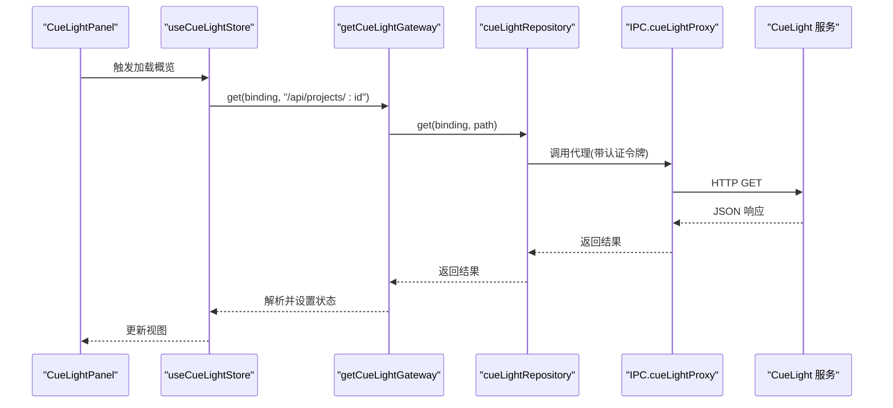
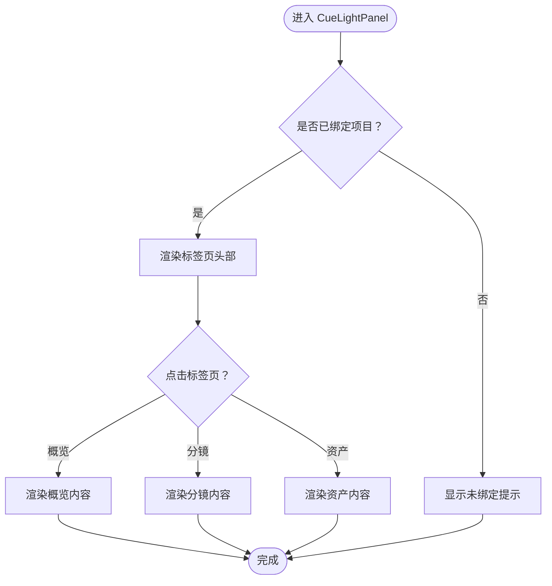
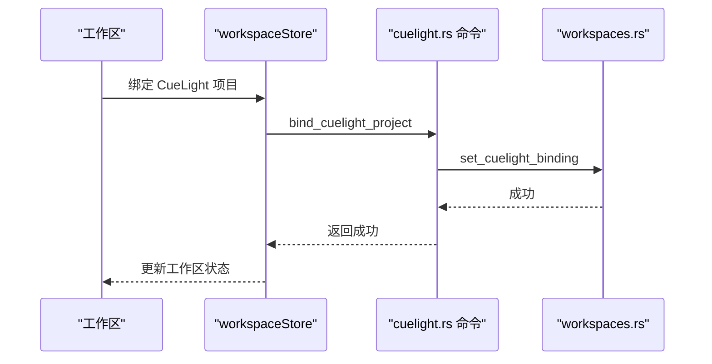
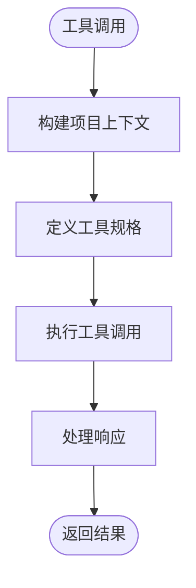
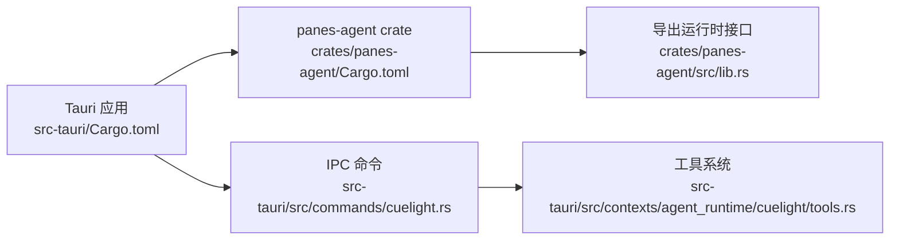
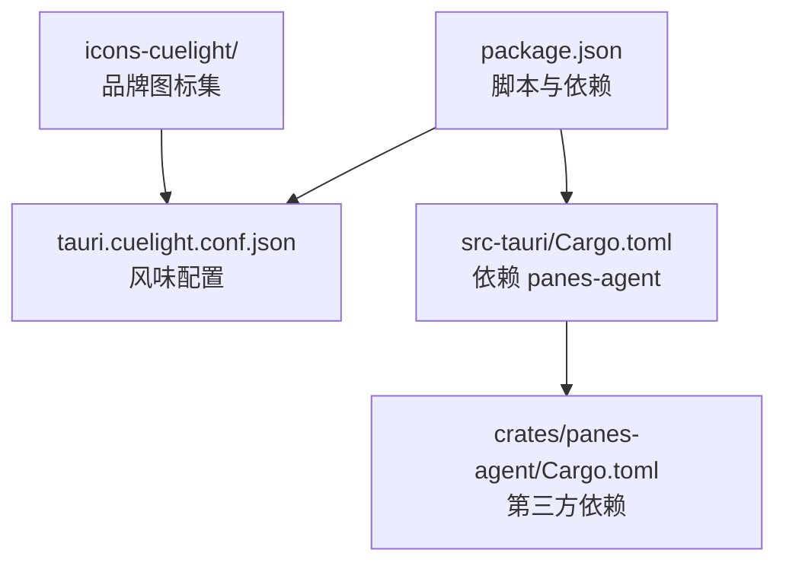

# CueLight 分布版

<cite>
**本文档引用的文件**
- [README.md](file://README.md)
- [cuelight-distribution.md](file://docs/cuelight-distribution.md)
- [package.json](file://package.json)
- [Cargo.toml](file://Cargo.toml)
- [src-tauri/Cargo.toml](file://src-tauri/Cargo.toml)
- [src-tauri/tauri.cuelight.conf.json](file://src-tauri/tauri.cuelight.conf.json)
- [src/components/cuelight/CueLightPanel.tsx](file://src/components/cuelight/CueLightPanel.tsx)
- [src/components/cuelight/CueLightOverview.tsx](file://src/components/cuelight/CueLightOverview.tsx)
- [src/components/cuelight/CueLightAssets.tsx](file://src/components/cuelight/CueLightAssets.tsx)
- [src/contexts/cue-light/application/cueLightStore.ts](file://src/contexts/cue-light/application/cueLightStore.ts)
- [src/contexts/cue-light/domain/cueLightState.ts](file://src/contexts/cue-light/domain/cueLightState.ts)
- [src/contexts/cue-light/infrastructure/cueLightRepository.ts](file://src/contexts/cue-light/infrastructure/cueLightRepository.ts)
- [src/contexts/cue-light/application/cueLightGateway.ts](file://src/contexts/cue-light/application/cueLightGateway.ts)
- [crates/panes-agent/src/lib.rs](file://crates/panes-agent/src/lib.rs)
- [crates/panes-agent/Cargo.toml](file://crates/panes-agent/Cargo.toml)
- [src/types.ts](file://src/types.ts)
- [src-tauri/src/commands/cuelight.rs](file://src-tauri/src/commands/cuelight.rs)
- [src-tauri/src/models.rs](file://src-tauri/src/models.rs)
- [src-tauri/src/db/workspaces.rs](file://src-tauri/src/db/workspaces.rs)
- [src-tauri/src/contexts/agent_runtime/cuelight/tools.rs](file://src-tauri/src/contexts/agent_runtime/cuelight/tools.rs)
</cite>

## 更新摘要
**所做更改**
- 新增 CueLight 分布版配置与品牌资产说明
- 更新构建命令与发行说明
- 新增工作区绑定功能的详细说明
- 补充 CueLight 工具系统的完整描述
- 更新图标与品牌资产的生成流程

## 目录
1. [简介](#简介)
2. [项目结构](#项目结构)
3. [核心组件](#核心组件)
4. [架构总览](#架构总览)
5. [详细组件分析](#详细组件分析)
6. [依赖关系分析](#依赖关系分析)
7. [性能考虑](#性能考虑)
8. [故障排除指南](#故障排除指南)
9. [结论](#结论)

## 简介
本文件面向 CueLight 分布版，系统性梳理其在 Panes 仓库中的实现方式与运行机制。CueLight 是一个以 Tauri 为壳、React/Vite 为前端的本地优先桌面应用，专为影视/视频项目提供"创意工作舱"能力：本地工作空间、项目感知的 AI 协助、结构化审批流以及直接调用 CueLight 项目工具的能力。CueLight 分布版作为独立风味（flavor）存在，拥有独立的产品名、Bundle 标识符、窗口标题与更新器源，确保与主 Panes 发行版本并存且互不干扰。

该分布版是一个专门针对影视/视频生产工作流的品牌化发行版本，包含独立的 Tauri 配置和品牌资产。它通过 `src-tauri/tauri.cuelight.conf.json` 实现配置覆盖，使用独立的图标集 `src-tauri/icons-cuelight/` 和更新通道，为用户提供专业的影视制作体验。

**章节来源**
- [README.md:112-117](file://README.md#L112-L117)
- [docs/cuelight-distribution.md:1-60](file://docs/cuelight-distribution.md#L1-L60)

## 项目结构
CueLight 分布版采用"多包工作区 + 多风味配置"的组织方式：
- 前端层：React + TypeScript + Vite，位于仓库根目录，通过脚本与 Tauri CLI 驱动开发与打包。
- 后端层：Rust 工作区，包含 Tauri 应用与独立的 panes-agent crate，负责引擎编排、持久化、Git 操作、终端管理等。
- 分发层：通过 Tauri 配置覆盖（tauri.cuelight.conf.json）生成 CueLight 独立风味，包括产品名、Bundle ID、图标集、更新器端点等。



**图表来源**
- [package.json:6-28](file://package.json#L6-L28)
- [src-tauri/Cargo.toml:15-31](file://src-tauri/Cargo.toml#L15-L31)
- [crates/panes-agent/Cargo.toml:8-22](file://crates/panes-agent/Cargo.toml#L8-L22)
- [src-tauri/tauri.cuelight.conf.json:1-39](file://src-tauri/tauri.cuelight.conf.json#L1-L39)

**章节来源**
- [package.json:6-28](file://package.json#L6-L28)
- [src-tauri/Cargo.toml:15-31](file://src-tauri/Cargo.toml#L15-L31)
- [crates/panes-agent/Cargo.toml:8-22](file://crates/panes-agent/Cargo.toml#L8-L22)
- [src-tauri/tauri.cuelight.conf.json:1-39](file://src-tauri/tauri.cuelight.conf.json#L1-L39)

## 核心组件
- 数据模型与类型定义：CueLight 项目绑定信息、项目详情、圣经（世界观/风格）、角色、场景、道具、分镜与视频资产等，均在类型文件中集中定义，便于前后端契约一致。
- 状态管理：使用 Zustand 管理 CueLight 面板的状态，支持加载状态、错误处理、选中剧集切换、资产标签页切换等。
- 网关与仓储：抽象出 CueLightGateway 接口，具体实现通过 IPC 调用后端代理，完成对 CueLight 服务的 GET 请求、项目列表拉取、令牌校验与同步等。
- UI 组件：CueLightPanel 提供概览、分镜、资产三个标签页；各子面板按需懒加载数据并展示。
- 工作区绑定：支持将 CueLight 项目绑定到工作区，实现项目感知的 AI 协助与工具调用。
- 工具系统：内置丰富的影视制作工具，包括角色管理、场景管理、道具管理、视频生成等。

**章节来源**
- [src/types.ts:13-17](file://src/types.ts#L13-L17)
- [src/contexts/cue-light/domain/cueLightState.ts:3-72](file://src/contexts/cue-light/domain/cueLightState.ts#L3-L72)
- [src/contexts/cue-light/application/cueLightStore.ts:17-143](file://src/contexts/cue-light/application/cueLightStore.ts#L17-L143)
- [src/contexts/cue-light/application/cueLightGateway.ts:9-35](file://src/contexts/cue-light/application/cueLightGateway.ts#L9-L35)
- [src/contexts/cue-light/infrastructure/cueLightRepository.ts:81-90](file://src/contexts/cue-light/infrastructure/cueLightRepository.ts#L81-L90)
- [src/components/cuelight/CueLightPanel.tsx:20-70](file://src/components/cuelight/CueLightPanel.tsx#L20-L70)

## 架构总览
CueLight 分布版遵循 Panes 的整体架构：前端 React + Zustand，后端 Tauri + Rust，IPC 作为前后端通信桥梁。CueLight 特有之处在于：
- 使用独立的 Tauri 配置覆盖，生成独立风味的应用与更新通道；
- 通过 IPC 代理访问 CueLight 服务，统一处理认证令牌、请求转发与错误反馈；
- 前端状态集中于 Zustand，按需并发加载项目数据，避免阻塞交互；
- 支持工作区绑定，实现项目感知的 AI 协助与工具调用。



**图表来源**
- [src/components/cuelight/CueLightPanel.tsx:20-70](file://src/components/cuelight/CueLightPanel.tsx#L20-L70)
- [src/contexts/cue-light/application/cueLightStore.ts:17-143](file://src/contexts/cue-light/application/cueLightStore.ts#L17-L143)
- [src/contexts/cue-light/application/cueLightGateway.ts:30-35](file://src/contexts/cue-light/application/cueLightGateway.ts#L30-L35)
- [src/contexts/cue-light/infrastructure/cueLightRepository.ts:81-90](file://src/contexts/cue-light/infrastructure/cueLightRepository.ts#L81-L90)
- [crates/panes-agent/src/lib.rs:7-17](file://crates/panes-agent/src/lib.rs#L7-L17)
- [src-tauri/src/commands/cuelight.rs:1-161](file://src-tauri/src/commands/cuelight.rs#L1-L161)
- [src-tauri/src/contexts/agent_runtime/cuelight/tools.rs:1-800](file://src-tauri/src/contexts/agent_runtime/cuelight/tools.rs#L1-L800)

## 详细组件分析

### 数据模型与状态管理
- 数据模型：涵盖项目、圣经、角色、场景、道具、分镜、视频资产等实体，字段设计兼顾扩展性与前端渲染需求。
- 初始状态：提供初始值，确保首次渲染无空指针风险。
- 选择逻辑：当未选中剧集时自动选择第一条，提升用户体验。

```mermaid
classDiagram
class CueLightState {
+projectDetail : CueLightProject | null
+bible : CueLightBible | null
+episodes : CueLightEpisode[]
+characters : CueLightCharacter[]
+scenes : CueLightScene[]
+props : CueLightProp[]
+storyboards : Record<string, CueLightStoryboard[]>
+videoAssets : CueLightVideoAsset[]
+selectedEpisodeId : string | null
+assetsTab : AssetsTab
+loading : Record<string, boolean>
+error : string | null
+loadOverview(binding)
+loadEpisodes(binding)
+loadStoryboards(binding, episodeId)
+loadCharacters(binding)
+loadScenes(binding)
+loadProps(binding)
+loadVideoAssets(binding)
+setSelectedEpisodeId(id)
+setAssetsTab(tab)
+reset()
}
class CueLightProject {
+id : string
+name : string
+projectType? : string
+videoAspectRatio? : string
+episodes? : { id : string; title? : string }[]
+storyboards? : { id : string }[]
}
class CueLightBible {
+worldView? : string
+stylePrompt? : string
}
class CueLightEpisode {
+id : string
+title? : string
+number? : number
+summary? : string
}
class CueLightCharacter {
+id : string
+name : string
+description? : string
+referenceImageUrl? : string
}
class CueLightScene {
+id : string
+name : string
+description? : string
+referenceImageUrl? : string
}
class CueLightProp {
+id : string
+name : string
+description? : string
+referenceImageUrl? : string
}
class CueLightStoryboard {
+id : string
+sceneNumber? : number
+videoPrompt? : string
+firstFrameUrl? : string
+firstFrameThumbnailUrl? : string
+videoClipUrl? : string
+videoCoverUrl? : string
+nineGridImageUrl? : string
+referenceCharacterIds? : string[]
+sceneId? : string
+status? : string
}
class CueLightVideoAsset {
+id : string
+url? : string
+thumbnailUrl? : string
+createdAt? : string
}
CueLightState --> CueLightProject
CueLightState --> CueLightBible
CueLightState --> CueLightEpisode
CueLightState --> CueLightCharacter
CueLightState --> CueLightScene
CueLightState --> CueLightProp
CueLightState --> CueLightStoryboard
CueLightState --> CueLightVideoAsset
```

**图表来源**
- [src/contexts/cue-light/domain/cueLightState.ts:76-125](file://src/contexts/cue-light/domain/cueLightState.ts#L76-L125)
- [src/contexts/cue-light/domain/cueLightState.ts:3-72](file://src/contexts/cue-light/domain/cueLightState.ts#L3-L72)

**章节来源**
- [src/contexts/cue-light/domain/cueLightState.ts:76-125](file://src/contexts/cue-light/domain/cueLightState.ts#L76-L125)
- [src/contexts/cue-light/domain/cueLightState.ts:104-117](file://src/contexts/cue-light/domain/cueLightState.ts#L104-L117)
- [src/contexts/cue-light/domain/cueLightState.ts:119-124](file://src/contexts/cue-light/domain/cueLightState.ts#L119-L124)

### 网关与 IPC 代理
- 网关接口：定义统一的 get/listProjects/窗口最大化/打开服务器/读写令牌等方法，便于替换实现或注入测试桩。
- IPC 代理：通过 @tauri-apps/api 的窗口与 @tauri-apps/plugin-shell 的打开链接能力，结合自定义 IPC 调用，完成对远端 CueLight 服务的请求转发与认证令牌传递。
- 令牌校验与同步：提供 validateToken/syncAuthToken，保证前端与后端令牌一致性。



**图表来源**
- [src/components/cuelight/CueLightPanel.tsx:20-70](file://src/components/cuelight/CueLightPanel.tsx#L20-L70)
- [src/contexts/cue-light/application/cueLightStore.ts:20-40](file://src/contexts/cue-light/application/cueLightStore.ts#L20-L40)
- [src/contexts/cue-light/application/cueLightGateway.ts:9-22](file://src/contexts/cue-light/application/cueLightGateway.ts#L9-L22)
- [src/contexts/cue-light/infrastructure/cueLightRepository.ts:9-23](file://src/contexts/cue-light/infrastructure/cueLightRepository.ts#L9-L23)

**章节来源**
- [src/contexts/cue-light/application/cueLightGateway.ts:9-35](file://src/contexts/cue-light/application/cueLightGateway.ts#L9-L35)
- [src/contexts/cue-light/infrastructure/cueLightRepository.ts:81-90](file://src/contexts/cue-light/infrastructure/cueLightRepository.ts#L81-L90)

### UI 组件：CueLightPanel
- 功能：根据工作区绑定状态决定是否显示 CueLight 内容；提供概览、分镜、资产三个标签页；在未绑定时提示用户通过侧栏创建影视工作区并绑定项目。
- 交互：标签页切换、内容区域按需渲染，减少不必要的计算与渲染开销。



**图表来源**
- [src/components/cuelight/CueLightPanel.tsx:20-70](file://src/components/cuelight/CueLightPanel.tsx#L20-L70)

**章节来源**
- [src/components/cuelight/CueLightPanel.tsx:20-70](file://src/components/cuelight/CueLightPanel.tsx#L20-L70)

### 工作区绑定系统
- 绑定模型：CueLightBindingDto 结构体存储项目 ID、项目名称和绑定时间戳。
- 绑定操作：支持绑定、解绑和查询工作区的 CueLight 项目绑定状态。
- 数据持久化：通过 SQLite 数据库存储绑定信息，支持工作区级别的项目绑定管理。



**图表来源**
- [src-tauri/src/models.rs:8-14](file://src-tauri/src/models.rs#L8-L14)
- [src-tauri/src/commands/cuelight.rs:108-127](file://src-tauri/src/commands/cuelight.rs#L108-L127)
- [src-tauri/src/db/workspaces.rs:437-450](file://src-tauri/src/db/workspaces.rs#L437-L450)

**章节来源**
- [src-tauri/src/models.rs:8-14](file://src-tauri/src/models.rs#L8-L14)
- [src-tauri/src/commands/cuelight.rs:108-127](file://src-tauri/src/commands/cuelight.rs#L108-L127)
- [src-tauri/src/db/workspaces.rs:437-450](file://src-tauri/src/db/workspaces.rs#L437-L450)

### CueLight 工具系统
- 工具定义：提供 20+ 个专业影视制作工具，包括角色管理、场景管理、道具管理、视频生成等。
- 上下文注入：支持将项目上下文注入到 ThreadState 中，实现项目感知的工具调用。
- 执行机制：通过统一的执行函数处理各种工具调用，支持认证令牌传递和响应处理。



**图表来源**
- [src-tauri/src/contexts/agent_runtime/cuelight/tools.rs:95-610](file://src-tauri/src/contexts/agent_runtime/cuelight/tools.rs#L95-L610)

**章节来源**
- [src-tauri/src/contexts/agent_runtime/cuelight/tools.rs:95-610](file://src-tauri/src/contexts/agent_runtime/cuelight/tools.rs#L95-L610)

### 后端集成与运行时
- panes-agent crate：提供本地清洁房间（clean-room）实现的代理运行时，包含领域、应用、基础设施与接口模块，作为 Tauri 后端的 Rust 运行时依赖。
- Tauri 依赖：通过 Cargo.toml 显式依赖 panes-agent，确保构建时链接到正确的运行时实现。
- IPC 命令：提供 cuelight_proxy 命令实现 HTTP 代理，支持认证令牌传递和错误处理。



**图表来源**
- [src-tauri/Cargo.toml:15-16](file://src-tauri/Cargo.toml#L15-L16)
- [crates/panes-agent/Cargo.toml:8-22](file://crates/panes-agent/Cargo.toml#L8-L22)
- [crates/panes-agent/src/lib.rs:7-17](file://crates/panes-agent/src/lib.rs#L7-L17)
- [src-tauri/src/commands/cuelight.rs:15-94](file://src-tauri/src/commands/cuelight.rs#L15-L94)

**章节来源**
- [crates/panes-agent/src/lib.rs:7-17](file://crates/panes-agent/src/lib.rs#L7-L17)
- [crates/panes-agent/Cargo.toml:8-22](file://crates/panes-agent/Cargo.toml#L8-L22)
- [src-tauri/Cargo.toml:15-16](file://src-tauri/Cargo.toml#L15-L16)

## 依赖关系分析
- 前端构建与脚本：package.json 定义了开发、构建、测试、打包与 CueLight 独立风味的命令入口。
- Tauri 配置覆盖：tauri.cuelight.conf.json 重写产品名、Bundle ID、窗口属性、图标集与更新器端点，形成独立发行通道。
- Rust 工作区：src-tauri/Cargo.toml 依赖 panes-agent，确保运行时能力可用；crates/panes-agent/Cargo.toml 管理第三方依赖。
- 品牌资产：icons-cuelight 目录包含独立的图标集，通过配置文件引用。



**图表来源**
- [package.json:6-28](file://package.json#L6-L28)
- [src-tauri/tauri.cuelight.conf.json:1-39](file://src-tauri/tauri.cuelight.conf.json#L1-L39)
- [src-tauri/Cargo.toml:15-16](file://src-tauri/Cargo.toml#L15-L16)
- [crates/panes-agent/Cargo.toml:8-22](file://crates/panes-agent/Cargo.toml#L8-L22)

**章节来源**
- [package.json:6-28](file://package.json#L6-L28)
- [src-tauri/tauri.cuelight.conf.json:1-39](file://src-tauri/tauri.cuelight.conf.json#L1-L39)
- [src-tauri/Cargo.toml:15-16](file://src-tauri/Cargo.toml#L15-L16)
- [crates/panes-agent/Cargo.toml:8-22](file://crates/panes-agent/Cargo.toml#L8-L22)

## 性能考虑
- 并发加载：useCueLightStore 在加载概览时对多个端点进行 Promise.all 并发请求，缩短首屏等待时间。
- 懒加载与按需渲染：CueLightPanel 仅在绑定项目后渲染内容，未绑定时直接提示，避免无效渲染。
- 状态粒度：loading/error 字段按子域细分，避免全局抖动，提升交互流畅度。
- 图标与资源：CueLight 独立图标集与更新器资源分离，降低主 Panes 发行版本的耦合度。
- 工具缓存：工具定义和上下文信息进行适当的缓存，减少重复计算。

**章节来源**
- [src/contexts/cue-light/application/cueLightStore.ts:20-40](file://src/contexts/cue-light/application/cueLightStore.ts#L20-L40)
- [src/components/cuelight/CueLightPanel.tsx:27-39](file://src/components/cuelight/CueLightPanel.tsx#L27-L39)

## 故障排除指南
- 未绑定项目：若工作区未绑定 CueLight 项目，CueLightPanel 将提示用户通过侧栏创建影视工作区并绑定项目。请确认工作区设置中已正确填写项目绑定信息。
- 令牌问题：若出现"请先配置 API Token"，请在设置中保存有效令牌，并使用 validateToken 进行校验；必要时通过 syncAuthToken 同步至后端。
- 网络与代理：IPC.cueLightProxy 负责转发请求，请检查网络连通性与代理配置；如遇跨域或认证失败，优先核对令牌与服务端地址。
- 更新器：CueLight 独立更新通道指向特定端点，若无法自动更新，请手动下载对应平台安装包并安装。
- 工具调用：如果影视工具调用失败，检查项目上下文是否正确构建，以及认证令牌是否有效。
- 工作区绑定：如果绑定操作失败，检查数据库连接和绑定数据格式。

**章节来源**
- [src/components/cuelight/CueLightPanel.tsx:27-39](file://src/components/cuelight/CueLightPanel.tsx#L27-L39)
- [src/contexts/cue-light/infrastructure/cueLightRepository.ts:54-61](file://src/contexts/cue-light/infrastructure/cueLightRepository.ts#L54-L61)
- [src/contexts/cue-light/infrastructure/cueLightRepository.ts:63-65](file://src/contexts/cue-light/infrastructure/cueLightRepository.ts#L63-L65)
- [docs/cuelight-distribution.md:21-22](file://docs/cuelight-distribution.md#L21-L22)

## 结论
CueLight 分布版通过独立的 Tauri 配置覆盖与 IPC 代理，实现了与主 Panes 发行版本的解耦，同时保持一致的前端状态管理与 UI 体验。其数据模型清晰、状态管理简洁、后端依赖明确，适合在影视/视频项目中提供本地优先的创意工作舱能力。

该分布版的核心优势包括：
- 专业化的影视制作工具链，涵盖角色、场景、道具管理以及视频生成
- 工作区绑定机制，实现项目感知的 AI 协助与工具调用
- 独立的品牌资产与发行通道，确保专业形象的一致性
- 完善的错误处理与性能优化，提供稳定的用户体验

建议在后续迭代中持续完善错误边界与国际化文案，确保跨平台与多语言环境下的稳定性与一致性。同时可以考虑扩展更多专业影视制作工具，进一步提升 CueLight 分布版的专业价值。