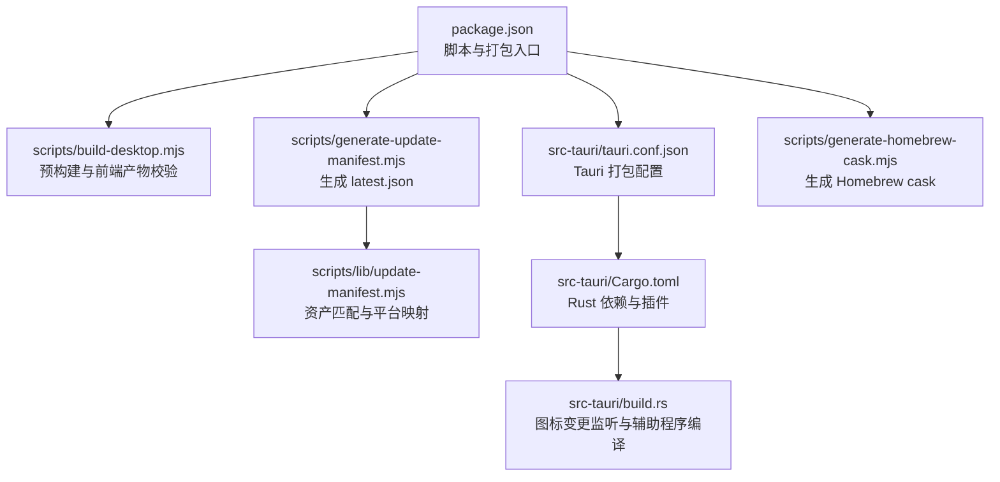
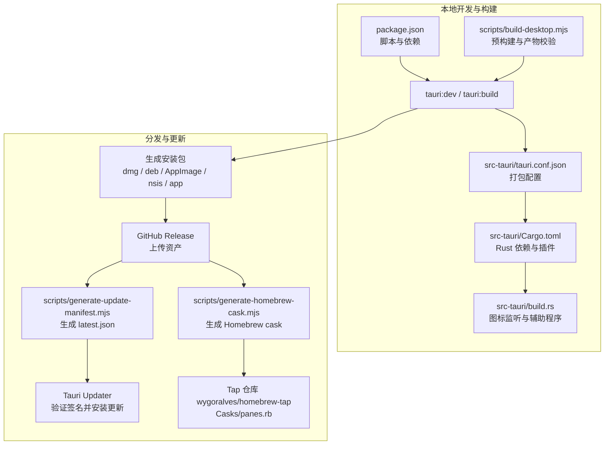
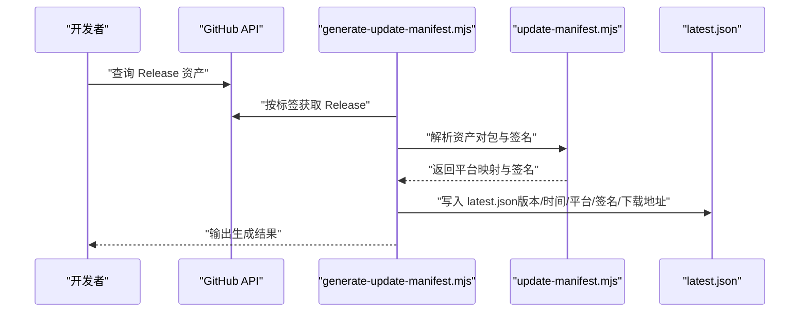
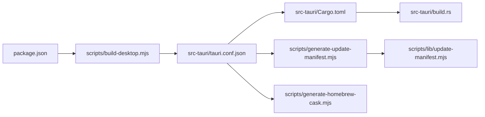

# 打包和分发

<cite>
**本文引用的文件**
- [src-tauri/tauri.conf.json](file://src-tauri/tauri.conf.json)
- [src-tauri/tauri.unsigned.conf.json](file://src-tauri/tauri.unsigned.conf.json)
- [package.json](file://package.json)
- [scripts/build-desktop.mjs](file://scripts/build-desktop.mjs)
- [scripts/generate-update-manifest.mjs](file://scripts/generate-update-manifest.mjs)
- [scripts/lib/update-manifest.mjs](file://scripts/lib/update-manifest.mjs)
- [src-tauri/Cargo.toml](file://src-tauri/Cargo.toml)
- [src-tauri/build.rs](file://src-tauri/build.rs)
- [scripts/generate-homebrew-cask.mjs](file://scripts/generate-homebrew-cask.mjs)
- [docs/homebrew-distribution.md](file://docs/homebrew-distribution.md)
</cite>

## 目录
1. [简介](#简介)
2. [项目结构](#项目结构)
3. [核心组件](#核心组件)
4. [架构总览](#架构总览)
5. [详细组件分析](#详细组件分析)
6. [依赖关系分析](#依赖关系分析)
7. [性能考量](#性能考量)
8. [故障排查指南](#故障排查指南)
9. [结论](#结论)
10. [附录](#附录)

## 简介
本文件系统性梳理 Panes 的打包与分发流程，覆盖 Tauri 应用在 Windows、macOS 与 Linux 平台的打包策略、平台特定配置、图标资源管理、签名与安装包生成、自动更新机制（更新清单生成与版本管理）、以及分发渠道（含 Homebrew）与企业部署建议。内容基于仓库中的配置文件与脚本进行归纳总结，帮助开发者与运维人员快速理解并复现打包与发布流程。

## 项目结构
围绕打包与分发的关键目录与文件如下：
- 配置层：Tauri 配置与插件配置位于 src-tauri 目录；前端构建脚本与打包命令位于根目录 package.json。
- 脚本层：桌面端预构建与打包脚本 scripts/build-desktop.mjs；更新清单生成脚本 scripts/generate-update-manifest.mjs 及其工具模块 scripts/lib/update-manifest.mjs；Homebrew cask 生成脚本 scripts/generate-homebrew-cask.mjs。
- 构建层：Rust 工程配置 src-tauri/Cargo.toml 与构建入口 src-tauri/build.rs，负责图标资源变更触发重编译等。
- 文档层：docs/homebrew-distribution.md 提供 Homebrew 分发的流程与前置条件。

图表来源
- [package.json:1-89](file://package.json#L1-L89)
- [scripts/build-desktop.mjs:1-71](file://scripts/build-desktop.mjs#L1-L71)
- [scripts/generate-update-manifest.mjs:1-123](file://scripts/generate-update-manifest.mjs#L1-L123)
- [scripts/lib/update-manifest.mjs:1-85](file://scripts/lib/update-manifest.mjs#L1-L85)
- [src-tauri/tauri.conf.json:1-58](file://src-tauri/tauri.conf.json#L1-L58)
- [src-tauri/Cargo.toml:1-67](file://src-tauri/Cargo.toml#L1-L67)
- [src-tauri/build.rs:1-64](file://src-tauri/build.rs#L1-L64)
- [scripts/generate-homebrew-cask.mjs:1-117](file://scripts/generate-homebrew-cask.mjs#L1-L117)

章节来源
- [package.json:1-89](file://package.json#L1-L89)
- [src-tauri/tauri.conf.json:1-58](file://src-tauri/tauri.conf.json#L1-L58)
- [src-tauri/Cargo.toml:1-67](file://src-tauri/Cargo.toml#L1-L67)
- [src-tauri/build.rs:1-64](file://src-tauri/build.rs#L1-L64)
- [scripts/build-desktop.mjs:1-71](file://scripts/build-desktop.mjs#L1-L71)
- [scripts/generate-update-manifest.mjs:1-123](file://scripts/generate-update-manifest.mjs#L1-L123)
- [scripts/lib/update-manifest.mjs:1-85](file://scripts/lib/update-manifest.mjs#L1-L85)
- [scripts/generate-homebrew-cask.mjs:1-117](file://scripts/generate-homebrew-cask.mjs#L1-L117)
- [docs/homebrew-distribution.md:1-29](file://docs/homebrew-distribution.md#L1-L29)

## 核心组件
- Tauri 打包配置与目标
  - 产品名称、版本、标识符、开发与构建前钩子、窗口与安全策略、打包目标与图标资源、更新器开关与公钥等均在 src-tauri/tauri.conf.json 中集中定义。
  - 打包目标包含 app、dmg、deb、appimage、nsis，覆盖三大平台的主要分发形态。
- 更新器与更新清单
  - 插件配置包含更新端点、对话框控制、Windows 安装模式与公钥，启用生成更新工件。
  - 更新清单由脚本从 GitHub Release 资产中解析，生成 latest.json，包含各平台签名与下载地址。
- 前端与侧车构建
  - package.json 中提供 tauri:build 与 tauri:dev 脚本；scripts/build-desktop.mjs 在执行 tauri build 前确保 dist 与 sidecar-dist 的必要产物存在，并按需运行构建任务。
- 图标与资源
  - tauri.conf.json 指定多尺寸 PNG 与平台专用图标（icns、ico），build.rs 监听图标文件变更以触发重新构建。
- Rust 工程与插件
  - Cargo.toml 引入 tauri 与 tauri-plugin-updater 等依赖，用于自动更新能力；build.rs 编译 macOS 辅助程序与监听图标资源。

章节来源
- [src-tauri/tauri.conf.json:1-58](file://src-tauri/tauri.conf.json#L1-L58)
- [package.json:1-89](file://package.json#L1-L89)
- [scripts/build-desktop.mjs:1-71](file://scripts/build-desktop.mjs#L1-L71)
- [src-tauri/Cargo.toml:1-67](file://src-tauri/Cargo.toml#L1-L67)
- [src-tauri/build.rs:1-64](file://src-tauri/build.rs#L1-L64)

## 架构总览
下图展示从本地构建到分发的总体流程，涵盖前端构建、Tauri 打包、更新清单生成与 Homebrew 发布。

图表来源
- [package.json:1-89](file://package.json#L1-L89)
- [scripts/build-desktop.mjs:1-71](file://scripts/build-desktop.mjs#L1-L71)
- [src-tauri/tauri.conf.json:1-58](file://src-tauri/tauri.conf.json#L1-L58)
- [src-tauri/Cargo.toml:1-67](file://src-tauri/Cargo.toml#L1-L67)
- [src-tauri/build.rs:1-64](file://src-tauri/build.rs#L1-L64)
- [scripts/generate-update-manifest.mjs:1-123](file://scripts/generate-update-manifest.mjs#L1-L123)
- [scripts/generate-homebrew-cask.mjs:1-117](file://scripts/generate-homebrew-cask.mjs#L1-L117)

## 详细组件分析

### Tauri 打包配置与平台策略
- 通用配置
  - 产品名称、版本、标识符、开发服务器地址与前端构建输出路径。
  - 窗口尺寸、最小尺寸、标题栏样式与隐藏标题等 UI 行为。
  - 安全策略（CSP）可按需禁用或自定义。
- 打包目标与资源
  - targets 包含 app、dmg、deb、appimage、nsis，覆盖三大平台主流分发方式。
  - resources 指定 sidecar-dist 作为打包资源，确保运行时侧车服务随应用分发。
  - icon 列表包含多尺寸 PNG 与平台专用图标（icns、ico），满足不同系统与分辨率需求。
- 更新器工件
  - createUpdaterArtifacts 启用后，打包阶段会生成可用于自动更新的工件，便于后续发布与验证。

章节来源
- [src-tauri/tauri.conf.json:1-58](file://src-tauri/tauri.conf.json#L1-L58)

### 平台特定配置与图标资源管理
- Windows
  - 使用 NSIS 安装器（nsis）作为打包目标之一，适合 Windows 用户安装体验。
  - 图标资源包含 .ico 文件，适配 Windows 显示与开始菜单。
- macOS
  - 使用 DMG 容器（dmg）与 app 包（app）作为打包目标，符合 Apple 生态分发习惯。
  - 图标资源包含 .icns 文件，满足 Finder、Dock、Launchpad 等场景。
  - build.rs 监听图标文件变更并触发重新构建；同时在 macOS 下编译辅助程序（helper），提升系统集成能力。
- Linux
  - 支持 AppImage（appimage）与 Debian 包（deb），满足多种发行版用户需求。
  - 图标资源包含多尺寸 PNG，适配桌面环境与应用商店。

章节来源
- [src-tauri/tauri.conf.json:1-58](file://src-tauri/tauri.conf.json#L1-L58)
- [src-tauri/build.rs:1-64](file://src-tauri/build.rs#L1-L64)

### 自动更新机制与更新清单生成
- 更新器端点与安装模式
  - 插件配置包含更新端点、是否弹出对话框、Windows 安装模式（被动安装）与公钥，确保更新的安全性与可控性。
- 更新清单生成流程
  - 通过脚本从指定 GitHub Release 的资产中解析匹配的签名与安装包，生成 latest.json。
  - 脚本支持通过环境变量指定仓库与令牌，自动处理认证与请求头。
- 平台资产匹配规则
  - 工具模块定义了针对 macOS（.app.tar.gz 与 .sig）、Linux AppImage（.AppImage 与 .sig）、Linux Deb（.deb 与 .sig）、Windows（-setup.exe 与 .sig）的匹配规则，保证每个平台仅生成一个唯一资产与签名。
- 版本管理
  - 生成的最新版本号来自 Release 标签（去除前缀 v），发布时间取自 Release 的发布时间，便于客户端按版本与时间排序。

图表来源
- [scripts/generate-update-manifest.mjs:1-123](file://scripts/generate-update-manifest.mjs#L1-L123)
- [scripts/lib/update-manifest.mjs:1-85](file://scripts/lib/update-manifest.mjs#L1-L85)

章节来源
- [src-tauri/tauri.conf.json:1-58](file://src-tauri/tauri.conf.json#L1-L58)
- [scripts/generate-update-manifest.mjs:1-123](file://scripts/generate-update-manifest.mjs#L1-L123)
- [scripts/lib/update-manifest.mjs:1-85](file://scripts/lib/update-manifest.mjs#L1-L85)

### 前端构建与侧车服务准备
- 预构建检查
  - 在执行 tauri build 前，脚本会检查 dist/index.html 与 sidecar-dist/claude-agent-sdk-server.mjs 是否存在，若缺失则报错，避免打包阶段缺少关键资源。
- 构建顺序
  - 先执行常规前端构建，再执行侧车服务构建，确保运行时依赖完整。
- 环境变量控制
  - 支持通过环境变量跳过预构建阶段，直接使用已存在的产物，加速 CI 场景下的重复构建。

章节来源
- [scripts/build-desktop.mjs:1-71](file://scripts/build-desktop.mjs#L1-L71)
- [package.json:1-89](file://package.json#L1-L89)

### Rust 工程与辅助程序
- 依赖与功能
  - 引入 tauri 与 tauri-plugin-updater 等依赖，支撑跨平台打包与自动更新。
  - macOS 目标下引入系统级依赖，配合辅助程序实现更丰富的系统交互。
- 构建入口
  - build.rs 监听图标资源变更并触发重新构建；在 macOS 下调用辅助程序构建脚本，确保系统集成组件可用。

章节来源
- [src-tauri/Cargo.toml:1-67](file://src-tauri/Cargo.toml#L1-L67)
- [src-tauri/build.rs:1-64](file://src-tauri/build.rs#L1-L64)

### 分发渠道与 Homebrew 发布
- Homebrew Tap 流程
  - 在主 CI 工作流完成后，根据 GitHub Release 中的 macOS dmg 资产生成 Homebrew cask，并提交到 wygoralves/homebrew-tap 仓库的 Casks/panes.rb。
  - 该流程要求 Tap 仓库存在且具备写权限（HOMEBREW_TAP_TOKEN），否则发布步骤会被跳过但不影响主应用发布。
- 资产要求
  - 生成 cask 的前提条件是 Release 中存在且仅存在一个 macOS universal dmg 资产，避免歧义。

章节来源
- [scripts/generate-homebrew-cask.mjs:1-117](file://scripts/generate-homebrew-cask.mjs#L1-L117)
- [docs/homebrew-distribution.md:1-29](file://docs/homebrew-distribution.md#L1-L29)

## 依赖关系分析
- 组件耦合
  - package.json 的 tauri:build 依赖于 scripts/build-desktop.mjs 的预构建与产物校验。
  - src-tauri/tauri.conf.json 决定打包目标与资源，直接影响最终安装包类型与数量。
  - scripts/generate-update-manifest.mjs 依赖 GitHub Release 资产，生成的 latest.json 供 Tauri Updater 使用。
  - src-tauri/Cargo.toml 与 src-tauri/build.rs 影响图标资源与 macOS 辅助程序的可用性。
- 外部依赖
  - 更新器依赖 GitHub Release 资产与签名文件；Homebrew 发布依赖 wygoralves/homebrew-tap 仓库与写权限。

图表来源
- [package.json:1-89](file://package.json#L1-L89)
- [scripts/build-desktop.mjs:1-71](file://scripts/build-desktop.mjs#L1-L71)
- [src-tauri/tauri.conf.json:1-58](file://src-tauri/tauri.conf.json#L1-L58)
- [src-tauri/Cargo.toml:1-67](file://src-tauri/Cargo.toml#L1-L67)
- [src-tauri/build.rs:1-64](file://src-tauri/build.rs#L1-L64)
- [scripts/generate-update-manifest.mjs:1-123](file://scripts/generate-update-manifest.mjs#L1-L123)
- [scripts/lib/update-manifest.mjs:1-85](file://scripts/lib/update-manifest.mjs#L1-L85)
- [scripts/generate-homebrew-cask.mjs:1-117](file://scripts/generate-homebrew-cask.mjs#L1-L117)

章节来源
- [package.json:1-89](file://package.json#L1-L89)
- [src-tauri/tauri.conf.json:1-58](file://src-tauri/tauri.conf.json#L1-L58)
- [src-tauri/Cargo.toml:1-67](file://src-tauri/Cargo.toml#L1-L67)
- [src-tauri/build.rs:1-64](file://src-tauri/build.rs#L1-L64)
- [scripts/generate-update-manifest.mjs:1-123](file://scripts/generate-update-manifest.mjs#L1-L123)
- [scripts/lib/update-manifest.mjs:1-85](file://scripts/lib/update-manifest.mjs#L1-L85)
- [scripts/generate-homebrew-cask.mjs:1-117](file://scripts/generate-homebrew-cask.mjs#L1-L117)

## 性能考量
- 构建缓存与增量编译
  - build.rs 对图标资源与 macOS 辅助程序构建脚本进行变更监听，有助于减少不必要的重编译。
- 打包目标选择
  - 根据目标平台选择合适的安装包格式（如 Windows 使用 NSIS，macOS 使用 DMG，Linux 使用 AppImage 或 Deb），可优化用户安装体验与系统兼容性。
- 更新清单生成
  - 通过脚本一次性解析 Release 资产并生成 latest.json，避免客户端多次网络往返，提高更新检测效率。

## 故障排查指南
- 前端产物缺失
  - 现象：执行 tauri build 报错，提示缺少 dist 或 sidecar-dist 的关键文件。
  - 排查：确认 scripts/build-desktop.mjs 的预构建步骤已成功完成，dist/index.html 与 sidecar-dist/claude-agent-sdk-server.mjs 存在。
- 更新清单生成失败
  - 现象：generate-update-manifest.mjs 报错，提示未找到匹配的资产或签名。
  - 排查：确认 GitHub Release 中包含与平台匹配的资产与对应签名文件；检查标签与仓库参数是否正确；确保 GITHUB_TOKEN 有读取权限。
- Homebrew cask 生成失败
  - 现象：生成 cask 的步骤失败。
  - 排查：确认 Release 中仅存在一个 macOS dmg 资产；检查 HOMEBREW_TAP_TOKEN 权限与 Tap 仓库状态；确保模板与输出路径有效。
- 图标资源未生效
  - 现象：打包后的应用图标不符合预期。
  - 排查：确认 tauri.conf.json 中的 icon 列表包含所需尺寸与格式；检查 build.rs 是否监听到图标文件变更并触发重新构建。

章节来源
- [scripts/build-desktop.mjs:1-71](file://scripts/build-desktop.mjs#L1-L71)
- [scripts/generate-update-manifest.mjs:1-123](file://scripts/generate-update-manifest.mjs#L1-L123)
- [scripts/generate-homebrew-cask.mjs:1-117](file://scripts/generate-homebrew-cask.mjs#L1-L117)
- [src-tauri/build.rs:1-64](file://src-tauri/build.rs#L1-L64)

## 结论
Panes 的打包与分发体系以 Tauri 为核心，结合脚本化预构建、平台化打包目标、自动化更新清单生成与 Homebrew 分发，形成了覆盖三大平台的完整交付链路。通过明确的配置与严格的资产匹配规则，确保更新安全与分发一致性。建议在企业内部部署时，结合私有源与签名策略，进一步强化供应链安全与合规性。

## 附录
- 企业部署建议
  - 私有源与镜像：将安装包与更新清单托管至内网或企业镜像，降低外部依赖风险。
  - 签名与完整性：在各平台使用官方证书进行签名，确保安装包与更新包的可信性。
  - 渐进式发布：结合更新器的版本策略，采用灰度发布与回滚机制，降低风险。
- 应用商店发布
  - Windows：考虑通过 Microsoft Store 或第三方渠道（如 Chocolatey）分发 NSIS 安装包。
  - macOS：除 DMG 外，可探索 Mac App Store（需满足苹果审核要求）或企业分发渠道。
  - Linux：针对主要发行版维护 Deb 包，或提供 AppImage 以降低依赖复杂度。