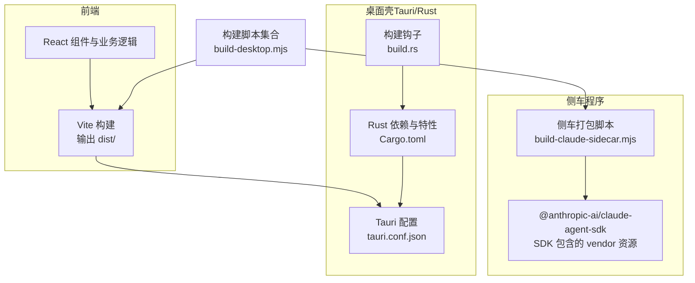
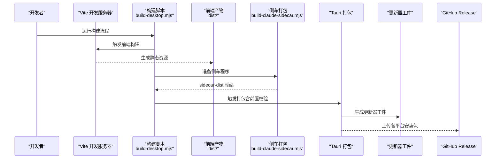
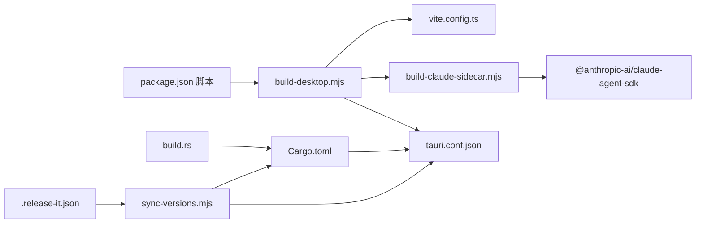

# 构建和部署

<cite>
**本文引用的文件**
- [package.json](file://package.json)
- [vite.config.ts](file://vite.config.ts)
- [src-tauri/tauri.conf.json](file://src-tauri/tauri.conf.json)
- [src-tauri/Cargo.toml](file://src-tauri/Cargo.toml)
- [src-tauri/build.rs](file://src-tauri/build.rs)
- [scripts/build-desktop.mjs](file://scripts/build-desktop.mjs)
- [scripts/build-claude-sidecar.mjs](file://scripts/build-claude-sidecar.mjs)
- [scripts/generate-homebrew-cask.mjs](file://scripts/generate-homebrew-cask.mjs)
- [scripts/sync-versions.mjs](file://scripts/sync-versions.mjs)
- [.release-it.json](file://.release-it.json)
- [src-tauri/tauri.unsigned.conf.json](file://src-tauri/tauri.unsigned.conf.json)
</cite>

## 目录
1. [简介](#简介)
2. [项目结构](#项目结构)
3. [核心组件](#核心组件)
4. [架构总览](#架构总览)
5. [详细组件分析](#详细组件分析)
6. [依赖关系分析](#依赖关系分析)
7. [性能考量](#性能考量)
8. [故障排除指南](#故障排除指南)
9. [结论](#结论)
10. [附录](#附录)

## 简介
本文件面向 Panes 的构建与部署流程，覆盖开发环境配置、前端与后端构建、侧车程序集成、多平台打包与分发、自动化发布与更新机制、版本管理与变更日志、以及持续集成与质量门禁建议。内容基于仓库中的实际配置与脚本进行梳理，帮助开发者快速理解并维护构建链路。

## 项目结构
Panes 采用“前端（React/Vite）+ 桌面壳（Tauri/Rust）+ 侧车程序（Claude Agent SDK）”的混合架构。前端通过 Vite 构建产物作为 Tauri 应用的静态资源；Tauri 配置定义了应用窗口、打包目标、插件与更新器等；侧车程序由独立脚本进行打包与裁剪，确保仅包含运行所需的二进制与最小化依赖。

图表来源
- [vite.config.ts:1-24](file://vite.config.ts#L1-L24)
- [src-tauri/tauri.conf.json:1-58](file://src-tauri/tauri.conf.json#L1-L58)
- [src-tauri/Cargo.toml:1-67](file://src-tauri/Cargo.toml#L1-L67)
- [src-tauri/build.rs:1-64](file://src-tauri/build.rs#L1-L64)
- [scripts/build-desktop.mjs:1-71](file://scripts/build-desktop.mjs#L1-L71)
- [scripts/build-claude-sidecar.mjs:1-141](file://scripts/build-claude-sidecar.mjs#L1-L141)

章节来源
- [package.json:1-89](file://package.json#L1-L89)
- [vite.config.ts:1-24](file://vite.config.ts#L1-L24)
- [src-tauri/tauri.conf.json:1-58](file://src-tauri/tauri.conf.json#L1-L58)
- [src-tauri/Cargo.toml:1-67](file://src-tauri/Cargo.toml#L1-L67)
- [src-tauri/build.rs:1-64](file://src-tauri/build.rs#L1-L64)
- [scripts/build-desktop.mjs:1-71](file://scripts/build-desktop.mjs#L1-L71)
- [scripts/build-claude-sidecar.mjs:1-141](file://scripts/build-claude-sidecar.mjs#L1-L141)

## 核心组件
- 前端构建与开发服务器：使用 Vite 提供 HMR 与本地预览，定义构建参数与环境变量注入。
- Tauri 应用壳：集中于 tauri.conf.json 的窗口、打包目标、图标、插件与更新器配置；Rust 侧通过 Cargo.toml 管理依赖与特性。
- 侧车程序：独立打包 Claude Agent SDK 及其 vendor 资源，按平台裁剪二进制，生成 sidecar-dist 输出。
- 构建脚本：统一协调前端构建、侧车打包与 Tauri 打包前置条件检查。
- 版本与发布：通过 release-it 驱动版本号同步与 GitHub Release，配合自定义脚本同步到 Rust/Cargo 配置。

章节来源
- [package.json:6-26](file://package.json#L6-L26)
- [vite.config.ts:4-23](file://vite.config.ts#L4-L23)
- [src-tauri/tauri.conf.json:6-56](file://src-tauri/tauri.conf.json#L6-L56)
- [src-tauri/Cargo.toml:15-67](file://src-tauri/Cargo.toml#L15-L67)
- [scripts/build-desktop.mjs:19-71](file://scripts/build-desktop.mjs#L19-L71)
- [scripts/build-claude-sidecar.mjs:32-133](file://scripts/build-claude-sidecar.mjs#L32-L133)
- [.release-it.json:1-26](file://.release-it.json#L1-L26)
- [scripts/sync-versions.mjs:15-71](file://scripts/sync-versions.mjs#L15-L71)

## 架构总览
下图展示从开发到打包的关键路径：开发服务器启动、前端构建、侧车程序准备、Tauri 打包与签名、更新器工件生成与 Homebrew 分发。

图表来源
- [scripts/build-desktop.mjs:63-71](file://scripts/build-desktop.mjs#L63-L71)
- [vite.config.ts:11-13](file://vite.config.ts#L11-L13)
- [scripts/build-claude-sidecar.mjs:119-133](file://scripts/build-claude-sidecar.mjs#L119-L133)
- [src-tauri/tauri.conf.json:32-46](file://src-tauri/tauri.conf.json#L32-L46)

## 详细组件分析

### 前端构建与开发环境
- Vite 配置要点
  - 插件：React 插件启用。
  - 定义常量：通过 define 注入环境变量，控制非原生 Harness 行为。
  - 构建：默认关闭代码压缩，便于调试。
  - 开发服务器：固定主机与端口，开启 HMR 并指定 HMR 端口。
- 开发命令
  - package.json 中提供 dev、preview、lint、typecheck、test 等常用命令，便于本地开发与质量保障。

章节来源
- [vite.config.ts:4-23](file://vite.config.ts#L4-L23)
- [package.json:6-19](file://package.json#L6-L19)

### Tauri 构建配置与打包策略
- 应用与窗口
  - 窗口尺寸、最小尺寸、标题栏样式与隐藏标题等在配置中集中定义。
- 构建前置
  - beforeDevCommand 指向前端 dev；beforeBuildCommand 指向自定义构建脚本，确保 dist 与 sidecar-dist 就绪。
- 打包目标
  - 启用 app、dmg、deb、appimage、nsis 多目标，满足 macOS、Linux、Windows 发布。
- 资源与图标
  - resources 指定 sidecar-dist；icon 列表包含多分辨率与平台图标。
- 更新器
  - 配置更新端点、公钥、安装模式与对话框行为，支持被动安装与签名验证。
- 无签名配置
  - tauri.unsigned.conf.json 关闭更新器工件生成，用于测试或特殊场景。

章节来源
- [src-tauri/tauri.conf.json:6-56](file://src-tauri/tauri.conf.json#L6-L56)
- [src-tauri/tauri.unsigned.conf.json:1-6](file://src-tauri/tauri.unsigned.conf.json#L1-L6)

### Rust 侧依赖与特性
- 依赖管理
  - 通过 Cargo.toml 引入 Tauri 及其插件、数据库 rusqlite（捆绑）、Git 与文件系统相关库。
  - 集成 vendor/claude-code-rust 子模块以支持 Claude Code Rust 功能。
- 特性开关
  - 默认启用 custom-protocol；提供 non-native-harnesses 等特性标记，便于条件编译。
- 构建钩子
  - build.rs 监听 tauri.conf.json 与图标变化，并在 macOS 上调用 helper 构建脚本，编译辅助工具。

章节来源
- [src-tauri/Cargo.toml:15-67](file://src-tauri/Cargo.toml#L15-L67)
- [src-tauri/build.rs:1-64](file://src-tauri/build.rs#L1-L64)

### 侧车程序集成与平台裁剪
- 目标与入口
  - 入口位于 src-tauri/sidecar/claude-agent-sdk-server.mjs，输出至 sidecar-dist。
  - 通过 @anthropic-ai/claude-agent-sdk 的解析定位 SDK 包位置，复制到 sidecar-dist/node_modules。
- 平台裁剪
  - 按目标平台与架构保留 ripgrep vendor 资源，移除不匹配的目录，减少体积。
  - Linux 场景下对 node_modules 进行归档并在运行时解压，平衡分发体积与运行效率。
- 校验
  - 最终输出需仍包含对 SDK 的导入语句，保证运行时可用。

章节来源
- [scripts/build-claude-sidecar.mjs:32-133](file://scripts/build-claude-sidecar.mjs#L32-L133)

### 构建脚本与流程编排
- build-desktop.mjs
  - 在跳过标志开启时直接校验 dist 与 sidecar-dist 是否存在。
  - 否则依次执行前端构建与侧车打包，确保后续 Tauri 打包可直接读取所需资源。
- 与 Tauri 集成
  - 通过 beforeBuildCommand 串联，避免手动步骤遗漏。
- 平台差异
  - Windows 下通过 shell 启动 pnpm，兼容 .cmd shim。

章节来源
- [scripts/build-desktop.mjs:19-71](file://scripts/build-desktop.mjs#L19-L71)

### 版本管理与发布流程
- 版本同步
  - release-it 钩子在 bump 后自动执行 scripts/sync-versions.mjs，同步更新 Cargo.toml 与 tauri.conf.json 的 version 字段。
- 发布配置
  - .release-it.json 使用 conventional-changelog 预设生成变更日志，提交信息包含版本号，创建 GitHub Release。
- Homebrew 分发
  - generate-homebrew-cask.mjs 从 GitHub Release 获取 dmg 资产，计算 SHA-256，渲染模板生成 cask 文件，便于社区分发。

章节来源
- [.release-it.json:1-26](file://.release-it.json#L1-L26)
- [scripts/sync-versions.mjs:15-71](file://scripts/sync-versions.mjs#L15-L71)
- [scripts/generate-homebrew-cask.mjs:101-117](file://scripts/generate-homebrew-cask.mjs#L101-L117)

### 更新机制与分发
- 更新器端点
  - tauri.conf.json 中配置了更新端点与公钥，启用签名验证与被动安装模式。
- 更新器工件
  - 通过 createUpdaterArtifacts 控制是否生成更新器工件，配合不同打包场景（如 unsigned）进行切换。
- Homebrew
  - 通过 generate-homebrew-cask.mjs 自动化生成 cask，包含版本、URL 与哈希，便于用户升级。

章节来源
- [src-tauri/tauri.conf.json:48-55](file://src-tauri/tauri.conf.json#L48-L55)
- [src-tauri/tauri.unsigned.conf.json:2-4](file://src-tauri/tauri.unsigned.conf.json#L2-L4)
- [scripts/generate-homebrew-cask.mjs:101-117](file://scripts/generate-homebrew-cask.mjs#L101-L117)

## 依赖关系分析
- 前端 → Tauri：dist/ 作为前端静态资源被 Tauri 加载。
- 侧车脚本 → SDK：复制 SDK 包与 vendor 资源，按平台裁剪。
- 构建脚本 → 前端/侧车：统一触发构建顺序，确保前置条件满足。
- Rust → Tauri 配置：Cargo.toml 决定插件与特性，build.rs 影响 macOS 辅助工具编译。
- 发布 → 版本同步：release-it 钩子驱动版本同步脚本，保持多处配置一致。

图表来源
- [package.json:6-26](file://package.json#L6-L26)
- [scripts/build-desktop.mjs:63-71](file://scripts/build-desktop.mjs#L63-L71)
- [vite.config.ts:11-13](file://vite.config.ts#L11-L13)
- [scripts/build-claude-sidecar.mjs:119-133](file://scripts/build-claude-sidecar.mjs#L119-L133)
- [src-tauri/tauri.conf.json:6-11](file://src-tauri/tauri.conf.json#L6-L11)
- [src-tauri/Cargo.toml:15-67](file://src-tauri/Cargo.toml#L15-L67)
- [src-tauri/build.rs:1-64](file://src-tauri/build.rs#L1-L64)
- [.release-it.json:22-24](file://.release-it.json#L22-L24)
- [scripts/sync-versions.mjs:15-71](file://scripts/sync-versions.mjs#L15-L71)

章节来源
- [package.json:6-26](file://package.json#L6-L26)
- [scripts/build-desktop.mjs:63-71](file://scripts/build-desktop.mjs#L63-L71)
- [scripts/build-claude-sidecar.mjs:119-133](file://scripts/build-claude-sidecar.mjs#L119-L133)
- [src-tauri/tauri.conf.json:6-11](file://src-tauri/tauri.conf.json#L6-L11)
- [src-tauri/Cargo.toml:15-67](file://src-tauri/Cargo.toml#L15-L67)
- [src-tauri/build.rs:1-64](file://src-tauri/build.rs#L1-L64)
- [.release-it.json:22-24](file://.release-it.json#L22-L24)
- [scripts/sync-versions.mjs:15-71](file://scripts/sync-versions.mjs#L15-L71)

## 性能考量
- 前端构建
  - 当前未启用代码压缩，有利于调试但会增加包体大小。生产构建建议在 CI 中开启压缩与分块策略。
- 侧车程序
  - 平台裁剪显著降低体积；Linux 使用 tar 归档 node_modules，平衡分发与运行时解压成本。
- 打包目标
  - 多目标打包会增加构建时间，建议在 PR 或本地开发阶段仅针对当前平台构建，发布阶段再全量打包。
- 更新器工件
  - 仅在需要分发更新时生成，避免不必要的计算与存储开销。

## 故障排除指南
- 前端产物缺失
  - 现象：Tauri 打包报错提示缺少 dist/index.html 或 sidecar-dist。
  - 排查：确认 build-desktop.mjs 未设置跳过标志，且已成功执行前端构建与侧车打包。
  - 参考
    - [scripts/build-desktop.mjs:22-32](file://scripts/build-desktop.mjs#L22-L32)
    - [scripts/build-desktop.mjs:69-71](file://scripts/build-desktop.mjs#L69-L71)
- 侧车程序导入异常
  - 现象：最终输出不再包含对 SDK 的导入语句。
  - 排查：检查侧车打包脚本是否正确复制 SDK 包与入口文件，确认校验逻辑通过。
  - 参考
    - [scripts/build-claude-sidecar.mjs:119-141](file://scripts/build-claude-sidecar.mjs#L119-L141)
- 平台二进制缺失
  - 现象：运行时报找不到 ripgrep 对应平台二进制。
  - 排查：确认 PANES_CLAUDE_SDK_PLATFORM 与 PANES_CLAUDE_SDK_ARCH 设置正确，或使用默认值。
  - 参考
    - [scripts/build-claude-sidecar.mjs:32-52](file://scripts/build-claude-sidecar.mjs#L32-L52)
- macOS 辅助工具未编译
  - 现象：功能受限或日志警告。
  - 排查：确认 build-helpers.sh、Swift 辅助文件存在，且 build.rs 能找到 OUT_DIR 并执行构建脚本。
  - 参考
    - [src-tauri/build.rs:23-55](file://src-tauri/build.rs#L23-L55)
- 版本不一致导致发布失败
  - 现象：GitHub Release 成功但版本未同步。
  - 排查：检查 release-it 钩子是否执行，确认 sync-versions.mjs 能修改 Cargo.toml 与 tauri.conf.json。
  - 参考
    - [.release-it.json:22-24](file://.release-it.json#L22-L24)
    - [scripts/sync-versions.mjs:15-71](file://scripts/sync-versions.mjs#L15-L71)

## 结论
Panes 的构建与部署体系围绕“前端 Vite + Tauri 桌面壳 + Claude 侧车”的组合展开，通过脚本化流程确保构建顺序与产物一致性。版本管理与发布流程借助 release-it 与自定义脚本实现自动化，更新器与 Homebrew 分发提升用户体验。建议在 CI 中引入质量门禁（类型检查、单元测试、覆盖率阈值）与多平台并行构建，进一步提升稳定性与交付效率。

## 附录
- 开发命令速查
  - dev：启动前端开发服务器
  - build：TypeScript 编译 + Vite 构建
  - build:desktop：统一触发前端与侧车构建
  - tauri:dev / tauri:build：Tauri 开发与打包
- 关键配置参考
  - Vite：define、build、server
  - Tauri：build、bundle、plugins.updater
  - Cargo：features、dependencies
  - release-it：git、github、hooks