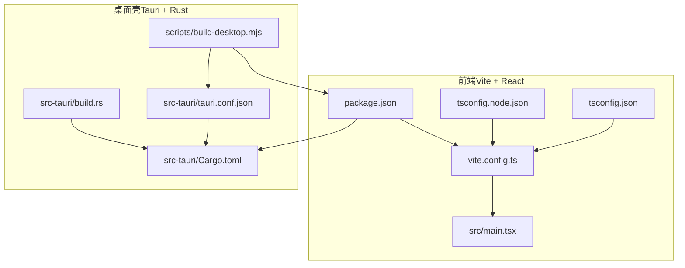
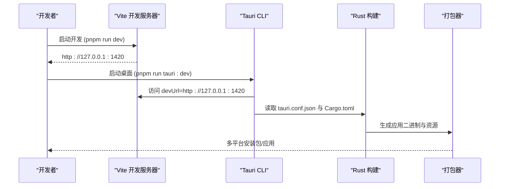
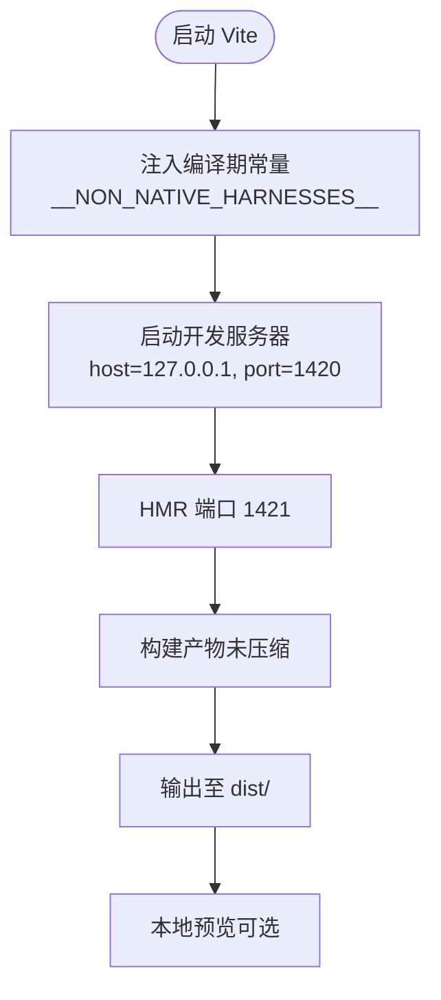
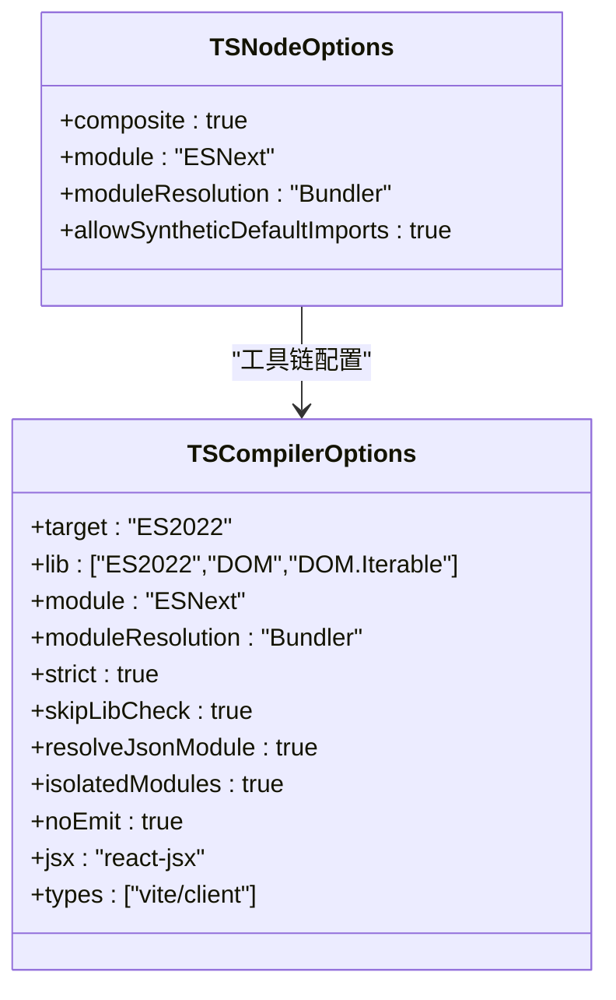
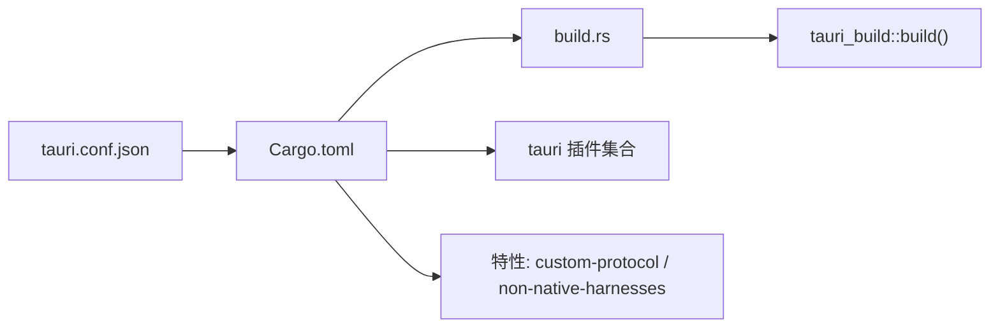
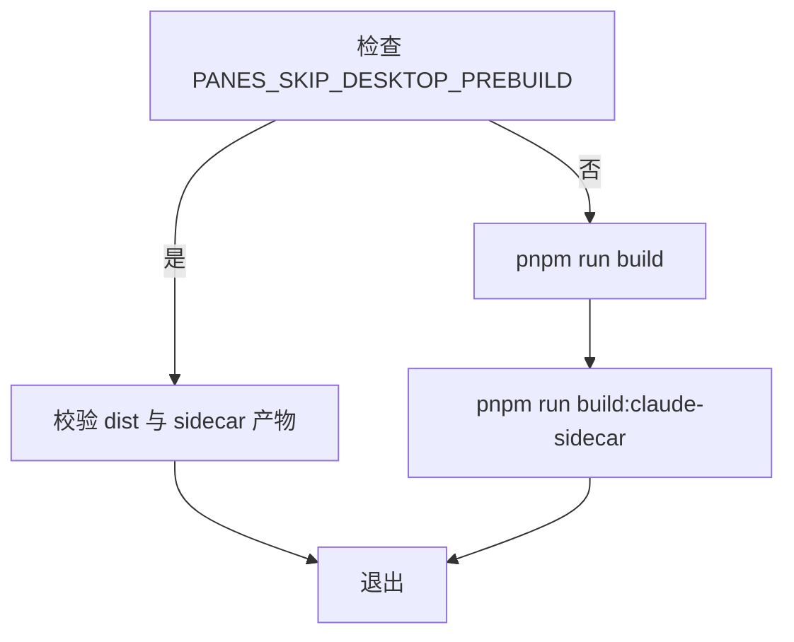
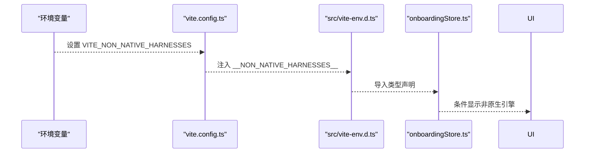
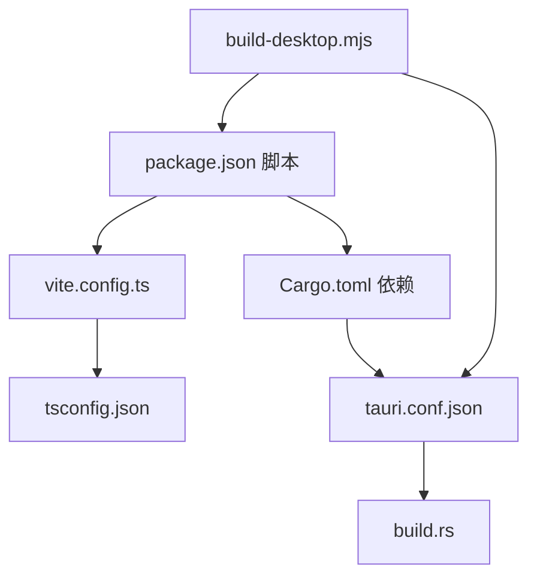

# 构建配置

<cite>
**本文引用的文件**
- [vite.config.ts](file://vite.config.ts)
- [tsconfig.json](file://tsconfig.json)
- [tsconfig.node.json](file://tsconfig.node.json)
- [package.json](file://package.json)
- [src-tauri/Cargo.toml](file://src-tauri/Cargo.toml)
- [src-tauri/tauri.conf.json](file://src-tauri/tauri.conf.json)
- [src-tauri/build.rs](file://src-tauri/build.rs)
- [scripts/build-desktop.mjs](file://scripts/build-desktop.mjs)
- [src/main.tsx](file://src/main.tsx)
- [src/vite-env.d.ts](file://src/vite-env.d.ts)
- [src/stores/onboardingStore.ts](file://src/stores/onboardingStore.ts)
</cite>

## 目录
1. [简介](#简介)
2. [项目结构](#项目结构)
3. [核心组件](#核心组件)
4. [架构总览](#架构总览)
5. [详细组件分析](#详细组件分析)
6. [依赖分析](#依赖分析)
7. [性能考虑](#性能考虑)
8. [故障排查指南](#故障排查指南)
9. [结论](#结论)
10. [附录](#附录)

## 简介
本文件系统性梳理 Panes 的构建配置，覆盖以下方面：
- Vite 前端构建配置：开发服务器、热更新（HMR）、构建优化与输出、环境变量注入
- Tauri Rust 构建配置：Cargo 与 tauri.conf.json 的集成、打包与分发、原生能力启用
- TypeScript 编译配置：模块解析、严格模式、类型检查与 Vite 集成
- 跨平台构建流程：桌面应用预构建脚本、产物校验与打包命令
- 不同环境下的配置差异与最佳实践

## 项目结构
该工程采用“前端（Vite + React）+ 桌面壳（Tauri + Rust）”的双层架构。前端通过 Vite 提供开发服务器与构建，Tauri 将前端产物打包为多平台应用，并在运行时提供系统级能力（文件系统、对话框、通知、进程等）。TypeScript 作为类型检查与编译工具链的一部分参与前端构建。

图示来源
- [vite.config.ts:1-24](file://vite.config.ts#L1-L24)
- [tsconfig.json:1-19](file://tsconfig.json#L1-L19)
- [tsconfig.node.json:1-10](file://tsconfig.node.json#L1-L10)
- [package.json:1-89](file://package.json#L1-L89)
- [src-tauri/Cargo.toml:1-67](file://src-tauri/Cargo.toml#L1-L67)
- [src-tauri/tauri.conf.json:1-58](file://src-tauri/tauri.conf.json#L1-L58)
- [src-tauri/build.rs:1-64](file://src-tauri/build.rs#L1-L64)
- [scripts/build-desktop.mjs:1-71](file://scripts/build-desktop.mjs#L1-L71)

章节来源
- [vite.config.ts:1-24](file://vite.config.ts#L1-L24)
- [tsconfig.json:1-19](file://tsconfig.json#L1-L19)
- [tsconfig.node.json:1-10](file://tsconfig.node.json#L1-L10)
- [package.json:1-89](file://package.json#L1-L89)
- [src-tauri/Cargo.toml:1-67](file://src-tauri/Cargo.toml#L1-L67)
- [src-tauri/tauri.conf.json:1-58](file://src-tauri/tauri.conf.json#L1-L58)
- [src-tauri/build.rs:1-64](file://src-tauri/build.rs#L1-L64)
- [scripts/build-desktop.mjs:1-71](file://scripts/build-desktop.mjs#L1-L71)

## 核心组件
- Vite 开发与构建配置：定义插件、环境变量注入、开发服务器与 HMR、最小化策略与清屏行为
- TypeScript 编译配置：目标语言、模块解析、严格模式、JSX、类型声明与 Vite 集成
- Tauri 应用配置：开发前命令、构建前命令、前端产物目录、窗口与安全策略、打包目标与资源、插件配置
- Rust 构建与特性：依赖管理、特性开关、调试配置、构建脚本触发图标与辅助程序
- 预构建脚本：确保必要产物存在、按顺序执行构建任务、跨平台子进程调用

章节来源
- [vite.config.ts:1-24](file://vite.config.ts#L1-L24)
- [tsconfig.json:1-19](file://tsconfig.json#L1-L19)
- [tsconfig.node.json:1-10](file://tsconfig.node.json#L1-L10)
- [src-tauri/tauri.conf.json:1-58](file://src-tauri/tauri.conf.json#L1-L58)
- [src-tauri/Cargo.toml:1-67](file://src-tauri/Cargo.toml#L1-L67)
- [src-tauri/build.rs:1-64](file://src-tauri/build.rs#L1-L64)
- [scripts/build-desktop.mjs:1-71](file://scripts/build-desktop.mjs#L1-L71)

## 架构总览
下图展示从开发到打包的关键流程：Vite 启动开发服务器，Tauri 读取 tauri.conf.json 中的 devUrl 与 frontendDist，前端构建产物被 Tauri 打包为多平台安装包；同时，Rust 侧通过 build.rs 触发 tauri_build 并在 macOS 上编译辅助程序。

图示来源
- [package.json:6-26](file://package.json#L6-L26)
- [src-tauri/tauri.conf.json:6-11](file://src-tauri/tauri.conf.json#L6-L11)
- [src-tauri/Cargo.toml:12-13](file://src-tauri/Cargo.toml#L12-L13)
- [src-tauri/build.rs:19](file://src-tauri/build.rs#L19)

章节来源
- [package.json:6-26](file://package.json#L6-L26)
- [src-tauri/tauri.conf.json:6-11](file://src-tauri/tauri.conf.json#L6-L11)
- [src-tauri/build.rs:19](file://src-tauri/build.rs#L19)

## 详细组件分析

### Vite 前端构建配置
- 插件与环境变量
  - 使用 React 插件进行 JSX 转换与 HMR 支持
  - 通过 define 注入编译期常量 __NON_NATIVE_HARNESSES__，其值由环境变量 VITE_NON_NATIVE_HARNESSES 决定
- 开发服务器与 HMR
  - 主机地址与端口固定，严格端口占用
  - HMR 独立端口，避免冲突
- 构建优化与输出
  - 关闭代码压缩以提升可调试性
  - 清屏行为关闭，便于日志查看
- 与前端运行的关系
  - 入口文件在启动时初始化国际化与渲染根组件

图示来源
- [vite.config.ts:4-23](file://vite.config.ts#L4-L23)
- [src/main.tsx:11-32](file://src/main.tsx#L11-L32)

章节来源
- [vite.config.ts:1-24](file://vite.config.ts#L1-L24)
- [src/main.tsx:11-32](file://src/main.tsx#L11-L32)

### TypeScript 编译配置
- 目标与库
  - ES2022 目标与 DOM/DOM.Iterable 库
- 模块与解析
  - ESNext 模块与 Bundler 解析策略
- 严格性与类型
  - 严格模式、跳过库检查、合成默认导入、JSON 模块解析、隔离模块、仅类型检查
- JSX 与 Vite 集成
  - JSX 使用 react-jsx，包含 vite/client 类型声明
- Node 工具链配置
  - tsconfig.node.json 限定仅包含 vite.config.ts，使用 ESNext 与 Bundler 解析

图示来源
- [tsconfig.json:2-16](file://tsconfig.json#L2-L16)
- [tsconfig.node.json:2-7](file://tsconfig.node.json#L2-L7)

章节来源
- [tsconfig.json:1-19](file://tsconfig.json#L1-L19)
- [tsconfig.node.json:1-10](file://tsconfig.node.json#L1-L10)

### Tauri Rust 构建配置
- 依赖与特性
  - Tauri v2 及多个官方插件（shell、dialog、fs、notification、process、updater）
  - 特性开关 custom-protocol 默认开启，非原生能力相关特性通过 Cargo.toml 特性控制
- 构建与调试
  - 开发配置中启用较低调试级别以平衡可调试性与体积
- 构建脚本
  - build.rs 触发 tauri_build，并在 macOS 下编译 keepawake 辅助程序
  - 监听 tauri.conf.json 与图标文件变更，触发重新构建

图示来源
- [src-tauri/tauri.conf.json:1-58](file://src-tauri/tauri.conf.json#L1-L58)
- [src-tauri/Cargo.toml:12-61](file://src-tauri/Cargo.toml#L12-L61)
- [src-tauri/build.rs:1-64](file://src-tauri/build.rs#L1-L64)

章节来源
- [src-tauri/Cargo.toml:1-67](file://src-tauri/Cargo.toml#L1-L67)
- [src-tauri/tauri.conf.json:1-58](file://src-tauri/tauri.conf.json#L1-L58)
- [src-tauri/build.rs:1-64](file://src-tauri/build.rs#L1-L64)

### 预构建与打包脚本
- build-desktop.mjs
  - 校验必要产物是否存在（前端 dist/index.html 与侧车服务）
  - 若设置跳过预构建标志，则直接校验并退出
  - 否则依次执行：前端构建、侧车构建
  - 在 Windows 上通过 shell 启动 pnpm 子进程以兼容 .cmd shim
- 与 Tauri 的集成
  - tauri.conf.json 的 beforeBuildCommand 指向该脚本
  - 前端产物目录 frontendDist 指向 ../dist

图示来源
- [scripts/build-desktop.mjs:63-71](file://scripts/build-desktop.mjs#L63-L71)
- [scripts/build-desktop.mjs:22-32](file://scripts/build-desktop.mjs#L22-L32)
- [src-tauri/tauri.conf.json:8](file://src-tauri/tauri.conf.json#L8)

章节来源
- [scripts/build-desktop.mjs:1-71](file://scripts/build-desktop.mjs#L1-L71)
- [src-tauri/tauri.conf.json:6-11](file://src-tauri/tauri.conf.json#L6-L11)

### 环境变量与功能开关
- Vite 层面
  - 通过 define 将 VITE_NON_NATIVE_HARNESSES 注入为编译期常量 __NON_NATIVE_HARNESSES__
  - 前端 Store 使用该常量决定可用引擎列表
- TypeScript 声明
  - src/vite-env.d.ts 明确定义 __NON_NATIVE_HARNESSES__ 的类型
- 功能影响
  - 当 __NON_NATIVE_HARNESSES__ 为真时，引导流程会包含非原生引擎选项

图示来源
- [vite.config.ts:6-10](file://vite.config.ts#L6-L10)
- [src/vite-env.d.ts:1-3](file://src/vite-env.d.ts#L1-L3)
- [src/stores/onboardingStore.ts:17-19](file://src/stores/onboardingStore.ts#L17-L19)

章节来源
- [vite.config.ts:6-10](file://vite.config.ts#L6-L10)
- [src/vite-env.d.ts:1-3](file://src/vite-env.d.ts#L1-L3)
- [src/stores/onboardingStore.ts:17-19](file://src/stores/onboardingStore.ts#L17-L19)

## 依赖分析
- 前端与构建
  - package.json 定义了开发与构建脚本、Vite 与 React 生态依赖、TypeScript 类型与测试工具
  - Vite 配置依赖 React 插件与 tsconfig.json 的模块解析策略
- 桌面壳与系统能力
  - Cargo.toml 引入 Tauri 与各插件，提供文件系统、对话框、通知、进程与更新能力
  - tauri.conf.json 指定窗口、安全策略、打包目标与资源路径
- 构建触发链路
  - build.rs 通过 tauri_build 触发 Rust 构建，监听图标与配置变更
  - scripts/build-desktop.mjs 串联前端与侧车构建，确保产物就绪

图示来源
- [package.json:6-26](file://package.json#L6-L26)
- [vite.config.ts:1-3](file://vite.config.ts#L1-L3)
- [tsconfig.json:2-6](file://tsconfig.json#L2-L6)
- [src-tauri/Cargo.toml:15-31](file://src-tauri/Cargo.toml#L15-L31)
- [src-tauri/tauri.conf.json:6-11](file://src-tauri/tauri.conf.json#L6-L11)
- [src-tauri/build.rs:1-20](file://src-tauri/build.rs#L1-L20)
- [scripts/build-desktop.mjs:1-10](file://scripts/build-desktop.mjs#L1-L10)

章节来源
- [package.json:1-89](file://package.json#L1-L89)
- [vite.config.ts:1-24](file://vite.config.ts#L1-L24)
- [tsconfig.json:1-19](file://tsconfig.json#L1-L19)
- [src-tauri/Cargo.toml:1-67](file://src-tauri/Cargo.toml#L1-L67)
- [src-tauri/tauri.conf.json:1-58](file://src-tauri/tauri.conf.json#L1-L58)
- [src-tauri/build.rs:1-64](file://src-tauri/build.rs#L1-L64)
- [scripts/build-desktop.mjs:1-71](file://scripts/build-desktop.mjs#L1-L71)

## 性能考虑
- 构建优化
  - 当前未启用代码压缩，有利于调试但会增大产物体积；生产构建建议开启压缩与代码分割
  - 可结合动态导入与路由级代码分割减少首屏体积
- 开发体验
  - 固定主机与端口、独立 HMR 端口降低网络与端口冲突风险
  - 清屏关闭便于在终端查看日志
- Rust 调试
  - 开发配置中降低调试级别，兼顾可调试性与构建速度

章节来源
- [vite.config.ts:11-13](file://vite.config.ts#L11-L13)
- [vite.config.ts:14-22](file://vite.config.ts#L14-L22)
- [src-tauri/Cargo.toml:64-67](file://src-tauri/Cargo.toml#L64-L67)

## 故障排查指南
- 开发服务器无法访问或端口冲突
  - 检查 host/port 与 HMR 端口是否被占用
  - 确认 strictPort 已启用，避免自动降级
- 构建失败或产物缺失
  - 确保 scripts/build-desktop.mjs 校验的 dist 与 sidecar 文件存在
  - 在 Windows 上确认通过 shell 启动 pnpm，避免 .cmd shim 问题
- Tauri 打包异常
  - 检查 tauri.conf.json 的 frontendDist 与 beforeBuildCommand 是否指向正确路径
  - 确认 Cargo.toml 中插件版本与特性开关一致
- macOS 辅助程序未编译
  - 检查 build.rs 中辅助脚本路径与权限
  - 确认 OUT_DIR 与输出目录解析逻辑

章节来源
- [vite.config.ts:14-22](file://vite.config.ts#L14-L22)
- [scripts/build-desktop.mjs:34-61](file://scripts/build-desktop.mjs#L34-L61)
- [src-tauri/tauri.conf.json:6-11](file://src-tauri/tauri.conf.json#L6-L11)
- [src-tauri/build.rs:23-55](file://src-tauri/build.rs#L23-L55)

## 结论
本项目通过 Vite + Tauri 的组合实现高性能的桌面应用开发与分发。Vite 提供快速迭代与 HMR，Tauri 提供系统能力与跨平台打包。通过明确的环境变量注入与预构建脚本，确保开发与生产的稳定衔接。建议在生产构建中启用压缩与代码分割，并持续维护 Rust 插件与图标资源的变更监听。

## 附录
- 常用命令
  - 开发：pnpm run dev（前端）、pnpm run tauri:dev（桌面）
  - 构建：pnpm run build（TS + Vite）、pnpm run tauri:build（打包）
  - 预构建：pnpm run build:desktop（执行 build-desktop.mjs）

章节来源
- [package.json:6-26](file://package.json#L6-L26)