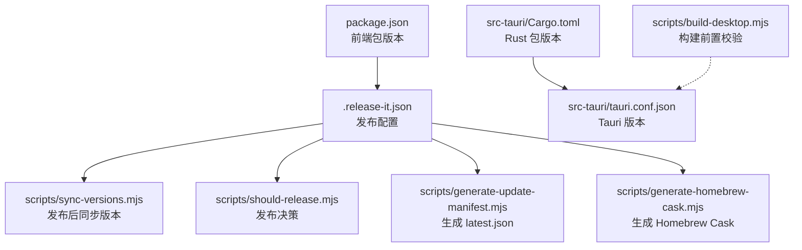
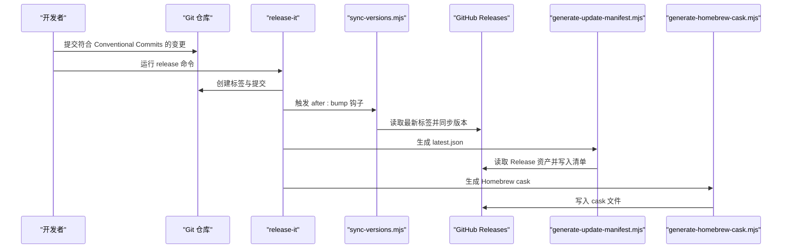
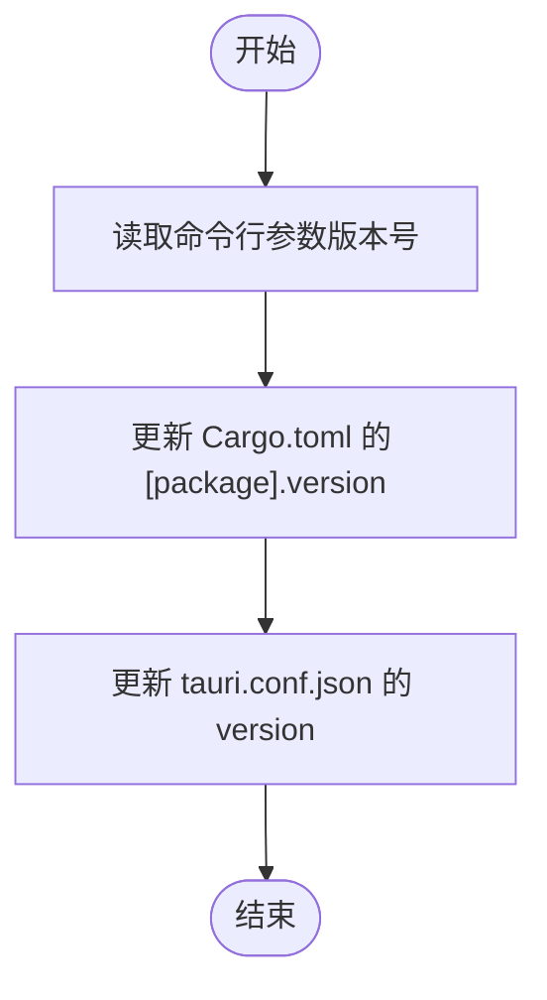
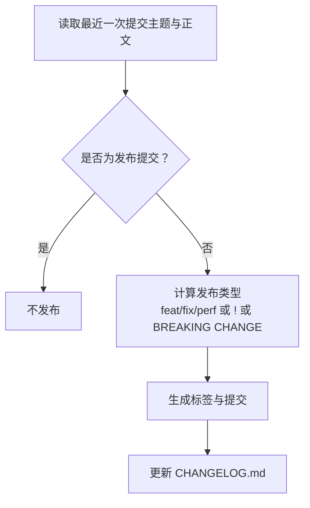
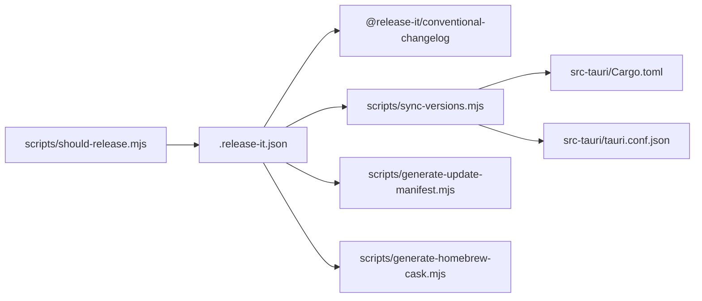

# 版本管理

<cite>
**本文引用的文件**
- [package.json](file://package.json)
- [.release-it.json](file://.release-it.json)
- [scripts/sync-versions.mjs](file://scripts/sync-versions.mjs)
- [scripts/should-release.mjs](file://scripts/should-release.mjs)
- [scripts/generate-homebrew-cask.mjs](file://scripts/generate-homebrew-cask.mjs)
- [scripts/generate-update-manifest.mjs](file://scripts/generate-update-manifest.mjs)
- [scripts/build-desktop.mjs](file://scripts/build-desktop.mjs)
- [src-tauri/tauri.conf.json](file://src-tauri/tauri.conf.json)
- [src-tauri/Cargo.toml](file://src-tauri/Cargo.toml)
</cite>

## 目录
1. [简介](#简介)
2. [项目结构](#项目结构)
3. [核心组件](#核心组件)
4. [架构总览](#架构总览)
5. [详细组件分析](#详细组件分析)
6. [依赖关系分析](#依赖关系分析)
7. [性能考量](#性能考量)
8. [故障排查指南](#故障排查指南)
9. [结论](#结论)
10. [附录](#附录)

## 简介
本文件系统化阐述 Panes 的版本管理策略，覆盖以下方面：
- 版本号同步机制：前端包版本与原生层（Rust/Tauri）版本的联动更新
- 语义化版本控制与发布标签管理：基于 Conventional Commits 的自动识别与变更日志生成
- 版本比较与兼容性检查：通过提交规范与破坏性变更标记进行兼容性判断
- 升级路径规划：基于 feat/fix/perf 与破坏性变更标记的升级策略
- 预发布版本处理、稳定版本发布与紧急补丁流程：结合发布检查脚本与发布钩子
- 版本历史记录与变更日志生成：自动生成 CHANGELOG.md
- 向后兼容性保证：通过破坏性变更标记与更新清单校验保障

## 项目结构
Panes 的版本管理由多处配置与脚本协同完成：
- 前端包版本：在 package.json 中定义
- 原生层版本：在 src-tauri/Cargo.toml 与 src-tauri/tauri.conf.json 中定义
- 发布工具链：.release-it.json 配置 release-it 及其插件
- 自动化脚本：用于版本同步、发布决策、更新清单与 Homebrew Cask 生成等

图表来源
- [package.json:1-89](file://package.json#L1-L89)
- [.release-it.json:1-26](file://.release-it.json#L1-L26)
- [src-tauri/Cargo.toml:1-67](file://src-tauri/Cargo.toml#L1-L67)
- [src-tauri/tauri.conf.json:1-58](file://src-tauri/tauri.conf.json#L1-L58)
- [scripts/sync-versions.mjs:1-71](file://scripts/sync-versions.mjs#L1-L71)
- [scripts/should-release.mjs:1-71](file://scripts/should-release.mjs#L1-L71)
- [scripts/generate-update-manifest.mjs:1-123](file://scripts/generate-update-manifest.mjs#L1-L123)
- [scripts/generate-homebrew-cask.mjs:1-117](file://scripts/generate-homebrew-cask.mjs#L1-L117)
- [scripts/build-desktop.mjs:1-71](file://scripts/build-desktop.mjs#L1-L71)

章节来源
- [package.json:1-89](file://package.json#L1-L89)
- [src-tauri/Cargo.toml:1-67](file://src-tauri/Cargo.toml#L1-L67)
- [src-tauri/tauri.conf.json:1-58](file://src-tauri/tauri.conf.json#L1-L58)
- [.release-it.json:1-26](file://.release-it.json#L1-L26)

## 核心组件
- 前端包版本与脚本入口
  - package.json 定义当前版本与发布脚本，其中包含 release:check 与 release 脚本，分别用于发布决策与触发 release-it
- 发布配置与钩子
  - .release-it.json 指定 Git 提交信息、标签格式、GitHub 发布开关、变更日志插件与发布后钩子
- 版本同步器
  - scripts/sync-versions.mjs 在发布后自动更新原生层版本，确保前端与原生层版本一致
- 发布决策器
  - scripts/should-release.mjs 基于最近提交与标签历史判断是否需要发布，并支持输出到 GitHub Actions 环境变量
- 更新清单生成器
  - scripts/generate-update-manifest.mjs 从 GitHub Release 读取资产并生成 Tauri Updater 所需的 latest.json
- Homebrew Cask 生成器
  - scripts/generate-homebrew-cask.mjs 生成 Homebrew cask 文件，包含版本、SHA256 与下载地址
- 构建前置校验
  - scripts/build-desktop.mjs 校验桌面应用构建所需资源存在性

章节来源
- [package.json:6-26](file://package.json#L6-L26)
- [.release-it.json:1-26](file://.release-it.json#L1-L26)
- [scripts/sync-versions.mjs:1-71](file://scripts/sync-versions.mjs#L1-L71)
- [scripts/should-release.mjs:1-71](file://scripts/should-release.mjs#L1-L71)
- [scripts/generate-update-manifest.mjs:1-123](file://scripts/generate-update-manifest.mjs#L1-L123)
- [scripts/generate-homebrew-cask.mjs:1-117](file://scripts/generate-homebrew-cask.mjs#L1-L117)
- [scripts/build-desktop.mjs:1-71](file://scripts/build-desktop.mjs#L1-L71)

## 架构总览
下图展示从提交到发布的完整流程，包括版本号同步、更新清单与 Homebrew Cask 生成。

图表来源
- [.release-it.json:22-24](file://.release-it.json#L22-L24)
- [scripts/sync-versions.mjs:69-71](file://scripts/sync-versions.mjs#L69-L71)
- [scripts/generate-update-manifest.mjs:52-105](file://scripts/generate-update-manifest.mjs#L52-L105)
- [scripts/generate-homebrew-cask.mjs:101-117](file://scripts/generate-homebrew-cask.mjs#L101-L117)

## 详细组件分析

### 版本号同步机制
- 同步目标
  - 将前端包版本同步至原生层（Rust/Tauri），确保发布产物版本一致性
- 实现方式
  - 发布后钩子 after:bump 调用 scripts/sync-versions.mjs，该脚本负责：
    - 更新 src-tauri/Cargo.toml 的 [package] 段落中的 version 字段
    - 更新 src-tauri/tauri.conf.json 中的 version 字段
- 错误处理
  - 若未能匹配到目标字段，抛出错误以阻止不一致的版本发布

图表来源
- [scripts/sync-versions.mjs:9-71](file://scripts/sync-versions.mjs#L9-L71)

章节来源
- [.release-it.json:22-24](file://.release-it.json#L22-L24)
- [scripts/sync-versions.mjs:15-71](file://scripts/sync-versions.mjs#L15-L71)
- [src-tauri/Cargo.toml:1-67](file://src-tauri/Cargo.toml#L1-L67)
- [src-tauri/tauri.conf.json:1-58](file://src-tauri/tauri.conf.json#L1-L58)

### 语义化版本控制与发布标签管理
- 提交规范
  - 使用 Conventional Commits，识别 feat、fix、perf 作为次要或补丁发布依据；! 标记破坏性变更；BREAKING CHANGE 正文标记
- 标签命名
  - release-it 配置使用 v{version} 作为 tagName，提交信息使用 chore(release): v{version}
- 变更日志
  - 插件 @release-it/conventional-changelog 基于 preset conventionalcommits 生成 CHANGELOG.md

图表来源
- [scripts/should-release.mjs:35-63](file://scripts/should-release.mjs#L35-L63)
- [.release-it.json:2-24](file://.release-it.json#L2-L24)

章节来源
- [scripts/should-release.mjs:1-71](file://scripts/should-release.mjs#L1-L71)
- [.release-it.json:1-26](file://.release-it.json#L1-L26)

### 版本比较算法与兼容性检查
- 版本比较
  - 采用语义化版本规则：主版本号.次版本号.修订号（MAJOR.MINOR.PATCH）
- 兼容性检查
  - 破坏性变更（! 或 BREAKING CHANGE）：主版本号递增
  - 新功能（feat）：次版本号递增
  - 修复（fix）、性能改进（perf）：修订号递增
- 升级路径规划
  - 主版本：重大破坏性变更，建议用户评估迁移成本
  - 次版本：新增功能，通常向后兼容
  - 修订：仅修复问题，无破坏性变更

章节来源
- [scripts/should-release.mjs:53-55](file://scripts/should-release.mjs#L53-L55)

### 预发布版本处理、稳定版本发布与紧急补丁流程
- 预发布版本
  - 当前配置聚焦稳定版本发布（feat/fix/perf 与破坏性变更），未显式配置预发布标识符
- 稳定版本发布
  - 通过 release 命令触发 release-it，自动创建标签、提交与 GitHub Release
- 紧急补丁
  - 通过 fix 类型提交触发补丁版本发布；如涉及破坏性变更，应使用 ! 或 BREAKING CHANGE 标记

章节来源
- [.release-it.json:1-26](file://.release-it.json#L1-L26)
- [scripts/should-release.mjs:53-55](file://scripts/should-release.mjs#L53-L55)

### 版本历史记录与变更日志生成
- 自动生成
  - release-it 结合 @release-it/conventional-changelog 插件，按 conventionalcommits 规范解析提交，生成 CHANGELOG.md
- 输出位置
  - infile 指定为 CHANGELOG.md，header 为 “# Changelog”

章节来源
- [.release-it.json:15-21](file://.release-it.json#L15-L21)

### 向后兼容性保证
- 破坏性变更标记
  - 通过提交主题中的 ! 或正文中的 BREAKING CHANGE 字样明确破坏性变更
- 更新清单校验
  - generate-update-manifest.mjs 从 GitHub Release 读取资产与签名，生成 latest.json，供 Tauri Updater 使用，确保客户端可验证更新

章节来源
- [scripts/should-release.mjs:54-55](file://scripts/should-release.mjs#L54-L55)
- [scripts/generate-update-manifest.mjs:52-87](file://scripts/generate-update-manifest.mjs#L52-L87)

## 依赖关系分析
- 发布工具链依赖
  - release-it 与 @release-it/conventional-changelog 插件共同驱动版本发布与变更日志生成
- 版本同步依赖
  - sync-versions.mjs 依赖 src-tauri/Cargo.toml 与 src-tauri/tauri.conf.json 的结构稳定性
- 发布决策依赖
  - should-release.mjs 依赖 Git 提交历史与标签状态
- 更新清单与 Homebrew Cask 依赖
  - generate-update-manifest.mjs 与 generate-homebrew-cask.mjs 依赖 GitHub API 与 Release 资产

图表来源
- [.release-it.json:15-24](file://.release-it.json#L15-L24)
- [scripts/sync-versions.mjs:15-71](file://scripts/sync-versions.mjs#L15-L71)
- [scripts/should-release.mjs:1-71](file://scripts/should-release.mjs#L1-L71)
- [scripts/generate-update-manifest.mjs:14-17](file://scripts/generate-update-manifest.mjs#L14-L17)
- [scripts/generate-homebrew-cask.mjs:8-117](file://scripts/generate-homebrew-cask.mjs#L8-L117)
- [src-tauri/Cargo.toml:1-67](file://src-tauri/Cargo.toml#L1-L67)
- [src-tauri/tauri.conf.json:1-58](file://src-tauri/tauri.conf.json#L1-L58)

章节来源
- [.release-it.json:1-26](file://.release-it.json#L1-L26)
- [scripts/sync-versions.mjs:1-71](file://scripts/sync-versions.mjs#L1-L71)
- [scripts/should-release.mjs:1-71](file://scripts/should-release.mjs#L1-L71)
- [scripts/generate-update-manifest.mjs:1-123](file://scripts/generate-update-manifest.mjs#L1-L123)
- [scripts/generate-homebrew-cask.mjs:1-117](file://scripts/generate-homebrew-cask.mjs#L1-L117)
- [src-tauri/Cargo.toml:1-67](file://src-tauri/Cargo.toml#L1-L67)
- [src-tauri/tauri.conf.json:1-58](file://src-tauri/tauri.conf.json#L1-L58)

## 性能考量
- 发布决策缓存
  - should-release.mjs 通过一次性执行 Git 命令获取提交与标签信息，避免重复 IO
- 资产哈希计算
  - generate-homebrew-cask.mjs 对下载流进行增量哈希计算，避免全量下载
- 构建前置校验
  - build-desktop.mjs 在构建前检查必要资源是否存在，减少无效构建

## 故障排查指南
- 发布被跳过
  - 检查最近一次提交是否为发布提交；确认是否有 feat/fix/perf 或破坏性变更标记；确认是否存在标签历史
- 版本不同步
  - 确认 after:bump 钩子已执行；检查 Cargo.toml 与 tauri.conf.json 是否存在对应字段
- 更新清单为空
  - 确认 Release 中包含更新器兼容资产；检查资产名称解析逻辑
- Homebrew Cask 生成失败
  - 确认 GitHub Token 有效；确认 Release 标签正确且包含 DMG 资产

章节来源
- [scripts/should-release.mjs:35-71](file://scripts/should-release.mjs#L35-L71)
- [scripts/sync-versions.mjs:38-50](file://scripts/sync-versions.mjs#L38-L50)
- [scripts/generate-update-manifest.mjs:68-79](file://scripts/generate-update-manifest.mjs#L68-L79)
- [scripts/generate-homebrew-cask.mjs:105-117](file://scripts/generate-homebrew-cask.mjs#L105-L117)

## 结论
Panes 的版本管理以 Conventional Commits 为基础，借助 release-it 与一系列自动化脚本实现：
- 前端与原生层版本的自动同步
- 基于提交类型的语义化版本发布
- 自动生成变更日志与更新清单
- 支持 Homebrew 分发与 Tauri Updater 的安全更新

该策略在保证向后兼容性的同时，提供了清晰的升级路径与可追溯的版本历史。

## 附录
- 关键文件与职责
  - package.json：前端包版本与发布脚本入口
  - .release-it.json：发布配置与钩子
  - scripts/sync-versions.mjs：版本同步
  - scripts/should-release.mjs：发布决策
  - scripts/generate-update-manifest.mjs：更新清单生成
  - scripts/generate-homebrew-cask.mjs：Homebrew Cask 生成
  - scripts/build-desktop.mjs：构建前置校验
  - src-tauri/Cargo.toml：Rust 包版本
  - src-tauri/tauri.conf.json：Tauri 版本与更新器配置