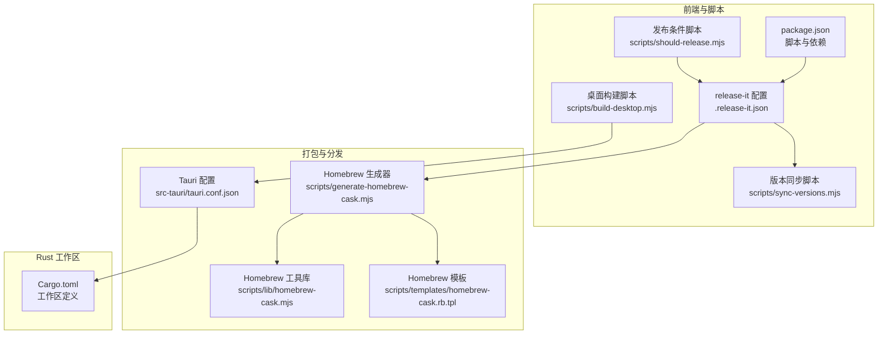
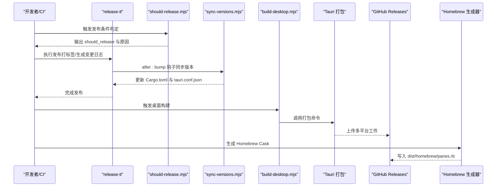
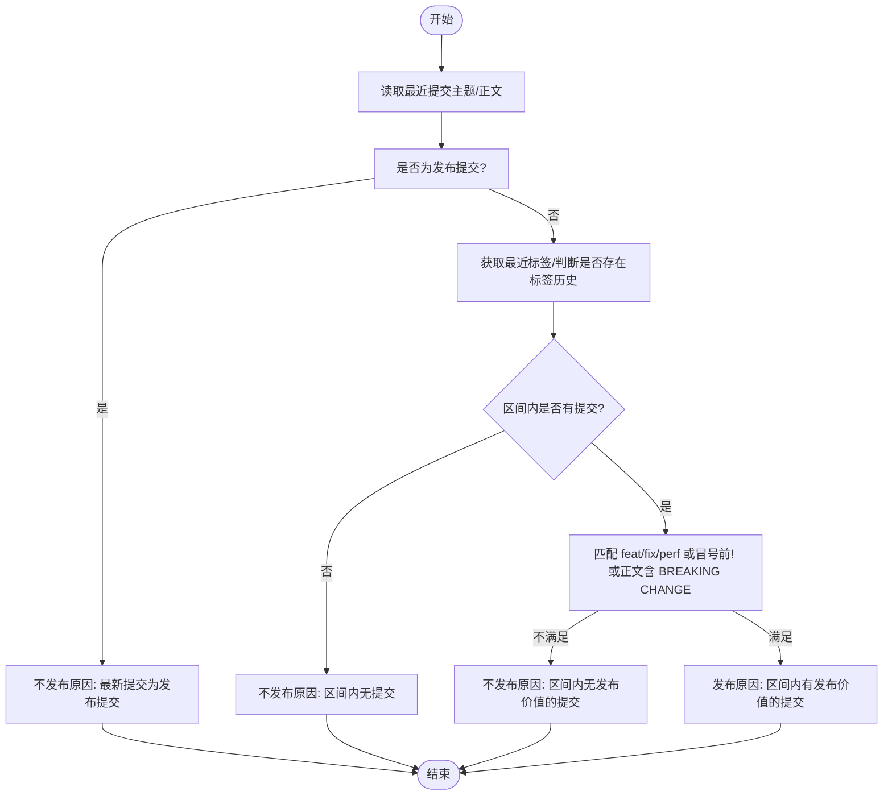
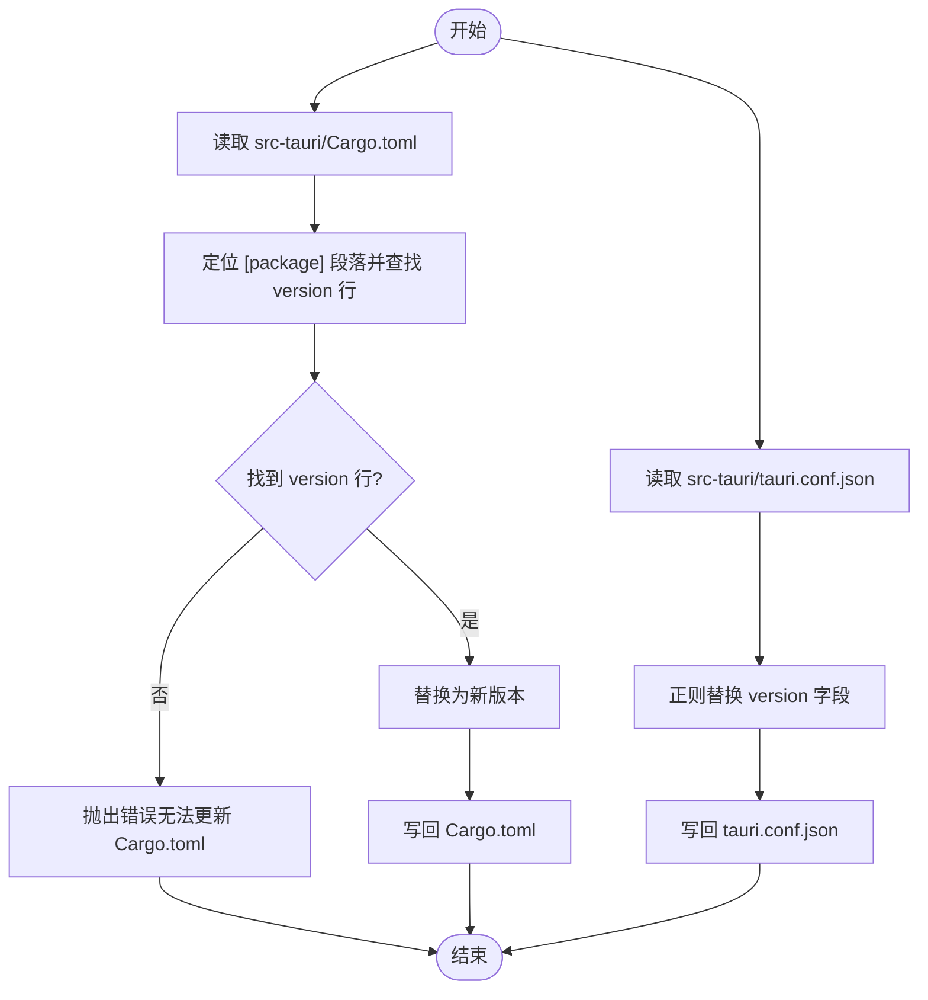
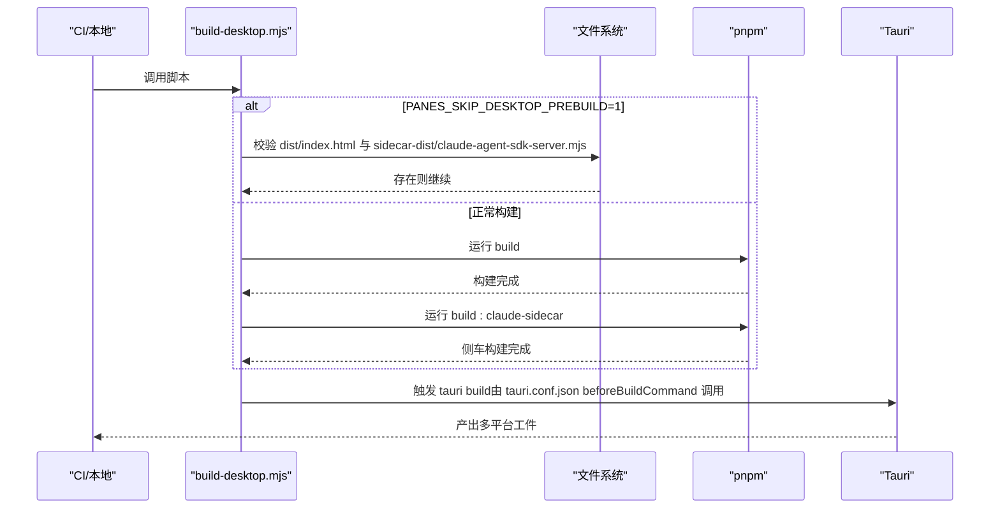
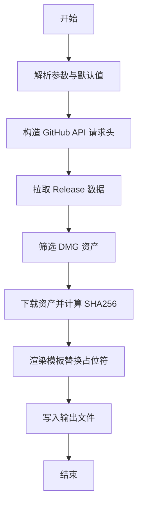
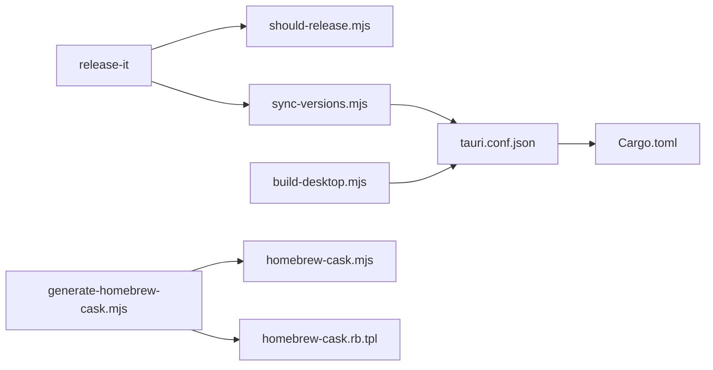

# 自动化部署

<cite>
**本文引用的文件**
- [package.json](file://package.json)
- [.release-it.json](file://.release-it.json)
- [scripts/should-release.mjs](file://scripts/should-release.mjs)
- [scripts/sync-versions.mjs](file://scripts/sync-versions.mjs)
- [scripts/build-desktop.mjs](file://scripts/build-desktop.mjs)
- [scripts/generate-homebrew-cask.mjs](file://scripts/generate-homebrew-cask.mjs)
- [scripts/lib/homebrew-cask.mjs](file://scripts/lib/homebrew-cask.mjs)
- [scripts/templates/homebrew-cask.rb.tpl](file://scripts/templates/homebrew-cask.rb.tpl)
- [src-tauri/tauri.conf.json](file://src-tauri/tauri.conf.json)
- [Cargo.toml](file://Cargo.toml)
</cite>

## 目录
1. [简介](#简介)
2. [项目结构](#项目结构)
3. [核心组件](#核心组件)
4. [架构总览](#架构总览)
5. [详细组件分析](#详细组件分析)
6. [依赖关系分析](#依赖关系分析)
7. [性能与可维护性考量](#性能与可维护性考量)
8. [故障排查指南](#故障排查指南)
9. [结论](#结论)
10. [附录](#附录)

## 简介
本文件系统化梳理 Panes 的自动化部署流程，覆盖版本同步机制、发布条件判断、多平台构建与打包、质量门禁与测试、发布验证、部署监控、回滚策略与紧急修复流程。尽管仓库中未包含 GitHub Actions 工作流文件，但通过 release-it 配置、版本同步脚本、桌面应用构建脚本以及 Homebrew 打包模板，可以完整还原一条从“变更检测”到“跨平台发布”的端到端流水线。

## 项目结构
围绕自动化部署的关键文件分布如下：
- 发布与版本管理：package.json（脚本）、.release-it.json（发布配置）
- 版本同步：scripts/sync-versions.mjs
- 发布条件判定：scripts/should-release.mjs
- 桌面应用构建：scripts/build-desktop.mjs、src-tauri/tauri.conf.json
- Homebrew 打包：scripts/generate-homebrew-cask.mjs、scripts/lib/homebrew-cask.mjs、scripts/templates/homebrew-cask.rb.tpl
- Rust 工作区：Cargo.toml

图表来源
- [package.json:1-89](file://package.json#L1-L89)
- [.release-it.json:1-26](file://.release-it.json#L1-L26)
- [scripts/should-release.mjs:1-71](file://scripts/should-release.mjs#L1-L71)
- [scripts/sync-versions.mjs:1-71](file://scripts/sync-versions.mjs#L1-L71)
- [scripts/build-desktop.mjs:1-71](file://scripts/build-desktop.mjs#L1-L71)
- [scripts/generate-homebrew-cask.mjs:1-117](file://scripts/generate-homebrew-cask.mjs#L1-L117)
- [scripts/lib/homebrew-cask.mjs:1-33](file://scripts/lib/homebrew-cask.mjs#L1-L33)
- [scripts/templates/homebrew-cask.rb.tpl:1-22](file://scripts/templates/homebrew-cask.rb.tpl#L1-L22)
- [src-tauri/tauri.conf.json:1-58](file://src-tauri/tauri.conf.json#L1-L58)
- [Cargo.toml:1-24](file://Cargo.toml#L1-L24)

章节来源
- [package.json:1-89](file://package.json#L1-L89)
- [.release-it.json:1-26](file://.release-it.json#L1-L26)
- [src-tauri/tauri.conf.json:1-58](file://src-tauri/tauri.conf.json#L1-L58)
- [Cargo.toml:1-24](file://Cargo.toml#L1-L24)

## 核心组件
- 发布与版本管理
  - 使用 release-it 进行语义化版本与标签打标，并在发布后执行版本同步钩子，确保前端、Tauri 与 Cargo.toml 版本一致。
- 发布条件判定
  - 基于最近提交信息与标签历史，判断是否具备发布条件；支持在 CI 中输出布尔值与原因，便于工作流决策。
- 桌面应用构建
  - 构建前校验必要产物存在性，调用 pnpm 脚本完成 Web 前端与侧车服务构建，供 Tauri 打包使用。
- 多平台打包与更新
  - Tauri 配置启用多目标打包（DMG、DEB、AppImage、NSIS），并开启更新程序工件生成；更新通道指向站点 JSON。
- Homebrew 分发
  - 自动生成 Homebrew Cask，解析 GitHub Release 资产、计算 SHA256 并渲染模板，便于 macOS 用户一键安装。

章节来源
- [.release-it.json:1-26](file://.release-it.json#L1-L26)
- [scripts/should-release.mjs:1-71](file://scripts/should-release.mjs#L1-L71)
- [scripts/build-desktop.mjs:1-71](file://scripts/build-desktop.mjs#L1-L71)
- [src-tauri/tauri.conf.json:1-58](file://src-tauri/tauri.conf.json#L1-L58)
- [scripts/generate-homebrew-cask.mjs:1-117](file://scripts/generate-homebrew-cask.mjs#L1-L117)
- [scripts/lib/homebrew-cask.mjs:1-33](file://scripts/lib/homebrew-cask.mjs#L1-L33)
- [scripts/templates/homebrew-cask.rb.tpl:1-22](file://scripts/templates/homebrew-cask.rb.tpl#L1-L22)

## 架构总览
下图展示从“变更检测”到“跨平台发布”的端到端流程，涵盖版本同步、构建与打包、分发与更新。

图表来源
- [scripts/should-release.mjs:1-71](file://scripts/should-release.mjs#L1-L71)
- [.release-it.json:22-24](file://.release-it.json#L22-L24)
- [scripts/sync-versions.mjs:1-71](file://scripts/sync-versions.mjs#L1-L71)
- [scripts/build-desktop.mjs:1-71](file://scripts/build-desktop.mjs#L1-L71)
- [src-tauri/tauri.conf.json:32-46](file://src-tauri/tauri.conf.json#L32-L46)
- [scripts/generate-homebrew-cask.mjs:101-117](file://scripts/generate-homebrew-cask.mjs#L101-L117)

## 详细组件分析

### 发布条件判定（should-release.mjs）
- 功能要点
  - 读取最新提交主题与正文，排除“chore(release):”类型的发布提交。
  - 基于标签区间统计提交，匹配 feat/fix/perf 或冒号前含“!”或正文含 BREAKING CHANGE 的提交作为“有发布价值”的依据。
  - 支持在 CI 中写入 GITHUB_OUTPUT，输出布尔值与原因字符串，便于工作流分支控制。
- 关键逻辑
  - 若无任何提交或仅发布提交，则不触发发布。
  - 初次发布时若无“有发布价值”的提交则不发布。
  - 其他情况根据标签区间内的提交内容决定是否发布。

图表来源
- [scripts/should-release.mjs:35-71](file://scripts/should-release.mjs#L35-L71)

章节来源
- [scripts/should-release.mjs:1-71](file://scripts/should-release.mjs#L1-L71)

### 版本同步（sync-versions.mjs）
- 功能要点
  - 在发布后由 release-it 钩子调用，同步更新 Tauri 工程中的 Cargo.toml 与 tauri.conf.json 的版本字段。
  - 对 Cargo.toml 的 [package] 段落进行精确定位替换，对 tauri.conf.json 使用正则替换版本字段。
- 错误处理
  - 若未能在目标文件中找到对应版本字段，抛出错误并终止发布流程，避免版本不一致。

图表来源
- [scripts/sync-versions.mjs:15-71](file://scripts/sync-versions.mjs#L15-L71)

章节来源
- [scripts/sync-versions.mjs:1-71](file://scripts/sync-versions.mjs#L1-L71)
- [.release-it.json:22-24](file://.release-it.json#L22-L24)

### 桌面应用构建（build-desktop.mjs）
- 功能要点
  - 在非跳过模式下，按顺序执行“前端构建”和“侧车服务构建”，确保 dist 与 sidecar-dist 就绪。
  - 支持通过环境变量跳过预构建校验，直接复用已有产物。
  - 在 Windows 上通过 shell 启动 pnpm，兼容 .cmd shim。
- 质量门禁
  - 构建前校验关键产物存在性，缺失时报错，防止后续打包失败。

图表来源
- [scripts/build-desktop.mjs:63-71](file://scripts/build-desktop.mjs#L63-L71)
- [src-tauri/tauri.conf.json:8](file://src-tauri/tauri.conf.json#L8)

章节来源
- [scripts/build-desktop.mjs:1-71](file://scripts/build-desktop.mjs#L1-L71)
- [src-tauri/tauri.conf.json:1-58](file://src-tauri/tauri.conf.json#L1-L58)

### 多平台打包与更新（tauri.conf.json）
- 功能要点
  - 启用多目标打包：app、dmg、deb、appimage、nsis。
  - 指定资源目录（sidecar-dist）随应用打包。
  - 开启更新程序工件生成，并配置更新通道与公钥。
- 影响范围
  - 该配置直接影响最终二进制与安装包形态，需与版本同步保持一致。

章节来源
- [src-tauri/tauri.conf.json:32-56](file://src-tauri/tauri.conf.json#L32-L56)

### Homebrew 分发（generate-homebrew-cask.mjs 及模板）
- 功能要点
  - 解析 GitHub Release 中的 macOS DMG 资产，计算 SHA256。
  - 渲染模板，生成 dist/homebrew/panes.rb。
  - 支持通过参数指定输出路径、仓库与模板路径。
- 模板占位符
  - __VERSION__、__SHA256__、__URL__ 由生成器注入。

图表来源
- [scripts/generate-homebrew-cask.mjs:101-117](file://scripts/generate-homebrew-cask.mjs#L101-L117)
- [scripts/lib/homebrew-cask.mjs:3-32](file://scripts/lib/homebrew-cask.mjs#L3-L32)
- [scripts/templates/homebrew-cask.rb.tpl:1-22](file://scripts/templates/homebrew-cask.rb.tpl#L1-L22)

章节来源
- [scripts/generate-homebrew-cask.mjs:1-117](file://scripts/generate-homebrew-cask.mjs#L1-L117)
- [scripts/lib/homebrew-cask.mjs:1-33](file://scripts/lib/homebrew-cask.mjs#L1-L33)
- [scripts/templates/homebrew-cask.rb.tpl:1-22](file://scripts/templates/homebrew-cask.rb.tpl#L1-L22)

### Rust 工作区（Cargo.toml）
- 功能要点
  - 定义工作区成员（src-tauri 与 vendor/claude-code-rust），统一依赖版本与解析器策略。
- 与发布的关系
  - 版本同步脚本会更新 Tauri 工程的版本，Rust 工作区配置保证编译与打包一致性。

章节来源
- [Cargo.toml:1-24](file://Cargo.toml#L1-L24)

## 依赖关系分析
- 发布链路耦合点
  - release-it 依赖 should-release.mjs 的输出来决定是否发布。
  - 版本同步钩子依赖 release-it 的 after:bump 阶段。
  - Tauri 打包依赖 build-desktop.mjs 产出的前端与侧车资源。
  - Homebrew 生成器依赖 GitHub Release 的 DMG 资产与 SHA256。
- 外部依赖
  - GitHub API（用于查询 Release 与资产）。
  - pnpm（执行构建脚本）。
  - Tauri CLI（打包与签名）。

图表来源
- [.release-it.json:22-24](file://.release-it.json#L22-L24)
- [scripts/should-release.mjs:1-71](file://scripts/should-release.mjs#L1-L71)
- [scripts/sync-versions.mjs:1-71](file://scripts/sync-versions.mjs#L1-L71)
- [scripts/build-desktop.mjs:1-71](file://scripts/build-desktop.mjs#L1-L71)
- [scripts/generate-homebrew-cask.mjs:1-117](file://scripts/generate-homebrew-cask.mjs#L1-L117)
- [scripts/lib/homebrew-cask.mjs:1-33](file://scripts/lib/homebrew-cask.mjs#L1-L33)
- [scripts/templates/homebrew-cask.rb.tpl:1-22](file://scripts/templates/homebrew-cask.rb.tpl#L1-L22)
- [src-tauri/tauri.conf.json:1-58](file://src-tauri/tauri.conf.json#L1-L58)
- [Cargo.toml:1-24](file://Cargo.toml#L1-L24)

章节来源
- [.release-it.json:1-26](file://.release-it.json#L1-L26)
- [scripts/should-release.mjs:1-71](file://scripts/should-release.mjs#L1-L71)
- [scripts/sync-versions.mjs:1-71](file://scripts/sync-versions.mjs#L1-L71)
- [scripts/build-desktop.mjs:1-71](file://scripts/build-desktop.mjs#L1-L71)
- [scripts/generate-homebrew-cask.mjs:1-117](file://scripts/generate-homebrew-cask.mjs#L1-L117)
- [scripts/lib/homebrew-cask.mjs:1-33](file://scripts/lib/homebrew-cask.mjs#L1-L33)
- [scripts/templates/homebrew-cask.rb.tpl:1-22](file://scripts/templates/homebrew-cask.rb.tpl#L1-L22)
- [src-tauri/tauri.conf.json:1-58](file://src-tauri/tauri.conf.json#L1-L58)
- [Cargo.toml:1-24](file://Cargo.toml#L1-L24)

## 性能与可维护性考量
- 构建阶段
  - 通过预构建校验减少重复构建时间；在 Windows 上使用 shell 启动 pnpm，避免权限与路径问题。
- 版本同步
  - 使用精确定位与正则替换，降低误改风险；失败即中止，避免版本漂移。
- 发布条件
  - 基于 Conventional Commits 与 BREAKING CHANGE Footer，提升发布决策的确定性。
- 分发与更新
  - 多目标打包与更新程序工件生成，覆盖主流平台；更新通道与公钥配置保障更新安全。

## 故障排查指南
- 发布未触发
  - 检查最近提交是否为“chore(release):”类型；确认标签区间内存在 feat/fix/perf 或冒号前“!”或 BREAKING CHANGE Footer。
  - 参考：[scripts/should-release.mjs:35-71](file://scripts/should-release.mjs#L35-L71)
- 版本不同步
  - 确认 after:bump 钩子已执行且未报错；检查 Cargo.toml 与 tauri.conf.json 的 version 字段是否被正确替换。
  - 参考：[scripts/sync-versions.mjs:15-71](file://scripts/sync-versions.mjs#L15-L71)，[.release-it.json:22-24](file://.release-it.json#L22-L24)
- 构建失败
  - 确认 dist/index.html 与 sidecar-dist/claude-agent-sdk-server.mjs 存在；若使用跳过模式，请确保环境变量设置正确。
  - 参考：[scripts/build-desktop.mjs:22-32](file://scripts/build-desktop.mjs#L22-L32)
- Homebrew 生成失败
  - 检查 GitHub Token 是否可用；确认 Release 中存在唯一 .dmg 资产；核对模板占位符完整性。
  - 参考：[scripts/generate-homebrew-cask.mjs:101-117](file://scripts/generate-homebrew-cask.mjs#L101-L117)，[scripts/lib/homebrew-cask.mjs:21-32](file://scripts/lib/homebrew-cask.mjs#L21-L32)

章节来源
- [scripts/should-release.mjs:1-71](file://scripts/should-release.mjs#L1-L71)
- [scripts/sync-versions.mjs:1-71](file://scripts/sync-versions.mjs#L1-L71)
- [.release-it.json:22-24](file://.release-it.json#L22-L24)
- [scripts/build-desktop.mjs:1-71](file://scripts/build-desktop.mjs#L1-L71)
- [scripts/generate-homebrew-cask.mjs:1-117](file://scripts/generate-homebrew-cask.mjs#L1-L117)
- [scripts/lib/homebrew-cask.mjs:1-33](file://scripts/lib/homebrew-cask.mjs#L1-L33)

## 结论
本自动化部署体系以 release-it 为核心，结合发布条件判定、版本同步与多平台打包，形成从变更到发布的闭环。配合 Homebrew 生成器与 Tauri 更新通道，实现跨平台分发与安全更新。建议在 CI 中集成 should-release.mjs 的输出以实现条件化触发，并在发布前运行测试与类型检查，确保质量门禁。

## 附录
- 脚本与配置入口
  - package.json 脚本：[package.json:6-26](file://package.json#L6-L26)
  - release-it 配置：[.release-it.json:1-26](file://.release-it.json#L1-L26)
  - Tauri 配置：[src-tauri/tauri.conf.json:1-58](file://src-tauri/tauri.conf.json#L1-L58)
  - Rust 工作区：[Cargo.toml:1-24](file://Cargo.toml#L1-L24)