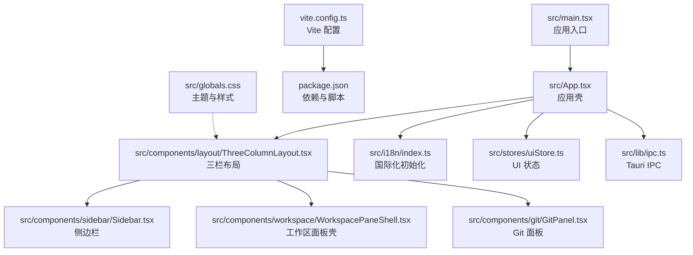
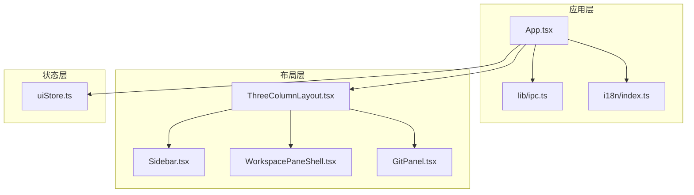
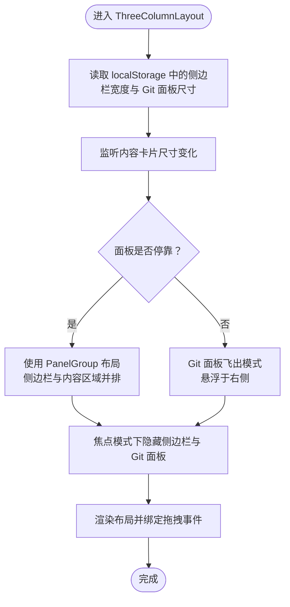
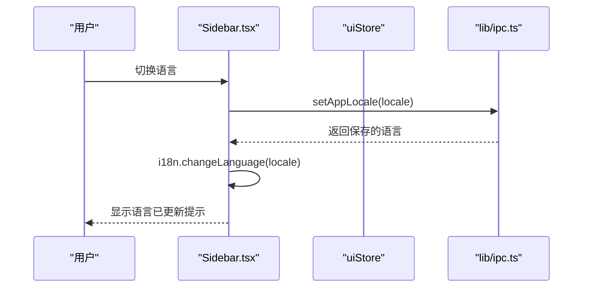
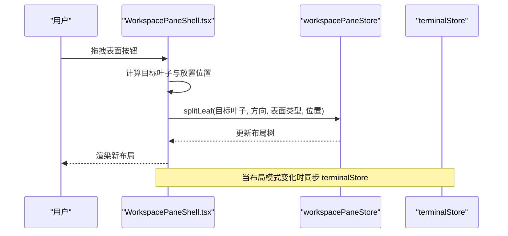
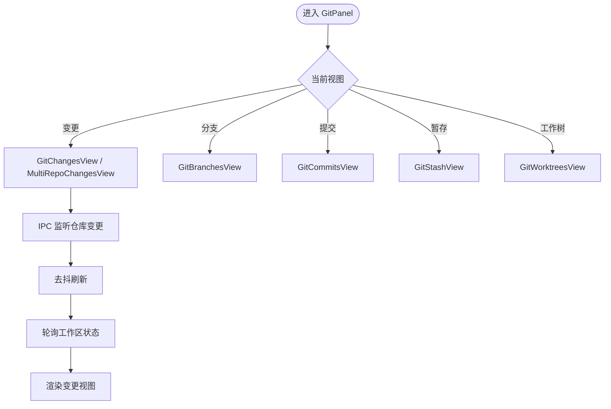
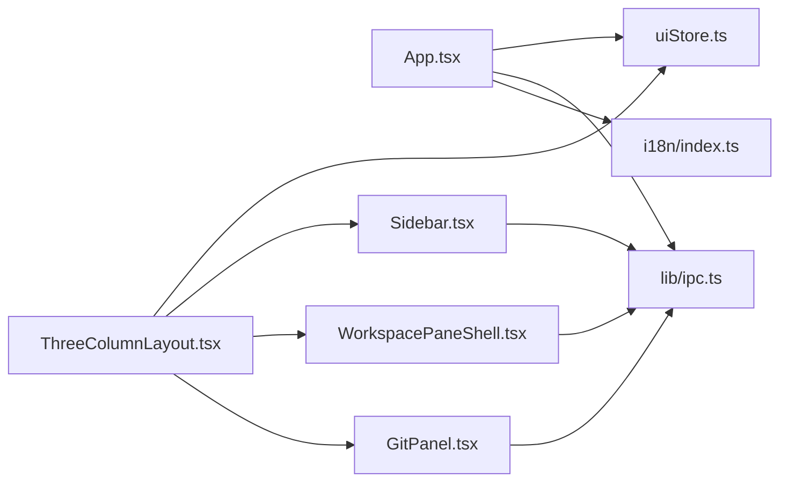

# 前端架构

<cite>
**本文档引用的文件**
- [src/main.tsx](file://src/main.tsx)
- [src/App.tsx](file://src/App.tsx)
- [src/components/layout/ThreeColumnLayout.tsx](file://src/components/layout/ThreeColumnLayout.tsx)
- [src/components/sidebar/Sidebar.tsx](file://src/components/sidebar/Sidebar.tsx)
- [src/components/workspace/WorkspacePaneShell.tsx](file://src/components/workspace/WorkspacePaneShell.tsx)
- [src/components/git/GitPanel.tsx](file://src/components/git/GitPanel.tsx)
- [src/i18n/index.ts](file://src/i18n/index.ts)
- [src/stores/uiStore.ts](file://src/stores/uiStore.ts)
- [src/lib/ipc.ts](file://src/lib/ipc.ts)
- [src/types.ts](file://src/types.ts)
- [vite.config.ts](file://vite.config.ts)
- [package.json](file://package.json)
- [src/globals.css](file://src/globals.css)
</cite>

## 目录
1. [简介](#简介)
2. [项目结构](#项目结构)
3. [核心组件](#核心组件)
4. [架构总览](#架构总览)
5. [详细组件分析](#详细组件分析)
6. [依赖关系分析](#依赖关系分析)
7. [性能考虑](#性能考虑)
8. [故障排除指南](#故障排除指南)
9. [结论](#结论)

## 简介
本文件面向 Panes 前端架构，围绕基于 React 19 + TypeScript 的现代前端体系，系统阐述组件化架构、状态管理模式（Zustand）、路由与导航系统、响应式布局与三栏布局（ThreeColumnLayout）等核心设计。同时覆盖国际化支持、主题系统、构建配置与性能优化策略，并通过多种架构图与序列图展示组件交互与数据流。

## 项目结构
前端采用按功能域分层的目录组织方式：
- 根入口与应用壳：src/main.tsx、src/App.tsx
- 组件层：src/components 下按功能域划分（layout、sidebar、workspace、git、chat、editor、terminal、shared）
- 状态层：src/stores 使用 Zustand 进行状态管理
- 国际化：src/i18n 提供多语言资源与初始化
- 类型定义：src/types.ts 定义全局类型
- 构建与工具：vite.config.ts、package.json
- 主题与样式：src/globals.css

图表来源
- [src/main.tsx:1-32](file://src/main.tsx#L1-L32)
- [src/App.tsx:1-577](file://src/App.tsx#L1-L577)
- [src/components/layout/ThreeColumnLayout.tsx:1-381](file://src/components/layout/ThreeColumnLayout.tsx#L1-L381)
- [src/components/sidebar/Sidebar.tsx:1-800](file://src/components/sidebar/Sidebar.tsx#L1-L800)
- [src/components/workspace/WorkspacePaneShell.tsx:1-800](file://src/components/workspace/WorkspacePaneShell.tsx#L1-L800)
- [src/components/git/GitPanel.tsx:1-800](file://src/components/git/GitPanel.tsx#L1-L800)
- [src/i18n/index.ts:1-86](file://src/i18n/index.ts#L1-L86)
- [src/stores/uiStore.ts:1-231](file://src/stores/uiStore.ts#L1-L231)
- [src/lib/ipc.ts:1-792](file://src/lib/ipc.ts#L1-L792)
- [vite.config.ts:1-24](file://vite.config.ts#L1-L24)
- [package.json:1-89](file://package.json#L1-L89)
- [src/globals.css:1-800](file://src/globals.css#L1-L800)

章节来源
- [src/main.tsx:1-32](file://src/main.tsx#L1-L32)
- [src/App.tsx:1-577](file://src/App.tsx#L1-L577)
- [vite.config.ts:1-24](file://vite.config.ts#L1-L24)
- [package.json:1-89](file://package.json#L1-L89)

## 核心组件
- 应用入口与启动流程：在入口中初始化国际化、错误边界包裹根组件并渲染应用壳。
- 应用壳（App）：集中处理 IPC 事件监听、快捷键处理、全局状态加载与刷新、通知与提示等。
- 三栏布局（ThreeColumnLayout）：实现可停靠/浮动的侧边栏、Git 面板与主内容区域的组合布局，支持拖拽调整大小与焦点模式。
- 侧边栏（Sidebar）：项目与线程列表、归档管理、设置菜单、国际化切换、终端加速渲染开关等。
- 工作区面板壳（WorkspacePaneShell）：工作区内聊天/编辑器/终端的可拖拽拆分与标签页管理。
- Git 面板（GitPanel）：变更、分支、提交、暂存、工作树等视图与操作。
- 国际化（i18n）：多语言资源加载与动态切换。
- UI 状态（uiStore）：侧边栏/Git 面板可见性、焦点模式、命令面板等 UI 状态。
- IPC（lib/ipc）：与后端通信的统一接口与事件监听。
- 全局样式（globals.css）：主题变量、动画与通用样式。

章节来源
- [src/main.tsx:1-32](file://src/main.tsx#L1-L32)
- [src/App.tsx:1-577](file://src/App.tsx#L1-L577)
- [src/components/layout/ThreeColumnLayout.tsx:1-381](file://src/components/layout/ThreeColumnLayout.tsx#L1-L381)
- [src/components/sidebar/Sidebar.tsx:1-800](file://src/components/sidebar/Sidebar.tsx#L1-L800)
- [src/components/workspace/WorkspacePaneShell.tsx:1-800](file://src/components/workspace/WorkspacePaneShell.tsx#L1-L800)
- [src/components/git/GitPanel.tsx:1-800](file://src/components/git/GitPanel.tsx#L1-L800)
- [src/i18n/index.ts:1-86](file://src/i18n/index.ts#L1-L86)
- [src/stores/uiStore.ts:1-231](file://src/stores/uiStore.ts#L1-L231)
- [src/lib/ipc.ts:1-792](file://src/lib/ipc.ts#L1-L792)
- [src/globals.css:1-800](file://src/globals.css#L1-L800)

## 架构总览
整体采用“应用壳 + 多功能面板 + 状态中心”的架构模式：
- 应用壳负责生命周期、IPC 事件、快捷键与全局状态同步。
- 三栏布局作为容器，协调侧边栏、Git 面板与主内容区域。
- 各功能面板（Sidebar、WorkspacePaneShell、GitPanel）通过 Zustand 状态与 IPC 接口进行数据与行为交互。
- 国际化与主题系统贯穿全链路，保证一致的用户体验。

图表来源
- [src/App.tsx:1-577](file://src/App.tsx#L1-L577)
- [src/components/layout/ThreeColumnLayout.tsx:1-381](file://src/components/layout/ThreeColumnLayout.tsx#L1-L381)
- [src/components/sidebar/Sidebar.tsx:1-800](file://src/components/sidebar/Sidebar.tsx#L1-L800)
- [src/components/workspace/WorkspacePaneShell.tsx:1-800](file://src/components/workspace/WorkspacePaneShell.tsx#L1-L800)
- [src/components/git/GitPanel.tsx:1-800](file://src/components/git/GitPanel.tsx#L1-L800)
- [src/stores/uiStore.ts:1-231](file://src/stores/uiStore.ts#L1-L231)
- [src/lib/ipc.ts:1-792](file://src/lib/ipc.ts#L1-L792)
- [src/i18n/index.ts:1-86](file://src/i18n/index.ts#L1-L86)

## 详细组件分析

### 三栏布局（ThreeColumnLayout）
- 功能特性
  - 可停靠/浮动侧边栏与 Git 面板，支持拖拽调整宽度与面板尺寸。
  - 焦点模式下隐藏侧边栏与 Git 面板，提供拖动条以恢复显示。
  - 响应式内容卡片，根据窗口尺寸与停靠状态自适应。
  - Git 面板飞出（flyout）交互，支持悬停/聚焦触发与内部指针事件处理。
- 关键状态
  - 侧边栏宽度、Git 面板尺寸持久化到 localStorage。
  - 侧边栏/面板停靠状态、焦点模式、活动视图等由 uiStore 管理。
- 数据流
  - 从 uiStore 读取显示/停靠状态，结合本地存储与 ResizeObserver 计算布局。
  - 通过 PanelGroup 与 PanelResizeHandle 实现面板间尺寸联动。

图表来源
- [src/components/layout/ThreeColumnLayout.tsx:1-381](file://src/components/layout/ThreeColumnLayout.tsx#L1-L381)
- [src/stores/uiStore.ts:1-231](file://src/stores/uiStore.ts#L1-L231)

章节来源
- [src/components/layout/ThreeColumnLayout.tsx:1-381](file://src/components/layout/ThreeColumnLayout.tsx#L1-L381)
- [src/stores/uiStore.ts:1-231](file://src/stores/uiStore.ts#L1-L231)

### 侧边栏（Sidebar）
- 功能特性
  - 项目与线程列表、折叠/展开、归档管理。
  - 设置菜单：国际化切换、终端加速渲染开关、电源与通知设置入口。
  - 快捷操作：打开文件夹、新建线程、命令面板、搜索等。
- 状态与交互
  - 通过 uiStore 控制侧边栏停靠与可见性。
  - 与 workspaceStore、threadStore、updateStore、keepAwakeStore、terminalNotificationSettingsStore 协同。
- 国际化
  - 支持多语言切换并通过 IPC 更新后端语言设置。

图表来源
- [src/components/sidebar/Sidebar.tsx:1-800](file://src/components/sidebar/Sidebar.tsx#L1-L800)
- [src/lib/ipc.ts:1-792](file://src/lib/ipc.ts#L1-L792)
- [src/i18n/index.ts:1-86](file://src/i18n/index.ts#L1-L86)

章节来源
- [src/components/sidebar/Sidebar.tsx:1-800](file://src/components/sidebar/Sidebar.tsx#L1-L800)
- [src/lib/ipc.ts:1-792](file://src/lib/ipc.ts#L1-L792)
- [src/i18n/index.ts:1-86](file://src/i18n/index.ts#L1-L86)

### 工作区面板壳（WorkspacePaneShell）
- 功能特性
  - 聊天/编辑器/终端三种表面（surface）的可拖拽拆分与标签页管理。
  - 表面拖拽：支持从表面按钮拖拽到目标叶子节点进行拆分或替换。
  - 标题栏：工作区名称、当前线程标题、变更文件计数、重命名线程。
- 关键流程
  - 指针事件处理：捕获指针、计算拖拽阈值、发布拖拽状态、提交拆分。
  - 键盘快捷：Shift+方向键快速拆分当前叶子。
  - 布局树：通过 PaneNodeView/PaneSplitView/PaneLeafView 渲染嵌套布局。

图表来源
- [src/components/workspace/WorkspacePaneShell.tsx:1-800](file://src/components/workspace/WorkspacePaneShell.tsx#L1-L800)
- [src/stores/terminalStore.ts](file://src/stores/terminalStore.ts)

章节来源
- [src/components/workspace/WorkspacePaneShell.tsx:1-800](file://src/components/workspace/WorkspacePaneShell.tsx#L1-L800)

### Git 面板（GitPanel）
- 功能特性
  - 多视图：变更、分支、提交、暂存、工作树。
  - 多仓库支持：在变更视图下支持批量拉取/推送/刷新。
  - 自动监控：基于 IPC 的仓库变更监听与轮询刷新。
  - 更多菜单：包含远程同步、软回退等高级操作。
- 关键机制
  - 仓库路径切换：支持主仓库与工作树路径切换。
  - 同步状态：fetch/pull/push 的并发与防抖控制。
  - 错误处理：本地错误与全局错误合并展示。

图表来源
- [src/components/git/GitPanel.tsx:1-800](file://src/components/git/GitPanel.tsx#L1-L800)
- [src/lib/ipc.ts:1-792](file://src/lib/ipc.ts#L1-L792)

章节来源
- [src/components/git/GitPanel.tsx:1-800](file://src/components/git/GitPanel.tsx#L1-L800)
- [src/lib/ipc.ts:1-792](file://src/lib/ipc.ts#L1-L792)

### 国际化与主题系统
- 国际化
  - 初始化：根据浏览器语言与后端设置选择语言，加载多命名空间资源。
  - 切换：通过 IPC 更新后端语言设置并动态切换前端语言。
- 主题系统
  - 设计令牌：通过 CSS 变量定义背景、文本、强调色、圆角、动画等。
  - 样式覆盖：Tailwind 导入与自定义动画、代码高亮、Markdown 规范等。
  - 平台适配：Linux 窗口控制、自定义窗口框架等平台差异样式。

章节来源
- [src/i18n/index.ts:1-86](file://src/i18n/index.ts#L1-L86)
- [src/globals.css:1-800](file://src/globals.css#L1-L800)

### 状态管理（Zustand）
- uiStore：管理侧边栏/Git 面板可见性、停靠状态、焦点模式、活动视图、命令面板等。
- 与其他 store 的协作：workspaceStore、threadStore、gitStore、terminalStore、toastStore 等。
- 与 IPC 的集成：通过 effects 加载初始数据、监听事件并更新状态。

章节来源
- [src/stores/uiStore.ts:1-231](file://src/stores/uiStore.ts#L1-L231)
- [src/lib/ipc.ts:1-792](file://src/lib/ipc.ts#L1-L792)

### 构建与性能优化
- Vite 配置
  - React 插件、开发服务器、HMR 端口、环境变量注入。
  - 生产构建禁用压缩（minify=false），便于调试与分析。
- 依赖与脚本
  - React 19、Zustand、react-resizable-panels、i18next、@tauri-apps/api 等。
  - 开发、构建、预览、测试、桌面打包等脚本。
- 性能建议
  - 代码分割：WorkspacePaneShell 对聊天、终端、编辑器采用懒加载。
  - 事件去抖：Git 面板对仓库变更监听与轮询进行去抖与防并发。
  - 焦点模式与停靠：减少不必要的渲染与布局计算。

章节来源
- [vite.config.ts:1-24](file://vite.config.ts#L1-L24)
- [package.json:1-89](file://package.json#L1-L89)
- [src/components/workspace/WorkspacePaneShell.tsx:1-800](file://src/components/workspace/WorkspacePaneShell.tsx#L1-L800)

## 依赖关系分析
- 组件耦合
  - App 作为中枢，依赖多个 store 与 IPC；ThreeColumnLayout 依赖 uiStore 与本地存储；各面板通过 store 与 IPC 解耦。
- 外部依赖
  - react-resizable-panels：用于面板尺寸与拆分。
  - i18next/react-i18next：国际化。
  - @tauri-apps/api：跨平台 IPC。
- 循环依赖规避
  - uiStore 在 setActiveView 中对 harnessStore 进行懒加载导入，避免循环依赖。

图表来源
- [src/App.tsx:1-577](file://src/App.tsx#L1-L577)
- [src/components/layout/ThreeColumnLayout.tsx:1-381](file://src/components/layout/ThreeColumnLayout.tsx#L1-L381)
- [src/components/sidebar/Sidebar.tsx:1-800](file://src/components/sidebar/Sidebar.tsx#L1-L800)
- [src/components/workspace/WorkspacePaneShell.tsx:1-800](file://src/components/workspace/WorkspacePaneShell.tsx#L1-L800)
- [src/components/git/GitPanel.tsx:1-800](file://src/components/git/GitPanel.tsx#L1-L800)
- [src/stores/uiStore.ts:1-231](file://src/stores/uiStore.ts#L1-L231)
- [src/lib/ipc.ts:1-792](file://src/lib/ipc.ts#L1-L792)
- [src/i18n/index.ts:1-86](file://src/i18n/index.ts#L1-L86)

章节来源
- [src/App.tsx:1-577](file://src/App.tsx#L1-L577)
- [src/components/layout/ThreeColumnLayout.tsx:1-381](file://src/components/layout/ThreeColumnLayout.tsx#L1-L381)
- [src/stores/uiStore.ts:1-231](file://src/stores/uiStore.ts#L1-L231)
- [src/lib/ipc.ts:1-792](file://src/lib/ipc.ts#L1-L792)

## 性能考虑
- 渲染优化
  - 侧边栏与 Git 面板的可见性与停靠状态通过本地存储与 uiStore 管理，减少重复计算。
  - WorkspacePaneShell 对面板内容采用懒加载，降低首屏负载。
- 事件与网络
  - Git 面板对仓库变更监听与轮询进行去抖与并发控制，避免频繁刷新。
  - IPC 事件监听在组件卸载时清理，防止内存泄漏。
- 样式与动画
  - 使用 CSS 变量与 Tailwind，减少重复样式定义；动画在偏好设置下可降级。
- 构建与打包
  - Vite 开发体验与热更新；生产构建保持可调试性以便问题定位。

## 故障排除指南
- 国际化不生效
  - 检查 i18n 初始化与语言切换逻辑，确认 IPC 设置语言成功。
- 侧边栏/Git 面板尺寸异常
  - 检查 localStorage 中的尺寸键值，确认范围限制与默认值。
- Git 面板无更新
  - 确认 IPC 监听是否建立，检查仓库路径与视图状态，查看错误栏提示。
- 快捷键冲突
  - App 层对键盘事件与原生菜单动作进行了去抖处理，检查终端输入焦点状态与快捷键组合。

章节来源
- [src/i18n/index.ts:1-86](file://src/i18n/index.ts#L1-L86)
- [src/components/layout/ThreeColumnLayout.tsx:1-381](file://src/components/layout/ThreeColumnLayout.tsx#L1-L381)
- [src/components/git/GitPanel.tsx:1-800](file://src/components/git/GitPanel.tsx#L1-L800)
- [src/App.tsx:1-577](file://src/App.tsx#L1-L577)

## 结论
Panes 前端以 React 19 + TypeScript 为基础，采用模块化的组件架构与 Zustand 状态管理，结合 Tauri IPC 实现前后端协同。ThreeColumnLayout 提供灵活的布局能力，配合 Sidebar、WorkspacePaneShell、GitPanel 等功能面板，形成完整的开发工作流界面。国际化与主题系统确保跨语言与跨平台的一致体验。通过合理的代码分割、事件去抖与样式优化，整体具备良好的性能与可维护性。