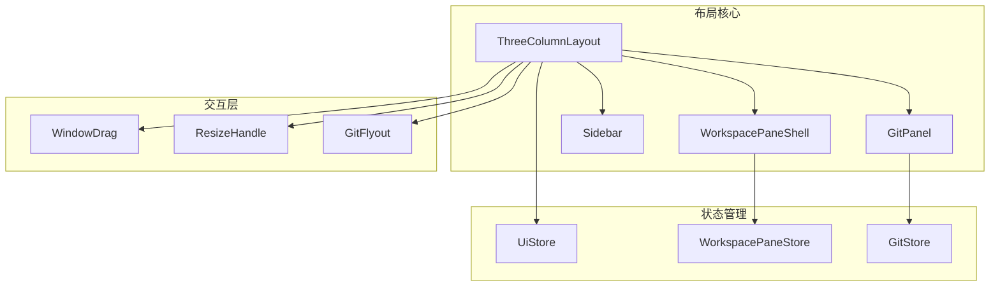
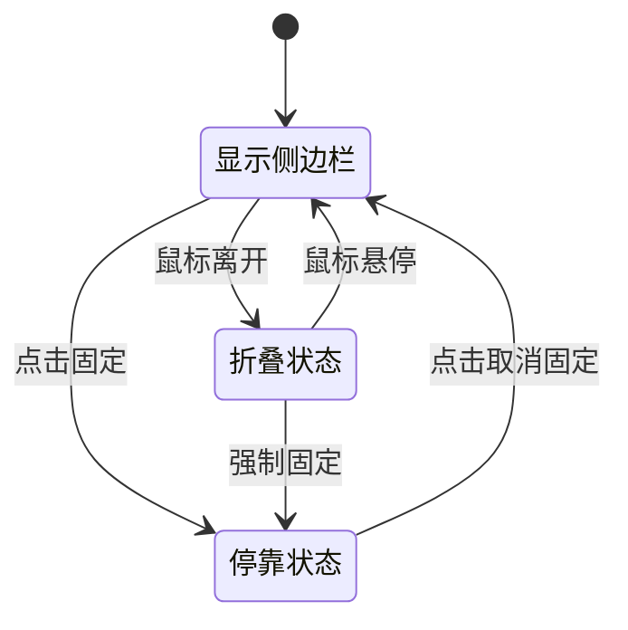
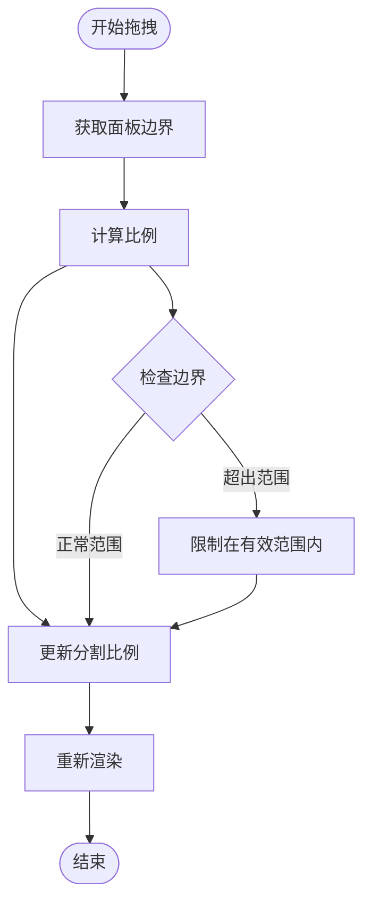
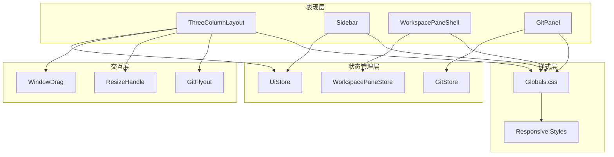
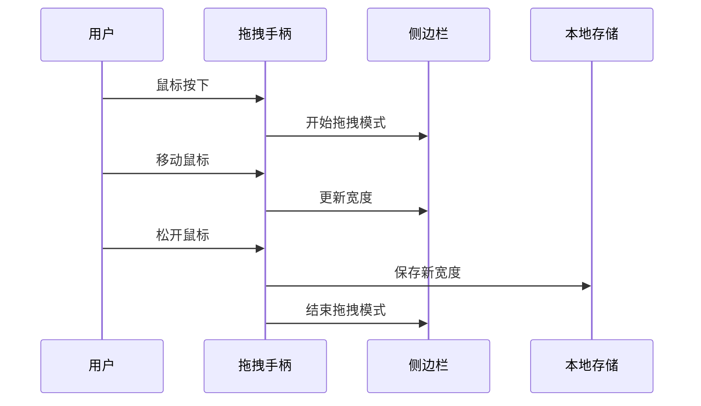
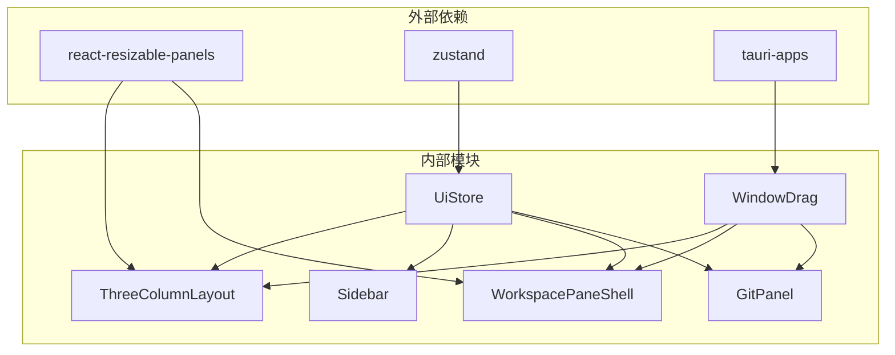

# 布局系统

<cite>
**本文档引用的文件**
- [ThreeColumnLayout.tsx](file://src/components/layout/ThreeColumnLayout.tsx)
- [Sidebar.tsx](file://src/components/sidebar/Sidebar.tsx)
- [sidebarCollapseState.ts](file://src/components/sidebar/sidebarCollapseState.ts)
- [WorkspacePaneShell.tsx](file://src/components/workspace/WorkspacePaneShell.tsx)
- [GitPanel.tsx](file://src/components/git/GitPanel.tsx)
- [uiStore.ts](file://src/stores/uiStore.ts)
- [windowDrag.ts](file://src/lib/windowDrag.ts)
- [globals.css](file://src/globals.css)
</cite>

## 目录
1. [简介](#简介)
2. [项目结构](#项目结构)
3. [核心组件](#核心组件)
4. [架构概览](#架构概览)
5. [详细组件分析](#详细组件分析)
6. [依赖关系分析](#依赖关系分析)
7. [性能考虑](#性能考虑)
8. [故障排除指南](#故障排除指南)
9. [结论](#结论)

## 简介

Panels 布局系统是一个高度响应式的三列布局解决方案，专为开发者工具和 IDE 类应用设计。该系统实现了复杂的侧边栏折叠状态管理、工作区面板布局和自适应屏幕尺寸适配，提供了流畅的用户体验和强大的自定义能力。

系统的核心特色包括：
- 智能的侧边栏折叠与展开机制
- 可停靠的 Git 面板浮动系统
- 响应式网格布局与 Flexbox 结合
- 拖拽调整和用户自定义布局
- 跨浏览器兼容性和性能优化

## 项目结构

布局系统主要由以下核心模块组成：



**图表来源**
- [ThreeColumnLayout.tsx:55-381](file://src/components/layout/ThreeColumnLayout.tsx#L55-L381)
- [WorkspacePaneShell.tsx:143-503](file://src/components/workspace/WorkspacePaneShell.tsx#L143-L503)

**章节来源**
- [ThreeColumnLayout.tsx:1-381](file://src/components/layout/ThreeColumnLayout.tsx#L1-L381)
- [uiStore.ts:79-231](file://src/stores/uiStore.ts#L79-L231)

## 核心组件

### 三列布局容器

ThreeColumnLayout 是整个布局系统的核心组件，负责协调三个主要区域的显示和交互。

**主要功能特性：**
- 动态侧边栏折叠状态管理
- Git 面板的停靠与浮动模式切换
- 内容区域的全屏模式支持
- 窗口拖拽和焦点模式集成

**布局状态管理：**
- `sidebarDocked`: 侧边栏是否停靠（固定宽度）
- `gitPanelDocked`: Git 面板是否停靠（固定宽度）
- `fullBleedContent`: 内容区域是否全屏显示
- `showFocusDragStrip`: 焦点模式下的拖拽条显示

**章节来源**
- [ThreeColumnLayout.tsx:55-106](file://src/components/layout/ThreeColumnLayout.tsx#L55-L106)
- [ThreeColumnLayout.tsx:243-379](file://src/components/layout/ThreeColumnLayout.tsx#L243-L379)

### 侧边栏系统

侧边栏实现了智能的折叠展开机制，支持多种交互模式。

**核心特性：**
- 自动折叠与悬停展开
- 用户可配置的停靠状态
- 工作空间和线程的树形结构展示
- 归档项目的分离管理

**折叠状态逻辑：**


**图表来源**
- [Sidebar.tsx:79-742](file://src/components/sidebar/Sidebar.tsx#L79-L742)
- [sidebarCollapseState.ts:1-30](file://src/components/sidebar/sidebarCollapseState.ts#L1-L30)

**章节来源**
- [Sidebar.tsx:79-742](file://src/components/sidebar/Sidebar.tsx#L79-L742)
- [sidebarCollapseState.ts:1-30](file://src/components/sidebar/sidebarCollapseState.ts#L1-L30)

### 工作区面板壳

WorkspacePaneShell 提供了复杂的工作区面板管理功能，支持多面板分割和拖拽操作。

**主要功能：**
- 多面板分割布局（水平/垂直）
- 面板拖拽和重新排列
- 表面类型切换（聊天、终端、编辑器）
- 拖拽预览和放置指示

**面板分割算法：**


**图表来源**
- [WorkspacePaneShell.tsx:692-771](file://src/components/workspace/WorkspacePaneShell.tsx#L692-L771)

**章节来源**
- [WorkspacePaneShell.tsx:143-503](file://src/components/workspace/WorkspacePaneShell.tsx#L143-L503)

### Git 面板系统

GitPanel 实现了完整的版本控制界面，支持多种视图模式和交互操作。

**支持的视图模式：**
- 更改视图（Changes View）
- 分支视图（Branches View）  
- 提交历史（Commits View）
- 暂存视图（Stash View）
- 工作树视图（Worktrees View）

**章节来源**
- [GitPanel.tsx:48-514](file://src/components/git/GitPanel.tsx#L48-L514)

## 架构概览

布局系统采用分层架构设计，确保各组件间的松耦合和高内聚。



**图表来源**
- [ThreeColumnLayout.tsx:55-381](file://src/components/layout/ThreeColumnLayout.tsx#L55-L381)
- [uiStore.ts:79-231](file://src/stores/uiStore.ts#L79-L231)

## 详细组件分析

### 响应式设计实现

系统实现了多层次的响应式设计策略：

**CSS Grid 和 Flexbox 的使用：**
- 主布局使用 Flexbox 实现主轴和交叉轴的灵活布局
- 面板内部使用 CSS Grid 实现复杂的网格布局需求
- 响应式断点通过媒体查询实现自适应

**媒体查询策略：**
```css
@media (max-width: 1200px) {
  .sidebar { width: 180px; }
  .git-panel { width: 200px; }
}

@media (max-width: 1024px) {
  .sidebar { width: 160px; }
  .git-panel { display: none; }
}

@media (max-width: 768px) {
  .container { padding: 0 20px; }
  .sidebar { width: 140px; }
}
```

**移动端优化：**
- 触摸友好的按钮尺寸和间距
- 简化的导航结构
- 响应式字体大小
- 移动端专用的交互模式

**章节来源**
- [globals.css:4974-4993](file://src/globals.css#L4974-L4993)
- [globals.css:7981-7986](file://src/globals.css#L7981-L7986)

### 布局动画效果

系统实现了丰富的动画效果来增强用户体验：

**关键帧动画：**
- `fade-in`: 渐入效果
- `slide-up`: 上滑进入
- `slide-in-left`: 左滑进入
- `pulse-soft`: 脉冲效果
- `glow-pulse`: 发光脉冲

**动画触发条件：**
- 组件挂载时的入场动画
- 状态变化时的过渡动画
- 用户交互时的反馈动画

**章节来源**
- [globals.css:574-604](file://src/globals.css#L574-L604)
- [globals.css:654-674](file://src/globals.css#L654-L674)

### 拖拽调整功能

系统提供了强大的拖拽调整功能：

**侧边栏拖拽：**


**面板分割拖拽：**
- 支持水平和垂直方向的分割调整
- 实时预览分割比例
- 平滑的动画过渡效果

**章节来源**
- [ThreeColumnLayout.tsx:154-181](file://src/components/layout/ThreeColumnLayout.tsx#L154-L181)
- [WorkspacePaneShell.tsx:702-731](file://src/components/workspace/WorkspacePaneShell.tsx#L702-L731)

### 用户自定义布局选项

系统提供了丰富的用户自定义选项：

**侧边栏设置：**
- 固定/取消固定的切换
- 宽度的自定义调整
- 折叠状态的记忆

**Git 面板设置：**
- 停靠/浮动模式切换
- 面板大小的动态调整
- 视图模式的快速切换

**全局设置：**
- 焦点模式的启用/禁用
- 命令调色板的配置
- 主题和外观的个性化

**章节来源**
- [uiStore.ts:79-231](file://src/stores/uiStore.ts#L79-L231)
- [ThreeColumnLayout.tsx:29-53](file://src/components/layout/ThreeColumnLayout.tsx#L29-L53)

## 依赖关系分析



**图表来源**
- [ThreeColumnLayout.tsx:1-12](file://src/components/layout/ThreeColumnLayout.tsx#L1-L12)
- [uiStore.ts:1-6](file://src/stores/uiStore.ts#L1-L6)

**章节来源**
- [ThreeColumnLayout.tsx:1-12](file://src/components/layout/ThreeColumnLayout.tsx#L1-L12)
- [WorkspacePaneShell.tsx:1-41](file://src/components/workspace/WorkspacePaneShell.tsx#L1-L41)

## 性能考虑

### 优化策略

**渲染性能优化：**
- 使用 React.memo 和 useMemo 减少不必要的重渲染
- 懒加载大型组件（如聊天面板、终端面板）
- 使用 ResizeObserver 替代频繁的布局计算

**内存管理：**
- 合理的事件监听器清理
- 及时清理定时器和异步操作
- 避免内存泄漏的资源管理

**网络性能：**
- Git 状态的防抖刷新机制
- 文件系统监听的节流处理
- 缓存策略的合理使用

**章节来源**
- [ThreeColumnLayout.tsx:84-106](file://src/components/layout/ThreeColumnLayout.tsx#L84-L106)
- [GitPanel.tsx:333-418](file://src/components/git/GitPanel.tsx#L333-L418)

### 跨浏览器兼容性

**CSS 兼容性：**
- 使用现代 CSS 特性的渐进增强
- 为旧版浏览器提供回退方案
- 响应式设计的跨设备测试

**JavaScript 兼容性：**
- Polyfill 的按需加载
- 浏览器 API 的特性检测
- 错误处理和降级策略

**章节来源**
- [globals.css:132-148](file://src/globals.css#L132-L148)
- [windowDrag.ts:17-32](file://src/lib/windowDrag.ts#L17-L32)

## 故障排除指南

### 常见问题及解决方案

**布局异常问题：**
- 检查 CSS 变量的正确设置
- 验证媒体查询的优先级
- 确认 Flexbox 属性的兼容性

**交互功能问题：**
- 验证事件监听器的绑定和解绑
- 检查拖拽状态的同步
- 确认本地存储的可用性

**性能问题：**
- 监控组件的重渲染频率
- 检查内存使用情况
- 优化大列表的渲染

**章节来源**
- [ThreeColumnLayout.tsx:108-152](file://src/components/layout/ThreeColumnLayout.tsx#L108-L152)
- [WorkspacePaneShell.tsx:197-204](file://src/components/workspace/WorkspacePaneShell.tsx#L197-L204)

## 结论

Panels 布局系统展现了现代前端开发的最佳实践，通过精心设计的架构和实现，提供了强大而灵活的布局解决方案。系统的主要优势包括：

**技术优势：**
- 清晰的分层架构和职责分离
- 高效的状态管理和响应式设计
- 优秀的性能优化和用户体验

**设计优势：**
- 灵活的布局系统支持多种使用场景
- 直观的用户界面和交互设计
- 完善的可访问性和跨平台支持

**扩展性：**
- 模块化的组件设计便于维护和扩展
- 灵活的配置选项满足不同需求
- 良好的代码组织便于团队协作

该布局系统为开发者提供了一个坚实的基础，可以在此基础上构建更复杂的应用功能，同时保持良好的性能和用户体验。