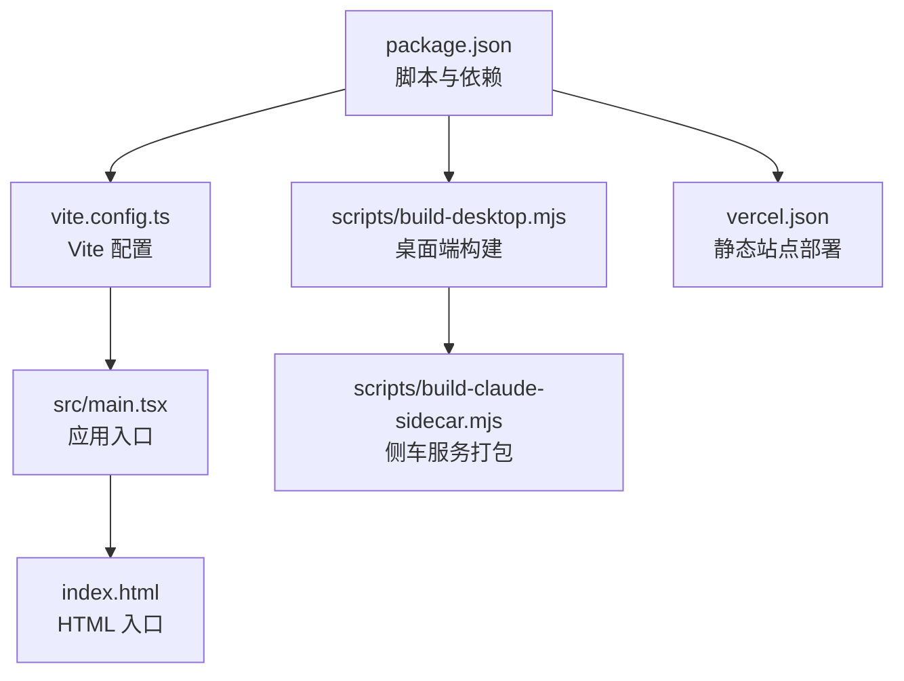
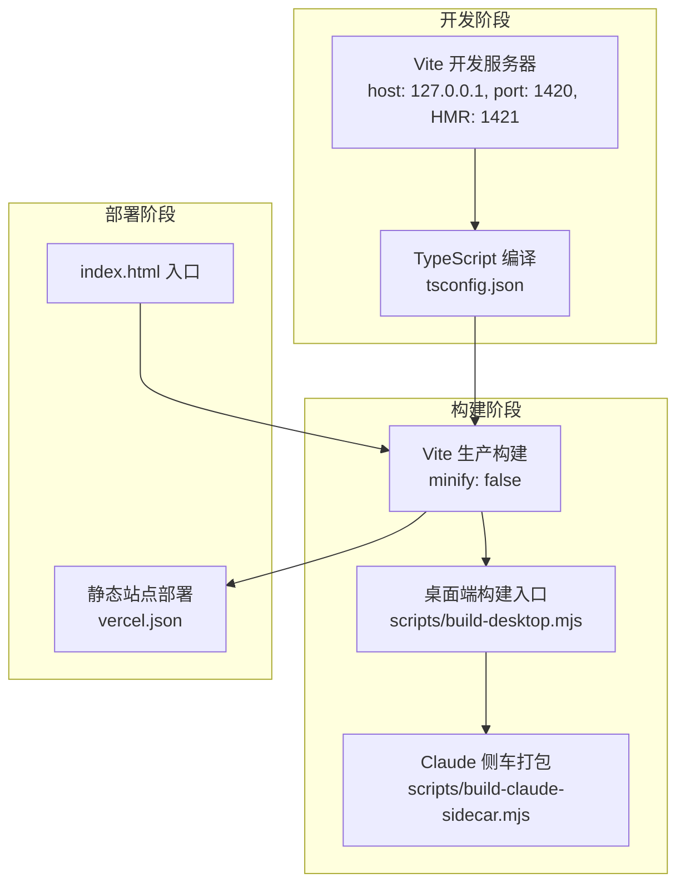
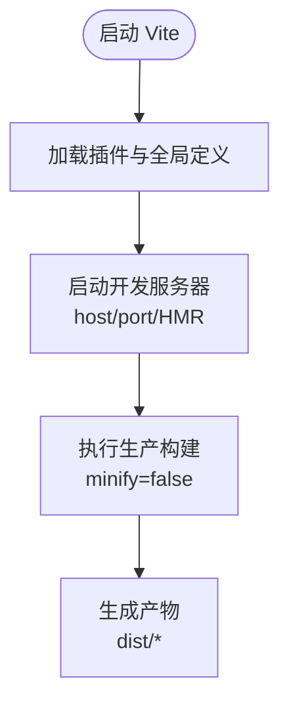
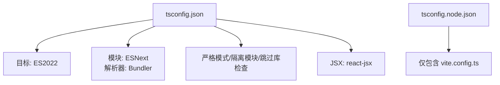
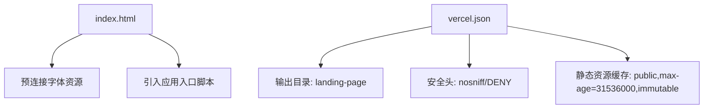
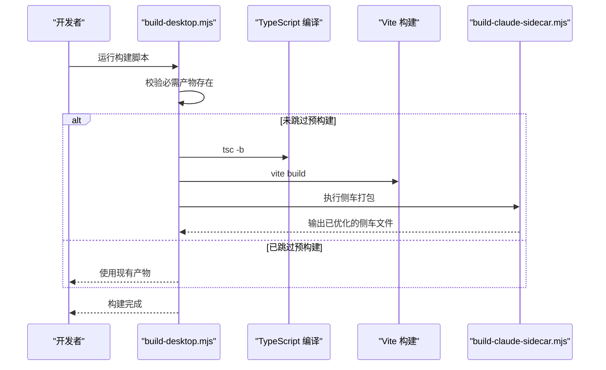
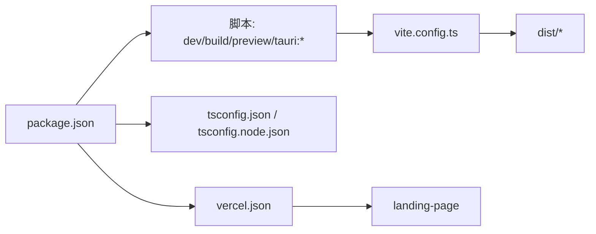

# 构建配置

<cite>
**本文引用的文件**
- [vite.config.ts](file://vite.config.ts)
- [package.json](file://package.json)
- [tsconfig.json](file://tsconfig.json)
- [tsconfig.node.json](file://tsconfig.node.json)
- [vercel.json](file://vercel.json)
- [index.html](file://index.html)
- [src/main.tsx](file://src/main.tsx)
- [src/App.tsx](file://src/App.tsx)
- [scripts/build-claude-sidecar.mjs](file://scripts/build-claude-sidecar.mjs)
- [scripts/build-desktop.mjs](file://scripts/build-desktop.mjs)
</cite>

## 目录
1. [简介](#简介)
2. [项目结构](#项目结构)
3. [核心组件](#核心组件)
4. [架构总览](#架构总览)
5. [详细组件分析](#详细组件分析)
6. [依赖关系分析](#依赖关系分析)
7. [性能考量](#性能考量)
8. [故障排查指南](#故障排查指南)
9. [结论](#结论)
10. [附录](#附录)

## 简介
本文件系统性梳理 Panes 前端的构建配置与流程，覆盖 Vite 开发服务器与生产构建策略、TypeScript 编译配置、资源处理与缓存策略、以及与 Tauri 桌面端集成的构建脚本。文档同时提供构建流程图、关键配置参数说明与最佳实践建议，帮助开发者在不同环境下高效地进行本地开发、打包与部署。

## 项目结构
前端构建相关的关键文件分布如下：
- 构建工具与脚本：vite.config.ts、package.json、scripts/*.mjs
- 类型系统：tsconfig.json、tsconfig.node.json
- 资源与部署：index.html、vercel.json
- 应用入口与运行时：src/main.tsx、src/App.tsx

图表来源
- [package.json:1-89](file://package.json#L1-L89)
- [vite.config.ts:1-24](file://vite.config.ts#L1-L24)
- [src/main.tsx:1-32](file://src/main.tsx#L1-L32)
- [index.html:1-19](file://index.html#L1-L19)
- [scripts/build-desktop.mjs:1-71](file://scripts/build-desktop.mjs#L1-L71)
- [scripts/build-claude-sidecar.mjs:1-141](file://scripts/build-claude-sidecar.mjs#L1-L141)
- [vercel.json:1-33](file://vercel.json#L1-L33)

章节来源
- [package.json:1-89](file://package.json#L1-L89)
- [vite.config.ts:1-24](file://vite.config.ts#L1-L24)
- [tsconfig.json:1-19](file://tsconfig.json#L1-L19)
- [tsconfig.node.json:1-10](file://tsconfig.node.json#L1-L10)
- [vercel.json:1-33](file://vercel.json#L1-L33)
- [index.html:1-19](file://index.html#L1-L19)
- [src/main.tsx:1-32](file://src/main.tsx#L1-L32)
- [scripts/build-desktop.mjs:1-71](file://scripts/build-desktop.mjs#L1-L71)
- [scripts/build-claude-sidecar.mjs:1-141](file://scripts/build-claude-sidecar.mjs#L1-L141)

## 核心组件
- Vite 构建系统
  - 插件：React 插件用于 JSX 转换与 HMR
  - 定义全局常量：通过 define 注入环境变量到客户端代码
  - 开发服务器：host、port、strictPort、HMR 端口
  - 生产构建：minify 关闭（便于调试）
  - 控制台清理：关闭默认清屏行为
- TypeScript 配置
  - 浏览器目标：ES2022
  - 模块解析：Bundler
  - JSX：react-jsx
  - 严格模式与隔离模块：提升类型安全
- 资源与部署
  - HTML 入口：预连接字体资源
  - 静态站点：Vercel 配置，含安全头与静态资源缓存策略

章节来源
- [vite.config.ts:1-24](file://vite.config.ts#L1-L24)
- [tsconfig.json:1-19](file://tsconfig.json#L1-L19)
- [tsconfig.node.json:1-10](file://tsconfig.node.json#L1-L10)
- [index.html:1-19](file://index.html#L1-L19)
- [vercel.json:1-33](file://vercel.json#L1-L33)

## 架构总览
下图展示从开发到生产的整体流程，包括 Vite 构建、TypeScript 编译、静态资源与缓存策略，以及与 Tauri 桌面端的集成。

图表来源
- [vite.config.ts:14-21](file://vite.config.ts#L14-L21)
- [tsconfig.json:1-19](file://tsconfig.json#L1-L19)
- [scripts/build-desktop.mjs:63-71](file://scripts/build-desktop.mjs#L63-L71)
- [scripts/build-claude-sidecar.mjs:119-141](file://scripts/build-claude-sidecar.mjs#L119-L141)
- [vercel.json:1-33](file://vercel.json#L1-L33)
- [index.html:1-19](file://index.html#L1-L19)

## 详细组件分析

### Vite 配置分析
- 插件与全局定义
  - 使用 React 插件以支持 JSX 与 HMR
  - 通过 define 注入布尔型全局常量，控制非原生 harness 的启用状态
- 开发服务器
  - 固定主机与端口，确保 HMR 端口连续
  - 关闭清屏，避免频繁刷新影响开发体验
- 生产构建
  - 当前未启用压缩，便于调试；如需生产优化可开启压缩并配合代码分割

图表来源
- [vite.config.ts:4-23](file://vite.config.ts#L4-L23)

章节来源
- [vite.config.ts:1-24](file://vite.config.ts#L1-L24)

### TypeScript 配置分析
- 目标与库
  - 目标 ES2022，库包含 DOM 与 DOM.Iterable
- 模块与解析
  - 模块格式 ESNext，使用 Bundler 解析器
- 严格性与类型
  - 启用严格模式、跳过库检查、隔离模块、禁止 emit
  - JSX 使用 react-jsx，类型包含 vite/client
- Node 配置
  - 仅包含 Vite 配置文件，便于类型检查

图表来源
- [tsconfig.json:1-19](file://tsconfig.json#L1-L19)
- [tsconfig.node.json:1-10](file://tsconfig.node.json#L1-L10)

章节来源
- [tsconfig.json:1-19](file://tsconfig.json#L1-L19)
- [tsconfig.node.json:1-10](file://tsconfig.node.json#L1-L10)

### 资源与缓存策略
- HTML 入口
  - 预连接 Google Fonts，减少首屏渲染阻塞
  - 引入应用入口脚本
- 静态站点部署
  - 输出目录指向 landing-page
  - 设置安全头：X-Content-Type-Options、X-Frame-Options
  - 对静态资源（样式表、国际化脚本、Logo）设置长缓存与不可变标志

图表来源
- [index.html:1-19](file://index.html#L1-L19)
- [vercel.json:1-33](file://vercel.json#L1-L33)

章节来源
- [index.html:1-19](file://index.html#L1-L19)
- [vercel.json:1-33](file://vercel.json#L1-L33)

### 桌面端与侧车构建
- 桌面端构建脚本
  - 校验必要产物是否存在（前端 dist 与侧车打包产物）
  - 若未跳过预构建，则依次执行：TypeScript 编译与 Vite 构建、侧车打包
- 侧车服务打包
  - 复制入口脚本至输出目录
  - 复制 SDK 包及其 node_modules 至输出目录
  - 清理不匹配平台的 ripgrep 资源
  - Linux 平台归档 node_modules 并移除目录，减小体积
  - 校验输出内容仍包含对 SDK 的导入语句

图表来源
- [scripts/build-desktop.mjs:22-71](file://scripts/build-desktop.mjs#L22-L71)
- [scripts/build-claude-sidecar.mjs:119-141](file://scripts/build-claude-sidecar.mjs#L119-L141)

章节来源
- [scripts/build-desktop.mjs:1-71](file://scripts/build-desktop.mjs#L1-L71)
- [scripts/build-claude-sidecar.mjs:1-141](file://scripts/build-claude-sidecar.mjs#L1-L141)

### 应用入口与运行时
- 入口脚本
  - 初始化国际化、注入样式与错误边界
  - 在浏览器或 Tauri 环境中动态获取语言设置
- 应用组件
  - 统一监听线程更新、引擎运行时变更等事件
  - 处理通知与快捷键逻辑，保证跨平台一致性

章节来源
- [src/main.tsx:1-32](file://src/main.tsx#L1-L32)
- [src/App.tsx:121-592](file://src/App.tsx#L121-L592)

## 依赖关系分析
- 脚本与工具链
  - package.json 中定义了 dev、build、preview、lint、test、tauri:* 等脚本
  - 构建顺序：先 TypeScript 编译，再 Vite 构建
- Vite 与 TypeScript
  - tsconfig.json 作为浏览器端编译配置
  - tsconfig.node.json 限定仅包含 Vite 配置文件，避免污染
- 静态站点与部署
  - vercel.json 指定输出目录与安全头，落地 landing-page

图表来源
- [package.json:6-26](file://package.json#L6-L26)
- [vite.config.ts:1-24](file://vite.config.ts#L1-L24)
- [tsconfig.json:1-19](file://tsconfig.json#L1-L19)
- [tsconfig.node.json:1-10](file://tsconfig.node.json#L1-L10)
- [vercel.json:1-33](file://vercel.json#L1-L33)

章节来源
- [package.json:1-89](file://package.json#L1-L89)
- [vite.config.ts:1-24](file://vite.config.ts#L1-L24)
- [tsconfig.json:1-19](file://tsconfig.json#L1-L19)
- [tsconfig.node.json:1-10](file://tsconfig.node.json#L1-L10)
- [vercel.json:1-33](file://vercel.json#L1-L33)

## 性能考量
- 构建优化建议
  - 生产构建：开启压缩与代码分割，按需加载路由与大组件
  - 资源优化：对图片与字体启用压缩与 WebP/AVIF；对静态资源设置长缓存
  - 依赖拆分：将第三方库与业务代码分离，利用浏览器缓存
- 开发体验
  - 固定端口与 HMR 端口连续，降低网络与热更新开销
  - 关闭清屏，减少终端闪烁
- 桌面端体积
  - 侧车打包中清理无关平台的二进制资源，Linux 归档 node_modules 以减小体积

章节来源
- [vite.config.ts:11-21](file://vite.config.ts#L11-L21)
- [scripts/build-claude-sidecar.mjs:80-117](file://scripts/build-claude-sidecar.mjs#L80-L117)

## 故障排查指南
- 构建失败
  - 确认依赖安装完整且版本兼容
  - 检查 TypeScript 编译是否报错（严格模式与隔离模块）
- 开发服务器无法访问
  - 检查 host/port 与 HMR 端口占用情况
  - 确保严格端口配置未被防火墙拦截
- 静态站点部署异常
  - 确认输出目录与 vercel.json 配置一致
  - 校验安全头与缓存头是否正确生效
- 桌面端构建缺失产物
  - 按顺序执行 TypeScript 编译与 Vite 构建后再执行桌面端脚本
  - 校验侧车打包产物路径与内容

章节来源
- [package.json:6-26](file://package.json#L6-L26)
- [vite.config.ts:14-21](file://vite.config.ts#L14-L21)
- [scripts/build-desktop.mjs:22-32](file://scripts/build-desktop.mjs#L22-L32)
- [scripts/build-claude-sidecar.mjs:119-141](file://scripts/build-claude-sidecar.mjs#L119-L141)
- [vercel.json:1-33](file://vercel.json#L1-L33)

## 结论
本项目的前端构建体系以 Vite 为核心，结合 TypeScript 的严格类型检查与合理的资源缓存策略，兼顾开发效率与运行性能。通过独立的桌面端与侧车打包脚本，实现了与 Tauri 的无缝集成。建议在生产环境中进一步启用压缩与代码分割，并持续优化静态资源缓存策略，以获得更佳的用户体验与更低的带宽成本。

## 附录
- 关键配置参数速览
  - Vite
    - plugins: React 插件
    - define: 全局布尔常量开关
    - server.host/port/strictPort/HMR.port
    - build.minify: false
    - clearScreen: false
  - TypeScript
    - target/lib/module/moduleResolution
    - strict/skipLibCheck/isolatedModules/noEmit/jsx/types
    - tsconfig.node.json 仅包含 vite.config.ts
  - 部署
    - vercel.json.outputDirectory: landing-page
    - 安全头与静态资源缓存头

章节来源
- [vite.config.ts:1-24](file://vite.config.ts#L1-L24)
- [tsconfig.json:1-19](file://tsconfig.json#L1-L19)
- [tsconfig.node.json:1-10](file://tsconfig.node.json#L1-L10)
- [vercel.json:1-33](file://vercel.json#L1-L33)