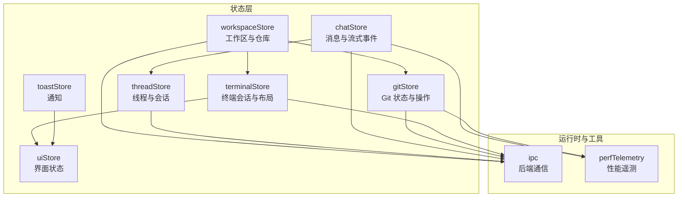
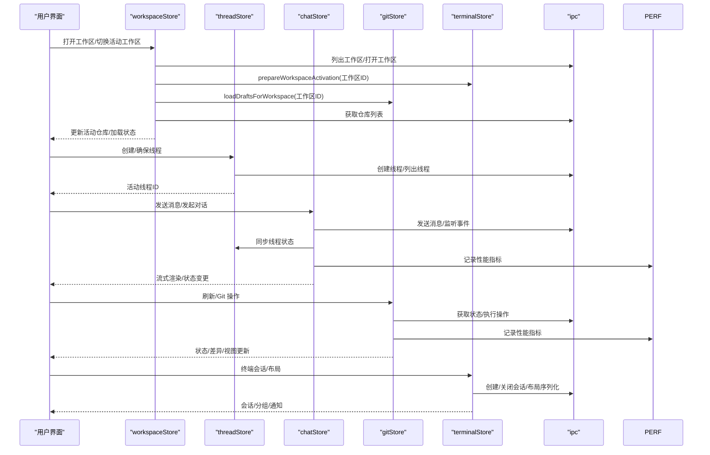
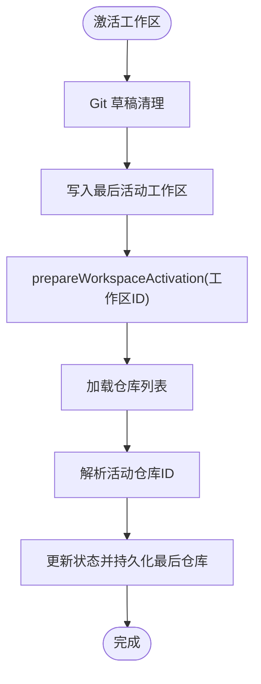
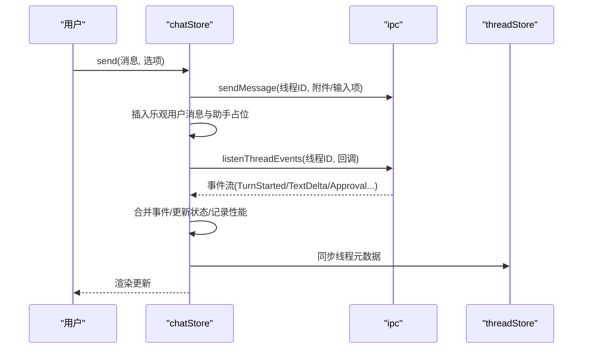
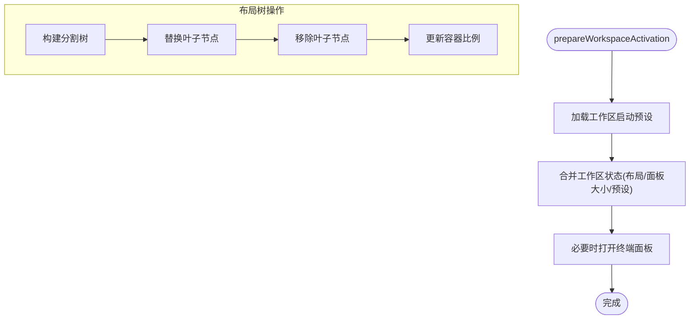
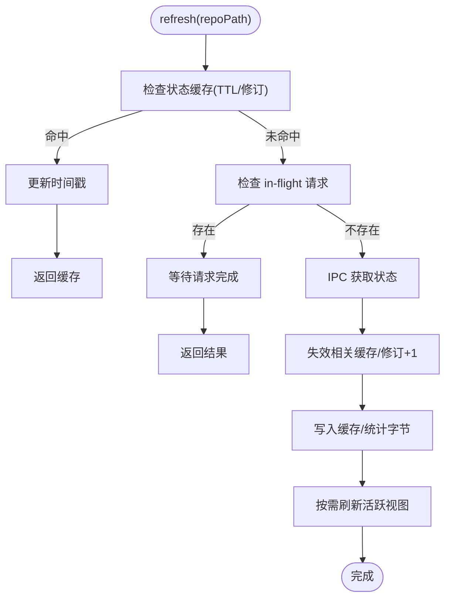
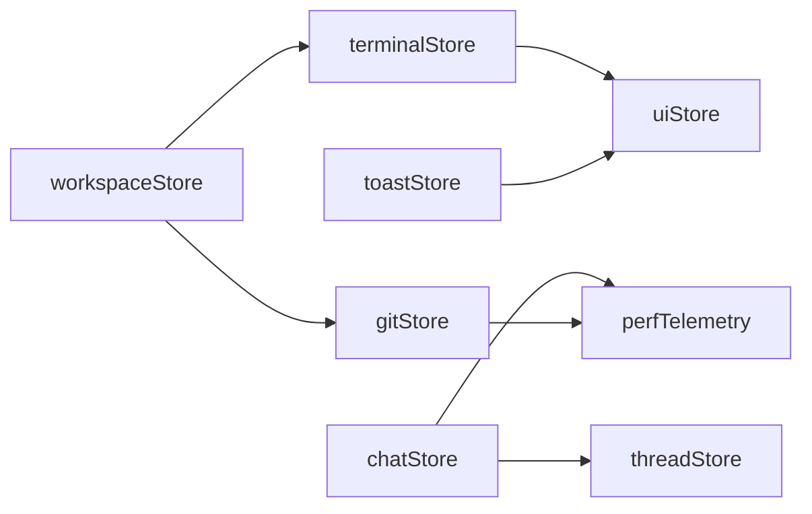

# 状态管理架构

<cite>
**本文档引用的文件**
- [workspaceStore.ts](file://src/stores/workspaceStore.ts)
- [chatStore.ts](file://src/stores/chatStore.ts)
- [terminalStore.ts](file://src/stores/terminalStore.ts)
- [gitStore.ts](file://src/stores/gitStore.ts)
- [threadStore.ts](file://src/stores/threadStore.ts)
- [uiStore.ts](file://src/stores/uiStore.ts)
- [toastStore.ts](file://src/stores/toastStore.ts)
- [perfTelemetry.ts](file://src/lib/perfTelemetry.ts)
- [workspaceStore.test.ts](file://src/stores/workspaceStore.test.ts)
- [chatStore.test.ts](file://src/stores/chatStore.test.ts)
- [gitStore.test.ts](file://src/stores/gitStore.test.ts)
- [terminalStore.test.ts](file://src/stores/terminalStore.test.ts)
</cite>

## 目录
1. [简介](#简介)
2. [项目结构](#项目结构)
3. [核心组件](#核心组件)
4. [架构总览](#架构总览)
5. [详细组件分析](#详细组件分析)
6. [依赖分析](#依赖分析)
7. [性能考虑](#性能考虑)
8. [故障排除指南](#故障排除指南)
9. [结论](#结论)
10. [附录](#附录)

## 简介
本文件系统性梳理 Panes 基于 Zustand 的状态管理架构，重点覆盖以下方面：
- 全局状态 Store 的组织结构与职责边界
- 状态订阅机制与跨 Store 协同
- 状态持久化策略（本地存储与 IPC 同步）
- 关键 Store：workspaceStore、chatStore、terminalStore、gitStore 的职责划分与相互依赖
- 异步状态处理、事件流与状态同步机制
- 状态调试工具与性能监控策略
- 状态流转图与实际使用示例

## 项目结构
Panes 将状态管理集中在 src/stores 目录下，采用“按功能域拆分”的模块化组织方式，每个 Store 聚焦单一领域（工作区、聊天、终端、Git、线程、UI、通知等），通过 Zustand 的 create API 定义状态与动作，并在需要时通过 getState 访问其他 Store。

图表来源
- [workspaceStore.ts:134-428](file://src/stores/workspaceStore.ts#L134-L428)
- [threadStore.ts:164-712](file://src/stores/threadStore.ts#L164-L712)
- [chatStore.ts:134-800](file://src/stores/chatStore.ts#L134-L800)
- [gitStore.ts:476-1132](file://src/stores/gitStore.ts#L476-L1132)
- [terminalStore.ts:751-1132](file://src/stores/terminalStore.ts#L751-L1132)
- [uiStore.ts:79-230](file://src/stores/uiStore.ts#L79-L230)
- [toastStore.ts:31-66](file://src/stores/toastStore.ts#L31-L66)
- [perfTelemetry.ts:55-146](file://src/lib/perfTelemetry.ts#L55-L146)

章节来源
- [workspaceStore.ts:1-429](file://src/stores/workspaceStore.ts#L1-L429)
- [chatStore.ts:1-800](file://src/stores/chatStore.ts#L1-L800)
- [terminalStore.ts:1-800](file://src/stores/terminalStore.ts#L1-L800)
- [gitStore.ts:1-800](file://src/stores/gitStore.ts#L1-L800)
- [threadStore.ts:1-713](file://src/stores/threadStore.ts#L1-L713)
- [uiStore.ts:1-231](file://src/stores/uiStore.ts#L1-L231)
- [toastStore.ts:1-66](file://src/stores/toastStore.ts#L1-L66)
- [perfTelemetry.ts:1-146](file://src/lib/perfTelemetry.ts#L1-L146)

## 核心组件
- workspaceStore：管理多工作区、仓库集合、活动工作区与仓库、信任级别、扫描与重扫等；负责与 terminalStore 和 gitStore 的协同激活。
- chatStore：管理线程消息窗口、流式事件、审批流程、动作输出水合、性能指标记录等。
- terminalStore：管理终端会话、分组、布局树、启动预设、通知与会话生命周期。
- gitStore：管理 Git 状态缓存、差异缓存、视图刷新节流、远程同步状态、草稿持久化等。
- threadStore：管理线程列表、归档、活动线程、新线程创建与运行时推断。
- uiStore：管理侧边栏、Git 面板、探索器、焦点模式、命令面板等 UI 状态与持久化。
- toastStore：全局通知队列管理，支持多种类型与自动过期。
- perfTelemetry：性能指标采集、预算告警与快照查询。

章节来源
- [workspaceStore.ts:11-428](file://src/stores/workspaceStore.ts#L11-L428)
- [chatStore.ts:24-800](file://src/stores/chatStore.ts#L24-L800)
- [terminalStore.ts:415-1132](file://src/stores/terminalStore.ts#L415-L1132)
- [gitStore.ts:351-1132](file://src/stores/gitStore.ts#L351-L1132)
- [threadStore.ts:34-712](file://src/stores/threadStore.ts#L34-L712)
- [uiStore.ts:24-230](file://src/stores/uiStore.ts#L24-L230)
- [toastStore.ts:10-66](file://src/stores/toastStore.ts#L10-L66)
- [perfTelemetry.ts:1-146](file://src/lib/perfTelemetry.ts#L1-L146)

## 架构总览
Zustand Store 之间通过 getState 互访实现松耦合协作。IPC 层负责与后端通信，perfTelemetry 提供性能观测能力。UI Store 与 Toast Store 作为横切关注点服务于各功能域。

图表来源
- [workspaceStore.ts:142-158](file://src/stores/workspaceStore.ts#L142-L158)
- [threadStore.ts:170-220](file://src/stores/threadStore.ts#L170-L220)
- [chatStore.ts:38-62](file://src/stores/chatStore.ts#L38-L62)
- [gitStore.ts:522-620](file://src/stores/gitStore.ts#L522-L620)
- [terminalStore.ts:754-797](file://src/stores/terminalStore.ts#L754-L797)
- [perfTelemetry.ts:55-87](file://src/lib/perfTelemetry.ts#L55-L87)

## 详细组件分析

### workspaceStore 分析
职责与边界
- 工作区与仓库管理：列出、打开、归档、恢复、重扫、设置信任级别
- 活动上下文：活动工作区与仓库、最后访问记录、持久化
- 与其他 Store 协同：激活工作区时准备终端与 Git 草稿

关键机制
- 状态持久化：使用 localStorage 存储最后活动工作区与按工作区分组的最后活动仓库
- 请求去抖与序列控制：仓库加载使用请求序号避免竞态
- Linux AppImage 根路径容错：启动时跳过临时根路径
- 与 terminalStore/gs 的联动：激活工作区时调用 prepareWorkspaceActivation 并加载 Git 草稿

图表来源
- [workspaceStore.ts:287-297](file://src/stores/workspaceStore.ts#L287-L297)
- [workspaceStore.ts:134-158](file://src/stores/workspaceStore.ts#L134-L158)
- [workspaceStore.ts:251-286](file://src/stores/workspaceStore.ts#L251-L286)

章节来源
- [workspaceStore.ts:11-428](file://src/stores/workspaceStore.ts#L11-L428)
- [workspaceStore.test.ts:62-119](file://src/stores/workspaceStore.test.ts#L62-L119)
- [workspaceStore.test.ts:121-168](file://src/stores/workspaceStore.test.ts#L121-L168)
- [workspaceStore.test.ts:170-258](file://src/stores/workspaceStore.test.ts#L170-L258)
- [workspaceStore.test.ts:260-310](file://src/stores/workspaceStore.test.ts#L260-L310)

### chatStore 分析
职责与边界
- 线程消息窗口管理：加载旧消息、游标、阻塞时间
- 流式事件处理：事件批处理、合并、延迟刷新、性能指标记录
- 审批与动作：外部审批响应、动作输出水合、差分块折叠
- 状态机：TurnStarted/TurnCompleted/ApprovalRequested/Error 等状态转换

关键机制
- 乐观 UI：发送消息时立即插入用户与助手占位消息
- 事件路由：根据 clientTurnId 将事件精确路由到对应助手消息
- 性能监控：记录首次 Shell/内容/文本渲染耗时、流刷新频率等
- 背景监听：切换页面时保持流监听，避免事件丢失

图表来源
- [chatStore.ts:38-62](file://src/stores/chatStore.ts#L38-L62)
- [chatStore.ts:118-156](file://src/stores/chatStore.ts#L118-L156)
- [chatStore.ts:231-291](file://src/stores/chatStore.ts#L231-L291)
- [chatStore.ts:550-600](file://src/stores/chatStore.ts#L550-L600)

章节来源
- [chatStore.ts:24-800](file://src/stores/chatStore.ts#L24-L800)
- [chatStore.test.ts:38-131](file://src/stores/chatStore.test.ts#L38-L131)
- [chatStore.test.ts:132-205](file://src/stores/chatStore.test.ts#L132-L205)
- [chatStore.test.ts:206-263](file://src/stores/chatStore.test.ts#L206-L263)
- [chatStore.test.ts:264-346](file://src/stores/chatStore.test.ts#L264-L346)
- [chatStore.test.ts:347-409](file://src/stores/chatStore.test.ts#L347-L409)
- [chatStore.test.ts:410-480](file://src/stores/chatStore.test.ts#L410-L480)
- [chatStore.test.ts:481-539](file://src/stores/chatStore.test.ts#L481-L539)
- [chatStore.test.ts:540-612](file://src/stores/chatStore.test.ts#L540-L612)
- [chatStore.test.ts:613-736](file://src/stores/chatStore.test.ts#L613-L736)
- [chatStore.test.ts:737-790](file://src/stores/chatStore.test.ts#L737-L790)

### terminalStore 分析
职责与边界
- 终端会话与分组：创建、关闭、分割、重排、广播
- 布局与视图：聊天/终端/分割/编辑模式切换与持久化
- 启动预设：从工作区加载/序列化/应用启动配置
- 通知管理：按会话聚合、触达标记、水合策略

关键机制
- 布局树：二叉平衡分割树构建与替换/移除叶子节点
- 启动预设：从 IPC 加载工作区启动预设，结合本地存储回退
- 会话元数据：按会话维护 harness 信息与工作树映射
- 通知水合：根据存活会话过滤，支持全量或按会话触达

图表来源
- [terminalStore.ts:754-797](file://src/stores/terminalStore.ts#L754-L797)
- [terminalStore.ts:41-115](file://src/stores/terminalStore.ts#L41-L115)
- [terminalStore.ts:280-325](file://src/stores/terminalStore.ts#L280-L325)

章节来源
- [terminalStore.ts:415-1132](file://src/stores/terminalStore.ts#L415-L1132)
- [terminalStore.test.ts:1-66](file://src/stores/terminalStore.test.ts#L1-L66)

### gitStore 分析
职责与边界
- Git 状态与差异缓存：LRU 缓存、TTL、字节限制、并发去重
- 视图刷新节流：活跃视图最小刷新间隔
- 远程同步状态：fetch/pull/push 期间的 UI 状态标记
- 草稿持久化：工作区级提交/分支草稿历史

关键机制
- 缓存键：仓库路径 + staged 标识组合
- 版本修订：仓库变更时递增修订号，失效相关缓存
- 并发控制：同一仓库的多个请求共享 in-flight Promise
- 视图刷新：仅在必要时刷新当前活跃视图

图表来源
- [gitStore.ts:259-300](file://src/stores/gitStore.ts#L259-L300)
- [gitStore.ts:476-620](file://src/stores/gitStore.ts#L476-L620)
- [gitStore.ts:211-230](file://src/stores/gitStore.ts#L211-L230)

章节来源
- [gitStore.ts:351-1132](file://src/stores/gitStore.ts#L351-L1132)
- [gitStore.test.ts:70-157](file://src/stores/gitStore.test.ts#L70-L157)
- [gitStore.test.ts:158-172](file://src/stores/gitStore.test.ts#L158-L172)
- [gitStore.test.ts:173-194](file://src/stores/gitStore.test.ts#L173-L194)
- [gitStore.test.ts:195-209](file://src/stores/gitStore.test.ts#L195-L209)
- [gitStore.test.ts:211-249](file://src/stores/gitStore.test.ts#L211-L249)

### threadStore 分析
职责与边界
- 线程生命周期：创建、重命名、归档/恢复、fork/rollback/compact
- 新线程运行时推断：基于引擎、Composer 运行时、引导选择与活动线程
- 线程列表与归档：按工作区聚合、扁平化排序、最后活动时间
- 本地更新：applyThreadUpdateLocal 用于引擎侧更新的本地应用

关键机制
- 运行时推断：resolveImplicitNewThreadRuntime 综合引擎、Composer、引导选择与活动线程
- 最后活动线程持久化：LAST_THREAD_KEY 用于恢复最近活动线程
- 多工作区刷新：refreshAllThreads 并行拉取所有工作区线程

章节来源
- [threadStore.ts:34-712](file://src/stores/threadStore.ts#L34-L712)

### uiStore 与 toastStore
职责与边界
- uiStore：侧边栏/Git 面板/探索器开关与固定、焦点模式、命令面板、活动视图、消息聚焦目标
- toastStore：全局通知队列、最多保留数量、默认持续时间、按类型定制

关键机制
- 本地存储：侧边栏/Git 面板固定状态与探索器开关持久化
- 条件懒加载：切换到 harnesses 视图时才懒加载 harnessStore

章节来源
- [uiStore.ts:24-230](file://src/stores/uiStore.ts#L24-L230)
- [toastStore.ts:10-66](file://src/stores/toastStore.ts#L10-L66)

## 依赖分析
Store 间依赖关系与耦合度
- workspaceStore 依赖 terminalStore 与 gitStore：激活工作区时准备终端与加载 Git 草稿
- chatStore 依赖 threadStore：同步线程状态与元数据
- gitStore 与 terminalStore：均依赖 IPC 进行状态与操作
- perfTelemetry 作为横切关注点被 chatStore 与 gitStore 使用
- uiStore 与 toastStore 作为横切服务被各功能域使用

图表来源
- [workspaceStore.ts:150-152](file://src/stores/workspaceStore.ts#L150-L152)
- [chatStore.ts:134-156](file://src/stores/chatStore.ts#L134-L156)
- [perfTelemetry.ts:55-87](file://src/lib/perfTelemetry.ts#L55-L87)

章节来源
- [workspaceStore.ts:134-158](file://src/stores/workspaceStore.ts#L134-L158)
- [chatStore.ts:118-156](file://src/stores/chatStore.ts#L118-L156)

## 性能考虑
- 事件批处理与延迟刷新：chatStore 对流式事件进行批处理与定时刷新，降低渲染压力
- 缓存与去重：gitStore 使用 TTL/LRU 与 in-flight 去重，减少重复 IPC 调用
- 性能预算与告警：perfTelemetry 记录关键指标并在超限时冷却告警
- 并发控制：gitStore 与 threadStore 在重叠操作期间维持 loading 状态，避免 UI 抖动

章节来源
- [chatStore.ts:231-291](file://src/stores/chatStore.ts#L231-L291)
- [gitStore.ts:259-300](file://src/stores/gitStore.ts#L259-L300)
- [perfTelemetry.ts:55-87](file://src/lib/perfTelemetry.ts#L55-L87)

## 故障排除指南
常见问题与定位方法
- 工作区切换后状态异常：检查 workspaceStore 的请求序号与活动仓库解析逻辑
- Git 刷新不生效：确认修订号是否递增、缓存是否失效、活跃视图刷新间隔
- 终端会话丢失：核对分割树替换/移除逻辑与存活会话索引
- 聊天事件错配：检查 clientTurnId 匹配与事件批处理合并规则
- 性能告警：通过 window.__panesPerf 快照查看指标分布与阈值

章节来源
- [workspaceStore.test.ts:62-119](file://src/stores/workspaceStore.test.ts#L62-L119)
- [gitStore.test.ts:173-194](file://src/stores/gitStore.test.ts#L173-L194)
- [chatStore.test.ts:132-205](file://src/stores/chatStore.test.ts#L132-L205)

## 结论
Panes 的 Zustand 状态管理以“功能域 Store + IPC 横切”为核心，通过明确的职责边界与严格的异步与缓存策略，实现了高可用的工作区/聊天/终端/Git 场景。配合性能遥测与本地持久化，既保证了用户体验，也为可观测性与可维护性提供了坚实基础。

## 附录
- 实际使用示例（路径引用）
  - 打开工作区并准备终端与 Git：[workspaceStore.ts:167-186](file://src/stores/workspaceStore.ts#L167-L186)
  - 发送消息并监听流式事件：[chatStore.ts:38-62](file://src/stores/chatStore.ts#L38-L62)
  - 刷新 Git 状态并处理差异：[gitStore.ts:522-620](file://src/stores/gitStore.ts#L522-L620)
  - 创建终端会话并应用启动预设：[terminalStore.ts:754-797](file://src/stores/terminalStore.ts#L754-L797)
  - 设置 UI 状态并持久化：[uiStore.ts:105-123](file://src/stores/uiStore.ts#L105-L123)
  - 添加全局通知：[toastStore.ts:34-47](file://src/stores/toastStore.ts#L34-L47)