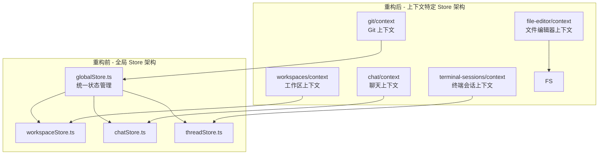
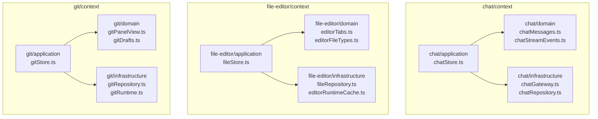
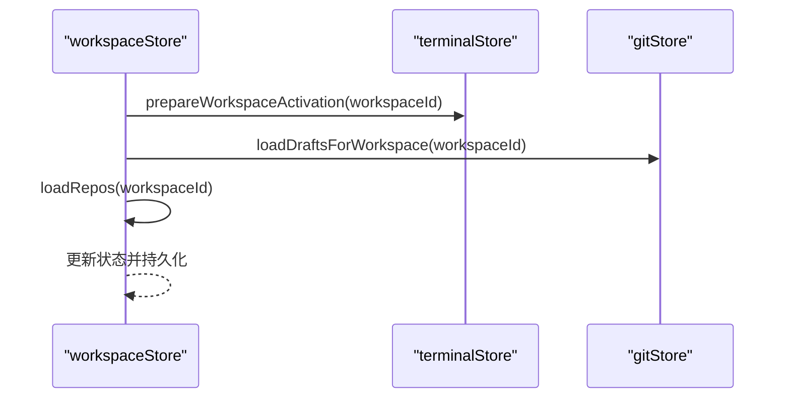
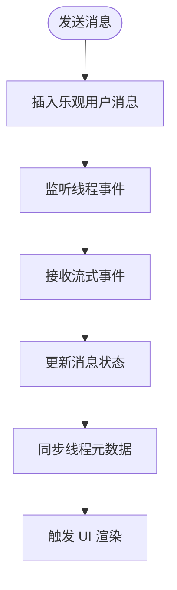
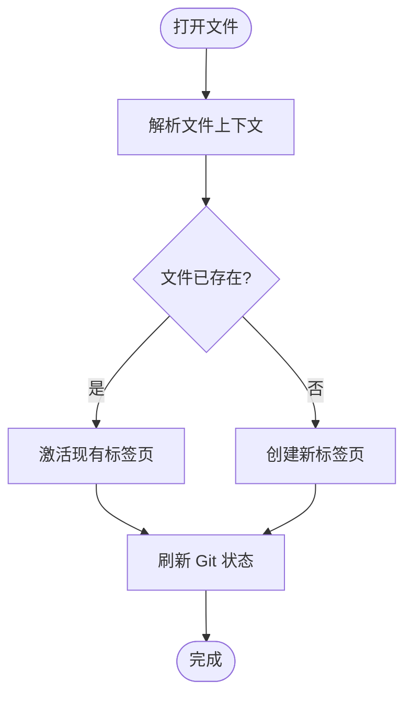

# 状态管理架构

<cite>
**本文档引用的文件**
- [chatStore.ts](file://src/contexts/chat/application/chatStore.ts)
- [fileStore.ts](file://src/contexts/file-editor/application/fileStore.ts)
- [gitStore.ts](file://src/contexts/git/application/gitStore.ts)
- [terminalStore.ts](file://src/contexts/terminal-sessions/application/terminalStore.ts)
- [threadStore.ts](file://src/contexts/threads/application/threadStore.ts)
- [workspaceStore.ts](file://src/contexts/workspaces/application/workspaceStore.ts)
- [uiStore.ts](file://src/contexts/shell-ui/application/uiStore.ts)
- [toastStore.ts](file://src/contexts/shell-ui/application/toastStore.ts)
- [perfTelemetry.ts](file://src/lib/perfTelemetry.ts)
</cite>

## 更新摘要
**变更内容**
- 重构状态管理架构：从全局 Zustand Store 迁移到上下文特定的 Store 架构
- 新增多个功能域专用 Store：chat、file-editor、git、terminal-sessions、threads、workspaces、shell-ui 等
- 改进 Store 间通信机制：通过显式导入其他 Store 的方式实现松耦合协作
- 优化状态隔离：每个功能域拥有独立的状态管理，提升可维护性和可测试性

## 目录
1. [简介](#简介)
2. [架构演进](#架构演进)
3. [上下文特定 Store 架构](#上下文特定-store-架构)
4. [核心 Store 详解](#核心-store-详解)
5. [Store 间协作机制](#store-间协作机制)
6. [状态持久化与同步](#状态持久化与同步)
7. [性能监控与调试](#性能监控与调试)
8. [迁移影响与最佳实践](#迁移影响与最佳实践)
9. [总结](#总结)

## 简介
本文档详细阐述 Panes 从全局 Zustand Store 架构向上下文特定 Store 架构的重构过程。新的架构将状态管理分散到各个功能域，每个上下文拥有独立的状态管理实现，通过显式导入的方式实现松耦合协作，提升了系统的可维护性、可测试性和扩展性。

## 架构演进
Panes 的状态管理经历了从集中式到分布式的重要演进：

**图表来源**
- [workspaceStore.ts:61-377](file://src/contexts/workspaces/application/workspaceStore.ts#L61-L377)
- [chatStore.ts:711-800](file://src/contexts/chat/application/chatStore.ts#L711-L800)
- [fileStore.ts:77-392](file://src/contexts/file-editor/application/fileStore.ts#L77-L392)
- [gitStore.ts:116-820](file://src/contexts/git/application/gitStore.ts#L116-L820)
- [terminalStore.ts:392-1708](file://src/contexts/terminal-sessions/application/terminalStore.ts#L392-L1708)

## 上下文特定 Store 架构
新的架构将状态管理按照功能域进行拆分，每个上下文包含三个层次：

### 应用层 (application)
负责业务逻辑和状态管理，使用 Zustand 创建 Store 实例。

### 领域层 (domain)
包含业务规则、状态转换逻辑和数据模型定义。

### 基础设施层 (infrastructure)
封装与后端通信、数据访问和外部依赖。

**图表来源**
- [chatStore.ts:1-800](file://src/contexts/chat/application/chatStore.ts#L1-L800)
- [fileStore.ts:1-392](file://src/contexts/file-editor/application/fileStore.ts#L1-L392)
- [gitStore.ts:1-820](file://src/contexts/git/application/gitStore.ts#L1-L820)

## 核心 Store 详解

### 工作区 Store (workspaceStore)
负责工作区和仓库的管理，是整个系统的基础状态源。

**核心职责：**
- 工作区生命周期管理：打开、关闭、归档、恢复
- 仓库管理：加载、激活、信任级别设置
- 与其他 Store 的协调：激活工作区时准备终端和 Git 草稿

**关键机制：**
- 工作区激活时自动调用 `prepareWorkspaceActivation` 和 `loadDraftsForWorkspace`
- 仓库加载使用请求序列号避免竞态条件
- 支持工作区级配置持久化

**章节来源**
- [workspaceStore.ts:61-377](file://src/contexts/workspaces/application/workspaceStore.ts#L61-L377)

### 聊天 Store (chatStore)
专注于聊天和对话状态管理，处理消息流和交互逻辑。

**核心职责：**
- 线程消息窗口管理：加载、滚动、分页
- 流式事件处理：事件批处理、合并、延迟刷新
- 审批流程：外部审批响应处理
- 性能监控：记录首次渲染和响应时间指标

**关键机制：**
- 乐观 UI：发送消息时立即插入用户和助手占位消息
- 事件路由：根据 clientTurnId 精确路由到对应助手消息
- 背景监听：切换页面时保持流监听防止事件丢失

**章节来源**
- [chatStore.ts:711-800](file://src/contexts/chat/application/chatStore.ts#L711-L800)

### 文件编辑器 Store (fileStore)
管理文件编辑器的状态和行为，包括标签页管理和 Git 集成。

**核心职责：**
- 编辑器标签页管理：打开、关闭、切换、保存
- 文件上下文解析：确定文件归属的 Git 仓库
- Git 差异显示：支持工作副本与暂存区的对比
- 内容同步：文件修改检测和外部变更处理

**关键机制：**
- 文件上下文解析：通过绝对路径和仓库根路径确定归属
- Git 集成：自动刷新 Git 状态和差异信息
- 缓存管理：编辑器运行时缓存的生命周期管理

**章节来源**
- [fileStore.ts:77-392](file://src/contexts/file-editor/application/fileStore.ts#L77-L392)

### Git Store (gitStore)
专门处理 Git 相关的状态和操作，提供完整的版本控制功能。

**核心职责：**
- Git 状态缓存：LRU 缓存、TTL、字节限制
- 视图管理：分支、提交、工作树、暂存等视图
- 草稿管理：工作区级提交和分支草稿历史
- 远程操作：fetch、pull、push 等同步操作

**关键机制：**
- 缓存键组合：仓库路径 + staged 标识
- 并发控制：同一仓库的多个请求共享 in-flight Promise
- 视图刷新：仅在必要时刷新当前活跃视图

**章节来源**
- [gitStore.ts:116-820](file://src/contexts/git/application/gitStore.ts#L116-L820)

### 终端会话 Store (terminalStore)
管理终端会话、分组和布局，提供强大的终端集成能力。

**核心职责：**
- 会话管理：创建、关闭、分割、重排
- 布局系统：聊天/终端/分割/编辑模式切换
- 启动预设：从工作区加载和应用启动配置
- 通知管理：按会话聚合和触达标记

**关键机制：**
- 布局树：二叉平衡分割树构建与操作
- 启动预设：从 IPC 加载工作区启动预设
- 通知水合：根据存活会话过滤和聚合

**章节来源**
- [terminalStore.ts:392-1708](file://src/contexts/terminal-sessions/application/terminalStore.ts#L392-L1708)

### 线程 Store (threadStore)
管理对话线程的生命周期和状态，支持多线程场景。

**核心职责：**
- 线程生命周期：创建、重命名、归档/恢复、删除
- 新线程运行时推断：基于引擎、Composer 运行时、引导选择
- 线程列表管理：按工作区聚合、扁平化排序
- 本地更新：引擎侧更新的本地应用

**关键机制：**
- 运行时推断：综合多个因素确定最佳运行时配置
- 最后活动线程持久化：支持重启后恢复
- 并行刷新：多工作区线程的并行拉取

**章节来源**
- [threadStore.ts:105-647](file://src/contexts/threads/application/threadStore.ts#L105-L647)

### Shell UI Store (uiStore)
管理 Shell 用户界面状态，提供统一的 UI 控制接口。

**核心职责：**
- 界面可见性控制：侧边栏、Git 面板、探索器开关
- 固定状态管理：各面板的固定和展开状态
- 焦点模式：专注工作的界面模式
- 命令面板：全局快捷操作入口

**关键机制：**
- 本地存储：界面状态的持久化
- 条件懒加载：按需加载功能模块
- 偏好设置：用户界面偏好的读取和写入

**章节来源**
- [uiStore.ts:11-105](file://src/contexts/shell-ui/application/uiStore.ts#L11-L105)

### Toast Store (toastStore)
提供全局通知管理，支持多种类型和自动过期。

**核心职责：**
- 通知队列管理：添加、移除、过期处理
- 类型定制：成功、错误、警告、信息等不同样式
- 自动过期：基于通知类型的默认持续时间

**关键机制：**
- ID 生成：自增 ID 确保唯一性
- 队列管理：最多保留数量限制
- 类型化配置：每种通知类型的定制参数

**章节来源**
- [toastStore.ts:11-42](file://src/contexts/shell-ui/application/toastStore.ts#L11-L42)

## Store 间协作机制
新的架构通过显式导入的方式实现 Store 间的松耦合协作：

### 工作区激活流程

**图表来源**
- [workspaceStore.ts:77-79](file://src/contexts/workspaces/application/workspaceStore.ts#L77-L79)

### 聊天与线程协作

**图表来源**
- [chatStore.ts:721-800](file://src/contexts/chat/application/chatStore.ts#L721-L800)

### 文件编辑器与 Git 集成

**图表来源**
- [fileStore.ts:82-153](file://src/contexts/file-editor/application/fileStore.ts#L82-L153)

## 状态持久化与同步
新架构保持了原有的持久化策略，同时增强了状态同步能力：

### 持久化策略
- **工作区状态**：最后活动工作区和仓库持久化
- **界面偏好**：侧边栏、Git 面板、探索器状态
- **通知配置**：全局通知队列和类型配置
- **编辑器状态**：文件内容和标签页状态

### 同步机制
- **IPC 同步**：与后端进程的双向通信
- **跨 Store 同步**：工作区激活时的自动协调
- **事件驱动**：状态变更通过事件传播到相关组件

## 性能监控与调试
新架构引入了更精细的性能监控和调试能力：

### 性能指标
- **聊天性能**：首次 Shell、内容、文本渲染时间
- **Git 操作**：状态获取、文件差异计算时间
- **终端操作**：会话创建、布局调整响应时间

### 调试工具
- **状态快照**：window.__panesPerf 查看指标分布
- **事件日志**：详细的 Store 变更追踪
- **性能告警**：超限时的冷却告警机制

**章节来源**
- [perfTelemetry.ts:55-146](file://src/lib/perfTelemetry.ts#L55-L146)

## 迁移影响与最佳实践

### 迁移影响
- **代码组织**：从单个 stores 目录迁移到 contexts 目录
- **导入路径**：需要更新 Store 导入路径
- **状态访问**：通过显式导入而非全局访问

### 最佳实践
- **单一职责**：每个 Store 专注于单一功能域
- **松耦合**：通过显式导入实现 Store 间通信
- **类型安全**：充分利用 TypeScript 提供的类型检查
- **测试友好**：独立的 Store 更容易进行单元测试

### 迁移步骤
1. 创建新的上下文目录结构
2. 将原有 Store 代码迁移到对应上下文
3. 更新导入路径和依赖关系
4. 验证 Store 间协作功能
5. 迁移测试用例和文档

## 总结
Panes 的状态管理架构重构代表了从集中式到分布式架构的重要转变。新的上下文特定 Store 架构通过明确的功能域分离、松耦合的 Store 间协作和增强的性能监控，为复杂的开发工具提供了更加稳健和可维护的状态管理解决方案。这种架构不仅提升了代码的可读性和可维护性，还为未来的功能扩展奠定了坚实的基础。