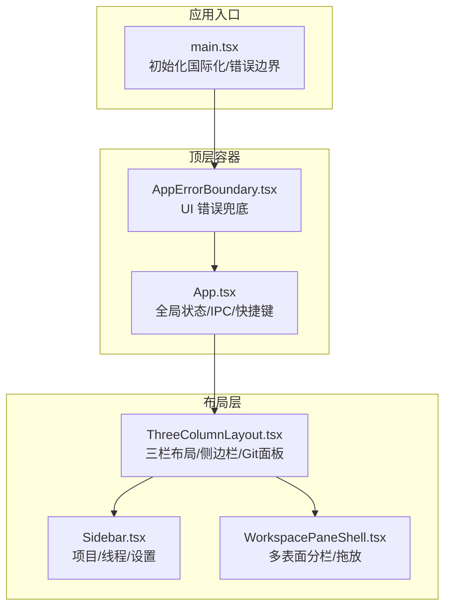
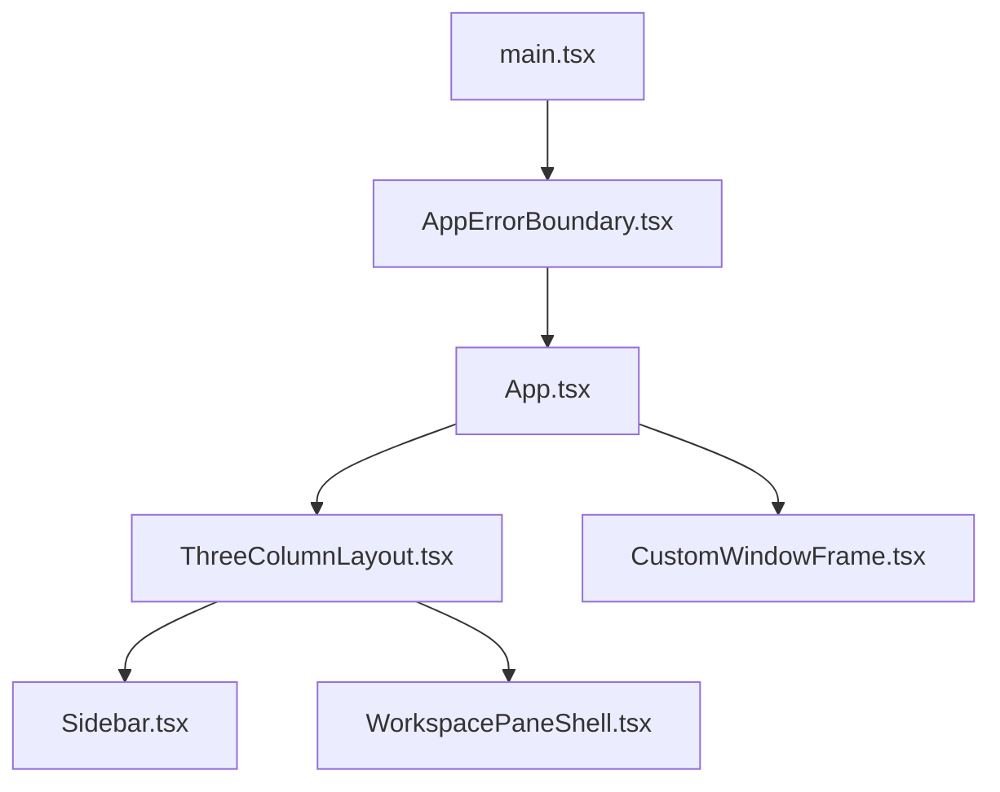
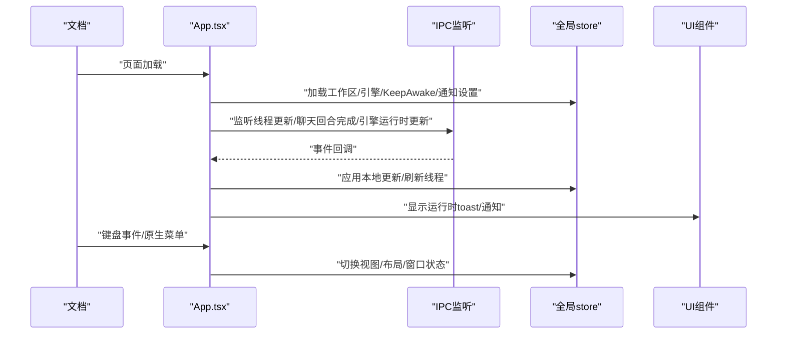
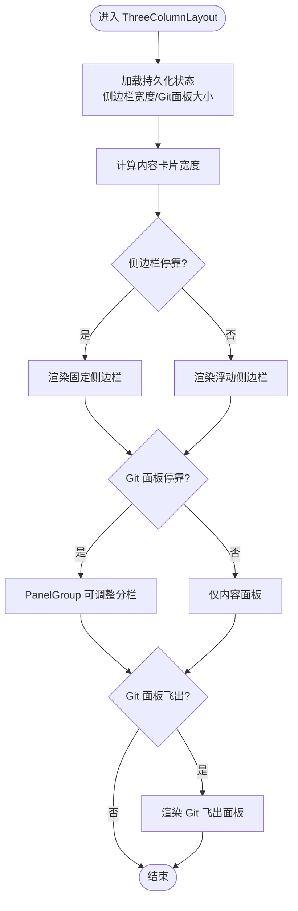
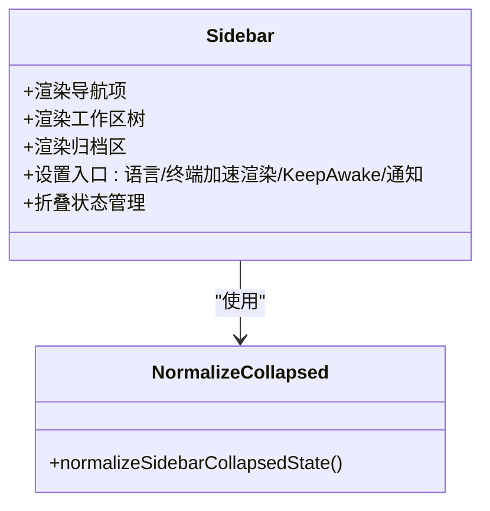
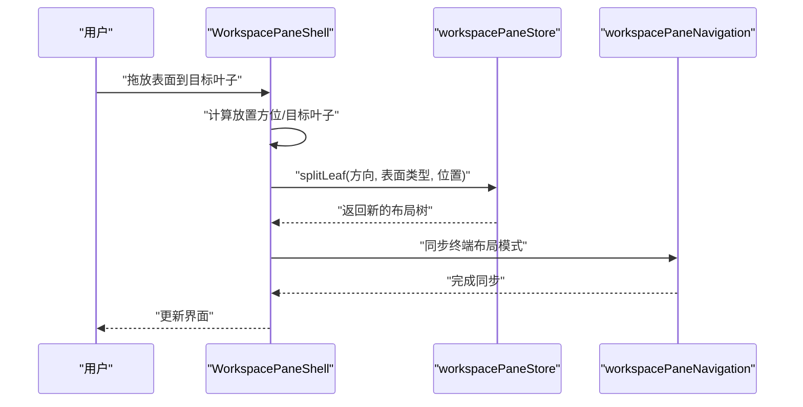
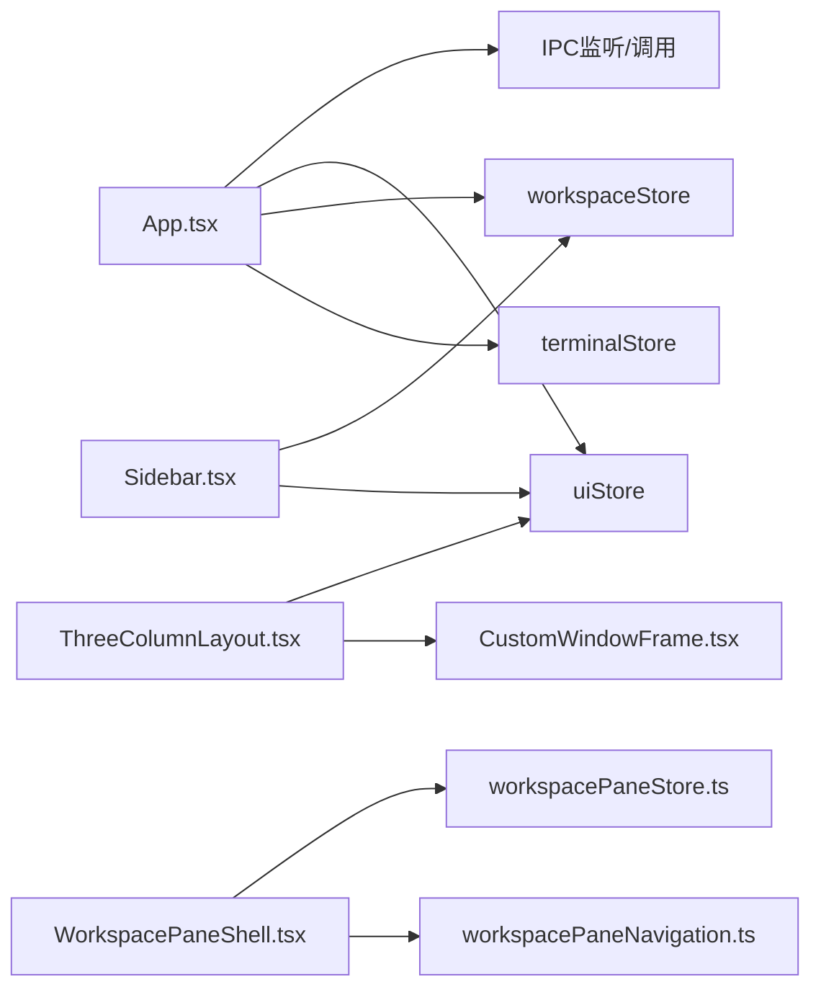
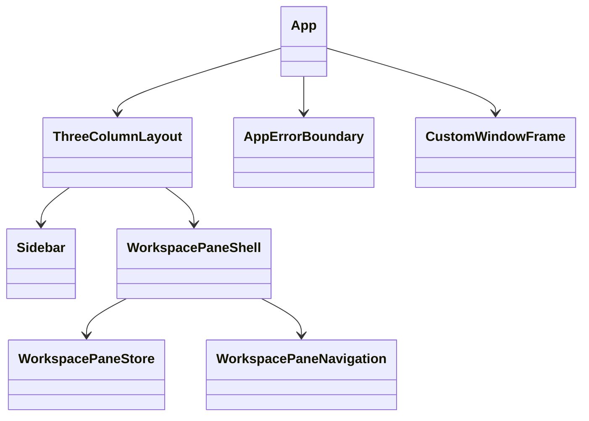

# 组件架构

<cite>
**本文引用的文件**
- [src\App.tsx](file://src\App.tsx)
- [src\components\layout\ThreeColumnLayout.tsx](file://src\components\layout\ThreeColumnLayout.tsx)
- [src\components\sidebar\Sidebar.tsx](file://src\components\sidebar\Sidebar.tsx)
- [src\components\workspace\WorkspacePaneShell.tsx](file://src\components\workspace\WorkspacePaneShell.tsx)
- [src\components\shared\AppErrorBoundary.tsx](file://src\components\shared\AppErrorBoundary.tsx)
- [src\components\shared\CustomWindowFrame.tsx](file://src\components\shared\CustomWindowFrame.tsx)
- [src\components\sidebar\sidebarCollapseState.ts](file://src\components\sidebar\sidebarCollapseState.ts)
- [src\stores\workspacePaneStore.ts](file://src\stores\workspacePaneStore.ts)
- [src\lib\workspacePaneNavigation.ts](file://src\lib\workspacePaneNavigation.ts)
- [src\main.tsx](file://src\main.tsx)
- [src\components\shared\CustomWindowFrame.test.tsx](file://src\components\shared\CustomWindowFrame.test.tsx)
- [tests\MarkdownContent.test.tsx](file://tests\MarkdownContent.test.tsx)
</cite>

## 目录
1. [简介](#简介)
2. [项目结构](#项目结构)
3. [核心组件](#核心组件)
4. [架构总览](#架构总览)
5. [详细组件分析](#详细组件分析)
6. [依赖分析](#依赖分析)
7. [性能考量](#性能考量)
8. [故障排查指南](#故障排查指南)
9. [结论](#结论)
10. [附录](#附录)

## 简介
本文件系统性梳理 Panes 前端组件架构，围绕 React 19 + TypeScript 的组件化设计，重点阐述容器组件与展示组件的分离、组件生命周期管理与 Props 传递策略，并深入解析核心组件 App、ThreeColumnLayout、Sidebar 与 WorkspacePaneShell 的职责与交互关系。同时覆盖错误边界处理、性能优化、组件测试策略与开发最佳实践，辅以组件层次结构图与交互示例，帮助读者快速理解并高效扩展该架构。

## 项目结构
- 应用入口通过 main.tsx 初始化国际化与错误边界包装，渲染根组件 App。
- App 负责全局状态初始化、IPC 订阅、快捷键拦截与应用级行为协调。
- ThreeColumnLayout 作为布局容器，协调侧边栏、Git 面板与工作区内容区域。
- Sidebar 提供项目与线程导航、设置入口与侧边栏状态管理。
- WorkspacePaneShell 承载多表面（聊天/终端/编辑器）的可拖拽分栏布局与拖放拆分能力。
- 错误边界 AppErrorBoundary 提供 UI 运行时错误兜底显示。
- 自定义窗口框架 CustomWindowFrame 在非原生窗口环境下提供窗口控制与菜单集成。

图表来源
- [src\main.tsx:11-32](file://src\main.tsx#L11-L32)
- [src\App.tsx:559-577](file://src\App.tsx#L559-L577)
- [src\components\layout\ThreeColumnLayout.tsx:243-381](file://src\components\layout\ThreeColumnLayout.tsx#L243-L381)
- [src\components\sidebar\Sidebar.tsx:79-800](file://src\components\sidebar\Sidebar.tsx#L79-L800)
- [src\components\workspace\WorkspacePaneShell.tsx:143-503](file://src\components\workspace\WorkspacePaneShell.tsx#L143-L503)
- [src\components\shared\AppErrorBoundary.tsx:12-51](file://src\components\shared\AppErrorBoundary.tsx#L12-L51)

章节来源
- [src\main.tsx:11-32](file://src\main.tsx#L11-L32)
- [src\App.tsx:559-577](file://src\App.tsx#L559-L577)

## 核心组件
- App：集中式应用控制器，负责加载工作区与引擎、订阅 IPC 事件、处理全局快捷键、维护 KeepAwake 刷新、检查更新等。
- ThreeColumnLayout：布局编排者，管理侧边栏停靠/浮动、Git 面板停靠/飞出、焦点模式拖动条、内容卡片宽度计算与 PanelGroup 分栏。
- Sidebar：导航与设置中心，聚合工作区、线程列表、归档区、语言切换、终端加速渲染偏好、电源与通知设置等。
- WorkspacePaneShell：工作区多表面壳，支持聊天/终端/编辑器三类表面在叶子节点间切换与拖放拆分，提供标题栏面包屑与操作区。
- AppErrorBoundary：UI 错误边界，捕获子树异常并渲染可读的错误信息。
- CustomWindowFrame：自定义窗口框架，提供菜单、窗口控制按钮与拖动区域，在 Linux 等平台模拟原生窗口体验。

章节来源
- [src\App.tsx:119-577](file://src\App.tsx#L119-L577)
- [src\components\layout\ThreeColumnLayout.tsx:55-381](file://src\components\layout\ThreeColumnLayout.tsx#L55-L381)
- [src\components\sidebar\Sidebar.tsx:79-800](file://src\components\sidebar\Sidebar.tsx#L79-L800)
- [src\components\workspace\WorkspacePaneShell.tsx:143-503](file://src\components\workspace\WorkspacePaneShell.tsx#L143-L503)
- [src\components\shared\AppErrorBoundary.tsx:12-51](file://src\components\shared\AppErrorBoundary.tsx#L12-L51)
- [src\components\shared\CustomWindowFrame.tsx:39-195](file://src\components\shared\CustomWindowFrame.tsx#L39-L195)

## 架构总览
整体采用“容器-展示”分层与“状态-视图”解耦的设计模式：
- 容器组件（App、ThreeColumnLayout、WorkspacePaneShell）负责状态聚合、副作用与跨组件协调。
- 展示组件（Sidebar、CustomWindowFrame 等）专注 UI 呈现与用户交互。
- 全局状态通过 Zustand store（如 workspacePaneStore、uiStore、terminalStore 等）集中管理，避免深层 Props 下传。
- IPC 事件驱动与快捷键拦截在 App 中统一处理，确保一致性与可测试性。

图表来源
- [src\App.tsx:119-577](file://src\App.tsx#L119-L577)
- [src\components\layout\ThreeColumnLayout.tsx:55-381](file://src\components\layout\ThreeColumnLayout.tsx#L55-L381)
- [src\components\sidebar\Sidebar.tsx:79-800](file://src\components\sidebar\Sidebar.tsx#L79-L800)
- [src\components\workspace\WorkspacePaneShell.tsx:143-503](file://src\components\workspace\WorkspacePaneShell.tsx#L143-L503)
- [src\components\shared\AppErrorBoundary.tsx:12-51](file://src\components\shared\AppErrorBoundary.tsx#L12-L51)
- [src\components\shared\CustomWindowFrame.tsx:39-195](file://src\components\shared\CustomWindowFrame.tsx#L39-L195)
- [src\main.tsx:22-28](file://src\main.tsx#L22-L28)

## 详细组件分析

### App 组件
- 职责
  - 初始化全局状态：工作区、引擎、KeepAwake、终端通知设置。
  - 订阅 IPC 事件：线程更新、聊天回合完成、引擎运行时更新。
  - 处理全局快捷键：macOS/浏览器差异下的键盘事件优先级与防抖；与原生菜单动作协同。
  - 生命周期：beforeunload 冲洗草稿、延时检查更新、定时刷新 KeepAwake。
- 关键交互
  - 通过 useWorkspaceStore/useEngineStore/useUiStore 等读取/派发状态。
  - 使用 ipc.listen* 与 showRuntimeToast、resolveAgentDisplayName 等工具函数。
- 设计要点
  - 将应用级副作用集中在单个组件中，便于统一治理与测试。
  - 对同一快捷键的 JS 与原生菜单路径使用防抖，避免重复触发。

图表来源
- [src\App.tsx:139-290](file://src\App.tsx#L139-L290)
- [src\App.tsx:291-557](file://src\App.tsx#L291-L557)

章节来源
- [src\App.tsx:119-577](file://src\App.tsx#L119-L577)

### ThreeColumnLayout 组件
- 职责
  - 管理侧边栏停靠/浮动与宽度；Git 面板停靠/飞出与尺寸；焦点模式拖动条。
  - 通过 PanelGroup 实现主内容与 Git 面板的可调整分栏。
  - 维护内容卡片宽度，用于计算 Git 飞出面板的绝对宽度。
- 关键交互
  - 侧边栏拖拽调整宽度与点击切换停靠；Git 触发按钮悬停/失焦控制飞出。
  - 通过 GitFlyoutContext 向子树暴露打开/关闭与区域判断方法。
- 设计要点
  - 使用 localStorage 持久化侧边栏宽度与 Git 面板大小。
  - 使用 ResizeObserver 动态计算内容宽度，保证响应式布局。

图表来源
- [src\components\layout\ThreeColumnLayout.tsx:55-381](file://src\components\layout\ThreeColumnLayout.tsx#L55-L381)

章节来源
- [src\components\layout\ThreeColumnLayout.tsx:55-381](file://src\components\layout\ThreeColumnLayout.tsx#L55-L381)

### Sidebar 组件
- 职责
  - 工作区与线程的折叠/展开、新建线程、归档/恢复、切换活动项。
  - 设置入口：语言切换、终端加速渲染偏好、KeepAwake、终端通知设置。
  - 归档区展示与交互。
- 关键交互
  - 使用 normalizeSidebarCollapsedState 保持折叠状态与活动工作区同步。
  - 通过 createAndActivateWorkspaceThread 创建并激活新线程。
  - 通过 ipc.setTerminalAcceleratedRendering 与 i18n.changeLanguage 更新设置。
- 设计要点
  - 使用 startTransition 优化新建线程的 UI 响应。
  - 使用 createPortal 渲染设置菜单，避免层级污染。

图表来源
- [src\components\sidebar\Sidebar.tsx:79-800](file://src\components\sidebar\Sidebar.tsx#L79-L800)
- [src\components\sidebar\sidebarCollapseState.ts:1-30](file://src\components\sidebar\sidebarCollapseState.ts#L1-L30)

章节来源
- [src\components\sidebar\Sidebar.tsx:79-800](file://src\components\sidebar\Sidebar.tsx#L79-L800)
- [src\components\sidebar\sidebarCollapseState.ts:1-30](file://src\components\sidebar\sidebarCollapseState.ts#L1-L30)

### WorkspacePaneShell 组件
- 职责
  - 管理工作区内的多表面布局：聊天、终端、编辑器。
  - 支持拖放将表面从一个叶子拖到另一个叶子并按方位拆分。
  - 提供标题栏面包屑、线程重命名、更改文件数提示。
- 关键交互
  - 使用 useWorkspacePaneStore 管理布局树、聚焦叶、切换表面、拆分叶子。
  - 通过 drag-and-drop 逻辑计算目标叶子与放置方位，调用 splitLeaf。
  - 与终端布局同步：根据布局模式切换终端布局。
- 设计要点
  - 表面拖放使用 pointer 事件与阈值判断，避免误触。
  - 使用 Suspense 与懒加载分别加载 ChatPanel、TerminalPanel、EditorWithExplorer。

图表来源
- [src\components\workspace\WorkspacePaneShell.tsx:227-300](file://src\components\workspace\WorkspacePaneShell.tsx#L227-L300)
- [src\lib\workspacePaneNavigation.ts:12-36](file://src\lib\workspacePaneNavigation.ts#L12-L36)

章节来源
- [src\components\workspace\WorkspacePaneShell.tsx:143-503](file://src\components\workspace\WorkspacePaneShell.tsx#L143-L503)
- [src\stores\workspacePaneStore.ts:485-693](file://src\stores\workspacePaneStore.ts#L485-L693)
- [src\lib\workspacePaneNavigation.ts:12-36](file://src\lib\workspacePaneNavigation.ts#L12-L36)

### 错误边界与自定义窗口框架
- AppErrorBoundary
  - 捕获子树错误并在开发环境输出堆栈，生产环境显示友好信息。
- CustomWindowFrame
  - 在非原生窗口场景下提供菜单、窗口控制按钮与拖动区域。
  - 与 App 的快捷键联动，实现视图菜单动作与终端布局切换。

章节来源
- [src\components\shared\AppErrorBoundary.tsx:12-51](file://src\components\shared\AppErrorBoundary.tsx#L12-L51)
- [src\components\shared\CustomWindowFrame.tsx:39-195](file://src\components\shared\CustomWindowFrame.tsx#L39-L195)

## 依赖分析
- 组件耦合
  - App 与各子组件松耦合：通过 store 与 IPC 协同，避免直接依赖。
  - ThreeColumnLayout 与 Sidebar/WorkspacePaneShell 通过状态与事件交互。
  - WorkspacePaneShell 依赖 workspacePaneStore 与 workspacePaneNavigation。
- 外部依赖
  - react-resizable-panels：PanelGroup/PanelResizeHandle 实现可调整分栏。
  - i18n：多语言资源与动态切换。
  - tauri ipc：系统级能力与窗口控制。

图表来源
- [src\App.tsx:119-577](file://src\App.tsx#L119-L577)
- [src\components\layout\ThreeColumnLayout.tsx:55-381](file://src\components\layout\ThreeColumnLayout.tsx#L55-L381)
- [src\components\sidebar\Sidebar.tsx:79-800](file://src\components\sidebar\Sidebar.tsx#L79-L800)
- [src\components\workspace\WorkspacePaneShell.tsx:143-503](file://src\components\workspace\WorkspacePaneShell.tsx#L143-L503)
- [src\stores\workspacePaneStore.ts:485-693](file://src\stores\workspacePaneStore.ts#L485-L693)
- [src\lib\workspacePaneNavigation.ts:12-36](file://src\lib\workspacePaneNavigation.ts#L12-L36)

章节来源
- [src\stores\workspacePaneStore.ts:485-693](file://src\stores\workspacePaneStore.ts#L485-L693)

## 性能考量
- 懒加载与 Suspense
  - WorkspacePaneShell 对 ChatPanel、TerminalPanel、EditorWithExplorer 使用懒加载，减少首屏体积。
- 状态选择与浅比较
  - 使用 zustand 的 useShallow 降低不必要的重渲染。
- 布局与观察者
  - ThreeColumnLayout 使用 ResizeObserver 动态计算宽度，避免强制重排。
- 事件节流与防抖
  - App 对快捷键与 IPC 事件使用防抖，避免重复触发与抖动。
- 存储与回退
  - 侧边栏宽度与 Git 面板大小持久化于 localStorage，失败时回退默认值。

章节来源
- [src\components\workspace\WorkspacePaneShell.tsx:42-58](file://src\components\workspace\WorkspacePaneShell.tsx#L42-L58)
- [src\components\layout\ThreeColumnLayout.tsx:92-106](file://src\components\layout\ThreeColumnLayout.tsx#L92-L106)
- [src\App.tsx:48-58](file://src\App.tsx#L48-L58)

## 故障排查指南
- UI 运行时错误
  - 使用 AppErrorBoundary 捕获并显示错误详情；开发环境会打印堆栈。
- 快捷键冲突
  - macOS 上浏览器保存对话框与编辑器焦点场景需特殊处理；App 内对 Cmd+S、Cmd+F、Cmd+H 等进行优先级控制与防抖。
- 自定义窗口框架
  - 若窗口控制无效，检查 shouldShowCustomWindowChrome 与 canCustomWindowResize 的状态；确认菜单选项映射正确。
- 测试建议
  - CustomWindowFrame.test.tsx 展示了对窗口控制按钮行为与标签文案的断言方式。
  - MarkdownContent.test.tsx 展示了对 Markdown 渲染与占位符策略的断言方式。

章节来源
- [src\components\shared\AppErrorBoundary.tsx:18-25](file://src\components\shared\AppErrorBoundary.tsx#L18-L25)
- [src\App.tsx:291-557](file://src\App.tsx#L291-L557)
- [src\components\shared\CustomWindowFrame.test.tsx:61-82](file://src\components\shared\CustomWindowFrame.test.tsx#L61-L82)
- [tests\MarkdownContent.test.tsx:13-53](file://tests\MarkdownContent.test.tsx#L13-L53)

## 结论
该架构通过容器组件集中管理状态与副作用、展示组件专注 UI 呈现，结合 Zustand 状态管理与 IPC 事件驱动，实现了高内聚、低耦合的前端体系。ThreeColumnLayout 与 WorkspacePaneShell 提供灵活的布局与多表面协作能力，配合错误边界与测试策略，保障了可用性与可维护性。建议在扩展新功能时遵循“容器-展示”分离与“状态-视图”解耦原则，优先使用 store 与工具函数抽象复杂交互，确保一致的用户体验与稳定的代码质量。

## 附录
- 组件层次结构图（代码级）

图表来源
- [src\App.tsx:119-577](file://src\App.tsx#L119-L577)
- [src\components\layout\ThreeColumnLayout.tsx:55-381](file://src\components\layout\ThreeColumnLayout.tsx#L55-L381)
- [src\components\sidebar\Sidebar.tsx:79-800](file://src\components\sidebar\Sidebar.tsx#L79-L800)
- [src\components\workspace\WorkspacePaneShell.tsx:143-503](file://src\components\workspace\WorkspacePaneShell.tsx#L143-L503)
- [src\components\shared\AppErrorBoundary.tsx:12-51](file://src\components\shared\AppErrorBoundary.tsx#L12-L51)
- [src\components\shared\CustomWindowFrame.tsx:39-195](file://src\components\shared\CustomWindowFrame.tsx#L39-L195)
- [src\stores\workspacePaneStore.ts:485-693](file://src\stores\workspacePaneStore.ts#L485-L693)
- [src\lib\workspacePaneNavigation.ts:12-36](file://src\lib\workspacePaneNavigation.ts#L12-L36)