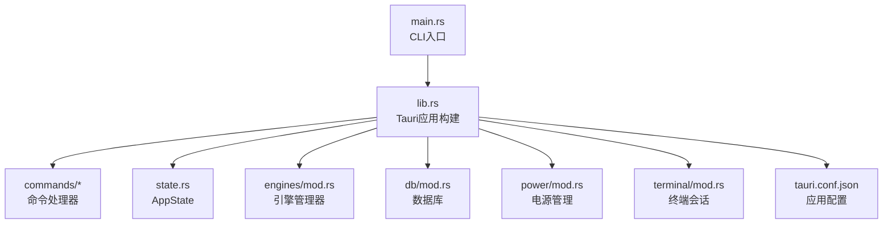
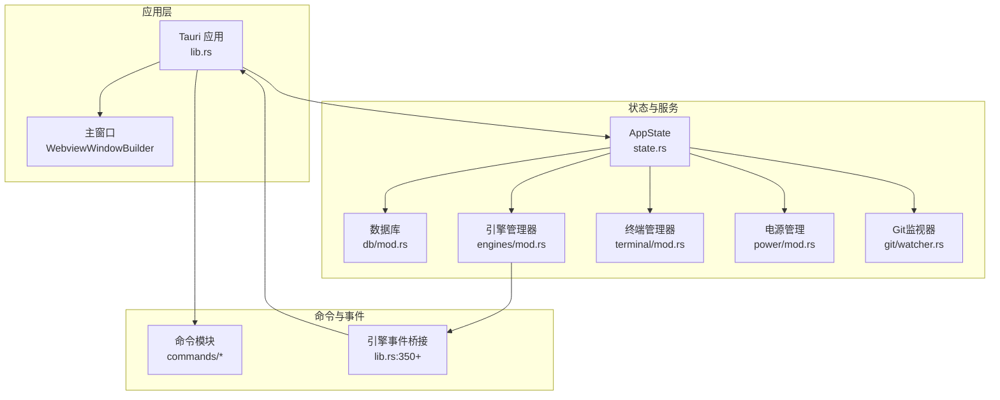
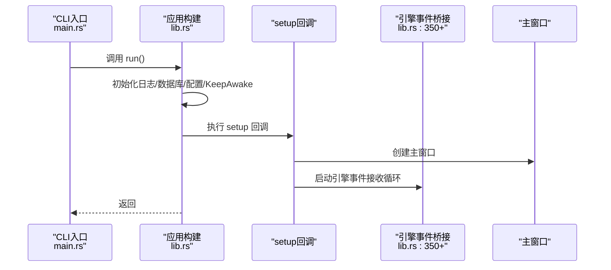
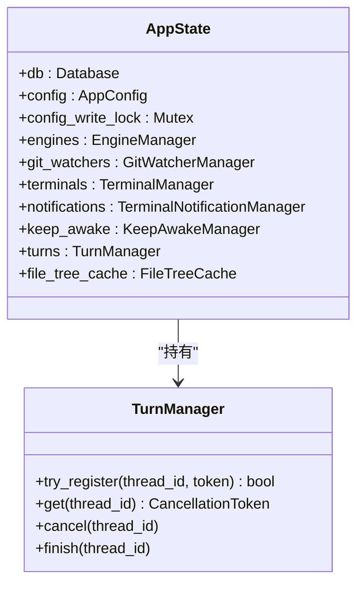
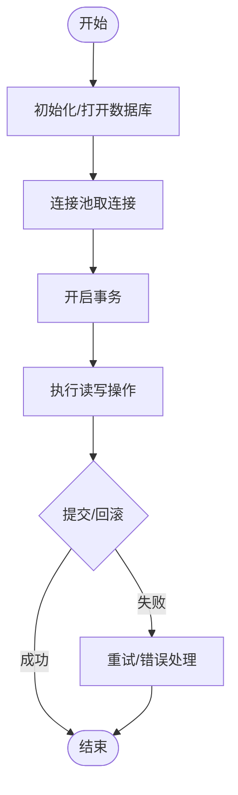
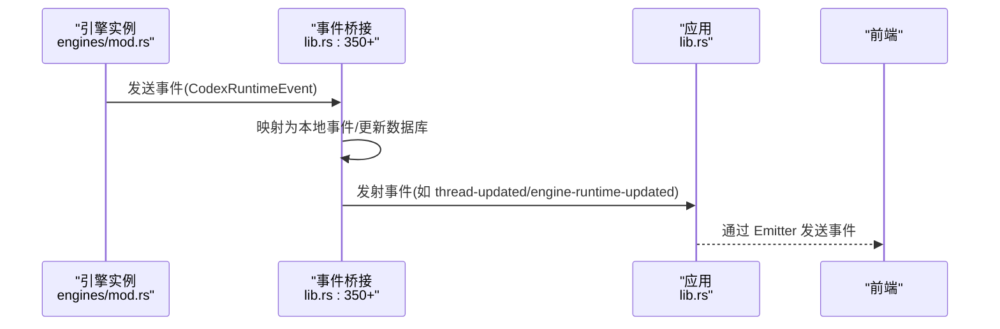
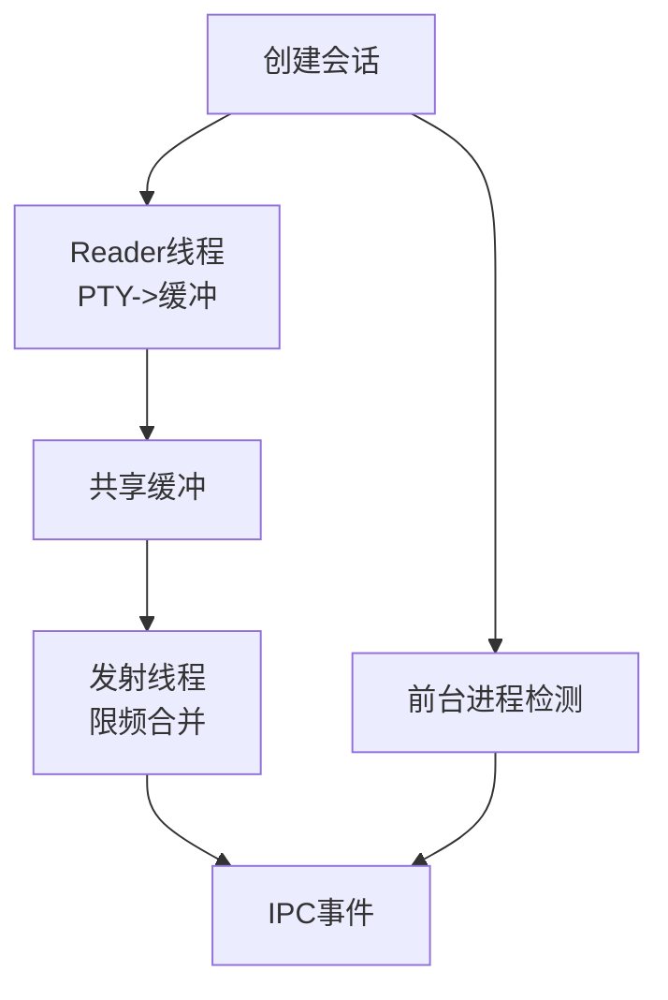
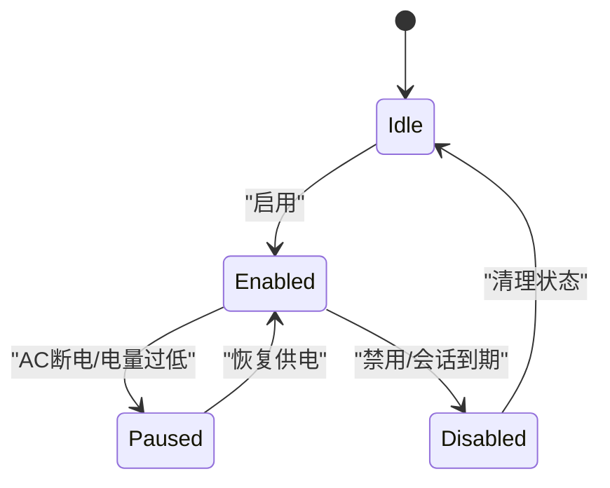
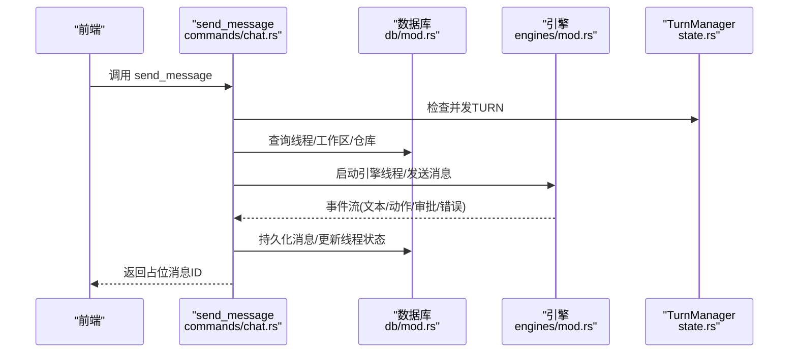
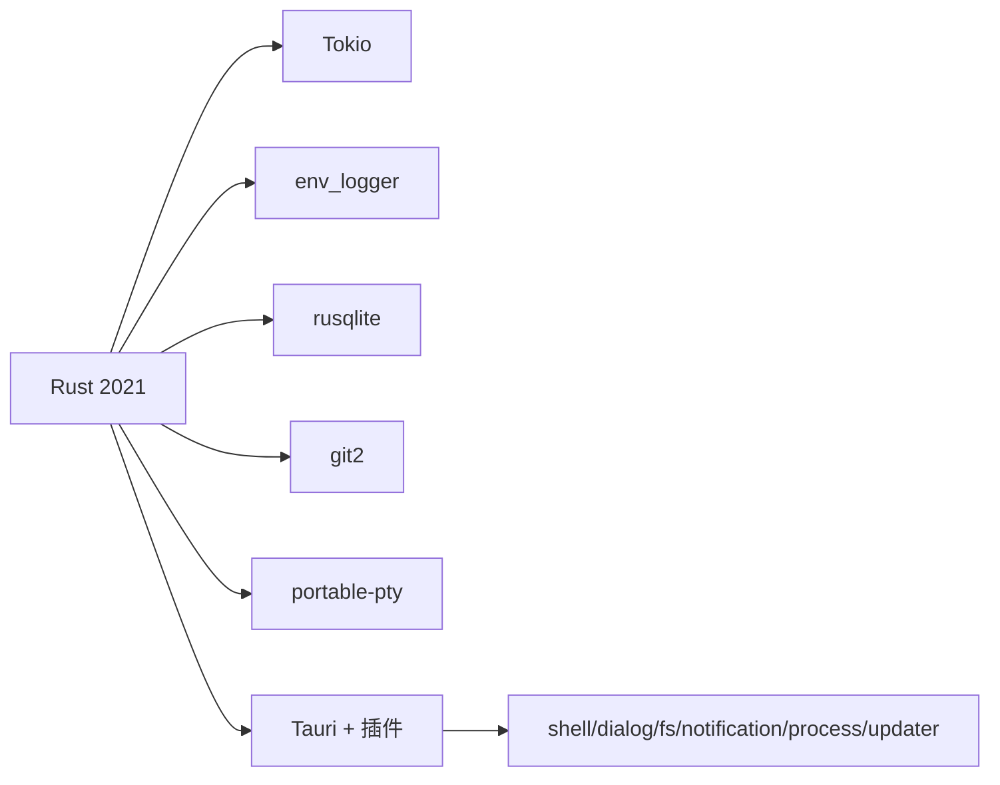

# 后端架构

<cite>
**本文引用的文件**
- [Cargo.toml](file://src-tauri/Cargo.toml)
- [main.rs](file://src-tauri/src/main.rs)
- [lib.rs](file://src-tauri/src/lib.rs)
- [state.rs](file://src-tauri/src/state.rs)
- [mod.rs（命令）](file://src-tauri/src/commands/mod.rs)
- [app.rs（命令）](file://src-tauri/src/commands/app.rs)
- [chat.rs（命令）](file://src-tauri/src/commands/chat.rs)
- [mod.rs（数据库）](file://src-tauri/src/db/mod.rs)
- [mod.rs（引擎）](file://src-tauri/src/engines/mod.rs)
- [codex.rs（引擎实现）](file://src-tauri/src/engines/codex.rs)
- [events.rs（引擎事件）](file://src-tauri/src/engines/events.rs)
- [mod.rs（电源管理）](file://src-tauri/src/power/mod.rs)
- [mod.rs（终端）](file://src-tauri/src/terminal/mod.rs)
- [tauri.conf.json](file://src-tauri/tauri.conf.json)
</cite>

## 目录
1. [引言](#引言)
2. [项目结构](#项目结构)
3. [核心组件](#核心组件)
4. [架构总览](#架构总览)
5. [详细组件分析](#详细组件分析)
6. [依赖关系分析](#依赖关系分析)
7. [性能考虑](#性能考虑)
8. [故障排查指南](#故障排查指南)
9. [结论](#结论)

## 引言
本文件面向 Panes 后端架构，聚焦于基于 Rust + Tauri 的桌面应用后端设计与实现。文档覆盖以下主题：
- 基于 Tokio 的异步运行时与并发模型
- Tauri 命令系统与插件体系
- AppState 状态管理、服务层设计与生命周期管理
- Tauri 插件系统、原生 API 访问与系统集成
- 错误处理策略、日志记录与性能监控
- 关键组件交互流程与架构图示

## 项目结构
后端位于 src-tauri 目录，采用模块化组织：
- 根入口：main.rs 负责 CLI 子命令分发与主程序启动
- 应用构建：lib.rs 完成 Tauri Builder 配置、插件注册、状态注入、命令注册与生命周期事件
- 核心模块：state.rs（状态）、db/mod.rs（数据库）、engines/mod.rs（引擎）、power/mod.rs（电源）、terminal/mod.rs（终端）
- 命令层：src-tauri/src/commands 下按功能划分模块，如 app.rs、chat.rs 等
- 配置：tauri.conf.json 提供窗口、打包与插件配置

图表来源
- [main.rs:1-14](file://src-tauri/src/main.rs#L1-L14)
- [lib.rs:48-340](file://src-tauri/src/lib.rs#L48-L340)
- [state.rs:12-24](file://src-tauri/src/state.rs#L12-L24)
- [mod.rs（命令）:1-12](file://src-tauri/src/commands/mod.rs#L1-L12)
- [mod.rs（数据库）:1-800](file://src-tauri/src/db/mod.rs#L1-L800)
- [mod.rs（引擎）:1-800](file://src-tauri/src/engines/mod.rs#L1-L800)
- [mod.rs（电源管理）:1-800](file://src-tauri/src/power/mod.rs#L1-L800)
- [mod.rs（终端）:1-800](file://src-tauri/src/terminal/mod.rs#L1-L800)
- [tauri.conf.json:1-58](file://src-tauri/tauri.conf.json#L1-L58)

章节来源
- [main.rs:1-14](file://src-tauri/src/main.rs#L1-L14)
- [lib.rs:48-340](file://src-tauri/src/lib.rs#L48-L340)
- [state.rs:12-24](file://src-tauri/src/state.rs#L12-L24)
- [mod.rs（命令）:1-12](file://src-tauri/src/commands/mod.rs#L1-L12)
- [mod.rs（数据库）:1-800](file://src-tauri/src/db/mod.rs#L1-L800)
- [mod.rs（引擎）:1-800](file://src-tauri/src/engines/mod.rs#L1-L800)
- [mod.rs（电源管理）:1-800](file://src-tauri/src/power/mod.rs#L1-L800)
- [mod.rs（终端）:1-800](file://src-tauri/src/terminal/mod.rs#L1-L800)
- [tauri.conf.json:1-58](file://src-tauri/tauri.conf.json#L1-L58)

## 核心组件
- 异步运行时与并发
  - 使用 tokio 工作线程池与异步任务；通过 spawn/spawn_blocking 在阻塞与非阻塞场景间切换
  - 并发同步：tokio::sync::Mutex、tokio::sync::RwLock、tokio_util::sync::CancellationToken
- Tauri 构建与生命周期
  - Builder::default() 注入 AppState、注册插件、设置菜单、窗口与事件监听
  - setup 回调中初始化通知、启动引擎桥接任务、根据平台调整窗口装饰
  - RunEvent::ExitRequested/Exit 触发资源清理（电源、终端）
- 命令系统
  - 通过 generate_handler! 将命令函数暴露给前端；命令内使用 State 获取 AppState
  - 大量命令通过 run_db 封装数据库操作，统一在阻塞任务中执行
- 状态管理（AppState）
  - 聚合数据库、配置、引擎、Git 监视器、终端、通知、保持清醒、会话令牌等
  - TurnManager 用于并发 TURN 控制与取消
- 服务层
  - 数据库：连接池、迁移、模式修复、事务封装
  - 引擎：多引擎抽象（Codex、Claude、OpenCode），统一事件流与权限策略
  - 终端：PTY 会话、输出缓冲与节流、前台进程检测、OSC 通知解析
  - 电源：跨平台保持清醒、电池阈值、会话定时、辅助进程管理

章节来源
- [lib.rs:48-340](file://src-tauri/src/lib.rs#L48-L340)
- [state.rs:12-56](file://src-tauri/src/state.rs#L12-L56)
- [mod.rs（数据库）:1-800](file://src-tauri/src/db/mod.rs#L1-L800)
- [mod.rs（引擎）:1-800](file://src-tauri/src/engines/mod.rs#L1-L800)
- [mod.rs（终端）:1-800](file://src-tauri/src/terminal/mod.rs#L1-L800)
- [mod.rs（电源管理）:1-800](file://src-tauri/src/power/mod.rs#L1-L800)

## 架构总览
下图展示后端核心组件与交互关系：

图表来源
- [lib.rs:48-340](file://src-tauri/src/lib.rs#L48-L340)
- [state.rs:12-24](file://src-tauri/src/state.rs#L12-L24)
- [mod.rs（数据库）:1-800](file://src-tauri/src/db/mod.rs#L1-L800)
- [mod.rs（引擎）:1-800](file://src-tauri/src/engines/mod.rs#L1-L800)
- [mod.rs（终端）:1-800](file://src-tauri/src/terminal/mod.rs#L1-L800)
- [mod.rs（电源管理）:1-800](file://src-tauri/src/power/mod.rs#L1-L800)

## 详细组件分析

### 命令系统与生命周期
- 入口与启动
  - main.rs 调用 agent_workspace_lib::maybe_handle_cli_subcommand，若无 CLI 则 run()
  - lib.rs::run 初始化日志、数据库、配置、Keep Awake、默认工作区
  - 构建 Tauri 应用：注册插件、注入 AppState、设置菜单、窗口、setup 回调
- 生命周期事件
  - setup：创建主窗口、设置图标、启动通知接收、启动引擎桥接任务、注册菜单事件
  - RunEvent::ExitRequested/Exit：释放 Keep Awake、关闭终端会话
- 命令注册
  - 通过 generate_handler! 注册所有命令，覆盖 app、chat、engines、files、git、power、setup、terminal、threads、workspace 等模块

图表来源
- [main.rs:1-14](file://src-tauri/src/main.rs#L1-L14)
- [lib.rs:48-340](file://src-tauri/src/lib.rs#L48-L340)

章节来源
- [main.rs:1-14](file://src-tauri/src/main.rs#L1-L14)
- [lib.rs:48-340](file://src-tauri/src/lib.rs#L48-L340)

### AppState 状态管理
- 结构组成
  - db、config、config_write_lock、engines、git_watchers、terminals、notifications、keep_awake、turns、file_tree_cache
- 并发控制
  - config_write_lock：全局写锁，确保配置变更串行化
  - turns：基于 RwLock 的并发 TURN 注册、取消与完成
- 生命周期
  - 构造于 lib.rs::run，随应用启动注入；在退出事件中释放资源

图表来源
- [state.rs:12-56](file://src-tauri/src/state.rs#L12-L56)

章节来源
- [state.rs:12-56](file://src-tauri/src/state.rs#L12-L56)

### 数据库层设计
- 连接池
  - 最大空闲连接数限制，连接复用与回收
  - 每次取连接时尝试从空闲队列取出，否则新建并配置 PRAGMA
- 迁移与模式修复
  - 初始化迁移、归档字段、Git 字段、运行时字段、消息审计字段
  - 路径归一化与重复项合并（工作区、仓库）
- 事务与一致性
  - 命令中大量使用事务包裹，保证数据一致性
- 访问模式
  - run_db 封装阻塞式数据库操作，避免阻塞异步运行时

图表来源
- [mod.rs（数据库）:74-135](file://src-tauri/src/db/mod.rs#L74-L135)
- [mod.rs（数据库）:253-400](file://src-tauri/src/db/mod.rs#L253-L400)

章节来源
- [mod.rs（数据库）:1-800](file://src-tauri/src/db/mod.rs#L1-L800)

### 引擎服务层与事件桥接
- 引擎抽象
  - Engine trait 定义线程生命周期、消息发送、中断、归档/恢复等
  - EngineManager 统一管理多个引擎实例，提供健康检查、预热、目录列表等能力
- 事件桥接
  - lib.rs 中 run_codex_runtime_bridge 接收引擎广播事件，映射为应用事件并发射到前端
  - 支持 Approval 解决、线程状态/名称/快照更新、归档/恢复等
- 附件与输入
  - 命令层对附件大小、类型进行校验与预处理，支持图片粘贴与预览

图表来源
- [mod.rs（引擎）:463-794](file://src-tauri/src/engines/mod.rs#L463-L794)
- [lib.rs:350-511](file://src-tauri/src/lib.rs#L350-L511)

章节来源
- [mod.rs（引擎）:1-800](file://src-tauri/src/engines/mod.rs#L1-L800)
- [lib.rs:350-511](file://src-tauri/src/lib.rs#L350-L511)

### 终端会话与输出节流
- 会话管理
  - TerminalManager 维护工作区内的会话集合，支持创建、写入、调整大小、关闭、批量关闭
  - 会话句柄包含元信息、IO计数器、重放快照、进程句柄
- 输出节流与前台检测
  - 读者线程持续从 PTY 读取，写入共享缓冲；发射线程以固定频率合并与限流输出
  - 周期性检测前台进程，上报前台变化事件
- 完整重放
  - 会话结束后保留有限数量的重放快照，支持后续恢复

图表来源
- [mod.rs（终端）:319-543](file://src-tauri/src/terminal/mod.rs#L319-L543)
- [mod.rs（终端）:622-800](file://src-tauri/src/terminal/mod.rs#L622-L800)

章节来源
- [mod.rs（终端）:1-800](file://src-tauri/src/terminal/mod.rs#L1-L800)

### 电源管理与系统集成
- KeepAwakeManager
  - 跨平台保持系统/显示器唤醒，支持 AC 仅模式、关闭显示器睡眠、屏幕保护阻止
  - 电池阈值与会话定时触发暂停/禁用
  - 辅助进程管理与状态持久化，支持重启后回收
- 事件驱动
  - 电源监控任务周期轮询，响应 AC 状态变化、电量阈值、会话到期事件

图表来源
- [mod.rs（电源管理）:199-635](file://src-tauri/src/power/mod.rs#L199-L635)

章节来源
- [mod.rs（电源管理）:1-800](file://src-tauri/src/power/mod.rs#L1-L800)

### 命令层示例：聊天与附件
- send_message 命令
  - 校验并发 TURN、解析引擎模型与推理努力、构建沙箱策略
  - 写入用户消息占位、启动引擎线程、异步处理事件流
- 附件处理
  - 保存粘贴图片、生成预览、限制大小与类型

图表来源
- [chat.rs:384-762](file://src-tauri/src/commands/chat.rs#L384-L762)
- [state.rs:31-55](file://src-tauri/src/state.rs#L31-L55)
- [mod.rs（数据库）:1-800](file://src-tauri/src/db/mod.rs#L1-L800)
- [mod.rs（引擎）:795-800](file://src-tauri/src/engines/mod.rs#L795-L800)

章节来源
- [chat.rs:1-800](file://src-tauri/src/commands/chat.rs#L1-L800)
- [state.rs:31-55](file://src-tauri/src/state.rs#L31-L55)
- [mod.rs（数据库）:1-800](file://src-tauri/src/db/mod.rs#L1-L800)
- [mod.rs（引擎）:795-800](file://src-tauri/src/engines/mod.rs#L795-L800)

## 依赖关系分析
- 语言与运行时
  - Rust 2021 edition，Tokio 异步运行时，env_logger 日志
- 外部依赖
  - Tauri 及插件：shell、dialog、fs、notification、process、updater
  - 数据库：rusqlite（含捆绑 OpenSSL）、事务与 WAL
  - Git：git2（含 vendored-openssl）
  - 终端：portable-pty
  - 引擎：Claude Code Rust 集成
- 特性开关
  - custom-protocol 默认启用
  - non-native-harnesses 可选特性

图表来源
- [Cargo.toml:15-50](file://src-tauri/Cargo.toml#L15-L50)

章节来源
- [Cargo.toml:1-67](file://src-tauri/Cargo.toml#L1-L67)

## 性能考虑
- 数据库
  - WAL 模式、同步级别、busy 超时、外键约束启用
  - 连接池最大空闲数限制，减少连接开销
- 终端
  - 输出缓冲与限频发射，避免高频 IPC 导致 UI 卡顿
  - 前台进程检测去抖，降低无效事件
- 引擎
  - 事件流节流与块级持久化，避免频繁 IO
  - 超时控制与重试策略，提升稳定性
- 配置
  - 通过配置项控制加速渲染与通知行为，平衡体验与资源占用

## 故障排查指南
- 日志
  - env_logger 初始化于 lib.rs::run；常见警告包括数据库迁移失败、Keep Awake 辅助进程异常、终端会话关闭失败
- 常见问题定位
  - 数据库：检查迁移是否成功、路径归一化是否正确、事务是否被意外回滚
  - 引擎：确认引擎可用性与健康报告、事件订阅是否正常、超时与重试
  - 终端：检查 PTY 读取与发射线程状态、前台进程检测结果
  - 电源：关注 AC 状态变化、电池阈值触发、会话定时器
- 清理与恢复
  - 应用退出时主动释放 Keep Awake 与关闭终端会话
  - Keep Awake 状态持久化与回收，避免僵尸进程

章节来源
- [lib.rs:48-340](file://src-tauri/src/lib.rs#L48-L340)
- [mod.rs（电源管理）:683-685](file://src-tauri/src/power/mod.rs#L683-L685)
- [mod.rs（终端）:515-543](file://src-tauri/src/terminal/mod.rs#L515-L543)

## 结论
Panes 后端以 Rust + Tauri 为基础，结合 Tokio 异步运行时与模块化架构，实现了稳定的状态管理、健壮的服务层与丰富的系统集成能力。通过命令系统与插件体系，后端为前端提供了统一的 API 与事件通道；通过数据库、引擎、终端与电源管理的协同，满足了复杂桌面应用的性能与可靠性要求。