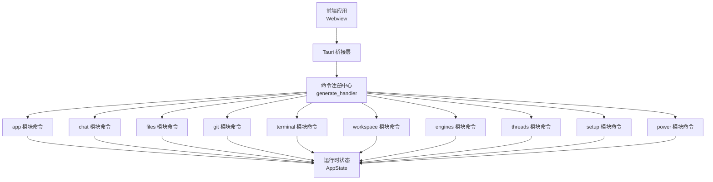
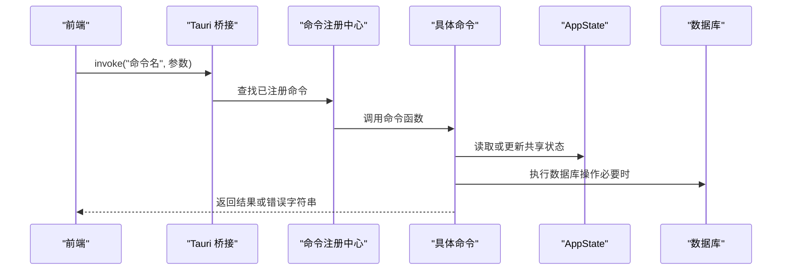
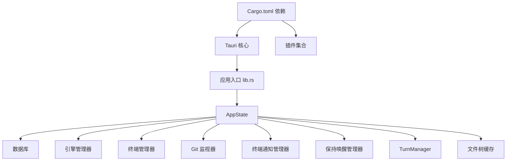

# 命令系统

<cite>
**本文档引用的文件**
- [src-tauri/src/lib.rs](file://src-tauri/src/lib.rs)
- [src-tauri/src/main.rs](file://src-tauri/src/main.rs)
- [src-tauri/Cargo.toml](file://src-tauri/Cargo.toml)
- [src-tauri/tauri.conf.json](file://src-tauri/tauri.conf.json)
- [src-tauri/src/commands/mod.rs](file://src-tauri/src/commands/mod.rs)
- [src-tauri/src/commands/app.rs](file://src-tauri/src/commands/app.rs)
- [src-tauri/src/commands/chat.rs](file://src-tauri/src/commands/chat.rs)
- [src-tauri/src/commands/files.rs](file://src-tauri/src/commands/files.rs)
- [src-tauri/src/commands/git.rs](file://src-tauri/src/commands/git.rs)
- [src-tauri/src/commands/terminal.rs](file://src-tauri/src/commands/terminal.rs)
- [src-tauri/src/commands/workspace.rs](file://src-tauri/src/commands/workspace.rs)
- [src-tauri/src/commands/engines.rs](file://src-tauri/src/commands/engines.rs)
- [src-tauri/src/commands/threads.rs](file://src-tauri/src/commands/threads.rs)
- [src-tauri/src/commands/setup.rs](file://src-tauri/src/commands/setup.rs)
- [src-tauri/src/commands/power.rs](file://src-tauri/src/commands/power.rs)
</cite>

## 目录
1. [简介](#简介)
2. [项目结构](#项目结构)
3. [核心组件](#核心组件)
4. [架构总览](#架构总览)
5. [详细组件分析](#详细组件分析)
6. [依赖关系分析](#依赖关系分析)
7. [性能考虑](#性能考虑)
8. [故障排查指南](#故障排查指南)
9. [结论](#结论)
10. [附录](#附录)

## 简介
本文件系统性梳理 Panes 基于 Tauri 的命令系统，覆盖命令注册与调用机制、参数校验、返回值处理、权限控制、异步处理与错误传播，并对各命令模块（app、chat、files、git、terminal、workspace、engines、threads、setup、power）进行职责与实现细节说明。同时提供测试策略与调试方法、命令调用示例与参数格式说明，帮助开发者快速理解与扩展命令系统。

## 项目结构
- 前端通过 Tauri 桥接调用后端 Rust 命令；后端在构建阶段集中注册所有命令，统一暴露给前端。
- 命令按功能域划分到独立模块：app、chat、files、git、terminal、workspace、engines、threads、setup、power。
- 核心运行时负责初始化数据库、配置、引擎管理器、终端管理器等，并在应用启动时完成菜单、窗口、插件与事件桥接。

图表来源
- [src-tauri/src/lib.rs:181-322](file://src-tauri/src/lib.rs#L181-L322)

章节来源
- [src-tauri/src/lib.rs:49-339](file://src-tauri/src/lib.rs#L49-L339)
- [src-tauri/src/main.rs:1-14](file://src-tauri/src/main.rs#L1-L14)
- [src-tauri/src/commands/mod.rs:1-12](file://src-tauri/src/commands/mod.rs#L1-L12)

## 核心组件
- 命令注册与调用
  - 后端在应用启动时通过 generate_handler 将所有命令一次性注册到 Tauri 桥接层，前端以 invoke 方式调用。
  - 命令签名统一使用 #[tauri::command] 宏，支持异步执行与 State 注入。
- 异步与并发
  - 大多数命令通过 tokio::task::spawn_blocking 执行阻塞操作（文件系统、进程、数据库），避免阻塞事件循环。
  - 使用 State 共享全局状态（数据库、引擎、终端、通知、电源等）。
- 错误处理
  - 统一将错误转换为字符串返回，前端接收字符串错误信息；部分内部错误通过 anyhow 聚合并在外部转换为可读字符串。
- 权限与信任
  - 文件写入、重命名、删除等操作会检查仓库信任级别（TrustLevel），限制受限仓库的直接修改。
  - Git 工作树与远程仓库管理包含参数校验与安全路径解析。
- 参数校验与返回值
  - 多数命令对输入参数进行严格校验（如路径存在性、范围限制、模型 ID 支持性等），返回标准化 DTO 或布尔值。

章节来源
- [src-tauri/src/lib.rs:181-322](file://src-tauri/src/lib.rs#L181-L322)
- [src-tauri/src/commands/files.rs:67-106](file://src-tauri/src/commands/files.rs#L67-L106)
- [src-tauri/src/commands/git.rs:362-399](file://src-tauri/src/commands/git.rs#L362-L399)

## 架构总览
下图展示命令系统在应用生命周期中的位置与交互：

图表来源
- [src-tauri/src/lib.rs:181-322](file://src-tauri/src/lib.rs#L181-L322)

章节来源
- [src-tauri/src/lib.rs:49-339](file://src-tauri/src/lib.rs#L49-L339)

## 详细组件分析

### app 模块
- 职责
  - 应用语言环境设置与查询、终端渲染加速开关、通知设置与预览、桌面通知发送。
- 关键命令
  - get/set_app_locale：查询/设置应用语言，支持归一化与持久化。
  - get/set_terminal_accelerated_rendering：查询/设置终端硬件加速渲染。
  - get/set_chat_notifications_enabled、set_terminal_notifications_enabled：启用/禁用聊天与终端通知。
  - install_terminal_notification_integration_command：安装终端通知集成。
  - set_notification_sound、preview_notification_sound：设置通知声音与跨平台预览。
  - show_agent_notification：发送桌面通知。
- 实现要点
  - 大量使用 tokio::task::spawn_blocking 访问配置文件与系统能力。
  - macOS 平台使用 afplay 预览声音，其他平台通过系统通知插件预览。
  - 通知声音路径解析与安全校验，防止无效或越权路径。

章节来源
- [src-tauri/src/commands/app.rs:128-292](file://src-tauri/src/commands/app.rs#L128-L292)

### chat 模块
- 职责
  - 聊天消息发送、附件处理、Codex 评审、消息检索与窗口化读取、动作输出与审批流程。
- 关键命令
  - save_pasted_image_attachment：粘贴图片保存为附件，含 MIME 类型与大小校验。
  - read_attachment_preview：读取附件预览（Base64）。
  - send_message：构建 TurnInput、校验附件与模型、解析沙箱策略、创建/恢复线程、异步流式输出。
  - start_codex_review：发起 Codex 本地评审，支持多种目标类型与交付方式。
  - cancel_turn、respond_to_approval、get_thread_messages、get_message_blocks 等。
- 实现要点
  - 严格的消息窗口限制与流式事件合并策略，避免过度刷新。
  - 附件类型与大小限制、图像格式映射与预览生成。
  - 沙箱模式与信任级别联动，工作区写入确认与多仓库场景校验。
  - 异步任务与取消令牌配合，TurnManager 管理并发。

章节来源
- [src-tauri/src/commands/chat.rs:212-762](file://src-tauri/src/commands/chat.rs#L212-L762)

### files 模块
- 职责
  - 文件系统操作：目录列表、文件读写、创建、重命名、删除、打开与定位。
- 关键命令
  - list_dir、read_file、write_file、create_file、create_dir、rename_path、delete_path。
  - reveal_path、open_path_with_default_app：跨平台打开/定位文件。
  - resolve_editor_file_reference：解析编辑器文件引用（含行号列号）。
- 实现要点
  - 写入前检查仓库信任级别，受限仓库禁止直接写入。
  - 路径规范化与符号链接安全校验，防止路径穿越。
  - 跨平台命令计划构建（macOS 使用 open，Windows 使用 explorer/cmd，Linux 使用 xdg-open/gio）。

章节来源
- [src-tauri/src/commands/files.rs:18-266](file://src-tauri/src/commands/files.rs#L18-L266)

### git 模块
- 职责
  - Git 仓库状态、差异、分支、提交、stash、远程仓库、工作树管理与仓库监听。
- 关键命令
  - get_git_status、get_file_diff、get_git_file_compare、stage/unstage/discard_files、commit、fetch/pull/push。
  - list_git_branches、checkout/rename/delete/create_git_branch、list_git_commits、get_commit_diff。
  - list_git_stashes、push/apply/pop_git_stash。
  - add/list/remove/rename_git_remote、init_git_repo。
  - watch_git_repo：文件树缓存失效与 git-repo-changed 事件广播。
  - add/list/remove/prune_git_worktree 及 .gitignore 确保逻辑。
- 实现要点
  - 分支名与远程名严格校验，避免非法字符。
  - 仓库初始化支持仅校验模式，减少副作用。
  - 事件驱动的文件树缓存失效，保证 UI 一致性。

章节来源
- [src-tauri/src/commands/git.rs:15-559](file://src-tauri/src/commands/git.rs#L15-L559)

### terminal 模块
- 职责
  - 终端会话生命周期管理、输入输出、渲染诊断、通知管理与焦点控制。
- 关键命令
  - terminal_create_session：校验工作区根路径与 CWD，创建会话。
  - terminal_write/write_bytes/resize/close/close_workspace/list/sessions。
  - terminal_get_renderer_diagnostics、terminal_resume_session、terminal_drain_output。
  - terminal_list_notifications、terminal_clear_notification、terminal_set_notification_focus。
- 实现要点
  - CWD 必须位于工作区根内，防止越权访问。
  - 通知清理与会话关闭联动，避免资源泄漏。
  - 输出拉取带字节上限保护，防止内存暴涨。

章节来源
- [src-tauri/src/commands/terminal.rs:25-294](file://src-tauri/src/commands/terminal.rs#L25-L294)

### workspace 模块
- 职责
  - 工作区打开与扫描、仓库管理、信任级别与活动状态、启动预设序列化与导入导出、文件树与搜索。
- 关键命令
  - open_workspace：扫描仓库、同步到数据库、设置选择状态。
  - list/get/set_repo_trust_level、set_repo_git_active、set_workspace_git_active_repos。
  - has_workspace_git_selection、archive/restore/delete_workspace。
  - get_workspace_startup_preset/normalize/serialize/parse/set/clear/export。
  - list_workspace_dirs、get_workspace_file_tree_page/search_workspace_files。
- 实现要点
  - 扫描深度范围校验（0-12），默认 0。
  - 启动预设解析与序列化，支持多种格式。
  - 文件树页面与搜索支持缓存刷新。

章节来源
- [src-tauri/src/commands/workspace.rs:33-384](file://src-tauri/src/commands/workspace.rs#L33-L384)

### engines 模块
- 职责
  - 引擎列表、健康检查、预热、Codex 技能与应用、OpenCode 运行时目录、引擎检查命令执行。
- 关键命令
  - list_engines、engine_health、prewarm_engine。
  - list_codex_skills、list_codex_apps、get_opencode_runtime_catalog。
  - run_engine_check：允许的检查命令白名单校验后执行。
- 实现要点
  - 检查命令在子进程中执行，捕获 stdout/stderr 并截断超长输出。
  - 跨平台 Shell 构建（Windows 使用 cmd /C，类 Unix 使用登录壳与 PATH 增强）。

章节来源
- [src-tauri/src/commands/engines.rs:18-162](file://src-tauri/src/commands/engines.rs#L18-L162)

### threads 模块
- 职责
  - 线程列表与归档、远端 Codex/OpenCode 会话挂载与同步、线程创建与重命名、工作区写入确认、推理效率与服务等级设置。
- 关键命令
  - list_threads、list_archived_threads、list_codex_remote_threads、attach_codex_remote_thread。
  - list_opencode_remote_sessions、attach_opencode_remote_session。
  - create_thread、rename_thread、confirm_workspace_thread、set_thread_reasoning_effort、set_thread_execution_policy、set_thread_codex_config、set_thread_opencode_config。
  - archive/restore/delete_thread、sync_thread_from_engine、fork/rollback/compact_codex_thread。
- 实现要点
  - 远端会话与本地线程映射，状态与元数据同步。
  - 工作区线程写入确认需满足多仓库场景与信任级别要求。
  - 推理效率与服务等级仅对 Codex 生效。

章节来源
- [src-tauri/src/commands/threads.rs:32-800](file://src-tauri/src/commands/threads.rs#L32-L800)

### setup 模块
- 职责
  - 依赖检测（Node/Git/Codex）、包管理器识别、自动安装（Homebrew/npm 等）与进度事件。
- 关键命令
  - check_dependencies：并行检测依赖状态与可用安装方法。
  - install_dependency：根据依赖与方法组合执行安装，实时发射进度事件。
- 实现要点
  - 登录壳探测与 PATH 增强，提升检测准确性。
  - 子进程标准流异步读取，边安装边上报进度。

章节来源
- [src-tauri/src/commands/setup.rs:20-291](file://src-tauri/src/commands/setup.rs#L20-L291)

### power 模块
- 职责
  - 保持唤醒状态查询与设置、电源配置读取与持久化、macOS 助手状态与注册。
- 关键命令
  - get_keep_awake_state、set_keep_awake_enabled、get_power_settings、set_power_settings。
  - get_helper_status、register_keep_awake_helper。
- 实现要点
  - 设置变更先应用到运行时再持久化，失败时回滚运行时状态。
  - 电池阈值与会话时长参数范围校验。

章节来源
- [src-tauri/src/commands/power.rs:58-200](file://src-tauri/src/commands/power.rs#L58-L200)

## 依赖关系分析
- 插件与能力
  - 后端启用 tauri-plugin-shell、dialog、fs、notification、updater、process 等插件，为命令提供系统级能力。
  - Cargo.toml 显式声明 tokio、futures、serde、rusqlite、git2、notify、portable-pty 等依赖。
- 运行时状态
  - AppState 管理数据库、引擎、Git 监视器、终端、通知、电源、TurnManager、文件树缓存等，命令通过 State 注入共享。
- 命令注册
  - 通过 generate_handler 在启动时集中注册，确保命令名唯一且类型安全。

图表来源
- [src-tauri/Cargo.toml:15-54](file://src-tauri/Cargo.toml#L15-L54)
- [src-tauri/src/lib.rs:85-96](file://src-tauri/src/lib.rs#L85-L96)

章节来源
- [src-tauri/Cargo.toml:15-54](file://src-tauri/Cargo.toml#L15-L54)
- [src-tauri/src/lib.rs:85-96](file://src-tauri/src/lib.rs#L85-L96)

## 性能考虑
- 异步与阻塞分离
  - 文件系统、数据库、进程调用均通过 spawn_blocking 执行，避免阻塞主线程。
- 流式事件合并
  - 聊天模块对流式事件进行合并与定时刷新，降低 UI 刷新频率。
- 缓存与增量更新
  - Git 文件树缓存与失效策略，工作区文件树分页与搜索支持刷新。
- 输出拉取上限
  - 终端 drain_output 对目标字节数进行上限保护，防止内存压力。

章节来源
- [src-tauri/src/commands/chat.rs:33-41](file://src-tauri/src/commands/chat.rs#L33-L41)
- [src-tauri/src/commands/terminal.rs:204-216](file://src-tauri/src/commands/terminal.rs#L204-L216)

## 故障排查指南
- 常见错误来源
  - 路径越权：文件操作前进行路径规范化与符号链接校验，避免访问非仓库根路径。
  - 信任级别限制：受限仓库禁止直接写入，需先调整信任级别。
  - 参数校验失败：分支名、远程名、模型 ID、推理效率等参数需符合规范。
  - 引擎检查命令未授权：仅允许白名单内的检查命令执行。
- 调试建议
  - 启用日志：应用启动时初始化 env_logger，关注 warn/info 级别日志。
  - 事件桥接：Codex 运行时事件通过广播通道传递，注意 lagged 事件提示。
  - 进度事件：setup 安装过程通过“setup-install-progress”事件上报，便于前端可视化。
- 回滚策略
  - 电源设置与保持唤醒：设置失败时回滚运行时状态，确保磁盘与运行时一致。

章节来源
- [src-tauri/src/lib.rs:350-511](file://src-tauri/src/lib.rs#L350-L511)
- [src-tauri/src/commands/setup.rs:184-291](file://src-tauri/src/commands/setup.rs#L184-L291)
- [src-tauri/src/commands/power.rs:166-196](file://src-tauri/src/commands/power.rs#L166-L196)

## 结论
Panes 命令系统以 Tauri 为核心，采用集中注册与异步执行相结合的方式，围绕 AppState 提供统一的状态访问与并发控制。各模块职责清晰，参数校验严格，错误传播统一，具备良好的可维护性与扩展性。通过缓存、流式事件合并与输出上限等优化，兼顾性能与用户体验。

## 附录

### 命令调用示例与参数格式
以下示例展示常见命令的调用思路与参数要点（不包含具体代码内容）：
- app
  - set_app_locale(locale: string) → string
  - set_terminal_accelerated_rendering(enabled: boolean) → boolean
  - set_chat_notifications_enabled(enabled: boolean) → boolean
  - set_terminal_notifications_enabled(enabled: boolean) → boolean
  - install_terminal_notification_integration_command(integration: string) → AgentNotificationSettingsStatusDto
  - set_notification_sound(sound: string) → string
  - preview_notification_sound(sound: string) → void
  - show_agent_notification(title: string, body: string) → void
- chat
  - save_pasted_image_attachment(fileName: string, mimeType: string, dataBase64: string) → ChatAttachmentPayload
  - read_attachment_preview(filePath: string, mimeType?: string) → AttachmentPreviewPayload?
  - sendMessage(threadId: string, message: string, modelId?: string, reasoningEffort?: string, attachments?: ChatAttachmentPayload[], inputItems?: ChatInputItemPayload[], planMode?: boolean, clientTurnId?: string) → string
  - startCodexReview(threadId: string, target: CodexReviewTargetPayload, delivery?: CodexReviewDeliveryPayload) → ThreadDto
- files
  - listDir(repoPath: string, dirPath: string) → FileTreeEntryDto[]
  - readFile(repoPath: string, filePath: string) → ReadFileResultDto
  - writeFile(repoPath: string, filePath: string, content: string, workspaceId?: string) → void
  - createFile(repoPath: string, filePath: string, workspaceId?: string) → void
  - createDir(repoPath: string, dirPath: string, workspaceId?: string) → void
  - renamePath(repoPath: string, oldPath: string, newName: string, workspaceId?: string) → void
  - deletePath(repoPath: string, filePath: string, workspaceId?: string) → void
  - revealPath(path: string) → void
  - openPathWithDefaultApp(path: string) → void
  - resolveEditorFileReference(workspaceId: string, rawReference: string, preferredRepoPath?: string, currentCwd?: string) → ResolvedEditorFileReferenceDto?
- git
  - getGitStatus(repoPath: string) → GitStatusDto
  - getFileDiff(repoPath: string, filePath: string, staged: boolean) → GitDiffPreviewDto
  - getGitFileCompare(repoPath: string, filePath: string, source: string) → GitFileCompareDto
  - stageFiles(repoPath: string, files: string[]) → void
  - unstageFiles(repoPath: string, files: string[]) → void
  - discardFiles(repoPath: string, files: string[]) → void
  - commit(repoPath: string, message: string) → string
  - softResetLastCommit(repoPath: string) → void
  - fetchGit(repoPath: string) → void
  - pullGit(repoPath: string) → void
  - pushGit(repoPath: string) → void
  - listGitBranches(repoPath: string, scope: string, offset?: number, limit?: number, search?: string) → GitBranchPageDto
  - checkoutGitBranch(repoPath: string, branchName: string, isRemote: boolean) → void
  - createGitBranch(repoPath: string, branchName: string, fromRef?: string) → void
  - renameGitBranch(repoPath: string, oldName: string, newName: string) → void
  - deleteGitBranch(repoPath: string, branchName: string, force: boolean) → void
  - listGitCommits(repoPath: string, offset?: number, limit?: number) → GitCommitPageDto
  - listGitStashes(repoPath: string) → GitStashDto[]
  - pushGitStash(repoPath: string, message?: string) → void
  - applyGitStash(repoPath: string, stashIndex: number) → void
  - popGitStash(repoPath: string, stashIndex: number) → void
  - getCommitDiff(repoPath: string, commitHash: string) → GitDiffPreviewDto
  - getFileTree(repoPath: string) → FileTreeEntryDto[]
  - getFileTreePage(repoPath: string, offset?: number, limit?: number) → FileTreePageDto
  - addGitWorktree(repoPath: string, worktreePath: string, branchName: string, baseRef?: string) → GitWorktreeDto
  - listGitWorktrees(repoPath: string) → GitWorktreeDto[]
  - removeGitWorktree(repoPath: string, worktreePath: string, force: boolean, branchName?: string, deleteBranch: boolean) → void
  - pruneGitWorktrees(repoPath: string) → void
  - initGitRepo(repoPath: string, validateOnly?: boolean) → GitInitRepoStatusDto
  - listGitRemotes(repoPath: string) → GitRemoteDto[]
  - addGitRemote(repoPath: string, name: string, url: string) → void
  - removeGitRemote(repoPath: string, name: string) → void
  - renameGitRemote(repoPath: string, oldName: string, newName: string) → void
  - watchGitRepo(repoPath: string) → void
- terminal
  - terminalCreateSession(workspaceId: string, cols: number, rows: number, cwd?: string) → TerminalSessionDto
  - terminalWrite(workspaceId: string, sessionId: string, data: string) → void
  - terminalWriteBytes(workspaceId: string, sessionId: string, data: number[]) → void
  - terminalResize(workspaceId: string, sessionId: string, cols: number, rows: number, pixelWidth: number, pixelHeight: number) → void
  - terminalCloseSession(workspaceId: string, sessionId: string) → void
  - terminalCloseWorkspaceSessions(workspaceId: string) → void
  - terminalListSessions(workspaceId: string) → TerminalSessionDto[]
  - terminalGetRendererDiagnostics(workspaceId: string, sessionId: string) → TerminalRendererDiagnosticsDto
  - terminalResumeSession(workspaceId: string, sessionId: string, fromSeq?: number) → TerminalResumeSessionDto
  - terminalDrainOutput(workspaceId: string, sessionId: string, fromSeq?: number, targetBytes: number) → TerminalResumeSessionDto
  - terminalListNotifications(workspaceId: string) → TerminalNotificationDto[]
  - terminalClearNotification(workspaceId: string, sessionId?: string) → void
  - terminalSetNotificationFocus(workspaceId?: string, sessionId?: string, windowFocused: boolean) → void
- workspace
  - openWorkspace(path: string, scanDepth?: number) → WorkspaceDto
  - listWorkspaces() → WorkspaceDto[]
  - listArchivedWorkspaces() → WorkspaceDto[]
  - getRepos(workspaceId: string) → RepoDto[]
  - setRepoTrustLevel(repoId: string, trustLevel: TrustLevelDto) → void
  - setRepoGitActive(repoId: string, isActive: boolean) → void
  - setWorkspaceGitActiveRepos(workspaceId: string, repoIds: string[]) → void
  - hasWorkspaceGitSelection(workspaceId: string) → WorkspaceGitSelectionStatusDto
  - archiveWorkspace(workspaceId: string) → void
  - restoreWorkspace(workspaceId: string) → WorkspaceDto
  - deleteWorkspace(workspaceId: string) → void
  - getWorkspaceStartupPreset(workspaceId: string) → WorkspaceStartupPreset?
  - normalizeWorkspaceStartupPreset(workspaceId: string, preset: WorkspaceStartupPreset) → WorkspaceStartupPreset
  - serializeWorkspaceStartupPreset(workspaceId: string, preset: WorkspaceStartupPreset, format: WorkspaceStartupPresetFormat) → string
  - normalizeWorkspaceStartupPresetRaw(workspaceId: string, format: WorkspaceStartupPresetFormat, rawText: string) → WorkspaceStartupPreset
  - setWorkspaceStartupPreset(workspaceId: string, preset: WorkspaceStartupPreset) → WorkspaceStartupPreset
  - setWorkspaceStartupPresetRaw(workspaceId: string, format: WorkspaceStartupPresetFormat, rawText: string) → WorkspaceStartupPreset
  - clearWorkspaceStartupPreset(workspaceId: string) → void
  - exportWorkspaceStartupPreset(workspaceId: string, format: WorkspaceStartupPresetFormat) → string
  - listWorkspaceDirs(workspaceId: string, dirPath?: string) → FileTreeEntryDto[]
  - getWorkspaceFileTreePage(workspaceId: string, offset?: number, limit?: number, refresh?: boolean) → FileTreePageDto
  - searchWorkspaceFiles(workspaceId: string, query: string, offset?: number, limit?: number, refresh?: boolean) → FileTreePageDto
- engines
  - listEngines() → EngineInfoDto[]
  - engineHealth(engineId: string) → EngineHealthDto
  - prewarmEngine(engineId: string) → void
  - listCodexSkills(cwd: string) → CodexSkillDto[]
  - listCodexApps() → CodexAppDto[]
  - getOpencodeRuntimeCatalog(cwd: string) → OpenCodeRuntimeCatalogDto
  - runEngineCheck(engineId: string, command: string) → EngineCheckResultDto
- threads
  - listThreads(workspaceId: string) → ThreadDto[]
  - listArchivedThreads(workspaceId: string) → ThreadDto[]
  - listCodexRemoteThreads(workspaceId: string, cursor?: string, limit?: number, searchTerm?: string, archived?: boolean) → CodexRemoteThreadPageDto
  - attachCodexRemoteThread(workspaceId: string, engineThreadId: string, modelId: string) → ThreadDto
  - listOpencodeRemoteSessions(workspaceId: string, cursor?: string, limit?: number, searchTerm?: string, archived?: boolean) → OpenCodeRemoteSessionPageDto
  - attachOpencodeRemoteSession(workspaceId: string, engineThreadId: string, cwd: string, modelId: string) → ThreadDto
  - createThread(workspaceId: string, repoId?: string, engineId: string, modelId: string, title: string, reasoningEffort?: string, serviceTier?: string) → ThreadDto
  - renameThread(threadId: string, title: string) → void
  - confirmWorkspaceThread(threadId: string, writableRoots: string[]) → void
  - setThreadReasoningEffort(threadId: string, reasoningEffort: string) → void
  - setThreadExecutionPolicy(threadId: string, policy: string) → void
  - setThreadCodexConfig(threadId: string, config: any) → void
  - setThreadOpencodeConfig(threadId: string, config: any) → void
  - archiveThread(threadId: string) → void
  - restoreThread(threadId: string) → void
  - syncThreadFromEngine(threadId: string) → void
  - forkCodexThread(threadId: string, baseSha: string) → void
  - rollbackCodexThread(threadId: string, commitSha: string) → void
  - compactCodexThread(threadId: string) → void
  - deleteThread(threadId: string) → void
- setup
  - checkDependencies() → DependencyReport
  - installDependency(dependency: string, method: string) → InstallResult
- power
  - getKeepAwakeState() → KeepAwakeStateDto
  - setKeepAwakeEnabled(enabled: boolean) → KeepAwakeStateDto
  - getPowerSettings() → PowerSettingsDto
  - setPowerSettings(settings: PowerSettingsInput) → KeepAwakeStateDto
  - getHelperStatus() → HelperStatusDto
  - registerKeepAwakeHelper() → HelperStatusDto

章节来源
- [src-tauri/src/commands/app.rs:128-292](file://src-tauri/src/commands/app.rs#L128-L292)
- [src-tauri/src/commands/chat.rs:212-762](file://src-tauri/src/commands/chat.rs#L212-L762)
- [src-tauri/src/commands/files.rs:18-266](file://src-tauri/src/commands/files.rs#L18-L266)
- [src-tauri/src/commands/git.rs:15-559](file://src-tauri/src/commands/git.rs#L15-L559)
- [src-tauri/src/commands/terminal.rs:25-294](file://src-tauri/src/commands/terminal.rs#L25-L294)
- [src-tauri/src/commands/workspace.rs:33-384](file://src-tauri/src/commands/workspace.rs#L33-L384)
- [src-tauri/src/commands/engines.rs:18-162](file://src-tauri/src/commands/engines.rs#L18-L162)
- [src-tauri/src/commands/threads.rs:32-800](file://src-tauri/src/commands/threads.rs#L32-L800)
- [src-tauri/src/commands/setup.rs:20-291](file://src-tauri/src/commands/setup.rs#L20-L291)
- [src-tauri/src/commands/power.rs:58-200](file://src-tauri/src/commands/power.rs#L58-L200)

### 命令权限与安全
- 文件操作
  - 写入、重命名、删除前检查仓库信任级别，受限仓库禁止直接修改。
  - 路径解析与符号链接校验，防止路径穿越。
- Git 操作
  - 分支名与远程名严格校验，避免非法字符。
  - 工作树管理确保 .panes/ 被忽略，防止误提交。
- 终端会话
  - CWD 必须位于工作区根内，防止越权访问。
- 引擎检查
  - 仅允许白名单内的检查命令执行，避免任意命令注入。

章节来源
- [src-tauri/src/commands/files.rs:83-100](file://src-tauri/src/commands/files.rs#L83-L100)
- [src-tauri/src/commands/git.rs:362-399](file://src-tauri/src/commands/git.rs#L362-L399)
- [src-tauri/src/commands/terminal.rs:37-49](file://src-tauri/src/commands/terminal.rs#L37-L49)
- [src-tauri/src/commands/engines.rs:94-101](file://src-tauri/src/commands/engines.rs#L94-L101)

### 异步处理与错误传播
- 异步执行
  - 大多数命令通过 spawn_blocking 执行阻塞操作，避免阻塞事件循环。
  - 终端与聊天模块使用 tokio::spawn 创建独立任务，结合取消令牌与 TurnManager 控制并发。
- 错误传播
  - 统一将错误转换为字符串返回，前端接收字符串错误信息。
  - 部分内部错误通过 anyhow 聚合并在外部转换为可读字符串。
- 事件桥接
  - Codex 运行时事件通过广播通道传递，注意 lagged 事件提示。

章节来源
- [src-tauri/src/lib.rs:350-511](file://src-tauri/src/lib.rs#L350-L511)
- [src-tauri/src/commands/chat.rs:746-762](file://src-tauri/src/commands/chat.rs#L746-L762)

### 测试策略与调试方法
- 单元测试
  - files 模块包含针对跨平台命令计划与路径解析的测试用例。
  - power 模块包含配置持久化与 DTO 映射的测试用例。
- 集成测试
  - setup 模块通过并行检测与安装进度事件模拟真实安装流程。
- 调试技巧
  - 启用 env_logger，观察启动与运行期日志。
  - 监听“setup-install-progress”事件，实时查看安装进度。
  - 关注 Codex 运行时事件桥接的 lagged 提示，避免事件丢失。

章节来源
- [src-tauri/src/commands/files.rs:673-800](file://src-tauri/src/commands/files.rs#L673-L800)
- [src-tauri/src/commands/power.rs:322-441](file://src-tauri/src/commands/power.rs#L322-L441)
- [src-tauri/src/commands/setup.rs:184-291](file://src-tauri/src/commands/setup.rs#L184-L291)
- [src-tauri/src/lib.rs:350-511](file://src-tauri/src/lib.rs#L350-L511)